# Apex Air — Product Overview

A modern airline retailing platform covering the full passenger journey, from flight search to boarding card, built on IATA ONE Order and NDC standards.

| Channel | Address |
|---|---|
| Customer website (desktop and mobile) | https://apex.omegasoft.co.uk |
| Contact centre and back office terminal | https://terminal.apex.omegasoft.co.uk |

> Click any image to view full size.

---

## Contents

1. [Platform at a glance](#1-platform-at-a-glance)
2. [Customer website (desktop)](#2-customer-website-desktop)
3. [Customer website (mobile)](#3-customer-website-mobile)
4. [Online check-in](#4-online-check-in)
5. [Manage Booking](#5-manage-booking)
6. [Loyalty programme](#6-loyalty-programme)
7. [Contact centre and back office terminal](#7-contact-centre-and-back-office-terminal)
8. [Inventory, schedules and fares](#8-inventory-schedules-and-fares)
9. [Ancillaries and merchandising](#9-ancillaries-and-merchandising)
10. [Departure control](#10-departure-control)
11. [Disruption handling (IROPS)](#11-disruption-handling-irops)
12. [Standards, architecture and platform](#12-standards-architecture-and-platform)

---

## 1. Platform at a glance

Apex Air is a full-stack airline retailing system, built around twelve domain-driven bounded contexts: Offer, Order, Payment, Delivery, Customer, Ancillary, Loyalty, Identity, Schedule, Accounting, Operations and Admin. Each domain owns its data and is reached exclusively through clearly defined APIs.

Capability highlights:

- IATA ONE Order and NDC at the core, with offers, orders, tickets, EMDs and a single source of revenue truth.
- Multi-channel sales across web, mobile web, contact centre, airport, kiosk and NDC distribution.
- Money and points booking flows, with two-stage points authorise/settle and tax-only card payment for reward bookings.
- Online check-in 24 hours before departure, with APIS capture, free seat assignment, bag purchase and BCBP boarding passes.
- Manage Booking flows for passenger updates, voluntary flight change, voluntary cancellation and refund.
- Schedule administration with IATA SSIM Chapter 7 import and bulk inventory generation.
- Operations API for irregular operations (delay propagation, cancellation with passenger rebooking).
- Cabin-aware seatmap and dynamic seat pricing tied to occupancy.
- Configurable ancillary product catalogue with channel and condition based availability rules.
- Loyalty programme with tiered membership, points accrual, redemption and a full points ledger.

---

## 2. Customer website (desktop)

The customer-facing booking website covers the complete shopping and ordering journey: search, fare selection, passenger details, seats, bags, ancillaries, payment and confirmation.

### Flight search

Origin and destination pickers (typeahead by city or IATA code), one-way or return, money or points, and passenger composition (adults and children). Flights inside the 60-minute departure cut-off are automatically excluded from results.

  <a href="images/web/Search.png">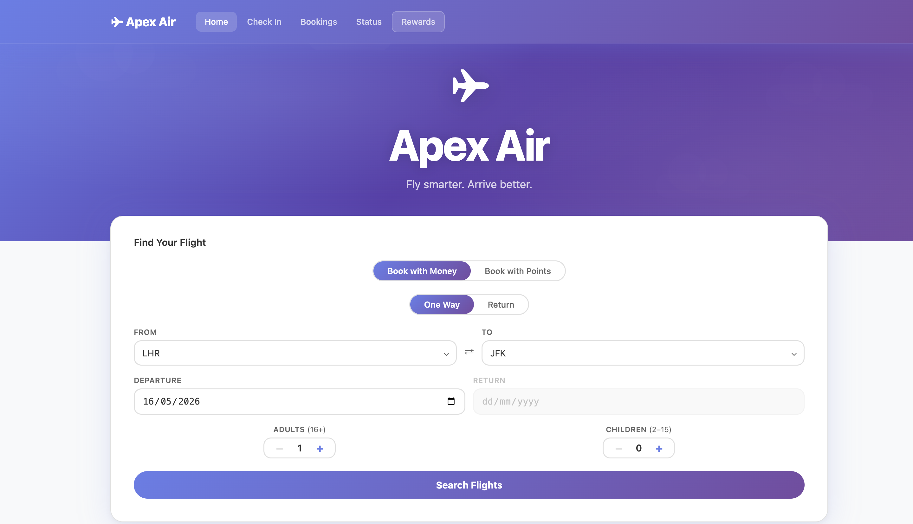</a>

### Offers and fare families

Search results are presented as a price matrix by flight and cabin (Business, Premium Economy, Economy, plus First on selected routes). Each priced offer is persisted as a `StoredOffer` for 60 minutes, locking the price at search time. The Flex / Non-Flex fare family dialog surfaces refundability and changeability before the customer commits.

  <a href="images/web/Offer.png">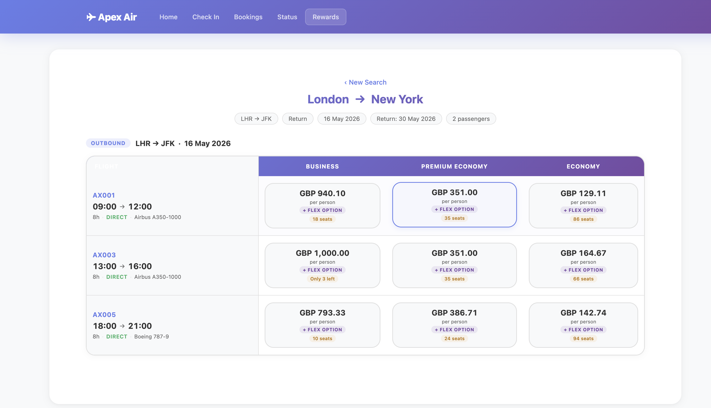</a>
  

### Flight summary and tax breakdown

A consolidated itinerary view summarises the chosen flights, fare totals and a fully itemised tax and surcharge breakdown by segment (for example GB Air Passenger Duty, YQ fuel surcharge).

  
  

### Passenger details and special service requests

Passenger capture covers name, date of birth, gender and an optional loyalty number, plus contact details for the booking. Special service requests (SSRs) such as Wheelchair Assistance (WCHR) are captured inline and propagated to the manifest. Allowed SSR codes follow IATA four-character standards.

  

### Seat selection

Aircraft-specific seatmaps render Business, Premium Economy and Economy cabins. Seats are colour-coded for availability and selection. Premium-cabin seats are included in the fare at no ancillary charge; Economy and Premium Economy seats are priced by position.

  <a href="images/web/Seatmap.png">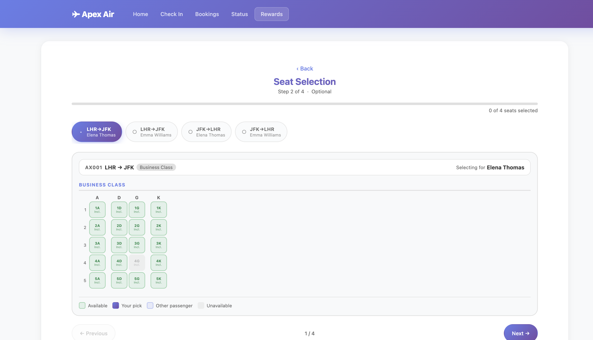</a>

### Baggage allowance

Customers can keep the included allowance or buy +1, +2 or +3 additional bags per segment, per passenger. Free allowance, weight limit and incremental pricing are driven by Bag Policy and Bag Pricing configuration.

  <a href="images/web/Bags.png">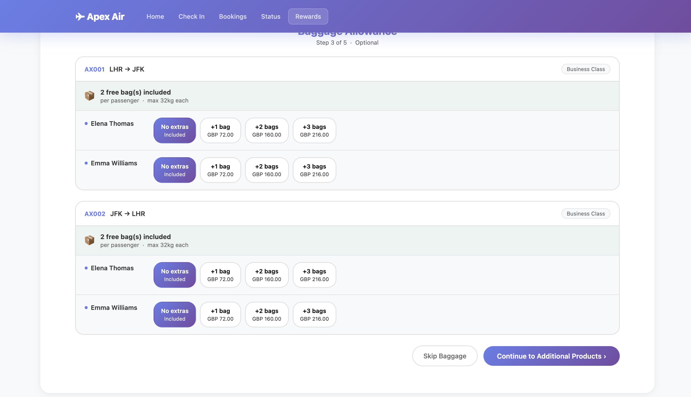</a>

### Ancillary products

A merchandising catalogue runs alongside the booking flow with grouped product categories such as Welcome On Board, Duty Free, At The Airport and Pre Paid Meals. Examples shown include amenity packs, chocolates, champagne at seat, sleep suits, duty-free fragrance and aviator sunglasses.

  <a href="images/web/Products.png">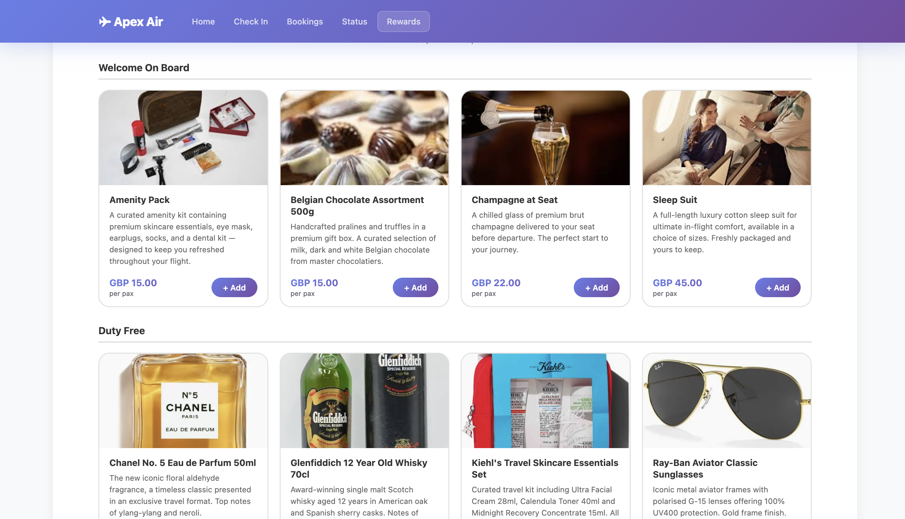</a>

### Booking confirmation

A confirmed booking returns a six-character booking reference and a clean itinerary summary, with seat assignments per passenger per segment.

  

---

## 3. Customer website (mobile)

The same booking journey is fully responsive. All steps adapt to narrow viewports without sacrificing functionality: search, fare family selection, passenger details, seatmap, baggage, payment and confirmation.

  <a href="images/app/Search.png">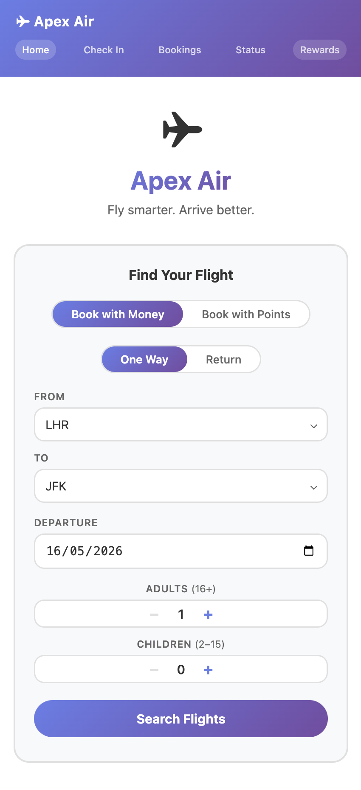</a>
  <a href="images/app/Offer.png">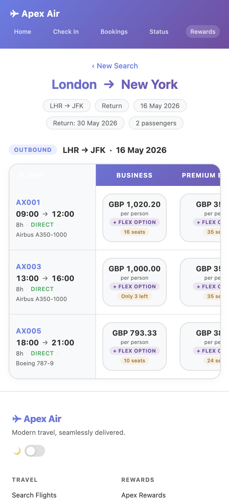</a>
  
  

  <a href="images/app/Seatmap.png">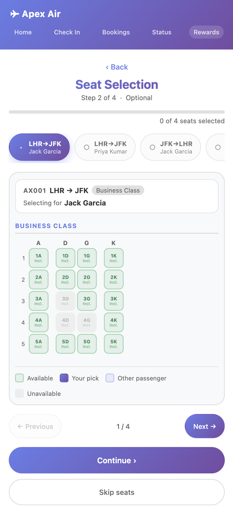</a>
  <a href="images/app/Baggage.png">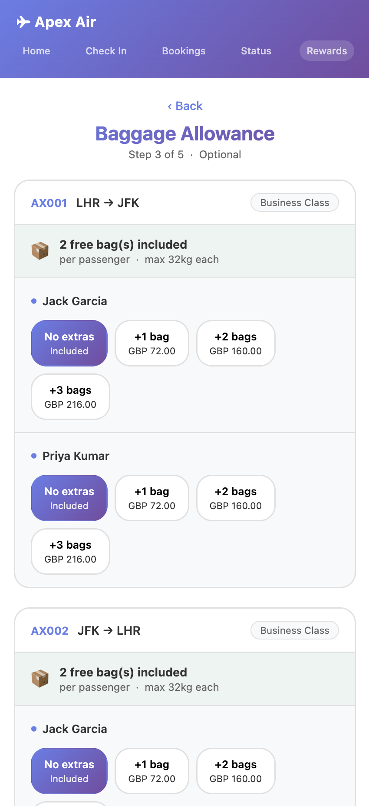</a>
  <a href="images/app/Products.png">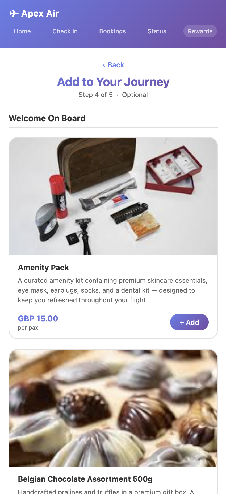</a>
  

### Secure payment

PAN, expiry and CVV capture sit in a clearly scoped secure payment surface. PCI DSS scope is contained, card data is not stored, and authorisation and settlement are recorded on an immutable payment event log.

  <a href="images/app/Payment.png">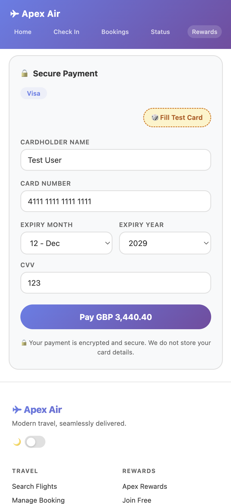</a>
  

---

## 4. Online check-in

Online check-in (OLCI) opens 24 hours before departure (presented to customers as a 48 hours to 1 hour window for retrieval). The flow captures Advance Passenger Information (APIS) where required, allows free-of-charge seat assignment, supports bag additions and ends with an IATA Bar Coded Boarding Pass (BCBP) per passenger per segment.

### Find the booking

Passengers retrieve the booking using booking reference, lead passenger name and departure airport.

  <a href="images/app/OCI.png">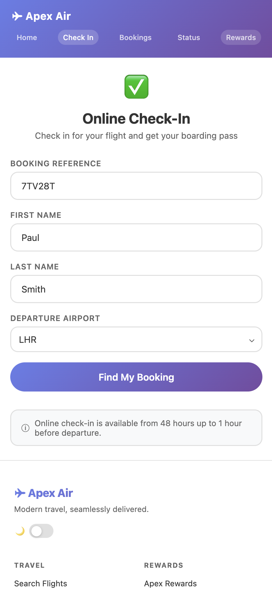</a>

### Passenger and travel document capture

Passport details (document type, number, issuing country, nationality, issue and expiry dates) are captured per passenger and validated before submission. If the lead passenger is logged into their loyalty profile, stored travel document data pre-fills the form.

  
  

### Dangerous Goods declaration

Before completion, the passenger is shown a prohibited-and-restricted items declaration and must confirm before the check-in is committed.

  

### Boarding passes

On successful check-in, each passenger receives a boarding pass with the IATA BCBP QR code, seat, sequence number, cabin and flight details. Boarding passes are paginated across passengers and segments.

  

---

## 5. Manage Booking

Manage Booking is gated by a two-step identity challenge (booking reference plus name) which mints a short-lived 60-minute JWT scoped to the booking. The token is held in `sessionStorage` and cleared on tab close.

Once authenticated, customers can:

- Review the full itinerary, fares, seats and ticket totals
- Add or change bags (post-sale, with payment)
- Change seats
- Voluntarily change flights (reshop and add-collect)
- Voluntarily cancel and request a refund (subject to fare conditions)

  

---

## 6. Loyalty programme

A full loyalty programme runs alongside the retail flow, with member-facing registration, authentication and account management, and an internal points ledger.

- Tiered membership (for example Blue, Silver, Gold)
- Member registration with email verification
- Login, token refresh, password reset and two-step email change
- Points earned automatically from the `OrderConfirmed` event
- Reward bookings priced in points, with two-stage authorise/settle and tax-only card payment
- Append-only points ledger covering accrual, redemption, adjustment and expiry
- Tier evaluation against configurable thresholds (`TierProgressPoints`)

Reward booking is exposed on the public website via a "Book with Points" toggle on the search form.

---

## 7. Contact centre and back office terminal

The Apex Air Terminal is the back office workspace used by contact centre agents, airport staff and operations and configuration teams. It is built for efficiency: dense information display, consistent table patterns, keyboard-friendly navigation and a collapsible sidebar.

The sidebar groups capability into Operations (Stock Keeper, New Order, Order, Payments, Order Accounting, Customer), Departure Control (Check In, Flight Management, Watchlist) and Schedule & Fares, Ancillaries, and Administration (Schedules, Fare Families, Fare Rules, Bag Policy, Bag Pricing, Seating, Product Groups, Products, Service catalogue, Users).

A theme toggle switches between light and dark; an API Debug panel exposes the calls made by the current page for support purposes.

### New Order (agent-assisted booking)

Agents can build a booking end to end on a single screen, with flight search, passenger details and basket all visible at once. Standby bookings (no inventory consumption, queued to a hold list) are supported alongside firm bookings.

  

### Order Management

A confirmed order view shows the booking reference, ticketing time limit, passengers, order items (flights, seats, bags, ancillaries), payments, history, ticket and EMD documents, and notes. Each order item carries its own price, tax, total and status.

  

### Ticket and EMD detail

Tickets are issued in IATA format with a 3-digit airline code prefix (932 for Apex Air). Each ticket exposes its base fare, taxes, fare calculation line, form of payment, and the per-coupon breakdown for each flight segment, including cabin, fare basis, seat and status.

  

### Loyalty customer management

Loyalty members can be searched by name, loyalty number or tier. The customer profile consolidates personal details, address, travel documents, loyalty tier and status, transactions, orders and operational notes. Customer accounts can be edited, deactivated or deleted from the same surface (with role-based access control).

  
  <a href="images/terminal/Customer.png">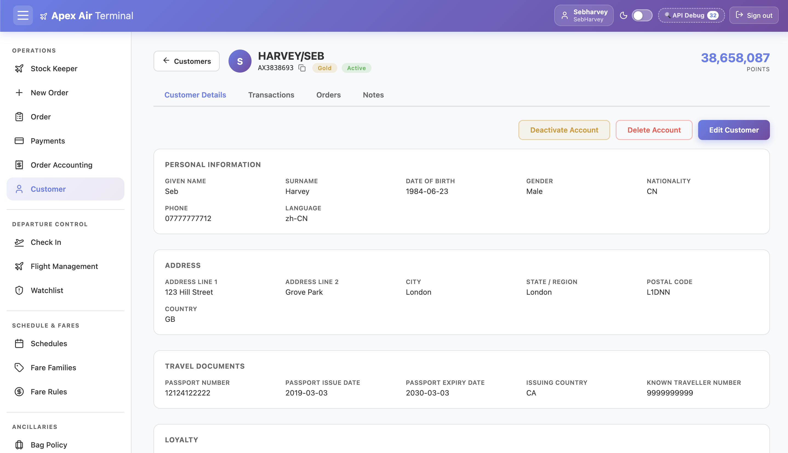</a>

---

## 8. Inventory, schedules and fares

### Stock Keeper

Stock Keeper is the daily inventory cockpit. For any departure date it lists every flight with route, departure and arrival times, aircraft type, available-by-cabin breakdown (F / J / W / Y), load percentage and ticketing status (Active, Ticketing Closed). Cabin cells turn red when availability falls below a configurable threshold.

  

### Flight Management

Flight Management is the operational view of the day's flights, including registration (tail), gate assignment, load and status. Flights can be pinned for quick access, and the date picker lets agents step day by day. Gates can be set and disruption events raised from this screen.

  

### Schedule import via IATA SSIM

Schedules can be imported in bulk from a standard IATA SSIM Chapter 7 file, with a file preview before commit. Imported schedules generate the corresponding flight inventory and base fares automatically. Schedule groups (for example "Winter 2027") let operations swap or replace seasons cleanly.

  

### Fare Rules

Fare Rules are configured per rule type (Money or Points), with cabin, booking class, fare family and an optional flight number. Each rule defines currency, minimum and maximum amounts, tax lines (such as GB APD and YQ surcharge) and conditions and fees (for example change fee).

  

---

## 9. Ancillaries and merchandising

### Product catalogue

The product catalogue holds every sellable ancillary outside of seats and bags. Each product carries a name, description, image, group (such as Welcome On Board, Duty Free, At The Airport, Pre Paid Meals), price (with multi-currency support), availability status, an optional segment-specific flag and an optional SSR code (for example CHML for child meal).

  

### Channel and condition rules

Each product can be made available on any combination of channels (Web, App, NDC, GDS, Kiosk, Contact Centre, Airport) and gated by conditions such as departure airport, route or cabin. Conditions are combined with AND inside a rule, with OR between rules. If no rules are configured, the product is always available.

  

### Service catalogue (SSR)

The Service catalogue manages IATA Special Service Request codes used across the booking, manage booking and check-in journeys. Codes are categorised (Accessibility, Meal, Mobility, Medical, Assistance) and can be activated or deactivated without code changes.

  <a href="images/terminal/Services.png">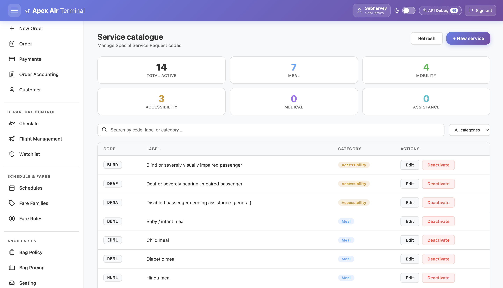</a>

---

## 10. Departure control

### Agent check-in

Airport and contact centre staff can check passengers in on their behalf, capture travel documents, scan passports, manage baggage and assign seats. Previous check-in activity per passenger and flight is surfaced alongside the form.

  

### Departure control screen

The departure control view aggregates everything needed to manage a single flight: total, checked-in, confirmed and standby counts; per-cabin booked vs capacity; passenger list grouped by booking with cabin, fare class, e-ticket and SSR; and a live seatmap showing open, booked, checked-in and held seats. Auto-assign and seat hold actions are available from the same screen.

  

---

## 11. Disruption handling (IROPS)

Apex Air ingests IROPS events (delays and cancellations) from an external Flight Operations System through the Operations API. The platform then orchestrates the response across the Offer, Order and Delivery microservices.

For a flight delay, the new times propagate through the affected orders, manifests and downstream documents. For a flight cancellation, passengers are asynchronously rebooked onto available inventory using a deterministic prioritisation: cabin class, then loyalty tier, then booking date. A `disruptionEventId` is used for idempotency, so repeated FOS notifications do not duplicate effects. Fare change restrictions are waived when the rebooking reason is `FlightCancellation`.

---

## 12. Standards, architecture and platform

### Standards

- **IATA ONE Order** — a single order record holds flights and ancillaries with a unified payment record.
- **IATA NDC** — `AirShopping`, `OfferPrice`, `OrderCreate` and related message patterns underpin the retail flow.
- **IATA SSIM Chapter 7** — bulk schedule import format.
- **IATA BCBP (Resolution 792)** — bar-coded boarding pass format.
- **IATA SSR codes** — four-character special service request codes (for example WCHR, VGML, CHML).
- **APIS** — Advance Passenger Information System capture at check-in.

### Architecture

The system follows a clean orchestration pattern. Channel apps talk to orchestration APIs (Retail, Loyalty, Airport, Finance, Operations, Admin), which coordinate the underlying microservices. Microservices never call each other directly; each domain owns its database and is reached only through its own API.

| Microservice | Responsibility |
|---|---|
| Offer | Flight inventory, fares, stored offers, seat offers |
| Order | Basket lifecycle, confirmed orders, post-sale changes, check-in recording |
| Payment | Card authorisation, settlement, refunds and an immutable audit log |
| Delivery | E-tickets, EMDs, flight manifests, boarding cards |
| Customer | Loyalty profiles, points ledger, tier management |
| Accounting | Revenue recording, refund tracking, points liability, reporting |
| Ancillary | Seatmap definitions, fleet-wide seat pricing, bag policies and pricing |
| Schedule | Schedule definitions and bulk inventory generation |
| Identity | Loyalty member credentials and sessions (Argon2id, JWT, refresh-token rotation) |
| User | Internal staff credentials and account lockout |
| Loyalty (orch.) | Member registration, authentication and points operations |
| Admin | Internal staff authentication and back-office entry point |

### Platform

- C# Azure Functions (isolated worker) for every microservice.
- Single Azure SQL Server with logical schema separation (`offer.*`, `order.*`, `payment.*`, etc.).
- Angular 21 standalone components for both the customer website and the back office Terminal, hosted as Azure Static Web Apps.
- Azure Key Vault for secrets, with `x-functions-key` host-key authentication between orchestration and microservices.
- Optimistic concurrency control on booking and ticket records via an integer `Version` column.
- 60-minute offer expiry, atomic offer consumption, and a background purge job for expired baskets.
- JSON columns are `NVARCHAR(MAX)` with `ISJSON` check constraints; indexed JSON properties are exposed as computed columns.
