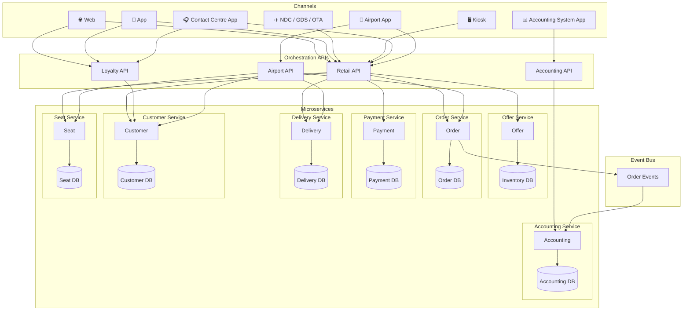
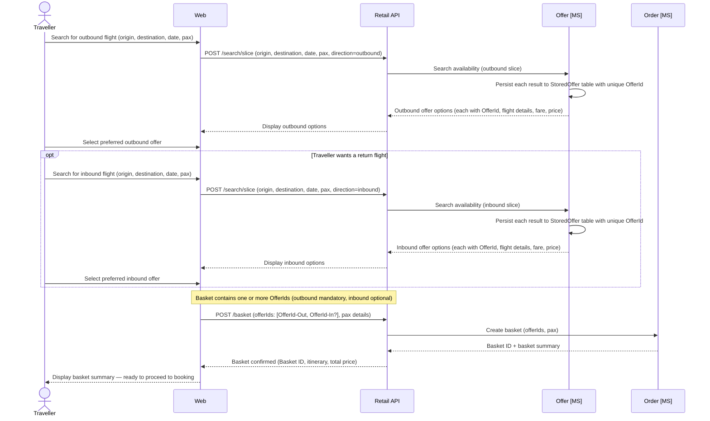
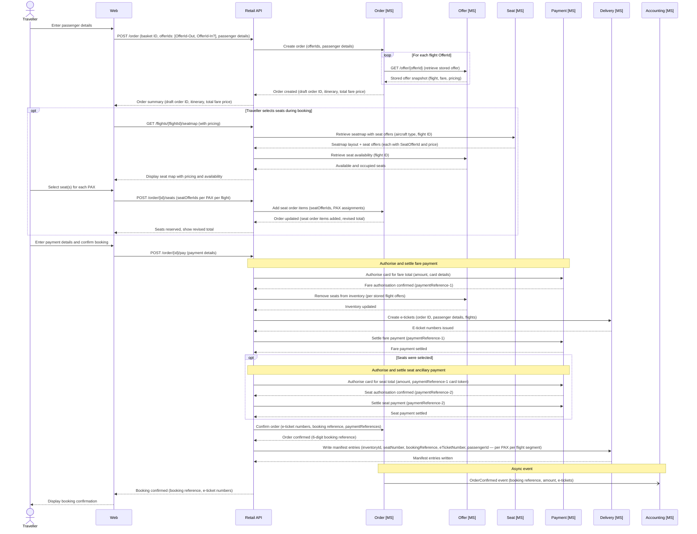
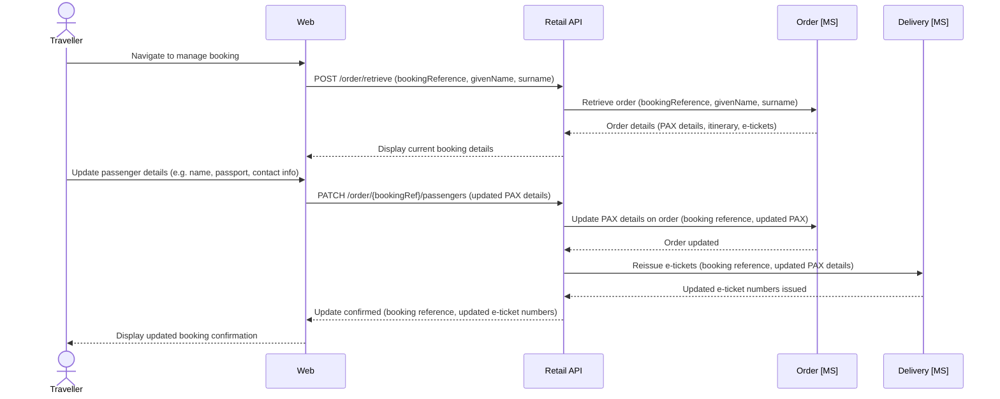
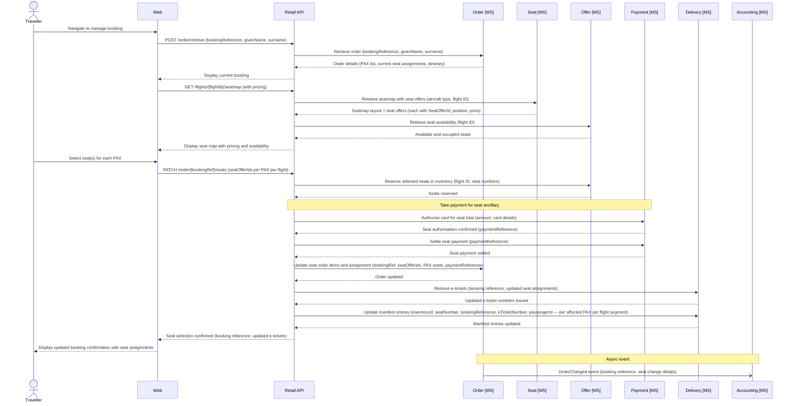
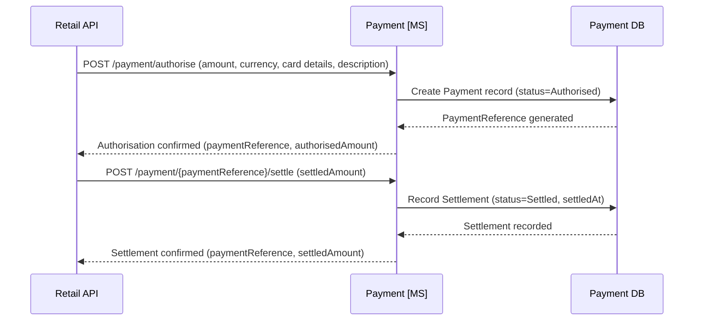
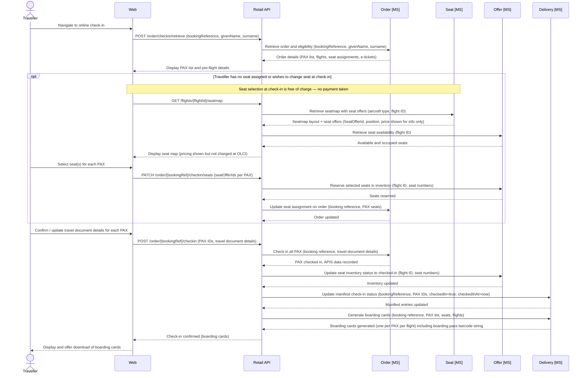
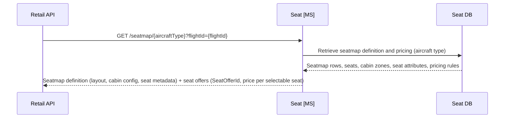

# System Architecture - Design

## Overview

This outlines the design for an airline reservation system based on offer and order capability (Modern Airline Retailing).

The system will have the following core concepts.

- Offer - returns availability and pricing of the airlines flights
- Order - creates, modifies, and cancels orders (bookings on the plane) based on the offer, with passenger information included, takes payment, and manages all post-booking changes including passenger detail updates, seat changes, and cancellations
- Payment - payment orchestration, supporting credit card payments and in future other methods like PayPal and ApplePay; handles multiple separate authorisations and settlements within a single booking (e.g. fares ticketed separately from ancillary seat purchases)
- Delivery - Akin to departure control, including online check in (OLCI), irregular operations (IROPS), seat allocation, gate management
- Customer - loyalty accounts for customers - with customer details, points balances, and transaction (historical and future orders)
- Accounting - accounting system - keeping a track of all orders, refunds, balance sheets, profit and loss.
- Seat - manages seatmap definitions per aircraft type; provides seatmap views and seat pricing to other services and channels (does not manage seat selection or inventory)

Please note (these one-name capability 'domain names' should be used for domain naming in the code)

## High level system architecture



Key components:

- Channels
  - Web
  - App
  - NDC (XML APIs based on IATA NDC standard for GDS and other airlines (OTAs) to connect to)
  - Kiosk (self service airport check in terminals)
  - Contact Centre App (for new bookings, IROPS management, customer account management)
  - Airport App (for airport staff to manage non-OLCI check in, and gate management, seat assignment, etc)
  - Accounting System App
- Orchestration APIs (these act as the APIs to connect the channels to the microservices)
  - Retail API (for web, app, NDC, kiosk, contact centre app, airport app)
  - Loyalty API (for web, app, contact centre)
  - Airport API (for Airport App)
  - Accounting API (for accounting system app)
- Microservices (and their data-bound databases)
  - Offer
    - Inventory DB
  - Order (handles creating, modifying, and cancelling orders; owns all post-booking changes including PAX updates, seat changes, and cancellations)
    - Order DB
  - Payment
    - Payment DB
  - Delivery
    - Delivery DB
  - Customer
    - Customer DB
  - Accounting (order events are published by the Order microservice to this service via the event bus)
    - Accounting DB
  - Seat (manages seatmap definitions and seat pricing per aircraft type; provides seatmap views and seat offers to channels — seat selection and inventory remain with Offer)
    - Seat DB

# Capability

## Offer

### Search

The search flow is built around the concept of a **slice** — a single directional search (outbound or inbound). The customer searches for each slice independently. Each search returns a set of offers; those offers are persisted immediately to the `StoredOffer` table so that pricing is locked at the point of offer creation. The customer selects one offer per slice, and the resulting `OfferIds` are passed through to the basket and ultimately to the Order API.

This ensures price integrity: the Order API retrieves the stored offer by `OfferId` rather than re-pricing, so the fare the customer saw is guaranteed to be the fare charged — regardless of how much time elapses during payment.



### Data Schema — Offer

The Offer domain maintains three tables. `FlightInventory` tracks available seat capacity per flight and cabin. `Fare` records fare basis, pricing, and conditions per inventory record. `StoredOffer` persists the specific offer returned to a customer at search time, capturing the exact fare, flight, and pricing snapshot so that price integrity is maintained through to order creation.

```sql
-- offer.FlightInventory
-- One row per flight leg per cabin class
CREATE TABLE offer.FlightInventory (
    InventoryId       UNIQUEIDENTIFIER  NOT NULL DEFAULT NEWID() PRIMARY KEY,
    FlightNumber      VARCHAR(10)       NOT NULL,   -- e.g. AX001
    DepartureDate     DATE              NOT NULL,
    Origin            CHAR(3)           NOT NULL,   -- IATA airport code
    Destination       CHAR(3)           NOT NULL,
    AircraftType      VARCHAR(4)        NOT NULL,   -- IATA-style 4-char code: manufacturer prefix + 3-digit variant, e.g. A351, B789
    CabinCode         CHAR(1)           NOT NULL,   -- F, J, W, Y
    TotalSeats        SMALLINT          NOT NULL,
    SeatsAvailable    SMALLINT          NOT NULL,
    SeatsSold         SMALLINT          NOT NULL DEFAULT 0,
    SeatsHeld         SMALLINT          NOT NULL DEFAULT 0,  -- seats held in baskets, not yet ticketed
    UpdatedAt         DATETIME2         NOT NULL DEFAULT SYSUTCDATETIME()
);

CREATE INDEX IX_FlightInventory_Flight
    ON offer.FlightInventory (FlightNumber, DepartureDate, CabinCode);

-- offer.Fare
-- One row per fare offering, linked to a flight inventory record.
-- Pricing is broken into base fare, taxes, and total for accounting clarity.
CREATE TABLE offer.Fare (
    FareId            UNIQUEIDENTIFIER  NOT NULL DEFAULT NEWID() PRIMARY KEY,
    InventoryId       UNIQUEIDENTIFIER  NOT NULL REFERENCES offer.FlightInventory(InventoryId),
    FareBasisCode     VARCHAR(20)       NOT NULL,   -- e.g. YLOWUK, JFLEXGB
    FareFamily        VARCHAR(50)       NULL,       -- e.g. Economy Light, Business Flex
    CabinCode         CHAR(1)           NOT NULL,
    BookingClass      CHAR(2)           NOT NULL,   -- revenue management booking class, e.g. Y, B, J
    CurrencyCode      CHAR(3)           NOT NULL DEFAULT 'GBP',
    BaseFareAmount    DECIMAL(10,2)     NOT NULL,
    TaxAmount         DECIMAL(10,2)     NOT NULL,
    TotalAmount       DECIMAL(10,2)     NOT NULL,   -- BaseFareAmount + TaxAmount
    IsRefundable      BIT               NOT NULL DEFAULT 0,
    IsChangeable      BIT               NOT NULL DEFAULT 0,
    ValidFrom         DATETIME2         NOT NULL,
    ValidTo           DATETIME2         NOT NULL
);

-- offer.StoredOffer
-- One row per offer presented to a customer during search. Captures a point-in-time
-- snapshot of the flight and fare so that price is honoured when the order is placed,
-- regardless of subsequent fare changes. OfferIds are passed into the basket and Order API.
CREATE TABLE offer.StoredOffer (
    OfferId           UNIQUEIDENTIFIER  NOT NULL DEFAULT NEWID() PRIMARY KEY,
    InventoryId       UNIQUEIDENTIFIER  NOT NULL REFERENCES offer.FlightInventory(InventoryId),
    FareId            UNIQUEIDENTIFIER  NOT NULL REFERENCES offer.Fare(FareId),
    FlightNumber      VARCHAR(10)       NOT NULL,
    DepartureDate     DATE              NOT NULL,
    Origin            CHAR(3)           NOT NULL,
    Destination       CHAR(3)           NOT NULL,
    AircraftType      VARCHAR(4)        NOT NULL,
    CabinCode         CHAR(1)           NOT NULL,
    BookingClass      CHAR(2)           NOT NULL,
    FareBasisCode     VARCHAR(20)       NOT NULL,
    FareFamily        VARCHAR(50)       NULL,
    CurrencyCode      CHAR(3)           NOT NULL DEFAULT 'GBP',
    BaseFareAmount    DECIMAL(10,2)     NOT NULL,
    TaxAmount         DECIMAL(10,2)     NOT NULL,
    TotalAmount       DECIMAL(10,2)     NOT NULL,
    IsRefundable      BIT               NOT NULL DEFAULT 0,
    IsChangeable      BIT               NOT NULL DEFAULT 0,
    CreatedAt         DATETIME2         NOT NULL DEFAULT SYSUTCDATETIME(),
    ExpiresAt         DATETIME2         NOT NULL,   -- offer expiry; Order API should reject expired offers
    IsConsumed        BIT               NOT NULL DEFAULT 0  -- set to 1 once retrieved by Order API
);

CREATE INDEX IX_StoredOffer_Expiry
    ON offer.StoredOffer (ExpiresAt)
    WHERE IsConsumed = 0;
```

-----

## Order

### Create

The Order API accepts an array of `OfferIds` from the basket (one per slice). For each `OfferId`, it calls the Offer microservice to retrieve the stored offer snapshot, using that data to populate the order items. This ensures the price and fare conditions recorded on the order exactly match what the customer was shown at search time.

The Order microservice is the single owner of order state throughout its full lifecycle — from draft through to confirmation, post-booking changes (PAX updates, seat changes), and cancellation. All state-changing operations publish events to the event bus for downstream consumption by the Accounting microservice.



### Data Schema — Order

The Order domain follows the IATA ONE Order model. The `Order` table holds scalar fields used for querying, routing, reporting, and event publishing. The full order detail — passengers, flight segments, order items, fares, seat assignments, e-tickets, payments, and audit history — is stored as a JSON document in the `OrderData` column. Fields that exist as typed columns on the table (such as `OrderId`, `BookingReference`, `OrderStatus`, `ChannelCode`, `CurrencyCode`, and `TotalAmount`) are intentionally excluded from the JSON document to avoid duplication.

```sql
-- order.Order
-- Root order record. OrderData holds the full ONE Order document as JSON.
-- Scalar fields used for indexed lookups, routing, and eventing are stored as columns.
-- Fields present as columns are NOT duplicated inside OrderData.
CREATE TABLE order.Order (
    OrderId           UNIQUEIDENTIFIER  NOT NULL DEFAULT NEWID() PRIMARY KEY,
    BookingReference  CHAR(6)           NULL,        -- populated on confirmation, e.g. AB1234
    OrderStatus       VARCHAR(20)       NOT NULL DEFAULT 'Draft',
                                                     -- Draft | Confirmed | Changed | Cancelled
    ChannelCode       VARCHAR(20)       NOT NULL,    -- WEB | APP | NDC | KIOSK | CC | AIRPORT
    CurrencyCode      CHAR(3)           NOT NULL DEFAULT 'GBP',
    TotalAmount       DECIMAL(10,2)     NULL,
    CreatedAt         DATETIME2         NOT NULL DEFAULT SYSUTCDATETIME(),
    UpdatedAt         DATETIME2         NOT NULL DEFAULT SYSUTCDATETIME(),
    OrderData         NVARCHAR(MAX)     NOT NULL     -- JSON: full ONE Order document (see below)

    CONSTRAINT CHK_OrderData CHECK (ISJSON(OrderData) = 1)
);

CREATE UNIQUE INDEX IX_Order_BookingReference
    ON order.Order (BookingReference)
    WHERE BookingReference IS NOT NULL;
```

**Example `OrderData` JSON document**

The JSON structure is aligned to IATA ONE Order concepts. Scalar identifiers and status fields that exist as typed columns on the `order.Order` table (`orderId`, `bookingReference`, `orderStatus`, `channel`, `currency`, `totalAmount`, `createdAt`) are excluded from the JSON document — the table columns are the single source of truth for those values. The JSON carries the relational detail: passengers, flight segments, order items, payments, and audit history.

```json
{
  "dataLists": {
    "passengers": [
      {
        "passengerId": "PAX-1",
        "type": "ADT",
        "givenName": "Alex",
        "surname": "Taylor",
        "dateOfBirth": "1985-03-12",
        "gender": "Male",
        "loyaltyNumber": "AX9876543",
        "contacts": {
          "email": "alex.taylor@example.com",
          "phone": "+447700900100"
        },
        "travelDocument": {
          "type": "PASSPORT",
          "number": "PA1234567",
          "issuingCountry": "GBR",
          "expiryDate": "2030-01-01",
          "nationality": "GBR"
        }
      },
      {
        "passengerId": "PAX-2",
        "type": "ADT",
        "givenName": "Jordan",
        "surname": "Taylor",
        "dateOfBirth": "1987-07-22",
        "gender": "Female",
        "loyaltyNumber": null,
        "contacts": null,
        "travelDocument": {
          "type": "PASSPORT",
          "number": "PA7654321",
          "issuingCountry": "GBR",
          "expiryDate": "2028-06-30",
          "nationality": "GBR"
        }
      }
    ],
    "flightSegments": [
      {
        "segmentId": "SEG-1",
        "flightNumber": "AX003",
        "origin": "LHR",
        "destination": "JFK",
        "departureDateTime": "2025-08-15T11:00:00Z",
        "arrivalDateTime": "2025-08-15T14:10:00Z",
        "aircraftType": "A351",
        "operatingCarrier": "AX",
        "marketingCarrier": "AX",
        "cabinCode": "J",
        "bookingClass": "J"
      },
      {
        "segmentId": "SEG-2",
        "flightNumber": "AX004",
        "origin": "JFK",
        "destination": "LHR",
        "departureDateTime": "2025-08-25T22:00:00Z",
        "arrivalDateTime": "2025-08-26T10:15:00Z",
        "aircraftType": "A351",
        "operatingCarrier": "AX",
        "marketingCarrier": "AX",
        "cabinCode": "J",
        "bookingClass": "J"
      }
    ]
  },
  "orderItems": [
    {
      "orderItemId": "OI-1",
      "type": "Flight",
      "segmentRef": "SEG-1",
      "passengerRefs": ["PAX-1", "PAX-2"],
      "offerId": "3fa85f64-5717-4562-b3fc-2c963f66afa6",
      "fareBasisCode": "JFLEXGB",
      "fareFamily": "Business Flex",
      "unitPrice": 350.00,
      "taxes": 87.25,
      "totalPrice": 437.25,
      "isRefundable": true,
      "isChangeable": true,
      "paymentReference": "AXPAY-0001",
      "eTickets": [
        { "passengerId": "PAX-1", "eTicketNumber": "932-1234567890" },
        { "passengerId": "PAX-2", "eTicketNumber": "932-1234567891" }
      ],
      "seatAssignments": [
        { "passengerId": "PAX-1", "seatNumber": "1A" },
        { "passengerId": "PAX-2", "seatNumber": "1D" }
      ]
    },
    {
      "orderItemId": "OI-2",
      "type": "Flight",
      "segmentRef": "SEG-2",
      "passengerRefs": ["PAX-1", "PAX-2"],
      "offerId": "7cb87a21-1234-4abc-9def-1a2b3c4d5e6f",
      "fareBasisCode": "JFLEXGB",
      "fareFamily": "Business Flex",
      "unitPrice": 350.00,
      "taxes": 87.25,
      "totalPrice": 437.25,
      "isRefundable": true,
      "isChangeable": true,
      "paymentReference": "AXPAY-0001",
      "eTickets": [
        { "passengerId": "PAX-1", "eTicketNumber": "932-1234567892" },
        { "passengerId": "PAX-2", "eTicketNumber": "932-1234567893" }
      ],
      "seatAssignments": [
        { "passengerId": "PAX-1", "seatNumber": "2A" },
        { "passengerId": "PAX-2", "seatNumber": "2D" }
      ]
    },
    {
      "orderItemId": "OI-3",
      "type": "Seat",
      "segmentRef": "SEG-1",
      "passengerRefs": ["PAX-1"],
      "offerId": "a1b2c3d4-seat-4562-b3fc-000000000001",
      "seatNumber": "1A",
      "seatPosition": "Window",
      "unitPrice": 70.00,
      "taxes": 0.00,
      "totalPrice": 70.00,
      "paymentReference": "AXPAY-0002"
    },
    {
      "orderItemId": "OI-4",
      "type": "Seat",
      "segmentRef": "SEG-1",
      "passengerRefs": ["PAX-2"],
      "offerId": "a1b2c3d4-seat-4562-b3fc-000000000002",
      "seatNumber": "1D",
      "seatPosition": "Middle",
      "unitPrice": 20.00,
      "taxes": 0.00,
      "totalPrice": 20.00,
      "paymentReference": "AXPAY-0002"
    }
  ],
  "payments": [
    {
      "paymentReference": "AXPAY-0001",
      "description": "Fare — LHR-JFK-LHR, 2 PAX",
      "method": "CreditCard",
      "cardLast4": "4242",
      "cardType": "Visa",
      "authorisedAmount": 1749.00,
      "settledAmount": 1749.00,
      "currency": "GBP",
      "status": "Settled",
      "authorisedAt": "2025-06-01T10:31:00Z",
      "settledAt": "2025-06-01T10:32:00Z"
    },
    {
      "paymentReference": "AXPAY-0002",
      "description": "Seat ancillary — SEG-1, PAX-1 seat 1A, PAX-2 seat 1D",
      "method": "CreditCard",
      "cardLast4": "4242",
      "cardType": "Visa",
      "authorisedAmount": 90.00,
      "settledAmount": 90.00,
      "currency": "GBP",
      "status": "Settled",
      "authorisedAt": "2025-06-01T10:31:30Z",
      "settledAt": "2025-06-01T10:32:30Z"
    }
  ],
  "history": [
    { "event": "OrderCreated",   "at": "2025-06-01T10:30:00Z", "by": "WEB" },
    { "event": "OrderConfirmed", "at": "2025-06-01T10:32:00Z", "by": "WEB" }
  ]
}
```

-----

### Manage booking - update PAX details

Allows a traveller to correct or update passenger information on a confirmed booking — such as a name correction, updated passport details, or a change of contact information — triggering e-ticket reissuance where required.



### Manage booking - select or update seat selection

Enables a traveller to choose or change their seat assignment after booking, presenting the live seatmap with real-time availability overlaid, and updating the manifest and e-tickets upon confirmation.



## Payment

### Authorise and Settle

The Payment microservice handles all card authorisation and settlement for Apex Air transactions. A single booking may generate multiple independent payment transactions — fares are authorised and settled during ticketing, while ancillary purchases such as seat selections are authorised and settled as separate transactions. Each transaction is tracked by a unique `PaymentReference`, which is returned to the Retail API and stored against the relevant order items in the Order microservice.

The Payment DB owns the full audit trail of every authorisation and settlement event, making it the system of record for financial transactions independent of the order.



### Data Schema — Payment

The Payment domain uses two tables. `Payment` holds one row per payment transaction, tracking its lifecycle from authorisation through to settlement. `PaymentEvent` records every individual event (authorised, settled, refunded, declined) against a payment as an immutable append-only log, providing a complete audit trail. A single `Payment` may have multiple `PaymentEvent` rows — for example where a partial settlement is followed by a second settlement, or where a refund is issued.

```sql
-- payment.Payment
-- One row per payment transaction. Created at authorisation; updated at settlement.
-- PaymentReference is the external identifier shared with the Order microservice.
CREATE TABLE payment.Payment (
    PaymentId         UNIQUEIDENTIFIER  NOT NULL DEFAULT NEWID() PRIMARY KEY,
    PaymentReference  VARCHAR(20)       NOT NULL UNIQUE,  -- human-readable ref, e.g. AXPAY-0001
    BookingReference  CHAR(6)           NULL,             -- set once order is confirmed; may be null during initial auth
    PaymentType       VARCHAR(30)       NOT NULL,         -- Fare | SeatAncillary | Cancellation | Refund
    Method            VARCHAR(20)       NOT NULL,         -- CreditCard | DebitCard | PayPal | ApplePay
    CardType          VARCHAR(20)       NULL,             -- Visa | Mastercard | Amex | etc.
    CardLast4         CHAR(4)           NULL,             -- last 4 digits only; never store full PAN
    CurrencyCode      CHAR(3)           NOT NULL DEFAULT 'GBP',
    AuthorisedAmount  DECIMAL(10,2)     NOT NULL,
    SettledAmount     DECIMAL(10,2)     NULL,             -- null until settled
    Status            VARCHAR(20)       NOT NULL,         -- Authorised | Settled | PartiallySettled | Refunded | Declined | Voided
    AuthorisedAt      DATETIME2         NOT NULL DEFAULT SYSUTCDATETIME(),
    SettledAt         DATETIME2         NULL,
    Description       VARCHAR(255)      NULL,             -- human-readable description, e.g. 'Fare LHR-JFK-LHR, 2 PAX'
    CreatedAt         DATETIME2         NOT NULL DEFAULT SYSUTCDATETIME(),
    UpdatedAt         DATETIME2         NOT NULL DEFAULT SYSUTCDATETIME()
);

CREATE INDEX IX_Payment_BookingReference
    ON payment.Payment (BookingReference)
    WHERE BookingReference IS NOT NULL;

CREATE INDEX IX_Payment_PaymentReference
    ON payment.Payment (PaymentReference);

-- payment.PaymentEvent
-- Immutable append-only log of every event on a Payment record.
-- Provides full audit trail including partial settlements, refunds, and declines.
CREATE TABLE payment.PaymentEvent (
    PaymentEventId    UNIQUEIDENTIFIER  NOT NULL DEFAULT NEWID() PRIMARY KEY,
    PaymentId         UNIQUEIDENTIFIER  NOT NULL REFERENCES payment.Payment(PaymentId),
    EventType         VARCHAR(20)       NOT NULL,         -- Authorised | Settled | PartialSettlement | Refunded | Declined | Voided
    Amount            DECIMAL(10,2)     NOT NULL,
    CurrencyCode      CHAR(3)           NOT NULL DEFAULT 'GBP',
    Notes             VARCHAR(255)      NULL,             -- optional context, e.g. 'Partial seat refund row 1A'
    CreatedAt         DATETIME2         NOT NULL DEFAULT SYSUTCDATETIME()
);

CREATE INDEX IX_PaymentEvent_PaymentId
    ON payment.PaymentEvent (PaymentId);
```

> **PaymentReference format:** `PaymentReference` values follow the format `AXPAY-{sequence}` (e.g. `AXPAY-0001`). The sequence is generated by the Payment microservice at authorisation time and is guaranteed unique within the system. This reference is passed back to the Retail API and stored on each `orderItem` in `OrderData`, linking financial records to the order line items they cover.

> **PCI DSS:** Full card numbers, CVV codes, and raw processor tokens must never be stored in the Payment DB. Only `CardLast4` and `CardType` are retained. The payment processor token used during the transaction lifetime is held in memory only and discarded after settlement.

## Delivery

### Online Check In

Allows a traveller to check in for their flight from 24 hours before departure, confirming or updating travel document details for each passenger and receiving boarding cards upon completion.



### Boarding Pass Barcode String

Each boarding card issued by the Delivery microservice includes a barcode string compliant with **IATA Resolution 792** (Bar Coded Boarding Pass — BCBP). This string is used directly to generate the physical barcode on printed boarding passes and the QR code displayed in the mobile app. Both formats encode identical data; the presentation layer determines the rendering.

The format is a structured plaintext string with fixed-width and positional fields. An example for a single-leg boarding pass:

```
M1TAYLOR/ALEX        EAB1234 LHRJFKAX 0003 042J001A0001 156>518 W6042 AX 2A00000012345678 JAX7KLP2NZR901A
```

The fields break down as follows:

| Segment | Value in example | Description |
|---|---|---|
| `M1` | `M1` | Format code (`M`) + number of legs encoded (`1`) |
| `TAYLOR/ALEX` | `TAYLOR/ALEX` | Passenger name — surname / given name, padded to 20 chars |
| `EAB1234` | `EAB1234` | Electronic ticket indicator (`E`) + PNR / booking reference |
| `LHR` | `LHR` | Origin IATA airport code |
| `JFK` | `JFK` | Destination IATA airport code |
| `AX` | `AX` | Operating carrier IATA code (Apex Air) |
| `0003` | `0003` | Flight number, padded to 4 chars |
| `042` | `042` | Julian date of flight departure |
| `J` | `J` | Cabin / booking class code |
| `001A` | `001A` | Seat number, padded to 4 chars |
| `0001` | `0001` | Sequence / check-in number |
| `1` | `1` | Passenger status code (`1` = checked in) |
| `56>518` | `56>518` | Conditional item size indicator and version number (BCBP version 6) |
| `W6042` | `W6042` | Julian date of issue + ticket issuer code |
| `AX` | `AX` | Operating carrier for this leg (repeated in conditional section) |
| `2A00000012345678` | `2A00000012345678` | Frequent flyer / loyalty number |
| `JAX7KLP2NZR901A` | `JAX7KLP2NZR901A` | Airline-specific free-text data (selectee indicator, document verification, etc.) |

The Delivery microservice is responsible for assembling this string at the point of boarding card generation, drawing on data from the `FlightManifest` row and the confirmed order. The barcode string is returned in the boarding card payload alongside human-readable fields; channels render it using their preferred barcode library (e.g. PDF417 for print, QR for mobile).

### Data Schema — Delivery

The Delivery domain owns its own `Delivery DB` and is the system of record for who is on each flight and where they are sitting. The `FlightManifest` table holds one row per passenger per flight segment, populated at the point of booking confirmation and updated whenever a seat is changed post-purchase. It provides a clean, queryable view of the passenger load for a given flight — used for gate management, check-in verification, IROPS, and regulatory APIS submissions.

Seat number integrity is enforced at the application layer: before any insert or update, the Delivery microservice calls the Seat microservice to validate that the given `SeatNumber` exists on the active seatmap for the relevant aircraft type. Rows may not be written with a seat number that does not appear in the seatmap definition. This prevents manifest corruption from downstream data entry errors or stale seat references.

```sql
-- delivery.FlightManifest
-- One row per passenger per flight segment. Written at booking confirmation;
-- updated on any post-purchase seat change. SeatNumber must be a valid seat
-- from the active seatmap for the aircraft type — validated at application layer
-- before insert or update.
CREATE TABLE delivery.FlightManifest (
    ManifestId        UNIQUEIDENTIFIER  NOT NULL DEFAULT NEWID() PRIMARY KEY,
    InventoryId       UNIQUEIDENTIFIER  NOT NULL,               -- FK ref to offer.FlightInventory (cross-schema; not enforced as DB constraint)
    FlightNumber      VARCHAR(10)       NOT NULL,               -- denormalised for query convenience, e.g. AX003
    DepartureDate     DATE              NOT NULL,               -- denormalised for query convenience
    AircraftType      CHAR(4)           NOT NULL,               -- used for seatmap validation at write time
    SeatNumber        VARCHAR(5)        NOT NULL,               -- e.g. 1A, 22K — must exist on active seatmap for AircraftType
    CabinCode         CHAR(1)           NOT NULL,               -- F, J, W, Y
    BookingReference  CHAR(6)           NOT NULL,               -- e.g. AB1234
    ETicketNumber     VARCHAR(20)       NOT NULL,               -- e.g. 932-1234567890
    PassengerId       VARCHAR(20)       NOT NULL,               -- PAX reference from the order, e.g. PAX-1
    GivenName         VARCHAR(100)      NOT NULL,               -- denormalised for manifest readability
    Surname           VARCHAR(100)      NOT NULL,               -- denormalised for manifest readability
    CheckedIn         BIT               NOT NULL DEFAULT 0,
    CheckedInAt       DATETIME2         NULL,
    CreatedAt         DATETIME2         NOT NULL DEFAULT SYSUTCDATETIME(),
    UpdatedAt         DATETIME2         NOT NULL DEFAULT SYSUTCDATETIME()
);

-- Unique constraint: one seat per flight per manifest (prevents double-assignment)
CREATE UNIQUE INDEX IX_FlightManifest_Seat
    ON delivery.FlightManifest (InventoryId, SeatNumber);

-- Unique constraint: one manifest entry per PAX per flight
CREATE UNIQUE INDEX IX_FlightManifest_Pax
    ON delivery.FlightManifest (InventoryId, ETicketNumber);

-- Index to support fast flight-level manifest retrieval (gate staff, IROPS)
CREATE INDEX IX_FlightManifest_Flight
    ON delivery.FlightManifest (FlightNumber, DepartureDate);

-- Index to support lookup by booking reference (customer servicing, check-in)
CREATE INDEX IX_FlightManifest_BookingReference
    ON delivery.FlightManifest (BookingReference);
```

> **Cross-schema integrity:** `InventoryId` references `offer.FlightInventory` but is not declared as a foreign key, as the Delivery and Offer domains are logically separated (and would be physically separated in a fully isolated deployment). Referential integrity between these schemas is the responsibility of the Retail API orchestration layer, which controls the write sequence.

> **Seatmap validation:** The Delivery microservice must call `GET /seatmap/{aircraftType}` on the Seat microservice and confirm the `SeatNumber` exists in the returned cabin layout before writing any `FlightManifest` row. If the seat is not present on the active seatmap, the write must be rejected with an appropriate error. This check applies to both initial inserts (at booking confirmation) and updates (at seat changes).

## Seat

### Retrieve Seatmap and Seat Offers

The Seat microservice is the system of record for aircraft seatmap definitions and fleet-wide seat pricing. It provides the physical layout, seat attributes (class, position, extra legroom, etc.), cabin configuration, and the seat offer price for each position type. Seat prices are defined fleet-wide by position — not per flight — and apply uniformly across Premium Economy and Economy cabins. Upper Class seat selection is included in the fare and carries no ancillary charge.

Seat prices are:

| Position | Price |
|---|---|
| Window | £70.00 |
| Aisle | £50.00 |
| Middle | £20.00 |

When a channel requests a seatmap, the Seat microservice returns both the layout (consumed by the front-end seat picker) and a `seatOffer` for each selectable seat, containing a `SeatOfferId` and price. The `SeatOfferId` is passed to the Order microservice when a seat is purchased, linking the seat order item to the priced offer. The Seat microservice does **not** manage seat availability or inventory — that remains the responsibility of the Offer microservice.



### Data Schema — Seat

The Seat domain uses three tables. `AircraftType` is the root reference record. `Seatmap` holds one row per active aircraft configuration with the full cabin layout as JSON. `SeatPricing` holds the fleet-wide pricing rules by seat position and cabin, from which the Seat microservice derives the `seatOffer` price returned with each seatmap response.

```sql
-- seat.AircraftType
-- Reference table of aircraft types operated by the airline
CREATE TABLE seat.AircraftType (
    AircraftTypeCode  CHAR(4)           NOT NULL PRIMARY KEY,  -- 4-char code: manufacturer prefix + 3-digit variant, e.g. A351 (A350-1000), B789 (B787-900)
    Manufacturer      VARCHAR(50)       NOT NULL,              -- e.g. Airbus, Boeing
    FriendlyName      VARCHAR(100)      NULL,                  -- e.g. Airbus A350-1000, Boeing 787-900
    TotalSeats        SMALLINT          NOT NULL,
    IsActive          BIT               NOT NULL DEFAULT 1
);

-- seat.Seatmap
-- One row per active aircraft configuration. CabinLayout holds the full seatmap as JSON.
CREATE TABLE seat.Seatmap (
    SeatmapId         UNIQUEIDENTIFIER  NOT NULL DEFAULT NEWID() PRIMARY KEY,
    AircraftTypeCode  CHAR(4)           NOT NULL REFERENCES seat.AircraftType(AircraftTypeCode),
    Version           INT               NOT NULL DEFAULT 1,
    IsActive          BIT               NOT NULL DEFAULT 1,
    UpdatedAt         DATETIME2         NOT NULL DEFAULT SYSUTCDATETIME(),
    CabinLayout       NVARCHAR(MAX)     NOT NULL   -- JSON: full cabin and seat definitions (see below)

    CONSTRAINT CHK_CabinLayout CHECK (ISJSON(CabinLayout) = 1)
);

CREATE INDEX IX_Seatmap_AircraftType
    ON seat.Seatmap (AircraftTypeCode)
    WHERE IsActive = 1;

-- seat.SeatPricing
-- Fleet-wide seat pricing rules by cabin and seat position.
-- Applied uniformly across all aircraft and all flights.
-- Upper Class (J/F) seats carry no ancillary charge (included in fare).
CREATE TABLE seat.SeatPricing (
    SeatPricingId     UNIQUEIDENTIFIER  NOT NULL DEFAULT NEWID() PRIMARY KEY,
    CabinCode         CHAR(1)           NOT NULL,   -- W (Premium Economy) | Y (Economy)
    SeatPosition      VARCHAR(10)       NOT NULL,   -- Window | Aisle | Middle
    CurrencyCode      CHAR(3)           NOT NULL DEFAULT 'GBP',
    Price             DECIMAL(10,2)     NOT NULL,
    IsActive          BIT               NOT NULL DEFAULT 1,
    ValidFrom         DATETIME2         NOT NULL,
    ValidTo           DATETIME2         NULL,       -- null = open-ended / currently active
    UpdatedAt         DATETIME2         NOT NULL DEFAULT SYSUTCDATETIME()

    CONSTRAINT UQ_SeatPricing_CabinPosition UNIQUE (CabinCode, SeatPosition, CurrencyCode)
);

-- Example seed data (reflecting fleet-wide pricing):
-- ('W', 'Window', 'GBP', 70.00)
-- ('W', 'Aisle',  'GBP', 50.00)
-- ('W', 'Middle', 'GBP', 20.00)
-- ('Y', 'Window', 'GBP', 70.00)
-- ('Y', 'Aisle',  'GBP', 50.00)
-- ('Y', 'Middle', 'GBP', 20.00)
```

> **Seat offer generation:** When building the seatmap response, the Seat microservice joins each seat's `position` attribute against `seat.SeatPricing` for the relevant `cabinCode` to derive the price, then generates a `SeatOfferId` (a deterministic UUID based on `SeatmapId` + `SeatNumber` + current pricing version) for each selectable seat. These `SeatOfferIds` are short-lived in the same way as flight `OfferIds` — they should be treated as valid only for the duration of the current session. The Order microservice stores the `SeatOfferId` on the seat order item for traceability.

**Example `CabinLayout` JSON document**

The JSON is structured as an ordered array of cabins, each containing a column configuration and an array of rows. Each seat carries its label, position, physical attributes, and a `seatPrice` derived from `seat.SeatPricing` at the time of seatmap generation. Upper Class seats carry a `seatPrice` of `null` as selection is included in the fare. This structure is consumed directly by the front-end seat picker UI, which overlays real-time availability from the Offer microservice at query time.

```json
{
  "aircraftType": "A351",
  "version": 1,
  "totalSeats": 258,
  "cabins": [
    {
      "cabinCode": "J",
      "cabinName": "Upper Class",
      "deckLevel": "Main",
      "startRow": 1,
      "endRow": 8,
      "columns": ["A", "D", "G", "K"],
      "layout": "1-1-1-1",
      "rows": [
        {
          "rowNumber": 1,
          "seats": [
            {
              "seatNumber": "1A",
              "column": "A",
              "type": "Suite",
              "position": "Window",
              "attributes": ["ExtraLegroom", "BlockedForCrew"],
              "isSelectable": false,
              "seatOfferId": null,
              "seatPrice": null
            },
            {
              "seatNumber": "1D",
              "column": "D",
              "type": "Suite",
              "position": "Middle",
              "attributes": ["ExtraLegroom"],
              "isSelectable": true,
              "seatOfferId": null,
              "seatPrice": null
            },
            {
              "seatNumber": "1G",
              "column": "G",
              "type": "Suite",
              "position": "Middle",
              "attributes": ["ExtraLegroom"],
              "isSelectable": true,
              "seatOfferId": null,
              "seatPrice": null
            },
            {
              "seatNumber": "1K",
              "column": "K",
              "type": "Suite",
              "position": "Window",
              "attributes": ["ExtraLegroom"],
              "isSelectable": true,
              "seatOfferId": null,
              "seatPrice": null
            }
          ]
        }
      ]
    },
    {
      "cabinCode": "W",
      "cabinName": "Premium Economy",
      "deckLevel": "Main",
      "startRow": 11,
      "endRow": 18,
      "columns": ["A", "B", "C", "D", "E", "F", "G", "H", "K"],
      "layout": "3-3-3",
      "rows": [
        {
          "rowNumber": 11,
          "seats": [
            {
              "seatNumber": "11A",
              "column": "A",
              "type": "Standard",
              "position": "Window",
              "attributes": ["ExtraLegroom"],
              "isSelectable": true,
              "seatOfferId": "so-a351-11A-v1",
              "seatPrice": 70.00
            },
            {
              "seatNumber": "11B",
              "column": "B",
              "type": "Standard",
              "position": "Middle",
              "attributes": ["ExtraLegroom"],
              "isSelectable": true,
              "seatOfferId": "so-a351-11B-v1",
              "seatPrice": 20.00
            },
            {
              "seatNumber": "11C",
              "column": "C",
              "type": "Standard",
              "position": "Aisle",
              "attributes": ["ExtraLegroom"],
              "isSelectable": true,
              "seatOfferId": "so-a351-11C-v1",
              "seatPrice": 50.00
            },
            {
              "seatNumber": "11D",
              "column": "D",
              "type": "Standard",
              "position": "Aisle",
              "attributes": ["ExtraLegroom"],
              "isSelectable": true,
              "seatOfferId": "so-a351-11D-v1",
              "seatPrice": 50.00
            },
            {
              "seatNumber": "11E",
              "column": "E",
              "type": "Standard",
              "position": "Middle",
              "attributes": ["ExtraLegroom"],
              "isSelectable": true,
              "seatOfferId": "so-a351-11E-v1",
              "seatPrice": 20.00
            },
            {
              "seatNumber": "11F",
              "column": "F",
              "type": "Standard",
              "position": "Aisle",
              "attributes": ["ExtraLegroom"],
              "isSelectable": true,
              "seatOfferId": "so-a351-11F-v1",
              "seatPrice": 50.00
            },
            {
              "seatNumber": "11G",
              "column": "G",
              "type": "Standard",
              "position": "Aisle",
              "attributes": ["ExtraLegroom"],
              "isSelectable": true,
              "seatOfferId": "so-a351-11G-v1",
              "seatPrice": 50.00
            },
            {
              "seatNumber": "11H",
              "column": "H",
              "type": "Standard",
              "position": "Middle",
              "attributes": ["ExtraLegroom"],
              "isSelectable": true,
              "seatOfferId": "so-a351-11H-v1",
              "seatPrice": 20.00
            },
            {
              "seatNumber": "11K",
              "column": "K",
              "type": "Standard",
              "position": "Window",
              "attributes": ["ExtraLegroom"],
              "isSelectable": true,
              "seatOfferId": "so-a351-11K-v1",
              "seatPrice": 70.00
            }
          ]
        }
      ]
    },
    {
      "cabinCode": "Y",
      "cabinName": "Economy",
      "deckLevel": "Main",
      "startRow": 22,
      "endRow": 54,
      "columns": ["A", "B", "C", "D", "E", "F", "G", "H", "K"],
      "layout": "3-3-3",
      "rows": [
        {
          "rowNumber": 22,
          "seats": [
            {
              "seatNumber": "22A",
              "column": "A",
              "type": "Standard",
              "position": "Window",
              "attributes": ["ExtraLegroom"],
              "isSelectable": true,
              "seatOfferId": "so-a351-22A-v1",
              "seatPrice": 70.00
            },
            {
              "seatNumber": "22B",
              "column": "B",
              "type": "Standard",
              "position": "Middle",
              "attributes": ["ExtraLegroom"],
              "isSelectable": true,
              "seatOfferId": "so-a351-22B-v1",
              "seatPrice": 20.00
            },
            {
              "seatNumber": "22C",
              "column": "C",
              "type": "Standard",
              "position": "Aisle",
              "attributes": ["ExtraLegroom"],
              "isSelectable": true,
              "seatOfferId": "so-a351-22C-v1",
              "seatPrice": 50.00
            },
            {
              "seatNumber": "22D",
              "column": "D",
              "type": "Standard",
              "position": "Aisle",
              "attributes": ["ExtraLegroom"],
              "isSelectable": true,
              "seatOfferId": "so-a351-22D-v1",
              "seatPrice": 50.00
            },
            {
              "seatNumber": "22E",
              "column": "E",
              "type": "Standard",
              "position": "Middle",
              "attributes": ["ExtraLegroom"],
              "isSelectable": true,
              "seatOfferId": "so-a351-22E-v1",
              "seatPrice": 20.00
            },
            {
              "seatNumber": "22F",
              "column": "F",
              "type": "Standard",
              "position": "Aisle",
              "attributes": ["ExtraLegroom"],
              "isSelectable": true,
              "seatOfferId": "so-a351-22F-v1",
              "seatPrice": 50.00
            },
            {
              "seatNumber": "22G",
              "column": "G",
              "type": "Standard",
              "position": "Aisle",
              "attributes": ["ExtraLegroom"],
              "isSelectable": true,
              "seatOfferId": "so-a351-22G-v1",
              "seatPrice": 50.00
            },
            {
              "seatNumber": "22H",
              "column": "H",
              "type": "Standard",
              "position": "Middle",
              "attributes": ["ExtraLegroom"],
              "isSelectable": true,
              "seatOfferId": "so-a351-22H-v1",
              "seatPrice": 20.00
            },
            {
              "seatNumber": "22K",
              "column": "K",
              "type": "Standard",
              "position": "Window",
              "attributes": ["ExtraLegroom"],
              "isSelectable": true,
              "seatOfferId": "so-a351-22K-v1",
              "seatPrice": 70.00
            }
          ]
        }
      ]
    }
  ]
}
```

> **Note:** `isSelectable` reflects whether a seat is physically available for selection (i.e. not a structural no-fly zone, crew seat, or permanently blocked position). Real-time occupancy — whether a seat has been sold or held on a specific flight — is overlaid at query time from `offer.FlightInventory` and is never stored here.

-----

# Technical Considerations

- Microservices built in C# as Azure Functions (isolated)
- Databases will be built in Microsoft SQL. Ideally these would be individual, isolated, database instances, but for this project, we will use one database with key domains separated logically using the domain names and the schema.
- Front end websites, app and contact centre apps (including others) will be built using the latest version of Angular, hosted as Static Web Apps on Azure.
- **Aircraft type codes** are represented as a 4-character code consisting of the manufacturer prefix followed by a 3-digit variant number. The third digit encodes the specific variant. For example: A350-1000 → `A351`, A350-900 → `A359`, B787-900 → `B789`, B787-10 → `B781`. This convention is consistent with IATA SSIM aircraft designator standards and must be used uniformly across all services, databases, and API contracts.
- JSON columns (`OrderData`, `CabinLayout`) use SQL Server's native `NVARCHAR(MAX)` with `ISJSON` check constraints to enforce structural validity. Where query performance requires filtering or sorting on JSON properties, SQL Server computed columns with JSON path expressions should be used to create targeted indexes.
- **StoredOffer expiry:** The `offer.StoredOffer` table includes an `ExpiresAt` column. The Order API must validate that an offer has not expired before consuming it. A background job should periodically purge or archive expired, unconsumed offers to keep the table lean.
- **Offer consumption:** Once an `OfferId` is successfully retrieved by the Order API during order creation, `IsConsumed` is set to `1` on the `StoredOffer` row to prevent the same offer being used on multiple orders.
- **Payment DB:** The Payment microservice owns its own `payment.*` schema. The `PaymentReference` (e.g. `AXPAY-0001`) is the shared key between the Payment DB and the Order microservice — it is stored on each `orderItem` in `OrderData` to link order lines to their payment transactions. Multiple `PaymentReference` values may exist per booking (one per ancillary payment type). The full card token used during authorisation is never persisted; only `CardLast4` and `CardType` are stored.
- **SeatPricing:** Fleet-wide seat prices are defined in `seat.SeatPricing` and are cabin- and position-based. Upper Class seat selection carries no charge. The Seat microservice derives `seatPrice` and `seatOfferId` at seatmap generation time by joining seat position to the active pricing rules. `SeatOfferId` values are session-scoped and should not be stored long-term by channels.
- **Delivery DB:** The Delivery microservice owns its own `Delivery DB` schema (`delivery.*`). It does not read from or write to `order.Order`. Order data required for manifest population (e-ticket numbers, passenger names, seat assignments) is passed explicitly by the Retail API orchestration layer at the point of booking confirmation and subsequent seat changes.
- **FlightManifest seatmap validation:** Before writing any row to `delivery.FlightManifest`, the Delivery microservice must validate the `SeatNumber` against the active seatmap for the relevant `AircraftType` by calling the Seat microservice. Any seat number not present on the seatmap must be rejected. This validation applies to both initial writes (booking confirmation) and updates (post-purchase seat changes).

# Security Principles

All services and data stores in this system must adhere to the following baseline security standards. These apply across all environments (development, staging, production) unless explicitly noted.

## Transport Security

All communication between clients and the platform, and between internal services, must use TLS 1.2 or higher. Unencrypted HTTP must not be accepted on any endpoint in any environment. API Gateway and orchestration layer endpoints must enforce HTTPS and reject downgrade attempts. Internal service-to-service communication within the Azure private network must also use TLS.

## Encryption at Rest

All databases and storage accounts must have encryption at rest enabled using platform-managed keys as a minimum, with customer-managed keys (CMK) via Azure Key Vault required for any store holding personally identifiable information (PII) or payment data. This includes all SQL databases in the shared schema, the Delivery DB, and any blob storage used for boarding card generation or document storage.

## Authentication and Authorisation

Customer-facing APIs (Retail API, Loyalty API) must authenticate travellers using OAuth 2.0 / OpenID Connect with short-lived access tokens. Booking retrieval endpoints (manage booking, check-in) require the traveller to supply booking reference, given name, and surname — these three factors together form the access credential for unauthenticated (guest) flows and must all be validated server-side before any order data is returned. Internal service-to-service calls (orchestration layer to microservices) must use managed identities or scoped API keys; no service should be reachable without authentication. Role-based access control (RBAC) must be applied to internal tooling and airport/contact centre apps.

## PII Handling

Passenger personal data (names, dates of birth, passport numbers, contact details) must be treated as PII and handled in accordance with UK GDPR and any applicable destination-country regulations. PII must not be logged in plain text in application logs or telemetry. Log entries referencing passengers should use anonymised identifiers (e.g. `PassengerId`, `BookingReference`) rather than names or document numbers. Data retention policies must be defined per domain and enforced via automated purge jobs.

## Payment Data

Card data must never be stored or logged by any service other than the Payment microservice and its downstream payment processor. The platform must achieve and maintain PCI DSS compliance for the payment flow. Only the last four digits of a card number and the card type may be stored on the order (as currently defined in `OrderData`). Full card numbers, CVV codes, and raw authorisation tokens must not persist beyond the payment transaction.

## Input Validation and API Hardening

All API inputs must be validated at the orchestration layer before being forwarded to microservices. SQL injection and injection attacks must be mitigated through parameterised queries — no dynamic SQL construction from user input. API rate limiting must be applied to all public-facing endpoints. CORS policies must be explicitly configured and restricted to known channel origins. API contracts must reject unexpected fields (strict schema validation) to prevent mass assignment vulnerabilities.

## Secrets Management

Connection strings, API keys, and credentials must not be stored in source code, configuration files, or environment variables in plain text. All secrets must be stored in Azure Key Vault and accessed at runtime via managed identity. Secret rotation must be supported without requiring redeployment.

## Audit Logging

All state-changing operations (order creation, payment, check-in, manifest writes, PAX updates) must produce an audit log entry including the actor, timestamp, and a summary of the change. Audit logs must be immutable and retained for a minimum of 7 years in line with airline regulatory requirements. Audit logs must be stored separately from application logs and must not be accessible to application-layer services for modification.

## Vulnerability and Dependency Management

All service dependencies (NuGet packages, npm packages) must be kept up to date and scanned for known vulnerabilities as part of the CI/CD pipeline. Critical and high-severity vulnerabilities must block deployment. Penetration testing must be conducted at least annually and after significant architectural changes.

---

# Airline Context — Apex Air

This document describes the reservation system for **Apex Air**, IATA carrier code **AX**. All examples, flight numbers, carrier codes, and loyalty references throughout this document use the `AX` designator.

Apex Air is a premium transatlantic and long-haul carrier operating a fleet of approximately 50 aircraft across three types:

- **Boeing 787-9** (`B789`) — primary long-haul workhorse, used on transatlantic and Asia-Pacific routes
- **Airbus A330-900** (`A339`) — medium-to-long-haul, used on Caribbean and secondary transatlantic routes
- **Airbus A350-1000** (`A351`) — flagship widebody, used on high-demand transatlantic and key Asia routes

Apex Air's network is focused on the following key markets:

- **North America** — major gateway cities including New York (JFK), Los Angeles (LAX), Miami (MIA), Chicago (ORD), and Boston (BOS)
- **Caribbean** — leisure and VFR routes to destinations including Barbados (BGI), Jamaica (KIN), and the Bahamas (NAS)
- **East Asia** — Hong Kong (HKG), Tokyo (NRT), Shanghai (PVG), and Beijing (PEK)
- **South-East Asia** — Singapore (SIN)
- **South Asia** — key Indian cities including Mumbai (BOM), Delhi (DEL), and Bangalore (BLR)

All flights operate from a single UK hub. Apex Air participates in the IATA ONE Order standard and operates a modern retailing architecture as described in this document.

---

# Glossary

- **APIS** — Advance Passenger Information System
- **BCBP** — Bar Coded Boarding Pass (IATA Resolution 792 standard for boarding pass barcode encoding)
- **CMK** — Customer-Managed Key
- **CORS** — Cross-Origin Resource Sharing
- **GDS** — Global Distribution System
- **IATA** — International Air Transport Association
- **IROPS** — Irregular Operations
- **NDC** — New Distribution Capability (IATA standard)
- **OLCI** — Online Check In
- **OTA** — Online Travel Agent
- **PAX** — Passenger
- **PCI DSS** — Payment Card Industry Data Security Standard
- **PII** — Personally Identifiable Information
- **PNR** — Passenger Name Record
- **RBAC** — Role-Based Access Control
- **TLS** — Transport Layer Security
- **UK GDPR** — United Kingdom General Data Protection Regulation
