# System Architecture - Design

## Overview

This outlines the design for an airline reservation system based on offer and order capability (Modern Airline Retailing).

The system will have the following core concepts.

- Offer - returns availability and pricing of the airlines flights.
- Order - creates, modifies, and cancels orders (bookings on the plane) based on the offer, with passenger information included, takes payment, and manages all post-booking changes including passenger detail updates, seat changes, and cancellations.
- Payment - payment orchestration, supporting credit card payments and in future other methods like PayPal and ApplePay; handles multiple separate authorisations and settlements within a single booking (e.g. fares ticketed separately from ancillary seat purchases).
- Delivery - Akin to departure control, including online check in (OLCI), irregular operations (IROPS), seat allocation, gate management.
- Customer - loyalty accounts for customers - with customer details, points balances, and transaction (historical and future orders).
- Identity - stores login credential for the customer accounts.
- Accounting - accounting system - keeping a track of all orders, refunds, balance sheets, profit and loss.
- Seat - manages seatmap definitions per aircraft type; provides seatmap views and seat pricing to other services and channels (does not manage seat selection or inventory).
- Disruption - orchestrates the response to irregular operations (IROPS) events notified by the airline's Flight Operations System (FOS). Handles flight delays (updating departure times across all affected bookings) and flight cancellations (rebooking all affected passengers onto the next available flight).

Please note (these one-name capability 'domain names' should be used for domain naming in the code)

## High level system architecture

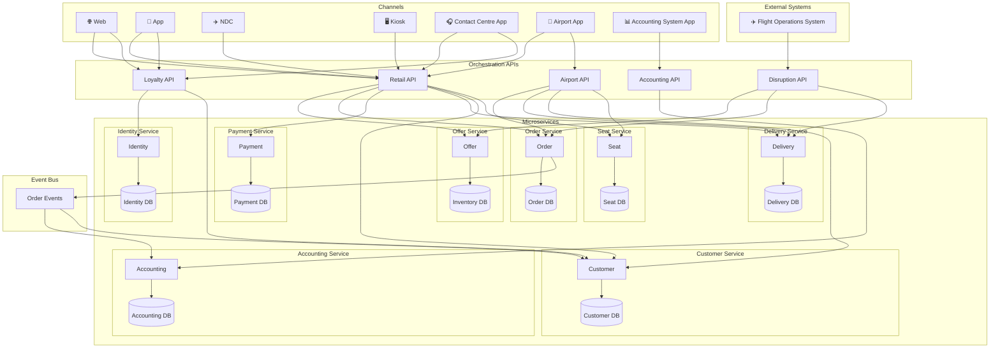

Key components:

- Channels
  - Web
  - App
  - NDC (XML APIs based on IATA NDC standard for GDS and other airlines (OTAs) to connect to)
  - Kiosk (self service airport check in terminals)
  - Contact Centre App (for new bookings, IROPS management, customer account management)
  - Airport App (for airport staff to manage non-OLCI check in, and gate management, seat assignment, etc)
  - Accounting System App
- External Systems
  - Flight Operations System (FOS) — the airline's operational system responsible for managing the live flight schedule; it notifies the reservation system of disruption events (delays and cancellations) via the Disruption API
- Orchestration APIs (these act as the APIs to connect the channels to the microservices)
  - Retail API (for web, app, NDC, kiosk, contact centre app, airport app)
  - Loyalty API (for web, app, contact centre)
  - Airport API (for Airport App)
  - Accounting API (for accounting system app)
  - Disruption API (receives disruption events from the FOS and orchestrates the response across the Offer, Order, and Delivery microservices)
- Microservices (and their data-bound databases)
  - Offer
    - Inventory DB
  - Order (handles creating, modifying, and cancelling orders; owns all post-booking changes including PAX updates, seat changes, and cancellations)
    - Order DB
  - Payment
    - Payment DB
  - Delivery
    - Delivery DB
  - Customer
    - Customer DB
  - Accounting (order events are published by the Order microservice to this service via the event bus)
    - Accounting DB
  - Seat (manages seatmap definitions and seat pricing per aircraft type; provides seatmap views and seat offers to channels — seat selection and inventory remain with Offer)
    - Seat DB

# Capability

## Cabin Classes

All Apex Air aircraft are configured with up to four cabin classes. Cabin codes are single-character identifiers used uniformly across all services, databases, and API contracts.

| Code | Name | Notes |
|------|------|-------|
| `F` | First Class | Available on selected A350-1000 (A351) long-haul routes |
| `J` | Business Class | All long-haul aircraft; seat selection included in fare at no ancillary charge |
| `W` | Premium Economy | A350-1000 (A351) and Boeing 787-9 (B789) aircraft |
| `Y` | Economy | All aircraft |

Where a cabin code appears in a schema column, API field, or JSON document, it must always be one of these four values. The `CabinCode` field is consistently typed as `CHAR(1)` across all domains.

---

## Offer

### Flight Network

Apex Air (IATA code: **AX**) operates a **hub-and-spoke** network centred on London Heathrow (**LHR**). The 2026 schedule covers five regions with the following direct routes from LHR:

| Region | Destinations | Flight Block | Aircraft |
|--------|-------------|--------------|----------|
| North America | New York JFK, Los Angeles LAX, Miami MIA, San Francisco SFO, Chicago ORD, Boston BOS | AX001–AX099 | A351, B789 |
| Caribbean | Bridgetown BGI, Kingston KIN, Nassau NAS | AX101–AX199 | A339 |
| East Asia | Hong Kong HKG, Tokyo NRT, Shanghai PVG, Beijing PEK | AX201–AX299 | A351, B789 |
| South-East Asia | Singapore SIN | AX301–AX399 | A351 |
| South Asia | Mumbai BOM, Delhi DEL, Bangalore BLR | AX401–AX499 | B789 |

Fleet summary:

- **A351** (Airbus A350-1000) — flagship widebody on highest-demand routes (LHR–JFK ×2 daily, LHR–LAX morning, LHR–SFO morning, LHR–HKG, LHR–NRT, LHR–SIN)
- **B789** (Boeing 787-9) — long-haul workhorse on remaining transatlantic, China, and India routes
- **A339** (Airbus A330-900) — medium-to-long-haul on Caribbean leisure routes

Because all scheduled routes radiate from LHR, the hub is also the natural connection point for passengers travelling between any two non-LHR cities (see [Direct and Connecting Itineraries](#direct-and-connecting-itineraries) below).

### Search

The search flow is built around the concept of a **slice** — a single directional search (outbound or inbound). The customer searches for each slice independently. Each search returns a set of offers; those offers are persisted immediately to the `StoredOffer` table so that pricing is locked at the point of offer creation. The customer selects one offer per slice, and the resulting `OfferIds` are passed through to the basket and ultimately to the Order API.

This ensures price integrity: the Order API retrieves the stored offer by `OfferId` rather than re-pricing, so the fare the customer saw is guaranteed to be the fare charged — regardless of how much time elapses during payment.

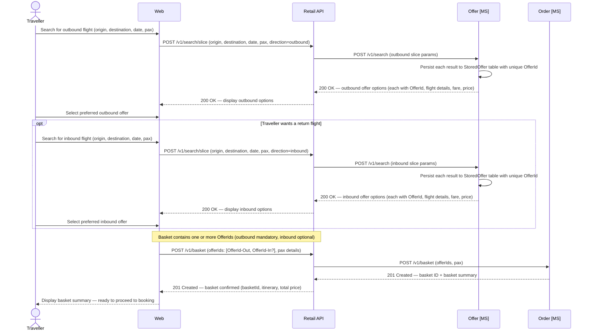

### Direct and Connecting Itineraries

#### Direct Flights

A **direct flight** is a single-segment journey served by a single Apex Air flight number. All 2026 scheduled routes operate direct from or to LHR, so any customer departing from or arriving at LHR travels on a single segment. Examples:

| Journey | Flight | Departure (local) | Arrival (local) | Aircraft |
|---------|--------|-------------------|-----------------|----------|
| LHR → JFK | AX001 | 08:00 | 11:10 | A351 |
| JFK → LHR | AX002 | 13:00 | 01:15+1 | A351 |
| LHR → DEL | AX411 | 20:30 | 09:00+1 | B789 |
| DEL → LHR | AX412 | 03:30 | 08:00 | B789 |
| LHR → SIN | AX301 | 21:30 | 17:45+1 | A351 |

For a direct flight, the Offer microservice creates one `StoredOffer` record per available cabin class, linked to a single `FlightInventory` row. The `OfferId` returned to the channel represents the complete single-segment journey.

#### Connecting Flights (Hub-and-Spoke)

A **connecting itinerary** combines two direct flights via LHR. Because the entire Apex Air network radiates from LHR, all connections must transit through the hub. For example, a passenger travelling from Delhi to New York:

```
DEL → LHR   AX412  departs DEL 03:30, arrives LHR 08:00
LHR → JFK   AX001  departs LHR 08:00, arrives JFK 11:10
```

Or in the return direction:

```
JFK → LHR   AX002  departs JFK 13:00, arrives LHR 01:15+1
LHR → DEL   AX411  departs LHR 20:30, arrives DEL 09:00+1 (+1)
```

**How connecting itineraries are modelled:** Each leg is treated as an independent offer — two `StoredOffer` records are created, one per segment, each with its own `OfferId`. The Retail API's `POST /v1/search/connecting` endpoint orchestrates the assembly: it calls the Offer MS twice (once per segment), applies minimum connect time validation, and returns the composite itinerary with two `OfferIds` to the channel. Both `OfferIds` are then placed into the basket together.

**Minimum connect time at LHR:** The Retail API enforces a minimum connection window of **60 minutes** between the inbound arrival and the outbound departure. Connecting pairs that fall below this threshold are not returned to the customer.

**Inventory:** Each leg independently tracks its own seat inventory in `offer.FlightInventory`. Holding seats for a connecting itinerary requires two separate `POST /v1/inventory/hold` calls (one per leg). If either hold fails, both must be rolled back to avoid partial reservations.

The connecting assembly logic (pairing legs, checking connect times, combining prices) is an orchestration responsibility of the Retail API layer. The Offer microservice has no concept of a multi-segment composite offer; it operates purely on individual flight segments.

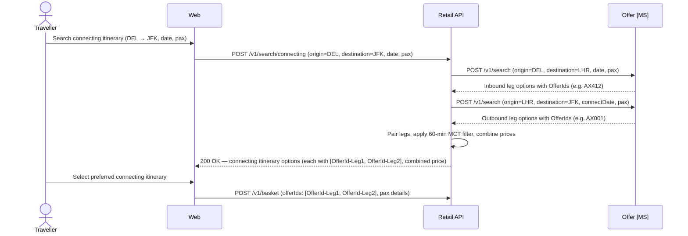

#### Code Share Flights (Future Scope)

Code share arrangements — where a flight operated by one carrier is marketed and sold under another carrier's flight number — are **not in scope for the initial release**. However, the data model should be designed now to accommodate them, to avoid breaking changes later.

When code share is introduced, the following additions will be required:

- `offer.FlightInventory`: add `OperatingCarrier CHAR(2)` and `OperatingFlightNumber VARCHAR(10)` columns to distinguish the carrier actually operating the aircraft from the marketing carrier (Apex Air, `AX`). For own-metal flights both values will be `AX` / the Apex flight number.
- `offer.StoredOffer`: add `MarketingCarrier CHAR(2)` and `OperatingCarrier CHAR(2)` snapshot columns so the offer record is fully self-contained.
- **API response schema:** The Offer MS search response and the Retail API search response should include optional `operatingCarrier` and `operatingFlightNumber` fields from day one (omitted or `null` for own-metal flights). Front-end clients must be built to handle and display the operating carrier distinction from launch, even though the values will always match the marketing carrier initially.
- **Ticketing and delivery:** E-tickets issued by the Delivery microservice will need to carry the operating carrier designator; no schema change to `delivery.FlightManifest` is anticipated as the manifest records the flight number already, but the field semantics documentation should clarify that it carries the **marketing** flight number.
- **Inventory partitioning:** When Apex Air sells seats on a partner carrier's aircraft, the inventory source will be external. A future `InventorySource` field (e.g. `OwnMetal` / `Interline` / `CodeShare`) on `FlightInventory` will be needed to route inventory queries to the correct system.

No code share work is required now, but all new schema columns and API fields introduced in this release should be named to leave clean extension points for the above.

### Data Schema — Offer

The Offer domain maintains three tables. `FlightInventory` tracks available seat capacity per flight and cabin. `Fare` records fare basis, pricing, and conditions per inventory record. `StoredOffer` persists the specific offer returned to a customer at search time, capturing the exact fare, flight, and pricing snapshot so that price integrity is maintained through to order creation.

#### `offer.FlightInventory`

| Column | Type | Nullable | Default | Key | Notes |
|---|---|---|---|---|---|
| InventoryId | UNIQUEIDENTIFIER | No | NEWID() | PK | |
| FlightNumber | VARCHAR(10) | No | | | e.g. `AX001` |
| DepartureDate | DATE | No | | | |
| Origin | CHAR(3) | No | | | IATA airport code |
| Destination | CHAR(3) | No | | | IATA airport code |
| AircraftType | VARCHAR(4) | No | | | IATA-style 4-char code, e.g. `A351`, `B789` |
| CabinCode | CHAR(1) | No | | | `F` First · `J` Business · `W` Premium Economy · `Y` Economy |
| TotalSeats | SMALLINT | No | | | Physical seat count for this cabin on this flight |
| SeatsAvailable | SMALLINT | No | | | Decremented on hold; incremented on release |
| SeatsSold | SMALLINT | No | 0 | | Incremented on ticket issuance |
| SeatsHeld | SMALLINT | No | 0 | | Seats held in active baskets, not yet ticketed |
| UpdatedAt | DATETIME2 | No | SYSUTCDATETIME() | | |

> **Indexes:** `IX_FlightInventory_Flight` on `(FlightNumber, DepartureDate, CabinCode)`.
> **Inventory integrity:** `SeatsAvailable + SeatsSold + SeatsHeld = TotalSeats` must be maintained by the Offer microservice on every inventory mutation. There is no DB-level check constraint enforcing this; the application layer is solely responsible for keeping these counts consistent.

#### `offer.Fare`

| Column | Type | Nullable | Default | Key | Notes |
|---|---|---|---|---|---|
| FareId | UNIQUEIDENTIFIER | No | NEWID() | PK | |
| InventoryId | UNIQUEIDENTIFIER | No | | FK → `offer.FlightInventory(InventoryId)` | |
| FareBasisCode | VARCHAR(20) | No | | | Revenue management fare basis code, e.g. `YLOWUK`, `JFLEXGB` |
| FareFamily | VARCHAR(50) | Yes | | | Commercial product name, e.g. `Economy Light`, `Business Flex` |
| CabinCode | CHAR(1) | No | | | `F` · `J` · `W` · `Y` |
| BookingClass | CHAR(2) | No | | | Revenue management booking class, e.g. `Y`, `B`, `J` |
| CurrencyCode | CHAR(3) | No | `'GBP'` | | ISO 4217 |
| BaseFareAmount | DECIMAL(10,2) | No | | | Carrier base fare, excluding taxes |
| TaxAmount | DECIMAL(10,2) | No | | | Total taxes and surcharges |
| TotalAmount | DECIMAL(10,2) | No | | | `BaseFareAmount + TaxAmount`; stored explicitly for query efficiency |
| IsRefundable | BIT | No | 0 | | Whether the fare permits a refund on voluntary cancellation |
| IsChangeable | BIT | No | 0 | | Whether the fare permits a voluntary flight change |
| ValidFrom | DATETIME2 | No | | | Fare validity window start |
| ValidTo | DATETIME2 | No | | | Fare validity window end |

> **Note:** `ChangeFee` and `CancellationFee` amounts are not currently stored on this table. If fine-grained fee amounts are required at query time (rather than being looked up from external fare rules), additional columns should be added here.

#### `offer.StoredOffer`

| Column | Type | Nullable | Default | Key | Notes |
|---|---|---|---|---|---|
| OfferId | UNIQUEIDENTIFIER | No | NEWID() | PK | Returned to channel at search time; passed to basket and Order MS to lock pricing |
| InventoryId | UNIQUEIDENTIFIER | No | | FK → `offer.FlightInventory(InventoryId)` | |
| FareId | UNIQUEIDENTIFIER | No | | FK → `offer.Fare(FareId)` | |
| FlightNumber | VARCHAR(10) | No | | | Denormalised snapshot |
| DepartureDate | DATE | No | | | Denormalised snapshot |
| Origin | CHAR(3) | No | | | Denormalised snapshot, IATA code |
| Destination | CHAR(3) | No | | | Denormalised snapshot, IATA code |
| AircraftType | VARCHAR(4) | No | | | Denormalised snapshot |
| CabinCode | CHAR(1) | No | | | Denormalised snapshot |
| BookingClass | CHAR(2) | No | | | Denormalised snapshot |
| FareBasisCode | VARCHAR(20) | No | | | Denormalised snapshot |
| FareFamily | VARCHAR(50) | Yes | | | Denormalised snapshot |
| CurrencyCode | CHAR(3) | No | `'GBP'` | | ISO 4217 |
| BaseFareAmount | DECIMAL(10,2) | No | | | Price at time offer was created |
| TaxAmount | DECIMAL(10,2) | No | | | Taxes at time offer was created |
| TotalAmount | DECIMAL(10,2) | No | | | Total at time offer was created |
| IsRefundable | BIT | No | 0 | | Fare conditions at time of offer creation |
| IsChangeable | BIT | No | 0 | | Fare conditions at time of offer creation |
| CreatedAt | DATETIME2 | No | SYSUTCDATETIME() | | |
| ExpiresAt | DATETIME2 | No | | | Offer must be rejected by Order MS if `now > ExpiresAt` |
| IsConsumed | BIT | No | 0 | | Set to `1` once retrieved and locked by Order MS |

> **Indexes:** `IX_StoredOffer_Expiry` on `(ExpiresAt)` WHERE `IsConsumed = 0` — used by background cleanup job to purge expired unconsumed offers.
> **Design note:** Flight and fare fields are deliberately denormalised into this table so that the offer snapshot is fully self-contained. If `offer.Fare` is later updated or withdrawn, stored offers retain the exact price and conditions that were presented to the customer.

-----

## Order

The Order microservice sits at the heart of the reservation system, managing the complete lifecycle of every booking from initial basket creation through confirmation, post-sale changes, and cancellation. It is built around the **IATA One Order** standard, which replaces the traditional separation of PNR (Passenger Name Record) and e-ticket with a single, evolving order record — the `OrderData` document — that holds the full booking state at any point in time. All confirmed bookings are identified by a six-character **booking reference** (equivalent to the PNR in legacy systems), and every state-changing operation publishes an event to the event bus for downstream consumption by the Accounting microservice.

The Order microservice is the sole owner of order state. No other microservice modifies an order directly; all booking changes — passenger updates, seat changes, flight changes, ancillary additions, and cancellations — are orchestrated through the Retail API and applied to the order by the Order microservice.

### Create — Bookflow

The **bookflow** is the end-to-end initial purchase journey: from flight search through to a confirmed, ticketed order. It covers flight offer selection, basket creation, passenger details capture, ancillary selection (seats and bags), payment, and order confirmation. Everything within this flow happens within a single basket session, bounded by the ticketing time limit.

The Order API is backed by a `Basket` — a transient record in the Order DB that accumulates flight offers, seat offers, bag offers, and passenger details as the traveller builds their booking during the bookflow. The basket is created when the bookflow begins and acts as the authoritative in-progress state until payment completes. On successful sale, basket data is deleted; if the traveller abandons the bookflow, the basket expires automatically after 24 hours. A configurable ticketing time limit (TTL) — defaulting to 24 hours — is set at basket creation and defines the deadline by which payment must be taken and tickets issued. If the TTL elapses before ticketing completes, any held inventory is released and the basket is marked expired.

For each flight `OfferId` in the basket, the Order microservice retrieves the stored offer snapshot from the Offer microservice. This ensures the price and fare conditions recorded on the confirmed order exactly match what the customer was shown at search time.

The Order microservice is the single owner of order state throughout its full lifecycle — from basket creation through to confirmation, post-booking changes (PAX updates, seat changes), and cancellation. All state-changing operations publish events to the event bus for downstream consumption by the Accounting microservice.

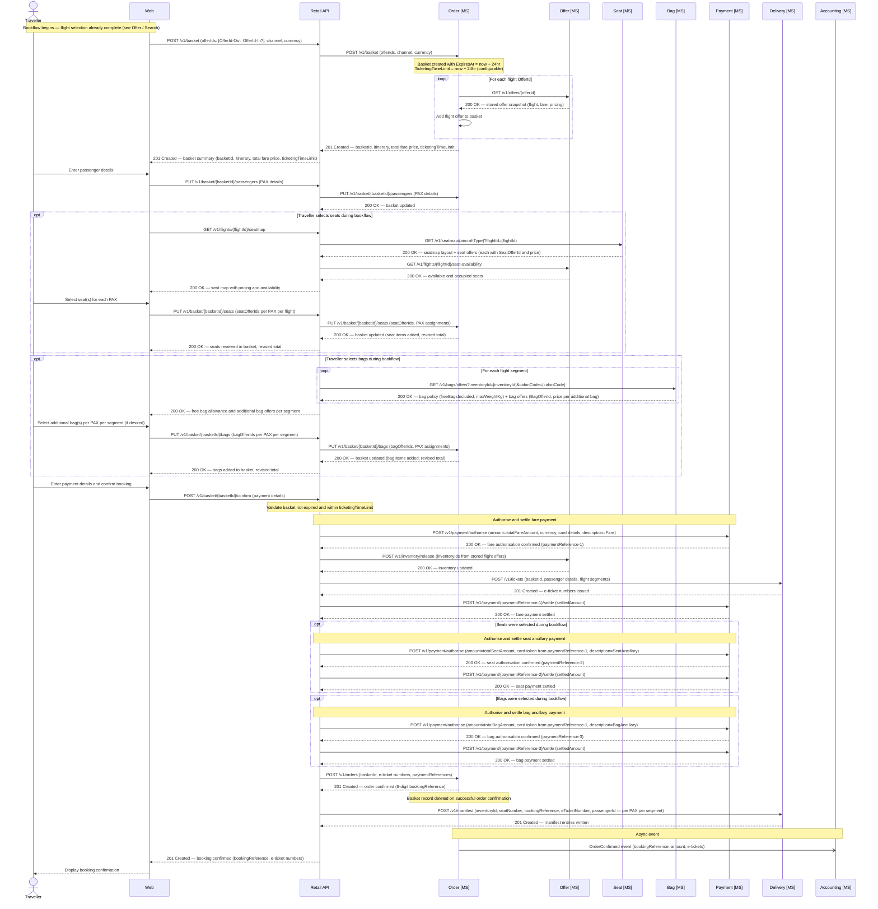

### Ticketing

Ticketing is the process by which a confirmed basket is converted into a legally valid air travel contract. It is the final step of the **bookflow**, triggered by the Retail API immediately after successful payment authorisation and must complete within the same synchronous flow as order confirmation. The e-ticket number is the IATA-standard identifier for this contract and is required before any manifest entries or boarding passes can be issued.

#### What is an E-Ticket?

- An e-ticket (electronic ticket) is the passenger's legal entitlement to travel, replacing the legacy paper ticket
- Each e-ticket covers **one passenger on one flight segment** — a return booking for two passengers generates four e-ticket numbers
- E-ticket numbers follow the IATA format: a **3-digit airline code prefix** followed by a **10-digit serial number**, e.g. `932-1234567890` (Apex Air prefix: `932`)
- E-ticket numbers are issued and owned by the **Delivery microservice**, which is the system of record for all issued tickets
- Once issued, an e-ticket number is immutable — post-booking changes (PAX updates, seat changes) trigger **reissuance** of a new e-ticket number against the same order item, not amendment of the existing one

#### Ticketing Flow

Ticketing occurs as part of the order confirmation sequence, orchestrated by the Retail API after fare payment has been authorised:

- **Pre-ticketing checks** (performed by the Retail API before calling Delivery):
  - Basket is in `Active` status
  - `now < TicketingTimeLimit` — if elapsed, basket must be marked `Expired` and inventory released
  - All stored offers referenced in the basket are unconsumed and not expired
  - Fare payment has been successfully authorised (`paymentReference` held)

- **E-ticket issuance** (Retail API → Delivery MS):
  - Retail API calls `POST /v1/tickets` on the Delivery microservice, passing: basket ID, passenger details, and flight segments
  - Delivery MS generates one e-ticket number per passenger per flight segment
  - E-ticket numbers are returned synchronously to the Retail API

- **Inventory removal** (Retail API → Offer MS):
  - Retail API calls the Offer microservice to decrement `SeatsAvailable` and increment `SeatsSold` for each flight/cabin combination
  - `SeatsHeld` is decremented (seats were held against the basket)
  - This step must complete before order confirmation is written

- **Fare payment settlement** (Retail API → Payment MS):
  - Retail API calls `POST /v1/payment/{paymentReference}/settle` to move the authorised fare payment to `Settled`

- **Order confirmation** (Retail API → Order MS):
  - Retail API calls the Order microservice to convert the basket into a confirmed `order.Order` record
  - Payload includes: basket ID, all e-ticket numbers (per PAX per segment), and all payment references
  - Order MS writes the `order.Order` row with `OrderStatus = Confirmed` and a generated 6-character `BookingReference`
  - Order MS hard-deletes the basket row
  - Order MS publishes `OrderConfirmed` event to the event bus

- **Manifest population** (Retail API → Delivery MS):
  - Retail API calls the Delivery microservice to write one `FlightManifest` row per passenger per segment
  - Delivery MS validates each seat number against the active seatmap before writing (calls Seat MS)

- **Ancillary settlement** (if seats or bags were selected during the bookflow):
  - After fare settlement, the Retail API settles each ancillary payment independently: `POST /v1/payment/{paymentReference}/settle` is called once for seat ancillary and once for bag ancillary, each with their own `PaymentReference`
  - Ancillary payments are independent transactions and are settled after fare settlement; failure of an ancillary settlement does not roll back the confirmed booking, but must be flagged for manual reconciliation

#### Reissuance

E-tickets must be reissued (new number generated, old number voided) in the following scenarios:

- **PAX name correction** — name changes invalidate the existing ticket as the passenger name is encoded in the BCBP barcode string
- **Seat change post-booking** — seat number is encoded on the boarding pass; if the e-ticket record references a specific seat, reissuance ensures consistency
- **Schedule change by the airline** — if the operating flight details change materially (departure time, routing), affected tickets are reissued

Reissuance is always performed by the Delivery microservice. The Order microservice is updated with the new e-ticket numbers via the Retail API orchestration layer, and new manifest entries replace the previous ones.

#### Failure Handling

Ticketing involves multiple sequential calls; partial failures must be handled explicitly:

| Failure point | Behaviour |
|---|---|
| Delivery MS fails to issue tickets | Abort — do not settle payment, do not confirm order; return error to channel |
| Offer MS fails to remove inventory | Retry up to 3 times; if still failing, void payment authorisation and return error |
| Payment settlement fails after inventory removed | Flag order for manual reconciliation; order is not confirmed until settlement succeeds |
| Order MS fails to confirm | Attempt compensation: void payment, reinstate inventory, void e-tickets; alert ops team if compensation also fails |

> All state-changing steps should be logged with sufficient detail to support manual reconciliation in the event of a partial failure that cannot be automatically compensated.

### Data Schema — Order

The Order domain owns three structures in the Order DB: the `Basket` tables (transient pre-sale state), the `Order` table (confirmed post-sale state), and the `BasketConfig` table (system configuration for expiry and ticketing time limits).

#### Basket

The basket is the in-progress accumulation of everything a traveller has selected before payment. It is created when a purchase journey begins and holds flight offers, seat offers, passenger details, and payment intent. It deliberately contains no PNR, booking reference, or e-ticket numbers — these do not exist until the sale completes. On successful order confirmation the basket row is hard-deleted. If the basket is abandoned or the ticketing time limit elapses without payment, the basket is marked `Expired` and held inventory is released by a background cleanup job.

The `BasketData` column holds the full basket state as a JSON document. Scalar fields used for indexed lookups and lifecycle management are stored as typed columns.

#### `order.BasketConfig`

| Column | Type | Nullable | Default | Key | Notes |
|---|---|---|---|---|---|
| BasketConfigId | UNIQUEIDENTIFIER | No | NEWID() | PK | |
| BasketExpiryHours | SMALLINT | No | `24` | | Hours until an unpaid basket is expired |
| TicketingTimeLimitHours | SMALLINT | No | `24` | | Hours from basket creation within which ticketing must complete |
| IsActive | BIT | No | `1` | | |
| CreatedAt | DATETIME2 | No | SYSUTCDATETIME() | | |
| Notes | VARCHAR(255) | Yes | | | Optional change annotation, e.g. `'Reduced to 2hr for peak season test'` |

> **Indexes:** `IX_BasketConfig_Active` (unique) on `(IsActive)` WHERE `IsActive = 1`.
> **Single active row:** Only one row may have `IsActive = 1` at any time. To change configuration, insert a new row with `IsActive = 1` and set the previous row to `IsActive = 0`. Rows are never deleted, only superseded.

#### `order.Basket`

| Column | Type | Nullable | Default | Key | Notes |
|---|---|---|---|---|---|
| BasketId | UNIQUEIDENTIFIER | No | NEWID() | PK | |
| ChannelCode | VARCHAR(20) | No | | | `WEB` · `APP` · `NDC` · `KIOSK` · `CC` · `AIRPORT` |
| CurrencyCode | CHAR(3) | No | `'GBP'` | | ISO 4217 currency code |
| BasketStatus | VARCHAR(20) | No | `'Active'` | | `Active` · `Expired` · `Abandoned` · `Confirmed` |
| TotalFareAmount | DECIMAL(10,2) | Yes | | | Sum of flight offer prices; updated as basket is built |
| TotalSeatAmount | DECIMAL(10,2) | Yes | `0.00` | | Sum of seat offer prices; updated as seats are added during bookflow |
| TotalBagAmount | DECIMAL(10,2) | Yes | `0.00` | | Sum of bag offer prices; updated as bags are added during bookflow |
| TotalAmount | DECIMAL(10,2) | Yes | | | TotalFareAmount + TotalSeatAmount + TotalBagAmount |
| ExpiresAt | DATETIME2 | No | | | Basket hard expiry: creation time + `BasketExpiryHours` |
| TicketingTimeLimit | DATETIME2 | No | | | Must ticket by this time: creation time + `TicketingTimeLimitHours` |
| ConfirmedOrderId | UNIQUEIDENTIFIER | Yes | | FK → `order.Order(OrderId)` | Set on successful confirmation; null until then |
| CreatedAt | DATETIME2 | No | SYSUTCDATETIME() | | |
| UpdatedAt | DATETIME2 | No | SYSUTCDATETIME() | | |
| BasketData | NVARCHAR(MAX) | No | | | JSON document containing the full basket state (see example below) |

> **Indexes:** `IX_Basket_Status_Expiry` on `(BasketStatus, ExpiresAt)` WHERE `BasketStatus = 'Active'` — used by background expiry job. `IX_Basket_TicketingTimeLimit` on `(TicketingTimeLimit)` WHERE `BasketStatus = 'Active'` — used to flag baskets approaching TTL.
> **Constraints:** `CHK_BasketData` — `ISJSON(BasketData) = 1`; `BasketData` must be a valid JSON document.
> **Basket lifecycle:** A basket is hard-deleted immediately when an order is confirmed. Expired and abandoned baskets are retained for 7 days for diagnostics before being purged.

**Example `BasketData` JSON document**

The JSON captures the full in-progress state. It mirrors the eventual shape of `OrderData` for passengers and flight segments, but uses `offerSnapshots` rather than confirmed order items, and has no `eTickets`, booking reference, or payment settlement data.

```json
{
  "channel": "WEB",
  "currency": "GBP",
  "ticketingTimeLimit": "2025-06-02T10:30:00Z",
  "passengers": [
    {
      "passengerId": "PAX-1",
      "type": "ADT",
      "givenName": "Alex",
      "surname": "Taylor",
      "dateOfBirth": "1985-03-12",
      "gender": "Male",
      "loyaltyNumber": "AX9876543",
      "contacts": {
        "email": "alex.taylor@example.com",
        "phone": "+447700900100"
      },
      "travelDocument": {
        "type": "PASSPORT",
        "number": "PA1234567",
        "issuingCountry": "GBR",
        "expiryDate": "2030-01-01",
        "nationality": "GBR"
      }
    },
    {
      "passengerId": "PAX-2",
      "type": "ADT",
      "givenName": "Jordan",
      "surname": "Taylor",
      "dateOfBirth": "1987-07-22",
      "gender": "Female",
      "loyaltyNumber": null,
      "contacts": null,
      "travelDocument": null
    }
  ],
  "flightOffers": [
    {
      "basketItemId": "BI-1",
      "offerId": "3fa85f64-5717-4562-b3fc-2c963f66afa6",
      "flightNumber": "AX003",
      "origin": "LHR",
      "destination": "JFK",
      "departureDateTime": "2025-08-15T11:00:00Z",
      "arrivalDateTime": "2025-08-15T14:10:00Z",
      "aircraftType": "A351",
      "cabinCode": "J",
      "bookingClass": "J",
      "fareBasisCode": "JFLEXGB",
      "fareFamily": "Business Flex",
      "passengerRefs": ["PAX-1", "PAX-2"],
      "unitPrice": 350.00,
      "taxes": 87.25,
      "totalPrice": 437.25,
      "isRefundable": true,
      "isChangeable": true,
      "offerExpiresAt": "2025-06-01T11:00:00Z"
    },
    {
      "basketItemId": "BI-2",
      "offerId": "7cb87a21-1234-4abc-9def-1a2b3c4d5e6f",
      "flightNumber": "AX004",
      "origin": "JFK",
      "destination": "LHR",
      "departureDateTime": "2025-08-25T22:00:00Z",
      "arrivalDateTime": "2025-08-26T10:15:00Z",
      "aircraftType": "A351",
      "cabinCode": "J",
      "bookingClass": "J",
      "fareBasisCode": "JFLEXGB",
      "fareFamily": "Business Flex",
      "passengerRefs": ["PAX-1", "PAX-2"],
      "unitPrice": 350.00,
      "taxes": 87.25,
      "totalPrice": 437.25,
      "isRefundable": true,
      "isChangeable": true,
      "offerExpiresAt": "2025-06-01T11:00:00Z"
    }
  ],
  "seatOffers": [
    {
      "basketItemId": "BI-3",
      "seatOfferId": "so-a351-1A-v1",
      "basketItemRef": "BI-1",
      "passengerRef": "PAX-1",
      "seatNumber": "1A",
      "seatPosition": "Window",
      "cabinCode": "J",
      "price": 0.00,
      "currency": "GBP",
      "note": "Business Class — no charge"
    },
    {
      "basketItemId": "BI-4",
      "seatOfferId": "so-a351-11A-v1",
      "basketItemRef": "BI-1",
      "passengerRef": "PAX-2",
      "seatNumber": "11A",
      "seatPosition": "Window",
      "cabinCode": "W",
      "price": 70.00,
      "currency": "GBP"
    }
  ],
  "bagOffers": [
    {
      "basketItemId": "BI-5",
      "bagOfferId": "bo-economy-bag1-v1",
      "basketItemRef": "BI-1",
      "passengerRef": "PAX-1",
      "bagSequence": 1,
      "freeBagsIncluded": 1,
      "additionalBags": 1,
      "price": 60.00,
      "currency": "GBP",
      "note": "1st additional bag — LHR→JFK segment"
    }
  ],
  "paymentIntent": {
    "method": "CreditCard",
    "cardType": "Visa",
    "cardLast4": "4242",
    "totalFareAmount": 1749.00,
    "totalSeatAmount": 70.00,
    "totalBagAmount": 60.00,
    "grandTotal": 1879.00,
    "currency": "GBP",
    "status": "PendingAuthorisation"
  },
  "history": [
    { "event": "BasketCreated",          "at": "2025-06-01T10:30:00Z", "by": "WEB" },
    { "event": "PassengersAdded",        "at": "2025-06-01T10:31:00Z", "by": "WEB" },
    { "event": "SeatsAdded",             "at": "2025-06-01T10:32:00Z", "by": "WEB" },
    { "event": "BagsAdded",              "at": "2025-06-01T10:33:00Z", "by": "WEB" },
    { "event": "PaymentIntentRecorded",  "at": "2025-06-01T10:34:00Z", "by": "WEB" }
  ]
}
```

> **Ticketing time limit:** The `TicketingTimeLimit` is set at basket creation from the active `BasketConfig` row and is included in the basket summary returned to the channel so it can display a countdown to the traveller. The Retail API must validate that `now < TicketingTimeLimit` before attempting authorisation. If the limit has elapsed, the basket must be marked `Expired`, inventory released, and the traveller directed to start a new search.

> **Basket expiry job:** A background process runs on a schedule (e.g. every 5 minutes) and queries `order.Basket WHERE BasketStatus = 'Active' AND ExpiresAt <= now`. For each expired basket it sets `BasketStatus = 'Expired'` and fires a compensating call to the Offer microservice to release any held inventory. Expired baskets are retained for a short period (e.g. 7 days) for diagnostic purposes before being purged.

> **Basket deletion on sale:** When the Retail API receives a successful order confirmation response from the Order microservice, it immediately issues a hard delete of the basket row. The confirmed `OrderData` JSON is the authoritative post-sale record; the basket is no longer needed.

#### Order

The `Order` table is written once the basket has been confirmed — payment taken, inventory removed, and e-tickets issued. It follows the IATA ONE Order model. The `Order` table holds scalar fields used for querying, routing, reporting, and event publishing. The full order detail — passengers, flight segments, order items, fares, seat assignments, e-tickets, payments, and audit history — is stored as a JSON document in the `OrderData` column. Fields that exist as typed columns on the table (such as `OrderId`, `BookingReference`, `OrderStatus`, `ChannelCode`, `CurrencyCode`, and `TotalAmount`) are intentionally excluded from the JSON document to avoid duplication.

#### `order.Order`

| Column | Type | Nullable | Default | Key | Notes |
|---|---|---|---|---|---|
| OrderId | UNIQUEIDENTIFIER | No | NEWID() | PK | |
| BookingReference | CHAR(6) | Yes | | UK | Populated on confirmation, e.g. `AB1234`; null in `Draft` state |
| OrderStatus | VARCHAR(20) | No | `'Draft'` | | `Draft` · `Confirmed` · `Changed` · `Cancelled` |
| ChannelCode | VARCHAR(20) | No | | | `WEB` · `APP` · `NDC` · `KIOSK` · `CC` · `AIRPORT` |
| CurrencyCode | CHAR(3) | No | `'GBP'` | | ISO 4217 currency code |
| TotalAmount | DECIMAL(10,2) | Yes | | | Total order value including all order items; null until confirmed |
| CreatedAt | DATETIME2 | No | SYSUTCDATETIME() | | |
| UpdatedAt | DATETIME2 | No | SYSUTCDATETIME() | | |
| OrderData | NVARCHAR(MAX) | No | | | JSON document containing the full ONE Order detail (see example below) |

> **Indexes:** `IX_Order_BookingReference` (unique) on `(BookingReference)` WHERE `BookingReference IS NOT NULL`.
> **Constraints:** `CHK_OrderData` — `ISJSON(OrderData) = 1`; `OrderData` must be a valid JSON document.
> **Column duplication:** Fields present as typed columns (`OrderId`, `BookingReference`, `OrderStatus`, `ChannelCode`, `CurrencyCode`, `TotalAmount`, `CreatedAt`) are NOT duplicated inside `OrderData`. The table columns are the single source of truth for those values; `OrderData` carries the relational detail only.

**Example `OrderData` JSON document**

The JSON structure is aligned to IATA ONE Order concepts. Scalar identifiers and status fields that exist as typed columns on the `order.Order` table (`orderId`, `bookingReference`, `orderStatus`, `channel`, `currency`, `totalAmount`, `createdAt`) are excluded from the JSON document — the table columns are the single source of truth for those values. The JSON carries the relational detail: passengers, flight segments, order items, payments, and audit history.

```json
{
  "dataLists": {
    "passengers": [
      {
        "passengerId": "PAX-1",
        "type": "ADT",
        "givenName": "Alex",
        "surname": "Taylor",
        "dateOfBirth": "1985-03-12",
        "gender": "Male",
        "loyaltyNumber": "AX9876543",
        "contacts": {
          "email": "alex.taylor@example.com",
          "phone": "+447700900100"
        },
        "travelDocument": {
          "type": "PASSPORT",
          "number": "PA1234567",
          "issuingCountry": "GBR",
          "expiryDate": "2030-01-01",
          "nationality": "GBR"
        }
      },
      {
        "passengerId": "PAX-2",
        "type": "ADT",
        "givenName": "Jordan",
        "surname": "Taylor",
        "dateOfBirth": "1987-07-22",
        "gender": "Female",
        "loyaltyNumber": null,
        "contacts": null,
        "travelDocument": {
          "type": "PASSPORT",
          "number": "PA7654321",
          "issuingCountry": "GBR",
          "expiryDate": "2028-06-30",
          "nationality": "GBR"
        }
      }
    ],
    "flightSegments": [
      {
        "segmentId": "SEG-1",
        "flightNumber": "AX003",
        "origin": "LHR",
        "destination": "JFK",
        "departureDateTime": "2025-08-15T11:00:00Z",
        "arrivalDateTime": "2025-08-15T14:10:00Z",
        "aircraftType": "A351",
        "operatingCarrier": "AX",
        "marketingCarrier": "AX",
        "cabinCode": "J",
        "bookingClass": "J"
      },
      {
        "segmentId": "SEG-2",
        "flightNumber": "AX004",
        "origin": "JFK",
        "destination": "LHR",
        "departureDateTime": "2025-08-25T22:00:00Z",
        "arrivalDateTime": "2025-08-26T10:15:00Z",
        "aircraftType": "A351",
        "operatingCarrier": "AX",
        "marketingCarrier": "AX",
        "cabinCode": "J",
        "bookingClass": "J"
      }
    ]
  },
  "orderItems": [
    {
      "orderItemId": "OI-1",
      "type": "Flight",
      "segmentRef": "SEG-1",
      "passengerRefs": ["PAX-1", "PAX-2"],
      "offerId": "3fa85f64-5717-4562-b3fc-2c963f66afa6",
      "fareBasisCode": "JFLEXGB",
      "fareFamily": "Business Flex",
      "unitPrice": 350.00,
      "taxes": 87.25,
      "totalPrice": 437.25,
      "isRefundable": true,
      "isChangeable": true,
      "paymentReference": "AXPAY-0001",
      "eTickets": [
        { "passengerId": "PAX-1", "eTicketNumber": "932-1234567890" },
        { "passengerId": "PAX-2", "eTicketNumber": "932-1234567891" }
      ],
      "seatAssignments": [
        { "passengerId": "PAX-1", "seatNumber": "1A" },
        { "passengerId": "PAX-2", "seatNumber": "1D" }
      ]
    },
    {
      "orderItemId": "OI-2",
      "type": "Flight",
      "segmentRef": "SEG-2",
      "passengerRefs": ["PAX-1", "PAX-2"],
      "offerId": "7cb87a21-1234-4abc-9def-1a2b3c4d5e6f",
      "fareBasisCode": "JFLEXGB",
      "fareFamily": "Business Flex",
      "unitPrice": 350.00,
      "taxes": 87.25,
      "totalPrice": 437.25,
      "isRefundable": true,
      "isChangeable": true,
      "paymentReference": "AXPAY-0001",
      "eTickets": [
        { "passengerId": "PAX-1", "eTicketNumber": "932-1234567892" },
        { "passengerId": "PAX-2", "eTicketNumber": "932-1234567893" }
      ],
      "seatAssignments": [
        { "passengerId": "PAX-1", "seatNumber": "2A" },
        { "passengerId": "PAX-2", "seatNumber": "2D" }
      ]
    },
    {
      "orderItemId": "OI-3",
      "type": "Seat",
      "segmentRef": "SEG-1",
      "passengerRefs": ["PAX-1"],
      "offerId": "a1b2c3d4-seat-4562-b3fc-000000000001",
      "seatNumber": "1A",
      "seatPosition": "Window",
      "unitPrice": 70.00,
      "taxes": 0.00,
      "totalPrice": 70.00,
      "paymentReference": "AXPAY-0002"
    },
    {
      "orderItemId": "OI-4",
      "type": "Seat",
      "segmentRef": "SEG-1",
      "passengerRefs": ["PAX-2"],
      "offerId": "a1b2c3d4-seat-4562-b3fc-000000000002",
      "seatNumber": "1D",
      "seatPosition": "Middle",
      "unitPrice": 20.00,
      "taxes": 0.00,
      "totalPrice": 20.00,
      "paymentReference": "AXPAY-0002"
    },
    {
      "orderItemId": "OI-5",
      "type": "Bag",
      "segmentRef": "SEG-1",
      "passengerRefs": ["PAX-1"],
      "bagOfferId": "bo-economy-bag1-v1",
      "freeBagsIncluded": 1,
      "additionalBags": 1,
      "bagSequence": 1,
      "unitPrice": 60.00,
      "taxes": 0.00,
      "totalPrice": 60.00,
      "paymentReference": "AXPAY-0003"
    }
  ],
  "payments": [
    {
      "paymentReference": "AXPAY-0001",
      "description": "Fare — LHR-JFK-LHR, 2 PAX",
      "method": "CreditCard",
      "cardLast4": "4242",
      "cardType": "Visa",
      "authorisedAmount": 1749.00,
      "settledAmount": 1749.00,
      "currency": "GBP",
      "status": "Settled",
      "authorisedAt": "2025-06-01T10:31:00Z",
      "settledAt": "2025-06-01T10:32:00Z"
    },
    {
      "paymentReference": "AXPAY-0002",
      "description": "Seat ancillary — SEG-1, PAX-1 seat 1A, PAX-2 seat 1D",
      "method": "CreditCard",
      "cardLast4": "4242",
      "cardType": "Visa",
      "authorisedAmount": 90.00,
      "settledAmount": 90.00,
      "currency": "GBP",
      "status": "Settled",
      "authorisedAt": "2025-06-01T10:31:30Z",
      "settledAt": "2025-06-01T10:32:30Z"
    },
    {
      "paymentReference": "AXPAY-0003",
      "description": "Bag ancillary — SEG-1, PAX-1, 1 additional bag",
      "method": "CreditCard",
      "cardLast4": "4242",
      "cardType": "Visa",
      "authorisedAmount": 60.00,
      "settledAmount": 60.00,
      "currency": "GBP",
      "status": "Settled",
      "authorisedAt": "2025-06-01T10:45:00Z",
      "settledAt": "2025-06-01T10:45:10Z"
    }
  ],
  "history": [
    { "event": "OrderCreated",   "at": "2025-06-01T10:30:00Z", "by": "WEB" },
    { "event": "OrderConfirmed", "at": "2025-06-01T10:32:00Z", "by": "WEB" },
    { "event": "BagAncillaryAdded", "at": "2025-06-01T10:45:00Z", "by": "WEB" }
  ]
}
```

-----

### Manage Booking — Update Passenger Details

Customers regularly need to update passenger information after booking: a newly issued passport, a correction to a misspelt name, or updated contact details. In airline industry terms, accurate **Advance Passenger Information (API)** — passport number, nationality, date of birth, and document expiry — is a regulatory requirement for international travel and must match the document presented at the border. The Delivery microservice treats e-tickets as immutable documents: any change to the passenger's name or identity details triggers a **reissuance**, generating a new e-ticket number while the booking reference remains unchanged. Minor name corrections (a single transposed character) are typically applied as a waiver; anything beyond that is subject to the fare's change conditions.

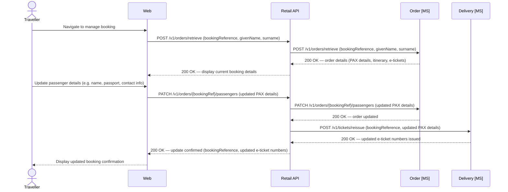

### Manage Booking — Change Flight

A voluntary flight change is a customer-initiated modification to a confirmed itinerary, as distinct from a carrier-initiated involuntary change triggered by an IROPS event. Whether a change is permitted, and under what conditions, is governed entirely by the fare conditions of the originally purchased ticket: some fares are wholly non-changeable; others are changeable subject to a change fee; and fully flexible fares (such as Business Flex) permit changes at no charge.

When a customer selects a new flight, the Offer microservice is called to obtain a live fare for the new itinerary — a process known as a **reshop**. The fare returned reflects market pricing at the time of the change request, not the original purchase price. If the reshopped base fare exceeds the original base fare paid, an **add-collect** is required: the Retail API calculates the fare difference and adds any applicable change fee to produce the total amount due before confirming the change. Where the new fare is equal to or lower than the original, no residual value is returned on a voluntary change; the customer pays the change fee only (if any applies). On confirmation, the original e-ticket is voided and a new e-ticket is issued against the replacement itinerary. Seat ancillaries purchased for the original flight are not automatically transferred and must be reselected through the normal seat management flow.

```mermaid
sequenceDiagram
    actor Traveller
    participant Web
    participant RetailAPI as Retail API
    participant OrderMS as Order [MS]
    participant OfferMS as Offer [MS]
    participant DeliveryMS as Delivery [MS]
    participant PaymentMS as Payment [MS]

    Traveller->>Web: Navigate to manage booking and request a flight change
    Web->>RetailAPI: POST /v1/orders/retrieve (bookingReference, givenName, surname)
    RetailAPI->>OrderMS: POST /v1/orders/retrieve
    OrderMS-->>RetailAPI: 200 OK — order detail (segments, fareBasisCode, isChangeable, changeFee, originalBaseFare, paymentReference)
    RetailAPI-->>Web: 200 OK — current booking with change conditions

    alt Fare is not changeable (isChangeable = false)
        RetailAPI-->>Web: 422 Unprocessable — fare conditions do not permit a voluntary change
        Web-->>Traveller: This fare cannot be changed
    end

    Web-->>Traveller: Display current booking; traveller selects new date and/or flight

    Note over RetailAPI,OfferMS: Reshop — obtain live fare for the new itinerary at the same cabin class
    Web->>RetailAPI: POST /v1/search/slice (origin, destination, newDate, cabinCode, paxCount)
    RetailAPI->>OfferMS: POST /v1/search/slice (origin, destination, newDate, cabinCode, paxCount)
    OfferMS-->>RetailAPI: 200 OK — available flights with live fares (newOfferId, newBaseFare, newTaxes, newTotal, isChangeable)
    RetailAPI-->>Web: 200 OK — available replacement flights and fares
    Web-->>Traveller: Display replacement options- traveller selects new flight

    Note over RetailAPI: Calculate add-collect
    Note over RetailAPI: addCollect = max(0, newBaseFare − originalBaseFare)
    Note over RetailAPI: totalDue = changeFee + addCollect

    alt Add-collect or change fee applies (totalDue > 0)
        RetailAPI-->>Web: Fare summary (originalFare, newFare, changeFee, addCollect, totalDue)
        Web-->>Traveller: Confirm change and provide payment details
        Web->>RetailAPI: POST /v1/orders/{bookingRef}/change (newOfferId, totalDue, paymentDetails)
        RetailAPI->>PaymentMS: POST /v1/payment/authorise (amount=totalDue, currency, cardDetails, description=FareChange)
        PaymentMS-->>RetailAPI: 200 OK — paymentReference, authorisedAmount
    else No additional charge (totalDue = 0 — fully flexible fare, new fare equal or lower)
        RetailAPI-->>Web: Change summary — no additional payment required
        Web-->>Traveller: Confirm change
        Web->>RetailAPI: POST /v1/orders/{bookingRef}/change (newOfferId)
    end

    RetailAPI->>OfferMS: POST /v1/inventory/hold (newInventoryId, cabinCode, seats=paxCount)
    OfferMS-->>RetailAPI: 200 OK — seats held on new flight

    loop For each e-ticket on the changed segment
        RetailAPI->>DeliveryMS: PATCH /v1/tickets/{eTicketNumber}/void
        DeliveryMS-->>RetailAPI: 200 OK — original e-ticket voided
    end

    RetailAPI->>DeliveryMS: DELETE /v1/manifest/{bookingRef}/flight/{originalFlightNumber}/{originalDepartureDate}
    DeliveryMS-->>RetailAPI: 200 OK — manifest entries removed for original flight

    RetailAPI->>OfferMS: POST /v1/inventory/release (originalInventoryId, cabinCode, seats=paxCount)
    OfferMS-->>RetailAPI: 200 OK — seats released from original flight- SeatsAvailable incremented

    RetailAPI->>OrderMS: PATCH /v1/orders/{bookingRef}/change (cancelledSegmentId, newOfferId, changeFee, addCollect, paymentReference)
    OrderMS-->>RetailAPI: 200 OK — order updated (OrderStatus=Changed)- OrderChanged event published

    RetailAPI->>DeliveryMS: POST /v1/tickets/reissue (bookingReference, voidedETicketNumbers, newSegments)
    DeliveryMS-->>RetailAPI: 200 OK — new e-ticket numbers issued

    RetailAPI->>DeliveryMS: POST /v1/manifest (newInventoryId, bookingReference, newETicketNumbers, passengerIds)
    DeliveryMS-->>RetailAPI: 201 Created — manifest entries written for new flight

    alt Payment was collected (totalDue > 0)
        RetailAPI->>PaymentMS: POST /v1/payment/{paymentReference}/settle (settledAmount=totalDue)
        PaymentMS-->>RetailAPI: 200 OK — add-collect and change fee settled
    end

    RetailAPI-->>Web: 200 OK — change confirmed (new itinerary, new e-ticket numbers)
    Web-->>Traveller: Change confirmed — new itinerary and updated e-ticket details displayed
```

### Manage Booking — Cancel Booking

A voluntary cancellation is a customer-initiated request to cancel a confirmed booking. Entitlement to a refund, and any cancellation penalty that reduces it, is determined entirely by the fare conditions of the originally issued ticket. Fares broadly fall into three categories: non-refundable (the fare value is forfeited in full on cancellation); partially refundable (a fixed cancellation fee is deducted from the amount returned); and fully refundable (the total amount paid is returned). In all cases the e-ticket must be voided and inventory released back to the Offer microservice regardless of refundability — a cancelled booking must not continue to hold seat inventory.

Where a refund is due, it is returned to the original payment method via the Payment microservice and is subject to the card issuer's standard processing timeline, typically 5–10 business days. Government-imposed, non-carrier taxes (such as UK Air Passenger Duty) may be refundable even on otherwise non-refundable fares; detailed tax disaggregation and selective refund handling is a future consideration outside the scope of this phase.

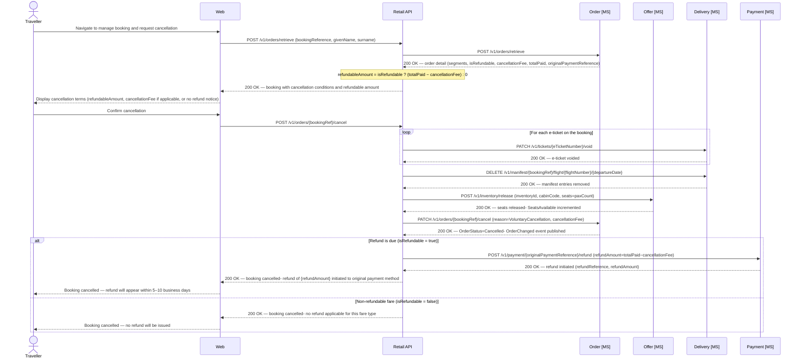

## Payment

The Payment microservice is the financial orchestration layer for all Apex Air transactions, interfacing with the external card payment processor on behalf of all channels. In a modern airline retailing context a single booking commonly generates multiple independent payment transactions: the flight fare is authorised and settled at ticketing, and each ancillary product — seat selection, additional baggage — is authorised and settled as its own transaction with a separate `PaymentReference`. This granular structure enables precise revenue attribution per product type, supports targeted partial refunds on cancellation or change, and satisfies PCI DSS requirements by ensuring card data is handled and discarded within the Payment microservice boundary without touching any other domain.

### Authorise and Settle

The Payment microservice handles all card authorisation and settlement for Apex Air transactions. A single booking may generate multiple independent payment transactions — fares are authorised and settled during ticketing, while ancillary purchases such as seat selections are authorised and settled as separate transactions. Each transaction is tracked by a unique `PaymentReference`, which is returned to the Retail API and stored against the relevant order items in the Order microservice.

The Payment DB owns the full audit trail of every authorisation and settlement event, making it the system of record for financial transactions independent of the order.

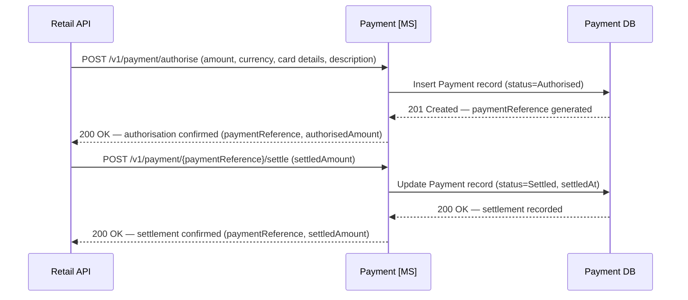

### Data Schema — Payment

The Payment domain uses two tables. `Payment` holds one row per payment transaction, tracking its lifecycle from authorisation through to settlement. `PaymentEvent` records every individual event (authorised, settled, refunded, declined) against a payment as an immutable append-only log, providing a complete audit trail. A single `Payment` may have multiple `PaymentEvent` rows — for example where a partial settlement is followed by a second settlement, or where a refund is issued.

#### `payment.Payment`

| Column | Type | Nullable | Default | Key | Notes |
|---|---|---|---|---|---|
| PaymentId | UNIQUEIDENTIFIER | No | NEWID() | PK | |
| PaymentReference | VARCHAR(20) | No | | UK | Human-readable reference, e.g. `AXPAY-0001`; generated at authorisation |
| BookingReference | CHAR(6) | Yes | | | Set once the order is confirmed; null during initial authorisation |
| PaymentType | VARCHAR(30) | No | | | `Fare` · `SeatAncillary` · `BagAncillary` · `FareChange` · `Cancellation` · `Refund` |
| Method | VARCHAR(20) | No | | | `CreditCard` · `DebitCard` · `PayPal` · `ApplePay` |
| CardType | VARCHAR(20) | Yes | | | `Visa` · `Mastercard` · `Amex` · etc.; null for non-card methods |
| CardLast4 | CHAR(4) | Yes | | | Last 4 digits only — full PAN must never be stored |
| CurrencyCode | CHAR(3) | No | `'GBP'` | | ISO 4217 currency code |
| AuthorisedAmount | DECIMAL(10,2) | No | | | Amount approved by the payment processor |
| SettledAmount | DECIMAL(10,2) | Yes | | | Null until settlement; may differ from `AuthorisedAmount` on partial settlement |
| Status | VARCHAR(20) | No | | | `Authorised` · `Settled` · `PartiallySettled` · `Refunded` · `Declined` · `Voided` |
| AuthorisedAt | DATETIME2 | No | SYSUTCDATETIME() | | |
| SettledAt | DATETIME2 | Yes | | | Null until settlement |
| Description | VARCHAR(255) | Yes | | | Human-readable description, e.g. `'Fare LHR-JFK-LHR, 2 PAX'` |
| CreatedAt | DATETIME2 | No | SYSUTCDATETIME() | | |
| UpdatedAt | DATETIME2 | No | SYSUTCDATETIME() | | |

> **Indexes:** `IX_Payment_BookingReference` on `(BookingReference)` WHERE `BookingReference IS NOT NULL`. `IX_Payment_PaymentReference` on `(PaymentReference)`.
> **PCI DSS:** Full card numbers, CVV codes, and raw processor tokens must never be stored. Only `CardLast4` and `CardType` are retained. The processor token used during the transaction lifetime is held in memory only and discarded after settlement.

#### `payment.PaymentEvent`

| Column | Type | Nullable | Default | Key | Notes |
|---|---|---|---|---|---|
| PaymentEventId | UNIQUEIDENTIFIER | No | NEWID() | PK | |
| PaymentId | UNIQUEIDENTIFIER | No | | FK → `payment.Payment(PaymentId)` | |
| EventType | VARCHAR(20) | No | | | `Authorised` · `Settled` · `PartialSettlement` · `Refunded` · `Declined` · `Voided` |
| Amount | DECIMAL(10,2) | No | | | Amount associated with this event |
| CurrencyCode | CHAR(3) | No | `'GBP'` | | ISO 4217 currency code |
| Notes | VARCHAR(255) | Yes | | | Optional context, e.g. `'Partial seat refund row 1A'` |
| CreatedAt | DATETIME2 | No | SYSUTCDATETIME() | | |

> **Indexes:** `IX_PaymentEvent_PaymentId` on `(PaymentId)`.
> **Immutability:** `PaymentEvent` rows are append-only and must never be updated or deleted. They form the authoritative audit trail for every financial event in the system.

> **PaymentReference format:** `PaymentReference` values follow the format `AXPAY-{sequence}` (e.g. `AXPAY-0001`). The sequence is generated by the Payment microservice at authorisation time and is guaranteed unique within the system. This reference is passed back to the Retail API and stored on each `orderItem` in `OrderData`, linking financial records to the order line items they cover.

> **PCI DSS:** Full card numbers, CVV codes, and raw processor tokens must never be stored in the Payment DB. Only `CardLast4` and `CardType` are retained. The payment processor token used during the transaction lifetime is held in memory only and discarded after settlement.

## Delivery

The Delivery microservice is the airline's system of record for issued travel documents and the departure-facing layer of the reservation system. Its name reflects its role in the **IATA One Order** model: once an order is confirmed by the Order microservice, the Delivery microservice materialises that booking into actionable travel documents — e-tickets, boarding passes, and the flight manifest. Where the Order microservice owns the commercial booking record, the Delivery microservice owns the operational record that gate and ground staff use to manage the flight. Its data underpins check-in, seat assignment, gate management, and the APIS (Advance Passenger Information System) submission process required for international departures.

### Online Check In

Online check-in (OLCI) opens 24 hours before departure and is the primary self-service channel through which passengers submit their **Advance Passenger Information (API)** data — passport numbers, nationality, and document expiry dates required for APIS transmission to destination country border agencies. Completing OLCI moves each passenger to a `checkedIn` status on the flight manifest, enabling boarding pass generation. The check-in window is intentionally limited to 24 hours before departure to align with airline operational cut-off times for APIS data submission and to prevent passengers checking in so far in advance that their travel document details become stale. Seat assignment and bag additions are both available within the OLCI flow, allowing last-minute ancillary changes before the passenger proceeds to boarding.

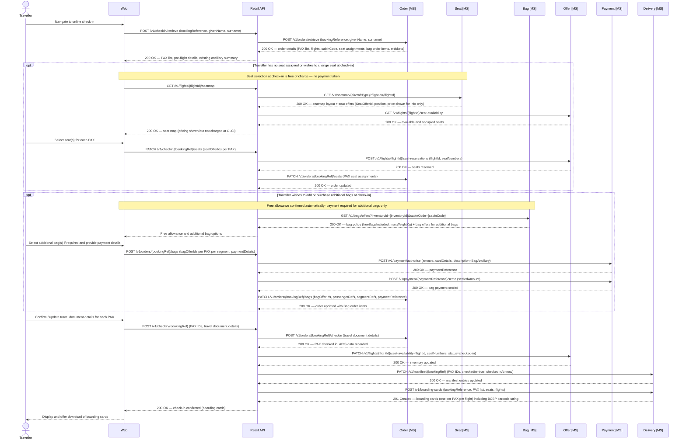

### Boarding Pass Barcode String

Each boarding card issued by the Delivery microservice includes a barcode string compliant with **IATA Resolution 792** (Bar Coded Boarding Pass — BCBP). This string is used directly to generate the physical barcode on printed boarding passes and the QR code displayed in the mobile app. Both formats encode identical data; the presentation layer determines the rendering.

The format is a structured plaintext string with fixed-width and positional fields. An example for a single-leg boarding pass:

```
M1TAYLOR/ALEX        EAB1234 LHRJFKAX 0003 042J001A0001 156>518 W6042 AX 2A00000012345678 JAX7KLP2NZR901A
```

The fields break down as follows:

| Segment | Value in example | Description |
|---|---|---|
| `M1` | `M1` | Format code (`M`) + number of legs encoded (`1`) |
| `TAYLOR/ALEX` | `TAYLOR/ALEX` | Passenger name — surname / given name, padded to 20 chars |
| `EAB1234` | `EAB1234` | Electronic ticket indicator (`E`) + PNR / booking reference |
| `LHR` | `LHR` | Origin IATA airport code |
| `JFK` | `JFK` | Destination IATA airport code |
| `AX` | `AX` | Operating carrier IATA code (Apex Air) |
| `0003` | `0003` | Flight number, padded to 4 chars |
| `042` | `042` | Julian date of flight departure |
| `J` | `J` | Cabin / booking class code |
| `001A` | `001A` | Seat number, padded to 4 chars |
| `0001` | `0001` | Sequence / check-in number |
| `1` | `1` | Passenger status code (`1` = checked in) |
| `56>518` | `56>518` | Conditional item size indicator and version number (BCBP version 6) |
| `W6042` | `W6042` | Julian date of issue + ticket issuer code |
| `AX` | `AX` | Operating carrier for this leg (repeated in conditional section) |
| `2A00000012345678` | `2A00000012345678` | Frequent flyer / loyalty number |
| `JAX7KLP2NZR901A` | `JAX7KLP2NZR901A` | Airline-specific free-text data (selectee indicator, document verification, etc.) |

The Delivery microservice is responsible for assembling this string at the point of boarding card generation, drawing on data from the `FlightManifest` row and the confirmed order. The barcode string is returned in the boarding card payload alongside human-readable fields; channels render it using their preferred barcode library (e.g. PDF417 for print, QR for mobile).

### Data Schema — Delivery

The Delivery domain owns its own `Delivery DB` and is the system of record for who is on each flight and where they are sitting. The `FlightManifest` table holds one row per passenger per flight segment, populated at the point of booking confirmation and updated whenever a seat is changed post-purchase. It provides a clean, queryable view of the passenger load for a given flight — used for gate management, check-in verification, IROPS, and regulatory APIS submissions.

Seat number integrity is enforced at the application layer: before any insert or update, the Delivery microservice calls the Seat microservice to validate that the given `SeatNumber` exists on the active seatmap for the relevant aircraft type. Rows may not be written with a seat number that does not appear in the seatmap definition. This prevents manifest corruption from downstream data entry errors or stale seat references.

#### `delivery.FlightManifest`

| Column | Type | Nullable | Default | Key | Notes |
|---|---|---|---|---|---|
| ManifestId | UNIQUEIDENTIFIER | No | NEWID() | PK | |
| InventoryId | UNIQUEIDENTIFIER | No | | | Cross-schema ref to `offer.FlightInventory(InventoryId)`; not enforced as DB FK |
| FlightNumber | VARCHAR(10) | No | | | Denormalised for query convenience, e.g. `AX003` |
| DepartureDate | DATE | No | | | Denormalised for query convenience |
| AircraftType | CHAR(4) | No | | | Used for seatmap validation at write time |
| SeatNumber | VARCHAR(5) | No | | | e.g. `1A`, `22K` — must exist on active seatmap for `AircraftType` |
| CabinCode | CHAR(1) | No | | | `F` · `J` · `W` · `Y` |
| BookingReference | CHAR(6) | No | | | e.g. `AB1234` |
| ETicketNumber | VARCHAR(20) | No | | | e.g. `932-1234567890` |
| PassengerId | VARCHAR(20) | No | | | PAX reference from the order, e.g. `PAX-1` |
| GivenName | VARCHAR(100) | No | | | Denormalised for manifest readability |
| Surname | VARCHAR(100) | No | | | Denormalised for manifest readability |
| CheckedIn | BIT | No | `0` | | |
| CheckedInAt | DATETIME2 | Yes | | | Null until check-in is completed |
| CreatedAt | DATETIME2 | No | SYSUTCDATETIME() | | |
| UpdatedAt | DATETIME2 | No | SYSUTCDATETIME() | | |

> **Indexes:** `IX_FlightManifest_Seat` (unique) on `(InventoryId, SeatNumber)` — prevents double-assignment of a seat on a flight. `IX_FlightManifest_Pax` (unique) on `(InventoryId, ETicketNumber)` — prevents duplicate manifest entries for the same passenger. `IX_FlightManifest_Flight` on `(FlightNumber, DepartureDate)` — used for gate staff and IROPS manifest retrieval. `IX_FlightManifest_BookingReference` on `(BookingReference)` — used for customer servicing and check-in lookups.
> **Cross-schema integrity:** `InventoryId` references `offer.FlightInventory` but is not a DB foreign key constraint, as the Delivery and Offer domains are logically separated. Referential integrity is the responsibility of the Retail API orchestration layer.
> **Seatmap validation:** Before any insert or update, the Delivery microservice must call `GET /v1/seatmap/{aircraftType}` and confirm `SeatNumber` exists on the active seatmap. If not found, the write must be rejected.

> **Cross-schema integrity:** `InventoryId` references `offer.FlightInventory` but is not declared as a foreign key, as the Delivery and Offer domains are logically separated (and would be physically separated in a fully isolated deployment). Referential integrity between these schemas is the responsibility of the Retail API orchestration layer, which controls the write sequence.

> **Seatmap validation:** The Delivery microservice must call `GET /v1/seatmap/{aircraftType}` on the Seat microservice and confirm the `SeatNumber` exists in the returned cabin layout before writing any `FlightManifest` row. If the seat is not present on the active seatmap, the write must be rejected with an appropriate error. This check applies to both initial inserts (at booking confirmation) and updates (at seat changes).

## Disruption API

### Overview

The Disruption API is an orchestration layer that sits between the airline's **Flight Operations System (FOS)** and the reservation system microservices. When a flight is disrupted — either delayed or cancelled — the FOS sends a notification to the Disruption API, which then coordinates the appropriate response across the **Offer** (inventory), **Order**, and **Delivery** microservices to ensure all affected bookings are updated and, where necessary, passengers are rebooked.

The Disruption API is a write-only inbound interface from the FOS's perspective: the FOS fires a disruption event and the reservation system handles everything downstream. No synchronous response about individual passenger outcomes is expected by the FOS; operational status updates are surfaced via the Contact Centre App and Airport App through the existing Retail and Airport APIs.

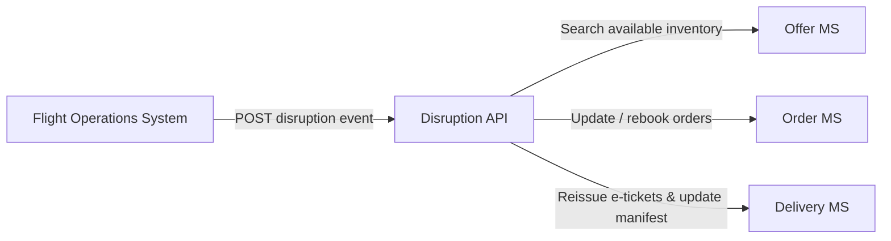

---

### Flight Delay

A flight delay is an operational event in which the scheduled departure (and typically arrival) time of a flight changes after bookings have already been confirmed. Unlike a cancellation, a delay does not invalidate the underlying booking or e-ticket — the passenger's reservation on the same flight remains valid and no rebooking is required. The system's responsibility is to propagate the revised schedule to every affected order and manifest record so that customers, contact centre agents, and gate staff all see consistent, up-to-date times. Passengers are notified proactively of the change. Under **EU Regulation 261/2004** and equivalent frameworks, significant delays may entitle passengers to compensation or care; however, eligibility assessment and compensation fulfilment are handled operationally outside this system.

> **Future consideration — missed connections due to delay:** If a delayed flight causes a passenger to miss a connecting flight in their itinerary, the system will need to detect this and trigger a rebooking flow for the affected connection. This is not in scope for the current phase but must be addressed in a future design iteration before connecting-itinerary bookings are supported operationally.

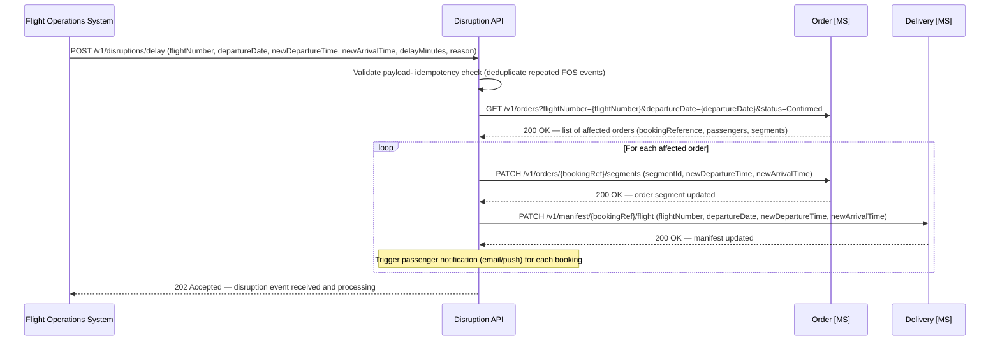

**Delay handling rules:**

- The departure and arrival times on every confirmed `order.Order` segment record for the affected flight are updated to reflect the new scheduled times.
- The `delivery.FlightManifest` records are updated to reflect the new departure time for gate management and check-in purposes.
- E-ticket reissuance is required if the delay constitutes a "material schedule change" under IATA ticketing rules (typically a change of more than 60 minutes). The threshold is configurable. Where reissuance is required, the Disruption API calls the Delivery microservice to reissue and the Order microservice is updated with new e-ticket numbers.
- An `OrderChanged` event is published by the Order microservice to the event bus so downstream services (Accounting, Customer) are aware of the change.
- Passengers whose check-in window has already opened (within 24 hours of the original departure) are notified immediately.

---

### Flight Cancellation and Passenger Rebooking

When the FOS notifies the Disruption API that a flight has been cancelled, the API must rebook every passenger who was confirmed on that flight onto the next available alternative. The rebooking logic works as follows:

1. The next available **direct** flight on the same origin–destination route with sufficient cabin availability is identified first.
2. If no direct flight can accommodate the passengers within an acceptable timeframe, a **connecting itinerary** via an intermediate point is considered.
3. Each passenger is rebooked into the same cabin class where possible. If the same cabin is unavailable, the passenger is upgraded to the next available cabin (no downgrade without consent).
4. All e-tickets for the cancelled flight are voided and new e-tickets are issued for the replacement flight(s).
5. The `delivery.FlightManifest` records for the cancelled flight are removed and new manifest entries are created for the replacement flight.
6. Passengers are notified of their new itinerary.

> **Future consideration — missed connections resulting from cancellation rebooking:** When a passenger is rebooked onto a connecting itinerary (because no viable direct flight is available), there is a risk that a disruption to either leg of that connecting journey could result in a missed connection. Additionally, where minimum connection times at the transit airport are tight, the system must validate that the layover is operationally feasible. Detection and handling of these scenarios requires additional logic — similar in nature to the delay/missed-connection case noted above — and must be addressed in a future design phase before widespread use of connecting rebooking in an IROPS context.

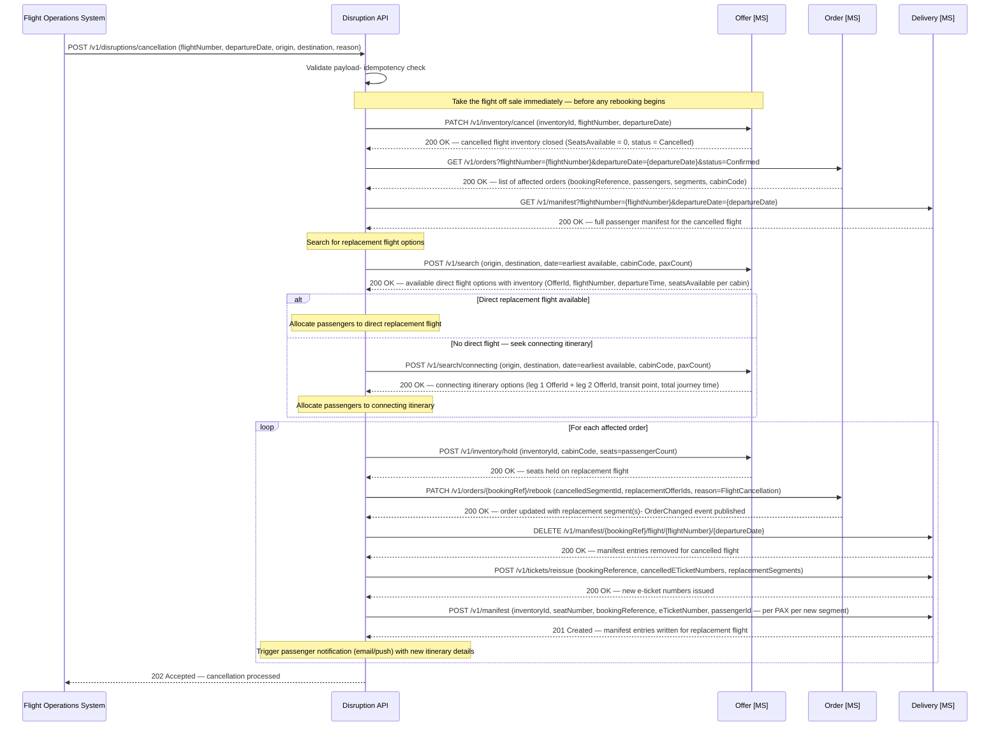

**Cancellation handling rules:**

- **The cancelled flight is taken off sale immediately** — as the very first action after validating the event, before retrieving affected orders or searching for alternatives. This prevents new bookings from being accepted on the flight while rebooking is in progress. The `offer.FlightInventory` record is updated to `SeatsAvailable = 0` with a status of `Cancelled`.
- The Disruption API processes passengers in priority order: higher cabin class first, then loyalty tier (Platinum → Gold → Silver → Blue), then booking date (earliest first). This ensures the best available seats go to the highest-value passengers.
- Seat assignments on the replacement flight are not pre-assigned by the Disruption API; passengers are assigned to an available seat of the same position type (Window/Aisle/Middle) where possible. Passengers may change their seat via the normal manage-booking flow after rebooking.
- If no replacement flight is found within a configurable lookahead window (default: 72 hours), the booking is flagged for manual handling by the Contact Centre rather than left in an unresolved state.
- Where the original fare conditions do not permit free rebooking (e.g. non-changeable fares), the airline's IROPS policy overrides these conditions — all passengers on a cancelled flight are entitled to free rebooking regardless of fare type. This waiver is applied by the Order microservice when the `reason=FlightCancellation` flag is present.
- A single `OrderChanged` event (with `changeType=IROPSRebook`) is published by the Order microservice per affected booking, consumed by the Accounting microservice for revenue accounting adjustments.

---

### Disruption API — Idempotency and Reliability

The FOS may send the same disruption event more than once (e.g. due to retries on its side or network failures). The Disruption API must be idempotent: processing the same event twice must not result in duplicate updates.

Each disruption event from the FOS must include a unique `disruptionEventId`. The Disruption API stores a log of processed event IDs; if an event arrives with an ID already in the log, it is acknowledged (`202 Accepted`) and no further processing is performed.

For long-running cancellation rebooking operations (large passenger loads), the Disruption API processes bookings asynchronously and returns `202 Accepted` immediately to the FOS. The FOS is not expected to poll for completion; operational progress is visible to Contact Centre agents via the existing order management tools in the Retail API.

---

## Ancillary

Ancillary products are optional add-ons sold in addition to the core flight fare. Apex Air currently offers two ancillary product types: **seat selection** and **checked baggage**. Both are priced by dedicated microservices — the Seat microservice and the Bag microservice respectively — and each purchased ancillary is recorded as a separate order item of type `Seat` or `Bag` within the ONE Order structure, carrying its own offer identifier and payment reference. This allows ancillary revenue to be tracked and accounted for independently from fare revenue in the Accounting microservice.

Free entitlements — such as the checked bag allowance included with a fare family, or complimentary seat selection in Business Class — are not order items and carry no price. They are policy attributes returned by the respective microservices and presented to the customer as part of the ancillary offer response.

Ancillary products may be purchased at three points in the customer journey:

1. **During the bookflow** — seat and bag selection are offered as optional steps within the basket before payment. Both are settled as separate payment transactions alongside the fare at confirmation. Ancillaries selected during the bookflow are written as order items at the point of order creation.
2. **Post-sale (manage booking)** — after a booking is confirmed, customers may add or change seats and add additional bags through the manage-booking flow. Both follow the same underlying offer-retrieve, payment-authorise, order-update pattern as the bookflow ancillary steps.
3. **At online check-in** — seat assignment (free of charge at OLCI) is available during the check-in flow. See the Delivery section for the OLCI flow.

---

### Seat

The Seat microservice is the system of record for aircraft seatmap definitions and fleet-wide seat pricing. It provides the physical layout, seat attributes (class, position, extra legroom, etc.), cabin configuration, and the seat offer price for each position type. Seat prices are defined fleet-wide by position — not per flight — and apply uniformly across Premium Economy and Economy cabins. Business Class seat selection is included in the fare and carries no ancillary charge.

Seat prices are:

| Position | Price |
|---|---|
| Window | £70.00 |
| Aisle | £50.00 |
| Middle | £20.00 |

When a channel requests a seatmap, the Seat microservice returns both the layout (consumed by the front-end seat picker) and a `seatOffer` for each selectable seat, containing a `SeatOfferId` and price. The `SeatOfferId` is passed to the Order microservice when a seat is purchased, linking the seat order item to the priced offer. The Seat microservice does **not** manage seat availability or inventory — that remains the responsibility of the Offer microservice.

#### Retrieve Seatmap and Seat Offers

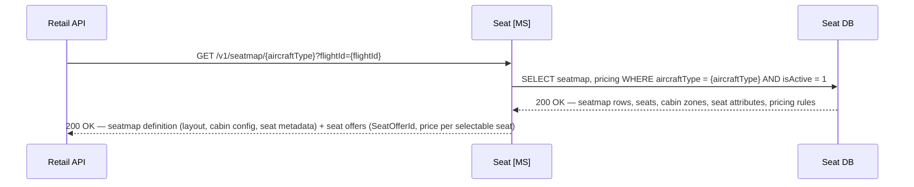

#### Post-Sale Seat Selection

Enables a traveller to choose or change their seat assignment after booking, presenting the live seatmap with real-time availability overlaid, and updating the manifest and e-tickets upon confirmation. Seat selection made post-sale carries the full ancillary charge. If a seat was not selected at booking, seats assigned at check-in are free of charge (see the Online Check-In flow in the Delivery section).


#### Data Schema — Seat

The Seat domain uses three tables. `AircraftType` is the root reference record. `Seatmap` holds one row per active aircraft configuration with the full cabin layout as JSON. `SeatPricing` holds the fleet-wide pricing rules by seat position and cabin, from which the Seat microservice derives the `seatOffer` price returned with each seatmap response.

#### `seat.AircraftType`

| Column | Type | Nullable | Default | Key | Notes |
|---|---|---|---|---|---|
| AircraftTypeCode | CHAR(4) | No | | PK | 4-char code: manufacturer prefix + 3-digit variant, e.g. `A351` (A350-1000), `B789` (B787-900) |
| Manufacturer | VARCHAR(50) | No | | | e.g. `Airbus`, `Boeing` |
| FriendlyName | VARCHAR(100) | Yes | | | e.g. `Airbus A350-1000`, `Boeing 787-900` |
| TotalSeats | SMALLINT | No | | | Total seat count across all cabins |
| IsActive | BIT | No | `1` | | |

#### `seat.Seatmap`

| Column | Type | Nullable | Default | Key | Notes |
|---|---|---|---|---|---|
| SeatmapId | UNIQUEIDENTIFIER | No | NEWID() | PK | |
| AircraftTypeCode | CHAR(4) | No | | FK → `seat.AircraftType(AircraftTypeCode)` | |
| Version | INT | No | `1` | | Incremented when the layout is updated |
| IsActive | BIT | No | `1` | | Only one active seatmap per aircraft type at any time |
| UpdatedAt | DATETIME2 | No | SYSUTCDATETIME() | | |
| CabinLayout | NVARCHAR(MAX) | No | | | JSON document containing full cabin and seat definitions (see example below) |

> **Indexes:** `IX_Seatmap_AircraftType` on `(AircraftTypeCode)` WHERE `IsActive = 1`.
> **Constraints:** `CHK_CabinLayout` — `ISJSON(CabinLayout) = 1`; `CabinLayout` must be a valid JSON document.

#### `seat.SeatPricing`

| Column | Type | Nullable | Default | Key | Notes |
|---|---|---|---|---|---|
| SeatPricingId | UNIQUEIDENTIFIER | No | NEWID() | PK | |
| CabinCode | CHAR(1) | No | | UK (with SeatPosition, CurrencyCode) | `W` (Premium Economy) · `Y` (Economy); Business Class (J/F) seats carry no ancillary charge |
| SeatPosition | VARCHAR(10) | No | | UK (with CabinCode, CurrencyCode) | `Window` · `Aisle` · `Middle` |
| CurrencyCode | CHAR(3) | No | `'GBP'` | UK (with CabinCode, SeatPosition) | ISO 4217 currency code |
| Price | DECIMAL(10,2) | No | | | |
| IsActive | BIT | No | `1` | | |
| ValidFrom | DATETIME2 | No | | | Effective start of this pricing rule |
| ValidTo | DATETIME2 | Yes | | | Null = open-ended / currently active |
| UpdatedAt | DATETIME2 | No | SYSUTCDATETIME() | | |

> **Constraints:** `UQ_SeatPricing_CabinPosition` (unique) on `(CabinCode, SeatPosition, CurrencyCode)` — enforces one active price per cabin/position/currency combination.
> **Pricing scope:** Pricing is fleet-wide and applied uniformly across all aircraft and routes. Business Class and First Class seats (cabin codes `J` and `F`) are excluded from `SeatPricing` — selection is included in the fare with no ancillary charge.
> **Example seed data:** `('W', 'Window', 'GBP', 70.00)` · `('W', 'Aisle', 'GBP', 50.00)` · `('W', 'Middle', 'GBP', 20.00)` · `('Y', 'Window', 'GBP', 70.00)` · `('Y', 'Aisle', 'GBP', 50.00)` · `('Y', 'Middle', 'GBP', 20.00)`.

> **Seat offer generation:** When building the seatmap response, the Seat microservice joins each seat's `position` attribute against `seat.SeatPricing` for the relevant `cabinCode` to derive the price, then generates a `SeatOfferId` (a deterministic UUID based on `SeatmapId` + `SeatNumber` + current pricing version) for each selectable seat. These `SeatOfferIds` are short-lived in the same way as flight `OfferIds` — they should be treated as valid only for the duration of the current session. The Order microservice stores the `SeatOfferId` on the seat order item for traceability.

**Example `CabinLayout` JSON document**

The JSON is structured as an ordered array of cabins, each containing a column configuration and an array of rows. Each seat carries its label, position, physical attributes, and a `seatPrice` derived from `seat.SeatPricing` at the time of seatmap generation. Business Class seats carry a `seatPrice` of `null` as selection is included in the fare. This structure is consumed directly by the front-end seat picker UI, which overlays real-time availability from the Offer microservice at query time.

```json
{
  "aircraftType": "A351",
  "version": 1,
  "totalSeats": 258,
  "cabins": [
    {
      "cabinCode": "J",
      "cabinName": "Business Class",
      "deckLevel": "Main",
      "startRow": 1,
      "endRow": 8,
      "columns": ["A", "D", "G", "K"],
      "layout": "1-1-1-1",
      "rows": [
        {
          "rowNumber": 1,
          "seats": [
            {
              "seatNumber": "1A",
              "column": "A",
              "type": "Suite",
              "position": "Window",
              "attributes": ["ExtraLegroom", "BlockedForCrew"],
              "isSelectable": false
            },
            {
              "seatNumber": "1D",
              "column": "D",
              "type": "Suite",
              "position": "Middle",
              "attributes": ["ExtraLegroom"],
              "isSelectable": true
            },
            {
              "seatNumber": "1G",
              "column": "G",
              "type": "Suite",
              "position": "Middle",
              "attributes": ["ExtraLegroom"],
              "isSelectable": true
            },
            {
              "seatNumber": "1K",
              "column": "K",
              "type": "Suite",
              "position": "Window",
              "attributes": ["ExtraLegroom"],
              "isSelectable": true
            }
          ]
        }
      ]
    },
    {
      "cabinCode": "W",
      "cabinName": "Premium Economy",
      "deckLevel": "Main",
      "startRow": 11,
      "endRow": 18,
      "columns": ["A", "B", "D", "E", "F", "H", "K"],
      "layout": "2-3-2",
      "rows": [
        {
          "rowNumber": 11,
          "seats": [
            {
              "seatNumber": "11A",
              "column": "A",
              "type": "Standard",
              "position": "Window",
              "attributes": ["ExtraLegroom"],
              "isSelectable": true
            },
            {
              "seatNumber": "11B",
              "column": "B",
              "type": "Standard",
              "position": "Aisle",
              "attributes": ["ExtraLegroom"],
              "isSelectable": true
            },
            {
              "seatNumber": "11D",
              "column": "D",
              "type": "Standard",
              "position": "Aisle",
              "attributes": ["ExtraLegroom"],
              "isSelectable": true
            },
            {
              "seatNumber": "11E",
              "column": "E",
              "type": "Standard",
              "position": "Middle",
              "attributes": ["ExtraLegroom"],
              "isSelectable": true
            },
            {
              "seatNumber": "11F",
              "column": "F",
              "type": "Standard",
              "position": "Aisle",
              "attributes": ["ExtraLegroom"],
              "isSelectable": true
            },
            {
              "seatNumber": "11H",
              "column": "H",
              "type": "Standard",
              "position": "Aisle",
              "attributes": ["ExtraLegroom"],
              "isSelectable": true
            },
            {
              "seatNumber": "11K",
              "column": "K",
              "type": "Standard",
              "position": "Window",
              "attributes": ["ExtraLegroom"],
              "isSelectable": true
            }
          ]
        }
      ]
    },
    {
      "cabinCode": "Y",
      "cabinName": "Economy",
      "deckLevel": "Main",
      "startRow": 22,
      "endRow": 54,
      "columns": ["A", "B", "C", "D", "E", "F", "G", "H", "K"],
      "layout": "3-3-3",
      "rows": [
        {
          "rowNumber": 22,
          "seats": [
            {
              "seatNumber": "22A",
              "column": "A",
              "type": "Standard",
              "position": "Window",
              "attributes": ["ExtraLegroom"],
              "isSelectable": true
            },
            {
              "seatNumber": "22B",
              "column": "B",
              "type": "Standard",
              "position": "Middle",
              "attributes": ["ExtraLegroom"],
              "isSelectable": true
            },
            {
              "seatNumber": "22C",
              "column": "C",
              "type": "Standard",
              "position": "Aisle",
              "attributes": ["ExtraLegroom"],
              "isSelectable": true
            },
            {
              "seatNumber": "22D",
              "column": "D",
              "type": "Standard",
              "position": "Aisle",
              "attributes": ["ExtraLegroom"],
              "isSelectable": true
            },
            {
              "seatNumber": "22E",
              "column": "E",
              "type": "Standard",
              "position": "Middle",
              "attributes": ["ExtraLegroom"],
              "isSelectable": true
            },
            {
              "seatNumber": "22F",
              "column": "F",
              "type": "Standard",
              "position": "Aisle",
              "attributes": ["ExtraLegroom"],
              "isSelectable": true
            },
            {
              "seatNumber": "22G",
              "column": "G",
              "type": "Standard",
              "position": "Aisle",
              "attributes": ["ExtraLegroom"],
              "isSelectable": true
            },
            {
              "seatNumber": "22H",
              "column": "H",
              "type": "Standard",
              "position": "Middle",
              "attributes": ["ExtraLegroom"],
              "isSelectable": true
            },
            {
              "seatNumber": "22K",
              "column": "K",
              "type": "Standard",
              "position": "Window",
              "attributes": ["ExtraLegroom"],
              "isSelectable": true
            }
          ]
        }
      ]
    }
  ]
}
```

> **Note:** `isSelectable` reflects whether a seat is physically available for selection (i.e. not a structural no-fly zone, crew seat, or permanently blocked position). Real-time occupancy — whether a seat has been sold or held on a specific flight — is overlaid at query time from `offer.FlightInventory` and is never stored here.

---

### Bag

The Bag microservice is the system of record for checked baggage policies and ancillary bag pricing. Every fare includes a **free bag allowance** determined by the cabin class of travel; the Bag microservice owns this policy table and returns it alongside priced offers for any additional bags the customer wishes to purchase. Bag prices are defined fleet-wide and apply uniformly across all routes — the same model used by the Seat microservice for seat pricing.

Free checked bag allowances by cabin:

| Cabin | Free Bags Included | Max Weight per Bag |
|---|---|---|
| Economy (Y) | 1 bag | 23 kg |
| Premium Economy (W) | 2 bags | 23 kg |
| Business / First (J/F) | 2 bags | 32 kg |

Additional bag pricing (per bag, per segment):

| Additional Bag | Price |
|---|---|
| 1st additional bag | £60.00 |
| 2nd additional bag | £80.00 |
| 3rd+ additional bag | £100.00 |

When a channel requests bag offers for a flight, the Bag microservice returns both the free allowance applicable to the passenger's cabin and a `BagOffer` for each purchasable additional bag, each containing a `BagOfferId` and price. The `BagOfferId` is passed to the Order microservice when additional bags are purchased, linking the bag order item to the priced offer. The Bag microservice does **not** manage operational baggage handling or departure control — those functions sit within the airline's wider DCS (Departure Control System) and are outside the scope of this design.

#### Retrieve Bag Allowance and Bag Offers

Before presenting bag options to a customer, the Retail API queries the Bag microservice to obtain both the free entitlement applicable to the passenger's cabin and a set of priced `BagOffer` objects for any additional bags they may wish to purchase. This mirrors the seatmap retrieval pattern: pricing is locked at offer-generation time by snapshotting each `BagOffer` into the `StoredBagOffer` table, and the returned `BagOfferId` is passed to the Order microservice at point of purchase to guarantee price integrity regardless of how much time elapses before the customer confirms.

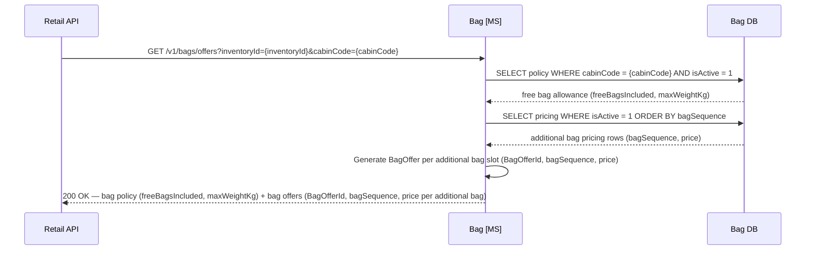

#### Post-Sale Bag Selection

Customers may add checked bags to a confirmed booking at any time before online check-in opens through the manage-booking flow. The free bag allowance for the booked cabin is displayed automatically; the customer may then purchase one or more additional bags beyond that allowance. In IATA one-order terms, each additional bag purchased creates a separate `Bag` order item carrying its own `BagOfferId` and payment reference. Free bags carry no charge and do not generate order items.

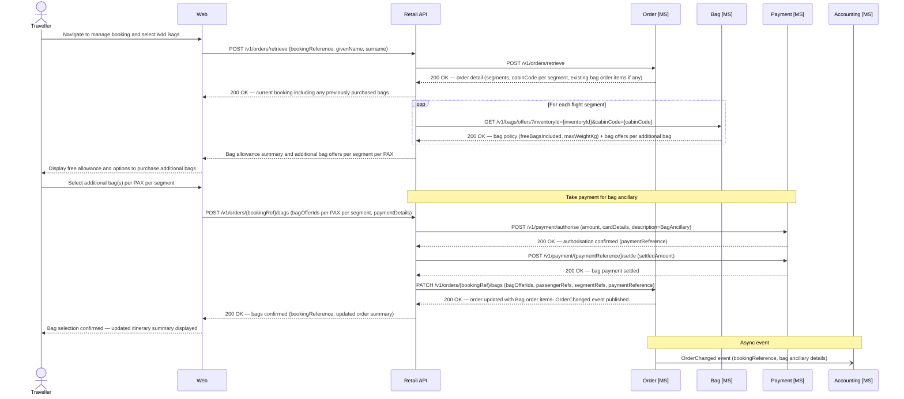

#### Data Schema — Bag

#### `bag.BagPolicy`

| Column | Type | Nullable | Default | Key | Notes |
|---|---|---|---|---|---|
| PolicyId | UNIQUEIDENTIFIER | No | NEWID() | PK | |
| CabinCode | CHAR(1) | No | | UK | `F` · `J` · `W` · `Y` |
| FreeBagsIncluded | TINYINT | No | | | Number of free checked bags included in fare for this cabin |
| MaxWeightKgPerBag | TINYINT | No | | | Maximum weight per individual bag in kilograms |
| IsActive | BIT | No | `1` | | |
| CreatedAt | DATETIME2 | No | SYSUTCDATETIME() | | |
| UpdatedAt | DATETIME2 | No | SYSUTCDATETIME() | | |

> **Example seed data:** `('J', 2, 32)` · `('F', 2, 32)` · `('W', 2, 23)` · `('Y', 1, 23)`.
> **One active policy per cabin:** The `UNIQUE` constraint on `CabinCode` enforces a single active bag policy per cabin code. Policy changes should be managed by updating the existing row rather than inserting new rows.

#### `bag.BagPricing`

| Column | Type | Nullable | Default | Key | Notes |
|---|---|---|---|---|---|
| PricingId | UNIQUEIDENTIFIER | No | NEWID() | PK | |
| BagSequence | TINYINT | No | | UK (with CurrencyCode) | `1` = 1st additional bag beyond free allowance · `2` = 2nd additional · `99` = 3rd and beyond (catch-all) |
| CurrencyCode | CHAR(3) | No | `'GBP'` | UK (with BagSequence) | ISO 4217 currency code |
| Price | DECIMAL(10,2) | No | | | |
| IsActive | BIT | No | `1` | | |
| ValidFrom | DATETIME2 | No | | | Effective start of this pricing rule |
| ValidTo | DATETIME2 | Yes | | | Null = open-ended / currently active |
| UpdatedAt | DATETIME2 | No | SYSUTCDATETIME() | | |

> **Constraints:** `UQ_BagPricing_Sequence` (unique) on `(BagSequence, CurrencyCode)` — enforces one active price per bag sequence/currency combination.
> **Example seed data:** `(1, 'GBP', 60.00)` · `(2, 'GBP', 80.00)` · `(99, 'GBP', 100.00)`.

#### `bag.StoredBagOffer`

| Column | Type | Nullable | Default | Key | Notes |
|---|---|---|---|---|---|
| BagOfferId | UNIQUEIDENTIFIER | No | NEWID() | PK | Short-lived snapshot; passed to channels as the bag offer identifier |
| InventoryId | UNIQUEIDENTIFIER | No | | | Cross-schema ref to `offer.FlightInventory(InventoryId)`; not enforced as DB FK |
| CabinCode | CHAR(1) | No | | | `F` · `J` · `W` · `Y` |
| BagSequence | TINYINT | No | | | Which additional bag this offer prices (mirrors `bag.BagPricing.BagSequence`) |
| FreeBagsIncluded | TINYINT | No | | | Free allowance applicable to this cabin at time of offer generation |
| CurrencyCode | CHAR(3) | No | `'GBP'` | | ISO 4217 currency code |
| PriceAmount | DECIMAL(10,2) | No | | | Price locked at offer creation time |
| CreatedAt | DATETIME2 | No | SYSUTCDATETIME() | | |
| ExpiresAt | DATETIME2 | No | | | Offer expiry; channels must not submit expired `BagOfferId` values |
| IsConsumed | BIT | No | `0` | | Set to `1` once purchased; prevents reuse |

> **Indexes:** `IX_StoredBagOffer_Inventory` on `(InventoryId, CabinCode)`. `IX_StoredBagOffer_Expiry` on `(ExpiresAt)` WHERE `IsConsumed = 0` — used by background cleanup job.
> **Offer lifecycle:** `StoredBagOffer` rows are short-lived snapshots generated at retrieval time and consumed at purchase. Unconsumed, expired offers should be purged by a background job.

## Customer

The Customer microservice is the system of record for customer accounts and loyalty programme membership. Each account holds the customer's profile, tier status, current points balance, and a full transaction history of points earned and redeemed. Accounts are identified by a unique loyalty number issued at registration.

Authentication credentials (email address and password) are owned by a separate **Identity microservice** with its own Identity DB. The Customer DB holds only an `IdentityReference` — the opaque identifier that links a Customer record to its corresponding Identity account. This separation means the Customer microservice never handles credentials directly, and the Identity microservice never holds loyalty or profile data.

### Register for the Loyalty Programme

A new customer registers for the Apex Air loyalty programme via the web. Registration creates two linked records: a login account in the Identity microservice (which owns the email and password), and a loyalty account in the Customer microservice (which owns the profile and points balance). The two are joined by an `IdentityReference` UUID, which the Identity microservice generates and passes back so the Loyalty API can store it on the Customer record.

On successful registration the customer receives a unique loyalty number and is automatically assigned to the base tier (`Blue`). A confirmation email is triggered from the Loyalty API once both records are created.

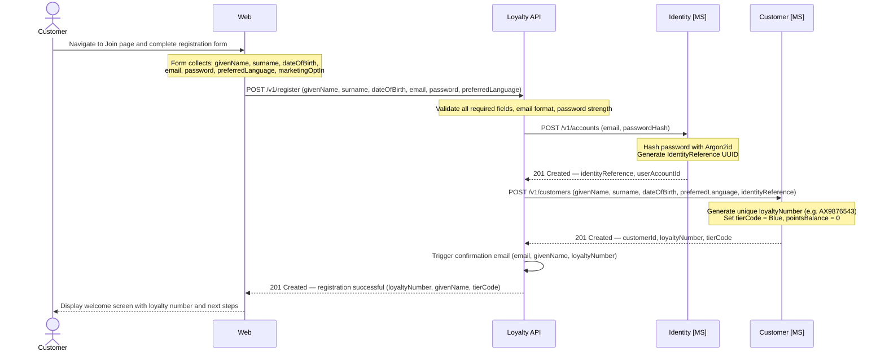

> **Email verification:** The `IsEmailVerified` flag on `identity.UserAccount` is set to `0` at registration. The confirmation email contains a one-time verification link. On click, a separate `POST /v1/accounts/{userAccountId}/verify-email` call is made to the Identity microservice to set `IsEmailVerified = 1`. Unverified accounts may still log in but are restricted from certain actions (e.g. redemptions) until verified.

> **Duplicate email handling:** The Identity microservice enforces a unique constraint on `Email`. If a registration attempt arrives for an address that already exists, the Identity microservice returns `409 Conflict`. The Loyalty API surfaces this as a validation error to the channel — it must not reveal whether the email belongs to an existing account (to prevent account enumeration).

> **Failure handling:** If the Identity microservice call succeeds but the subsequent Customer microservice call fails, the Loyalty API must call `DELETE /v1/accounts/{userAccountId}` on the Identity microservice to clean up the orphaned login account before returning an error to the channel. Partial registration states must not be left in the system.

### Retrieve Account and Points Balance

The loyalty dashboard is typically the first screen a member sees after logging in, and also the source of loyalty context shown during the booking flow. It surfaces the two key values the programme tracks separately: **PointsBalance** (the redeemable currency available to spend on award bookings) and **TierProgressPoints** (the qualifying activity accumulated towards tier status). A member's tier — Blue, Silver, Gold, or Platinum — determines the benefits they receive on every flight, including lounge access, priority boarding, and earn-rate multipliers. Displaying tier progress alongside the redeemable balance is a deliberate engagement mechanism common to FFP (Frequent Flyer Programme) designs, giving members visibility of how close they are to the next tier threshold.

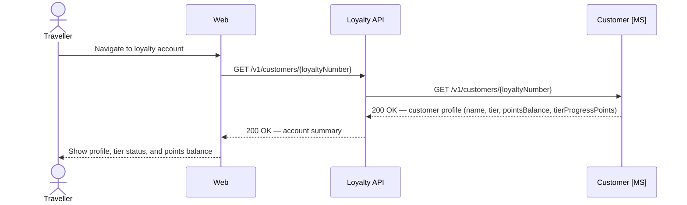

---

### Retrieve Transaction History

The points statement is the audit trail of every points movement on a loyalty account. In FFP (Frequent Flyer Programme) terms this is an important trust mechanism: members expect full visibility of when points were earned for each completed flight, when redemptions were processed, and any manual adjustments applied by customer services. The `LoyaltyTransaction` table is an immutable append-only log — each row is a permanent record of a points movement with a running `BalanceAfter` snapshot. Transactions are returned in reverse-chronological order and paginated; channels should implement pagination controls appropriate for long-standing members whose history may span hundreds of entries.

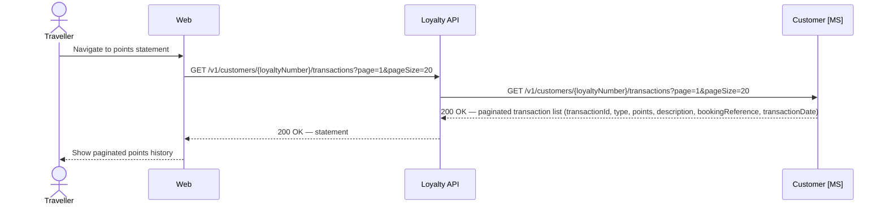

---

### Earn Points on Booking Confirmation

When an order is confirmed, the Order microservice publishes an `OrderConfirmed` event to the event bus. If the booking includes a loyalty number on any passenger, the Customer microservice consumes this event and accrues the appropriate points to the customer's account. Points are calculated based on the fare paid, cabin class, and tier at time of travel.

> **Points calculation** rules (multipliers, bonus tiers, partner earn rates) are the responsibility of the Customer microservice and are not defined in this document. The event payload provides the inputs; the calculation logic is encapsulated within the service.

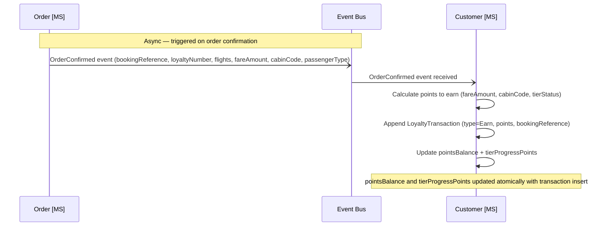

---

### Update Profile Details

A customer's loyalty profile holds the personal and contact information Apex Air maintains on record: legal name, date of birth, nationality, preferred language, and telephone number. Customers may update any of these fields at any time through the loyalty web portal. The Loyalty API validates the JWT access token on each request using the Identity microservice's public signing key — no database round-trip is required — before forwarding the change to the Customer microservice.

A key industry constraint applies to name changes. The passenger name on an issued e-ticket must match the holder's travel document exactly, as required under IATA Resolution 735 and individual carrier fare rules. Updating a name on the loyalty profile does **not** retroactively amend the name recorded on any confirmed booking or issued e-ticket; those are independent records owned by the Order and Delivery microservices respectively. Minor typographical corrections on an existing ticket (e.g. a single transposed character) are typically granted as a waiver; anything beyond that may require a ticket reissue and the application of the fare's change conditions. Customers needing to correct a name on a confirmed booking must use the manage-booking flow via the Retail API.

```mermaid
sequenceDiagram
    actor Customer
    participant Web
    participant LoyaltyAPI as Loyalty API
    participant CustomerMS as Customer [MS]
    participant CustomerDB as Customer DB

    Customer->>Web: Submit updated profile fields (givenName, surname, dateOfBirth, nationality, phoneNumber, preferredLanguage)
    Web->>LoyaltyAPI: PATCH /v1/customers/{loyaltyNumber}/profile — Bearer {accessToken}

    LoyaltyAPI->>LoyaltyAPI: Validate JWT using Identity MS public signing key

    alt Token invalid or expired
        LoyaltyAPI-->>Web: 401 Unauthorized
        Web-->>Customer: Session expired — please log in again
    end

    LoyaltyAPI->>CustomerMS: PATCH /v1/customers/{loyaltyNumber} (changed fields only)
    CustomerMS->>CustomerDB: UPDATE customer.Customer SET ... WHERE LoyaltyNumber = {loyaltyNumber}
    CustomerDB-->>CustomerMS: Row updated- UpdatedAt refreshed
    CustomerMS-->>LoyaltyAPI: 200 OK — updated customer record
    LoyaltyAPI-->>Web: 200 OK — profile updated
    Web-->>Customer: Confirmation — details have been saved
```

---

### Update Email Address

The email address on a loyalty account serves two purposes: it is the login credential held by the Identity microservice and the primary address for account and operational notifications. Because a change to the login credential is a security-sensitive operation, the update follows a two-step verification flow rather than taking effect immediately. A time-limited verification link is sent to the **new** address; the existing address and credentials remain active until the customer demonstrates ownership of the new one by clicking that link. On successful verification, all active refresh tokens for the account are invalidated, requiring the customer to re-authenticate with the new address. This mirrors standard practice in the industry for credential changes, protecting against account takeover via an unverified address substitution.

Because the email address is owned entirely by the Identity microservice (the Customer microservice holds no email field), this flow does not require an update to the Customer DB.

```mermaid
sequenceDiagram
    actor Customer
    participant Web
    participant LoyaltyAPI as Loyalty API
    participant IdentityMS as Identity [MS]

    Customer->>Web: Request email address change (newEmail)
    Web->>LoyaltyAPI: POST /v1/customers/{loyaltyNumber}/email/change-request { newEmail } — Bearer {accessToken}

    LoyaltyAPI->>LoyaltyAPI: Validate JWT using Identity MS public signing key

    alt Token invalid or expired
        LoyaltyAPI-->>Web: 401 Unauthorized
        Web-->>Customer: Session expired — please log in again
    end

    LoyaltyAPI->>IdentityMS: POST /v1/accounts/{identityReference}/email/change-request { newEmail }
    IdentityMS->>IdentityMS: Check newEmail is not already registered on another account

    alt Email already in use
        IdentityMS-->>LoyaltyAPI: 409 Conflict
        LoyaltyAPI-->>Web: 409 Conflict — email already associated with another account
        Web-->>Customer: That email address is already in use
    end

    IdentityMS->>IdentityMS: Store pending email change- generate time-limited single-use verification token
    IdentityMS->>IdentityMS: Send verification email to newEmail containing token link
    IdentityMS-->>LoyaltyAPI: 202 Accepted
    LoyaltyAPI-->>Web: 202 Accepted
    Web-->>Customer: Check your new inbox for a verification link

    Note over Customer,IdentityMS: Customer receives the verification email and follows the link

    Customer->>Web: Follow verification link (token)
    Web->>LoyaltyAPI: POST /v1/email/verify { token }
    LoyaltyAPI->>IdentityMS: POST /v1/email/verify { token }
    IdentityMS->>IdentityMS: Validate token (not expired, not previously used)

    alt Token invalid or expired
        IdentityMS-->>LoyaltyAPI: 400 Bad Request — token invalid or expired
        LoyaltyAPI-->>Web: 400 Bad Request
        Web-->>Customer: Verification link has expired — please request a new one
    end

    IdentityMS->>IdentityMS: Update UserAccount.Email to newEmail
    IdentityMS->>IdentityMS: Invalidate all active refresh tokens for this account (force re-login)
    IdentityMS-->>LoyaltyAPI: 200 OK — email updated
    LoyaltyAPI-->>Web: 200 OK — email address changed successfully
    Web-->>Customer: Email updated — please log in again with your new address
```

---

### Data Schema — Customer

The Customer domain uses three tables. `Customer` holds one row per loyalty account, containing profile information, tier status, and running points balances. `LoyaltyTransaction` records every points movement as an immutable append-only log — earnings from flights and redemptions against future bookings. `TierConfig` holds the qualifying thresholds for each tier level, used when evaluating tier upgrades.

**Identity separation**

The `Customer` table stores an `IdentityReference` — the unique identifier issued by the Identity microservice when the customer's login account is created. This reference is the only link between the two domains. The Customer microservice never stores email addresses or passwords; the Identity microservice never stores loyalty or profile data. The `IdentityReference` column is nullable to support legacy or manually created accounts that predate the Identity microservice, or future scenarios where a customer has a loyalty account without a login.

#### `customer.TierConfig`

| Column | Type | Nullable | Default | Key | Notes |
|---|---|---|---|---|---|
| TierConfigId | UNIQUEIDENTIFIER | No | NEWID() | PK | |
| TierCode | VARCHAR(20) | No | | | `Blue` · `Silver` · `Gold` · `Platinum` |
| TierLabel | VARCHAR(50) | No | | | Display name, e.g. `Apex Silver` |
| MinQualifyingPoints | INT | No | | | Minimum tier progress points required to hold this tier |
| IsActive | BIT | No | `1` | | |
| ValidFrom | DATETIME2 | No | | | Effective start of this tier configuration |
| ValidTo | DATETIME2 | Yes | | | Null = currently active |
| CreatedAt | DATETIME2 | No | SYSUTCDATETIME() | | |

> **Indexes:** `IX_TierConfig_Active` on `(TierCode)` WHERE `IsActive = 1`.
> **Versioning:** Rows are never deleted, only superseded. To change tier thresholds, insert a new row with `IsActive = 1` and set `ValidTo` on the previous row.

#### `customer.Customer`

| Column | Type | Nullable | Default | Key | Notes |
|---|---|---|---|---|---|
| CustomerId | UNIQUEIDENTIFIER | No | NEWID() | PK | |
| LoyaltyNumber | VARCHAR(20) | No | | UK | Issued at account creation, e.g. `AX9876543` |
| IdentityReference | UNIQUEIDENTIFIER | Yes | | UK | Opaque ref to Identity DB; null if no login account (e.g. pre-Identity legacy accounts) |
| GivenName | VARCHAR(100) | No | | | |
| Surname | VARCHAR(100) | No | | | |
| DateOfBirth | DATE | Yes | | | |
| Nationality | CHAR(3) | Yes | | | ISO 3166-1 alpha-3 |
| PreferredLanguage | CHAR(5) | Yes | `'en-GB'` | | BCP 47 language tag |
| PhoneNumber | VARCHAR(30) | Yes | | | |
| TierCode | VARCHAR(20) | No | `'Blue'` | | FK ref to `customer.TierConfig(TierCode)` enforced at application layer |
| PointsBalance | INT | No | `0` | | Current redeemable points balance |
| TierProgressPoints | INT | No | `0` | | Qualifying points for tier evaluation; not decremented on redemption |
| IsActive | BIT | No | `1` | | |
| CreatedAt | DATETIME2 | No | SYSUTCDATETIME() | | |
| UpdatedAt | DATETIME2 | No | SYSUTCDATETIME() | | |

> **Indexes:** `IX_Customer_LoyaltyNumber` on `(LoyaltyNumber)`. `IX_Customer_Surname` on `(Surname, GivenName)`.
> **Identity separation:** The Customer table stores only `IdentityReference` — it never stores email addresses or passwords. The FK to `customer.TierConfig` is enforced at the application layer rather than as a DB constraint to avoid cross-table coupling during tier configuration changes.

#### `customer.LoyaltyTransaction`

| Column | Type | Nullable | Default | Key | Notes |
|---|---|---|---|---|---|
| TransactionId | UNIQUEIDENTIFIER | No | NEWID() | PK | |
| CustomerId | UNIQUEIDENTIFIER | No | | FK → `customer.Customer(CustomerId)` | |
| TransactionType | VARCHAR(20) | No | | | `Earn` · `Redeem` · `Adjustment` · `Expiry` · `Reinstate` |
| PointsDelta | INT | No | | | Positive = earned; negative = redeemed or expired |
| BalanceAfter | INT | No | | | Running `PointsBalance` snapshot after this transaction |
| BookingReference | CHAR(6) | Yes | | | Associated booking reference where applicable |
| FlightNumber | VARCHAR(10) | Yes | | | Associated flight where applicable (Earn transactions) |
| Description | VARCHAR(255) | No | | | e.g. `'Points earned — AX003 LHR-JFK, Business Flex'` |
| TransactionDate | DATETIME2 | No | SYSUTCDATETIME() | | |
| CreatedAt | DATETIME2 | No | SYSUTCDATETIME() | | |

> **Indexes:** `IX_LoyaltyTransaction_Customer` on `(CustomerId, TransactionDate DESC)`. `IX_LoyaltyTransaction_BookingReference` on `(BookingReference)` WHERE `BookingReference IS NOT NULL`.
> **Immutability:** `LoyaltyTransaction` rows are append-only and must never be updated or deleted. `BalanceAfter` on the most recent transaction is the source of truth for a customer's points balance in the event of any discrepancy with the `PointsBalance` column.

> **Points balance integrity:** `PointsBalance` and `TierProgressPoints` on `customer.Customer` are updated atomically within the same database transaction as the `LoyaltyTransaction` insert. The `BalanceAfter` column on each transaction row records the running balance snapshot at that point, providing a self-consistent audit trail independent of the current balance column. In the event of a discrepancy, `BalanceAfter` on the most recent transaction is the source of truth.

> **TierProgressPoints vs PointsBalance:** These two values are tracked separately. `PointsBalance` is the redeemable balance available to spend. `TierProgressPoints` accumulates qualifying activity for tier evaluation and may be reset annually or per programme rules — it is not decremented when points are redeemed. Tier evaluation logic (when to upgrade or downgrade a member) is the responsibility of the Customer microservice and runs as a background process or is triggered by each `Earn` transaction.

> **Transaction types:** `Earn` — points accrued from a completed flight. `Redeem` — points redeemed against a future booking (award bookings, future phase). `Adjustment` — manual correction applied by a customer service agent with a reason. `Expiry` — points removed due to account inactivity or programme rules. `Reinstate` — reversal of an expiry or erroneous redemption.

---

## Identity

The Identity microservice is the security boundary for all authentication and credential management in the Apex Air system. It is the sole owner of email addresses and hashed passwords — no other microservice stores or has access to authentication credentials. The separation between Identity (authentication) and Customer (loyalty profile) is a deliberate architectural boundary: the Identity microservice knows nothing about points or tier status, and the Customer microservice knows nothing about passwords. The two domains are linked only by an opaque `IdentityReference` UUID, which means the Identity microservice can be hardened, replaced, or scaled independently of the rest of the system without any change to customer profile data.

Customer-facing authentication flows — login, logout, and session refresh — are consumed by the Loyalty API. Short-lived JWT access tokens are issued at login and validated by downstream APIs using the Identity microservice's public signing key, avoiding a database round-trip on every request. Longer-lived refresh tokens are stored in the Identity DB with single-use semantics; rotation on each use limits the exposure window if a token is ever compromised.

### Data Schema — Identity

The Identity microservice owns its own `identity.*` schema and is the sole store of authentication credentials. It holds one row per login account, linked to the Customer domain via `IdentityReference`. Passwords are stored as salted hashes only — plain text passwords are never persisted.

The Identity microservice exposes authentication and credential management endpoints consumed by the Loyalty API. It does not expose any loyalty or profile data; it returns only a validated `IdentityReference` on successful authentication, which the Loyalty API uses to look up the corresponding Customer account.

#### `identity.UserAccount`

| Column | Type | Nullable | Default | Key | Notes |
|---|---|---|---|---|---|
| UserAccountId | UNIQUEIDENTIFIER | No | NEWID() | PK | |
| IdentityReference | UNIQUEIDENTIFIER | No | NEWID() | UK | Shared key passed to the Customer microservice at registration |
| Email | VARCHAR(254) | No | | UK | RFC 5321 maximum length |
| PasswordHash | VARCHAR(255) | No | | | Argon2id hash; salt embedded in hash string; plain text must never be stored |
| IsEmailVerified | BIT | No | `0` | | Set to `1` after the customer clicks the verification link |
| IsLocked | BIT | No | `0` | | Set to `1` after repeated failed login attempts |
| FailedLoginAttempts | TINYINT | No | `0` | | Reset to `0` on successful authentication |
| LastLoginAt | DATETIME2 | Yes | | | Null until first successful login |
| PasswordChangedAt | DATETIME2 | No | SYSUTCDATETIME() | | |
| CreatedAt | DATETIME2 | No | SYSUTCDATETIME() | | |
| UpdatedAt | DATETIME2 | No | SYSUTCDATETIME() | | |

> **Indexes:** `IX_UserAccount_Email` on `(Email)`.
> **Account lockout:** After a configurable number of consecutive failed login attempts (default: 5), `IsLocked` is set to `1`. Further authentication attempts are rejected until the flag is reset. `FailedLoginAttempts` resets to `0` on successful authentication.
> **Password hashing:** Passwords must be hashed using Argon2id (bcrypt acceptable as fallback). The raw password must not be stored, logged, or transmitted after the initial hash operation.

#### `identity.RefreshToken`

| Column | Type | Nullable | Default | Key | Notes |
|---|---|---|---|---|---|
| RefreshTokenId | UNIQUEIDENTIFIER | No | NEWID() | PK | |
| UserAccountId | UNIQUEIDENTIFIER | No | | FK → `identity.UserAccount(UserAccountId)` | |
| TokenHash | VARCHAR(255) | No | | | Hashed token value; raw token returned to client at issuance only |
| DeviceHint | VARCHAR(100) | Yes | | | Optional user-agent label for session management UI |
| IsRevoked | BIT | No | `0` | | Set to `1` on use (single-use semantics) or explicit logout |
| ExpiresAt | DATETIME2 | No | | | |
| CreatedAt | DATETIME2 | No | SYSUTCDATETIME() | | |

> **Indexes:** `IX_RefreshToken_UserAccount` on `(UserAccountId)` WHERE `IsRevoked = 0`.
> **Token rotation:** On each use, the existing token is revoked (`IsRevoked = 1`) and a new one issued, providing single-use semantics. All tokens for a `UserAccountId` can be revoked simultaneously to force logout across all sessions.
> **Access tokens:** Short-lived JWT access tokens (recommended TTL: 15 minutes) are not persisted. Validation uses the Identity microservice's public signing key without a database round-trip.

> **Password hashing:** Passwords must be hashed using Argon2id (bcrypt acceptable as fallback). The raw password must not be stored, logged, or transmitted after the initial hash operation. Salt is embedded within the hash string.

> **Account lockout:** After a configurable number of consecutive failed login attempts (default: 5), `IsLocked` is set to `1` and further authentication attempts are rejected until an administrator or automated unlock process resets the flag. Failed attempt counts reset to zero on successful authentication.

> **Refresh token rotation:** On each use of a refresh token, the existing token is revoked and a new one issued, providing single-use semantics. All tokens for a `UserAccountId` can be revoked simultaneously to force logout across all sessions.

> **Access tokens:** Short-lived JWT access tokens (recommended TTL: 15 minutes) are issued at authentication time and are not persisted in the Identity DB. The Loyalty API and Retail API validate access tokens using the Identity microservice's public signing key without a database round-trip on each request.

> **IdentityReference:** The Identity microservice issues the `IdentityReference` UUID at login account creation and passes it to the Customer microservice for storage. The Customer microservice does not call the Identity microservice to validate credentials — authentication is handled upstream by the Loyalty API before any Customer calls are made.


-----

# Technical Considerations

- Microservices built in C# as Azure Functions (isolated)
- Databases will be built in Microsoft SQL. Ideally these would be individual, isolated, database instances, but for this project, we will use one database with key domains separated logically using the domain names and the schema.
- Front end websites, app and contact centre apps (including others) will be built using the latest version of Angular, hosted as Static Web Apps on Azure.
- **Aircraft type codes** are represented as a 4-character code consisting of the manufacturer prefix followed by a 3-digit variant number. The third digit encodes the specific variant. For example: A350-1000 → `A351`, A350-900 → `A359`, B787-900 → `B789`, B787-10 → `B781`. This convention is consistent with IATA SSIM aircraft designator standards and must be used uniformly across all services, databases, and API contracts.
- JSON columns (`OrderData`, `CabinLayout`) use SQL Server's native `NVARCHAR(MAX)` with `ISJSON` check constraints to enforce structural validity. Where query performance requires filtering or sorting on JSON properties, SQL Server computed columns with JSON path expressions should be used to create targeted indexes.
- **StoredOffer expiry:** The `offer.StoredOffer` table includes an `ExpiresAt` column. The Order API must validate that an offer has not expired before consuming it. A background job should periodically purge or archive expired, unconsumed offers to keep the table lean.
- **Offer consumption:** Once an `OfferId` is successfully retrieved by the Order API during order creation, `IsConsumed` is set to `1` on the `StoredOffer` row to prevent the same offer being used on multiple orders.
- **Basket lifecycle:** The basket is the authoritative pre-sale state and lives entirely in the Order DB (`order.Basket`). It is created at the start of checkout, accumulates flight offers, seat offers, and PAX details, and is hard-deleted on successful order confirmation. If abandoned or expired, a background job releases held inventory and marks the basket `Expired`. The `TicketingTimeLimit` (default 24 hours, configurable via `order.BasketConfig`) is the latest time by which payment must complete; the `ExpiresAt` is the latest time the basket itself is considered valid. Both are evaluated before authorisation is attempted.
- **Payment DB:** The Payment microservice owns its own `payment.*` schema. The `PaymentReference` (e.g. `AXPAY-0001`) is the shared key between the Payment DB and the Order microservice — it is stored on each `orderItem` in `OrderData` to link order lines to their payment transactions. Multiple `PaymentReference` values may exist per booking (one per ancillary payment type). The full card token used during authorisation is never persisted; only `CardLast4` and `CardType` are stored.
- **SeatPricing:** Fleet-wide seat prices are defined in `seat.SeatPricing` and are cabin- and position-based. Business Class seat selection carries no charge. The Seat microservice derives `seatPrice` and `seatOfferId` at seatmap generation time by joining seat position to the active pricing rules. `SeatOfferId` values are session-scoped and should not be stored long-term by channels.
- **Delivery DB:** The Delivery microservice owns its own `Delivery DB` schema (`delivery.*`). It does not read from or write to `order.Order`. Order data required for manifest population (e-ticket numbers, passenger names, seat assignments) is passed explicitly by the Retail API orchestration layer at the point of booking confirmation and subsequent seat changes.
- **FlightManifest seatmap validation:** Before writing any row to `delivery.FlightManifest`, the Delivery microservice must validate the `SeatNumber` against the active seatmap for the relevant `AircraftType` by calling the Seat microservice. Any seat number not present on the seatmap must be rejected. This validation applies to both initial writes (booking confirmation) and updates (post-purchase seat changes).
- **Disruption API idempotency:** The Disruption API must store a log of processed `disruptionEventId` values from the FOS and de-duplicate repeat submissions. The FOS is an external system and may retry events on network failure; duplicate processing of the same cancellation or delay event would result in corrupt order state.
- **IROPS fare override:** The Order microservice must recognise a `reason=FlightCancellation` flag on rebook requests originating from the Disruption API and waive fare change restrictions regardless of the original fare conditions. This override must be logged on the order history for audit purposes.
- **Disruption rebooking prioritisation:** Cancellation rebooking is processed in priority order (cabin class → loyalty tier → booking date). The Disruption API is responsible for sorting the affected passenger list before iterating. This ordering must be preserved in the processing queue even for large passenger loads handled asynchronously.

# Airline Context — Apex Air

This document describes the reservation system for **Apex Air**, IATA carrier code **AX**. All examples, flight numbers, carrier codes, and loyalty references throughout this document use the `AX` designator.

Apex Air is a premium transatlantic and long-haul carrier operating a fleet of approximately 50 aircraft across three types:

- **Boeing 787-9** (`B789`) — primary long-haul workhorse, used on transatlantic and Asia-Pacific routes
- **Airbus A330-900** (`A339`) — medium-to-long-haul, used on Caribbean and secondary transatlantic routes
- **Airbus A350-1000** (`A351`) — flagship widebody, used on high-demand transatlantic and key Asia routes

Apex Air's network is focused on the following key markets:

- **North America** — major gateway cities including New York (JFK), Los Angeles (LAX), Miami (MIA), Chicago (ORD), and Boston (BOS)
- **Caribbean** — leisure and VFR routes to destinations including Barbados (BGI), Jamaica (KIN), and the Bahamas (NAS)
- **East Asia** — Hong Kong (HKG), Tokyo (NRT), Shanghai (PVG), and Beijing (PEK)
- **South-East Asia** — Singapore (SIN)
- **South Asia** — key Indian cities including Mumbai (BOM), Delhi (DEL), and Bangalore (BLR)

All flights operate from a single UK hub. Apex Air participates in the IATA ONE Order standard and operates a modern retailing architecture as described in this document.

---

# Glossary

- **APIS** — Advance Passenger Information System
- **BCBP** — Bar Coded Boarding Pass (IATA Resolution 792 standard for boarding pass barcode encoding)
- **CMK** — Customer-Managed Key
- **CORS** — Cross-Origin Resource Sharing
- **FOS** — Flight Operations System; the airline's operational system that manages the live flight schedule and notifies the reservation system of disruption events (delays and cancellations) via the Disruption API
- **GDS** — Global Distribution System
- **IATA** — International Air Transport Association
- **IROPS** — Irregular Operations; collective term for disruption events including delays, cancellations, diversions, and aircraft swaps that require operational intervention in the reservation system
- **MCT** — Minimum Connection Time; the minimum layover time required at an airport for a passenger to transfer between two flights, as defined by the airport authority; connections below MCT are not legally valid itineraries
- **NDC** — New Distribution Capability (IATA standard)
- **OLCI** — Online Check In
- **OTA** — Online Travel Agent
- **PAX** — Passenger
- **PCI DSS** — Payment Card Industry Data Security Standard
- **PII** — Personally Identifiable Information
- **PNR** — Passenger Name Record
- **RBAC** — Role-Based Access Control
- **TLS** — Transport Layer Security
- **UK GDPR** — United Kingdom General Data Protection Regulation
