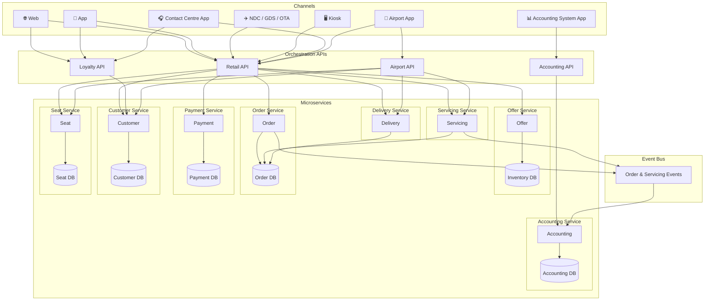
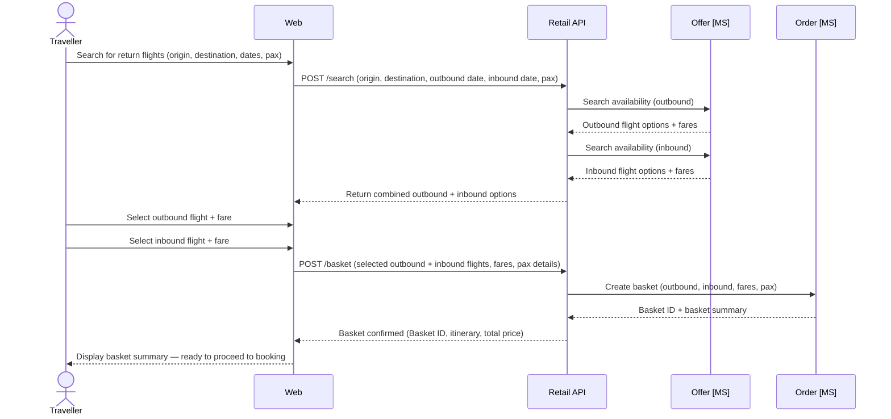
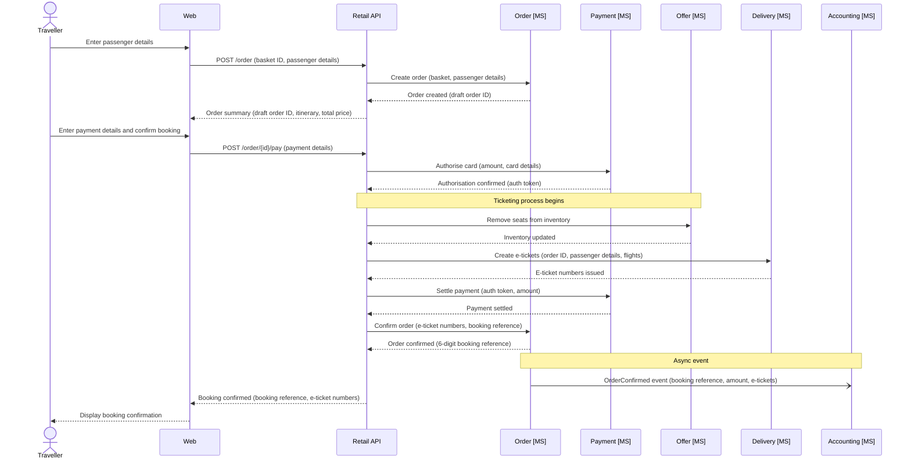
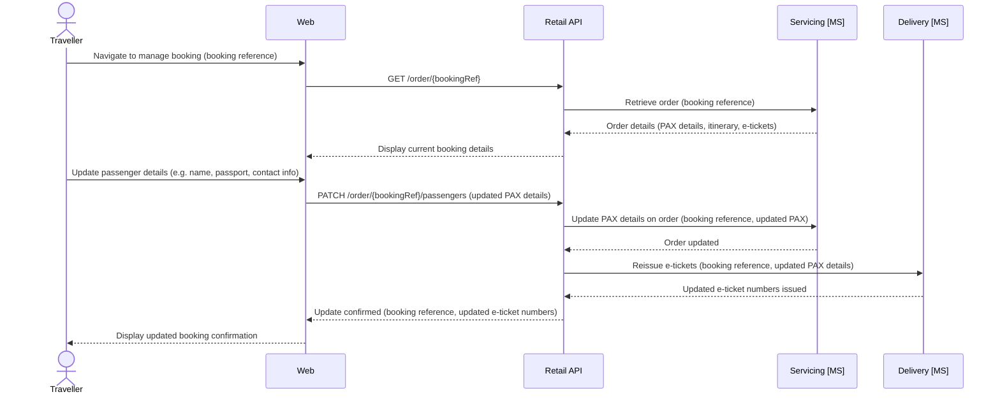
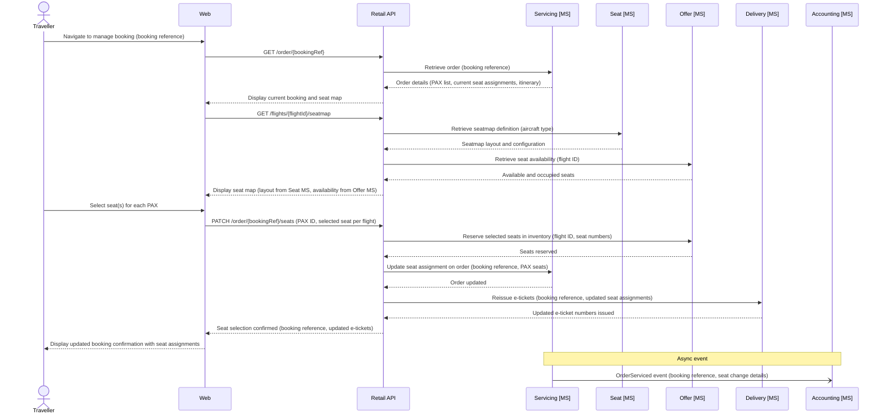
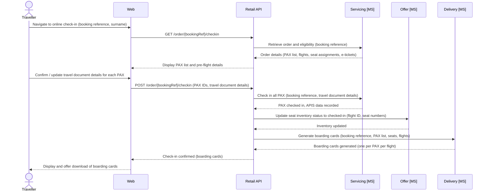
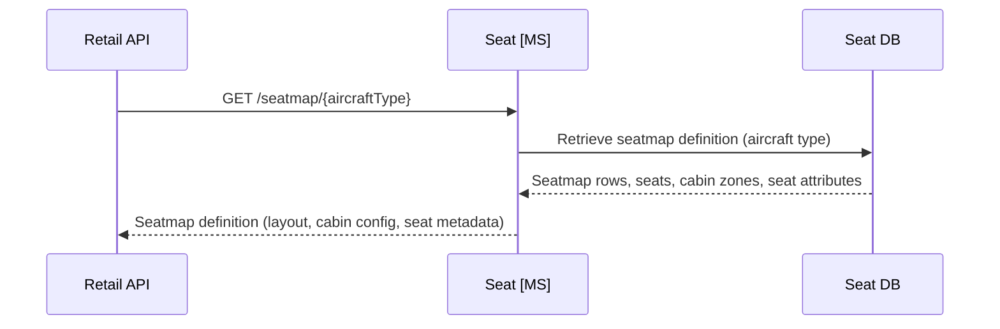

# System Architecture - Design

## Overview

This outlines the design for an airline reservation system based on offer and order capability (Modern Airline Retailing).

The system will have the following core concepts.

- Offer - returns availability and pricing of the airlines flights
- Order - creates orders (bookings on the plane) based on the offer, with passenger information included, and takes payment
- Payment - payment orchestration, supporting at first credit card payments but in future other payment methods like PayPal and ApplePay.
- Servicing - change and cancel of orders
- Delivery - Akin to departure control, including online check in (OLCI), irregular operations (IROPS), seat allocation, gate management
- Customer - loyalty accounts for customers - with customer details, points balances, and transaction (historical and future orders)
- Accounting - accounting system - keeping a track of all orders, refunds, balance sheets, profit and loss.
- Seat - manages seatmap definitions per aircraft type; provides seatmap views to other services and channels (does not manage seat selection or inventory)

Please note (these one-name capability 'domain names' should be used for domain naming in the code)

## High level system architecture

Key components:

- Channels
  - Web
  - App
  - NDC (XML APIs based on IATA NDC standard for GDS and other airlines (OTAs) to connect to)
  - Kiosk (self service airport check in terminals)
  - Contact Centre App (for new bookings, IROPS management, customer account management)
  - Airport App (for airport staff to manage non-OLCI check in, and gate management, seat assignment, etc)
  - Accounting System App
- Orchestration APIs (these act as the APIs to connect the channels to the microservices)
  - Retail API (for web, app, NDC, kiosk, contact centre app, airport app)
  - Loyalty API (for web, app, contact centre)
  - Airport API (for Airport App)
  - Accounting API (for accounting system app)
- Microservices (and their data-bound databases)
  - Offer
    - Inventory DB
  - Order
    - Order DB
  - Payment
    - Payment DB
  - Servicing
    - Uses Order DB
  - Delivery
    - Uses Order DB
  - Customer
    - Customer DB
  - Accounting (orders and changes should be evented to this microservice from Order and Servicing microservices)
    - Accounting DB
  - Seat (manages seatmap definitions per aircraft type; provides seatmap views only — seat selection and inventory remain with Offer)
    - Seat DB

# Capability

## Offer

## Order

### Create

## Servicing

### Manage booking - update PAX details

### Manage booking - select or update seat selection

## Delivery

### Online Check In

## Seat

### Retrieve Seatmap

The Seat microservice is the system of record for aircraft seatmap definitions, organised by aircraft type (e.g. A350, B787). It provides the physical layout, seat attributes (class, position, extra legroom, etc.) and cabin configuration. It does **not** manage seat availability or inventory — that remains the responsibility of the Offer microservice.

# Technical Considerations

- Microservices built in C# as Azure Functions (isolated)
- Databases will be built in Microsoft SQL. Ideally these would be individual, isolated, database instances, but for this project, we will use one database with key domains separated logically using the domain names and the schema.
- Front end websites, app and contact centre apps (including others) will be built using the latest version of Angular, hosted as Static Web Apps on Azure.

# Glossary

- PAX - passenger
- NDC - New distribution capability (IATA standard)
- OLCI - Online Check In
- IROPS - Irregular Operations
- APIS - Advance Passenger Information System
