# System Architecture - Design

## Overview

A Modern Airline Retailing system built on offer and order capability, structured around the following core capability domains (these names must be used uniformly in code, schemas, APIs, and documentation).

- **Offer** — returns availability and pricing for flights.
- **Order** — creates, modifies, and cancels orders; takes payment; manages all post-booking changes including PAX updates, seat changes, and cancellations.
- **Payment** — payment orchestration supporting card payments (and future methods e.g. PayPal, ApplePay); handles multiple separate authorisations and settlements per booking.
- **Delivery** — departure-facing layer: online check-in (OLCI), IROPS, seat allocation, gate management.
- **Customer** — loyalty accounts: customer profile, points balances, and transaction history.
- **Identity** — stores and manages login credentials for customer accounts.
- **Accounting** — financial records: orders, refunds, balance sheets, and P&L.
- **Seat** — seatmap definitions per aircraft type; provides layouts and pricing to other services and channels (does not manage selection or inventory).
- **Schedule** — manages flight schedule definitions and generates individual flight inventory records in the Offer domain for every operating date within the schedule window.
- **Disruption** — orchestrates IROPS event responses (delays and cancellations) notified by the Flight Operations System (FOS).

## High level system architecture

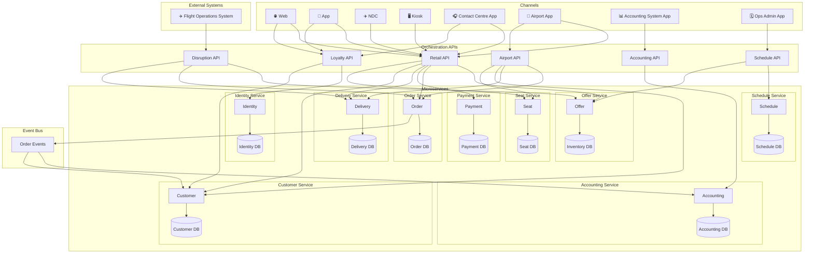

*Ref: system architecture - high-level microservices, orchestration APIs, and channel overview*

Key components:

- Channels
  - Web
  - App
  - NDC (XML APIs based on IATA NDC standard for GDS and other airlines (OTAs) to connect to)
  - Kiosk (self service airport check in terminals)
  - Contact Centre App (for new bookings, IROPS management, customer account management)
  - Airport App (for airport staff to manage non-OLCI check in, and gate management, seat assignment, etc)
  - Accounting System App
  - Ops Admin App (for operations staff to manage flight schedules and inventory creation)
- External Systems
  - Flight Operations System (FOS) — the airline's operational system responsible for managing the live flight schedule; it notifies the reservation system of disruption events (delays and cancellations) via the Disruption API
- Orchestration APIs (these act as the APIs to connect the channels to the microservices)
  - Retail API (for web, app, NDC, kiosk, contact centre app, airport app)
  - Loyalty API (for web, app, contact centre)
  - Airport API (for Airport App)
  - Accounting API (for accounting system app)
  - Disruption API (receives disruption events from the FOS and orchestrates the response across the Offer, Order, and Delivery microservices)
  - Schedule API (receives schedule definitions from the Ops Admin App; creates the schedule record and generates bulk flight inventory and fares in the Offer domain)
- Microservices (and their data-bound databases)
  - Offer
    - Inventory DB
  - Order (handles creating, modifying, and cancelling orders; owns all post-booking changes including PAX updates, seat changes, and cancellations)
    - Order DB
  - Payment
    - Payment DB
  - Delivery
    - Delivery DB
  - Customer
    - Customer DB
  - Accounting (order events are published by the Order microservice to this service via the event bus)
    - Accounting DB
  - Seat (manages seatmap definitions and seat pricing per aircraft type; provides seatmap views and seat offers to channels — seat selection and inventory remain with Offer)
    - Seat DB
  - Schedule (stores flight schedule definitions and generates `FlightInventory` and `Fare` records in the Offer domain for every operating date in the schedule window)
    - Schedule DB

# Capability

## Cabin Classes

All Apex Air aircraft are configured with up to four cabin classes. Cabin codes are single-character identifiers used uniformly across all services, databases, and API contracts.

| Code | Name | Notes |
|------|------|-------|
| `F` | First Class | Available on selected A350-1000 (A351) long-haul routes |
| `J` | Business Class | All long-haul aircraft; seat selection included in fare at no ancillary charge |
| `W` | Premium Economy | A350-1000 (A351) and Boeing 787-9 (B789) aircraft |
| `Y` | Economy | All aircraft |

Where a cabin code appears in a schema column, API field, or JSON document, it must always be one of these four values. The `CabinCode` field is consistently typed as `CHAR(1)` across all domains.

---

## Schedule

The Schedule capability allows airline operations staff to define repeating flight schedules across a date window; the system automatically generates the individual flight inventory and fare records in the Offer domain for every operating date.

- A schedule captures a single flight pattern: flight number, route, scheduled departure and arrival times, operating days of the week, aircraft type, per-cabin seat allocation, and one or more fares per cabin.
- A single `POST /v1/schedules` call creates the schedule record and triggers bulk `FlightInventory` and `Fare` generation in the Offer domain for every date in the `ValidFrom`–`ValidTo` window that matches the operating days bitmask.
- Generated inventory is immediately live for offer search with no additional activation step required.
- The schedule record persists in the Schedule domain as the operational source of truth; subsequent modifications or extensions to an existing schedule require a new schedule definition.
- Pricing (base fare, taxes, refundability, changeability) is supplied at schedule creation time and written directly to `offer.Fare` — one row per fare per operating date per cabin.

### Data Schema — Schedule

#### `schedule.FlightSchedule`

| Column | Type | Nullable | Default | Key | Notes |
|---|---|---|---|---|---|
| ScheduleId | UNIQUEIDENTIFIER | No | NEWID() | PK | |
| FlightNumber | VARCHAR(10) | No | | | e.g. `AX001` |
| Origin | CHAR(3) | No | | | IATA airport code |
| Destination | CHAR(3) | No | | | IATA airport code |
| DepartureTime | TIME | No | | | Local time at origin airport |
| ArrivalTime | TIME | No | | | Local time at destination airport |
| ArrivalDayOffset | TINYINT | No | 0 | | `0` = same calendar day; `1` = next day at destination |
| DaysOfWeek | TINYINT | No | | | Bitmask: Mon=1, Tue=2, Wed=4, Thu=8, Fri=16, Sat=32, Sun=64; daily = 127 |
| AircraftType | VARCHAR(4) | No | | | IATA 4-char code, e.g. `A351`, `B789`, `A339` |
| ValidFrom | DATE | No | | | First operating date (inclusive) |
| ValidTo | DATE | No | | | Last operating date (inclusive) |
| FlightsCreated | INT | No | 0 | | Count of `FlightInventory` rows generated at creation time |
| CreatedAt | DATETIME2 | No | SYSUTCDATETIME() | | |
| CreatedBy | VARCHAR(100) | No | | | Identity reference of the operations user who submitted the schedule |

> **Indexes:** `IX_FlightSchedule_FlightNumber` on `(FlightNumber, ValidFrom, ValidTo)`.
> **DaysOfWeek bitmask:** Operating days are encoded as a bitfield (ISO week order: Mon–Sun). A daily flight uses value `127` (all seven bits set); Mon/Wed/Fri uses `21` (bits 1+4+16). This encoding enables efficient date enumeration without a supporting day-of-week lookup table.

#### `schedule.ScheduleCabin`

| Column | Type | Nullable | Default | Key | Notes |
|---|---|---|---|---|---|
| ScheduleCabinId | UNIQUEIDENTIFIER | No | NEWID() | PK | |
| ScheduleId | UNIQUEIDENTIFIER | No | | FK → `schedule.FlightSchedule(ScheduleId)` | |
| CabinCode | CHAR(1) | No | | | `F` · `J` · `W` · `Y` |
| TotalSeats | SMALLINT | No | | | Seat count for this cabin from the aircraft configuration |

#### `schedule.ScheduleFare`

| Column | Type | Nullable | Default | Key | Notes |
|---|---|---|---|---|---|
| ScheduleFareId | UNIQUEIDENTIFIER | No | NEWID() | PK | |
| ScheduleCabinId | UNIQUEIDENTIFIER | No | | FK → `schedule.ScheduleCabin(ScheduleCabinId)` | |
| FareBasisCode | VARCHAR(20) | No | | | e.g. `YLOWUK`, `JFLEXGB` |
| FareFamily | VARCHAR(50) | Yes | | | e.g. `Economy Light`, `Business Flex` |
| BookingClass | CHAR(2) | No | | | Revenue management booking class, e.g. `Y`, `B`, `J` |
| CurrencyCode | CHAR(3) | No | `'GBP'` | | ISO 4217 |
| BaseFareAmount | DECIMAL(10,2) | No | | | Carrier base fare excluding taxes |
| TaxAmount | DECIMAL(10,2) | No | | | Total taxes and surcharges |
| IsRefundable | BIT | No | 0 | | Whether the fare permits a refund on voluntary cancellation |
| IsChangeable | BIT | No | 0 | | Whether the fare permits a voluntary flight change |

### Create Schedule

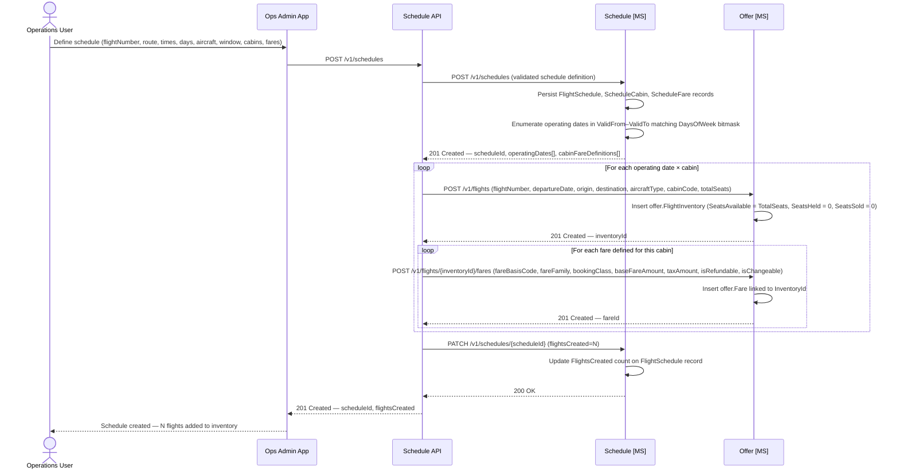

*Ref: schedule creation — Schedule API orchestrates: Schedule MS persists the schedule and returns operating dates, Schedule API calls Offer MS directly to create FlightInventory and Fare records, then updates the FlightsCreated count via Schedule MS*

---

## Offer

### Flight Network

Apex Air (IATA code: **AX**) operates a **hub-and-spoke** network centred on London Heathrow (**LHR**). The 2026 schedule covers five regions with the following direct routes from LHR:

| Region | Destinations | Flight Block | Aircraft |
|--------|-------------|--------------|----------|
| North America | New York JFK, Los Angeles LAX, Miami MIA, San Francisco SFO, Chicago ORD, Boston BOS | AX001–AX099 | A351, B789 |
| Caribbean | Bridgetown BGI, Kingston KIN, Nassau NAS | AX101–AX199 | A339 |
| East Asia | Hong Kong HKG, Tokyo NRT, Shanghai PVG, Beijing PEK | AX201–AX299 | A351, B789 |
| South-East Asia | Singapore SIN | AX301–AX399 | A351 |
| South Asia | Mumbai BOM, Delhi DEL, Bangalore BLR | AX401–AX499 | B789 |

Fleet summary:

- **A351** (Airbus A350-1000) — flagship widebody on highest-demand routes (LHR–JFK ×2 daily, LHR–LAX morning, LHR–SFO morning, LHR–HKG, LHR–NRT, LHR–SIN)
- **B789** (Boeing 787-9) — long-haul workhorse on remaining transatlantic, China, and India routes
- **A339** (Airbus A330-900) — medium-to-long-haul on Caribbean leisure routes

Because all scheduled routes radiate from LHR, the hub is also the natural connection point for passengers travelling between any two non-LHR cities (see [Direct and Connecting Itineraries](#direct-and-connecting-itineraries) below).

### Search

Search is built around the **slice** concept — one directional search per journey direction — with each result persisted immediately to guarantee price integrity.

- Customers search each direction (outbound, inbound) independently; each search returns priced offers per available cabin class.
- Offers are persisted to the `StoredOffer` table at the point of creation — pricing is locked at search time, not at payment.
- The customer selects one offer per slice; the resulting `OfferIds` are passed to the basket and Order API.
- The Order API retrieves the stored offer by `OfferId` rather than re-pricing — the fare shown is guaranteed to be the fare charged, regardless of elapsed time.

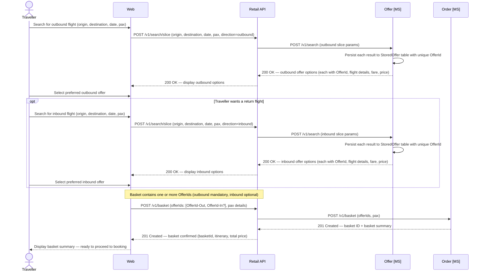

*Ref: offer search - outbound and inbound slice search and basket creation flow*

### Direct and Connecting Itineraries

#### Direct Flights

A **direct flight** is a single-segment journey served by a single Apex Air flight number. All 2026 scheduled routes operate direct from or to LHR, so any customer departing from or arriving at LHR travels on a single segment. Examples:

| Journey | Flight | Departure (local) | Arrival (local) | Aircraft |
|---------|--------|-------------------|-----------------|----------|
| LHR → JFK | AX001 | 08:00 | 11:10 | A351 |
| JFK → LHR | AX002 | 13:00 | 01:15+1 | A351 |
| LHR → DEL | AX411 | 20:30 | 09:00+1 | B789 |
| DEL → LHR | AX412 | 03:30 | 08:00 | B789 |
| LHR → SIN | AX301 | 21:30 | 17:45+1 | A351 |

For a direct flight, the Offer microservice creates one `StoredOffer` record per available cabin class, linked to a single `FlightInventory` row. The `OfferId` returned to the channel represents the complete single-segment journey.

#### Connecting Flights (Hub-and-Spoke)

A **connecting itinerary** combines two direct flights via LHR — the hub is the only valid connection point across the Apex Air network. For example, a passenger travelling from Delhi to New York:

```
DEL → LHR   AX412  departs DEL 03:30, arrives LHR 08:00
LHR → JFK   AX001  departs LHR 08:00, arrives JFK 11:10
```

Or in the return direction:

```
JFK → LHR   AX002  departs JFK 13:00, arrives LHR 01:15+1
LHR → DEL   AX411  departs LHR 20:30, arrives DEL 09:00+1 (+1)
```

- Each leg is modelled as an independent offer — two `StoredOffer` records, one per segment, each with its own `OfferId`; both are placed in the basket together.
- The Retail API's `POST /v1/search/connecting` calls the Offer MS twice (once per leg), applies a **60-minute minimum connect time** filter at LHR, and returns the composite itinerary with combined pricing.
- Holding seats requires two separate `POST /v1/inventory/hold` calls (one per leg); if either fails, both must be rolled back.
- The Offer microservice has no concept of multi-segment itineraries; connecting assembly (pairing, MCT validation, price combination) is entirely an orchestration responsibility of the Retail API.

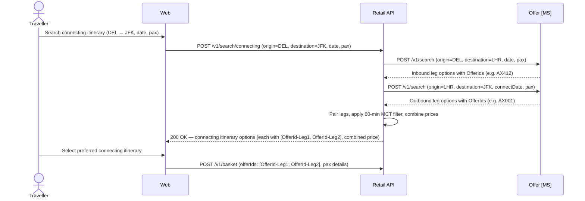

*Ref: offer search - connecting itinerary assembly via LHR hub with minimum connect time filtering*

#### Code Share Flights (Future Scope)

Code share arrangements — where a flight operated by one carrier is marketed and sold under another carrier's flight number — are **not in scope for the initial release**. However, the data model should be designed now to accommodate them, to avoid breaking changes later.

When code share is introduced, the following additions will be required:

- `offer.FlightInventory`: add `OperatingCarrier CHAR(2)` and `OperatingFlightNumber VARCHAR(10)` columns to distinguish the carrier actually operating the aircraft from the marketing carrier (Apex Air, `AX`). For own-metal flights both values will be `AX` / the Apex flight number.
- `offer.StoredOffer`: add `MarketingCarrier CHAR(2)` and `OperatingCarrier CHAR(2)` snapshot columns so the offer record is fully self-contained.
- **API response schema:** The Offer MS search response and the Retail API search response should include optional `operatingCarrier` and `operatingFlightNumber` fields from day one (omitted or `null` for own-metal flights). Front-end clients must be built to handle and display the operating carrier distinction from launch, even though the values will always match the marketing carrier initially.
- **Ticketing and delivery:** E-tickets issued by the Delivery microservice will need to carry the operating carrier designator; no schema change to `delivery.FlightManifest` is anticipated as the manifest records the flight number already, but the field semantics documentation should clarify that it carries the **marketing** flight number.
- **Inventory partitioning:** When Apex Air sells seats on a partner carrier's aircraft, the inventory source will be external. A future `InventorySource` field (e.g. `OwnMetal` / `Interline` / `CodeShare`) on `FlightInventory` will be needed to route inventory queries to the correct system.

No code share work is required now, but all new schema columns and API fields introduced in this release should be named to leave clean extension points for the above.

### Data Schema — Offer

The Offer domain maintains three tables: `FlightInventory` (seat capacity per flight and cabin), `Fare` (fare basis, pricing, and conditions), and `StoredOffer` (point-in-time pricing snapshot returned to the customer, ensuring price integrity through to order creation).

#### `offer.FlightInventory`

| Column | Type | Nullable | Default | Key | Notes |
|---|---|---|---|---|---|
| InventoryId | UNIQUEIDENTIFIER | No | NEWID() | PK | |
| FlightNumber | VARCHAR(10) | No | | | e.g. `AX001` |
| DepartureDate | DATE | No | | | |
| Origin | CHAR(3) | No | | | IATA airport code |
| Destination | CHAR(3) | No | | | IATA airport code |
| AircraftType | VARCHAR(4) | No | | | IATA-style 4-char code, e.g. `A351`, `B789` |
| CabinCode | CHAR(1) | No | | | `F` First · `J` Business · `W` Premium Economy · `Y` Economy |
| TotalSeats | SMALLINT | No | | | Physical seat count for this cabin on this flight |
| SeatsAvailable | SMALLINT | No | | | Decremented on hold; incremented on release |
| SeatsSold | SMALLINT | No | 0 | | Incremented on ticket issuance |
| SeatsHeld | SMALLINT | No | 0 | | Seats held in active baskets, not yet ticketed |
| UpdatedAt | DATETIME2 | No | SYSUTCDATETIME() | | |

> **Indexes:** `IX_FlightInventory_Flight` on `(FlightNumber, DepartureDate, CabinCode)`.
> **Inventory integrity:** `SeatsAvailable + SeatsSold + SeatsHeld = TotalSeats` must be maintained by the Offer microservice on every inventory mutation. There is no DB-level check constraint enforcing this; the application layer is solely responsible for keeping these counts consistent.

#### `offer.Fare`

| Column | Type | Nullable | Default | Key | Notes |
|---|---|---|---|---|---|
| FareId | UNIQUEIDENTIFIER | No | NEWID() | PK | |
| InventoryId | UNIQUEIDENTIFIER | No | | FK → `offer.FlightInventory(InventoryId)` | |
| FareBasisCode | VARCHAR(20) | No | | | Revenue management fare basis code, e.g. `YLOWUK`, `JFLEXGB` |
| FareFamily | VARCHAR(50) | Yes | | | Commercial product name, e.g. `Economy Light`, `Business Flex` |
| CabinCode | CHAR(1) | No | | | `F` · `J` · `W` · `Y` |
| BookingClass | CHAR(2) | No | | | Revenue management booking class, e.g. `Y`, `B`, `J` |
| CurrencyCode | CHAR(3) | No | `'GBP'` | | ISO 4217 |
| BaseFareAmount | DECIMAL(10,2) | No | | | Carrier base fare, excluding taxes |
| TaxAmount | DECIMAL(10,2) | No | | | Total taxes and surcharges |
| TotalAmount | DECIMAL(10,2) | No | | | `BaseFareAmount + TaxAmount`; stored explicitly for query efficiency |
| IsRefundable | BIT | No | 0 | | Whether the fare permits a refund on voluntary cancellation |
| IsChangeable | BIT | No | 0 | | Whether the fare permits a voluntary flight change |
| ValidFrom | DATETIME2 | No | | | Fare validity window start |
| ValidTo | DATETIME2 | No | | | Fare validity window end |

> **Note:** `ChangeFee` and `CancellationFee` amounts are not currently stored on this table. If fine-grained fee amounts are required at query time (rather than being looked up from external fare rules), additional columns should be added here.

#### `offer.StoredOffer`

| Column | Type | Nullable | Default | Key | Notes |
|---|---|---|---|---|---|
| OfferId | UNIQUEIDENTIFIER | No | NEWID() | PK | Returned to channel at search time; passed to basket and Order MS to lock pricing |
| InventoryId | UNIQUEIDENTIFIER | No | | FK → `offer.FlightInventory(InventoryId)` | |
| FareId | UNIQUEIDENTIFIER | No | | FK → `offer.Fare(FareId)` | |
| FlightNumber | VARCHAR(10) | No | | | Denormalised snapshot |
| DepartureDate | DATE | No | | | Denormalised snapshot |
| Origin | CHAR(3) | No | | | Denormalised snapshot, IATA code |
| Destination | CHAR(3) | No | | | Denormalised snapshot, IATA code |
| AircraftType | VARCHAR(4) | No | | | Denormalised snapshot |
| CabinCode | CHAR(1) | No | | | Denormalised snapshot |
| BookingClass | CHAR(2) | No | | | Denormalised snapshot |
| FareBasisCode | VARCHAR(20) | No | | | Denormalised snapshot |
| FareFamily | VARCHAR(50) | Yes | | | Denormalised snapshot |
| CurrencyCode | CHAR(3) | No | `'GBP'` | | ISO 4217 |
| BaseFareAmount | DECIMAL(10,2) | No | | | Price at time offer was created |
| TaxAmount | DECIMAL(10,2) | No | | | Taxes at time offer was created |
| TotalAmount | DECIMAL(10,2) | No | | | Total at time offer was created |
| IsRefundable | BIT | No | 0 | | Fare conditions at time of offer creation |
| IsChangeable | BIT | No | 0 | | Fare conditions at time of offer creation |
| CreatedAt | DATETIME2 | No | SYSUTCDATETIME() | | |
| ExpiresAt | DATETIME2 | No | | | Offer must be rejected by Order MS if `now > ExpiresAt` |
| IsConsumed | BIT | No | 0 | | Set to `1` once retrieved and locked by Order MS |

> **Indexes:** `IX_StoredOffer_Expiry` on `(ExpiresAt)` WHERE `IsConsumed = 0` — used by background cleanup job to purge expired unconsumed offers.
> **Design note:** Flight and fare fields are deliberately denormalised into this table so that the offer snapshot is fully self-contained. If `offer.Fare` is later updated or withdrawn, stored offers retain the exact price and conditions that were presented to the customer.

-----

## Order

The Order microservice manages the complete booking lifecycle — from basket creation through confirmation, post-sale changes, and cancellation — built on the **IATA One Order** standard.

- Bookings are represented as a single evolving `OrderData` JSON document, identified by a six-character **booking reference** (equivalent to the PNR in legacy systems).
- All state-changing operations publish an event to the event bus for downstream consumption (e.g. Accounting).
- The Order microservice is the sole owner of order state; all changes — PAX updates, seat changes, flight changes, ancillary additions, cancellations — are orchestrated through the Retail API.

### Create — Bookflow

The **bookflow** is the end-to-end initial purchase journey — from flight offer selection and basket creation through passenger details, ancillary selection, payment, and order confirmation — all within a single basket session bounded by the ticketing time limit.

- The `Basket` is a transient Order DB record accumulating flight offers, seat offers, bag offers, and passenger details as the booking is built.
- Hard-deleted on successful sale; expires automatically after 24 hours if abandoned.
- A configurable ticketing time limit (TTL, default 24 hours) is set at basket creation — if elapsed, held inventory is released and the basket is marked expired.
- For each `OfferId` in the basket, the Order MS retrieves the stored offer snapshot from the Offer MS, guaranteeing the price and fare conditions match exactly what the customer was shown at search time.

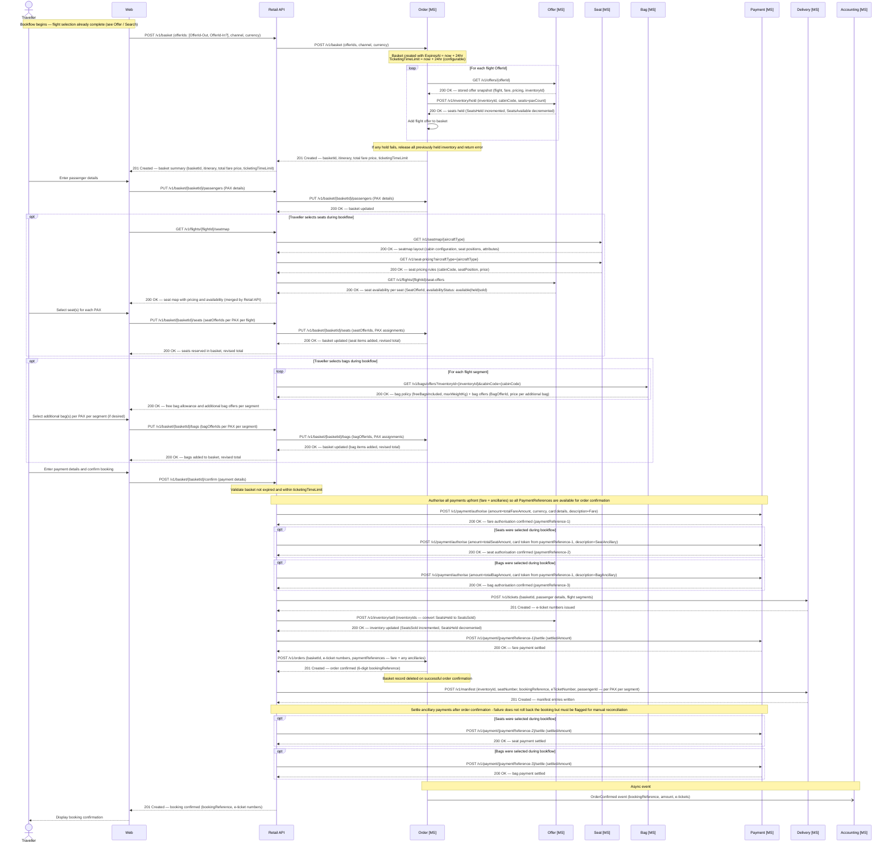

*Ref: order bookflow - end-to-end flight selection, ancillary addition, payment, ticketing, and order confirmation*

### Ticketing

Ticketing converts a confirmed basket into a legally valid air travel contract — the final step of the bookflow, triggered immediately after payment authorisation within the same synchronous flow.

- The e-ticket number is the IATA-standard identifier for the travel contract and is required before manifest entries or boarding passes can be issued.

#### What is an E-Ticket?

- An e-ticket (electronic ticket) is the passenger's legal entitlement to travel, replacing the legacy paper ticket
- Each e-ticket covers **one passenger on one flight segment** — a return booking for two passengers generates four e-ticket numbers
- E-ticket numbers follow the IATA format: a **3-digit airline code prefix** followed by a **10-digit serial number**, e.g. `932-1234567890` (Apex Air prefix: `932`)
- E-ticket numbers are issued and owned by the **Delivery microservice**, which is the system of record for all issued tickets
- Once issued, an e-ticket number is immutable — post-booking changes (PAX updates, seat changes) trigger **reissuance** of a new e-ticket number against the same order item, not amendment of the existing one

#### Ticketing Flow

Ticketing occurs as part of the order confirmation sequence, orchestrated by the Retail API after fare payment has been authorised:

- **Pre-ticketing checks** (performed by the Retail API before calling Delivery):
  - Basket is in `Active` status
  - `now < TicketingTimeLimit` — if elapsed, basket must be marked `Expired` and inventory released
  - All stored offers referenced in the basket are unconsumed and not expired
  - Fare payment has been successfully authorised (`paymentReference` held)

- **E-ticket issuance** (Retail API → Delivery MS):
  - Retail API calls `POST /v1/tickets` on the Delivery microservice, passing: basket ID, passenger details, and flight segments
  - Delivery MS generates one e-ticket number per passenger per flight segment
  - E-ticket numbers are returned synchronously to the Retail API

- **Inventory settlement** (Retail API → Offer MS):
  - Retail API calls `POST /v1/inventory/sell` on the Offer microservice to convert held seats to sold: `SeatsHeld` is decremented and `SeatsSold` is incremented for each flight/cabin combination; `SeatsAvailable` is unchanged (it was already decremented when the basket hold was placed)
  - This step must complete before order confirmation is written

- **Fare payment settlement** (Retail API → Payment MS):
  - Retail API calls `POST /v1/payment/{paymentReference}/settle` to move the authorised fare payment to `Settled`

- **Order confirmation** (Retail API → Order MS):
  - Retail API calls the Order microservice to convert the basket into a confirmed `order.Order` record
  - Payload includes: basket ID, all e-ticket numbers (per PAX per segment), and all payment references
  - Order MS writes the `order.Order` row with `OrderStatus = Confirmed` and a generated 6-character `BookingReference`
  - Order MS hard-deletes the basket row
  - Order MS publishes `OrderConfirmed` event to the event bus

- **Manifest population** (Retail API → Delivery MS):
  - Retail API validates each seat number against the active seatmap via the Seat MS before calling Delivery MS
  - Retail API calls the Delivery microservice to write one `FlightManifest` row per passenger per segment, passing seat numbers that have already been validated

- **Ancillary settlement** (if seats or bags were selected during the bookflow):
  - Ancillary payments are authorised during the bookflow basket-confirm step, **before** order confirmation is written, so that all payment authorisations are in place when the order is created
  - Settlement of each ancillary payment occurs **after** order confirmation: `POST /v1/payment/{paymentReference}/settle` is called once for seat ancillary and once for bag ancillary, each with their own `PaymentReference`
  - Failure of an ancillary settlement does not roll back the confirmed booking (the order is already confirmed and e-tickets issued), but must be flagged for manual reconciliation via the Payment audit trail

#### Reissuance

E-tickets must be reissued (new number generated, old number voided) in the following scenarios:

- **PAX name correction** — name changes invalidate the existing ticket as the passenger name is encoded in the BCBP barcode string
- **Seat change post-booking** — seat number is encoded on the boarding pass; if the e-ticket record references a specific seat, reissuance ensures consistency
- **Schedule change by the airline** — if the operating flight details change materially (departure time, routing), affected tickets are reissued

Reissuance is always performed by the Delivery microservice. The Order microservice is updated with the new e-ticket numbers via the Retail API orchestration layer, and new manifest entries replace the previous ones.

#### Failure Handling

Ticketing involves multiple sequential calls; partial failures must be handled explicitly:

| Failure point | Behaviour |
|---|---|
| Delivery MS fails to issue tickets | Abort — do not settle payment, do not confirm order; return error to channel |
| Offer MS fails to settle inventory (convert held to sold) | Retry up to 3 times; if still failing, void payment authorisation and return error |
| Payment settlement fails after inventory removed | Flag order for manual reconciliation; order is not confirmed until settlement succeeds |
| Order MS fails to confirm | Attempt compensation: void payment, reinstate inventory, void e-tickets; alert ops team if compensation also fails |

> All state-changing steps should be logged with sufficient detail to support manual reconciliation in the event of a partial failure that cannot be automatically compensated.

### Data Schema — Order

The Order domain owns three structures in the Order DB: the `Basket` tables (transient pre-sale state), the `Order` table (confirmed post-sale state), and the `BasketConfig` table (system configuration for expiry and ticketing time limits).

#### Basket

The basket is the transient in-progress state for a purchase journey, accumulating flight offers, seat offers, passenger details, and payment intent until payment completes.

- Contains no booking reference, PNR, or e-ticket numbers — these don't exist until the sale completes.
- Hard-deleted on successful order confirmation; if abandoned or the ticketing time limit elapses, marked `Expired` and held inventory released by a background cleanup job.
- `BasketData` holds the full basket state as a JSON document; scalar fields used for indexed lookups and lifecycle management are stored as typed columns.

#### `order.BasketConfig`

| Column | Type | Nullable | Default | Key | Notes |
|---|---|---|---|---|---|
| BasketConfigId | UNIQUEIDENTIFIER | No | NEWID() | PK | |
| BasketExpiryHours | SMALLINT | No | `24` | | Hours until an unpaid basket is expired |
| TicketingTimeLimitHours | SMALLINT | No | `24` | | Hours from basket creation within which ticketing must complete |
| IsActive | BIT | No | `1` | | |
| CreatedAt | DATETIME2 | No | SYSUTCDATETIME() | | |
| Notes | VARCHAR(255) | Yes | | | Optional change annotation, e.g. `'Reduced to 2hr for peak season test'` |

> **Indexes:** `IX_BasketConfig_Active` (unique) on `(IsActive)` WHERE `IsActive = 1`.
> **Single active row:** Only one row may have `IsActive = 1` at any time. To change configuration, insert a new row with `IsActive = 1` and set the previous row to `IsActive = 0`. Rows are never deleted, only superseded.

#### `order.Basket`

| Column | Type | Nullable | Default | Key | Notes |
|---|---|---|---|---|---|
| BasketId | UNIQUEIDENTIFIER | No | NEWID() | PK | |
| ChannelCode | VARCHAR(20) | No | | | `WEB` · `APP` · `NDC` · `KIOSK` · `CC` · `AIRPORT` |
| CurrencyCode | CHAR(3) | No | `'GBP'` | | ISO 4217 currency code |
| BasketStatus | VARCHAR(20) | No | `'Active'` | | `Active` · `Expired` · `Abandoned` · `Confirmed` |
| TotalFareAmount | DECIMAL(10,2) | Yes | | | Sum of flight offer prices; updated as basket is built |
| TotalSeatAmount | DECIMAL(10,2) | Yes | `0.00` | | Sum of seat offer prices; updated as seats are added during bookflow |
| TotalBagAmount | DECIMAL(10,2) | Yes | `0.00` | | Sum of bag offer prices; updated as bags are added during bookflow |
| TotalAmount | DECIMAL(10,2) | Yes | | | TotalFareAmount + TotalSeatAmount + TotalBagAmount |
| ExpiresAt | DATETIME2 | No | | | Basket hard expiry: creation time + `BasketExpiryHours` |
| TicketingTimeLimit | DATETIME2 | No | | | Must ticket by this time: creation time + `TicketingTimeLimitHours` |
| ConfirmedOrderId | UNIQUEIDENTIFIER | Yes | | FK → `order.Order(OrderId)` | Set on successful confirmation; null until then |
| CreatedAt | DATETIME2 | No | SYSUTCDATETIME() | | |
| UpdatedAt | DATETIME2 | No | SYSUTCDATETIME() | | |
| BasketData | NVARCHAR(MAX) | No | | | JSON document containing the full basket state (see example below) |

> **Indexes:** `IX_Basket_Status_Expiry` on `(BasketStatus, ExpiresAt)` WHERE `BasketStatus = 'Active'` — used by background expiry job. `IX_Basket_TicketingTimeLimit` on `(TicketingTimeLimit)` WHERE `BasketStatus = 'Active'` — used to flag baskets approaching TTL.
> **Constraints:** `CHK_BasketData` — `ISJSON(BasketData) = 1`; `BasketData` must be a valid JSON document.
> **Basket lifecycle:** A basket is hard-deleted immediately when an order is confirmed. Expired and abandoned baskets are retained for 7 days for diagnostics before being purged.

**Example `BasketData` JSON document**

The JSON captures the full in-progress state. It mirrors the eventual shape of `OrderData` for passengers and flight segments, but uses `offerSnapshots` rather than confirmed order items, and has no `eTickets`, booking reference, or payment settlement data.

```json
{
  "channel": "WEB",
  "currency": "GBP",
  "ticketingTimeLimit": "2025-06-02T10:30:00Z",
  "passengers": [
    {
      "passengerId": "PAX-1",
      "type": "ADT",
      "givenName": "Alex",
      "surname": "Taylor",
      "dateOfBirth": "1985-03-12",
      "gender": "Male",
      "loyaltyNumber": "AX9876543",
      "contacts": {
        "email": "alex.taylor@example.com",
        "phone": "+447700900100"
      },
      "travelDocument": {
        "type": "PASSPORT",
        "number": "PA1234567",
        "issuingCountry": "GBR",
        "expiryDate": "2030-01-01",
        "nationality": "GBR"
      }
    },
    {
      "passengerId": "PAX-2",
      "type": "ADT",
      "givenName": "Jordan",
      "surname": "Taylor",
      "dateOfBirth": "1987-07-22",
      "gender": "Female",
      "loyaltyNumber": null,
      "contacts": null,
      "travelDocument": null
    }
  ],
  "flightOffers": [
    {
      "basketItemId": "BI-1",
      "offerId": "3fa85f64-5717-4562-b3fc-2c963f66afa6",
      "flightNumber": "AX003",
      "origin": "LHR",
      "destination": "JFK",
      "departureDateTime": "2025-08-15T11:00:00Z",
      "arrivalDateTime": "2025-08-15T14:10:00Z",
      "aircraftType": "A351",
      "cabinCode": "J",
      "bookingClass": "J",
      "fareBasisCode": "JFLEXGB",
      "fareFamily": "Business Flex",
      "passengerRefs": ["PAX-1", "PAX-2"],
      "unitPrice": 350.00,
      "taxes": 87.25,
      "totalPrice": 437.25,
      "isRefundable": true,
      "isChangeable": true,
      "offerExpiresAt": "2025-06-01T11:00:00Z"
    },
    {
      "basketItemId": "BI-2",
      "offerId": "7cb87a21-1234-4abc-9def-1a2b3c4d5e6f",
      "flightNumber": "AX004",
      "origin": "JFK",
      "destination": "LHR",
      "departureDateTime": "2025-08-25T22:00:00Z",
      "arrivalDateTime": "2025-08-26T10:15:00Z",
      "aircraftType": "A351",
      "cabinCode": "J",
      "bookingClass": "J",
      "fareBasisCode": "JFLEXGB",
      "fareFamily": "Business Flex",
      "passengerRefs": ["PAX-1", "PAX-2"],
      "unitPrice": 350.00,
      "taxes": 87.25,
      "totalPrice": 437.25,
      "isRefundable": true,
      "isChangeable": true,
      "offerExpiresAt": "2025-06-01T11:00:00Z"
    }
  ],
  "seatOffers": [
    {
      "basketItemId": "BI-3",
      "seatOfferId": "so-a351-1A-v1",
      "basketItemRef": "BI-1",
      "passengerRef": "PAX-1",
      "seatNumber": "1A",
      "seatPosition": "Window",
      "cabinCode": "J",
      "price": 0.00,
      "currency": "GBP",
      "note": "Business Class — no charge"
    },
    {
      "basketItemId": "BI-4",
      "seatOfferId": "so-a351-11A-v1",
      "basketItemRef": "BI-1",
      "passengerRef": "PAX-2",
      "seatNumber": "11A",
      "seatPosition": "Window",
      "cabinCode": "W",
      "price": 70.00,
      "currency": "GBP"
    }
  ],
  "bagOffers": [
    {
      "basketItemId": "BI-5",
      "bagOfferId": "bo-economy-bag1-v1",
      "basketItemRef": "BI-1",
      "passengerRef": "PAX-1",
      "bagSequence": 1,
      "freeBagsIncluded": 1,
      "additionalBags": 1,
      "price": 60.00,
      "currency": "GBP",
      "note": "1st additional bag — LHR→JFK segment"
    }
  ],
  "paymentIntent": {
    "method": "CreditCard",
    "cardType": "Visa",
    "cardLast4": "4242",
    "totalFareAmount": 1749.00,
    "totalSeatAmount": 70.00,
    "totalBagAmount": 60.00,
    "grandTotal": 1879.00,
    "currency": "GBP",
    "status": "PendingAuthorisation"
  },
  "history": [
    { "event": "BasketCreated",          "at": "2025-06-01T10:30:00Z", "by": "WEB" },
    { "event": "PassengersAdded",        "at": "2025-06-01T10:31:00Z", "by": "WEB" },
    { "event": "SeatsAdded",             "at": "2025-06-01T10:32:00Z", "by": "WEB" },
    { "event": "BagsAdded",              "at": "2025-06-01T10:33:00Z", "by": "WEB" },
    { "event": "PaymentIntentRecorded",  "at": "2025-06-01T10:34:00Z", "by": "WEB" }
  ]
}
```

> **Ticketing time limit:** The `TicketingTimeLimit` is set at basket creation from the active `BasketConfig` row and is included in the basket summary returned to the channel so it can display a countdown to the traveller. The Retail API must validate that `now < TicketingTimeLimit` before attempting authorisation. If the limit has elapsed, the basket must be marked `Expired`, inventory released, and the traveller directed to start a new search.

> **Basket expiry job:** A background process runs on a schedule (e.g. every 5 minutes) and queries `order.Basket WHERE BasketStatus = 'Active' AND ExpiresAt <= now`. For each expired basket it sets `BasketStatus = 'Expired'` and fires a compensating call to the Offer microservice to release any held inventory. Expired baskets are retained for a short period (e.g. 7 days) for diagnostic purposes before being purged.

> **Basket deletion on sale:** When the Retail API receives a successful order confirmation response from the Order microservice, it immediately issues a hard delete of the basket row. The confirmed `OrderData` JSON is the authoritative post-sale record; the basket is no longer needed.

#### Order

The `Order` table is written once the basket is confirmed — payment taken, inventory settled, and e-tickets issued — following the IATA ONE Order model.

- Scalar fields (`BookingReference`, `OrderStatus`, `ChannelCode`, `TotalAmount`, etc.) stored as typed columns for querying, routing, and event publishing.
- Full order detail (passengers, segments, order items, seat assignments, e-tickets, payments, audit history) stored in the `OrderData` JSON document.
- Fields present as typed columns are intentionally excluded from `OrderData` to avoid duplication; the columns are the single source of truth for those values.

#### `order.Order`

| Column | Type | Nullable | Default | Key | Notes |
|---|---|---|---|---|---|
| OrderId | UNIQUEIDENTIFIER | No | NEWID() | PK | |
| BookingReference | CHAR(6) | Yes | | UK | Populated on confirmation, e.g. `AB1234`; null in `Draft` state |
| OrderStatus | VARCHAR(20) | No | `'Draft'` | | `Draft` · `Confirmed` · `Changed` · `Cancelled` |
| ChannelCode | VARCHAR(20) | No | | | `WEB` · `APP` · `NDC` · `KIOSK` · `CC` · `AIRPORT` |
| CurrencyCode | CHAR(3) | No | `'GBP'` | | ISO 4217 currency code |
| TotalAmount | DECIMAL(10,2) | Yes | | | Total order value including all order items; null until confirmed |
| CreatedAt | DATETIME2 | No | SYSUTCDATETIME() | | |
| UpdatedAt | DATETIME2 | No | SYSUTCDATETIME() | | |
| OrderData | NVARCHAR(MAX) | No | | | JSON document containing the full ONE Order detail (see example below) |

> **Indexes:** `IX_Order_BookingReference` (unique) on `(BookingReference)` WHERE `BookingReference IS NOT NULL`.
> **Constraints:** `CHK_OrderData` — `ISJSON(OrderData) = 1`; `OrderData` must be a valid JSON document.
> **Column duplication:** Fields present as typed columns (`OrderId`, `BookingReference`, `OrderStatus`, `ChannelCode`, `CurrencyCode`, `TotalAmount`, `CreatedAt`) are NOT duplicated inside `OrderData`. The table columns are the single source of truth for those values; `OrderData` carries the relational detail only.

**Example `OrderData` JSON document**

The JSON structure is aligned to IATA ONE Order concepts. Scalar identifiers and status fields that exist as typed columns on the `order.Order` table (`orderId`, `bookingReference`, `orderStatus`, `channel`, `currency`, `totalAmount`, `createdAt`) are excluded from the JSON document — the table columns are the single source of truth for those values. The JSON carries the relational detail: passengers, flight segments, order items, payments, and audit history.

```json
{
  "dataLists": {
    "passengers": [
      {
        "passengerId": "PAX-1",
        "type": "ADT",
        "givenName": "Alex",
        "surname": "Taylor",
        "dateOfBirth": "1985-03-12",
        "gender": "Male",
        "loyaltyNumber": "AX9876543",
        "contacts": {
          "email": "alex.taylor@example.com",
          "phone": "+447700900100"
        },
        "travelDocument": {
          "type": "PASSPORT",
          "number": "PA1234567",
          "issuingCountry": "GBR",
          "expiryDate": "2030-01-01",
          "nationality": "GBR"
        }
      },
      {
        "passengerId": "PAX-2",
        "type": "ADT",
        "givenName": "Jordan",
        "surname": "Taylor",
        "dateOfBirth": "1987-07-22",
        "gender": "Female",
        "loyaltyNumber": null,
        "contacts": null,
        "travelDocument": {
          "type": "PASSPORT",
          "number": "PA7654321",
          "issuingCountry": "GBR",
          "expiryDate": "2028-06-30",
          "nationality": "GBR"
        }
      }
    ],
    "flightSegments": [
      {
        "segmentId": "SEG-1",
        "flightNumber": "AX003",
        "origin": "LHR",
        "destination": "JFK",
        "departureDateTime": "2025-08-15T11:00:00Z",
        "arrivalDateTime": "2025-08-15T14:10:00Z",
        "aircraftType": "A351",
        "operatingCarrier": "AX",
        "marketingCarrier": "AX",
        "cabinCode": "J",
        "bookingClass": "J"
      },
      {
        "segmentId": "SEG-2",
        "flightNumber": "AX004",
        "origin": "JFK",
        "destination": "LHR",
        "departureDateTime": "2025-08-25T22:00:00Z",
        "arrivalDateTime": "2025-08-26T10:15:00Z",
        "aircraftType": "A351",
        "operatingCarrier": "AX",
        "marketingCarrier": "AX",
        "cabinCode": "J",
        "bookingClass": "J"
      }
    ]
  },
  "orderItems": [
    {
      "orderItemId": "OI-1",
      "type": "Flight",
      "segmentRef": "SEG-1",
      "passengerRefs": ["PAX-1", "PAX-2"],
      "offerId": "3fa85f64-5717-4562-b3fc-2c963f66afa6",
      "fareBasisCode": "JFLEXGB",
      "fareFamily": "Business Flex",
      "unitPrice": 350.00,
      "taxes": 87.25,
      "totalPrice": 437.25,
      "isRefundable": true,
      "isChangeable": true,
      "paymentReference": "AXPAY-0001",
      "eTickets": [
        { "passengerId": "PAX-1", "eTicketNumber": "932-1234567890" },
        { "passengerId": "PAX-2", "eTicketNumber": "932-1234567891" }
      ],
      "seatAssignments": [
        { "passengerId": "PAX-1", "seatNumber": "1A" },
        { "passengerId": "PAX-2", "seatNumber": "1D" }
      ]
    },
    {
      "orderItemId": "OI-2",
      "type": "Flight",
      "segmentRef": "SEG-2",
      "passengerRefs": ["PAX-1", "PAX-2"],
      "offerId": "7cb87a21-1234-4abc-9def-1a2b3c4d5e6f",
      "fareBasisCode": "JFLEXGB",
      "fareFamily": "Business Flex",
      "unitPrice": 350.00,
      "taxes": 87.25,
      "totalPrice": 437.25,
      "isRefundable": true,
      "isChangeable": true,
      "paymentReference": "AXPAY-0001",
      "eTickets": [
        { "passengerId": "PAX-1", "eTicketNumber": "932-1234567892" },
        { "passengerId": "PAX-2", "eTicketNumber": "932-1234567893" }
      ],
      "seatAssignments": [
        { "passengerId": "PAX-1", "seatNumber": "2A" },
        { "passengerId": "PAX-2", "seatNumber": "2D" }
      ]
    },
    {
      "orderItemId": "OI-3",
      "type": "Seat",
      "segmentRef": "SEG-1",
      "passengerRefs": ["PAX-1"],
      "offerId": "a1b2c3d4-seat-4562-b3fc-000000000001",
      "seatNumber": "1A",
      "seatPosition": "Window",
      "unitPrice": 70.00,
      "taxes": 0.00,
      "totalPrice": 70.00,
      "paymentReference": "AXPAY-0002"
    },
    {
      "orderItemId": "OI-4",
      "type": "Seat",
      "segmentRef": "SEG-1",
      "passengerRefs": ["PAX-2"],
      "offerId": "a1b2c3d4-seat-4562-b3fc-000000000002",
      "seatNumber": "1D",
      "seatPosition": "Middle",
      "unitPrice": 20.00,
      "taxes": 0.00,
      "totalPrice": 20.00,
      "paymentReference": "AXPAY-0002"
    },
    {
      "orderItemId": "OI-5",
      "type": "Bag",
      "segmentRef": "SEG-1",
      "passengerRefs": ["PAX-1"],
      "bagOfferId": "bo-economy-bag1-v1",
      "freeBagsIncluded": 1,
      "additionalBags": 1,
      "bagSequence": 1,
      "unitPrice": 60.00,
      "taxes": 0.00,
      "totalPrice": 60.00,
      "paymentReference": "AXPAY-0003"
    }
  ],
  "payments": [
    {
      "paymentReference": "AXPAY-0001",
      "description": "Fare — LHR-JFK-LHR, 2 PAX",
      "method": "CreditCard",
      "cardLast4": "4242",
      "cardType": "Visa",
      "authorisedAmount": 1749.00,
      "settledAmount": 1749.00,
      "currency": "GBP",
      "status": "Settled",
      "authorisedAt": "2025-06-01T10:31:00Z",
      "settledAt": "2025-06-01T10:32:00Z"
    },
    {
      "paymentReference": "AXPAY-0002",
      "description": "Seat ancillary — SEG-1, PAX-1 seat 1A, PAX-2 seat 1D",
      "method": "CreditCard",
      "cardLast4": "4242",
      "cardType": "Visa",
      "authorisedAmount": 90.00,
      "settledAmount": 90.00,
      "currency": "GBP",
      "status": "Settled",
      "authorisedAt": "2025-06-01T10:31:30Z",
      "settledAt": "2025-06-01T10:32:30Z"
    },
    {
      "paymentReference": "AXPAY-0003",
      "description": "Bag ancillary — SEG-1, PAX-1, 1 additional bag",
      "method": "CreditCard",
      "cardLast4": "4242",
      "cardType": "Visa",
      "authorisedAmount": 60.00,
      "settledAmount": 60.00,
      "currency": "GBP",
      "status": "Settled",
      "authorisedAt": "2025-06-01T10:45:00Z",
      "settledAt": "2025-06-01T10:45:10Z"
    }
  ],
  "history": [
    { "event": "OrderCreated",   "at": "2025-06-01T10:30:00Z", "by": "WEB" },
    { "event": "OrderConfirmed", "at": "2025-06-01T10:32:00Z", "by": "WEB" },
    { "event": "BagAncillaryAdded", "at": "2025-06-01T10:45:00Z", "by": "WEB" }
  ]
}
```

-----

### Manage Booking — Update Passenger Details

Passenger details may need updating post-booking for passports, name corrections, or contact information. Accurate **Advance Passenger Information (API)** is a regulatory requirement for international travel.

- PAX name or identity changes trigger e-ticket **reissuance** — a new e-ticket number is generated while the booking reference remains unchanged.
- Minor name corrections (a single transposed character) are typically applied as a waiver; anything beyond that is subject to the fare's change conditions.
- Passport number, nationality, date of birth, and document expiry must match the document presented at the border.

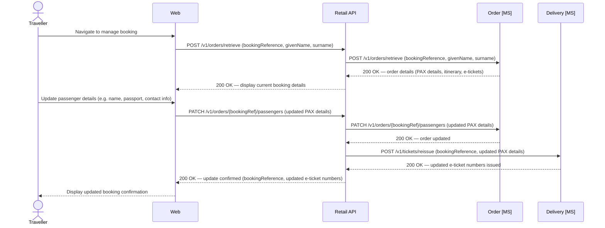

*Ref: manage booking - update passenger details with e-ticket reissuance*

### Manage Booking — Change Flight

A voluntary flight change is a customer-initiated itinerary modification governed entirely by the fare conditions of the originally purchased ticket.

- Changeability is fare-dependent: non-changeable, changeable with a fee, or fully flexible (no charge).
- A **reshop** is performed to obtain a live fare for the new itinerary; if the new base fare exceeds the original, an **add-collect** is due — fare difference plus any applicable change fee.
- Where the new fare is equal to or lower, the customer pays the change fee only; no residual value is returned.
- On confirmation, the original e-ticket is voided and a new e-ticket issued; seat ancillaries are not automatically transferred and must be reselected.

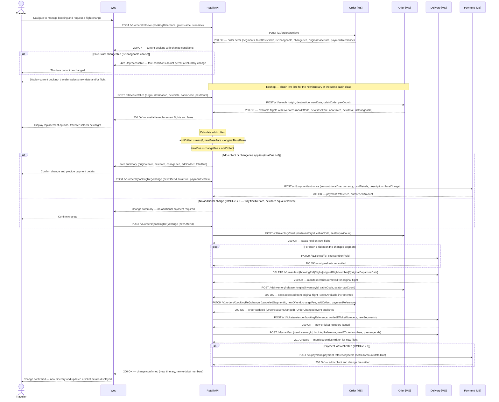

*Ref: manage booking - voluntary flight change with reshop, add-collect calculation, and e-ticket reissuance*

### Manage Booking — Cancel Booking

A voluntary cancellation is a customer-initiated request governed by the fare conditions of the originally issued ticket.

- Fares are non-refundable (full forfeiture), partially refundable (fixed cancellation fee deducted), or fully refundable (total amount returned).
- Regardless of refundability, the e-ticket must be voided and inventory released — a cancelled booking must not hold seat inventory.
- When a refund is due, the Order MS publishes a `RefundIdentified` event to the Accounting system; the Accounting system is responsible for issuing the refund and is outside the scope of the reservation system.
- Government-imposed taxes (e.g. UK Air Passenger Duty) may be refundable even on non-refundable fares; selective tax refund handling is out of scope for this phase.

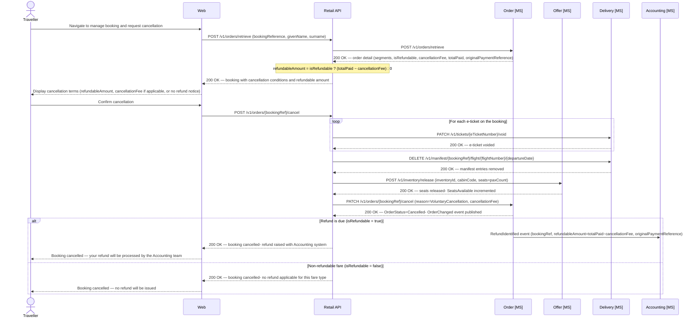

*Ref: manage booking - voluntary cancellation with inventory release and accounting refund event*

## Payment

The Payment microservice is the financial orchestration layer for all Apex Air transactions, interfacing with the external card payment processor on behalf of all channels.

- A single booking generates multiple independent payment transactions: fare, seat ancillary, and bag ancillary are each authorised and settled separately with their own `PaymentReference`.
- Granular transactions enable precise revenue attribution, targeted partial refunds, and PCI DSS compliance — card data is handled and discarded entirely within the Payment MS boundary.

### Authorise and Settle

Authorisation and settlement are separate steps; each transaction is tracked by a unique `PaymentReference` returned to the Retail API and stored against the relevant order items.

- Fare payment is authorised and settled during the booking confirmation flow; ancillary payments (seat, bag) are authorised upfront and settled after order confirmation.
- The Payment DB is the system of record for all financial transactions — every authorisation and settlement event is logged in `payment.PaymentEvent` as an immutable audit trail.

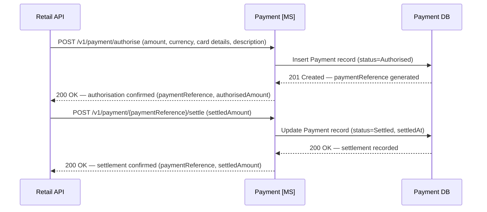

*Ref: payment - card authorisation and settlement sequence*

### Data Schema — Payment

The Payment domain uses two tables: `Payment` (one row per transaction, tracking lifecycle from authorisation to settlement) and `PaymentEvent` (immutable append-only audit log of every individual event — authorised, settled, refunded, declined). A single `Payment` may have multiple `PaymentEvent` rows.

#### `payment.Payment`

| Column | Type | Nullable | Default | Key | Notes |
|---|---|---|---|---|---|
| PaymentId | UNIQUEIDENTIFIER | No | NEWID() | PK | |
| PaymentReference | VARCHAR(20) | No | | UK | Human-readable reference, e.g. `AXPAY-0001`; generated at authorisation |
| BookingReference | CHAR(6) | Yes | | | Set once the order is confirmed; null during initial authorisation |
| PaymentType | VARCHAR(30) | No | | | `Fare` · `SeatAncillary` · `BagAncillary` · `FareChange` · `Cancellation` · `Refund` |
| Method | VARCHAR(20) | No | | | `CreditCard` · `DebitCard` · `PayPal` · `ApplePay` |
| CardType | VARCHAR(20) | Yes | | | `Visa` · `Mastercard` · `Amex` · etc.; null for non-card methods |
| CardLast4 | CHAR(4) | Yes | | | Last 4 digits only — full PAN must never be stored |
| CurrencyCode | CHAR(3) | No | `'GBP'` | | ISO 4217 currency code |
| AuthorisedAmount | DECIMAL(10,2) | No | | | Amount approved by the payment processor |
| SettledAmount | DECIMAL(10,2) | Yes | | | Null until settlement; may differ from `AuthorisedAmount` on partial settlement |
| Status | VARCHAR(20) | No | | | `Authorised` · `Settled` · `PartiallySettled` · `Refunded` · `Declined` · `Voided` |
| AuthorisedAt | DATETIME2 | No | SYSUTCDATETIME() | | |
| SettledAt | DATETIME2 | Yes | | | Null until settlement |
| Description | VARCHAR(255) | Yes | | | Human-readable description, e.g. `'Fare LHR-JFK-LHR, 2 PAX'` |
| CreatedAt | DATETIME2 | No | SYSUTCDATETIME() | | |
| UpdatedAt | DATETIME2 | No | SYSUTCDATETIME() | | |

> **Indexes:** `IX_Payment_BookingReference` on `(BookingReference)` WHERE `BookingReference IS NOT NULL`. `IX_Payment_PaymentReference` on `(PaymentReference)`.
> **PCI DSS:** Full card numbers, CVV codes, and raw processor tokens must never be stored. Only `CardLast4` and `CardType` are retained. The processor token used during the transaction lifetime is held in memory only and discarded after settlement.

#### `payment.PaymentEvent`

| Column | Type | Nullable | Default | Key | Notes |
|---|---|---|---|---|---|
| PaymentEventId | UNIQUEIDENTIFIER | No | NEWID() | PK | |
| PaymentId | UNIQUEIDENTIFIER | No | | FK → `payment.Payment(PaymentId)` | |
| EventType | VARCHAR(20) | No | | | `Authorised` · `Settled` · `PartialSettlement` · `Refunded` · `Declined` · `Voided` |
| Amount | DECIMAL(10,2) | No | | | Amount associated with this event |
| CurrencyCode | CHAR(3) | No | `'GBP'` | | ISO 4217 currency code |
| Notes | VARCHAR(255) | Yes | | | Optional context, e.g. `'Partial seat refund row 1A'` |
| CreatedAt | DATETIME2 | No | SYSUTCDATETIME() | | |

> **Indexes:** `IX_PaymentEvent_PaymentId` on `(PaymentId)`.
> **Immutability:** `PaymentEvent` rows are append-only and must never be updated or deleted. They form the authoritative audit trail for every financial event in the system.

> **PaymentReference format:** `PaymentReference` values follow the format `AXPAY-{sequence}` (e.g. `AXPAY-0001`). The sequence is generated by the Payment microservice at authorisation time and is guaranteed unique within the system. This reference is passed back to the Retail API and stored on each `orderItem` in `OrderData`, linking financial records to the order line items they cover.

> **PCI DSS:** Full card numbers, CVV codes, and raw processor tokens must never be stored in the Payment DB. Only `CardLast4` and `CardType` are retained. The payment processor token used during the transaction lifetime is held in memory only and discarded after settlement.

## Delivery

The Delivery microservice is the airline's system of record for issued travel documents, materialising confirmed orders into e-tickets, boarding passes, and the flight manifest.

- Owns the operational record used by gate and ground staff — check-in status, seat assignments, and APIS data.
- Where the Order MS owns the commercial booking record, the Delivery MS owns the departure-facing operational record.

### Online Check In

Online check-in (OLCI) opens 24 hours before departure, allowing passengers to submit **Advance Passenger Information (API)** data and generate boarding passes.

- Completing OLCI moves each passenger to `checkedIn` status on the flight manifest, enabling boarding pass generation.
- The 24-hour window aligns with APIS submission cut-off times and prevents stale travel document data.
- Seat assignment (free of charge at OLCI) and bag additions are both available within the OLCI flow.

```mermaid
sequenceDiagram
    actor Traveller
    participant Web
    participant RetailAPI as Retail API
    participant OrderMS as Order [MS]
    participant SeatMS as Seat [MS]
    participant BagMS as Bag [MS]
    participant OfferMS as Offer [MS]
    participant PaymentMS as Payment [MS]
    participant DeliveryMS as Delivery [MS]

    Traveller->>Web: Navigate to online check-in

    Web->>RetailAPI: POST /v1/checkin/retrieve (bookingReference, givenName, surname)
    RetailAPI->>OrderMS: POST /v1/orders/retrieve (bookingReference, givenName, surname)
    OrderMS-->>RetailAPI: 200 OK — order details (PAX list, flights, cabinCode, seat assignments, bag order items, e-tickets)
    RetailAPI-->>Web: 200 OK — PAX list, pre-flight details, existing ancillary summary

    opt Traveller has no seat assigned or wishes to change seat at check-in
        Note over Web, SeatMS: Seat selection at check-in is free of charge — no payment taken
        Web->>RetailAPI: GET /v1/flights/{flightId}/seatmap
        RetailAPI->>SeatMS: GET /v1/seatmap/{aircraftType}
        SeatMS-->>RetailAPI: 200 OK — seatmap layout (cabin configuration, seat positions, attributes)
        RetailAPI->>SeatMS: GET /v1/seat-pricing?aircraftType={aircraftType}
        SeatMS-->>RetailAPI: 200 OK — seat pricing rules (cabinCode, seatPosition, price — shown for info only)
        RetailAPI->>OfferMS: GET /v1/flights/{flightId}/seat-offers
        OfferMS-->>RetailAPI: 200 OK — seat availability per seat (SeatOfferId, availabilityStatus: available|held|sold)
        RetailAPI-->>Web: 200 OK — seat map (pricing displayed for reference but not charged at OLCI; merged by Retail API)
        Traveller->>Web: Select seat(s) for each PAX
        Web->>RetailAPI: PATCH /v1/checkin/{bookingRef}/seats (seatOfferIds per PAX)
        RetailAPI->>OfferMS: POST /v1/flights/{flightId}/seat-reservations (flightId, seatNumbers)
        OfferMS-->>RetailAPI: 200 OK — seats reserved
        RetailAPI->>OrderMS: PATCH /v1/orders/{bookingRef}/seats (PAX seat assignments)
        OrderMS-->>RetailAPI: 200 OK — order updated
    end

    opt Traveller wishes to add or purchase additional bags at check-in
        Note over Web, BagMS: Free allowance confirmed automatically- payment required for additional bags only
        RetailAPI->>BagMS: GET /v1/bags/offers?inventoryId={inventoryId}&cabinCode={cabinCode}
        BagMS-->>RetailAPI: 200 OK — bag policy (freeBagsIncluded, maxWeightKg) + bag offers for additional bags
        RetailAPI-->>Web: Free allowance and additional bag options
        Traveller->>Web: Select additional bag(s) if required and provide payment details
        Web->>RetailAPI: POST /v1/orders/{bookingRef}/bags (bagOfferIds per PAX per segment, paymentDetails)
        RetailAPI->>PaymentMS: POST /v1/payment/authorise (amount, cardDetails, description=BagAncillary)
        PaymentMS-->>RetailAPI: 200 OK — paymentReference
        RetailAPI->>PaymentMS: POST /v1/payment/{paymentReference}/settle (settledAmount)
        PaymentMS-->>RetailAPI: 200 OK — bag payment settled
        RetailAPI->>OrderMS: PATCH /v1/orders/{bookingRef}/bags (bagOfferIds, passengerRefs, segmentRefs, paymentReference)
        OrderMS-->>RetailAPI: 200 OK — order updated with Bag order items
    end

    Traveller->>Web: Confirm / update travel document details for each PAX

    Web->>RetailAPI: POST /v1/checkin/{bookingRef} (PAX IDs, travel document details)

    RetailAPI->>OrderMS: POST /v1/orders/{bookingRef}/checkin (travel document details)
    OrderMS-->>RetailAPI: 200 OK — PAX checked in, APIS data recorded

    RetailAPI->>OfferMS: PATCH /v1/flights/{flightId}/seat-availability (flightId, seatNumbers, status=checked-in)
    OfferMS-->>RetailAPI: 200 OK — inventory updated

    RetailAPI->>DeliveryMS: PATCH /v1/manifest/{bookingRef} (PAX IDs, checkedIn=true, checkedInAt=now)
    DeliveryMS-->>RetailAPI: 200 OK — manifest entries updated

    RetailAPI->>DeliveryMS: POST /v1/boarding-cards (bookingReference, PAX list, seats, flights)
    DeliveryMS-->>RetailAPI: 201 Created — boarding cards (one per PAX per flight) including BCBP barcode string

    RetailAPI-->>Web: 200 OK — check-in confirmed (boarding cards)
    Web-->>Traveller: Display and offer download of boarding cards
```

*Ref: delivery - online check-in flow including seat selection, bag addition, and boarding card generation*

### Boarding Pass Barcode String

Each boarding card issued by the Delivery microservice includes a barcode string compliant with **IATA Resolution 792** (Bar Coded Boarding Pass — BCBP). This string is used directly to generate the physical barcode on printed boarding passes and the QR code displayed in the mobile app. Both formats encode identical data; the presentation layer determines the rendering.

The format is a structured plaintext string with fixed-width and positional fields. An example for a single-leg boarding pass:

```
M1TAYLOR/ALEX        EAB1234 LHRJFKAX 0003 042J001A0001 156>518 W6042 AX 2A00000012345678 JAX7KLP2NZR901A
```

The fields break down as follows:

| Segment | Value in example | Description |
|---|---|---|
| `M1` | `M1` | Format code (`M`) + number of legs encoded (`1`) |
| `TAYLOR/ALEX` | `TAYLOR/ALEX` | Passenger name — surname / given name, padded to 20 chars |
| `EAB1234` | `EAB1234` | Electronic ticket indicator (`E`) + PNR / booking reference |
| `LHR` | `LHR` | Origin IATA airport code |
| `JFK` | `JFK` | Destination IATA airport code |
| `AX` | `AX` | Operating carrier IATA code (Apex Air) |
| `0003` | `0003` | Flight number, padded to 4 chars |
| `042` | `042` | Julian date of flight departure |
| `J` | `J` | Cabin / booking class code |
| `001A` | `001A` | Seat number, padded to 4 chars |
| `0001` | `0001` | Sequence / check-in number |
| `1` | `1` | Passenger status code (`1` = checked in) |
| `56>518` | `56>518` | Conditional item size indicator and version number (BCBP version 6) |
| `W6042` | `W6042` | Julian date of issue + ticket issuer code |
| `AX` | `AX` | Operating carrier for this leg (repeated in conditional section) |
| `2A00000012345678` | `2A00000012345678` | Frequent flyer / loyalty number |
| `JAX7KLP2NZR901A` | `JAX7KLP2NZR901A` | Airline-specific free-text data (selectee indicator, document verification, etc.) |

The Delivery microservice is responsible for assembling this string at the point of boarding card generation, drawing on data from the `FlightManifest` row and the confirmed order. The barcode string is returned in the boarding card payload alongside human-readable fields; channels render it using their preferred barcode library (e.g. PDF417 for print, QR for mobile).

### Data Schema — Delivery

The Delivery domain's `FlightManifest` table holds one row per passenger per flight segment — populated at booking confirmation and updated on post-purchase seat changes.

- Provides a queryable view of passenger load per flight — used for gate management, check-in verification, IROPS, and APIS submissions.
- Seat number integrity enforced at the orchestration layer: the calling orchestration API (Retail API, Airport API, or Disruption API) validates `SeatNumber` against the active seatmap via the Seat MS before calling the Delivery MS. The Delivery MS trusts the seat number provided by its caller.

#### `delivery.FlightManifest`

| Column | Type | Nullable | Default | Key | Notes |
|---|---|---|---|---|---|
| ManifestId | UNIQUEIDENTIFIER | No | NEWID() | PK | |
| InventoryId | UNIQUEIDENTIFIER | No | | | Cross-schema ref to `offer.FlightInventory(InventoryId)`; not enforced as DB FK |
| FlightNumber | VARCHAR(10) | No | | | Denormalised for query convenience, e.g. `AX003` |
| DepartureDate | DATE | No | | | Denormalised for query convenience |
| AircraftType | CHAR(4) | No | | | Used for seatmap validation at write time |
| SeatNumber | VARCHAR(5) | No | | | e.g. `1A`, `22K` — must exist on active seatmap for `AircraftType` |
| CabinCode | CHAR(1) | No | | | `F` · `J` · `W` · `Y` |
| BookingReference | CHAR(6) | No | | | e.g. `AB1234` |
| ETicketNumber | VARCHAR(20) | No | | | e.g. `932-1234567890` |
| PassengerId | VARCHAR(20) | No | | | PAX reference from the order, e.g. `PAX-1` |
| GivenName | VARCHAR(100) | No | | | Denormalised for manifest readability |
| Surname | VARCHAR(100) | No | | | Denormalised for manifest readability |
| CheckedIn | BIT | No | `0` | | |
| CheckedInAt | DATETIME2 | Yes | | | Null until check-in is completed |
| CreatedAt | DATETIME2 | No | SYSUTCDATETIME() | | |
| UpdatedAt | DATETIME2 | No | SYSUTCDATETIME() | | |

> **Indexes:** `IX_FlightManifest_Seat` (unique) on `(InventoryId, SeatNumber)` — prevents double-assignment of a seat on a flight. `IX_FlightManifest_Pax` (unique) on `(InventoryId, ETicketNumber)` — prevents duplicate manifest entries for the same passenger. `IX_FlightManifest_Flight` on `(FlightNumber, DepartureDate)` — used for gate staff and IROPS manifest retrieval. `IX_FlightManifest_BookingReference` on `(BookingReference)` — used for customer servicing and check-in lookups.
> **Cross-schema integrity:** `InventoryId` references `offer.FlightInventory` but is not declared as a foreign key, as the Delivery and Offer domains are logically separated (and would be physically separated in a fully isolated deployment). Referential integrity between these schemas is the responsibility of the Retail API orchestration layer, which controls the write sequence.
> **Seatmap validation:** The orchestration layer is responsible for validating the `SeatNumber` against the active seatmap (via Seat MS) before calling the Delivery microservice. The Delivery MS trusts the seat number provided by its caller. This validation responsibility applies to both initial writes (at booking confirmation) and updates (at seat changes) — the orchestration API (Retail API, Airport API, or Disruption API) must call `GET /v1/seatmap/{aircraftType}` on the Seat MS and confirm the seat number exists in the returned cabin layout before calling Delivery MS. If the seat is not present on the active seatmap, the orchestration layer must reject the request before it reaches the Delivery MS.

## Disruption API

### Overview

The Disruption API orchestrates the reservation system's response to disruption events (delays and cancellations) notified by the airline's **Flight Operations System (FOS)**.

- Coordinates updates across the **Offer** (inventory), **Order**, and **Delivery** microservices to keep all affected bookings accurate and, where necessary, rebook passengers.
- Write-only inbound interface from the FOS perspective — the FOS fires the event and the reservation system handles everything downstream with no synchronous per-passenger response expected.
- Operational outcomes are surfaced to staff via the Contact Centre App and Airport App through the existing Retail and Airport APIs.

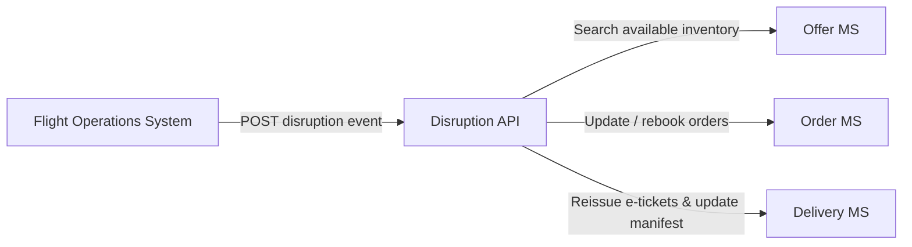

*Ref: disruption API - FOS integration and downstream microservice orchestration overview*

---

### Flight Delay

A flight delay changes scheduled times without invalidating bookings or e-tickets — the passenger's reservation remains valid and no rebooking is required.

- The system propagates revised departure and arrival times to every affected order and manifest record.
- Passengers are notified proactively of the schedule change.
- Under **EU Regulation 261/2004**, significant delays may entitle passengers to compensation; eligibility assessment and fulfilment are handled outside this system.

> **Future consideration — missed connections due to delay:** If a delayed flight causes a passenger to miss a connecting flight in their itinerary, the system will need to detect this and trigger a rebooking flow for the affected connection. This is not in scope for the current phase but must be addressed in a future design iteration before connecting-itinerary bookings are supported operationally.

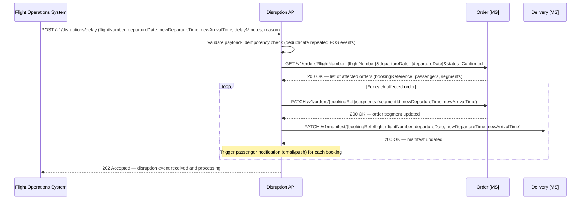

*Ref: disruption - flight delay schedule propagation across affected orders and manifests*

**Delay handling rules:**

- The departure and arrival times on every confirmed `order.Order` segment record for the affected flight are updated to reflect the new scheduled times.
- The `delivery.FlightManifest` records are updated to reflect the new departure time for gate management and check-in purposes.
- E-ticket reissuance is required if the delay constitutes a "material schedule change" under IATA ticketing rules (typically a change of more than 60 minutes). The threshold is configurable. Where reissuance is required, the Disruption API calls the Delivery microservice to reissue and the Order microservice is updated with new e-ticket numbers.
- An `OrderChanged` event is published by the Order microservice to the event bus so downstream services (Accounting, Customer) are aware of the change.
- Passengers whose check-in window has already opened (within 24 hours of the original departure) are notified immediately.

---

### Flight Cancellation and Passenger Rebooking

When the FOS notifies the Disruption API that a flight has been cancelled, the API takes the flight off sale and rebooks every affected passenger onto the next available alternative. The rebooking logic works as follows:

1. The next available **direct** flight on the same origin–destination route with sufficient cabin availability is identified first.
2. If no direct flight can accommodate the passengers within an acceptable timeframe, a **connecting itinerary** via an intermediate point is considered.
3. Each passenger is rebooked into the same cabin class where possible. If the same cabin is unavailable, the passenger is upgraded to the next available cabin (no downgrade without consent).
4. All e-tickets for the cancelled flight are voided and new e-tickets are issued for the replacement flight(s).
5. The `delivery.FlightManifest` records for the cancelled flight are removed and new manifest entries are created for the replacement flight.
6. Passengers are notified of their new itinerary.

> **Future consideration — missed connections resulting from cancellation rebooking:** When a passenger is rebooked onto a connecting itinerary (because no viable direct flight is available), there is a risk that a disruption to either leg of that connecting journey could result in a missed connection. Additionally, where minimum connection times at the transit airport are tight, the system must validate that the layover is operationally feasible. Detection and handling of these scenarios requires additional logic — similar in nature to the delay/missed-connection case noted above — and must be addressed in a future design phase before widespread use of connecting rebooking in an IROPS context.

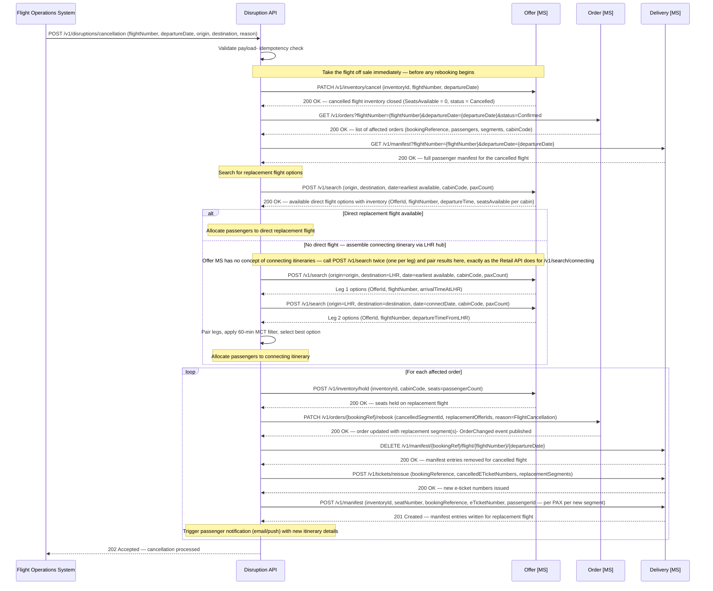

*Ref: disruption - flight cancellation handling with passenger rebooking onto direct or connecting replacement flights*

**Cancellation handling rules:**

- **The cancelled flight is taken off sale immediately** — as the very first action after validating the event, before retrieving affected orders or searching for alternatives. This prevents new bookings from being accepted on the flight while rebooking is in progress. The `offer.FlightInventory` record is updated to `SeatsAvailable = 0` with a status of `Cancelled`.
- The Disruption API processes passengers in priority order: higher cabin class first, then loyalty tier (Platinum → Gold → Silver → Blue), then booking date (earliest first). This ensures the best available seats go to the highest-value passengers.
- Seat assignments on the replacement flight are not pre-assigned by the Disruption API; passengers are assigned to an available seat of the same position type (Window/Aisle/Middle) where possible. Passengers may change their seat via the normal manage-booking flow after rebooking.
- If no replacement flight is found within a configurable lookahead window (default: 72 hours), the booking is flagged for manual handling by the Contact Centre rather than left in an unresolved state.
- Where the original fare conditions do not permit free rebooking (e.g. non-changeable fares), the airline's IROPS policy overrides these conditions — all passengers on a cancelled flight are entitled to free rebooking regardless of fare type. This waiver is applied by the Order microservice when the `reason=FlightCancellation` flag is present.
- A single `OrderChanged` event (with `changeType=IROPSRebook`) is published by the Order microservice per affected booking, consumed by the Accounting microservice for revenue accounting adjustments.

---

### Disruption API — Idempotency and Reliability

The Disruption API must be idempotent — the FOS may send the same event more than once due to retries or network failures.

- Each event must include a unique `disruptionEventId`; events with an ID already in the processed log are acknowledged (`202 Accepted`) without re-processing.
- Long-running cancellation rebooking operations (large passenger loads) are processed asynchronously; `202 Accepted` is returned to the FOS immediately.
- Operational progress is visible to Contact Centre agents via the existing order management tools in the Retail API — the FOS does not poll for completion.

---

## Ancillary

Apex Air offers two ancillary product types — **seat selection** and **checked baggage** — each priced by a dedicated microservice and recorded as separate order items with their own offer ID and payment reference.

- Free entitlements (included bag allowance, complimentary Business Class seat selection) are policy attributes, not order items — they carry no price and generate no payment.
- Ancillary revenue is tracked independently from fare revenue in the Accounting microservice.

Ancillary products may be purchased at three points in the customer journey:

1. **During the bookflow** — seat and bag selection are offered as optional steps within the basket before payment. Both are settled as separate payment transactions alongside the fare at confirmation. Ancillaries selected during the bookflow are written as order items at the point of order creation.
2. **Post-sale (manage booking)** — after a booking is confirmed, customers may add or change seats and add additional bags through the manage-booking flow. Both follow the same underlying offer-retrieve, payment-authorise, order-update pattern as the bookflow ancillary steps.
3. **At online check-in** — seat assignment (free of charge at OLCI) is available during the check-in flow. See the Delivery section for the OLCI flow.

---

### Seat

The Seat microservice is the system of record for aircraft seatmap definitions and fleet-wide seat pricing rules — its sole responsibility is serving the **physical cabin layout**.

- Provides cabin configuration, seat positions, seat attributes (class, position, extra legroom), and position-based pricing rules.
- Does **not** generate seat offers, assign `SeatOfferId` values, or manage availability/inventory — availability belongs to the Offer MS; `SeatOfferId` generation and the merged seat offer response belong to the Retail API orchestration layer.
- When a channel requests a seatmap, the Retail API retrieves the seatmap layout and pricing rules from the Seat MS, retrieves per-seat availability status from the Offer MS, and merges all three datasets before returning the seat offer response to the channel.

Seat prices are fleet-wide and position-based (not per flight):

| Position | Price |
|---|---|
| Window | £70.00 |
| Aisle | £50.00 |
| Middle | £20.00 |

Business Class seat selection is included in the fare with no ancillary charge. The `SeatOfferId` is generated by the Offer MS based on `InventoryId` + `SeatNumber` (data it owns independently, without needing to call the Seat MS). It is returned to the channel as part of the merged seat offer response assembled by the Retail API, and is passed to the Order microservice when a seat is purchased, linking the seat order item to the priced offer.

#### Retrieve Seatmap Layout

The Seat microservice returns the physical cabin layout and seat pricing rules. Seat availability (with `SeatOfferId` and availability status per seat) is a separate concern served by the Offer microservice via `GET /v1/flights/{flightId}/seat-offers` — the Offer MS returns availability status only and does not call the Seat MS for pricing. The Retail API retrieves layout and pricing from the Seat MS, availability from the Offer MS, and merges all three datasets before returning the seat offer response to the channel.

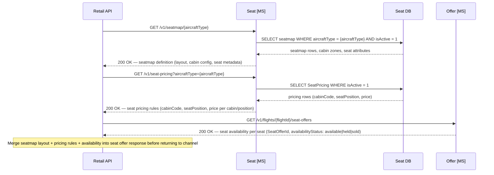

*Ref: ancillary seat - Retail API retrieves seatmap layout and pricing from Seat MS, seat availability from Offer MS, then merges all three datasets into the seat offer response*

#### Post-Sale Seat Selection

Post-sale seat selection presents the live seatmap with real-time availability and updates the manifest and e-tickets on confirmation.

- Full ancillary charge applies for post-sale seat selection.
- Seats assigned during OLCI (check-in) are free of charge — see the Online Check-In flow in the Delivery section.

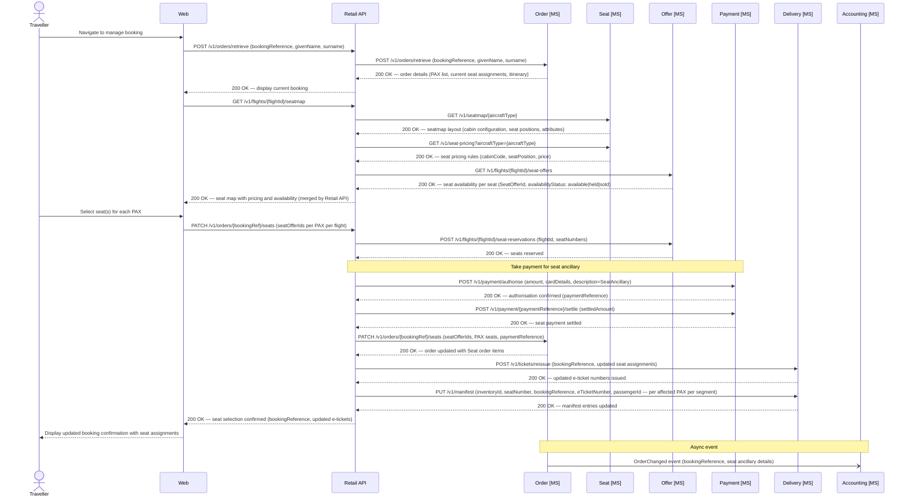

*Ref: ancillary seat - post-sale seat selection with payment, e-ticket reissuance, and manifest update*

#### Data Schema — Seat

The Seat domain uses three tables: `AircraftType` (root reference record), `Seatmap` (one active row per aircraft configuration with full cabin layout as JSON), and `SeatPricing` (fleet-wide pricing rules by seat position and cabin, read by the Offer MS when generating seat offers — not exposed in the Seat MS seatmap response).

#### `seat.AircraftType`

| Column | Type | Nullable | Default | Key | Notes |
|---|---|---|---|---|---|
| AircraftTypeCode | CHAR(4) | No | | PK | 4-char code: manufacturer prefix + 3-digit variant, e.g. `A351` (A350-1000), `B789` (B787-900) |
| Manufacturer | VARCHAR(50) | No | | | e.g. `Airbus`, `Boeing` |
| FriendlyName | VARCHAR(100) | Yes | | | e.g. `Airbus A350-1000`, `Boeing 787-900` |
| TotalSeats | SMALLINT | No | | | Total seat count across all cabins |
| IsActive | BIT | No | `1` | | |

#### `seat.Seatmap`

| Column | Type | Nullable | Default | Key | Notes |
|---|---|---|---|---|---|
| SeatmapId | UNIQUEIDENTIFIER | No | NEWID() | PK | |
| AircraftTypeCode | CHAR(4) | No | | FK → `seat.AircraftType(AircraftTypeCode)` | |
| Version | INT | No | `1` | | Incremented when the layout is updated |
| IsActive | BIT | No | `1` | | Only one active seatmap per aircraft type at any time |
| UpdatedAt | DATETIME2 | No | SYSUTCDATETIME() | | |
| CabinLayout | NVARCHAR(MAX) | No | | | JSON document containing full cabin and seat definitions (see example below) |

> **Indexes:** `IX_Seatmap_AircraftType` on `(AircraftTypeCode)` WHERE `IsActive = 1`.
> **Constraints:** `CHK_CabinLayout` — `ISJSON(CabinLayout) = 1`; `CabinLayout` must be a valid JSON document.

#### `seat.SeatPricing`

| Column | Type | Nullable | Default | Key | Notes |
|---|---|---|---|---|---|
| SeatPricingId | UNIQUEIDENTIFIER | No | NEWID() | PK | |
| CabinCode | CHAR(1) | No | | UK (with SeatPosition, CurrencyCode) | `W` (Premium Economy) · `Y` (Economy); Business Class (J/F) seats carry no ancillary charge |
| SeatPosition | VARCHAR(10) | No | | UK (with CabinCode, CurrencyCode) | `Window` · `Aisle` · `Middle` |
| CurrencyCode | CHAR(3) | No | `'GBP'` | UK (with CabinCode, SeatPosition) | ISO 4217 currency code |
| Price | DECIMAL(10,2) | No | | | |
| IsActive | BIT | No | `1` | | |
| ValidFrom | DATETIME2 | No | | | Effective start of this pricing rule |
| ValidTo | DATETIME2 | Yes | | | Null = open-ended / currently active |
| UpdatedAt | DATETIME2 | No | SYSUTCDATETIME() | | |

> **Constraints:** `UQ_SeatPricing_CabinPosition` (unique) on `(CabinCode, SeatPosition, CurrencyCode)` — enforces one active price per cabin/position/currency combination.
> **Pricing scope:** Pricing is fleet-wide and applied uniformly across all aircraft and routes. Business Class and First Class seats (cabin codes `J` and `F`) are excluded from `SeatPricing` — selection is included in the fare with no ancillary charge.
> **Example seed data:** `('W', 'Window', 'GBP', 70.00)` · `('W', 'Aisle', 'GBP', 50.00)` · `('W', 'Middle', 'GBP', 20.00)` · `('Y', 'Window', 'GBP', 70.00)` · `('Y', 'Aisle', 'GBP', 50.00)` · `('Y', 'Middle', 'GBP', 20.00)`.

> **Seat offer generation (Retail API responsibility):** When a channel requests a seatmap with pricing and availability, the Retail API calls the Seat MS for the seatmap layout and seat pricing rules (from `seat.SeatPricing`), calls the Offer MS for per-seat availability status only (`GET /v1/flights/{flightId}/seat-offers` returns available, held, or sold status per seat — no pricing), and merges all three datasets (layout + pricing + availability) into the seat offer response returned to the channel. The `SeatOfferId` is generated by the Offer MS based solely on data it owns — `InventoryId` + `SeatNumber` — and does not require knowledge of `SeatmapId` or the current pricing version. These `SeatOfferIds` are short-lived and should be treated as valid only for the duration of the current session. The Order microservice stores the `SeatOfferId` on the seat order item for traceability.

**Example `CabinLayout` JSON document**

The JSON is structured as an ordered array of cabins, each containing a column configuration and an array of rows. Each seat carries its label, position, and physical attributes. Pricing and availability are **not** embedded here — they are returned separately by the Offer microservice via `GET /v1/flights/{flightId}/seat-offers` and merged by the Retail API before the seatmap is returned to the channel. The `isSelectable` flag reflects only whether a seat is physically available for selection (not a crew seat, structural block, or permanently closed position); real-time occupancy is overlaid from the Offer microservice at query time.

```json
{
  "aircraftType": "A351",
  "version": 1,
  "totalSeats": 258,
  "cabins": [
    {
      "cabinCode": "J",
      "cabinName": "Business Class",
      "deckLevel": "Main",
      "startRow": 1,
      "endRow": 8,
      "columns": ["A", "D", "G", "K"],
      "layout": "1-1-1-1",
      "rows": [
        {
          "rowNumber": 1,
          "seats": [
            {
              "seatNumber": "1A",
              "column": "A",
              "type": "Suite",
              "position": "Window",
              "attributes": ["ExtraLegroom", "BlockedForCrew"],
              "isSelectable": false
            },
            {
              "seatNumber": "1D",
              "column": "D",
              "type": "Suite",
              "position": "Middle",
              "attributes": ["ExtraLegroom"],
              "isSelectable": true
            },
            {
              "seatNumber": "1G",
              "column": "G",
              "type": "Suite",
              "position": "Middle",
              "attributes": ["ExtraLegroom"],
              "isSelectable": true
            },
            {
              "seatNumber": "1K",
              "column": "K",
              "type": "Suite",
              "position": "Window",
              "attributes": ["ExtraLegroom"],
              "isSelectable": true
            }
          ]
        }
      ]
    },
    {
      "cabinCode": "W",
      "cabinName": "Premium Economy",
      "deckLevel": "Main",
      "startRow": 11,
      "endRow": 18,
      "columns": ["A", "B", "D", "E", "F", "H", "K"],
      "layout": "2-3-2",
      "rows": [
        {
          "rowNumber": 11,
          "seats": [
            {
              "seatNumber": "11A",
              "column": "A",
              "type": "Standard",
              "position": "Window",
              "attributes": ["ExtraLegroom"],
              "isSelectable": true
            },
            {
              "seatNumber": "11B",
              "column": "B",
              "type": "Standard",
              "position": "Aisle",
              "attributes": ["ExtraLegroom"],
              "isSelectable": true
            },
            {
              "seatNumber": "11D",
              "column": "D",
              "type": "Standard",
              "position": "Aisle",
              "attributes": ["ExtraLegroom"],
              "isSelectable": true
            },
            {
              "seatNumber": "11E",
              "column": "E",
              "type": "Standard",
              "position": "Middle",
              "attributes": ["ExtraLegroom"],
              "isSelectable": true
            },
            {
              "seatNumber": "11F",
              "column": "F",
              "type": "Standard",
              "position": "Aisle",
              "attributes": ["ExtraLegroom"],
              "isSelectable": true
            },
            {
              "seatNumber": "11H",
              "column": "H",
              "type": "Standard",
              "position": "Aisle",
              "attributes": ["ExtraLegroom"],
              "isSelectable": true
            },
            {
              "seatNumber": "11K",
              "column": "K",
              "type": "Standard",
              "position": "Window",
              "attributes": ["ExtraLegroom"],
              "isSelectable": true
            }
          ]
        }
      ]
    },
    {
      "cabinCode": "Y",
      "cabinName": "Economy",
      "deckLevel": "Main",
      "startRow": 22,
      "endRow": 54,
      "columns": ["A", "B", "C", "D", "E", "F", "G", "H", "K"],
      "layout": "3-3-3",
      "rows": [
        {
          "rowNumber": 22,
          "seats": [
            {
              "seatNumber": "22A",
              "column": "A",
              "type": "Standard",
              "position": "Window",
              "attributes": ["ExtraLegroom"],
              "isSelectable": true
            },
            {
              "seatNumber": "22B",
              "column": "B",
              "type": "Standard",
              "position": "Middle",
              "attributes": ["ExtraLegroom"],
              "isSelectable": true
            },
            {
              "seatNumber": "22C",
              "column": "C",
              "type": "Standard",
              "position": "Aisle",
              "attributes": ["ExtraLegroom"],
              "isSelectable": true
            },
            {
              "seatNumber": "22D",
              "column": "D",
              "type": "Standard",
              "position": "Aisle",
              "attributes": ["ExtraLegroom"],
              "isSelectable": true
            },
            {
              "seatNumber": "22E",
              "column": "E",
              "type": "Standard",
              "position": "Middle",
              "attributes": ["ExtraLegroom"],
              "isSelectable": true
            },
            {
              "seatNumber": "22F",
              "column": "F",
              "type": "Standard",
              "position": "Aisle",
              "attributes": ["ExtraLegroom"],
              "isSelectable": true
            },
            {
              "seatNumber": "22G",
              "column": "G",
              "type": "Standard",
              "position": "Aisle",
              "attributes": ["ExtraLegroom"],
              "isSelectable": true
            },
            {
              "seatNumber": "22H",
              "column": "H",
              "type": "Standard",
              "position": "Middle",
              "attributes": ["ExtraLegroom"],
              "isSelectable": true
            },
            {
              "seatNumber": "22K",
              "column": "K",
              "type": "Standard",
              "position": "Window",
              "attributes": ["ExtraLegroom"],
              "isSelectable": true
            }
          ]
        }
      ]
    }
  ]
}
```

> **Note:** `isSelectable` reflects whether a seat is physically available for selection (i.e. not a structural no-fly zone, crew seat, or permanently blocked position). Real-time occupancy — whether a seat has been sold or held on a specific flight — is not stored here and is not returned by the Seat microservice; it is provided by the Offer microservice via `GET /v1/flights/{flightId}/seat-offers` (availability status only) and merged into the seatmap response by the Retail API. Seat pricing is sourced from `seat.SeatPricing` via the Seat MS (not the Offer MS) and is never embedded in `CabinLayout`. `SeatOfferId` values are generated by the Offer MS based on `InventoryId` + `SeatNumber`. The Retail API merges layout, pricing, and availability before returning to the channel.

---

### Bag

The Bag microservice is the system of record for checked baggage policies and ancillary bag pricing, returning both the free allowance and priced offers for additional bags.

- Free bag allowance is determined by cabin class; bag prices are fleet-wide and uniform across all routes.
- The Bag MS does **not** manage operational baggage handling or DCS functions — those are outside the scope of this design.

Free checked bag allowances by cabin:

| Cabin | Free Bags Included | Max Weight per Bag |
|---|---|---|
| Economy (Y) | 1 bag | 23 kg |
| Premium Economy (W) | 2 bags | 23 kg |
| Business / First (J/F) | 2 bags | 32 kg |

Additional bag pricing (per bag, per segment):

| Additional Bag | Price |
|---|---|
| 1st additional bag | £60.00 |
| 2nd additional bag | £80.00 |
| 3rd+ additional bag | £100.00 |

The Bag MS returns the cabin's free allowance alongside a `BagOffer` per purchasable additional bag; the `BagOfferId` is passed to the Order MS at purchase to link the bag order item to the priced offer.

#### Retrieve Bag Allowance and Bag Offers

The Retail API queries the Bag MS to obtain the passenger's free entitlement and a set of priced `BagOffer` objects for additional bags.

- Mirrors the seatmap retrieval pattern: each `BagOffer` is snapshotted into `StoredBagOffer` at generation time to guarantee price integrity regardless of elapsed time.
- The returned `BagOfferId` is passed to the Order MS at purchase to link the bag order item to the locked price.

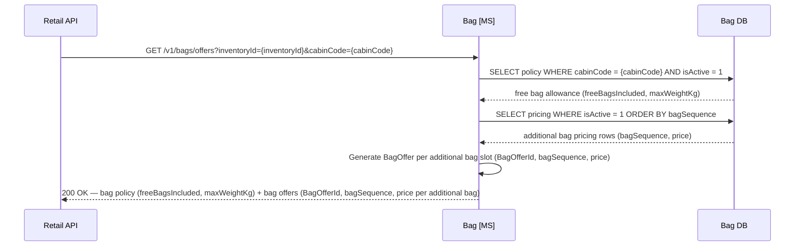

*Ref: ancillary bag - bag allowance policy and priced bag offer retrieval*

#### Post-Sale Bag Selection

Customers may add checked bags to a confirmed booking at any time before OLCI opens via the manage-booking flow.

- Free cabin allowance is displayed automatically; additional bags beyond the allowance are chargeable.
- Each additional bag purchased creates a separate `Bag` order item with its own `BagOfferId` and payment reference; free bags carry no charge and generate no order items.

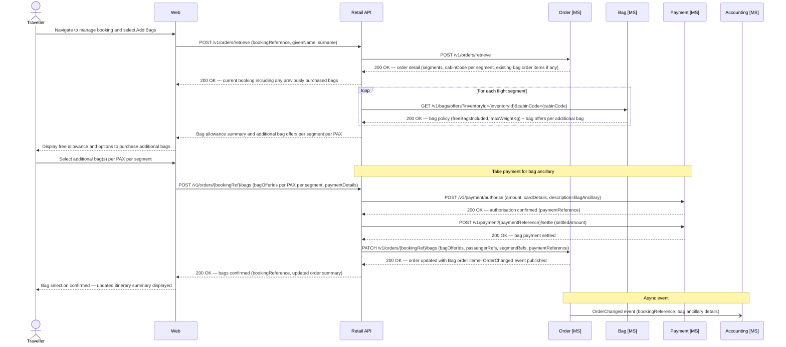

*Ref: ancillary bag - post-sale additional bag purchase with payment and order update*

#### Data Schema — Bag

#### `bag.BagPolicy`

| Column | Type | Nullable | Default | Key | Notes |
|---|---|---|---|---|---|
| PolicyId | UNIQUEIDENTIFIER | No | NEWID() | PK | |
| CabinCode | CHAR(1) | No | | UK | `F` · `J` · `W` · `Y` |
| FreeBagsIncluded | TINYINT | No | | | Number of free checked bags included in fare for this cabin |
| MaxWeightKgPerBag | TINYINT | No | | | Maximum weight per individual bag in kilograms |
| IsActive | BIT | No | `1` | | |
| CreatedAt | DATETIME2 | No | SYSUTCDATETIME() | | |
| UpdatedAt | DATETIME2 | No | SYSUTCDATETIME() | | |

> **Example seed data:** `('J', 2, 32)` · `('F', 2, 32)` · `('W', 2, 23)` · `('Y', 1, 23)`.
> **One active policy per cabin:** The `UNIQUE` constraint on `CabinCode` enforces a single active bag policy per cabin code. Policy changes should be managed by updating the existing row rather than inserting new rows.

#### `bag.BagPricing`

| Column | Type | Nullable | Default | Key | Notes |
|---|---|---|---|---|---|
| PricingId | UNIQUEIDENTIFIER | No | NEWID() | PK | |
| BagSequence | TINYINT | No | | UK (with CurrencyCode) | `1` = 1st additional bag beyond free allowance · `2` = 2nd additional · `99` = 3rd and beyond (catch-all) |
| CurrencyCode | CHAR(3) | No | `'GBP'` | UK (with BagSequence) | ISO 4217 currency code |
| Price | DECIMAL(10,2) | No | | | |
| IsActive | BIT | No | `1` | | |
| ValidFrom | DATETIME2 | No | | | Effective start of this pricing rule |
| ValidTo | DATETIME2 | Yes | | | Null = open-ended / currently active |
| UpdatedAt | DATETIME2 | No | SYSUTCDATETIME() | | |

> **Constraints:** `UQ_BagPricing_Sequence` (unique) on `(BagSequence, CurrencyCode)` — enforces one active price per bag sequence/currency combination.
> **Example seed data:** `(1, 'GBP', 60.00)` · `(2, 'GBP', 80.00)` · `(99, 'GBP', 100.00)`.

#### `bag.StoredBagOffer`

| Column | Type | Nullable | Default | Key | Notes |
|---|---|---|---|---|---|
| BagOfferId | UNIQUEIDENTIFIER | No | NEWID() | PK | Short-lived snapshot; passed to channels as the bag offer identifier |
| InventoryId | UNIQUEIDENTIFIER | No | | | Cross-schema ref to `offer.FlightInventory(InventoryId)`; not enforced as DB FK |
| CabinCode | CHAR(1) | No | | | `F` · `J` · `W` · `Y` |
| BagSequence | TINYINT | No | | | Which additional bag this offer prices (mirrors `bag.BagPricing.BagSequence`) |
| FreeBagsIncluded | TINYINT | No | | | Free allowance applicable to this cabin at time of offer generation |
| CurrencyCode | CHAR(3) | No | `'GBP'` | | ISO 4217 currency code |
| PriceAmount | DECIMAL(10,2) | No | | | Price locked at offer creation time |
| CreatedAt | DATETIME2 | No | SYSUTCDATETIME() | | |
| ExpiresAt | DATETIME2 | No | | | Offer expiry; channels must not submit expired `BagOfferId` values |
| IsConsumed | BIT | No | `0` | | Set to `1` once purchased; prevents reuse |

> **Indexes:** `IX_StoredBagOffer_Inventory` on `(InventoryId, CabinCode)`. `IX_StoredBagOffer_Expiry` on `(ExpiresAt)` WHERE `IsConsumed = 0` — used by background cleanup job.
> **Offer lifecycle:** `StoredBagOffer` rows are short-lived snapshots generated at retrieval time and consumed at purchase. Unconsumed, expired offers should be purged by a background job.

---

### SSR — Special Service Requests

SSRs are IATA-standardised four-character codes communicating individual passenger service needs to operations, ground handlers, and cabin crew.

- Two categories: **meal/dietary requests** (VGML, MOML, DBML, etc.) and **mobility/accessibility assistance** (WCHR, WCHS, WCHC, BLND, DEAF, etc.).
- All SSRs carry no ancillary charge; **EU Regulation 1107/2006** requires carriers to accommodate disabled passengers without surcharge.
- SSRs are segment-specific — a connecting passenger requires independent SSR entries per leg.
- Meal SSRs require at least 24 hours' notice; accessibility SSRs accepted up to check-in close but earlier notice aids ground handling preparation.
- On IROPS rebooking, the Disruption API carries all SSR items from the cancelled segment to the replacement itinerary.
- The SSR catalogue is a Retail API configuration resource — no separate microservice required.
- Selections stored as typed items in `OrderData` per passenger per segment and included in the manifest payload so `FlightManifest` records carry operational codes for crew briefings and ground handling.

**Supported SSR codes**

| Code | Category | Service |
|---|---|---|
| `VGML` | Meal | Vegetarian meal (lacto-ovo) |
| `HNML` | Meal | Hindu meal |
| `MOML` | Meal | Muslim / halal meal |
| `KSML` | Meal | Kosher meal |
| `DBML` | Meal | Diabetic meal |
| `GFML` | Meal | Gluten-free meal |
| `CHML` | Meal | Child meal |
| `BBML` | Meal | Baby / infant meal |
| `WCHR` | Mobility | Wheelchair — can walk but needs assistance over distances; cannot manage aircraft steps |
| `WCHS` | Mobility | Wheelchair — cannot manage steps; mobile on level ground |
| `WCHC` | Mobility | Wheelchair — fully immobile; requires cabin-seat assistance throughout |
| `BLND` | Accessibility | Blind or severely visually impaired passenger |
| `DEAF` | Accessibility | Deaf or severely hearing-impaired passenger |
| `DPNA` | Accessibility | Disabled passenger needing assistance (general; use where a more specific code does not apply) |

#### SSR Selection — Bookflow

SSR selection is an optional bookflow step offered after passenger details are captured, alongside seat and bag selection.

- The Retail API serves the SSR catalogue from its own configuration — no downstream microservice call required.
- No payment triggered — selections are appended to the basket as SSR items and committed to `OrderData` at order confirmation.
- SSR codes are included in the manifest payload written to the Delivery MS, ensuring operational visibility from the moment the booking is confirmed.

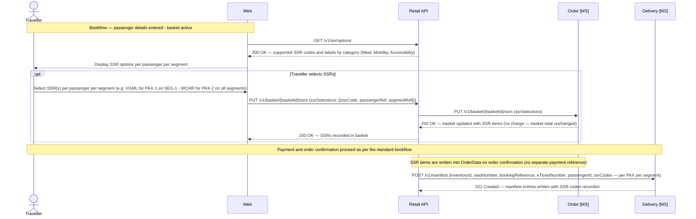

*Ref: SSR — selection during bookflow with basket update and manifest population at order confirmation*

#### SSR Management — Self-Serve

Passengers may add, change, or remove SSRs post-booking through the manage-booking flow up to the amendment cut-off.

- Amendment cut-off is typically 24 hours before departure for meal requests; the same threshold is applied to accessibility requests for consistency.
- The Retail API evaluates the cut-off window before forwarding any change to the Order MS; requests within the cut-off window are rejected with `422`.
- SSR changes do not trigger e-ticket reissuance — codes are not encoded in the BCBP string or e-ticket record; the update applies only to `OrderData` and the flight manifest.
- The `OrderChanged` event carries the updated SSR state for downstream consumers (e.g. a future notifications service).

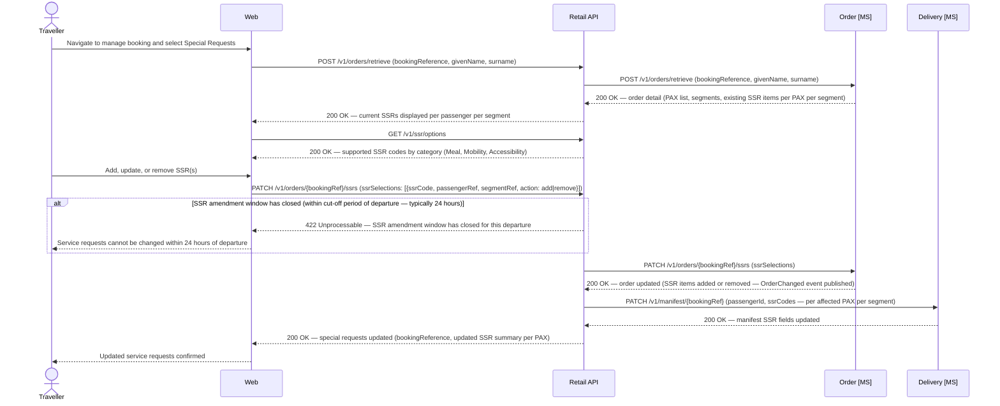

*Ref: SSR — self-serve add, update, and remove via manage-booking flow with cut-off validation and manifest update*

---

## Customer

The Customer microservice is the system of record for loyalty programme membership — holding each customer's profile, tier status, points balance, and transaction history.

- Accounts are identified by a unique loyalty number issued at registration.
- Authentication credentials are owned exclusively by the **Identity microservice**; the Customer DB holds only an opaque `IdentityReference` linking the two domains.
- The separation means Customer never handles credentials and Identity never holds loyalty or profile data.

### Register for the Loyalty Programme

Registration creates two linked records — an Identity account (email and password) and a Customer loyalty account (profile and points balance) — joined by an `IdentityReference` UUID.

- On success, the customer receives a unique loyalty number and is assigned to the base tier (`Blue`).
- A confirmation email is triggered by the Loyalty API once both records are created.
- If Identity creation succeeds but Customer creation fails, the Loyalty API must delete the orphaned Identity account before returning an error.

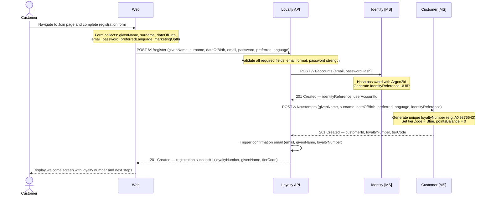

*Ref: customer loyalty - registration flow creating linked identity and loyalty accounts*

> **Email verification:** The `IsEmailVerified` flag on `identity.UserAccount` is set to `0` at registration. The confirmation email contains a one-time verification link. On click, a separate `POST /v1/accounts/{userAccountId}/verify-email` call is made to the Identity microservice to set `IsEmailVerified = 1`. Unverified accounts may still log in but are restricted from certain actions (e.g. redemptions) until verified.

> **Duplicate email handling:** The Identity microservice enforces a unique constraint on `Email`. If a registration attempt arrives for an address that already exists, the Identity microservice returns `409 Conflict`. The Loyalty API surfaces this as a validation error to the channel — it must not reveal whether the email belongs to an existing account (to prevent account enumeration).

> **Failure handling:** If the Identity microservice call succeeds but the subsequent Customer microservice call fails, the Loyalty API must call `DELETE /v1/accounts/{userAccountId}` on the Identity microservice to clean up the orphaned login account before returning an error to the channel. Partial registration states must not be left in the system.

### Retrieve Account and Points Balance

The loyalty dashboard surfaces a member's account summary and is also used to provide loyalty context during the booking flow.

- Two key values displayed separately: **PointsBalance** (redeemable currency for award bookings) and **TierProgressPoints** (qualifying activity towards tier status).
- Member tier — Blue, Silver, Gold, or Platinum — determines flight benefits including lounge access, priority boarding, and earn-rate multipliers.
- Showing tier progress alongside redeemable balance is a deliberate engagement mechanism giving members visibility of progress toward the next threshold.

```mermaid
sequenceDiagram
    actor Traveller
    participant Web
    participant LoyaltyAPI as Loyalty API
    participant CustomerMS as Customer [MS]

    Traveller->>Web: Navigate to loyalty account

    Web->>LoyaltyAPI: GET /v1/customers/{loyaltyNumber}
    LoyaltyAPI->>CustomerMS: GET /v1/customers/{loyaltyNumber}
    CustomerMS-->>LoyaltyAPI: 200 OK — customer profile (name, tier, pointsBalance, tierProgressPoints)
    LoyaltyAPI-->>Web: 200 OK — account summary
    Web-->>Traveller: Show profile, tier status, and points balance
```

*Ref: customer loyalty - retrieve account profile, tier status, and points balance*

---

### Retrieve Transaction History

The points statement is the immutable audit trail of every points movement on a loyalty account — an important trust mechanism for FFP members.

- `LoyaltyTransaction` is an append-only log; each row is a permanent record with a running `BalanceAfter` snapshot.
- Transactions returned in reverse-chronological order and paginated; channels must support pagination for long-standing members with extensive history.

```mermaid
sequenceDiagram
    actor Traveller
    participant Web
    participant LoyaltyAPI as Loyalty API
    participant CustomerMS as Customer [MS]

    Traveller->>Web: Navigate to points statement

    Web->>LoyaltyAPI: GET /v1/customers/{loyaltyNumber}/transactions?page=1&pageSize=20
    LoyaltyAPI->>CustomerMS: GET /v1/customers/{loyaltyNumber}/transactions?page=1&pageSize=20
    CustomerMS-->>LoyaltyAPI: 200 OK — paginated transaction list (transactionId, type, points, description, bookingReference, transactionDate)
    LoyaltyAPI-->>Web: 200 OK — statement
    Web-->>Traveller: Show paginated points history
```

*Ref: customer loyalty - retrieve paginated points transaction history*

---

### Earn Points on Booking Confirmation

On order confirmation, the Order MS publishes an `OrderConfirmed` event; if the booking includes a loyalty number, the Customer MS consumes the event and accrues points.

- Points calculated from the event payload based on fare paid, cabin class, and tier at time of travel.
- Calculation logic is encapsulated within the Customer MS; the event provides the inputs.

> **Points calculation** rules (multipliers, bonus tiers, partner earn rates) are the responsibility of the Customer microservice and are not defined in this document. The event payload provides the inputs; the calculation logic is encapsulated within the service.

```mermaid
sequenceDiagram
    participant OrderMS as Order [MS]
    participant EventBus as Event Bus
    participant CustomerMS as Customer [MS]

    Note over OrderMS, EventBus: Async — triggered on order confirmation
    OrderMS-)EventBus: OrderConfirmed event (bookingReference, loyaltyNumber, flights, fareAmount, cabinCode, passengerType)

    EventBus-)CustomerMS: OrderConfirmed event received

    CustomerMS->>CustomerMS: Calculate points to earn (fareAmount, cabinCode, tierStatus)
    CustomerMS->>CustomerMS: Append LoyaltyTransaction (type=Earn, points, bookingReference)
    CustomerMS->>CustomerMS: Update pointsBalance + tierProgressPoints
    Note over CustomerMS: pointsBalance and tierProgressPoints updated atomically with transaction insert
```

*Ref: customer loyalty - async points accrual triggered by OrderConfirmed event on booking confirmation*

---

### Update Profile Details

Customers may update their loyalty profile (name, date of birth, nationality, preferred language, phone) at any time via the loyalty portal.

- The Loyalty API validates the JWT using the Identity MS public signing key — no DB round-trip required — before forwarding changes to the Customer MS.
- Updating a loyalty profile name does **not** amend any confirmed booking or issued e-ticket; those records are independent (owned by Order and Delivery MS respectively).
- Name corrections on a confirmed ticket require the manage-booking flow via the Retail API; minor typographical corrections are typically waived, anything beyond that triggers reissuance subject to fare conditions.

```mermaid
sequenceDiagram
    actor Customer
    participant Web
    participant LoyaltyAPI as Loyalty API
    participant CustomerMS as Customer [MS]
    participant CustomerDB as Customer DB

    Customer->>Web: Submit updated profile fields (givenName, surname, dateOfBirth, nationality, phoneNumber, preferredLanguage)
    Web->>LoyaltyAPI: PATCH /v1/customers/{loyaltyNumber}/profile — Bearer {accessToken}

    LoyaltyAPI->>LoyaltyAPI: Validate JWT using Identity MS public signing key

    alt Token invalid or expired
        LoyaltyAPI-->>Web: 401 Unauthorized
        Web-->>Customer: Session expired — please log in again
    end

    LoyaltyAPI->>CustomerMS: PATCH /v1/customers/{loyaltyNumber} (changed fields only)
    CustomerMS->>CustomerDB: UPDATE customer.Customer SET ... WHERE LoyaltyNumber = {loyaltyNumber}
    CustomerDB-->>CustomerMS: Row updated- UpdatedAt refreshed
    CustomerMS-->>LoyaltyAPI: 200 OK — updated customer record
    LoyaltyAPI-->>Web: 200 OK — profile updated
    Web-->>Customer: Confirmation — details have been saved
```

*Ref: customer loyalty - update profile details via Loyalty API with JWT validation*

---

### Update Email Address

Email address changes are security-sensitive and follow a two-step verification flow — the new address must be verified before the change takes effect.

- A time-limited verification link is sent to the **new** address; existing credentials remain active until ownership is confirmed.
- On successful verification, all active refresh tokens are invalidated — the customer must re-authenticate with the new address.
- Email is owned entirely by the Identity MS; the Customer DB holds no email field, so no Customer DB update is required.

```mermaid
sequenceDiagram
    actor Customer
    participant Web
    participant LoyaltyAPI as Loyalty API
    participant IdentityMS as Identity [MS]

    Customer->>Web: Request email address change (newEmail)
    Web->>LoyaltyAPI: POST /v1/customers/{loyaltyNumber}/email/change-request { newEmail } — Bearer {accessToken}

    LoyaltyAPI->>LoyaltyAPI: Validate JWT using Identity MS public signing key

    alt Token invalid or expired
        LoyaltyAPI-->>Web: 401 Unauthorized
        Web-->>Customer: Session expired — please log in again
    end

    LoyaltyAPI->>IdentityMS: POST /v1/accounts/{identityReference}/email/change-request { newEmail }
    IdentityMS->>IdentityMS: Check newEmail is not already registered on another account

    alt Email already in use
        IdentityMS-->>LoyaltyAPI: 409 Conflict
        LoyaltyAPI-->>Web: 409 Conflict — email already associated with another account
        Web-->>Customer: That email address is already in use
    end

    IdentityMS->>IdentityMS: Store pending email change- generate time-limited single-use verification token
    IdentityMS->>IdentityMS: Send verification email to newEmail containing token link
    IdentityMS-->>LoyaltyAPI: 202 Accepted
    LoyaltyAPI-->>Web: 202 Accepted
    Web-->>Customer: Check your new inbox for a verification link

    Note over Customer,IdentityMS: Customer receives the verification email and follows the link

    Customer->>Web: Follow verification link (token)
    Web->>LoyaltyAPI: POST /v1/email/verify { token }
    LoyaltyAPI->>IdentityMS: POST /v1/email/verify { token }
    IdentityMS->>IdentityMS: Validate token (not expired, not previously used)

    alt Token invalid or expired
        IdentityMS-->>LoyaltyAPI: 400 Bad Request — token invalid or expired
        LoyaltyAPI-->>Web: 400 Bad Request
        Web-->>Customer: Verification link has expired — please request a new one
    end

    IdentityMS->>IdentityMS: Update UserAccount.Email to newEmail
    IdentityMS->>IdentityMS: Invalidate all active refresh tokens for this account (force re-login)
    IdentityMS-->>LoyaltyAPI: 200 OK — email updated
    LoyaltyAPI-->>Web: 200 OK — email address changed successfully
    Web-->>Customer: Email updated — please log in again with your new address
```

*Ref: customer loyalty - two-step email address change with verification token and session invalidation*

---

### Data Schema — Customer

The Customer domain uses three tables: `Customer` (profile, tier, and points balances), `LoyaltyTransaction` (immutable append-only points movement log), and `TierConfig` (qualifying thresholds per tier, used for tier upgrade evaluation).

- `Customer` stores an `IdentityReference` — the only link to the Identity domain; Customer never stores credentials, Identity never stores loyalty or profile data.
- `IdentityReference` is nullable to support legacy accounts or future scenarios where a loyalty account exists without a login.

#### `customer.TierConfig`

| Column | Type | Nullable | Default | Key | Notes |
|---|---|---|---|---|---|
| TierConfigId | UNIQUEIDENTIFIER | No | NEWID() | PK | |
| TierCode | VARCHAR(20) | No | | | `Blue` · `Silver` · `Gold` · `Platinum` |
| TierLabel | VARCHAR(50) | No | | | Display name, e.g. `Apex Silver` |
| MinQualifyingPoints | INT | No | | | Minimum tier progress points required to hold this tier |
| IsActive | BIT | No | `1` | | |
| ValidFrom | DATETIME2 | No | | | Effective start of this tier configuration |
| ValidTo | DATETIME2 | Yes | | | Null = currently active |
| CreatedAt | DATETIME2 | No | SYSUTCDATETIME() | | |

> **Indexes:** `IX_TierConfig_Active` on `(TierCode)` WHERE `IsActive = 1`.
> **Versioning:** Rows are never deleted, only superseded. To change tier thresholds, insert a new row with `IsActive = 1` and set `ValidTo` on the previous row.

#### `customer.Customer`

| Column | Type | Nullable | Default | Key | Notes |
|---|---|---|---|---|---|
| CustomerId | UNIQUEIDENTIFIER | No | NEWID() | PK | |
| LoyaltyNumber | VARCHAR(20) | No | | UK | Issued at account creation, e.g. `AX9876543` |
| IdentityReference | UNIQUEIDENTIFIER | Yes | | UK | Opaque ref to Identity DB; null if no login account (e.g. pre-Identity legacy accounts) |
| GivenName | VARCHAR(100) | No | | | |
| Surname | VARCHAR(100) | No | | | |
| DateOfBirth | DATE | Yes | | | |
| Nationality | CHAR(3) | Yes | | | ISO 3166-1 alpha-3 |
| PreferredLanguage | CHAR(5) | Yes | `'en-GB'` | | BCP 47 language tag |
| PhoneNumber | VARCHAR(30) | Yes | | | |
| TierCode | VARCHAR(20) | No | `'Blue'` | | FK ref to `customer.TierConfig(TierCode)` enforced at application layer |
| PointsBalance | INT | No | `0` | | Current redeemable points balance |
| TierProgressPoints | INT | No | `0` | | Qualifying points for tier evaluation; not decremented on redemption |
| IsActive | BIT | No | `1` | | |
| CreatedAt | DATETIME2 | No | SYSUTCDATETIME() | | |
| UpdatedAt | DATETIME2 | No | SYSUTCDATETIME() | | |

> **Indexes:** `IX_Customer_LoyaltyNumber` on `(LoyaltyNumber)`. `IX_Customer_Surname` on `(Surname, GivenName)`.
> **Identity separation:** The Customer table stores only `IdentityReference` — it never stores email addresses or passwords. The FK to `customer.TierConfig` is enforced at the application layer rather than as a DB constraint to avoid cross-table coupling during tier configuration changes.

#### `customer.LoyaltyTransaction`

| Column | Type | Nullable | Default | Key | Notes |
|---|---|---|---|---|---|
| TransactionId | UNIQUEIDENTIFIER | No | NEWID() | PK | |
| CustomerId | UNIQUEIDENTIFIER | No | | FK → `customer.Customer(CustomerId)` | |
| TransactionType | VARCHAR(20) | No | | | `Earn` · `Redeem` · `Adjustment` · `Expiry` · `Reinstate` |
| PointsDelta | INT | No | | | Positive = earned; negative = redeemed or expired |
| BalanceAfter | INT | No | | | Running `PointsBalance` snapshot after this transaction |
| BookingReference | CHAR(6) | Yes | | | Associated booking reference where applicable |
| FlightNumber | VARCHAR(10) | Yes | | | Associated flight where applicable (Earn transactions) |
| Description | VARCHAR(255) | No | | | e.g. `'Points earned — AX003 LHR-JFK, Business Flex'` |
| TransactionDate | DATETIME2 | No | SYSUTCDATETIME() | | |
| CreatedAt | DATETIME2 | No | SYSUTCDATETIME() | | |

> **Indexes:** `IX_LoyaltyTransaction_Customer` on `(CustomerId, TransactionDate DESC)`. `IX_LoyaltyTransaction_BookingReference` on `(BookingReference)` WHERE `BookingReference IS NOT NULL`.
> **Immutability:** `LoyaltyTransaction` rows are append-only and must never be updated or deleted. `BalanceAfter` on the most recent transaction is the source of truth for a customer's points balance in the event of any discrepancy with the `PointsBalance` column.

> **Points balance integrity:** `PointsBalance` and `TierProgressPoints` on `customer.Customer` are updated atomically within the same database transaction as the `LoyaltyTransaction` insert. The `BalanceAfter` column on each transaction row records the running balance snapshot at that point, providing a self-consistent audit trail independent of the current balance column. In the event of a discrepancy, `BalanceAfter` on the most recent transaction is the source of truth.

> **TierProgressPoints vs PointsBalance:** These two values are tracked separately. `PointsBalance` is the redeemable balance available to spend. `TierProgressPoints` accumulates qualifying activity for tier evaluation and may be reset annually or per programme rules — it is not decremented when points are redeemed. Tier evaluation logic (when to upgrade or downgrade a member) is the responsibility of the Customer microservice and runs as a background process or is triggered by each `Earn` transaction.

> **Transaction types:** `Earn` — points accrued from a completed flight. `Redeem` — points redeemed against a future booking (award bookings, future phase). `Adjustment` — manual correction applied by a customer service agent with a reason. `Expiry` — points removed due to account inactivity or programme rules. `Reinstate` — reversal of an expiry or erroneous redemption.

---

## Identity

The Identity microservice is the security boundary for all authentication and credential management — the sole owner of email addresses and hashed passwords.

- The Identity/Customer boundary is deliberate: Identity knows nothing about points or tier status; Customer knows nothing about passwords.
- The two domains are linked only by an opaque `IdentityReference` UUID, allowing Identity to evolve independently.
- Short-lived JWT access tokens validated by downstream APIs using the Identity MS public signing key — no DB round-trip on every request.
- Refresh tokens stored in the Identity DB with single-use semantics; rotated on each use to limit exposure if a token is compromised.

### Login, Logout, and Token Refresh

Login issues a short-lived JWT access token and a longer-lived refresh token; logout revokes the refresh token to invalidate the session.

- Downstream APIs validate the JWT signature using the Identity MS public signing key — no DB round-trip on every request.
- When the access token expires, the channel silently uses the refresh token to obtain a new pair without requiring the customer to re-enter their password.
- Refresh tokens have single-use semantics and are rotated on each use.

```mermaid
sequenceDiagram
    actor Customer
    participant Web
    participant LoyaltyAPI as Loyalty API
    participant IdentityMS as Identity [MS]
    participant IdentityDB as Identity DB

    %% ── LOGIN ──
    Customer->>Web: Enter email and password
    Web->>LoyaltyAPI: POST /v1/auth/login (email, password)
    LoyaltyAPI->>IdentityMS: POST /v1/auth/login (email, password)

    IdentityMS->>IdentityDB: SELECT UserAccount WHERE Email = {email}
    IdentityDB-->>IdentityMS: UserAccount row (passwordHash, isLocked, failedLoginAttempts)

    alt Account locked
        IdentityMS-->>LoyaltyAPI: 403 Forbidden — account locked
        LoyaltyAPI-->>Web: 403 Forbidden
        Web-->>Customer: Account locked — please reset your password
    end

    IdentityMS->>IdentityMS: Verify password against Argon2id hash

    alt Invalid credentials
        IdentityMS->>IdentityDB: INCREMENT FailedLoginAttempts - lock account if threshold reached
        IdentityMS-->>LoyaltyAPI: 401 Unauthorised — invalid credentials
        LoyaltyAPI-->>Web: 401 Unauthorised
        Web-->>Customer: Email or password incorrect
    end

    IdentityMS->>IdentityDB: RESET FailedLoginAttempts = 0 - UPDATE LastLoginAt = now
    IdentityMS->>IdentityDB: INSERT RefreshToken (tokenHash, expiresAt, deviceHint)
    IdentityMS-->>LoyaltyAPI: 200 OK — accessToken (JWT, 15 min TTL), refreshToken, identityReference
    LoyaltyAPI->>LoyaltyAPI: Look up Customer record by identityReference
    LoyaltyAPI-->>Web: 200 OK — accessToken, refreshToken, customer profile summary
    Web-->>Customer: Logged in — redirect to account dashboard

    %% ── TOKEN REFRESH ──
    Note over Web, IdentityMS: Access token nearing expiry — channel refreshes silently
    Web->>LoyaltyAPI: POST /v1/auth/refresh (refreshToken)
    LoyaltyAPI->>IdentityMS: POST /v1/auth/refresh (refreshToken)
    IdentityMS->>IdentityDB: SELECT RefreshToken WHERE tokenHash = hash({refreshToken}) AND IsRevoked = 0
    IdentityDB-->>IdentityMS: RefreshToken row

    alt Token not found, revoked, or expired
        IdentityMS-->>LoyaltyAPI: 401 Unauthorised — refresh token invalid
        LoyaltyAPI-->>Web: 401 Unauthorised
        Web-->>Customer: Session expired — please log in again
    end

    IdentityMS->>IdentityDB: SET IsRevoked = 1 on consumed token (single-use rotation)
    IdentityMS->>IdentityDB: INSERT new RefreshToken
    IdentityMS-->>LoyaltyAPI: 200 OK — new accessToken, new refreshToken
    LoyaltyAPI-->>Web: 200 OK — refreshed tokens

    %% ── LOGOUT ──
    Customer->>Web: Click logout
    Web->>LoyaltyAPI: POST /v1/auth/logout — Bearer {accessToken}
    LoyaltyAPI->>IdentityMS: POST /v1/auth/logout (refreshToken)
    IdentityMS->>IdentityDB: SET IsRevoked = 1 on active RefreshToken for this session
    IdentityDB-->>IdentityMS: Updated
    IdentityMS-->>LoyaltyAPI: 200 OK
    LoyaltyAPI-->>Web: 200 OK
    Web-->>Customer: Logged out
```

*Ref: identity — login with credential validation and account lockout, silent token refresh with single-use rotation, and logout with refresh token revocation*

---

### Password Reset

Password reset uses a zero-knowledge flow to prevent account enumeration, with full session invalidation on completion.

- The response is identical (`202 Accepted`) whether or not the email address is registered — no information is revealed to the requester.
- A time-limited single-use reset token (1-hour TTL) is dispatched to the address if known; the customer follows the link and submits a new password.
- All active refresh tokens are invalidated on success, requiring re-authentication across all sessions.

```mermaid
sequenceDiagram
    actor Customer
    participant Web
    participant LoyaltyAPI as Loyalty API
    participant IdentityMS as Identity [MS]
    participant IdentityDB as Identity DB

    %% ── REQUEST RESET ──
    Customer->>Web: Navigate to Forgotten Password and enter email address
    Web->>LoyaltyAPI: POST /v1/auth/password/reset-request (email)
    LoyaltyAPI->>IdentityMS: POST /v1/auth/password/reset-request (email)

    IdentityMS->>IdentityDB: SELECT UserAccount WHERE Email = {email}

    alt Email not found
        Note over IdentityMS: No action taken — response is identical to success to prevent account enumeration
    end

    alt Email found
        IdentityMS->>IdentityMS: Generate time-limited single-use reset token (TTL: 1 hour)
        IdentityMS->>IdentityDB: Store hashed reset token against UserAccountId with ExpiresAt
        IdentityMS->>IdentityMS: Send password reset email to {email} containing token link
    end

    IdentityMS-->>LoyaltyAPI: 202 Accepted
    LoyaltyAPI-->>Web: 202 Accepted
    Web-->>Customer: If that address is registered, a reset link has been sent

    %% ── SUBMIT NEW PASSWORD ──
    Note over Customer, IdentityMS: Customer receives the email and follows the reset link

    Customer->>Web: Submit new password via reset link (token, newPassword)
    Web->>LoyaltyAPI: POST /v1/auth/password/reset (token, newPassword)
    LoyaltyAPI->>IdentityMS: POST /v1/auth/password/reset (token, newPassword)

    IdentityMS->>IdentityDB: SELECT reset token WHERE tokenHash = hash({token}) AND IsUsed = 0
    IdentityDB-->>IdentityMS: Reset token row (userAccountId, expiresAt)

    alt Token not found, already used, or expired
        IdentityMS-->>LoyaltyAPI: 400 Bad Request — token invalid or expired
        LoyaltyAPI-->>Web: 400 Bad Request
        Web-->>Customer: Reset link has expired or already been used — please request a new one
    end

    IdentityMS->>IdentityMS: Hash newPassword with Argon2id
    IdentityMS->>IdentityDB: UPDATE UserAccount SET PasswordHash = {newHash}, PasswordChangedAt = now, IsLocked = 0, FailedLoginAttempts = 0
    IdentityMS->>IdentityDB: Mark reset token as used (IsUsed = 1)
    IdentityMS->>IdentityDB: SET IsRevoked = 1 on all active RefreshTokens for this UserAccountId
    IdentityDB-->>IdentityMS: All updates applied

    IdentityMS-->>LoyaltyAPI: 200 OK — password reset successful
    LoyaltyAPI-->>Web: 200 OK
    Web-->>Customer: Password updated — please log in with your new password
```

*Ref: identity — password reset request with account enumeration protection, token validation, hash update, and full session invalidation*

> **Account lockout reset:** Setting `IsLocked = 0` and `FailedLoginAttempts = 0` as part of a successful password reset is intentional — a legitimate account owner who recovers access via password reset should be unblocked in the same flow, rather than requiring a separate administrator action.

> **Enumeration protection:** The identical `202 Accepted` response for both known and unknown email addresses in the reset-request flow is a deliberate security control, consistent with the duplicate-email handling behaviour described in the Register section above.

### Data Schema — Identity

The Identity domain owns the `identity.*` schema — the sole store of authentication credentials, holding one row per login account linked to Customer via `IdentityReference`. Passwords are stored as Argon2id salted hashes only; plain text is never persisted.

The Identity microservice exposes authentication and credential management endpoints consumed by the Loyalty API. It does not expose any loyalty or profile data; it returns only a validated `IdentityReference` on successful authentication, which the Loyalty API uses to look up the corresponding Customer account.

#### `identity.UserAccount`

| Column | Type | Nullable | Default | Key | Notes |
|---|---|---|---|---|---|
| UserAccountId | UNIQUEIDENTIFIER | No | NEWID() | PK | |
| IdentityReference | UNIQUEIDENTIFIER | No | NEWID() | UK | Shared key passed to the Customer microservice at registration |
| Email | VARCHAR(254) | No | | UK | RFC 5321 maximum length |
| PasswordHash | VARCHAR(255) | No | | | Argon2id hash; salt embedded in hash string; plain text must never be stored |
| IsEmailVerified | BIT | No | `0` | | Set to `1` after the customer clicks the verification link |
| IsLocked | BIT | No | `0` | | Set to `1` after repeated failed login attempts |
| FailedLoginAttempts | TINYINT | No | `0` | | Reset to `0` on successful authentication |
| LastLoginAt | DATETIME2 | Yes | | | Null until first successful login |
| PasswordChangedAt | DATETIME2 | No | SYSUTCDATETIME() | | |
| CreatedAt | DATETIME2 | No | SYSUTCDATETIME() | | |
| UpdatedAt | DATETIME2 | No | SYSUTCDATETIME() | | |

> **Indexes:** `IX_UserAccount_Email` on `(Email)`.
> **Account lockout:** After a configurable number of consecutive failed login attempts (default: 5), `IsLocked` is set to `1` and further authentication attempts are rejected until an administrator or automated unlock process resets the flag. `FailedLoginAttempts` resets to `0` on successful authentication.
> **Password hashing:** Passwords must be hashed using Argon2id (bcrypt acceptable as fallback). The raw password must not be stored, logged, or transmitted after the initial hash operation. Salt is embedded within the hash string.

#### `identity.RefreshToken`

| Column | Type | Nullable | Default | Key | Notes |
|---|---|---|---|---|---|
| RefreshTokenId | UNIQUEIDENTIFIER | No | NEWID() | PK | |
| UserAccountId | UNIQUEIDENTIFIER | No | | FK → `identity.UserAccount(UserAccountId)` | |
| TokenHash | VARCHAR(255) | No | | | Hashed token value; raw token returned to client at issuance only |
| DeviceHint | VARCHAR(100) | Yes | | | Optional user-agent label for session management UI |
| IsRevoked | BIT | No | `0` | | Set to `1` on use (single-use semantics) or explicit logout |
| ExpiresAt | DATETIME2 | No | | | |
| CreatedAt | DATETIME2 | No | SYSUTCDATETIME() | | |

> **Indexes:** `IX_RefreshToken_UserAccount` on `(UserAccountId)` WHERE `IsRevoked = 0`.
> **Refresh token rotation:** On each use, the existing token is revoked (`IsRevoked = 1`) and a new one issued, providing single-use semantics. All tokens for a `UserAccountId` can be revoked simultaneously to force logout across all sessions.
> **Access tokens:** Short-lived JWT access tokens (recommended TTL: 15 minutes) are issued at authentication time and are not persisted in the Identity DB. The Loyalty API and Retail API validate access tokens using the Identity microservice's public signing key without a database round-trip on each request.
> **IdentityReference:** The Identity microservice issues the `IdentityReference` UUID at login account creation and passes it to the Customer microservice for storage. The Customer microservice does not call the Identity microservice to validate credentials — authentication is handled upstream by the Loyalty API before any Customer calls are made.


-----

# Technical Considerations

- Microservices built in C# as Azure Functions (isolated)
- Databases will be built in Microsoft SQL. Ideally these would be individual, isolated, database instances, but for this project, we will use one database with key domains separated logically using the domain names and the schema.
- Front end websites, app and contact centre apps (including others) will be built using the latest version of Angular, hosted as Static Web Apps on Azure.
- **Aircraft type codes** are represented as a 4-character code consisting of the manufacturer prefix followed by a 3-digit variant number. The third digit encodes the specific variant. For example: A350-1000 → `A351`, A350-900 → `A359`, B787-900 → `B789`, B787-10 → `B781`. This convention is consistent with IATA SSIM aircraft designator standards and must be used uniformly across all services, databases, and API contracts.
- JSON columns (`OrderData`, `CabinLayout`) use SQL Server's native `NVARCHAR(MAX)` with `ISJSON` check constraints to enforce structural validity. Where query performance requires filtering or sorting on JSON properties, SQL Server computed columns with JSON path expressions should be used to create targeted indexes.
- **StoredOffer expiry:** The `offer.StoredOffer` table includes an `ExpiresAt` column. The Order API must validate that an offer has not expired before consuming it. A background job should periodically purge or archive expired, unconsumed offers to keep the table lean.
- **Offer consumption:** Once an `OfferId` is successfully retrieved by the Order API during order creation, `IsConsumed` is set to `1` on the `StoredOffer` row to prevent the same offer being used on multiple orders.
- **Basket lifecycle:** The basket is the authoritative pre-sale state and lives entirely in the Order DB (`order.Basket`). It is created at the start of checkout, accumulates flight offers, seat offers, and PAX details, and is hard-deleted on successful order confirmation. If abandoned or expired, a background job releases held inventory and marks the basket `Expired`. The `TicketingTimeLimit` (default 24 hours, configurable via `order.BasketConfig`) is the latest time by which payment must complete; the `ExpiresAt` is the latest time the basket itself is considered valid. Both are evaluated before authorisation is attempted.
- **Payment DB:** The Payment microservice owns its own `payment.*` schema. The `PaymentReference` (e.g. `AXPAY-0001`) is the shared key between the Payment DB and the Order microservice — it is stored on each `orderItem` in `OrderData` to link order lines to their payment transactions. Multiple `PaymentReference` values may exist per booking (one per ancillary payment type). The full card token used during authorisation is never persisted; only `CardLast4` and `CardType` are stored.
- **SeatPricing:** Fleet-wide seat prices are defined in `seat.SeatPricing` and are cabin- and position-based. Business Class seat selection carries no charge. The Seat microservice exposes pricing rules via its own API; the Retail API retrieves both the seatmap layout and pricing rules from the Seat MS, then retrieves per-seat availability status from the Offer MS (`GET /v1/flights/{flightId}/seat-offers` returns availability status only — available, held, or sold — with no pricing data), and merges all three datasets before returning the seat offer response to the channel. The Offer MS does not call the Seat MS. `SeatOfferId` is generated by the Offer MS based on `InventoryId` + `SeatNumber` (data it owns independently) and does not require `SeatmapId` or pricing version. `SeatOfferId` values are session-scoped and should not be stored long-term by channels.
- **Delivery DB:** The Delivery microservice owns its own `Delivery DB` schema (`delivery.*`). It does not read from or write to `order.Order`. Order data required for manifest population (e-ticket numbers, passenger names, seat assignments) is passed explicitly by the Retail API orchestration layer at the point of booking confirmation and subsequent seat changes.
- **FlightManifest seatmap validation:** Before writing any row to `delivery.FlightManifest`, the orchestration layer (Retail API, Airport API, or Disruption API) must validate the `SeatNumber` against the active seatmap for the relevant `AircraftType` by calling `GET /v1/seatmap/{aircraftType}` on the Seat microservice. Any seat number not present on the active seatmap must be rejected by the orchestration layer before the Delivery MS is called. The Delivery MS trusts the seat number provided by its caller and does not call the Seat MS. This validation responsibility applies to both initial writes (booking confirmation) and updates (post-purchase seat changes).
- **Disruption API idempotency:** The Disruption API must store a log of processed `disruptionEventId` values from the FOS and de-duplicate repeat submissions. The FOS is an external system and may retry events on network failure; duplicate processing of the same cancellation or delay event would result in corrupt order state.
- **IROPS fare override:** The Order microservice must recognise a `reason=FlightCancellation` flag on rebook requests originating from the Disruption API and waive fare change restrictions regardless of the original fare conditions. This override must be logged on the order history for audit purposes.
- **Disruption rebooking prioritisation:** Cancellation rebooking is processed in priority order (cabin class → loyalty tier → booking date). The Disruption API is responsible for sorting the affected passenger list before iterating. This ordering must be preserved in the processing queue even for large passenger loads handled asynchronously.

# Airline Context — Apex Air

This document describes the reservation system for **Apex Air**, IATA carrier code **AX**. All examples, flight numbers, carrier codes, and loyalty references throughout this document use the `AX` designator.

Apex Air is a premium transatlantic and long-haul carrier operating a fleet of approximately 50 aircraft across three types:

- **Boeing 787-9** (`B789`) — primary long-haul workhorse, used on transatlantic and Asia-Pacific routes
- **Airbus A330-900** (`A339`) — medium-to-long-haul, used on Caribbean and secondary transatlantic routes
- **Airbus A350-1000** (`A351`) — flagship widebody, used on high-demand transatlantic and key Asia routes

Apex Air's network is focused on the following key markets:

- **North America** — major gateway cities including New York (JFK), Los Angeles (LAX), Miami (MIA), Chicago (ORD), and Boston (BOS)
- **Caribbean** — leisure and VFR routes to destinations including Barbados (BGI), Jamaica (KIN), and the Bahamas (NAS)
- **East Asia** — Hong Kong (HKG), Tokyo (NRT), Shanghai (PVG), and Beijing (PEK)
- **South-East Asia** — Singapore (SIN)
- **South Asia** — key Indian cities including Mumbai (BOM), Delhi (DEL), and Bangalore (BLR)

All flights operate from a single UK hub. Apex Air participates in the IATA ONE Order standard and operates a modern retailing architecture as described in this document.

---

# Glossary

- **APIS** — Advance Passenger Information System
- **BCBP** — Bar Coded Boarding Pass (IATA Resolution 792 standard for boarding pass barcode encoding)
- **CMK** — Customer-Managed Key
- **CORS** — Cross-Origin Resource Sharing
- **FOS** — Flight Operations System; the airline's operational system that manages the live flight schedule and notifies the reservation system of disruption events (delays and cancellations) via the Disruption API
- **GDS** — Global Distribution System
- **IATA** — International Air Transport Association
- **IROPS** — Irregular Operations; collective term for disruption events including delays, cancellations, diversions, and aircraft swaps that require operational intervention in the reservation system
- **MCT** — Minimum Connection Time; the minimum layover time required at an airport for a passenger to transfer between two flights, as defined by the airport authority; connections below MCT are not legally valid itineraries
- **NDC** — New Distribution Capability (IATA standard)
- **OLCI** — Online Check In
- **OTA** — Online Travel Agent
- **PAX** — Passenger
- **PCI DSS** — Payment Card Industry Data Security Standard
- **PII** — Personally Identifiable Information
- **PNR** — Passenger Name Record
- **RBAC** — Role-Based Access Control
- **SSR** — Special Service Request; an IATA-standardised four-character code (e.g. `WCHR`, `VGML`) placed on a booking to communicate individual passenger service needs — such as meal preferences or mobility assistance — to the airline's operations, ground handlers, and cabin crew
- **TLS** — Transport Layer Security
- **UK GDPR** — United Kingdom General Data Protection Regulation
