# System Architecture - Design

## Overview

This outlines the design for an airline reservation system based on offer and order capability (Modern Airline Retailing).

The system will have the following core concepts.

- Offer - returns availability and pricing of the airlines flights.
- Order - creates, modifies, and cancels orders (bookings on the plane) based on the offer, with passenger information included, takes payment, and manages all post-booking changes including passenger detail updates, seat changes, and cancellations.
- Payment - payment orchestration, supporting credit card payments and in future other methods like PayPal and ApplePay; handles multiple separate authorisations and settlements within a single booking (e.g. fares ticketed separately from ancillary seat purchases).
- Delivery - Akin to departure control, including online check in (OLCI), irregular operations (IROPS), seat allocation, gate management.
- Customer - loyalty accounts for customers - with customer details, points balances, and transaction (historical and future orders).
- Identity - stores login credential for the customer accounts.
- Accounting - accounting system - keeping a track of all orders, refunds, balance sheets, profit and loss.
- Seat - manages seatmap definitions per aircraft type; provides seatmap views and seat pricing to other services and channels (does not manage seat selection or inventory).

Please note (these one-name capability 'domain names' should be used for domain naming in the code)

## High level system architecture

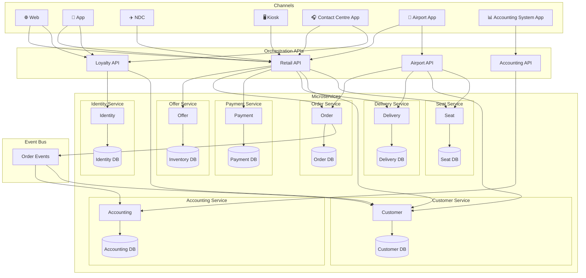

Key components:

- Channels
  - Web
  - App
  - NDC (XML APIs based on IATA NDC standard for GDS and other airlines (OTAs) to connect to)
  - Kiosk (self service airport check in terminals)
  - Contact Centre App (for new bookings, IROPS management, customer account management)
  - Airport App (for airport staff to manage non-OLCI check in, and gate management, seat assignment, etc)
  - Accounting System App
- Orchestration APIs (these act as the APIs to connect the channels to the microservices)
  - Retail API (for web, app, NDC, kiosk, contact centre app, airport app)
  - Loyalty API (for web, app, contact centre)
  - Airport API (for Airport App)
  - Accounting API (for accounting system app)
- Microservices (and their data-bound databases)
  - Offer
    - Inventory DB
  - Order (handles creating, modifying, and cancelling orders; owns all post-booking changes including PAX updates, seat changes, and cancellations)
    - Order DB
  - Payment
    - Payment DB
  - Delivery
    - Delivery DB
  - Customer
    - Customer DB
  - Accounting (order events are published by the Order microservice to this service via the event bus)
    - Accounting DB
  - Seat (manages seatmap definitions and seat pricing per aircraft type; provides seatmap views and seat offers to channels — seat selection and inventory remain with Offer)
    - Seat DB

# Capability

## Offer

### Search

The search flow is built around the concept of a **slice** — a single directional search (outbound or inbound). The customer searches for each slice independently. Each search returns a set of offers; those offers are persisted immediately to the `StoredOffer` table so that pricing is locked at the point of offer creation. The customer selects one offer per slice, and the resulting `OfferIds` are passed through to the basket and ultimately to the Order API.

This ensures price integrity: the Order API retrieves the stored offer by `OfferId` rather than re-pricing, so the fare the customer saw is guaranteed to be the fare charged — regardless of how much time elapses during payment.

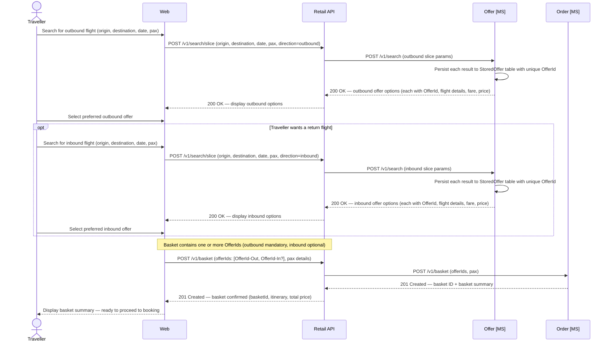

### Data Schema — Offer

The Offer domain maintains three tables. `FlightInventory` tracks available seat capacity per flight and cabin. `Fare` records fare basis, pricing, and conditions per inventory record. `StoredOffer` persists the specific offer returned to a customer at search time, capturing the exact fare, flight, and pricing snapshot so that price integrity is maintained through to order creation.

```sql
-- offer.FlightInventory
-- One row per flight leg per cabin class
CREATE TABLE offer.FlightInventory (
    InventoryId       UNIQUEIDENTIFIER  NOT NULL DEFAULT NEWID() PRIMARY KEY,
    FlightNumber      VARCHAR(10)       NOT NULL,   -- e.g. AX001
    DepartureDate     DATE              NOT NULL,
    Origin            CHAR(3)           NOT NULL,   -- IATA airport code
    Destination       CHAR(3)           NOT NULL,
    AircraftType      VARCHAR(4)        NOT NULL,   -- IATA-style 4-char code: manufacturer prefix + 3-digit variant, e.g. A351, B789
    CabinCode         CHAR(1)           NOT NULL,   -- F, J, W, Y
    TotalSeats        SMALLINT          NOT NULL,
    SeatsAvailable    SMALLINT          NOT NULL,
    SeatsSold         SMALLINT          NOT NULL DEFAULT 0,
    SeatsHeld         SMALLINT          NOT NULL DEFAULT 0,  -- seats held in baskets, not yet ticketed
    UpdatedAt         DATETIME2         NOT NULL DEFAULT SYSUTCDATETIME()
);

CREATE INDEX IX_FlightInventory_Flight
    ON offer.FlightInventory (FlightNumber, DepartureDate, CabinCode);

-- offer.Fare
-- One row per fare offering, linked to a flight inventory record.
-- Pricing is broken into base fare, taxes, and total for accounting clarity.
CREATE TABLE offer.Fare (
    FareId            UNIQUEIDENTIFIER  NOT NULL DEFAULT NEWID() PRIMARY KEY,
    InventoryId       UNIQUEIDENTIFIER  NOT NULL REFERENCES offer.FlightInventory(InventoryId),
    FareBasisCode     VARCHAR(20)       NOT NULL,   -- e.g. YLOWUK, JFLEXGB
    FareFamily        VARCHAR(50)       NULL,       -- e.g. Economy Light, Business Flex
    CabinCode         CHAR(1)           NOT NULL,
    BookingClass      CHAR(2)           NOT NULL,   -- revenue management booking class, e.g. Y, B, J
    CurrencyCode      CHAR(3)           NOT NULL DEFAULT 'GBP',
    BaseFareAmount    DECIMAL(10,2)     NOT NULL,
    TaxAmount         DECIMAL(10,2)     NOT NULL,
    TotalAmount       DECIMAL(10,2)     NOT NULL,   -- BaseFareAmount + TaxAmount
    IsRefundable      BIT               NOT NULL DEFAULT 0,
    IsChangeable      BIT               NOT NULL DEFAULT 0,
    ValidFrom         DATETIME2         NOT NULL,
    ValidTo           DATETIME2         NOT NULL
);

-- offer.StoredOffer
-- One row per offer presented to a customer during search. Captures a point-in-time
-- snapshot of the flight and fare so that price is honoured when the order is placed,
-- regardless of subsequent fare changes. OfferIds are passed into the basket and Order API.
CREATE TABLE offer.StoredOffer (
    OfferId           UNIQUEIDENTIFIER  NOT NULL DEFAULT NEWID() PRIMARY KEY,
    InventoryId       UNIQUEIDENTIFIER  NOT NULL REFERENCES offer.FlightInventory(InventoryId),
    FareId            UNIQUEIDENTIFIER  NOT NULL REFERENCES offer.Fare(FareId),
    FlightNumber      VARCHAR(10)       NOT NULL,
    DepartureDate     DATE              NOT NULL,
    Origin            CHAR(3)           NOT NULL,
    Destination       CHAR(3)           NOT NULL,
    AircraftType      VARCHAR(4)        NOT NULL,
    CabinCode         CHAR(1)           NOT NULL,
    BookingClass      CHAR(2)           NOT NULL,
    FareBasisCode     VARCHAR(20)       NOT NULL,
    FareFamily        VARCHAR(50)       NULL,
    CurrencyCode      CHAR(3)           NOT NULL DEFAULT 'GBP',
    BaseFareAmount    DECIMAL(10,2)     NOT NULL,
    TaxAmount         DECIMAL(10,2)     NOT NULL,
    TotalAmount       DECIMAL(10,2)     NOT NULL,
    IsRefundable      BIT               NOT NULL DEFAULT 0,
    IsChangeable      BIT               NOT NULL DEFAULT 0,
    CreatedAt         DATETIME2         NOT NULL DEFAULT SYSUTCDATETIME(),
    ExpiresAt         DATETIME2         NOT NULL,   -- offer expiry; Order API should reject expired offers
    IsConsumed        BIT               NOT NULL DEFAULT 0  -- set to 1 once retrieved by Order API
);

CREATE INDEX IX_StoredOffer_Expiry
    ON offer.StoredOffer (ExpiresAt)
    WHERE IsConsumed = 0;
```

-----

## Order

### Create

The Order API is backed by a `Basket` — a transient record in the Order DB that accumulates flight offers, seat offers, and passenger details as the traveller builds their booking. The basket is created when the traveller begins the purchase journey and acts as the authoritative in-progress state until payment completes. On successful sale, basket data is deleted; if the traveller abandons the journey, the basket expires automatically after 24 hours. A configurable ticketing time limit (TTL) — defaulting to 24 hours — is set at basket creation and defines the deadline by which payment must be taken and tickets issued. If the TTL elapses before ticketing completes, any held inventory is released and the basket is marked expired.

For each flight `OfferId` in the basket, the Order microservice retrieves the stored offer snapshot from the Offer microservice. This ensures the price and fare conditions recorded on the confirmed order exactly match what the customer was shown at search time.

The Order microservice is the single owner of order state throughout its full lifecycle — from basket creation through to confirmation, post-booking changes (PAX updates, seat changes), and cancellation. All state-changing operations publish events to the event bus for downstream consumption by the Accounting microservice.

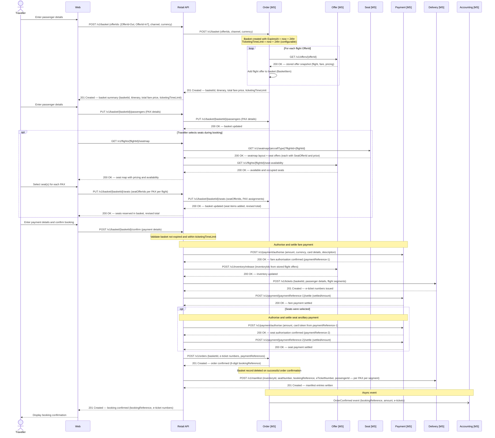

### Ticketing

Ticketing is the process by which a confirmed basket is converted into a legally valid air travel contract. It is triggered by the Retail API immediately after successful payment authorisation and must complete within the same synchronous flow as order confirmation. The e-ticket number is the IATA-standard identifier for this contract and is required before any manifest entries or boarding passes can be issued.

#### What is an E-Ticket?

- An e-ticket (electronic ticket) is the passenger's legal entitlement to travel, replacing the legacy paper ticket
- Each e-ticket covers **one passenger on one flight segment** — a return booking for two passengers generates four e-ticket numbers
- E-ticket numbers follow the IATA format: a **3-digit airline code prefix** followed by a **10-digit serial number**, e.g. `932-1234567890` (Apex Air prefix: `932`)
- E-ticket numbers are issued and owned by the **Delivery microservice**, which is the system of record for all issued tickets
- Once issued, an e-ticket number is immutable — post-booking changes (PAX updates, seat changes) trigger **reissuance** of a new e-ticket number against the same order item, not amendment of the existing one

#### Ticketing Flow

Ticketing occurs as part of the order confirmation sequence, orchestrated by the Retail API after fare payment has been authorised:

- **Pre-ticketing checks** (performed by the Retail API before calling Delivery):
  - Basket is in `Active` status
  - `now < TicketingTimeLimit` — if elapsed, basket must be marked `Expired` and inventory released
  - All stored offers referenced in the basket are unconsumed and not expired
  - Fare payment has been successfully authorised (`paymentReference` held)

- **E-ticket issuance** (Retail API → Delivery MS):
  - Retail API calls `POST /v1/tickets` on the Delivery microservice, passing: basket ID, passenger details, and flight segments
  - Delivery MS generates one e-ticket number per passenger per flight segment
  - E-ticket numbers are returned synchronously to the Retail API

- **Inventory removal** (Retail API → Offer MS):
  - Retail API calls the Offer microservice to decrement `SeatsAvailable` and increment `SeatsSold` for each flight/cabin combination
  - `SeatsHeld` is decremented (seats were held against the basket)
  - This step must complete before order confirmation is written

- **Fare payment settlement** (Retail API → Payment MS):
  - Retail API calls `POST /v1/payment/{paymentReference}/settle` to move the authorised fare payment to `Settled`

- **Order confirmation** (Retail API → Order MS):
  - Retail API calls the Order microservice to convert the basket into a confirmed `order.Order` record
  - Payload includes: basket ID, all e-ticket numbers (per PAX per segment), and all payment references
  - Order MS writes the `order.Order` row with `OrderStatus = Confirmed` and a generated 6-character `BookingReference`
  - Order MS hard-deletes the basket row
  - Order MS publishes `OrderConfirmed` event to the event bus

- **Manifest population** (Retail API → Delivery MS):
  - Retail API calls the Delivery microservice to write one `FlightManifest` row per passenger per segment
  - Delivery MS validates each seat number against the active seatmap before writing (calls Seat MS)

- **Ancillary settlement** (if seats were pre-selected):
  - After the manifest is written, Retail API calls `POST /v1/payment/{paymentReference}/settle` for the seat ancillary payment reference
  - This is settled after fare settlement — the two are independent payment transactions

#### Reissuance

E-tickets must be reissued (new number generated, old number voided) in the following scenarios:

- **PAX name correction** — name changes invalidate the existing ticket as the passenger name is encoded in the BCBP barcode string
- **Seat change post-booking** — seat number is encoded on the boarding pass; if the e-ticket record references a specific seat, reissuance ensures consistency
- **Schedule change by the airline** — if the operating flight details change materially (departure time, routing), affected tickets are reissued

Reissuance is always performed by the Delivery microservice. The Order microservice is updated with the new e-ticket numbers via the Retail API orchestration layer, and new manifest entries replace the previous ones.

#### Failure Handling

Ticketing involves multiple sequential calls; partial failures must be handled explicitly:

| Failure point | Behaviour |
|---|---|
| Delivery MS fails to issue tickets | Abort — do not settle payment, do not confirm order; return error to channel |
| Offer MS fails to remove inventory | Retry up to 3 times; if still failing, void payment authorisation and return error |
| Payment settlement fails after inventory removed | Flag order for manual reconciliation; order is not confirmed until settlement succeeds |
| Order MS fails to confirm | Attempt compensation: void payment, reinstate inventory, void e-tickets; alert ops team if compensation also fails |

> All state-changing steps should be logged with sufficient detail to support manual reconciliation in the event of a partial failure that cannot be automatically compensated.

### Data Schema — Order

The Order domain owns three structures in the Order DB: the `Basket` tables (transient pre-sale state), the `Order` table (confirmed post-sale state), and the `BasketConfig` table (system configuration for expiry and ticketing time limits).

#### Basket

The basket is the in-progress accumulation of everything a traveller has selected before payment. It is created when a purchase journey begins and holds flight offers, seat offers, passenger details, and payment intent. It deliberately contains no PNR, booking reference, or e-ticket numbers — these do not exist until the sale completes. On successful order confirmation the basket row is hard-deleted. If the basket is abandoned or the ticketing time limit elapses without payment, the basket is marked `Expired` and held inventory is released by a background cleanup job.

The `BasketData` column holds the full basket state as a JSON document. Scalar fields used for indexed lookups and lifecycle management are stored as typed columns.

```sql
-- order.BasketConfig
-- System-wide configurable defaults for basket lifecycle.
-- A single active row defines the current defaults; rows are never deleted, only superseded.
CREATE TABLE order.BasketConfig (
    BasketConfigId        UNIQUEIDENTIFIER  NOT NULL DEFAULT NEWID() PRIMARY KEY,
    BasketExpiryHours     SMALLINT          NOT NULL DEFAULT 24,    -- hours until an unpaid basket is expired
    TicketingTimeLimitHours SMALLINT        NOT NULL DEFAULT 24,    -- hours from basket creation within which ticketing must complete
    IsActive              BIT               NOT NULL DEFAULT 1,
    CreatedAt             DATETIME2         NOT NULL DEFAULT SYSUTCDATETIME(),
    Notes                 VARCHAR(255)      NULL                    -- e.g. 'Reduced to 2hr for peak season test'
);

-- Only one active config at a time
CREATE UNIQUE INDEX IX_BasketConfig_Active
    ON order.BasketConfig (IsActive)
    WHERE IsActive = 1;

-- order.Basket
-- One row per in-progress purchase journey. Created when the traveller begins checkout.
-- Deleted immediately on successful order confirmation.
-- Marked Expired by background job if ExpiresAt or TicketingTimeLimit elapses without payment.
CREATE TABLE order.Basket (
    BasketId              UNIQUEIDENTIFIER  NOT NULL DEFAULT NEWID() PRIMARY KEY,
    ChannelCode           VARCHAR(20)       NOT NULL,               -- WEB | APP | NDC | KIOSK | CC | AIRPORT
    CurrencyCode          CHAR(3)           NOT NULL DEFAULT 'GBP',
    BasketStatus          VARCHAR(20)       NOT NULL DEFAULT 'Active',
                                                                    -- Active | Expired | Abandoned | Confirmed
    TotalFareAmount       DECIMAL(10,2)     NULL,                   -- sum of flight offer prices; updated as basket is built
    TotalSeatAmount       DECIMAL(10,2)     NULL DEFAULT 0.00,      -- sum of seat offer prices; updated as seats are added
    TotalAmount           DECIMAL(10,2)     NULL,                   -- TotalFareAmount + TotalSeatAmount
    ExpiresAt             DATETIME2         NOT NULL,               -- basket hard expiry: now + BasketExpiryHours
    TicketingTimeLimit    DATETIME2         NOT NULL,               -- must ticket by this time: now + TicketingTimeLimitHours
    ConfirmedOrderId      UNIQUEIDENTIFIER  NULL,                   -- set on confirmation; FK to order.Order
    CreatedAt             DATETIME2         NOT NULL DEFAULT SYSUTCDATETIME(),
    UpdatedAt             DATETIME2         NOT NULL DEFAULT SYSUTCDATETIME(),
    BasketData            NVARCHAR(MAX)     NOT NULL                -- JSON: full basket document (see below)

    CONSTRAINT CHK_BasketData CHECK (ISJSON(BasketData) = 1)
);

CREATE INDEX IX_Basket_Status_Expiry
    ON order.Basket (BasketStatus, ExpiresAt)
    WHERE BasketStatus = 'Active';   -- used by background expiry job

CREATE INDEX IX_Basket_TicketingTimeLimit
    ON order.Basket (TicketingTimeLimit)
    WHERE BasketStatus = 'Active';   -- used to flag baskets approaching TTL
```

**Example `BasketData` JSON document**

The JSON captures the full in-progress state. It mirrors the eventual shape of `OrderData` for passengers and flight segments, but uses `offerSnapshots` rather than confirmed order items, and has no `eTickets`, booking reference, or payment settlement data.

```json
{
  "channel": "WEB",
  "currency": "GBP",
  "ticketingTimeLimit": "2025-06-02T10:30:00Z",
  "passengers": [
    {
      "passengerId": "PAX-1",
      "type": "ADT",
      "givenName": "Alex",
      "surname": "Taylor",
      "dateOfBirth": "1985-03-12",
      "gender": "Male",
      "loyaltyNumber": "AX9876543",
      "contacts": {
        "email": "alex.taylor@example.com",
        "phone": "+447700900100"
      },
      "travelDocument": {
        "type": "PASSPORT",
        "number": "PA1234567",
        "issuingCountry": "GBR",
        "expiryDate": "2030-01-01",
        "nationality": "GBR"
      }
    },
    {
      "passengerId": "PAX-2",
      "type": "ADT",
      "givenName": "Jordan",
      "surname": "Taylor",
      "dateOfBirth": "1987-07-22",
      "gender": "Female",
      "loyaltyNumber": null,
      "contacts": null,
      "travelDocument": null
    }
  ],
  "flightOffers": [
    {
      "basketItemId": "BI-1",
      "offerId": "3fa85f64-5717-4562-b3fc-2c963f66afa6",
      "flightNumber": "AX003",
      "origin": "LHR",
      "destination": "JFK",
      "departureDateTime": "2025-08-15T11:00:00Z",
      "arrivalDateTime": "2025-08-15T14:10:00Z",
      "aircraftType": "A351",
      "cabinCode": "J",
      "bookingClass": "J",
      "fareBasisCode": "JFLEXGB",
      "fareFamily": "Business Flex",
      "passengerRefs": ["PAX-1", "PAX-2"],
      "unitPrice": 350.00,
      "taxes": 87.25,
      "totalPrice": 437.25,
      "isRefundable": true,
      "isChangeable": true,
      "offerExpiresAt": "2025-06-01T11:00:00Z"
    },
    {
      "basketItemId": "BI-2",
      "offerId": "7cb87a21-1234-4abc-9def-1a2b3c4d5e6f",
      "flightNumber": "AX004",
      "origin": "JFK",
      "destination": "LHR",
      "departureDateTime": "2025-08-25T22:00:00Z",
      "arrivalDateTime": "2025-08-26T10:15:00Z",
      "aircraftType": "A351",
      "cabinCode": "J",
      "bookingClass": "J",
      "fareBasisCode": "JFLEXGB",
      "fareFamily": "Business Flex",
      "passengerRefs": ["PAX-1", "PAX-2"],
      "unitPrice": 350.00,
      "taxes": 87.25,
      "totalPrice": 437.25,
      "isRefundable": true,
      "isChangeable": true,
      "offerExpiresAt": "2025-06-01T11:00:00Z"
    }
  ],
  "seatOffers": [
    {
      "basketItemId": "BI-3",
      "seatOfferId": "so-a351-1A-v1",
      "basketItemRef": "BI-1",
      "passengerRef": "PAX-1",
      "seatNumber": "1A",
      "seatPosition": "Window",
      "cabinCode": "J",
      "price": 0.00,
      "currency": "GBP",
      "note": "Business Class — no charge"
    },
    {
      "basketItemId": "BI-4",
      "seatOfferId": "so-a351-11A-v1",
      "basketItemRef": "BI-1",
      "passengerRef": "PAX-2",
      "seatNumber": "11A",
      "seatPosition": "Window",
      "cabinCode": "W",
      "price": 70.00,
      "currency": "GBP"
    }
  ],
  "paymentIntent": {
    "method": "CreditCard",
    "cardType": "Visa",
    "cardLast4": "4242",
    "totalFareAmount": 1749.00,
    "totalSeatAmount": 70.00,
    "grandTotal": 1819.00,
    "currency": "GBP",
    "status": "PendingAuthorisation"
  },
  "history": [
    { "event": "BasketCreated",          "at": "2025-06-01T10:30:00Z", "by": "WEB" },
    { "event": "PassengersAdded",        "at": "2025-06-01T10:31:00Z", "by": "WEB" },
    { "event": "SeatsAdded",             "at": "2025-06-01T10:32:00Z", "by": "WEB" },
    { "event": "PaymentIntentRecorded",  "at": "2025-06-01T10:33:00Z", "by": "WEB" }
  ]
}
```

> **Ticketing time limit:** The `TicketingTimeLimit` is set at basket creation from the active `BasketConfig` row and is included in the basket summary returned to the channel so it can display a countdown to the traveller. The Retail API must validate that `now < TicketingTimeLimit` before attempting authorisation. If the limit has elapsed, the basket must be marked `Expired`, inventory released, and the traveller directed to start a new search.

> **Basket expiry job:** A background process runs on a schedule (e.g. every 5 minutes) and queries `order.Basket WHERE BasketStatus = 'Active' AND ExpiresAt <= now`. For each expired basket it sets `BasketStatus = 'Expired'` and fires a compensating call to the Offer microservice to release any held inventory. Expired baskets are retained for a short period (e.g. 7 days) for diagnostic purposes before being purged.

> **Basket deletion on sale:** When the Retail API receives a successful order confirmation response from the Order microservice, it immediately issues a hard delete of the basket row. The confirmed `OrderData` JSON is the authoritative post-sale record; the basket is no longer needed.

#### Order

The `Order` table is written once the basket has been confirmed — payment taken, inventory removed, and e-tickets issued. It follows the IATA ONE Order model. The `Order` table holds scalar fields used for querying, routing, reporting, and event publishing. The full order detail — passengers, flight segments, order items, fares, seat assignments, e-tickets, payments, and audit history — is stored as a JSON document in the `OrderData` column. Fields that exist as typed columns on the table (such as `OrderId`, `BookingReference`, `OrderStatus`, `ChannelCode`, `CurrencyCode`, and `TotalAmount`) are intentionally excluded from the JSON document to avoid duplication.

```sql
-- order.Order
-- Root order record. OrderData holds the full ONE Order document as JSON.
-- Scalar fields used for indexed lookups, routing, and eventing are stored as columns.
-- Fields present as columns are NOT duplicated inside OrderData.
CREATE TABLE order.Order (
    OrderId           UNIQUEIDENTIFIER  NOT NULL DEFAULT NEWID() PRIMARY KEY,
    BookingReference  CHAR(6)           NULL,        -- populated on confirmation, e.g. AB1234
    OrderStatus       VARCHAR(20)       NOT NULL DEFAULT 'Draft',
                                                     -- Draft | Confirmed | Changed | Cancelled
    ChannelCode       VARCHAR(20)       NOT NULL,    -- WEB | APP | NDC | KIOSK | CC | AIRPORT
    CurrencyCode      CHAR(3)           NOT NULL DEFAULT 'GBP',
    TotalAmount       DECIMAL(10,2)     NULL,
    CreatedAt         DATETIME2         NOT NULL DEFAULT SYSUTCDATETIME(),
    UpdatedAt         DATETIME2         NOT NULL DEFAULT SYSUTCDATETIME(),
    OrderData         NVARCHAR(MAX)     NOT NULL     -- JSON: full ONE Order document (see below)

    CONSTRAINT CHK_OrderData CHECK (ISJSON(OrderData) = 1)
);

CREATE UNIQUE INDEX IX_Order_BookingReference
    ON order.Order (BookingReference)
    WHERE BookingReference IS NOT NULL;
```

**Example `OrderData` JSON document**

The JSON structure is aligned to IATA ONE Order concepts. Scalar identifiers and status fields that exist as typed columns on the `order.Order` table (`orderId`, `bookingReference`, `orderStatus`, `channel`, `currency`, `totalAmount`, `createdAt`) are excluded from the JSON document — the table columns are the single source of truth for those values. The JSON carries the relational detail: passengers, flight segments, order items, payments, and audit history.

```json
{
  "dataLists": {
    "passengers": [
      {
        "passengerId": "PAX-1",
        "type": "ADT",
        "givenName": "Alex",
        "surname": "Taylor",
        "dateOfBirth": "1985-03-12",
        "gender": "Male",
        "loyaltyNumber": "AX9876543",
        "contacts": {
          "email": "alex.taylor@example.com",
          "phone": "+447700900100"
        },
        "travelDocument": {
          "type": "PASSPORT",
          "number": "PA1234567",
          "issuingCountry": "GBR",
          "expiryDate": "2030-01-01",
          "nationality": "GBR"
        }
      },
      {
        "passengerId": "PAX-2",
        "type": "ADT",
        "givenName": "Jordan",
        "surname": "Taylor",
        "dateOfBirth": "1987-07-22",
        "gender": "Female",
        "loyaltyNumber": null,
        "contacts": null,
        "travelDocument": {
          "type": "PASSPORT",
          "number": "PA7654321",
          "issuingCountry": "GBR",
          "expiryDate": "2028-06-30",
          "nationality": "GBR"
        }
      }
    ],
    "flightSegments": [
      {
        "segmentId": "SEG-1",
        "flightNumber": "AX003",
        "origin": "LHR",
        "destination": "JFK",
        "departureDateTime": "2025-08-15T11:00:00Z",
        "arrivalDateTime": "2025-08-15T14:10:00Z",
        "aircraftType": "A351",
        "operatingCarrier": "AX",
        "marketingCarrier": "AX",
        "cabinCode": "J",
        "bookingClass": "J"
      },
      {
        "segmentId": "SEG-2",
        "flightNumber": "AX004",
        "origin": "JFK",
        "destination": "LHR",
        "departureDateTime": "2025-08-25T22:00:00Z",
        "arrivalDateTime": "2025-08-26T10:15:00Z",
        "aircraftType": "A351",
        "operatingCarrier": "AX",
        "marketingCarrier": "AX",
        "cabinCode": "J",
        "bookingClass": "J"
      }
    ]
  },
  "orderItems": [
    {
      "orderItemId": "OI-1",
      "type": "Flight",
      "segmentRef": "SEG-1",
      "passengerRefs": ["PAX-1", "PAX-2"],
      "offerId": "3fa85f64-5717-4562-b3fc-2c963f66afa6",
      "fareBasisCode": "JFLEXGB",
      "fareFamily": "Business Flex",
      "unitPrice": 350.00,
      "taxes": 87.25,
      "totalPrice": 437.25,
      "isRefundable": true,
      "isChangeable": true,
      "paymentReference": "AXPAY-0001",
      "eTickets": [
        { "passengerId": "PAX-1", "eTicketNumber": "932-1234567890" },
        { "passengerId": "PAX-2", "eTicketNumber": "932-1234567891" }
      ],
      "seatAssignments": [
        { "passengerId": "PAX-1", "seatNumber": "1A" },
        { "passengerId": "PAX-2", "seatNumber": "1D" }
      ]
    },
    {
      "orderItemId": "OI-2",
      "type": "Flight",
      "segmentRef": "SEG-2",
      "passengerRefs": ["PAX-1", "PAX-2"],
      "offerId": "7cb87a21-1234-4abc-9def-1a2b3c4d5e6f",
      "fareBasisCode": "JFLEXGB",
      "fareFamily": "Business Flex",
      "unitPrice": 350.00,
      "taxes": 87.25,
      "totalPrice": 437.25,
      "isRefundable": true,
      "isChangeable": true,
      "paymentReference": "AXPAY-0001",
      "eTickets": [
        { "passengerId": "PAX-1", "eTicketNumber": "932-1234567892" },
        { "passengerId": "PAX-2", "eTicketNumber": "932-1234567893" }
      ],
      "seatAssignments": [
        { "passengerId": "PAX-1", "seatNumber": "2A" },
        { "passengerId": "PAX-2", "seatNumber": "2D" }
      ]
    },
    {
      "orderItemId": "OI-3",
      "type": "Seat",
      "segmentRef": "SEG-1",
      "passengerRefs": ["PAX-1"],
      "offerId": "a1b2c3d4-seat-4562-b3fc-000000000001",
      "seatNumber": "1A",
      "seatPosition": "Window",
      "unitPrice": 70.00,
      "taxes": 0.00,
      "totalPrice": 70.00,
      "paymentReference": "AXPAY-0002"
    },
    {
      "orderItemId": "OI-4",
      "type": "Seat",
      "segmentRef": "SEG-1",
      "passengerRefs": ["PAX-2"],
      "offerId": "a1b2c3d4-seat-4562-b3fc-000000000002",
      "seatNumber": "1D",
      "seatPosition": "Middle",
      "unitPrice": 20.00,
      "taxes": 0.00,
      "totalPrice": 20.00,
      "paymentReference": "AXPAY-0002"
    }
  ],
  "payments": [
    {
      "paymentReference": "AXPAY-0001",
      "description": "Fare — LHR-JFK-LHR, 2 PAX",
      "method": "CreditCard",
      "cardLast4": "4242",
      "cardType": "Visa",
      "authorisedAmount": 1749.00,
      "settledAmount": 1749.00,
      "currency": "GBP",
      "status": "Settled",
      "authorisedAt": "2025-06-01T10:31:00Z",
      "settledAt": "2025-06-01T10:32:00Z"
    },
    {
      "paymentReference": "AXPAY-0002",
      "description": "Seat ancillary — SEG-1, PAX-1 seat 1A, PAX-2 seat 1D",
      "method": "CreditCard",
      "cardLast4": "4242",
      "cardType": "Visa",
      "authorisedAmount": 90.00,
      "settledAmount": 90.00,
      "currency": "GBP",
      "status": "Settled",
      "authorisedAt": "2025-06-01T10:31:30Z",
      "settledAt": "2025-06-01T10:32:30Z"
    }
  ],
  "history": [
    { "event": "OrderCreated",   "at": "2025-06-01T10:30:00Z", "by": "WEB" },
    { "event": "OrderConfirmed", "at": "2025-06-01T10:32:00Z", "by": "WEB" }
  ]
}
```

-----

### Manage booking - update PAX details

Allows a traveller to correct or update passenger information on a confirmed booking — such as a name correction, updated passport details, or a change of contact information — triggering e-ticket reissuance where required.

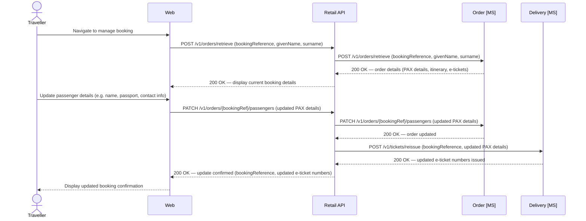

### Manage booking - select or update seat selection

Enables a traveller to choose or change their seat assignment after booking, presenting the live seatmap with real-time availability overlaid, and updating the manifest and e-tickets upon confirmation.

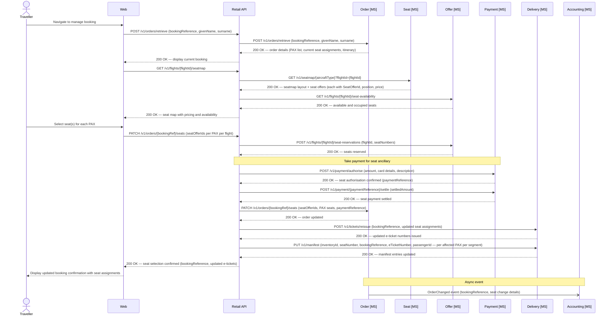

## Payment

### Authorise and Settle

The Payment microservice handles all card authorisation and settlement for Apex Air transactions. A single booking may generate multiple independent payment transactions — fares are authorised and settled during ticketing, while ancillary purchases such as seat selections are authorised and settled as separate transactions. Each transaction is tracked by a unique `PaymentReference`, which is returned to the Retail API and stored against the relevant order items in the Order microservice.

The Payment DB owns the full audit trail of every authorisation and settlement event, making it the system of record for financial transactions independent of the order.

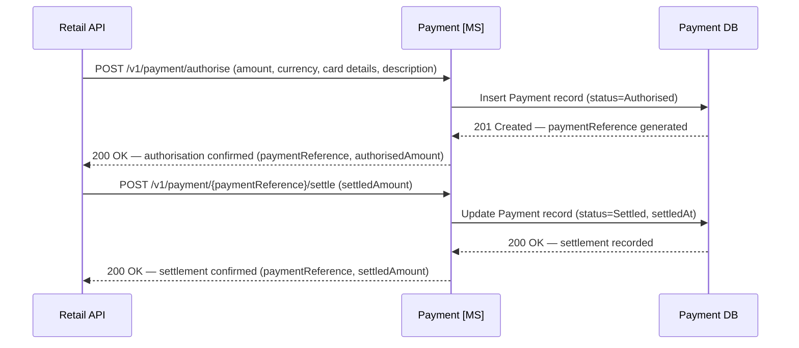

### Data Schema — Payment

The Payment domain uses two tables. `Payment` holds one row per payment transaction, tracking its lifecycle from authorisation through to settlement. `PaymentEvent` records every individual event (authorised, settled, refunded, declined) against a payment as an immutable append-only log, providing a complete audit trail. A single `Payment` may have multiple `PaymentEvent` rows — for example where a partial settlement is followed by a second settlement, or where a refund is issued.

```sql
-- payment.Payment
-- One row per payment transaction. Created at authorisation; updated at settlement.
-- PaymentReference is the external identifier shared with the Order microservice.
CREATE TABLE payment.Payment (
    PaymentId         UNIQUEIDENTIFIER  NOT NULL DEFAULT NEWID() PRIMARY KEY,
    PaymentReference  VARCHAR(20)       NOT NULL UNIQUE,  -- human-readable ref, e.g. AXPAY-0001
    BookingReference  CHAR(6)           NULL,             -- set once order is confirmed; may be null during initial auth
    PaymentType       VARCHAR(30)       NOT NULL,         -- Fare | SeatAncillary | Cancellation | Refund
    Method            VARCHAR(20)       NOT NULL,         -- CreditCard | DebitCard | PayPal | ApplePay
    CardType          VARCHAR(20)       NULL,             -- Visa | Mastercard | Amex | etc.
    CardLast4         CHAR(4)           NULL,             -- last 4 digits only; never store full PAN
    CurrencyCode      CHAR(3)           NOT NULL DEFAULT 'GBP',
    AuthorisedAmount  DECIMAL(10,2)     NOT NULL,
    SettledAmount     DECIMAL(10,2)     NULL,             -- null until settled
    Status            VARCHAR(20)       NOT NULL,         -- Authorised | Settled | PartiallySettled | Refunded | Declined | Voided
    AuthorisedAt      DATETIME2         NOT NULL DEFAULT SYSUTCDATETIME(),
    SettledAt         DATETIME2         NULL,
    Description       VARCHAR(255)      NULL,             -- human-readable description, e.g. 'Fare LHR-JFK-LHR, 2 PAX'
    CreatedAt         DATETIME2         NOT NULL DEFAULT SYSUTCDATETIME(),
    UpdatedAt         DATETIME2         NOT NULL DEFAULT SYSUTCDATETIME()
);

CREATE INDEX IX_Payment_BookingReference
    ON payment.Payment (BookingReference)
    WHERE BookingReference IS NOT NULL;

CREATE INDEX IX_Payment_PaymentReference
    ON payment.Payment (PaymentReference);

-- payment.PaymentEvent
-- Immutable append-only log of every event on a Payment record.
-- Provides full audit trail including partial settlements, refunds, and declines.
CREATE TABLE payment.PaymentEvent (
    PaymentEventId    UNIQUEIDENTIFIER  NOT NULL DEFAULT NEWID() PRIMARY KEY,
    PaymentId         UNIQUEIDENTIFIER  NOT NULL REFERENCES payment.Payment(PaymentId),
    EventType         VARCHAR(20)       NOT NULL,         -- Authorised | Settled | PartialSettlement | Refunded | Declined | Voided
    Amount            DECIMAL(10,2)     NOT NULL,
    CurrencyCode      CHAR(3)           NOT NULL DEFAULT 'GBP',
    Notes             VARCHAR(255)      NULL,             -- optional context, e.g. 'Partial seat refund row 1A'
    CreatedAt         DATETIME2         NOT NULL DEFAULT SYSUTCDATETIME()
);

CREATE INDEX IX_PaymentEvent_PaymentId
    ON payment.PaymentEvent (PaymentId);
```

> **PaymentReference format:** `PaymentReference` values follow the format `AXPAY-{sequence}` (e.g. `AXPAY-0001`). The sequence is generated by the Payment microservice at authorisation time and is guaranteed unique within the system. This reference is passed back to the Retail API and stored on each `orderItem` in `OrderData`, linking financial records to the order line items they cover.

> **PCI DSS:** Full card numbers, CVV codes, and raw processor tokens must never be stored in the Payment DB. Only `CardLast4` and `CardType` are retained. The payment processor token used during the transaction lifetime is held in memory only and discarded after settlement.

## Delivery

### Online Check In

Allows a traveller to check in for their flight from 24 hours before departure, confirming or updating travel document details for each passenger and receiving boarding cards upon completion.

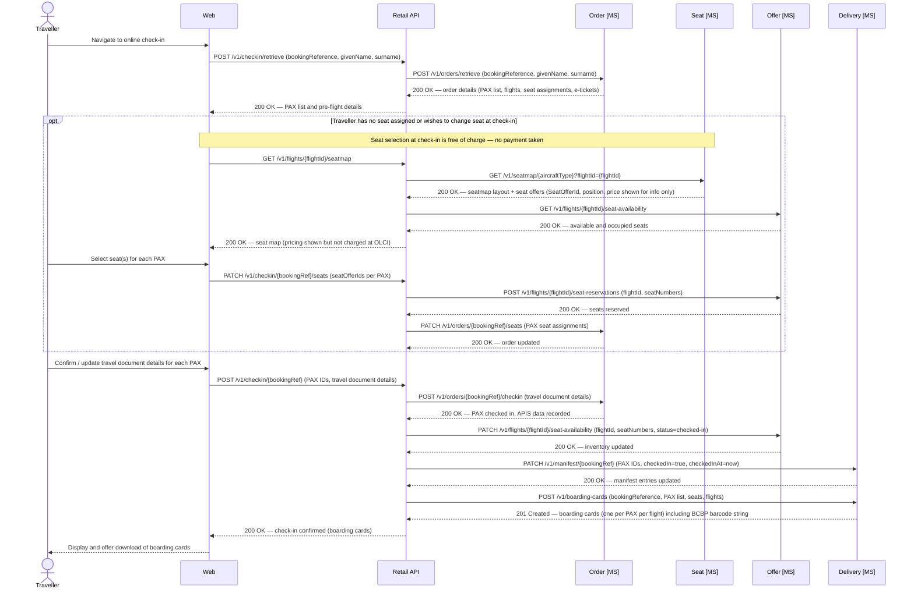

### Boarding Pass Barcode String

Each boarding card issued by the Delivery microservice includes a barcode string compliant with **IATA Resolution 792** (Bar Coded Boarding Pass — BCBP). This string is used directly to generate the physical barcode on printed boarding passes and the QR code displayed in the mobile app. Both formats encode identical data; the presentation layer determines the rendering.

The format is a structured plaintext string with fixed-width and positional fields. An example for a single-leg boarding pass:

```
M1TAYLOR/ALEX        EAB1234 LHRJFKAX 0003 042J001A0001 156>518 W6042 AX 2A00000012345678 JAX7KLP2NZR901A
```

The fields break down as follows:

| Segment | Value in example | Description |
|---|---|---|
| `M1` | `M1` | Format code (`M`) + number of legs encoded (`1`) |
| `TAYLOR/ALEX` | `TAYLOR/ALEX` | Passenger name — surname / given name, padded to 20 chars |
| `EAB1234` | `EAB1234` | Electronic ticket indicator (`E`) + PNR / booking reference |
| `LHR` | `LHR` | Origin IATA airport code |
| `JFK` | `JFK` | Destination IATA airport code |
| `AX` | `AX` | Operating carrier IATA code (Apex Air) |
| `0003` | `0003` | Flight number, padded to 4 chars |
| `042` | `042` | Julian date of flight departure |
| `J` | `J` | Cabin / booking class code |
| `001A` | `001A` | Seat number, padded to 4 chars |
| `0001` | `0001` | Sequence / check-in number |
| `1` | `1` | Passenger status code (`1` = checked in) |
| `56>518` | `56>518` | Conditional item size indicator and version number (BCBP version 6) |
| `W6042` | `W6042` | Julian date of issue + ticket issuer code |
| `AX` | `AX` | Operating carrier for this leg (repeated in conditional section) |
| `2A00000012345678` | `2A00000012345678` | Frequent flyer / loyalty number |
| `JAX7KLP2NZR901A` | `JAX7KLP2NZR901A` | Airline-specific free-text data (selectee indicator, document verification, etc.) |

The Delivery microservice is responsible for assembling this string at the point of boarding card generation, drawing on data from the `FlightManifest` row and the confirmed order. The barcode string is returned in the boarding card payload alongside human-readable fields; channels render it using their preferred barcode library (e.g. PDF417 for print, QR for mobile).

### Data Schema — Delivery

The Delivery domain owns its own `Delivery DB` and is the system of record for who is on each flight and where they are sitting. The `FlightManifest` table holds one row per passenger per flight segment, populated at the point of booking confirmation and updated whenever a seat is changed post-purchase. It provides a clean, queryable view of the passenger load for a given flight — used for gate management, check-in verification, IROPS, and regulatory APIS submissions.

Seat number integrity is enforced at the application layer: before any insert or update, the Delivery microservice calls the Seat microservice to validate that the given `SeatNumber` exists on the active seatmap for the relevant aircraft type. Rows may not be written with a seat number that does not appear in the seatmap definition. This prevents manifest corruption from downstream data entry errors or stale seat references.

```sql
-- delivery.FlightManifest
-- One row per passenger per flight segment. Written at booking confirmation;
-- updated on any post-purchase seat change. SeatNumber must be a valid seat
-- from the active seatmap for the aircraft type — validated at application layer
-- before insert or update.
CREATE TABLE delivery.FlightManifest (
    ManifestId        UNIQUEIDENTIFIER  NOT NULL DEFAULT NEWID() PRIMARY KEY,
    InventoryId       UNIQUEIDENTIFIER  NOT NULL,               -- FK ref to offer.FlightInventory (cross-schema; not enforced as DB constraint)
    FlightNumber      VARCHAR(10)       NOT NULL,               -- denormalised for query convenience, e.g. AX003
    DepartureDate     DATE              NOT NULL,               -- denormalised for query convenience
    AircraftType      CHAR(4)           NOT NULL,               -- used for seatmap validation at write time
    SeatNumber        VARCHAR(5)        NOT NULL,               -- e.g. 1A, 22K — must exist on active seatmap for AircraftType
    CabinCode         CHAR(1)           NOT NULL,               -- F, J, W, Y
    BookingReference  CHAR(6)           NOT NULL,               -- e.g. AB1234
    ETicketNumber     VARCHAR(20)       NOT NULL,               -- e.g. 932-1234567890
    PassengerId       VARCHAR(20)       NOT NULL,               -- PAX reference from the order, e.g. PAX-1
    GivenName         VARCHAR(100)      NOT NULL,               -- denormalised for manifest readability
    Surname           VARCHAR(100)      NOT NULL,               -- denormalised for manifest readability
    CheckedIn         BIT               NOT NULL DEFAULT 0,
    CheckedInAt       DATETIME2         NULL,
    CreatedAt         DATETIME2         NOT NULL DEFAULT SYSUTCDATETIME(),
    UpdatedAt         DATETIME2         NOT NULL DEFAULT SYSUTCDATETIME()
);

-- Unique constraint: one seat per flight per manifest (prevents double-assignment)
CREATE UNIQUE INDEX IX_FlightManifest_Seat
    ON delivery.FlightManifest (InventoryId, SeatNumber);

-- Unique constraint: one manifest entry per PAX per flight
CREATE UNIQUE INDEX IX_FlightManifest_Pax
    ON delivery.FlightManifest (InventoryId, ETicketNumber);

-- Index to support fast flight-level manifest retrieval (gate staff, IROPS)
CREATE INDEX IX_FlightManifest_Flight
    ON delivery.FlightManifest (FlightNumber, DepartureDate);

-- Index to support lookup by booking reference (customer servicing, check-in)
CREATE INDEX IX_FlightManifest_BookingReference
    ON delivery.FlightManifest (BookingReference);
```

> **Cross-schema integrity:** `InventoryId` references `offer.FlightInventory` but is not declared as a foreign key, as the Delivery and Offer domains are logically separated (and would be physically separated in a fully isolated deployment). Referential integrity between these schemas is the responsibility of the Retail API orchestration layer, which controls the write sequence.

> **Seatmap validation:** The Delivery microservice must call `GET /v1/seatmap/{aircraftType}` on the Seat microservice and confirm the `SeatNumber` exists in the returned cabin layout before writing any `FlightManifest` row. If the seat is not present on the active seatmap, the write must be rejected with an appropriate error. This check applies to both initial inserts (at booking confirmation) and updates (at seat changes).

## Seat

### Retrieve Seatmap and Seat Offers

The Seat microservice is the system of record for aircraft seatmap definitions and fleet-wide seat pricing. It provides the physical layout, seat attributes (class, position, extra legroom, etc.), cabin configuration, and the seat offer price for each position type. Seat prices are defined fleet-wide by position — not per flight — and apply uniformly across Premium Economy and Economy cabins. Business Class seat selection is included in the fare and carries no ancillary charge.

Seat prices are:

| Position | Price |
|---|---|
| Window | £70.00 |
| Aisle | £50.00 |
| Middle | £20.00 |

When a channel requests a seatmap, the Seat microservice returns both the layout (consumed by the front-end seat picker) and a `seatOffer` for each selectable seat, containing a `SeatOfferId` and price. The `SeatOfferId` is passed to the Order microservice when a seat is purchased, linking the seat order item to the priced offer. The Seat microservice does **not** manage seat availability or inventory — that remains the responsibility of the Offer microservice.

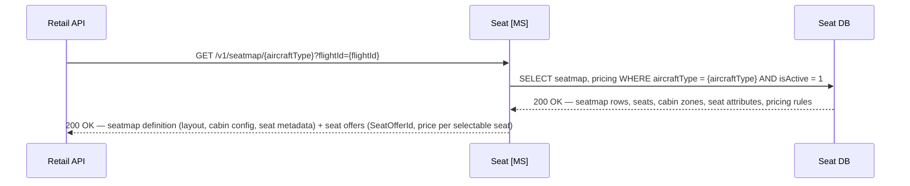

### Data Schema — Seat

The Seat domain uses three tables. `AircraftType` is the root reference record. `Seatmap` holds one row per active aircraft configuration with the full cabin layout as JSON. `SeatPricing` holds the fleet-wide pricing rules by seat position and cabin, from which the Seat microservice derives the `seatOffer` price returned with each seatmap response.

```sql
-- seat.AircraftType
-- Reference table of aircraft types operated by the airline
CREATE TABLE seat.AircraftType (
    AircraftTypeCode  CHAR(4)           NOT NULL PRIMARY KEY,  -- 4-char code: manufacturer prefix + 3-digit variant, e.g. A351 (A350-1000), B789 (B787-900)
    Manufacturer      VARCHAR(50)       NOT NULL,              -- e.g. Airbus, Boeing
    FriendlyName      VARCHAR(100)      NULL,                  -- e.g. Airbus A350-1000, Boeing 787-900
    TotalSeats        SMALLINT          NOT NULL,
    IsActive          BIT               NOT NULL DEFAULT 1
);

-- seat.Seatmap
-- One row per active aircraft configuration. CabinLayout holds the full seatmap as JSON.
CREATE TABLE seat.Seatmap (
    SeatmapId         UNIQUEIDENTIFIER  NOT NULL DEFAULT NEWID() PRIMARY KEY,
    AircraftTypeCode  CHAR(4)           NOT NULL REFERENCES seat.AircraftType(AircraftTypeCode),
    Version           INT               NOT NULL DEFAULT 1,
    IsActive          BIT               NOT NULL DEFAULT 1,
    UpdatedAt         DATETIME2         NOT NULL DEFAULT SYSUTCDATETIME(),
    CabinLayout       NVARCHAR(MAX)     NOT NULL   -- JSON: full cabin and seat definitions (see below)

    CONSTRAINT CHK_CabinLayout CHECK (ISJSON(CabinLayout) = 1)
);

CREATE INDEX IX_Seatmap_AircraftType
    ON seat.Seatmap (AircraftTypeCode)
    WHERE IsActive = 1;

-- seat.SeatPricing
-- Fleet-wide seat pricing rules by cabin and seat position.
-- Applied uniformly across all aircraft and all flights.
-- Business Class (J/F) seats carry no ancillary charge (included in fare).
CREATE TABLE seat.SeatPricing (
    SeatPricingId     UNIQUEIDENTIFIER  NOT NULL DEFAULT NEWID() PRIMARY KEY,
    CabinCode         CHAR(1)           NOT NULL,   -- W (Premium Economy) | Y (Economy)
    SeatPosition      VARCHAR(10)       NOT NULL,   -- Window | Aisle | Middle
    CurrencyCode      CHAR(3)           NOT NULL DEFAULT 'GBP',
    Price             DECIMAL(10,2)     NOT NULL,
    IsActive          BIT               NOT NULL DEFAULT 1,
    ValidFrom         DATETIME2         NOT NULL,
    ValidTo           DATETIME2         NULL,       -- null = open-ended / currently active
    UpdatedAt         DATETIME2         NOT NULL DEFAULT SYSUTCDATETIME()

    CONSTRAINT UQ_SeatPricing_CabinPosition UNIQUE (CabinCode, SeatPosition, CurrencyCode)
);

-- Example seed data (reflecting fleet-wide pricing):
-- ('W', 'Window', 'GBP', 70.00)
-- ('W', 'Aisle',  'GBP', 50.00)
-- ('W', 'Middle', 'GBP', 20.00)
-- ('Y', 'Window', 'GBP', 70.00)
-- ('Y', 'Aisle',  'GBP', 50.00)
-- ('Y', 'Middle', 'GBP', 20.00)
```

> **Seat offer generation:** When building the seatmap response, the Seat microservice joins each seat's `position` attribute against `seat.SeatPricing` for the relevant `cabinCode` to derive the price, then generates a `SeatOfferId` (a deterministic UUID based on `SeatmapId` + `SeatNumber` + current pricing version) for each selectable seat. These `SeatOfferIds` are short-lived in the same way as flight `OfferIds` — they should be treated as valid only for the duration of the current session. The Order microservice stores the `SeatOfferId` on the seat order item for traceability.

**Example `CabinLayout` JSON document**

The JSON is structured as an ordered array of cabins, each containing a column configuration and an array of rows. Each seat carries its label, position, physical attributes, and a `seatPrice` derived from `seat.SeatPricing` at the time of seatmap generation. Business Class seats carry a `seatPrice` of `null` as selection is included in the fare. This structure is consumed directly by the front-end seat picker UI, which overlays real-time availability from the Offer microservice at query time.

```json
{
  "aircraftType": "A351",
  "version": 1,
  "totalSeats": 258,
  "cabins": [
    {
      "cabinCode": "J",
      "cabinName": "Business Class",
      "deckLevel": "Main",
      "startRow": 1,
      "endRow": 8,
      "columns": ["A", "D", "G", "K"],
      "layout": "1-1-1-1",
      "rows": [
        {
          "rowNumber": 1,
          "seats": [
            {
              "seatNumber": "1A",
              "column": "A",
              "type": "Suite",
              "position": "Window",
              "attributes": ["ExtraLegroom", "BlockedForCrew"],
              "isSelectable": false
            },
            {
              "seatNumber": "1D",
              "column": "D",
              "type": "Suite",
              "position": "Middle",
              "attributes": ["ExtraLegroom"],
              "isSelectable": true
            },
            {
              "seatNumber": "1G",
              "column": "G",
              "type": "Suite",
              "position": "Middle",
              "attributes": ["ExtraLegroom"],
              "isSelectable": true
            },
            {
              "seatNumber": "1K",
              "column": "K",
              "type": "Suite",
              "position": "Window",
              "attributes": ["ExtraLegroom"],
              "isSelectable": true
            }
          ]
        }
      ]
    },
    {
      "cabinCode": "W",
      "cabinName": "Premium Economy",
      "deckLevel": "Main",
      "startRow": 11,
      "endRow": 18,
      "columns": ["A", "B", "D", "E", "F", "H", "K"],
      "layout": "2-3-2",
      "rows": [
        {
          "rowNumber": 11,
          "seats": [
            {
              "seatNumber": "11A",
              "column": "A",
              "type": "Standard",
              "position": "Window",
              "attributes": ["ExtraLegroom"],
              "isSelectable": true
            },
            {
              "seatNumber": "11B",
              "column": "B",
              "type": "Standard",
              "position": "Aisle",
              "attributes": ["ExtraLegroom"],
              "isSelectable": true
            },
            {
              "seatNumber": "11D",
              "column": "D",
              "type": "Standard",
              "position": "Aisle",
              "attributes": ["ExtraLegroom"],
              "isSelectable": true
            },
            {
              "seatNumber": "11E",
              "column": "E",
              "type": "Standard",
              "position": "Middle",
              "attributes": ["ExtraLegroom"],
              "isSelectable": true
            },
            {
              "seatNumber": "11F",
              "column": "F",
              "type": "Standard",
              "position": "Aisle",
              "attributes": ["ExtraLegroom"],
              "isSelectable": true
            },
            {
              "seatNumber": "11H",
              "column": "H",
              "type": "Standard",
              "position": "Aisle",
              "attributes": ["ExtraLegroom"],
              "isSelectable": true
            },
            {
              "seatNumber": "11K",
              "column": "K",
              "type": "Standard",
              "position": "Window",
              "attributes": ["ExtraLegroom"],
              "isSelectable": true
            }
          ]
        }
      ]
    },
    {
      "cabinCode": "Y",
      "cabinName": "Economy",
      "deckLevel": "Main",
      "startRow": 22,
      "endRow": 54,
      "columns": ["A", "B", "C", "D", "E", "F", "G", "H", "K"],
      "layout": "3-3-3",
      "rows": [
        {
          "rowNumber": 22,
          "seats": [
            {
              "seatNumber": "22A",
              "column": "A",
              "type": "Standard",
              "position": "Window",
              "attributes": ["ExtraLegroom"],
              "isSelectable": true
            },
            {
              "seatNumber": "22B",
              "column": "B",
              "type": "Standard",
              "position": "Middle",
              "attributes": ["ExtraLegroom"],
              "isSelectable": true
            },
            {
              "seatNumber": "22C",
              "column": "C",
              "type": "Standard",
              "position": "Aisle",
              "attributes": ["ExtraLegroom"],
              "isSelectable": true
            },
            {
              "seatNumber": "22D",
              "column": "D",
              "type": "Standard",
              "position": "Aisle",
              "attributes": ["ExtraLegroom"],
              "isSelectable": true
            },
            {
              "seatNumber": "22E",
              "column": "E",
              "type": "Standard",
              "position": "Middle",
              "attributes": ["ExtraLegroom"],
              "isSelectable": true
            },
            {
              "seatNumber": "22F",
              "column": "F",
              "type": "Standard",
              "position": "Aisle",
              "attributes": ["ExtraLegroom"],
              "isSelectable": true
            },
            {
              "seatNumber": "22G",
              "column": "G",
              "type": "Standard",
              "position": "Aisle",
              "attributes": ["ExtraLegroom"],
              "isSelectable": true
            },
            {
              "seatNumber": "22H",
              "column": "H",
              "type": "Standard",
              "position": "Middle",
              "attributes": ["ExtraLegroom"],
              "isSelectable": true
            },
            {
              "seatNumber": "22K",
              "column": "K",
              "type": "Standard",
              "position": "Window",
              "attributes": ["ExtraLegroom"],
              "isSelectable": true
            }
          ]
        }
      ]
    }
  ]
}
```

> **Note:** `isSelectable` reflects whether a seat is physically available for selection (i.e. not a structural no-fly zone, crew seat, or permanently blocked position). Real-time occupancy — whether a seat has been sold or held on a specific flight — is overlaid at query time from `offer.FlightInventory` and is never stored here.

## Customer

The Customer microservice is the system of record for customer accounts and loyalty programme membership. Each account holds the customer's profile, tier status, current points balance, and a full transaction history of points earned and redeemed. Accounts are identified by a unique loyalty number issued at registration.

Authentication credentials (email address and password) are owned by a separate **Identity microservice** with its own Identity DB. The Customer DB holds only an `IdentityReference` — the opaque identifier that links a Customer record to its corresponding Identity account. This separation means the Customer microservice never handles credentials directly, and the Identity microservice never holds loyalty or profile data.

### Register for the Loyalty Programme

A new customer registers for the Apex Air loyalty programme via the web. Registration creates two linked records: a login account in the Identity microservice (which owns the email and password), and a loyalty account in the Customer microservice (which owns the profile and points balance). The two are joined by an `IdentityReference` UUID, which the Identity microservice generates and passes back so the Loyalty API can store it on the Customer record.

On successful registration the customer receives a unique loyalty number and is automatically assigned to the base tier (`Blue`). A confirmation email is triggered from the Loyalty API once both records are created.

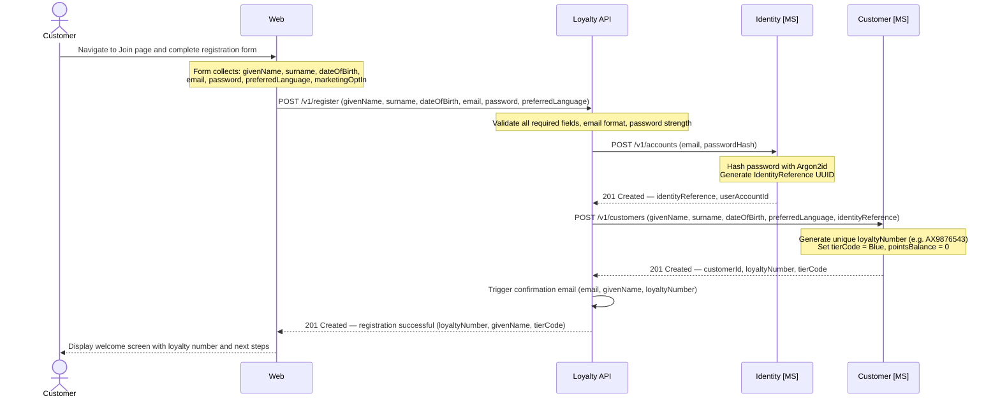

> **Email verification:** The `IsEmailVerified` flag on `identity.UserAccount` is set to `0` at registration. The confirmation email contains a one-time verification link. On click, a separate `POST /v1/accounts/{userAccountId}/verify-email` call is made to the Identity microservice to set `IsEmailVerified = 1`. Unverified accounts may still log in but are restricted from certain actions (e.g. redemptions) until verified.

> **Duplicate email handling:** The Identity microservice enforces a unique constraint on `Email`. If a registration attempt arrives for an address that already exists, the Identity microservice returns `409 Conflict`. The Loyalty API surfaces this as a validation error to the channel — it must not reveal whether the email belongs to an existing account (to prevent account enumeration).

> **Failure handling:** If the Identity microservice call succeeds but the subsequent Customer microservice call fails, the Loyalty API must call `DELETE /v1/accounts/{userAccountId}` on the Identity microservice to clean up the orphaned login account before returning an error to the channel. Partial registration states must not be left in the system.

### Retrieve Account and Points Balance

A traveller retrieves their account details and current points balance — used on the loyalty dashboard and during booking to display available points.

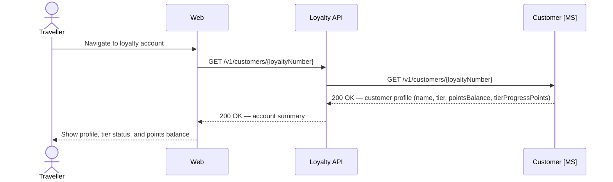

---

### Retrieve Transaction History

Returns the full ordered list of points transactions — both earnings (accruals) and redemptions — for display on the account statement page.

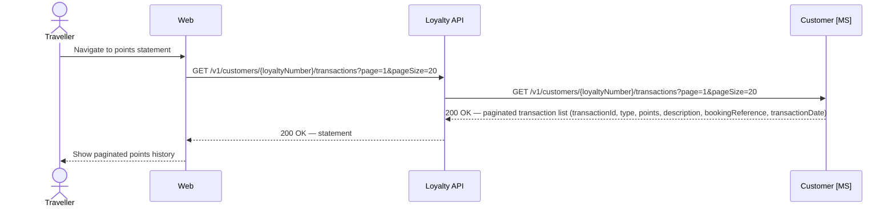

---

### Earn Points on Booking Confirmation

When an order is confirmed, the Order microservice publishes an `OrderConfirmed` event to the event bus. If the booking includes a loyalty number on any passenger, the Customer microservice consumes this event and accrues the appropriate points to the customer's account. Points are calculated based on the fare paid, cabin class, and tier at time of travel.

> **Points calculation** rules (multipliers, bonus tiers, partner earn rates) are the responsibility of the Customer microservice and are not defined in this document. The event payload provides the inputs; the calculation logic is encapsulated within the service.

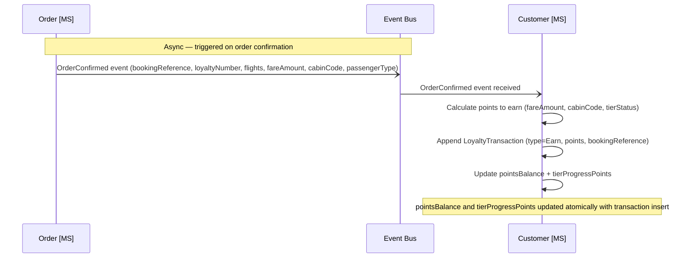

---

### Data Schema — Customer

The Customer domain uses three tables. `Customer` holds one row per loyalty account, containing profile information, tier status, and running points balances. `LoyaltyTransaction` records every points movement as an immutable append-only log — earnings from flights and redemptions against future bookings. `TierConfig` holds the qualifying thresholds for each tier level, used when evaluating tier upgrades.

**Identity separation**

The `Customer` table stores an `IdentityReference` — the unique identifier issued by the Identity microservice when the customer's login account is created. This reference is the only link between the two domains. The Customer microservice never stores email addresses or passwords; the Identity microservice never stores loyalty or profile data. The `IdentityReference` column is nullable to support legacy or manually created accounts that predate the Identity microservice, or future scenarios where a customer has a loyalty account without a login.

```sql
-- customer.TierConfig
-- Defines the qualifying thresholds for each loyalty tier.
-- A single active version of each tier is maintained; rows are never deleted, only superseded.
CREATE TABLE customer.TierConfig (
    TierConfigId          UNIQUEIDENTIFIER  NOT NULL DEFAULT NEWID() PRIMARY KEY,
    TierCode              VARCHAR(20)       NOT NULL,   -- e.g. Blue, Silver, Gold, Platinum
    TierLabel             VARCHAR(50)       NOT NULL,   -- display name, e.g. 'Apex Silver'
    MinQualifyingPoints   INT               NOT NULL,   -- minimum tier progress points to hold this tier
    IsActive              BIT               NOT NULL DEFAULT 1,
    ValidFrom             DATETIME2         NOT NULL,
    ValidTo               DATETIME2         NULL,       -- null = currently active
    CreatedAt             DATETIME2         NOT NULL DEFAULT SYSUTCDATETIME()
);

CREATE INDEX IX_TierConfig_Active
    ON customer.TierConfig (TierCode)
    WHERE IsActive = 1;

-- customer.Customer
-- One row per loyalty account. IdentityReference links to the Identity DB; nullable
-- to support accounts created before or outside the Identity microservice.
CREATE TABLE customer.Customer (
    CustomerId            UNIQUEIDENTIFIER  NOT NULL DEFAULT NEWID() PRIMARY KEY,
    LoyaltyNumber         VARCHAR(20)       NOT NULL UNIQUE,        -- issued at account creation, e.g. AX9876543
    IdentityReference     UNIQUEIDENTIFIER  NULL UNIQUE,            -- opaque ref to Identity DB; null if no login account
    GivenName             VARCHAR(100)      NOT NULL,
    Surname               VARCHAR(100)      NOT NULL,
    DateOfBirth           DATE              NULL,
    Nationality           CHAR(3)           NULL,                   -- ISO 3166-1 alpha-3
    PreferredLanguage     CHAR(5)           NULL DEFAULT 'en-GB',   -- BCP 47 language tag
    PhoneNumber           VARCHAR(30)       NULL,
    TierCode              VARCHAR(20)       NOT NULL DEFAULT 'Blue', -- FK ref to customer.TierConfig (enforced at app layer)
    PointsBalance         INT               NOT NULL DEFAULT 0,     -- current redeemable points balance
    TierProgressPoints    INT               NOT NULL DEFAULT 0,     -- qualifying points for tier evaluation (may differ from PointsBalance)
    IsActive              BIT               NOT NULL DEFAULT 1,
    CreatedAt             DATETIME2         NOT NULL DEFAULT SYSUTCDATETIME(),
    UpdatedAt             DATETIME2         NOT NULL DEFAULT SYSUTCDATETIME()
);

CREATE INDEX IX_Customer_LoyaltyNumber
    ON customer.Customer (LoyaltyNumber);

CREATE INDEX IX_Customer_Surname
    ON customer.Customer (Surname, GivenName);

-- customer.LoyaltyTransaction
-- Immutable append-only log of every points movement on a customer account.
-- Supports both earning (accrual on flight completion) and redemptions (future phase).
-- PointsDelta is positive for earnings, negative for redemptions or expiry.
CREATE TABLE customer.LoyaltyTransaction (
    TransactionId         UNIQUEIDENTIFIER  NOT NULL DEFAULT NEWID() PRIMARY KEY,
    CustomerId            UNIQUEIDENTIFIER  NOT NULL REFERENCES customer.Customer(CustomerId),
    TransactionType       VARCHAR(20)       NOT NULL,               -- Earn | Redeem | Adjustment | Expiry | Reinstate
    PointsDelta           INT               NOT NULL,               -- positive = earned, negative = redeemed/expired
    BalanceAfter          INT               NOT NULL,               -- running pointsBalance snapshot after this transaction
    BookingReference      CHAR(6)           NULL,                   -- associated booking reference where applicable
    FlightNumber          VARCHAR(10)       NULL,                   -- associated flight where applicable (Earn transactions)
    Description           VARCHAR(255)      NOT NULL,               -- e.g. 'Points earned — AX003 LHR-JFK, Business Flex'
    TransactionDate       DATETIME2         NOT NULL DEFAULT SYSUTCDATETIME(),
    CreatedAt             DATETIME2         NOT NULL DEFAULT SYSUTCDATETIME()
);

CREATE INDEX IX_LoyaltyTransaction_Customer
    ON customer.LoyaltyTransaction (CustomerId, TransactionDate DESC);

CREATE INDEX IX_LoyaltyTransaction_BookingReference
    ON customer.LoyaltyTransaction (BookingReference)
    WHERE BookingReference IS NOT NULL;
```

> **Points balance integrity:** `PointsBalance` and `TierProgressPoints` on `customer.Customer` are updated atomically within the same database transaction as the `LoyaltyTransaction` insert. The `BalanceAfter` column on each transaction row records the running balance snapshot at that point, providing a self-consistent audit trail independent of the current balance column. In the event of a discrepancy, `BalanceAfter` on the most recent transaction is the source of truth.

> **TierProgressPoints vs PointsBalance:** These two values are tracked separately. `PointsBalance` is the redeemable balance available to spend. `TierProgressPoints` accumulates qualifying activity for tier evaluation and may be reset annually or per programme rules — it is not decremented when points are redeemed. Tier evaluation logic (when to upgrade or downgrade a member) is the responsibility of the Customer microservice and runs as a background process or is triggered by each `Earn` transaction.

> **Transaction types:** `Earn` — points accrued from a completed flight. `Redeem` — points redeemed against a future booking (award bookings, future phase). `Adjustment` — manual correction applied by a customer service agent with a reason. `Expiry` — points removed due to account inactivity or programme rules. `Reinstate` — reversal of an expiry or erroneous redemption.

---

## Identity

### Data Schema — Identity

The Identity microservice owns its own `identity.*` schema and is the sole store of authentication credentials. It holds one row per login account, linked to the Customer domain via `IdentityReference`. Passwords are stored as salted hashes only — plain text passwords are never persisted.

The Identity microservice exposes authentication and credential management endpoints consumed by the Loyalty API. It does not expose any loyalty or profile data; it returns only a validated `IdentityReference` on successful authentication, which the Loyalty API uses to look up the corresponding Customer account.

```sql
-- identity.UserAccount
-- One row per registered login account. PasswordHash stores a salted hash only —
-- never plain text. IdentityReference is the shared key passed to the Customer domain.
CREATE TABLE identity.UserAccount (
    UserAccountId         UNIQUEIDENTIFIER  NOT NULL DEFAULT NEWID() PRIMARY KEY,
    IdentityReference     UNIQUEIDENTIFIER  NOT NULL DEFAULT NEWID() UNIQUE,  -- shared key passed to Customer MS
    Email                 VARCHAR(254)      NOT NULL UNIQUE,                  -- RFC 5321 max length
    PasswordHash          VARCHAR(255)      NOT NULL,                         -- Argon2id hash; never plain text
    IsEmailVerified       BIT               NOT NULL DEFAULT 0,
    IsLocked              BIT               NOT NULL DEFAULT 0,               -- set after repeated failed login attempts
    FailedLoginAttempts   TINYINT           NOT NULL DEFAULT 0,
    LastLoginAt           DATETIME2         NULL,
    PasswordChangedAt     DATETIME2         NOT NULL DEFAULT SYSUTCDATETIME(),
    CreatedAt             DATETIME2         NOT NULL DEFAULT SYSUTCDATETIME(),
    UpdatedAt             DATETIME2         NOT NULL DEFAULT SYSUTCDATETIME()
);

CREATE INDEX IX_UserAccount_Email
    ON identity.UserAccount (Email);

-- identity.RefreshToken
-- Stores active refresh tokens for session management.
-- Short-lived access tokens are not persisted; only refresh tokens are stored here.
CREATE TABLE identity.RefreshToken (
    RefreshTokenId        UNIQUEIDENTIFIER  NOT NULL DEFAULT NEWID() PRIMARY KEY,
    UserAccountId         UNIQUEIDENTIFIER  NOT NULL REFERENCES identity.UserAccount(UserAccountId),
    TokenHash             VARCHAR(255)      NOT NULL,               -- hashed token; raw token returned to client only
    DeviceHint            VARCHAR(100)      NULL,                   -- optional user-agent label for session management UI
    IsRevoked             BIT               NOT NULL DEFAULT 0,
    ExpiresAt             DATETIME2         NOT NULL,
    CreatedAt             DATETIME2         NOT NULL DEFAULT SYSUTCDATETIME()
);

CREATE INDEX IX_RefreshToken_UserAccount
    ON identity.RefreshToken (UserAccountId)
    WHERE IsRevoked = 0;
```

> **Password hashing:** Passwords must be hashed using Argon2id (bcrypt acceptable as fallback). The raw password must not be stored, logged, or transmitted after the initial hash operation. Salt is embedded within the hash string.

> **Account lockout:** After a configurable number of consecutive failed login attempts (default: 5), `IsLocked` is set to `1` and further authentication attempts are rejected until an administrator or automated unlock process resets the flag. Failed attempt counts reset to zero on successful authentication.

> **Refresh token rotation:** On each use of a refresh token, the existing token is revoked and a new one issued, providing single-use semantics. All tokens for a `UserAccountId` can be revoked simultaneously to force logout across all sessions.

> **Access tokens:** Short-lived JWT access tokens (recommended TTL: 15 minutes) are issued at authentication time and are not persisted in the Identity DB. The Loyalty API and Retail API validate access tokens using the Identity microservice's public signing key without a database round-trip on each request.

> **IdentityReference:** The Identity microservice issues the `IdentityReference` UUID at login account creation and passes it to the Customer microservice for storage. The Customer microservice does not call the Identity microservice to validate credentials — authentication is handled upstream by the Loyalty API before any Customer calls are made.


-----

# Technical Considerations

- Microservices built in C# as Azure Functions (isolated)
- Databases will be built in Microsoft SQL. Ideally these would be individual, isolated, database instances, but for this project, we will use one database with key domains separated logically using the domain names and the schema.
- Front end websites, app and contact centre apps (including others) will be built using the latest version of Angular, hosted as Static Web Apps on Azure.
- **Aircraft type codes** are represented as a 4-character code consisting of the manufacturer prefix followed by a 3-digit variant number. The third digit encodes the specific variant. For example: A350-1000 → `A351`, A350-900 → `A359`, B787-900 → `B789`, B787-10 → `B781`. This convention is consistent with IATA SSIM aircraft designator standards and must be used uniformly across all services, databases, and API contracts.
- JSON columns (`OrderData`, `CabinLayout`) use SQL Server's native `NVARCHAR(MAX)` with `ISJSON` check constraints to enforce structural validity. Where query performance requires filtering or sorting on JSON properties, SQL Server computed columns with JSON path expressions should be used to create targeted indexes.
- **StoredOffer expiry:** The `offer.StoredOffer` table includes an `ExpiresAt` column. The Order API must validate that an offer has not expired before consuming it. A background job should periodically purge or archive expired, unconsumed offers to keep the table lean.
- **Offer consumption:** Once an `OfferId` is successfully retrieved by the Order API during order creation, `IsConsumed` is set to `1` on the `StoredOffer` row to prevent the same offer being used on multiple orders.
- **Basket lifecycle:** The basket is the authoritative pre-sale state and lives entirely in the Order DB (`order.Basket`). It is created at the start of checkout, accumulates flight offers, seat offers, and PAX details, and is hard-deleted on successful order confirmation. If abandoned or expired, a background job releases held inventory and marks the basket `Expired`. The `TicketingTimeLimit` (default 24 hours, configurable via `order.BasketConfig`) is the latest time by which payment must complete; the `ExpiresAt` is the latest time the basket itself is considered valid. Both are evaluated before authorisation is attempted.
- **Payment DB:** The Payment microservice owns its own `payment.*` schema. The `PaymentReference` (e.g. `AXPAY-0001`) is the shared key between the Payment DB and the Order microservice — it is stored on each `orderItem` in `OrderData` to link order lines to their payment transactions. Multiple `PaymentReference` values may exist per booking (one per ancillary payment type). The full card token used during authorisation is never persisted; only `CardLast4` and `CardType` are stored.
- **SeatPricing:** Fleet-wide seat prices are defined in `seat.SeatPricing` and are cabin- and position-based. Business Class seat selection carries no charge. The Seat microservice derives `seatPrice` and `seatOfferId` at seatmap generation time by joining seat position to the active pricing rules. `SeatOfferId` values are session-scoped and should not be stored long-term by channels.
- **Delivery DB:** The Delivery microservice owns its own `Delivery DB` schema (`delivery.*`). It does not read from or write to `order.Order`. Order data required for manifest population (e-ticket numbers, passenger names, seat assignments) is passed explicitly by the Retail API orchestration layer at the point of booking confirmation and subsequent seat changes.
- **FlightManifest seatmap validation:** Before writing any row to `delivery.FlightManifest`, the Delivery microservice must validate the `SeatNumber` against the active seatmap for the relevant `AircraftType` by calling the Seat microservice. Any seat number not present on the seatmap must be rejected. This validation applies to both initial writes (booking confirmation) and updates (post-purchase seat changes).

# Airline Context — Apex Air

This document describes the reservation system for **Apex Air**, IATA carrier code **AX**. All examples, flight numbers, carrier codes, and loyalty references throughout this document use the `AX` designator.

Apex Air is a premium transatlantic and long-haul carrier operating a fleet of approximately 50 aircraft across three types:

- **Boeing 787-9** (`B789`) — primary long-haul workhorse, used on transatlantic and Asia-Pacific routes
- **Airbus A330-900** (`A339`) — medium-to-long-haul, used on Caribbean and secondary transatlantic routes
- **Airbus A350-1000** (`A351`) — flagship widebody, used on high-demand transatlantic and key Asia routes

Apex Air's network is focused on the following key markets:

- **North America** — major gateway cities including New York (JFK), Los Angeles (LAX), Miami (MIA), Chicago (ORD), and Boston (BOS)
- **Caribbean** — leisure and VFR routes to destinations including Barbados (BGI), Jamaica (KIN), and the Bahamas (NAS)
- **East Asia** — Hong Kong (HKG), Tokyo (NRT), Shanghai (PVG), and Beijing (PEK)
- **South-East Asia** — Singapore (SIN)
- **South Asia** — key Indian cities including Mumbai (BOM), Delhi (DEL), and Bangalore (BLR)

All flights operate from a single UK hub. Apex Air participates in the IATA ONE Order standard and operates a modern retailing architecture as described in this document.

---

# Glossary

- **APIS** — Advance Passenger Information System
- **BCBP** — Bar Coded Boarding Pass (IATA Resolution 792 standard for boarding pass barcode encoding)
- **CMK** — Customer-Managed Key
- **CORS** — Cross-Origin Resource Sharing
- **GDS** — Global Distribution System
- **IATA** — International Air Transport Association
- **IROPS** — Irregular Operations
- **NDC** — New Distribution Capability (IATA standard)
- **OLCI** — Online Check In
- **OTA** — Online Travel Agent
- **PAX** — Passenger
- **PCI DSS** — Payment Card Industry Data Security Standard
- **PII** — Personally Identifiable Information
- **PNR** — Passenger Name Record
- **RBAC** — Role-Based Access Control
- **TLS** — Transport Layer Security
- **UK GDPR** — United Kingdom General Data Protection Regulation
