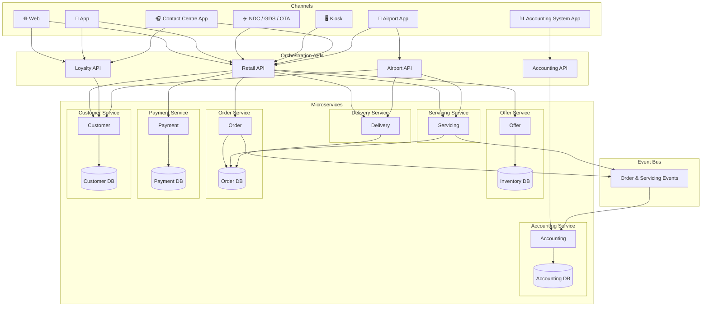

# System Architecture - Design

## Overview

This outlines the design for an airline reservation system based on offer and order capability (Modern Airline Retailing).

The system will ahve the following core concepts.

- Offer - returngs availability and pricing of the airlines flights
- Order - creates orders (bookings on the plane) based on the offer, with passenger information included, and takes payment
- Payment - payment orchestration, supporting at first credit card payments but in future other payment methods like PayPal and ApplePay.
- Servicing - chagne and cancel of orders
- Delivery - Akin to departure control, including online check in (OLCI), irregular operations (IROPS), seat allocation, gate management
- Customer - loyalty accounts for customers - with customer details, points balances, and transaction (historical and future orders)
- Accounting - accounting system - keeping a track of all orders, refunds, balance sheets, profit and loss.

Please note (these one-name capability 'domain names' should be used for domain naming in the code)

## High level system architecture

Key components:

- Cannels
  - Web
  - App 
  - NDC (XML APIs based on IATA NDC standard for GDS and other airlines (OTAs) to connect to)
  - Kisok (self service airport check in terminals)
  - Contact Centre App (for new bookings, IROPS management, customer account management)
  - Airport App (for airport staff to manage non-OLCI check in, and gate management, seat assignment, etc)
  - Accounting System App
- Orchestration APIs (these act as the APIS to connect the channels to the microservices)
  - Retail API (for web, app, NDC, kiosk, contact centre app, airport app)
  - Loyalty API (for web, app, contact centre)
  - Airport API (for Airport App)
  - Accounting API (for accounting system app)
- Microservices (and their data-bound databases)
  - Offer
    - Inventory DB
  - Order
     - Order DB
  - Payment
    - Payment DB
  - Servicing
     - CUses Order DB
  - Delivery
     - CUses Order DB
  - Customer
     - Custtomer DB
  - Accounting (orders and changes should be evented to this microserivce from Order and Servicing microservuces)
     - Accounting DB
   

# Technical Considerations

- Microservices built in C# as Azure Functions (isolated)
- Databases will be built in Microsoft SQL.  Ideally these would be individual, isolated, database instances, but for this project, we will use one database with key domains seperated logically using the domain names and the schema.
