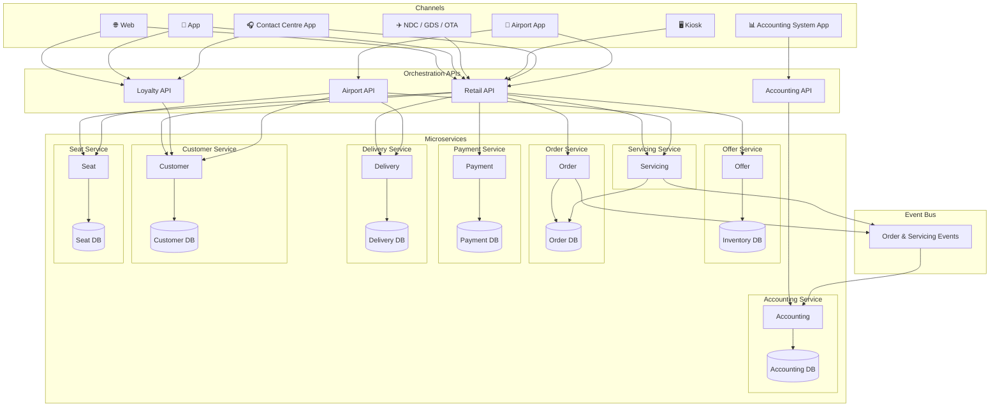
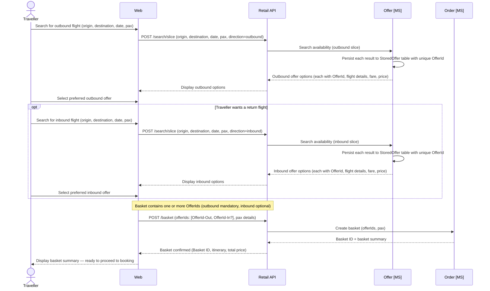
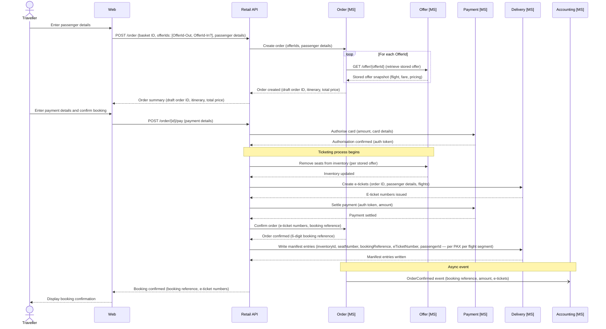
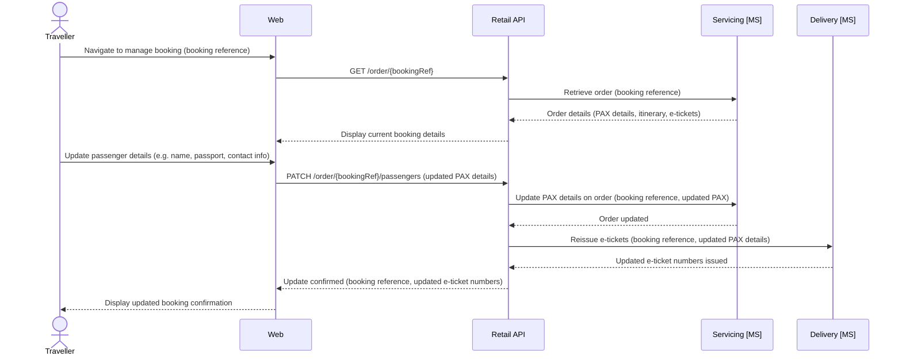
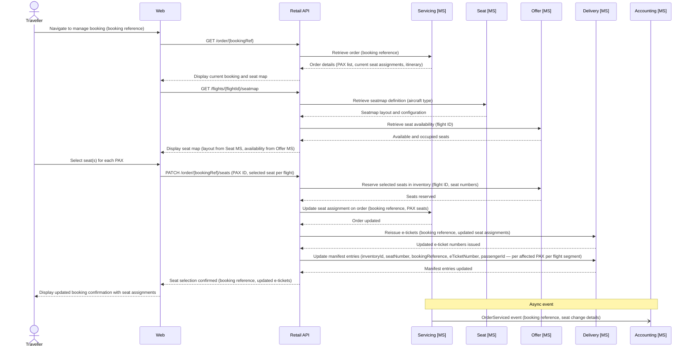
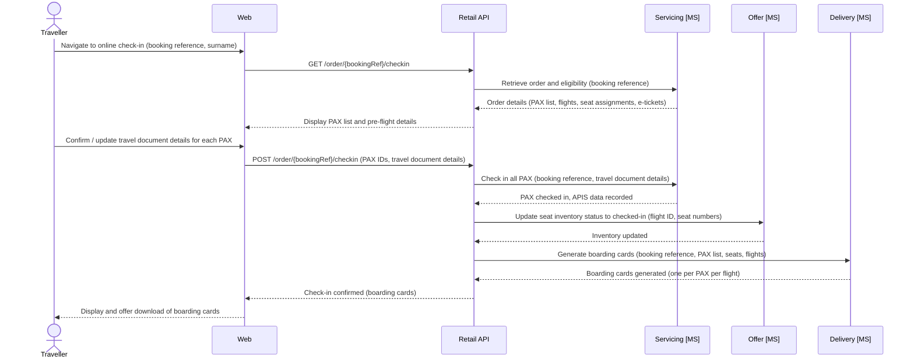
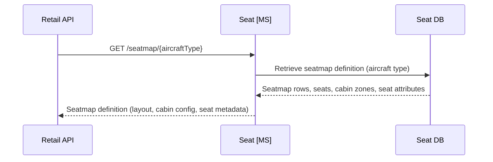

# System Architecture - Design

## Overview

This outlines the design for an airline reservation system based on offer and order capability (Modern Airline Retailing).

The system will have the following core concepts.

- Offer - returns availability and pricing of the airlines flights
- Order - creates orders (bookings on the plane) based on the offer, with passenger information included, and takes payment
- Payment - payment orchestration, supporting at first credit card payments but in future other payment methods like PayPal and ApplePay.
- Servicing - change and cancel of orders
- Delivery - Akin to departure control, including online check in (OLCI), irregular operations (IROPS), seat allocation, gate management
- Customer - loyalty accounts for customers - with customer details, points balances, and transaction (historical and future orders)
- Accounting - accounting system - keeping a track of all orders, refunds, balance sheets, profit and loss.
- Seat - manages seatmap definitions per aircraft type; provides seatmap views to other services and channels (does not manage seat selection or inventory)

Please note (these one-name capability 'domain names' should be used for domain naming in the code)

## High level system architecture



Key components:

- Channels
  - Web
  - App
  - NDC (XML APIs based on IATA NDC standard for GDS and other airlines (OTAs) to connect to)
  - Kiosk (self service airport check in terminals)
  - Contact Centre App (for new bookings, IROPS management, customer account management)
  - Airport App (for airport staff to manage non-OLCI check in, and gate management, seat assignment, etc)
  - Accounting System App
- Orchestration APIs (these act as the APIs to connect the channels to the microservices)
  - Retail API (for web, app, NDC, kiosk, contact centre app, airport app)
  - Loyalty API (for web, app, contact centre)
  - Airport API (for Airport App)
  - Accounting API (for accounting system app)
- Microservices (and their data-bound databases)
  - Offer
    - Inventory DB
  - Order
    - Order DB
  - Payment
    - Payment DB
  - Servicing
    - Uses Order DB
  - Delivery
    - Delivery DB
  - Customer
    - Customer DB
  - Accounting (orders and changes should be evented to this microservice from Order and Servicing microservices)
    - Accounting DB
  - Seat (manages seatmap definitions per aircraft type; provides seatmap views only — seat selection and inventory remain with Offer)
    - Seat DB

# Capability

## Offer

The search flow is built around the concept of a **slice** — a single directional search (outbound or inbound). The customer searches for each slice independently. Each search returns a set of offers; those offers are persisted immediately to the `StoredOffer` table so that pricing is locked at the point of offer creation. The customer selects one offer per slice, and the resulting `OfferIds` are passed through to the basket and ultimately to the Order API.

This ensures price integrity: the Order API retrieves the stored offer by `OfferId` rather than re-pricing, so the fare the customer saw is guaranteed to be the fare charged — regardless of how much time elapses during payment.



### Data Schema — Offer

The Offer domain maintains three tables. `FlightInventory` tracks available seat capacity per flight and cabin. `Fare` records fare basis, pricing, and conditions per inventory record. `StoredOffer` persists the specific offer returned to a customer at search time, capturing the exact fare, flight, and pricing snapshot so that price integrity is maintained through to order creation.

```sql
-- offer.FlightInventory
-- One row per flight leg per cabin class
CREATE TABLE offer.FlightInventory (
    InventoryId       UNIQUEIDENTIFIER  NOT NULL DEFAULT NEWID() PRIMARY KEY,
    FlightNumber      VARCHAR(10)       NOT NULL,   -- e.g. VS001
    DepartureDate     DATE              NOT NULL,
    Origin            CHAR(3)           NOT NULL,   -- IATA airport code
    Destination       CHAR(3)           NOT NULL,
    AircraftType      VARCHAR(4)        NOT NULL,   -- IATA-style 4-char code: manufacturer prefix + 3-digit variant, e.g. A351, B789
    CabinCode         CHAR(1)           NOT NULL,   -- F, J, W, Y
    TotalSeats        SMALLINT          NOT NULL,
    SeatsAvailable    SMALLINT          NOT NULL,
    SeatsSold         SMALLINT          NOT NULL DEFAULT 0,
    SeatsHeld         SMALLINT          NOT NULL DEFAULT 0,  -- seats held in baskets, not yet ticketed
    UpdatedAt         DATETIME2         NOT NULL DEFAULT SYSUTCDATETIME()
);

CREATE INDEX IX_FlightInventory_Flight
    ON offer.FlightInventory (FlightNumber, DepartureDate, CabinCode);

-- offer.Fare
-- One row per fare offering, linked to a flight inventory record.
-- Pricing is broken into base fare, taxes, and total for accounting clarity.
CREATE TABLE offer.Fare (
    FareId            UNIQUEIDENTIFIER  NOT NULL DEFAULT NEWID() PRIMARY KEY,
    InventoryId       UNIQUEIDENTIFIER  NOT NULL REFERENCES offer.FlightInventory(InventoryId),
    FareBasisCode     VARCHAR(20)       NOT NULL,   -- e.g. YLOWUK, JFLEXGB
    FareFamily        VARCHAR(50)       NULL,       -- e.g. Economy Light, Business Flex
    CabinCode         CHAR(1)           NOT NULL,
    BookingClass      CHAR(2)           NOT NULL,   -- revenue management booking class, e.g. Y, B, J
    CurrencyCode      CHAR(3)           NOT NULL DEFAULT 'GBP',
    BaseFareAmount    DECIMAL(10,2)     NOT NULL,
    TaxAmount         DECIMAL(10,2)     NOT NULL,
    TotalAmount       DECIMAL(10,2)     NOT NULL,   -- BaseFareAmount + TaxAmount
    IsRefundable      BIT               NOT NULL DEFAULT 0,
    IsChangeable      BIT               NOT NULL DEFAULT 0,
    ValidFrom         DATETIME2         NOT NULL,
    ValidTo           DATETIME2         NOT NULL
);

-- offer.StoredOffer
-- One row per offer presented to a customer during search. Captures a point-in-time
-- snapshot of the flight and fare so that price is honoured when the order is placed,
-- regardless of subsequent fare changes. OfferIds are passed into the basket and Order API.
CREATE TABLE offer.StoredOffer (
    OfferId           UNIQUEIDENTIFIER  NOT NULL DEFAULT NEWID() PRIMARY KEY,
    InventoryId       UNIQUEIDENTIFIER  NOT NULL REFERENCES offer.FlightInventory(InventoryId),
    FareId            UNIQUEIDENTIFIER  NOT NULL REFERENCES offer.Fare(FareId),
    FlightNumber      VARCHAR(10)       NOT NULL,
    DepartureDate     DATE              NOT NULL,
    Origin            CHAR(3)           NOT NULL,
    Destination       CHAR(3)           NOT NULL,
    AircraftType      VARCHAR(4)        NOT NULL,
    CabinCode         CHAR(1)           NOT NULL,
    BookingClass      CHAR(2)           NOT NULL,
    FareBasisCode     VARCHAR(20)       NOT NULL,
    FareFamily        VARCHAR(50)       NULL,
    CurrencyCode      CHAR(3)           NOT NULL DEFAULT 'GBP',
    BaseFareAmount    DECIMAL(10,2)     NOT NULL,
    TaxAmount         DECIMAL(10,2)     NOT NULL,
    TotalAmount       DECIMAL(10,2)     NOT NULL,
    IsRefundable      BIT               NOT NULL DEFAULT 0,
    IsChangeable      BIT               NOT NULL DEFAULT 0,
    CreatedAt         DATETIME2         NOT NULL DEFAULT SYSUTCDATETIME(),
    ExpiresAt         DATETIME2         NOT NULL,   -- offer expiry; Order API should reject expired offers
    IsConsumed        BIT               NOT NULL DEFAULT 0  -- set to 1 once retrieved by Order API
);

CREATE INDEX IX_StoredOffer_Expiry
    ON offer.StoredOffer (ExpiresAt)
    WHERE IsConsumed = 0;
```

-----

## Order

### Create

The Order API accepts an array of `OfferIds` from the basket (one per slice). For each `OfferId`, it calls the Offer microservice to retrieve the stored offer snapshot, using that data to populate the order items. This ensures the price and fare conditions recorded on the order exactly match what the customer was shown at search time.



### Data Schema — Order

The Order domain follows the IATA ONE Order model. The `Order` table holds scalar fields used for querying, routing, reporting, and event publishing. The full order detail — passengers, flight segments, order items, fares, seat assignments, e-tickets, payments, and audit history — is stored as a JSON document in the `OrderData` column. Fields that exist as typed columns on the table (such as `OrderId`, `BookingReference`, `OrderStatus`, `ChannelCode`, `CurrencyCode`, and `TotalAmount`) are intentionally excluded from the JSON document to avoid duplication.

```sql
-- order.Order
-- Root order record. OrderData holds the full ONE Order document as JSON.
-- Scalar fields used for indexed lookups, routing, and eventing are stored as columns.
-- Fields present as columns are NOT duplicated inside OrderData.
CREATE TABLE order.Order (
    OrderId           UNIQUEIDENTIFIER  NOT NULL DEFAULT NEWID() PRIMARY KEY,
    BookingReference  CHAR(6)           NULL,        -- populated on confirmation, e.g. AB1234
    OrderStatus       VARCHAR(20)       NOT NULL DEFAULT 'Draft',
                                                     -- Draft | Confirmed | Cancelled | Changed
    ChannelCode       VARCHAR(20)       NOT NULL,    -- WEB | APP | NDC | KIOSK | CC | AIRPORT
    CurrencyCode      CHAR(3)           NOT NULL DEFAULT 'GBP',
    TotalAmount       DECIMAL(10,2)     NULL,
    CreatedAt         DATETIME2         NOT NULL DEFAULT SYSUTCDATETIME(),
    UpdatedAt         DATETIME2         NOT NULL DEFAULT SYSUTCDATETIME(),
    OrderData         NVARCHAR(MAX)     NOT NULL     -- JSON: full ONE Order document (see below)

    CONSTRAINT CHK_OrderData CHECK (ISJSON(OrderData) = 1)
);

CREATE UNIQUE INDEX IX_Order_BookingReference
    ON order.Order (BookingReference)
    WHERE BookingReference IS NOT NULL;
```

**Example `OrderData` JSON document**

The JSON structure is aligned to IATA ONE Order concepts. Scalar identifiers and status fields that exist as typed columns on the `order.Order` table (`orderId`, `bookingReference`, `orderStatus`, `channel`, `currency`, `totalAmount`, `createdAt`) are excluded from the JSON document — the table columns are the single source of truth for those values. The JSON carries the relational detail: passengers, flight segments, order items, payments, and audit history.

```json
{
  "dataLists": {
    "passengers": [
      {
        "passengerId": "PAX-1",
        "type": "ADT",
        "givenName": "James",
        "surname": "Harvey",
        "dateOfBirth": "1985-03-12",
        "gender": "Male",
        "loyaltyNumber": "VS9876543",
        "contacts": {
          "email": "james.harvey@example.com",
          "phone": "+447700900123"
        },
        "travelDocument": {
          "type": "PASSPORT",
          "number": "987654321",
          "issuingCountry": "GBR",
          "expiryDate": "2030-01-01",
          "nationality": "GBR"
        }
      },
      {
        "passengerId": "PAX-2",
        "type": "ADT",
        "givenName": "Sarah",
        "surname": "Harvey",
        "dateOfBirth": "1987-07-22",
        "gender": "Female",
        "loyaltyNumber": null,
        "contacts": null,
        "travelDocument": {
          "type": "PASSPORT",
          "number": "123456789",
          "issuingCountry": "GBR",
          "expiryDate": "2028-06-30",
          "nationality": "GBR"
        }
      }
    ],
    "flightSegments": [
      {
        "segmentId": "SEG-1",
        "flightNumber": "VS003",
        "origin": "LHR",
        "destination": "JFK",
        "departureDateTime": "2025-08-15T11:00:00Z",
        "arrivalDateTime": "2025-08-15T14:10:00Z",
        "aircraftType": "A351",
        "operatingCarrier": "VS",
        "marketingCarrier": "VS",
        "cabinCode": "J",
        "bookingClass": "J"
      },
      {
        "segmentId": "SEG-2",
        "flightNumber": "VS004",
        "origin": "JFK",
        "destination": "LHR",
        "departureDateTime": "2025-08-25T22:00:00Z",
        "arrivalDateTime": "2025-08-26T10:15:00Z",
        "aircraftType": "A351",
        "operatingCarrier": "VS",
        "marketingCarrier": "VS",
        "cabinCode": "J",
        "bookingClass": "J"
      }
    ]
  },
  "orderItems": [
    {
      "orderItemId": "OI-1",
      "type": "Flight",
      "segmentRef": "SEG-1",
      "passengerRefs": ["PAX-1", "PAX-2"],
      "offerId": "3fa85f64-5717-4562-b3fc-2c963f66afa6",
      "fareBasisCode": "JFLEXGB",
      "fareFamily": "Business Flex",
      "unitPrice": 350.00,
      "taxes": 87.25,
      "totalPrice": 437.25,
      "isRefundable": true,
      "isChangeable": true,
      "eTickets": [
        { "passengerId": "PAX-1", "eTicketNumber": "932-1234567890" },
        { "passengerId": "PAX-2", "eTicketNumber": "932-1234567891" }
      ],
      "seatAssignments": [
        { "passengerId": "PAX-1", "seatNumber": "1A" },
        { "passengerId": "PAX-2", "seatNumber": "1B" }
      ]
    },
    {
      "orderItemId": "OI-2",
      "type": "Flight",
      "segmentRef": "SEG-2",
      "passengerRefs": ["PAX-1", "PAX-2"],
      "offerId": "7cb87a21-1234-4abc-9def-1a2b3c4d5e6f",
      "fareBasisCode": "JFLEXGB",
      "fareFamily": "Business Flex",
      "unitPrice": 350.00,
      "taxes": 87.25,
      "totalPrice": 437.25,
      "isRefundable": true,
      "isChangeable": true,
      "eTickets": [
        { "passengerId": "PAX-1", "eTicketNumber": "932-1234567892" },
        { "passengerId": "PAX-2", "eTicketNumber": "932-1234567893" }
      ],
      "seatAssignments": [
        { "passengerId": "PAX-1", "seatNumber": "2A" },
        { "passengerId": "PAX-2", "seatNumber": "2B" }
      ]
    }
  ],
  "payments": [
    {
      "paymentId": "PMT-1",
      "method": "CreditCard",
      "amount": 874.50,
      "currency": "GBP",
      "status": "Settled",
      "cardLast4": "4242",
      "cardType": "Visa",
      "settledAt": "2025-06-01T10:32:00Z"
    }
  ],
  "history": [
    { "event": "OrderCreated",   "at": "2025-06-01T10:30:00Z", "by": "WEB" },
    { "event": "OrderConfirmed", "at": "2025-06-01T10:32:00Z", "by": "WEB" }
  ]
}
```

-----

## Servicing

### Manage booking - update PAX details



### Manage booking - select or update seat selection



## Delivery

### Online Check In



### Data Schema — Delivery

The Delivery domain owns its own `Delivery DB` and is the system of record for who is on each flight and where they are sitting. The `FlightManifest` table holds one row per passenger per flight segment, populated at the point of booking confirmation and updated whenever a seat is changed post-purchase. It provides a clean, queryable view of the passenger load for a given flight — used for gate management, check-in verification, IROPS, and regulatory APIS submissions.

Seat number integrity is enforced at the application layer: before any insert or update, the Delivery microservice calls the Seat microservice to validate that the given `SeatNumber` exists on the active seatmap for the relevant aircraft type. Rows may not be written with a seat number that does not appear in the seatmap definition. This prevents manifest corruption from downstream data entry errors or stale seat references.

```sql
-- delivery.FlightManifest
-- One row per passenger per flight segment. Written at booking confirmation;
-- updated on any post-purchase seat change. SeatNumber must be a valid seat
-- from the active seatmap for the aircraft type — validated at application layer
-- before insert or update.
CREATE TABLE delivery.FlightManifest (
    ManifestId        UNIQUEIDENTIFIER  NOT NULL DEFAULT NEWID() PRIMARY KEY,
    InventoryId       UNIQUEIDENTIFIER  NOT NULL,               -- FK ref to offer.FlightInventory (cross-schema; not enforced as DB constraint)
    FlightNumber      VARCHAR(10)       NOT NULL,               -- denormalised for query convenience, e.g. VS003
    DepartureDate     DATE              NOT NULL,               -- denormalised for query convenience
    AircraftType      CHAR(4)           NOT NULL,               -- used for seatmap validation at write time
    SeatNumber        VARCHAR(5)        NOT NULL,               -- e.g. 1A, 22K — must exist on active seatmap for AircraftType
    CabinCode         CHAR(1)           NOT NULL,               -- F, J, W, Y
    BookingReference  CHAR(6)           NOT NULL,               -- e.g. AB1234
    ETicketNumber     VARCHAR(20)       NOT NULL,               -- e.g. 932-1234567890
    PassengerId       VARCHAR(20)       NOT NULL,               -- PAX reference from the order, e.g. PAX-1
    GivenName         VARCHAR(100)      NOT NULL,               -- denormalised for manifest readability
    Surname           VARCHAR(100)      NOT NULL,               -- denormalised for manifest readability
    CheckedIn         BIT               NOT NULL DEFAULT 0,
    CheckedInAt       DATETIME2         NULL,
    CreatedAt         DATETIME2         NOT NULL DEFAULT SYSUTCDATETIME(),
    UpdatedAt         DATETIME2         NOT NULL DEFAULT SYSUTCDATETIME()
);

-- Unique constraint: one seat per flight per manifest (prevents double-assignment)
CREATE UNIQUE INDEX IX_FlightManifest_Seat
    ON delivery.FlightManifest (InventoryId, SeatNumber);

-- Unique constraint: one manifest entry per PAX per flight
CREATE UNIQUE INDEX IX_FlightManifest_Pax
    ON delivery.FlightManifest (InventoryId, ETicketNumber);

-- Index to support fast flight-level manifest retrieval (gate staff, IROPS)
CREATE INDEX IX_FlightManifest_Flight
    ON delivery.FlightManifest (FlightNumber, DepartureDate);

-- Index to support lookup by booking reference (customer servicing, check-in)
CREATE INDEX IX_FlightManifest_BookingReference
    ON delivery.FlightManifest (BookingReference);
```

> **Cross-schema integrity:** `InventoryId` references `offer.FlightInventory` but is not declared as a foreign key, as the Delivery and Offer domains are logically separated (and would be physically separated in a fully isolated deployment). Referential integrity between these schemas is the responsibility of the Retail API orchestration layer, which controls the write sequence.

> **Seatmap validation:** The Delivery microservice must call `GET /seatmap/{aircraftType}` on the Seat microservice and confirm the `SeatNumber` exists in the returned cabin layout before writing any `FlightManifest` row. If the seat is not present on the active seatmap, the write must be rejected with an appropriate error. This check applies to both initial inserts (at booking confirmation) and updates (at seat changes).

## Seat

### Retrieve Seatmap

The Seat microservice is the system of record for aircraft seatmap definitions, organised by aircraft type (e.g. A351, B789). It provides the physical layout, seat attributes (class, position, extra legroom, etc.) and cabin configuration. It does **not** manage seat availability or inventory — that remains the responsibility of the Offer microservice.



### Data Schema — Seat

The Seat domain uses two relational tables: `AircraftType` as the root reference record, and `Seatmap` which holds one row per active aircraft configuration. The cabin layout and all seat definitions are stored as a JSON document in the `CabinLayout` column. This is well-suited to JSON storage as the layout is a hierarchical, read-heavy document that varies significantly by aircraft type and is consumed whole by the front-end seat picker rather than queried row-by-row. Aircraft type codes follow the 4-character convention defined in Technical Considerations (e.g. `A351`, `B789`).

```sql
-- seat.AircraftType
-- Reference table of aircraft types operated by the airline
CREATE TABLE seat.AircraftType (
    AircraftTypeCode  CHAR(4)           NOT NULL PRIMARY KEY,  -- 4-char code: manufacturer prefix + 3-digit variant, e.g. A351 (A350-1000), B789 (B787-900)
    Manufacturer      VARCHAR(50)       NOT NULL,              -- e.g. Airbus, Boeing
    FriendlyName      VARCHAR(100)      NULL,                  -- e.g. Airbus A350-1000, Boeing 787-900
    TotalSeats        SMALLINT          NOT NULL,
    IsActive          BIT               NOT NULL DEFAULT 1
);

-- seat.Seatmap
-- One row per active aircraft configuration. CabinLayout holds the full seatmap as JSON.
CREATE TABLE seat.Seatmap (
    SeatmapId         UNIQUEIDENTIFIER  NOT NULL DEFAULT NEWID() PRIMARY KEY,
    AircraftTypeCode  CHAR(4)           NOT NULL REFERENCES seat.AircraftType(AircraftTypeCode),
    Version           INT               NOT NULL DEFAULT 1,
    IsActive          BIT               NOT NULL DEFAULT 1,
    UpdatedAt         DATETIME2         NOT NULL DEFAULT SYSUTCDATETIME(),
    CabinLayout       NVARCHAR(MAX)     NOT NULL   -- JSON: full cabin and seat definitions (see below)

    CONSTRAINT CHK_CabinLayout CHECK (ISJSON(CabinLayout) = 1)
);

CREATE INDEX IX_Seatmap_AircraftType
    ON seat.Seatmap (AircraftTypeCode)
    WHERE IsActive = 1;
```

**Example `CabinLayout` JSON document**

The JSON is structured as an ordered array of cabins, each containing a column configuration and an array of rows. Each seat carries its label, position, and a set of physical attributes. This structure is consumed directly by the front-end seat picker UI, which overlays real-time availability from the Offer microservice at query time.

```json
{
  "aircraftType": "A351",
  "version": 1,
  "totalSeats": 258,
  "cabins": [
    {
      "cabinCode": "J",
      "cabinName": "Upper Class",
      "deckLevel": "Main",
      "startRow": 1,
      "endRow": 8,
      "columns": ["A", "D", "G", "K"],
      "layout": "1-1-1-1",
      "rows": [
        {
          "rowNumber": 1,
          "seats": [
            {
              "seatNumber": "1A",
              "column": "A",
              "type": "Suite",
              "position": "Window",
              "attributes": ["ExtraLegroom", "BlockedForCrew"],
              "isSelectable": false
            },
            {
              "seatNumber": "1D",
              "column": "D",
              "type": "Suite",
              "position": "Middle",
              "attributes": ["ExtraLegroom"],
              "isSelectable": true
            },
            {
              "seatNumber": "1G",
              "column": "G",
              "type": "Suite",
              "position": "Middle",
              "attributes": ["ExtraLegroom"],
              "isSelectable": true
            },
            {
              "seatNumber": "1K",
              "column": "K",
              "type": "Suite",
              "position": "Window",
              "attributes": ["ExtraLegroom"],
              "isSelectable": true
            }
          ]
        },
        {
          "rowNumber": 2,
          "seats": [
            {
              "seatNumber": "2A",
              "column": "A",
              "type": "Suite",
              "position": "Window",
              "attributes": [],
              "isSelectable": true
            },
            {
              "seatNumber": "2D",
              "column": "D",
              "type": "Suite",
              "position": "Middle",
              "attributes": [],
              "isSelectable": true
            },
            {
              "seatNumber": "2G",
              "column": "G",
              "type": "Suite",
              "position": "Middle",
              "attributes": [],
              "isSelectable": true
            },
            {
              "seatNumber": "2K",
              "column": "K",
              "type": "Suite",
              "position": "Window",
              "attributes": [],
              "isSelectable": true
            }
          ]
        }
      ]
    },
    {
      "cabinCode": "W",
      "cabinName": "Premium Economy",
      "deckLevel": "Main",
      "startRow": 11,
      "endRow": 18,
      "columns": ["A", "B", "C", "D", "E", "F", "G", "H", "K"],
      "layout": "3-3-3",
      "rows": [
        {
          "rowNumber": 11,
          "seats": [
            {
              "seatNumber": "11A",
              "column": "A",
              "type": "Standard",
              "position": "Window",
              "attributes": ["ExtraLegroom"],
              "isSelectable": true
            },
            {
              "seatNumber": "11B",
              "column": "B",
              "type": "Standard",
              "position": "Middle",
              "attributes": ["ExtraLegroom"],
              "isSelectable": true
            },
            {
              "seatNumber": "11C",
              "column": "C",
              "type": "Standard",
              "position": "Aisle",
              "attributes": ["ExtraLegroom"],
              "isSelectable": true
            },
            {
              "seatNumber": "11D",
              "column": "D",
              "type": "Standard",
              "position": "Aisle",
              "attributes": ["ExtraLegroom"],
              "isSelectable": true
            },
            {
              "seatNumber": "11E",
              "column": "E",
              "type": "Standard",
              "position": "Middle",
              "attributes": ["ExtraLegroom"],
              "isSelectable": true
            },
            {
              "seatNumber": "11F",
              "column": "F",
              "type": "Standard",
              "position": "Aisle",
              "attributes": ["ExtraLegroom"],
              "isSelectable": true
            },
            {
              "seatNumber": "11G",
              "column": "G",
              "type": "Standard",
              "position": "Aisle",
              "attributes": ["ExtraLegroom"],
              "isSelectable": true
            },
            {
              "seatNumber": "11H",
              "column": "H",
              "type": "Standard",
              "position": "Middle",
              "attributes": ["ExtraLegroom"],
              "isSelectable": true
            },
            {
              "seatNumber": "11K",
              "column": "K",
              "type": "Standard",
              "position": "Window",
              "attributes": ["ExtraLegroom"],
              "isSelectable": true
            }
          ]
        }
      ]
    },
    {
      "cabinCode": "Y",
      "cabinName": "Economy",
      "deckLevel": "Main",
      "startRow": 22,
      "endRow": 54,
      "columns": ["A", "B", "C", "D", "E", "F", "G", "H", "K"],
      "layout": "3-3-3",
      "rows": [
        {
          "rowNumber": 22,
          "seats": [
            {
              "seatNumber": "22A",
              "column": "A",
              "type": "Standard",
              "position": "Window",
              "attributes": ["ExtraLegroom"],
              "isSelectable": true
            },
            {
              "seatNumber": "22B",
              "column": "B",
              "type": "Standard",
              "position": "Middle",
              "attributes": ["ExtraLegroom"],
              "isSelectable": true
            },
            {
              "seatNumber": "22C",
              "column": "C",
              "type": "Standard",
              "position": "Aisle",
              "attributes": ["ExtraLegroom"],
              "isSelectable": true
            },
            {
              "seatNumber": "22D",
              "column": "D",
              "type": "Standard",
              "position": "Aisle",
              "attributes": ["ExtraLegroom"],
              "isSelectable": true
            },
            {
              "seatNumber": "22E",
              "column": "E",
              "type": "Standard",
              "position": "Middle",
              "attributes": ["ExtraLegroom"],
              "isSelectable": true
            },
            {
              "seatNumber": "22F",
              "column": "F",
              "type": "Standard",
              "position": "Aisle",
              "attributes": ["ExtraLegroom"],
              "isSelectable": true
            },
            {
              "seatNumber": "22G",
              "column": "G",
              "type": "Standard",
              "position": "Aisle",
              "attributes": ["ExtraLegroom"],
              "isSelectable": true
            },
            {
              "seatNumber": "22H",
              "column": "H",
              "type": "Standard",
              "position": "Middle",
              "attributes": ["ExtraLegroom"],
              "isSelectable": true
            },
            {
              "seatNumber": "22K",
              "column": "K",
              "type": "Standard",
              "position": "Window",
              "attributes": ["ExtraLegroom"],
              "isSelectable": true
            }
          ]
        }
      ]
    }
  ]
}
```

> **Note:** `isSelectable` reflects whether a seat is physically available for selection (i.e. not a structural no-fly zone, crew seat, or permanently blocked position). Real-time occupancy — whether a seat has been sold or held on a specific flight — is overlaid at query time from `offer.FlightInventory` and is never stored here.

-----

# Technical Considerations

- Microservices built in C# as Azure Functions (isolated)
- Databases will be built in Microsoft SQL. Ideally these would be individual, isolated, database instances, but for this project, we will use one database with key domains separated logically using the domain names and the schema.
- Front end websites, app and contact centre apps (including others) will be built using the latest version of Angular, hosted as Static Web Apps on Azure.
- **Aircraft type codes** are represented as a 4-character code consisting of the manufacturer prefix followed by a 3-digit variant number. The third digit encodes the specific variant. For example: A350-1000 → `A351`, A350-900 → `A359`, B787-900 → `B789`, B787-10 → `B781`. This convention is consistent with IATA SSIM aircraft designator standards and must be used uniformly across all services, databases, and API contracts.
- JSON columns (`OrderData`, `CabinLayout`) use SQL Server's native `NVARCHAR(MAX)` with `ISJSON` check constraints to enforce structural validity. Where query performance requires filtering or sorting on JSON properties, SQL Server computed columns with JSON path expressions should be used to create targeted indexes.
- **StoredOffer expiry:** The `offer.StoredOffer` table includes an `ExpiresAt` column. The Order API must validate that an offer has not expired before consuming it. A background job should periodically purge or archive expired, unconsumed offers to keep the table lean.
- **Offer consumption:** Once an `OfferId` is successfully retrieved by the Order API during order creation, `IsConsumed` is set to `1` on the `StoredOffer` row to prevent the same offer being used on multiple orders.
- **Delivery DB:** The Delivery microservice owns its own `Delivery DB` schema (`delivery.*`). It no longer reads from or writes to `order.Order`. Order data required for manifest population (e-ticket numbers, passenger names, seat assignments) is passed explicitly by the Retail API orchestration layer at the point of booking confirmation and subsequent seat changes.
- **FlightManifest seatmap validation:** Before writing any row to `delivery.FlightManifest`, the Delivery microservice must validate the `SeatNumber` against the active seatmap for the relevant `AircraftType` by calling the Seat microservice. Any seat number not present on the seatmap must be rejected. This validation applies to both initial writes (booking confirmation) and updates (post-purchase seat changes).

# Glossary

- PAX - passenger
- NDC - New distribution capability (IATA standard)
- OLCI - Online Check In
- IROPS - Irregular Operations
- APIS - Advance Passenger Information System
- ONE Order - IATA standard for unified order management, replacing the traditional PNR + e-ticket + EMD model
- Fare Basis Code - an alphanumeric code identifying the rules and pricing of a fare (e.g. YLOWUK, JFLEXGB)
- Slice - a single directional flight search (outbound or inbound); a return journey comprises two slices
- OfferId - a unique identifier for a stored offer snapshot returned from a slice search, used to guarantee price integrity through to order creation
- FlightManifest - the definitive list of passengers on a given flight, including their seat assignments and e-ticket numbers, owned by the Delivery microservice
