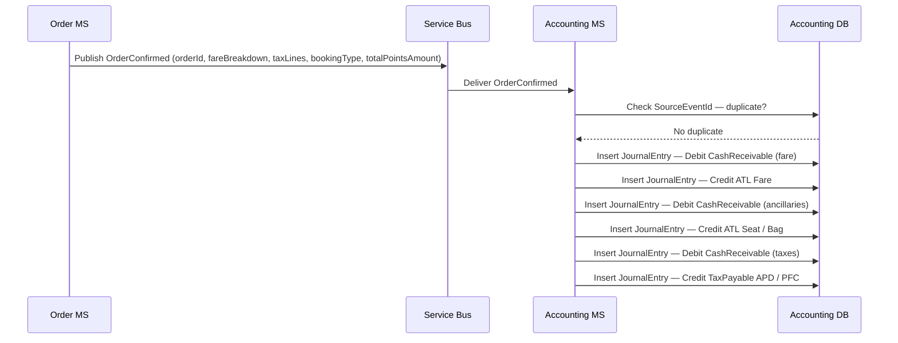
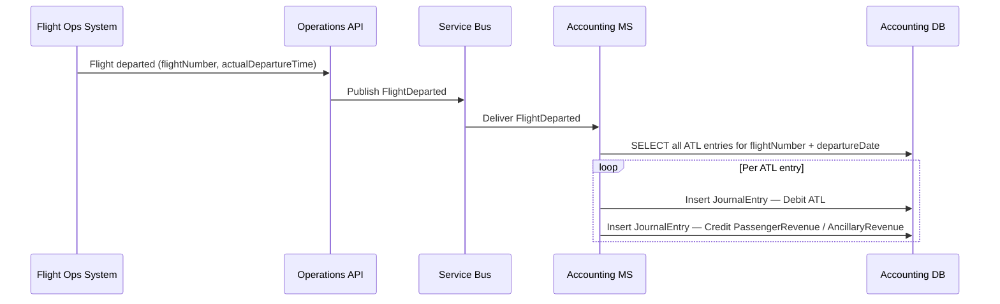

# Accounting domain

## Overview

The Accounting microservice is a pure event-consumer. It has no synchronous API surface called during the booking path. All input arrives via the Azure Service Bus event bus; it processes domain events to build and maintain the airline's financial records using double-entry bookkeeping.

The Finance API orchestration layer provides read-only query endpoints for the Accounting System App channel, proxying all requests to the Accounting microservice.

---

## Accounting model

Airline accounting differs from typical retail because **revenue is not recognised when payment is taken**. When a ticket is sold, the airline holds cash but still owes the passenger a flight. That obligation is recorded as a liability — Air Traffic Liability (ATL) — and sits on the balance sheet until the aircraft departs, at which point it is transferred to earned revenue. This creates three distinct phases, each with different accounting treatment.

### Phase 1 — Sale (cash received, liability created)

When an order is confirmed (`OrderConfirmed` event), the following journal entries are posted:

| Debit | Credit |
|---|---|
| Cash / Card Receivable | Air Traffic Liability (ATL) — base fare |
| Cash / Card Receivable | Air Traffic Liability (ATL) — ancillaries (seat, bag) |
| Cash / Card Receivable | Tax Payable — APD |
| Cash / Card Receivable | Tax Payable — Passenger Facility Charges |

Tax lines (APD, PFCs) are recorded as payables from the moment of sale — the airline is a collector on behalf of HMRC and the relevant airport authorities, and retains no beneficial interest in those amounts.

For reward bookings (`bookingType=Reward`), the entry differs:

| Debit | Credit |
|---|---|
| Points Redeemed (liability reduction) | Air Traffic Liability — base fare |
| Cash / Card Receivable (taxes only) | Tax Payable — APD / PFCs |

The redeemed points are debited against the Points Liability ledger (held by the Customer domain), reducing the outstanding obligation to the loyalty member.

### Phase 2 — Flight operates (liability discharged, revenue recognised)

When the flight departs, ATL is reclassified as earned revenue. This is triggered by a `FlightDeparted` event (see [Gap: flight-operated trigger](#gap-flight-operated-trigger) below).

| Debit | Credit |
|---|---|
| Air Traffic Liability — base fare | Passenger Revenue |
| Air Traffic Liability — ancillaries | Ancillary Revenue |

Revenue is attributed at the **segment level** so that connecting itineraries are split correctly across origin-destination pairs.

### Phase 3 — Post-sale changes

**Voluntary change** — adjust ATL for the fare difference; record add-collect revenue immediately (no further flight obligation):

| Scenario | Debit | Credit |
|---|---|---|
| Fare increase (add-collect) | Cash / Card Receivable | ATL (incremental fare difference) |
| Ancillary addition | Cash / Card Receivable | ATL (ancillary amount) |
| Downgrade / refund due | Refund Payable | ATL (reduction) |

**Voluntary cancellation** — ATL reversed; refund payable created; any cancellation fee recognised as immediate revenue:

| Debit | Credit |
|---|---|
| Air Traffic Liability (full ATL balance) | Refund Payable (refundable amount) |
| Air Traffic Liability | Cancellation Fee Revenue (retained charge, if applicable) |

**IROPS (involuntary cancellation)** — full ATL reversal, no cancellation fee, potential compensation liability:

| Debit | Credit |
|---|---|
| Air Traffic Liability | Refund Payable (full amount) |
| Compensation Expense (if applicable) | Compensation Payable |

---

## Revenue categories

Each journal entry is tagged with a `RevenueCategory` to support P&L attribution:

| Code | Description |
|---|---|
| `Fare` | Base published fare component |
| `FuelSurcharge` | YQ/YR carrier-imposed surcharges |
| `Seat` | Seat selection ancillary |
| `Bag` | Excess baggage ancillary |
| `CancellationFee` | Retained charge on voluntary cancellation |
| `Tax_APD` | UK Air Passenger Duty — payable to HMRC |
| `Tax_PFC` | Passenger Facility Charge — payable to airports |
| `PointsLiability` | Loyalty points redeemed (valued at programme redemption rate) |

---

## Events consumed

| Event | Source | Accounting action |
|---|---|---|
| `OrderConfirmed` | Order MS | Post ATL entry (fare + ancillaries); post Tax Payable entries; for reward bookings, debit Points Liability ledger |
| `OrderChanged` | Order MS | Adjust ATL and/or Points Liability; record add-collect as incremental ATL or cancellation fee as immediate revenue |
| `OrderCancelled` | Order MS | Reverse ATL; create Refund Payable record; split cancellation fee to revenue if applicable; reverse Points Liability for reward bookings |
| `TicketIssued` | Delivery MS | Record ticket issuance in audit trail; corroborate ATL entry (ticket is the financial document of record under IATA ONE Order) |
| `TicketVoided` | Delivery MS | Record ticket void in audit trail; mark corresponding ATL entry as voided pending reversal |
| `DocumentIssued` | Delivery MS | Record ancillary document issuance; corroborate ancillary ATL entry |
| `DocumentVoided` | Delivery MS | Record document void; mark corresponding ancillary ATL entry as voided pending reversal |
| `FlightDeparted` *(future)* | FOS via Operations | Transfer ATL → earned revenue for all entries with matching `FlightNumber` + `DepartureDate` |

All event handlers are **idempotent**: the `SourceEventId` (Service Bus message ID) is stored on every journal entry and duplicate delivery is detected before any write.

---

## Data schema

### `accounting.JournalEntry`

The double-entry ledger. Every economic event produces two or more paired rows (debit + credit) sharing a `JournalId`.

| Column | Type | Nullable | Default | Key | Notes |
|---|---|---|---|---|---|
| EntryId | UNIQUEIDENTIFIER | No | NEWID() | PK | |
| JournalId | UNIQUEIDENTIFIER | No | | | Groups the debit/credit pair for a single economic event |
| EntryDate | DATETIME2 | No | SYSUTCDATETIME() | | When the entry was recorded |
| EffectiveDate | DATETIME2 | No | | | When the underlying economic event occurred (e.g. order confirmation date, departure date) |
| AccountCode | VARCHAR(20) | No | | | Chart-of-accounts code (e.g. `2100-ATL`, `4000-PAX-REV`, `2200-TAX-APD`) |
| AccountType | VARCHAR(30) | No | | | `ATL` · `PassengerRevenue` · `AncillaryRevenue` · `CancellationFeeRevenue` · `TaxPayable` · `RefundPayable` · `PointsLiability` · `CashReceivable` |
| DebitAmount | DECIMAL(18,4) | No | 0 | | |
| CreditAmount | DECIMAL(18,4) | No | 0 | | |
| Currency | CHAR(3) | No | `'GBP'` | | ISO 4217 |
| ExchangeRate | DECIMAL(18,6) | Yes | | | GBP exchange rate at time of sale; null for GBP transactions |
| GBPEquivalent | DECIMAL(18,4) | Yes | | | Computed sterling equivalent for statutory reporting; null for GBP transactions |
| RevenueCategory | VARCHAR(30) | Yes | | | `Fare` · `FuelSurcharge` · `Seat` · `Bag` · `CancellationFee` · `Tax_APD` · `Tax_PFC` · `PointsLiability` |
| SourceEventType | VARCHAR(50) | No | | | `OrderConfirmed` · `OrderChanged` · `OrderCancelled` · `TicketIssued` · `TicketVoided` · `DocumentIssued` · `DocumentVoided` · `FlightDeparted` |
| SourceEventId | UNIQUEIDENTIFIER | No | | UQ | Service Bus message ID — enforces idempotency |
| OrderId | UNIQUEIDENTIFIER | Yes | | | FK traceability to booking |
| BookingReference | CHAR(6) | Yes | | | Denormalised for reporting queries |
| ETicketNumber | VARCHAR(14) | Yes | | | IATA 13-digit + check digit; null for non-ticket events |
| PassengerId | UNIQUEIDENTIFIER | Yes | | | |
| FlightNumber | VARCHAR(7) | Yes | | | e.g. `AX001` |
| Origin | CHAR(3) | Yes | | | IATA airport code |
| Destination | CHAR(3) | Yes | | | IATA airport code |
| DepartureDate | DATE | Yes | | | Scheduled departure date (UTC) |
| CabinCode | CHAR(1) | Yes | | | `F` · `J` · `W` · `Y` |
| CreatedAt | DATETIME2 | No | SYSUTCDATETIME() | | Database-generated |

> **Indexes:** `IX_JournalEntry_JournalId` on `(JournalId)`; `IX_JournalEntry_OrderId` on `(OrderId)` WHERE `OrderId IS NOT NULL`; `IX_JournalEntry_SourceEventId` on `(SourceEventId)` UNIQUE; `IX_JournalEntry_FlightDeparture` on `(FlightNumber, DepartureDate)` WHERE `AccountType = 'ATL'` — supports efficient ATL → Revenue sweep on flight departure.

> **Immutability:** Journal entries are never updated or deleted. Corrections are posted as reversing entries (equal and opposite debit/credit) followed by a correcting entry, preserving a complete audit trail.

---

### `accounting.RefundRecord`

Tracks refunds from point of identification (`OrderCancelled` event) through to payment processor settlement.

| Column | Type | Nullable | Default | Key | Notes |
|---|---|---|---|---|---|
| RefundId | UNIQUEIDENTIFIER | No | NEWID() | PK | |
| OrderId | UNIQUEIDENTIFIER | No | | | |
| BookingReference | CHAR(6) | No | | | |
| OriginalPaymentId | UNIQUEIDENTIFIER | No | | | From `OrderCancelled` event; used to instruct Payment MS refund |
| RefundableAmount | DECIMAL(18,4) | No | | | Gross refund owed to passenger |
| CancellationFee | DECIMAL(18,4) | No | 0 | | Retained by airline; 0 for IROPS |
| Currency | CHAR(3) | No | `'GBP'` | | |
| RefundReason | VARCHAR(30) | No | | | `VoluntaryCancel` · `IROPS` · `Downgrade` · `DuplicateBooking` |
| Status | VARCHAR(20) | No | `'Pending'` | | `Pending` · `Submitted` · `Processed` · `Failed` |
| SubmittedAt | DATETIME2 | Yes | | | When refund instruction sent to Payment MS |
| ProcessedAt | DATETIME2 | Yes | | | When payment processor confirmed settlement |
| SettlementRef | VARCHAR(100) | Yes | | | Payment processor reference |
| CreatedAt | DATETIME2 | No | SYSUTCDATETIME() | | Database-generated |
| UpdatedAt | DATETIME2 | No | SYSUTCDATETIME() | | Database-generated |

> **Trigger:** `TR_RefundRecord_UpdatedAt` — update `UpdatedAt` on row modification.

---

### `accounting.PointsLiabilityEntry`

Append-only ledger tracking the monetary value of loyalty points redeemed as fare, constituting a liability until the flight operates.

| Column | Type | Nullable | Default | Key | Notes |
|---|---|---|---|---|---|
| LiabilityEntryId | UNIQUEIDENTIFIER | No | NEWID() | PK | |
| MemberId | UNIQUEIDENTIFIER | No | | | |
| OrderId | UNIQUEIDENTIFIER | No | | | |
| RedemptionReference | VARCHAR(50) | No | | | From Customer MS two-stage settlement |
| PointsAmount | INT | No | | | Number of points redeemed or reinstated |
| MonetaryEquivalent | DECIMAL(18,4) | No | | | Valued at programme redemption rate at time of booking (GBP) |
| EntryType | VARCHAR(20) | No | | | `Liability` (booking) · `Reversal` (cancellation) · `Adjustment` (change) |
| JournalId | UNIQUEIDENTIFIER | Yes | | | FK → `accounting.JournalEntry(JournalId)` — links to corresponding GL entry |
| CreatedAt | DATETIME2 | No | SYSUTCDATETIME() | | Database-generated |

> **Indexes:** `IX_PointsLiability_MemberId` on `(MemberId)`; `IX_PointsLiability_OrderId` on `(OrderId)`.

---

## Event flow — order confirmation

*Ref: accounting — order confirmation journal posting sequence*

---

## Event flow — flight departure (ATL recognition)

*Ref: accounting — ATL to revenue recognition on flight departure*

---

## Finance API endpoints

The Finance API proxies read-only queries from the Accounting System App to the Accounting microservice. All endpoints require staff JWT authentication via the Admin API.

| Method | Endpoint | Description |
|---|---|---|
| `GET` | `/v1/atl-balance` | Total Air Traffic Liability at a given date (`?asOf=`), broken down by route, cabin, and departure month |
| `GET` | `/v1/revenue` | Earned revenue by period (`?from=&to=`), by revenue category, route, and cabin |
| `GET` | `/v1/tax-liability` | Unremitted collected taxes by type and period; used for HMRC and airport authority reporting |
| `GET` | `/v1/refunds` | Refund records filtered by status (`?status=Pending`), date range, or booking reference |
| `GET` | `/v1/points-liability` | Total unredeemed points liability valued at current programme redemption rate |
| `GET` | `/v1/journal` | Full audit trail for a specific order (`?orderId=`) or booking reference (`?bookingReference=`) |
| `GET` | `/v1/daily-close` | Daily reconciliation summary for a given date (`?date=`) — total ATL movement, revenue recognised, taxes collected, refunds processed |

---

## Required upstream event payload fields

The following fields are needed on upstream events but are **not yet present** in the current event contracts. These represent gaps that must be resolved before the Accounting MS can be fully implemented.

### `OrderConfirmed` — additional fields required

| Field | Type | Purpose |
|---|---|---|
| `fareBreakdown` | Object | Itemised fare components: `baseFare`, `fuelSurcharge`, `taxes` (array of `{ taxCode, amount }`). Required to split ATL from Tax Payable at the correct granularity. |
| `currencyOfSale` | CHAR(3) | ISO 4217 currency the passenger paid in (may differ from GBP for NDC/OTA channels). |
| `exchangeRate` | DECIMAL(18,6) | GBP exchange rate at time of sale — required for statutory sterling reporting. |
| `segments` | Array | Per-segment `flightNumber`, `origin`, `destination`, `departureDate`, `cabinCode` — required for revenue attribution at segment level and ATL sweep on departure. |

### `OrderCancelled` — additional fields required

| Field | Type | Purpose |
|---|---|---|
| `cancellationFee` | DECIMAL(18,4) | Retained charge (if any) — must be split from `refundableAmount` to recognise as immediate revenue. |
| `cancellationReason` | VARCHAR(30) | `VoluntaryCancel` · `IROPS` · `Downgrade` — determines whether a cancellation fee applies and whether compensation liability is created. |

### `FlightDeparted` — new event required

This event does not currently exist in the system. It is the trigger for ATL → Revenue recognition. It must be published by the Operations domain (or sourced from FOS via the Disruption API) and carry:

| Field | Type | Notes |
|---|---|---|
| `flightNumber` | VARCHAR(7) | e.g. `AX001` |
| `departureDate` | DATE | Scheduled departure date (UTC) |
| `actualDepartureTime` | DATETIME2 | Actual wheels-up time (UTC) |
| `origin` | CHAR(3) | IATA departure airport |
| `destination` | CHAR(3) | IATA arrival airport |

As an interim, a scheduled timer trigger (`TimerTrigger_RecogniseFlownRevenue`) can sweep ATL entries where `DepartureDate < CAST(SYSUTCDATETIME() AS DATE)` and post recognition entries. This avoids a dependency on FOS integration while the `FlightDeparted` event is being built.

---

## Implementation notes

### Idempotency

Every event handler checks `SourceEventId` (Service Bus message ID) against `accounting.JournalEntry` before writing. If a matching entry exists, the message is acknowledged and discarded without re-processing. This ensures at-least-once delivery from the bus does not produce duplicate journal entries.

### Immutable ledger

Journal entries are never updated or deleted. All corrections are posted as reversing entries (equal and opposite amounts) followed by a new correcting entry. This preserves a complete, tamper-evident audit trail suitable for external audit and regulatory inspection.

### Chart of accounts

Account codes follow a `NNNN-DESCRIPTION` pattern. A minimal chart for Apex Air:

| Code | Name | Type |
|---|---|---|
| `1100-CASH` | Cash and card receivables | Asset |
| `2100-ATL` | Air Traffic Liability | Liability |
| `2200-TAX-APD` | APD Tax Payable | Liability |
| `2210-TAX-PFC` | Passenger Facility Charges Payable | Liability |
| `2300-REFUND` | Refunds Payable | Liability |
| `2400-POINTS` | Loyalty Points Liability | Liability |
| `4000-PAX-REV` | Passenger Revenue (fare) | Revenue |
| `4100-ANC-REV` | Ancillary Revenue (seat/bag) | Revenue |
| `4200-FEE-REV` | Cancellation Fee Revenue | Revenue |
| `5000-COMP-EXP` | Disruption Compensation Expense | Expense |

### Currency

All amounts are stored in the currency of the original transaction. GBP equivalents are computed at the exchange rate at the time of the event and stored alongside the original amounts for statutory reporting. Exchange rates must be sourced from a configurable rate provider (e.g. daily ECB fix) injected via the Accounting MS configuration.

### Reward booking accounting

- Points redeemed are valued at the programme redemption rate at the time of booking (retrieved from Customer MS at event time).
- The monetary equivalent is stored on `PointsLiabilityEntry` and used for both the GL entry and the ATL balance.
- On cancellation, `pointsReinstated` from `OrderCancelled` triggers a `Reversal` entry on the Points Liability ledger, and the corresponding ATL entry is reversed.
- Cash components of reward bookings (taxes paid by card) follow the standard cash accounting path in parallel.
