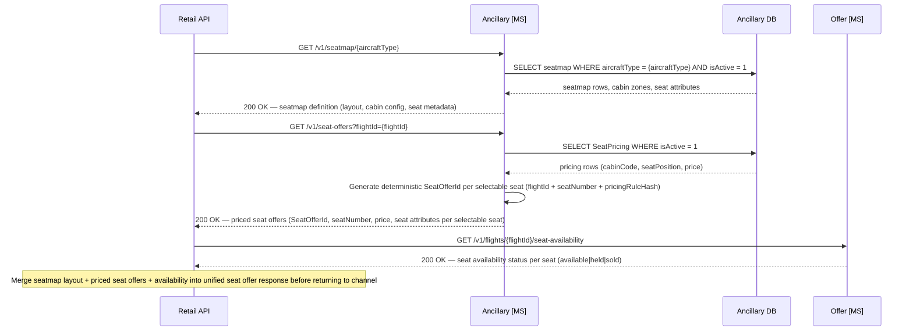
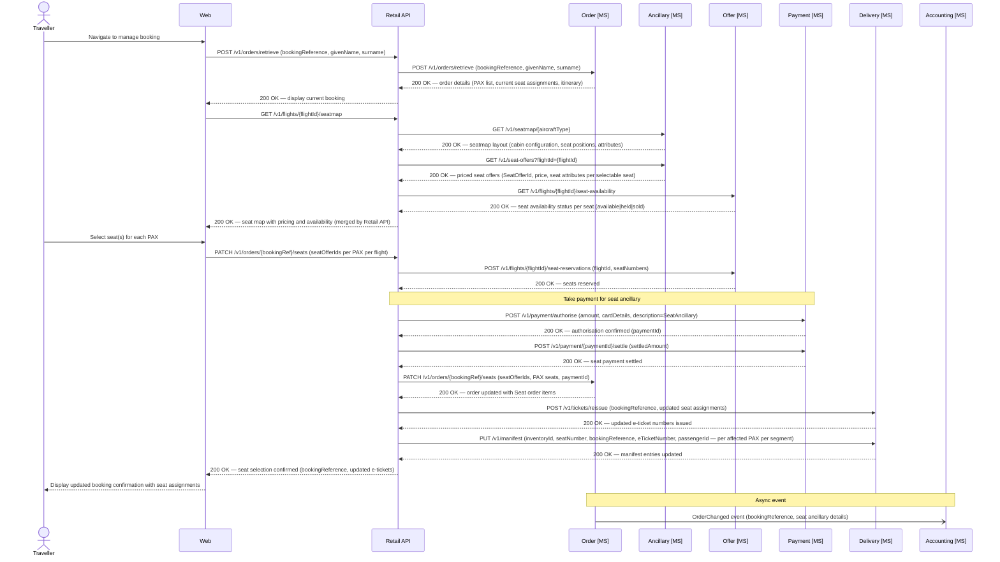
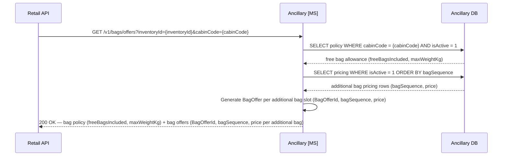
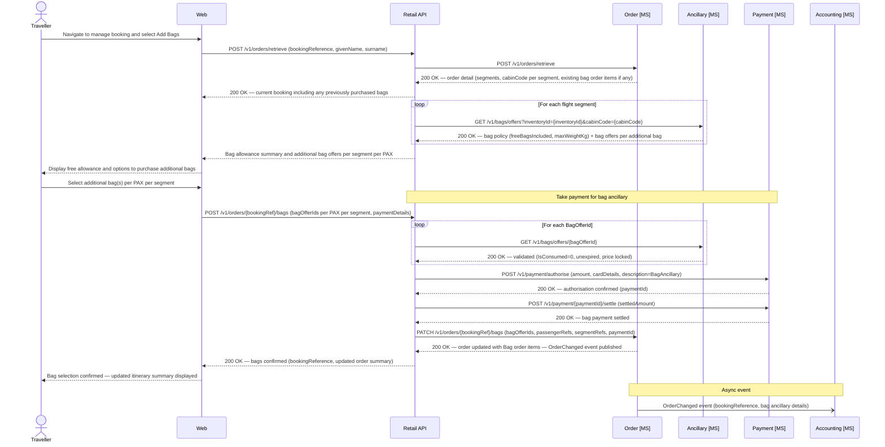

# Ancillary domain

## Overview

The Ancillary microservice is the system of record for seat ancillaries (seatmap definitions, fleet-wide seat pricing rules, and seat offer generation) and bag ancillaries (checked baggage policies and bag pricing rules, including bag offer generation).

- Seat and bag ancillaries are distinct capability areas within the same bounded context. They share an Ancillary DB but otherwise operate independently.
- The Ancillary MS does **not** manage operational baggage handling, DCS functions, or per-flight seat availability — those are outside the scope of this design.
- `SeatOfferId` values are deterministic identifiers generated from `flightId + seatNumber + pricingRuleHash`. `BagOfferId` values are deterministic identifiers generated from `inventoryId + cabinCode + bagSequence`. Neither requires a dedicated offer storage table.

---

## Seat ancillary

The Ancillary MS owns seatmap definitions, aircraft type records, fleet-wide seat pricing rules, and seat offer generation. Seat availability (held/sold/available per flight) is a separate concern owned by the Offer MS.

Seat prices are fleet-wide and position-based (not per flight):

| Position | Price |
|---|---|
| Window | £70.00 |
| Aisle | £50.00 |
| Middle | £20.00 |

Business Class and First Class seat selection is included in the fare with no ancillary charge (cabin codes `J` and `F`).

### Retrieve seatmap layout

The Ancillary MS returns the physical cabin layout (`GET /v1/seatmap/{aircraftType}`) and priced seat offers (`GET /v1/seat-offers?flightId={flightId}`). Seat availability status (available, held, or sold) is served by the Offer MS via `GET /v1/flights/{flightId}/seat-availability`. The Retail API retrieves layout and priced offers from the Ancillary MS, availability from the Offer MS, and merges all three datasets before returning the seat offer response to the channel.



*Ref: ancillary seat - Retail API retrieves seatmap layout and pricing from Ancillary MS, seat availability from Offer MS, then merges all three datasets into the seat offer response*

### Post-sale seat selection

Post-sale seat selection presents the live seatmap with real-time availability and updates the manifest and e-tickets on confirmation. Full ancillary charge applies. Seats assigned during OLCI (check-in) are free of charge — see the Online Check-In flow in the Delivery section.



*Ref: ancillary seat - post-sale seat selection with payment, e-ticket reissuance, and manifest update*

> **Ancillary document:** The Retail API must create a `delivery.Document` record (type `SeatAncillary`) via the Delivery MS for each seat purchase at order confirmation and post-sale, enabling the Accounting system to account for seat ancillary revenue independently of the fare ticket.

### Data schema — `ancillary.AircraftType`

| Column | Type | Nullable | Default | Key | Notes |
|---|---|---|---|---|---|
| AircraftTypeCode | CHAR(4) | No | | PK | 4-char code: manufacturer prefix + 3-digit variant, e.g. `A351` (A350-1000), `B789` (B787-9), `A339` (A330-900) |
| Manufacturer | VARCHAR(50) | No | | | e.g. `Airbus`, `Boeing` |
| FriendlyName | VARCHAR(100) | Yes | | | e.g. `Airbus A350-1000`, `Boeing 787-9` |
| TotalSeats | SMALLINT | No | | | Total seat count across all cabins |
| CabinCounts | NVARCHAR(MAX) | Yes | | | JSON array of cabin seat counts, e.g. `[{"cabin": "J", "count": 32}, {"cabin": "W", "count": 56}, {"cabin": "Y", "count": 281}]` |
| IsActive | BIT | No | `1` | | |
| CreatedAt | DATETIME2 | No | SYSUTCDATETIME() | | |
| UpdatedAt | DATETIME2 | No | SYSUTCDATETIME() | | |

### Data schema — `ancillary.Seatmap`

| Column | Type | Nullable | Default | Key | Notes |
|---|---|---|---|---|---|
| SeatmapId | UNIQUEIDENTIFIER | No | NEWID() | PK | |
| AircraftTypeCode | CHAR(4) | No | | FK → `ancillary.AircraftType(AircraftTypeCode)` | |
| Version | INT | No | `1` | | Incremented when the layout is updated |
| IsActive | BIT | No | `1` | | Only one active seatmap per aircraft type at any time |
| CreatedAt | DATETIME2 | No | SYSUTCDATETIME() | | |
| UpdatedAt | DATETIME2 | No | SYSUTCDATETIME() | | |
| CabinLayout | NVARCHAR(MAX) | No | | | JSON document containing full cabin and seat definitions (see example below) |

> **Indexes:** `IX_Seatmap_AircraftType` on `(AircraftTypeCode)` WHERE `IsActive = 1`.
> **Constraints:** `CHK_CabinLayout` — `ISJSON(CabinLayout) = 1`.

### Data schema — `ancillary.SeatPricing`

| Column | Type | Nullable | Default | Key | Notes |
|---|---|---|---|---|---|
| SeatPricingId | UNIQUEIDENTIFIER | No | NEWID() | PK | |
| CabinCode | CHAR(1) | No | | UK (with SeatPosition, CurrencyCode) | `W` (Premium Economy) · `Y` (Economy); Business (J/F) carries no ancillary charge |
| SeatPosition | VARCHAR(10) | No | | UK (with CabinCode, CurrencyCode) | `Window` · `Aisle` · `Middle` |
| CurrencyCode | CHAR(3) | No | `'GBP'` | UK (with CabinCode, SeatPosition) | ISO 4217 currency code |
| Price | DECIMAL(10,2) | No | | | |
| IsActive | BIT | No | `1` | | |
| ValidFrom | DATETIME2 | No | | | Effective start of this pricing rule |
| ValidTo | DATETIME2 | Yes | | | Null = open-ended / currently active |
| CreatedAt | DATETIME2 | No | SYSUTCDATETIME() | | |
| UpdatedAt | DATETIME2 | No | SYSUTCDATETIME() | | |

> **Constraints:** `UQ_SeatPricing_CabinPosition` (unique) on `(CabinCode, SeatPosition, CurrencyCode)`.
> **Pricing scope:** Fleet-wide, route-agnostic. Business (J) and First (F) are excluded.
> **Example seed data:** `('W', 'Window', 'GBP', 70.00)` · `('W', 'Aisle', 'GBP', 50.00)` · `('W', 'Middle', 'GBP', 20.00)` · `('Y', 'Window', 'GBP', 70.00)` · `('Y', 'Aisle', 'GBP', 50.00)` · `('Y', 'Middle', 'GBP', 20.00)`.

**Example `CabinLayout` JSON document**

The JSON is structured as an ordered array of cabins, each containing a column configuration and an array of rows. Each seat carries its label, position, and physical attributes. Pricing and availability are **not** embedded here — pricing is returned by the Ancillary MS via `GET /v1/seat-offers?flightId={flightId}` and availability by the Offer MS via `GET /v1/flights/{flightId}/seat-availability`; all three are merged by the Retail API before the seatmap is returned to the channel. The `isSelectable` flag reflects only whether a seat is physically available for selection (not a crew seat, structural block, or permanently closed position).

```json
{
  "aircraftType": "A351",
  "version": 1,
  "totalSeats": 369,
  "cabins": [
    {
      "cabinCode": "J",
      "cabinName": "Business Class",
      "deckLevel": "Main",
      "startRow": 1,
      "endRow": 10,
      "columns": ["A", "D", "G", "K"],
      "layout": "1-2-1",
      "rows": [
        {
          "rowNumber": 1,
          "seats": [
            { "seatNumber": "1A", "column": "A", "type": "Suite", "position": "Window", "attributes": ["ExtraLegroom", "BulkheadForward"], "isSelectable": true },
            { "seatNumber": "1D", "column": "D", "type": "Suite", "position": "Aisle",  "attributes": ["ExtraLegroom", "BulkheadForward"], "isSelectable": true }
          ]
        }
      ]
    },
    {
      "cabinCode": "W",
      "cabinName": "Premium Economy",
      "deckLevel": "Main",
      "startRow": 20,
      "endRow": 28,
      "columns": ["A", "B", "D", "E", "F", "H", "K"],
      "layout": "2-3-2",
      "rows": []
    },
    {
      "cabinCode": "Y",
      "cabinName": "Economy",
      "deckLevel": "Main",
      "startRow": 35,
      "endRow": 62,
      "columns": ["A", "B", "C", "D", "E", "F", "G", "H", "K"],
      "layout": "3-3-3",
      "rows": []
    }
  ]
}
```

**Known aircraft configurations:**

| Aircraft | Total Seats | Business (J) | Premium Economy (W) | Economy (Y) | Layout (Y) |
|----------|-------------|--------------|----------------------|-------------|------------|
| A351 | 369 | Rows 1–10, 1-2-1 | Rows 20–28, 2-3-2 | Rows 35–62, 3-3-3 | 3-3-3 |
| B789 | 296 | Rows 1–10, 1-1-1 | Rows 20–27, 2-3-2 | Rows 33–55, 3-3-3 | 3-3-3 |
| A339 | 326 | Rows 1–10, 1-2-1 | Rows 20–27, 2-3-2 | Rows 33–55, 3-4-3 | 3-4-3 |

---

## Bag ancillary

The Ancillary MS is the system of record for checked baggage policies and ancillary bag pricing. Free bag allowance is determined by cabin class; bag prices are fleet-wide and uniform across all routes.

Free checked bag allowances by cabin:

| Cabin | Free Bags Included | Max Weight per Bag |
|---|---|---|
| Economy (Y) | 1 bag | 23 kg |
| Premium Economy (W) | 2 bags | 23 kg |
| Business / First (J/F) | 2 bags | 32 kg |

Additional bag pricing (per bag, per segment):

| Additional Bag | Price |
|---|---|
| 1st additional bag | £60.00 |
| 2nd additional bag | £80.00 |
| 3rd+ additional bag | £100.00 |

### Retrieve bag allowance and offers

The Retail API queries the Ancillary MS to obtain the passenger's free entitlement and a set of priced `BagOffer` objects for additional bags. Since bag pricing is stable and not volatile, bag offers are generated deterministically on request rather than stored as snapshots.



*Ref: ancillary bag - bag allowance policy and priced bag offer retrieval*

### Post-sale bag selection

Customers may add checked bags to a confirmed booking at any time before OLCI opens via the manage-booking flow.



*Ref: ancillary bag - post-sale additional bag purchase with payment and order update*

> **Ancillary document:** The Retail API must create a `delivery.Document` record (type `BagAncillary`) via the Delivery MS for each bag purchase, enabling the Accounting system to account for bag ancillary revenue independently of the fare ticket.

### Data schema — `ancillary.BagPolicy`

| Column | Type | Nullable | Default | Key | Notes |
|---|---|---|---|---|---|
| PolicyId | UNIQUEIDENTIFIER | No | NEWID() | PK | |
| CabinCode | CHAR(1) | No | | UK | `F` · `J` · `W` · `Y` |
| FreeBagsIncluded | TINYINT | No | | | Number of free checked bags included in fare for this cabin |
| MaxWeightKgPerBag | TINYINT | No | | | Maximum weight per individual bag in kilograms |
| IsActive | BIT | No | `1` | | |
| CreatedAt | DATETIME2 | No | SYSUTCDATETIME() | | |
| UpdatedAt | DATETIME2 | No | SYSUTCDATETIME() | | |

> **Constraints:** `UNIQUE` on `(CabinCode)` — one active policy per cabin.
> **Example seed data:** `('J', 2, 32)` · `('F', 2, 32)` · `('W', 2, 23)` · `('Y', 1, 23)`.

### Data schema — `ancillary.BagPricing`

| Column | Type | Nullable | Default | Key | Notes |
|---|---|---|---|---|---|
| PricingId | UNIQUEIDENTIFIER | No | NEWID() | PK | |
| BagSequence | TINYINT | No | | UK (with CurrencyCode) | `1` = 1st additional bag · `2` = 2nd additional · `99` = 3rd and beyond (catch-all) |
| CurrencyCode | CHAR(3) | No | `'GBP'` | UK (with BagSequence) | ISO 4217 currency code |
| Price | DECIMAL(10,2) | No | | | |
| IsActive | BIT | No | `1` | | |
| ValidFrom | DATETIME2 | No | | | Effective start of this pricing rule |
| ValidTo | DATETIME2 | Yes | | | Null = open-ended / currently active |
| CreatedAt | DATETIME2 | No | SYSUTCDATETIME() | | |
| UpdatedAt | DATETIME2 | No | SYSUTCDATETIME() | | |

> **Constraints:** `UQ_BagPricing_Sequence` (unique) on `(BagSequence, CurrencyCode)`.
> **Example seed data:** `(1, 'GBP', 60.00)` · `(2, 'GBP', 80.00)` · `(99, 'GBP', 100.00)`.
