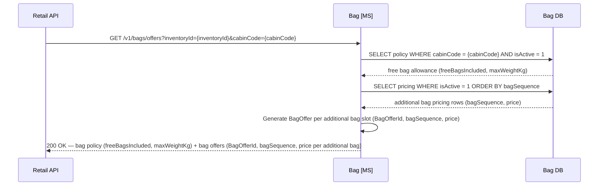
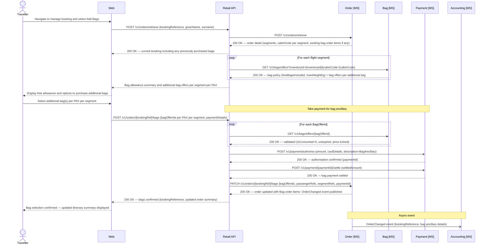

# Bag domain

## Overview

The Bag microservice is the system of record for checked baggage policies and ancillary bag pricing, returning both the free allowance and priced offers for additional bags.

- Free bag allowance is determined by cabin class; bag prices are fleet-wide and uniform across all routes.
- The Bag MS does **not** manage operational baggage handling or DCS functions — those are outside the scope of this design.
- `BagOfferId` values are deterministic identifiers generated by the Bag MS from `inventoryId + cabinCode + bagSequence` and do not require a dedicated storage table since bag pricing is stable.

Free checked bag allowances by cabin:

| Cabin | Free Bags Included | Max Weight per Bag |
|---|---|---|
| Economy (Y) | 1 bag | 23 kg |
| Premium Economy (W) | 2 bags | 23 kg |
| Business / First (J/F) | 2 bags | 32 kg |

Additional bag pricing (per bag, per segment):

| Additional Bag | Price |
|---|---|
| 1st additional bag | £60.00 |
| 2nd additional bag | £80.00 |
| 3rd+ additional bag | £100.00 |

## Retrieve bag allowance and offers

The Retail API queries the Bag MS to obtain the passenger's free entitlement and a set of priced `BagOffer` objects for additional bags.

- Since bag pricing is stable and not volatile, bag offers are generated deterministically on request rather than stored as snapshots. The `BagOfferId` encodes the inventory, cabin, and bag sequence, making it resolvable without a stored record.
- The returned `BagOfferId` is passed to the Order MS at purchase and used to recall the Bag MS for price confirmation at order confirmation time.

*Ref: ancillary bag - bag allowance policy and priced bag offer retrieval*

## Post-sale bag selection

Customers may add checked bags to a confirmed booking at any time before OLCI opens via the manage-booking flow.

- Free cabin allowance is displayed automatically; additional bags beyond the allowance are chargeable.
- Each additional bag purchased creates a separate `Bag` order item with its own `BagOfferId` and payment reference; free bags carry no charge and generate no order items.

*Ref: ancillary bag - post-sale additional bag purchase with payment and order update*

> **Ancillary document:** The Retail API must create a `delivery.Document` record (type `BagAncillary`) via the Delivery MS for each bag purchase, enabling the Accounting system to account for bag ancillary revenue independently of the fare ticket.

## Bag MS endpoints

**Offer / query endpoints (called by Retail API during the booking path)**

| Method | Endpoint | Description |
|--------|----------|-------------|
| `GET` | `/v1/bags/offers?inventoryId={inventoryId}&cabinCode={cabinCode}` | Generate and return the free bag policy and priced bag offers for a flight and cabin; returns one `BagOfferId` per available bag tier; `BagOfferId` is deterministic (stateless — no DB write required) |
| `GET` | `/v1/bags/offers/{bagOfferId}` | Retrieve and validate a bag offer by deterministic ID; confirms the pricing rule that generated the ID is still active and returns the current price; used by Retail API when adding bags to a basket or confirming a bag purchase |

**Admin endpoints (called from a future Contact Centre admin app — not channel-facing)**

| Method | Endpoint | Description |
|--------|----------|-------------|
| `GET` | `/v1/bag-policies` | List all bag allowance policies |
| `POST` | `/v1/bag-policies` | Create a new bag allowance policy (`cabinCode`, `freeBagsIncluded`, `maxWeightKgPerBag`) |
| `GET` | `/v1/bag-policies/{policyId}` | Retrieve a bag policy by ID |
| `PUT` | `/v1/bag-policies/{policyId}` | Update a bag allowance policy |
| `DELETE` | `/v1/bag-policies/{policyId}` | Delete a bag allowance policy |
| `GET` | `/v1/bag-pricing` | List all bag pricing rules |
| `POST` | `/v1/bag-pricing` | Create a new bag pricing rule (`bagSequence`, `currencyCode`, `price`, `validFrom`, `validTo`) |
| `GET` | `/v1/bag-pricing/{pricingId}` | Retrieve a bag pricing rule by ID |
| `PUT` | `/v1/bag-pricing/{pricingId}` | Update a bag pricing rule |
| `DELETE` | `/v1/bag-pricing/{pricingId}` | Delete a bag pricing rule |

## Data schema — `bag.BagPolicy`

| Column | Type | Nullable | Default | Key | Notes |
|---|---|---|---|---|---|
| PolicyId | UNIQUEIDENTIFIER | No | NEWID() | PK | |
| CabinCode | CHAR(1) | No | | UK | `F` · `J` · `W` · `Y` |
| FreeBagsIncluded | TINYINT | No | | | Number of free checked bags included in fare for this cabin |
| MaxWeightKgPerBag | TINYINT | No | | | Maximum weight per individual bag in kilograms |
| IsActive | BIT | No | `1` | | |
| CreatedAt | DATETIME2 | No | SYSUTCDATETIME() | | |
| UpdatedAt | DATETIME2 | No | SYSUTCDATETIME() | | |

> **Example seed data:** `('J', 2, 32)` · `('F', 2, 32)` · `('W', 2, 23)` · `('Y', 1, 23)`.
> **One active policy per cabin:** The `UNIQUE` constraint on `CabinCode` enforces a single active bag policy per cabin code. Policy changes should be managed by updating the existing row rather than inserting new rows.

## Data schema — `bag.BagPricing`

| Column | Type | Nullable | Default | Key | Notes |
|---|---|---|---|---|---|
| PricingId | UNIQUEIDENTIFIER | No | NEWID() | PK | |
| BagSequence | TINYINT | No | | UK (with CurrencyCode) | `1` = 1st additional bag beyond free allowance · `2` = 2nd additional · `99` = 3rd and beyond (catch-all) |
| CurrencyCode | CHAR(3) | No | `'GBP'` | UK (with BagSequence) | ISO 4217 currency code |
| Price | DECIMAL(10,2) | No | | | |
| IsActive | BIT | No | `1` | | |
| ValidFrom | DATETIME2 | No | | | Effective start of this pricing rule |
| ValidTo | DATETIME2 | Yes | | | Null = open-ended / currently active |
| CreatedAt | DATETIME2 | No | SYSUTCDATETIME() | | |
| UpdatedAt | DATETIME2 | No | SYSUTCDATETIME() | | |

> **Constraints:** `UQ_BagPricing_Sequence` (unique) on `(BagSequence, CurrencyCode)` — enforces one active price per bag sequence/currency combination.
> **Example seed data:** `(1, 'GBP', 60.00)` · `(2, 'GBP', 80.00)` · `(99, 'GBP', 100.00)`.

> **Bag offer storage:** Bag offers are generated deterministically by the Bag MS on request and do not require a stored snapshot table. The `BagOfferId` encodes `inventoryId + cabinCode + bagSequence` and can be resolved at any time by calling `GET /v1/bags/offers/{bagOfferId}` on the Bag MS. This endpoint returns the current pricing for the identified offer, allowing the Retail API to confirm the price stored in the basket at order confirmation. Since bag pricing is stable (not volatile), there is no risk of price drift between offer generation and purchase.
> **Bag offer endpoint:** `GET /v1/bags/offers/{bagOfferId}` — the Bag MS must expose this endpoint (already defined in `api-reference.md`) so the Retail API can recall the Bag MS with the stored `BagOfferId` to validate and confirm the current price before committing a bag purchase. No consumption state is tracked; the Retail API's validation confirms the offer is still valid by checking that the underlying pricing rule has not changed.
>
> **Ancillary document:** The Retail API must create a `delivery.Document` record (type `BagAncillary`) via the Delivery MS for each bag purchase, enabling the Accounting system to account for bag ancillary revenue independently of the fare ticket.
