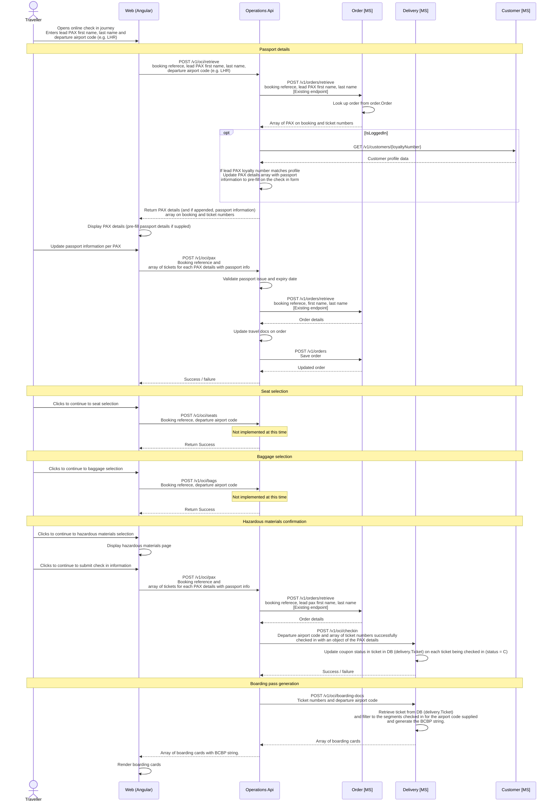

# Online check-in

Online check-in (OLCI) opens 24 hours before departure, allowing passengers to submit **Advance Passenger Information (API)** data and generate boarding passes.

- Completing OLCI moves each passenger to `checkedIn` status on the flight manifest, enabling boarding pass generation.
- The 24-hour window aligns with APIS submission cut-off times and prevents stale travel document data.
- Seat assignment (free of charge at OLCI) and bag additions are both available within the OLCI flow.



## APIs and microservices

The following APIs and microservices are involved in the online check-in flow.

### Operations API

| Method | Path | Description | Request | Response |
|--------|------|-------------|---------|----------|
| `POST` | `/v1/oci/retrieve` | Retrieve booking for check-in by booking reference, lead PAX name, and departure airport code; optionally pre-fills passport data from loyalty profile | `{`<br>`  "bookingReference": "AB1234",`<br>`  "firstName": "Alex",`<br>`  "lastName": "Taylor",`<br>`  "departureAirport": "LHR"`<br>`}` | `{`<br>`  "bookingReference": "AB1234",`<br>`  "checkInEligible": true,`<br>`  "passengers": [{`<br>`    "passengerId": "PAX-1",`<br>`    "ticketNumber": "932-1234567890",`<br>`    "givenName": "Alex",`<br>`    "surname": "Taylor",`<br>`    "passengerTypeCode": "ADT",`<br>`    "travelDocument": null`<br>`  }]`<br>`}` |
| `POST` | `/v1/oci/pax` | Submit or update passport and travel document details for each PAX on the booking; validates passport dates and persists to order | `{`<br>`  "bookingReference": "AB1234",`<br>`  "passengers": [{`<br>`    "ticketNumber": "932-1234567890",`<br>`    "travelDocument": {`<br>`      "type": "PASSPORT",`<br>`      "number": "PA1234567",`<br>`      "issuingCountry": "GBR",`<br>`      "nationality": "GBR",`<br>`      "issueDate": "2019-06-01",`<br>`      "expiryDate": "2030-01-01"`<br>`    }`<br>`  }]`<br>`}` | `{`<br>`  "bookingReference": "AB1234",`<br>`  "success": true`<br>`}` |
| `POST` | `/v1/oci/seats` | Submit seat selection for the booking (not implemented) | — | — |
| `POST` | `/v1/oci/bags` | Submit baggage selection for the booking (not implemented) | — | — |

---

### Order microservice

| Method | Path | Description | Request | Response |
|--------|------|-------------|---------|----------|
| `POST` | `/v1/orders/retrieve` | Retrieve an existing order by booking reference and lead PAX name; returns PAX details, ticket numbers, and full order data | `{`<br>`  "bookingReference": "AB1234",`<br>`  "surname": "Taylor"`<br>`}` | `{`<br>`  "orderId": "a1b2c3d4-...",`<br>`  "bookingReference": "AB1234",`<br>`  "orderStatus": "Confirmed",`<br>`  "channelCode": "WEB",`<br>`  "currencyCode": "GBP",`<br>`  "totalAmount": 2950.00,`<br>`  "version": 3,`<br>`  "orderData": { }`<br>`}` |
| `POST` | `/v1/orders` | Persist an updated order; used to save travel document changes back to the order record | Full order object with updated `orderData` | `{`<br>`  "orderId": "a1b2c3d4-...",`<br>`  "bookingReference": "AB1234",`<br>`  "version": 4`<br>`}` |

---

### Customer microservice

| Method | Path | Description | Request | Response |
|--------|------|-------------|---------|----------|
| `GET` | `/v1/customers/{loyaltyNumber}` | Retrieve a customer profile by loyalty number; used to pre-fill passport information when the traveller is logged in | — | `{`<br>`  "customerId": "c1a2b3d4-...",`<br>`  "loyaltyNumber": "AX12345678",`<br>`  "givenName": "Alex",`<br>`  "surname": "Taylor",`<br>`  "dateOfBirth": "1985-03-12",`<br>`  "nationality": "GBR",`<br>`  "passportNumber": "PA1234567",`<br>`  "passportIssueDate": "2019-06-01",`<br>`  "passportIssuer": "GBR",`<br>`  "passportExpiryDate": "2030-01-01",`<br>`  "tierCode": "Silver",`<br>`  "pointsBalance": 12500,`<br>`  "isActive": true`<br>`}` |

---

### Delivery microservice

| Method | Path | Description | Request | Response |
|--------|------|-------------|---------|----------|
| `POST` | `/v1/oci/checkin` | Check in a set of tickets for a departure airport; updates coupon status to `C` on each ticket in `delivery.Ticket` | `{`<br>`  "departureAirport": "LHR",`<br>`  "tickets": [{`<br>`    "ticketNumber": "932-1234567890",`<br>`    "passengerId": "PAX-1",`<br>`    "givenName": "Alex",`<br>`    "surname": "Taylor"`<br>`  }]`<br>`}` | `{`<br>`  "checkedIn": 1,`<br>`  "tickets": [{`<br>`    "ticketNumber": "932-1234567890",`<br>`    "status": "C"`<br>`  }]`<br>`}` |
| `POST` | `/v1/oci/boarding-docs` | Generate boarding documents (with BCBP) for a set of ticket numbers and departure airport; returns an array of boarding cards for the checked-in segments | `{`<br>`  "departureAirport": "LHR",`<br>`  "ticketNumbers": [`<br>`    "932-1234567890"`<br>`  ]`<br>`}` | `{`<br>`  "boardingCards": [{`<br>`    "ticketNumber": "932-1234567890",`<br>`    "passengerId": "PAX-1",`<br>`    "flightNumber": "AX003",`<br>`    "departureDate": "2026-08-15",`<br>`    "seatNumber": "1A",`<br>`    "cabinCode": "J",`<br>`    "sequenceNumber": "0001",`<br>`    "origin": "LHR",`<br>`    "destination": "JFK",`<br>`    "bcbpString": "M1TAYLOR/ALEX..."`<br>`  }]`<br>`}` |

## Boarding pass barcode string

Each boarding card issued by the Delivery microservice includes a barcode string compliant with **IATA Resolution 792** (Bar Coded Boarding Pass — BCBP). This string is used directly to generate the physical barcode on printed boarding passes and the QR code displayed in the mobile app. Both formats encode identical data; the presentation layer determines the rendering.

The format is a structured plaintext string with fixed-width and positional fields. An example for a single-leg boarding pass:

```
M1TAYLOR/ALEX        EAB1234 LHRJFKAX 0003 042J001A0001 156>518 W6042 AX 2A00000012345678 JAX7KLP2NZR901A
```

The fields break down as follows:

| Segment | Value in example | Description |
|---|---|---|
| `M1` | `M1` | Format code (`M`) + number of legs encoded (`1`) |
| `TAYLOR/ALEX` | `TAYLOR/ALEX` | Passenger name — surname / given name, padded to 20 chars |
| `EAB1234` | `EAB1234` | Electronic ticket indicator (`E`) + PNR / booking reference |
| `LHR` | `LHR` | Origin IATA airport code |
| `JFK` | `JFK` | Destination IATA airport code |
| `AX` | `AX` | Operating carrier IATA code (Apex Air) |
| `0003` | `0003` | Flight number, padded to 4 chars |
| `042` | `042` | Julian date of flight departure |
| `J` | `J` | Cabin / booking class code |
| `001A` | `001A` | Seat number, padded to 4 chars |
| `0001` | `0001` | Sequence / check-in number |
| `1` | `1` | Passenger status code (`1` = checked in) |
| `56>518` | `56>518` | Conditional item size indicator and version number (BCBP version 6) |
| `W6042` | `W6042` | Julian date of issue + ticket issuer code |
| `AX` | `AX` | Operating carrier for this leg (repeated in conditional section) |
| `2A00000012345678` | `2A00000012345678` | Frequent flyer / loyalty number |
| `JAX7KLP2NZR901A` | `JAX7KLP2NZR901A` | Airline-specific free-text data (selectee indicator, document verification, etc.) |

The Delivery microservice is responsible for assembling this string at the point of boarding card generation, drawing on data from the `delivery.Manifest` row and the confirmed order. The barcode string is returned in the boarding card payload alongside human-readable fields; channels render it using their preferred barcode library (e.g. PDF417 for print, QR for mobile).
