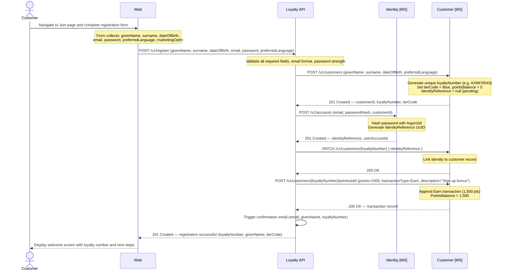
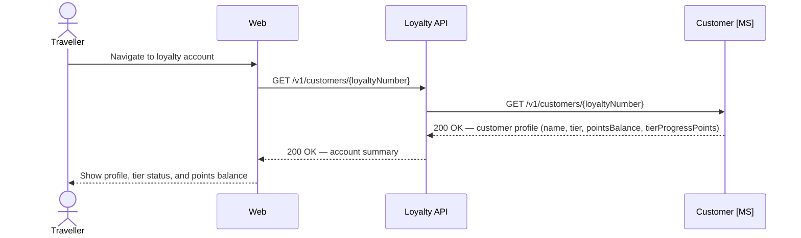
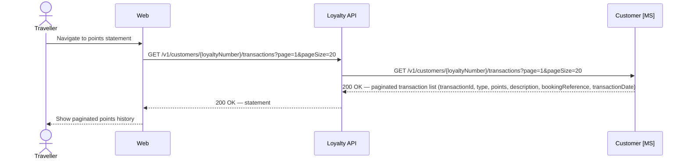
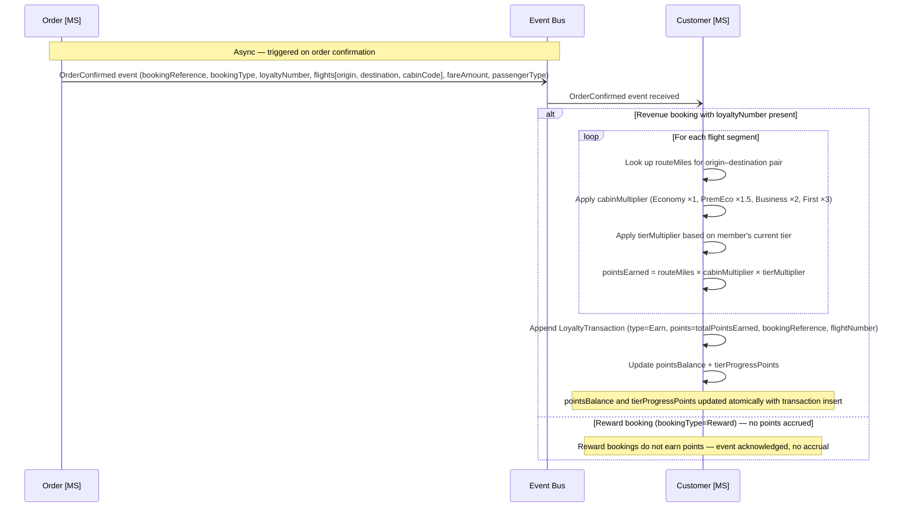
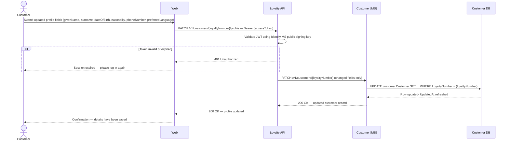
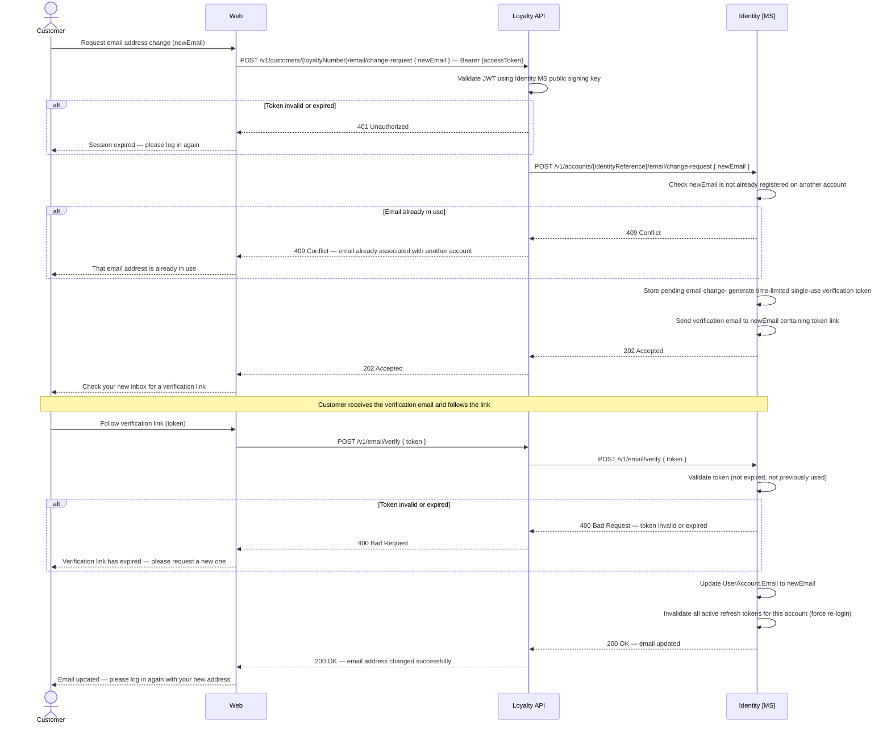
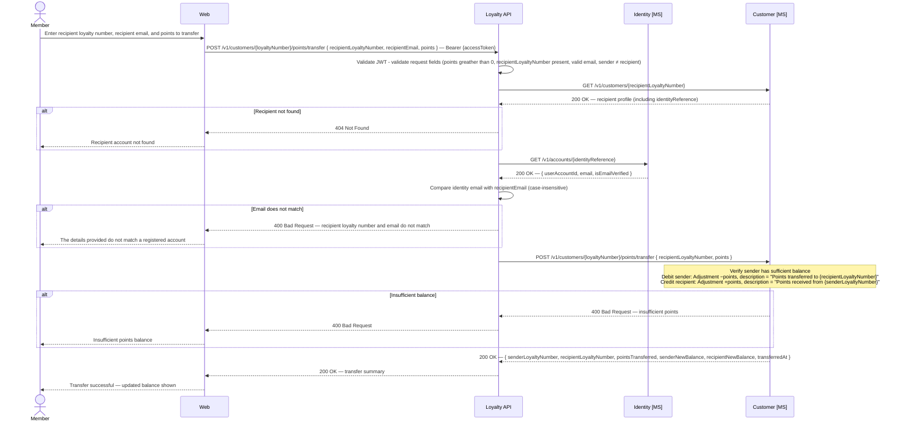

# Customer domain
The Customer microservice is the system of record for loyalty programme membership — holding each customer's profile, tier status, points balance, and transaction history.

- Accounts are identified by a unique loyalty number issued at registration.
- Authentication credentials are owned exclusively by the **Identity microservice**; the Customer DB holds only an opaque `IdentityReference` linking the two domains.
- The separation means Customer never handles credentials and Identity never holds loyalty or profile data.

### Register for the Loyalty Programme

Registration creates two linked records — an Identity account (email and password) and a Customer loyalty account (profile and points balance) — joined by an `IdentityReference` UUID.

- On success, the customer receives a unique loyalty number and is assigned to the base tier (`Blue`).
- A confirmation email is triggered by the Loyalty API once all three steps complete successfully.
- **Creation order:** The Customer record is created first (without an `identityReference`), then the Identity account is created, and finally the Customer record is patched to link the returned `identityReference`. This ensures the customer entity exists before any authentication credential is associated with it.
- **Failure handling:** See the sequence diagram notes for the per-step rollback responsibilities.

*Ref: customer loyalty - registration flow creating linked identity and loyalty accounts*

> **Email verification:** The `IsEmailVerified` flag on `identity.UserAccount` is set to `0` at registration. The confirmation email contains a one-time verification link. On click, a separate `POST /v1/accounts/{userAccountId}/verify-email` call is made to the Identity microservice to set `IsEmailVerified = 1`. Unverified accounts may still log in but are restricted from certain actions (e.g. redemptions) until verified.

> **Duplicate email handling:** The Identity microservice enforces a unique constraint on `Email`. If a registration attempt arrives for an address that already exists, the Identity microservice returns `409 Conflict`. The Loyalty API surfaces this as a validation error to the channel — it must not reveal whether the email belongs to an existing account (to prevent account enumeration).

> **Failure handling:** Registration is a three-step process. If the Customer microservice call (step 1) fails, the Loyalty API returns an error immediately with no cleanup required. If the Identity microservice call (step 2) fails, the Loyalty API must call `DELETE /v1/customers/{customerId}` on the Customer microservice to remove the orphaned customer record before returning an error. If the `PATCH` to link the identity (step 3) fails, the Loyalty API must call both `DELETE /v1/accounts/{userAccountId}` on the Identity microservice and `DELETE /v1/customers/{customerId}` on the Customer microservice. Partial registration states must not be left in the system.

### Retrieve Account and Points Balance

The loyalty dashboard surfaces a member's account summary and is also used to provide loyalty context during the booking flow.

- Two key values displayed separately: **PointsBalance** (redeemable currency for award bookings) and **TierProgressPoints** (qualifying activity towards tier status).
- Member tier — Blue, Silver, Gold, or Platinum — determines flight benefits including lounge access, priority boarding, and earn-rate multipliers.
- Showing tier progress alongside redeemable balance is a deliberate engagement mechanism giving members visibility of progress toward the next threshold.

*Ref: customer loyalty - retrieve account profile, tier status, and points balance*

---

### Retrieve Transaction History

The points statement is the immutable audit trail of every points movement on a loyalty account — an important trust mechanism for FFP members.

- `LoyaltyTransaction` is an append-only log; each row is a permanent record with a running `BalanceAfter` snapshot.
- Transactions returned in reverse-chronological order and paginated; channels must support pagination for long-standing members with extensive history.

*Ref: customer loyalty - retrieve paginated points transaction history*

#### Transaction Types

Each `LoyaltyTransaction` row carries a `TransactionType` that describes why points were added or removed. The following types are supported:

| Type | Points&nbsp;Direction | When Used | Example |
|---|---|---|---|
| `Earn` | Positive | Points accrued when a customer completes a flight. Calculated from fare paid, cabin class, and tier at time of travel. Also used for welcome bonuses on new registrations. | *+8,750 pts — Flight LHR-JFK-LHR, Business Flex* |
| `Redeem` | Negative | Points spent against a future booking such as an award flight or cabin upgrade. | *−5,000 pts — Upgrade to Business Class* |
| `Adjustment` | Positive or Negative | Manual correction applied by a customer service agent, or a member-initiated points transfer. Covers goodwill gestures, error corrections, partner earn reconciliations, and peer-to-peer transfers. | *+2,500 pts — Goodwill gesture, disruption on AX301*; *−500 pts — Points transferred to AX1234567* |
| `Expiry` | Negative | Points removed automatically when an account fails to meet the programme's activity threshold within the defined period. Triggered by a scheduled background process. | *−1,500 pts — Activity threshold not met* |
| `Reinstate` | Positive | Reversal of a previous `Expiry` or erroneous `Redeem` transaction. Typically initiated by a customer service agent after review. | *+1,500 pts — Reinstatement of expired points (case #4412)* |

> **Sign convention:** `PointsDelta` is positive for credits (`Earn`, `Reinstate`, positive `Adjustment`) and negative for debits (`Redeem`, `Expiry`, negative `Adjustment`). The `BalanceAfter` column always reflects the running total after the transaction is applied.

---

### Earn Points on Booking Confirmation

On order confirmation, the Order MS publishes an `OrderConfirmed` event; if the booking includes a loyalty number, the Customer MS consumes the event and accrues points based on the distance flown (route miles).

- **Revenue bookings only:** Points are accrued on revenue bookings. Reward bookings do not earn points — the customer is redeeming points, not purchasing a fare.
- Points are calculated from the **route miles** (great-circle distance between origin and destination), multiplied by a **cabin class multiplier** and an optional **tier bonus multiplier**.
- The accrual formula is: `pointsEarned = routeMiles × cabinMultiplier × tierMultiplier` (per passenger, per segment).
- For connecting itineraries, each segment earns independently — e.g. DEL→LHR→JFK earns DEL→LHR miles + LHR→JFK miles.
- Calculation logic is encapsulated within the Customer MS; the `OrderConfirmed` event provides the inputs (origin, destination, cabin class, loyalty number).

#### Route Miles Table

Points earned per segment correspond to the great-circle distance in miles between origin and destination. The following table lists the route miles for all Apex Air direct routes from LHR:

| Route | Origin | Destination | Distance (miles) | Points (Economy) |
|-------|--------|-------------|-----------------|------------------|
| LHR — JFK | LHR | JFK | 3,459 | 3,459 |
| LHR — LAX | LHR | LAX | 5,456 | 5,456 |
| LHR — MIA | LHR | MIA | 4,432 | 4,432 |
| LHR — SFO | LHR | SFO | 5,367 | 5,367 |
| LHR — ORD | LHR | ORD | 3,941 | 3,941 |
| LHR — BOS | LHR | BOS | 3,269 | 3,269 |
| LHR — BGI | LHR | BGI | 4,237 | 4,237 |
| LHR — KIN | LHR | KIN | 4,694 | 4,694 |
| LHR — NAS | LHR | NAS | 4,341 | 4,341 |
| LHR — HKG | LHR | HKG | 5,994 | 5,994 |
| LHR — NRT | LHR | NRT | 5,974 | 5,974 |
| LHR — PVG | LHR | PVG | 5,741 | 5,741 |
| LHR — PEK | LHR | PEK | 5,063 | 5,063 |
| LHR — SIN | LHR | SIN | 6,764 | 6,764 |
| LHR — BOM | LHR | BOM | 4,479 | 4,479 |
| LHR — DEL | LHR | DEL | 4,180 | 4,180 |
| LHR — BLR | LHR | BLR | 5,127 | 5,127 |

> **Note:** Route miles are the same in both directions (LHR→JFK = JFK→LHR). The "Points (Economy)" column shows the base accrual before cabin and tier multipliers are applied.

#### Cabin Class Multiplier

| Cabin | Multiplier | Example (LHR–JFK, 3,459 miles) |
|-------|-----------|-------------------------------|
| Economy | ×1.0 | 3,459 pts |
| Premium Economy | ×1.5 | 5,189 pts |
| Business | ×2.0 | 6,918 pts |
| First | ×3.0 | 10,377 pts |

#### Tier Bonus Multiplier

Loyalty tier at time of travel provides an additional multiplier on top of the cabin-adjusted accrual:

| Tier | Bonus Multiplier | Example (LHR–JFK Business = 6,918 base) |
|------|-----------------|----------------------------------------|
| Blue | ×1.0 (no bonus) | 6,918 pts |
| Silver | ×1.25 | 8,648 pts |
| Gold | ×1.5 | 10,377 pts |
| Platinum | ×2.0 | 13,836 pts |

> **Full example:** A Platinum-tier member flying LHR→JFK in Business earns `3,459 miles × 2.0 (Business) × 2.0 (Platinum) = 13,836 points` per segment.

*Ref: customer loyalty - async points accrual triggered by OrderConfirmed event; revenue bookings earn route miles adjusted by cabin class and tier multipliers; reward bookings are excluded from accrual*

---

### Update Profile Details

Customers may update their loyalty profile (name, date of birth, nationality, preferred language, phone, passport details, and Known Traveller Number) at any time via the loyalty portal.

- The Loyalty API validates the JWT using the Identity MS public signing key — no DB round-trip required — before forwarding changes to the Customer MS.
- Updating a loyalty profile name does **not** amend any confirmed booking or issued e-ticket; those records are independent (owned by Order and Delivery MS respectively).
- Name corrections on a confirmed ticket require the manage-booking flow via the Retail API; minor typographical corrections are typically waived, anything beyond that triggers reissuance subject to fare conditions.

*Ref: customer loyalty - update profile details via Loyalty API with JWT validation*

---

### Update Email Address

Email address changes are security-sensitive and follow a two-step verification flow — the new address must be verified before the change takes effect.

- A time-limited verification link is sent to the **new** address; existing credentials remain active until ownership is confirmed.
- On successful verification, all active refresh tokens are invalidated — the customer must re-authenticate with the new address.
- Email is owned entirely by the Identity MS; the Customer DB holds no email field, so no Customer DB update is required.

*Ref: customer loyalty - two-step email address change with verification token and session invalidation*

---

### Transfer Points

A loyalty member may transfer points from their own account to another member's account. To prevent fraud and misdirection, the caller must supply both the recipient's loyalty number and their registered email address — both are verified to match the same account before any points move.

- The sender must have a sufficient `PointsBalance` to cover the transfer; the request is rejected if the balance is insufficient.
- Self-transfer is not permitted — sender and recipient loyalty numbers must differ.
- Both accounts receive an `Adjustment` transaction: a negative delta on the sender's ledger and a positive delta on the recipient's ledger. Each transaction's `Description` field records the counterpart's loyalty number so the movement is traceable on both statements.
- Email verification is performed by the Loyalty API before the Customer MS transfer call: it resolves the recipient's `IdentityReference`, retrieves the registered email from the Identity MS, and compares case-insensitively. If they do not match, the transfer is rejected with `400 Bad Request` before any balance changes are made.
- The debit and credit happen atomically within the Customer MS — either both succeed or neither does.

*Ref: customer loyalty - peer-to-peer points transfer with email verification, debit/credit adjustment transactions, and counterpart loyalty number in description*

---

### Data Schema — Customer

The Customer domain uses three tables: `Customer` (profile, tier, and points balances), `LoyaltyTransaction` (immutable append-only points movement log), and `TierConfig` (qualifying thresholds per tier, used for tier upgrade evaluation).

- `Customer` stores an `IdentityReference` — the only link to the Identity domain; Customer never stores credentials, Identity never stores loyalty or profile data.
- `IdentityReference` is nullable to support legacy accounts or future scenarios where a loyalty account exists without a login.

#### `customer.TierConfig`

| Column | Type | Nullable | Default | Key | Notes |
|---|---|---|---|---|---|
| TierConfigId | UNIQUEIDENTIFIER | No | NEWID() | PK | |
| TierCode | VARCHAR(20) | No | | | `Blue` · `Silver` · `Gold` · `Platinum` |
| TierLabel | VARCHAR(50) | No | | | Display name, e.g. `Apex Silver` |
| MinQualifyingPoints | INT | No | | | Minimum tier progress points required to hold this tier |
| IsActive | BIT | No | `1` | | |
| ValidFrom | DATETIME2 | No | | | Effective start of this tier configuration |
| ValidTo | DATETIME2 | Yes | | | Null = currently active |
| CreatedAt | DATETIME2 | No | SYSUTCDATETIME() | | |
| UpdatedAt | DATETIME2 | No | SYSUTCDATETIME() | | |

> **Indexes:** `IX_TierConfig_Active` on `(TierCode)` WHERE `IsActive = 1`.
> **Versioning:** Rows are never deleted, only superseded. To change tier thresholds, insert a new row with `IsActive = 1` and set `ValidTo` on the previous row.

#### `customer.Customer`

| Column | Type | Nullable | Default | Key | Notes |
|---|---|---|---|---|---|
| CustomerId | UNIQUEIDENTIFIER | No | NEWID() | PK | |
| LoyaltyNumber | VARCHAR(20) | No | | UK | Issued at account creation, e.g. `AX9876543` |
| IdentityReference | UNIQUEIDENTIFIER | Yes | | UK | Opaque ref to Identity DB; null if no login account (e.g. pre-Identity legacy accounts) |
| GivenName | VARCHAR(100) | No | | | |
| Surname | VARCHAR(100) | No | | | |
| DateOfBirth | DATE | Yes | | | |
| Nationality | CHAR(3) | Yes | | | ISO 3166-1 alpha-3 |
| PreferredLanguage | CHAR(5) | Yes | `'en-GB'` | | BCP 47 language tag |
| PhoneNumber | VARCHAR(30) | Yes | | | |
| PassportNumber | VARCHAR(50) | Yes | | | Machine-readable passport document number |
| PassportIssueDate | DATE | Yes | | | Date the passport was issued |
| PassportIssuer | CHAR(2) | Yes | | | ISO 3166-1 alpha-2 country code of the issuing country |
| PassportExpiryDate | DATE | Yes | | | Date the passport expires |
| KnownTravellerNumber | VARCHAR(50) | Yes | | | TSA/CBP Trusted Traveller Programme number (e.g. TSA PreCheck, Global Entry, NEXUS) |
| TierCode | VARCHAR(20) | No | `'Blue'` | | FK ref to `customer.TierConfig(TierCode)` enforced at application layer |
| PointsBalance | INT | No | `0` | | Current redeemable points balance |
| TierProgressPoints | INT | No | `0` | | Qualifying points for tier evaluation; not decremented on redemption |
| IsActive | BIT | No | `1` | | |
| CreatedAt | DATETIME2 | No | SYSUTCDATETIME() | | |
| UpdatedAt | DATETIME2 | No | SYSUTCDATETIME() | | |

> **Indexes:** `IX_Customer_LoyaltyNumber` on `(LoyaltyNumber)`. `IX_Customer_Surname` on `(Surname, GivenName)`.
> **Identity separation:** The Customer table stores only `IdentityReference` — it never stores email addresses or passwords. The FK to `customer.TierConfig` is enforced at the application layer rather than as a DB constraint to avoid cross-table coupling during tier configuration changes.

#### `customer.LoyaltyTransaction`

| Column | Type | Nullable | Default | Key | Notes |
|---|---|---|---|---|---|
| TransactionId | UNIQUEIDENTIFIER | No | NEWID() | PK | |
| CustomerId | UNIQUEIDENTIFIER | No | | FK → `customer.Customer(CustomerId)` | |
| TransactionType | VARCHAR(20) | No | | | `Earn` · `Redeem` · `Adjustment` · `Expiry` · `Reinstate` |
| PointsDelta | INT | No | | | Positive = earned; negative = redeemed or expired |
| BalanceAfter | INT | No | | | Running `PointsBalance` snapshot after this transaction |
| BookingReference | CHAR(6) | Yes | | | Associated booking reference where applicable |
| FlightNumber | VARCHAR(10) | Yes | | | Associated flight where applicable (Earn transactions) |
| Description | VARCHAR(255) | No | | | e.g. `'Points earned — AX003 LHR-JFK, Business Flex'` |
| TransactionDate | DATETIME2 | No | SYSUTCDATETIME() | | |
| CreatedAt | DATETIME2 | No | SYSUTCDATETIME() | | |
| UpdatedAt | DATETIME2 | No | SYSUTCDATETIME() | | |

> **Indexes:** `IX_LoyaltyTransaction_Customer` on `(CustomerId, TransactionDate DESC)`. `IX_LoyaltyTransaction_BookingReference` on `(BookingReference)` WHERE `BookingReference IS NOT NULL`.
> **Immutability:** `LoyaltyTransaction` rows are append-only and must never be updated or deleted. `BalanceAfter` on the most recent transaction is the source of truth for a customer's points balance in the event of any discrepancy with the `PointsBalance` column.

> **Points balance integrity:** `PointsBalance` and `TierProgressPoints` on `customer.Customer` are updated atomically within the same database transaction as the `LoyaltyTransaction` insert. The `BalanceAfter` column on each transaction row records the running balance snapshot at that point, providing a self-consistent audit trail independent of the current balance column. In the event of a discrepancy, `BalanceAfter` on the most recent transaction is the source of truth.

> **TierProgressPoints vs PointsBalance:** These two values are tracked separately. `PointsBalance` is the redeemable balance available to spend. `TierProgressPoints` accumulates qualifying activity for tier evaluation and may be reset annually or per programme rules — it is not decremented when points are redeemed. Tier evaluation logic (when to upgrade or downgrade a member) is the responsibility of the Customer microservice and runs as a background process or is triggered by each `Earn` transaction.

> **Transaction types:** `Earn` — points accrued from a completed flight. `Redeem` — points redeemed against a future booking (award bookings, future phase). `Adjustment` — manual correction applied by a customer service agent with a reason, or a member-initiated peer-to-peer points transfer (debit on sender, credit on recipient, each carrying the counterpart's loyalty number in the description). `Expiry` — points removed due to account inactivity or programme rules. `Reinstate` — reversal of an expiry or erroneous redemption.

