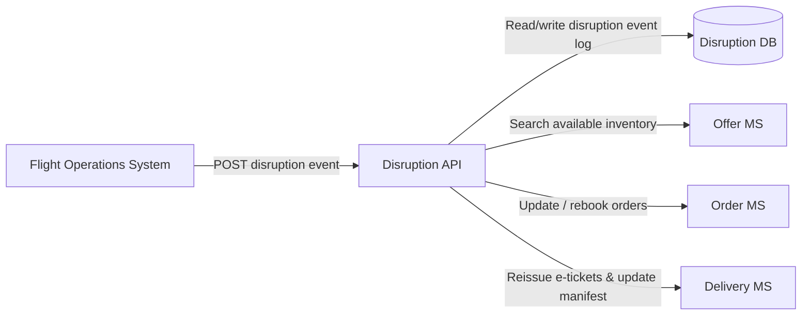
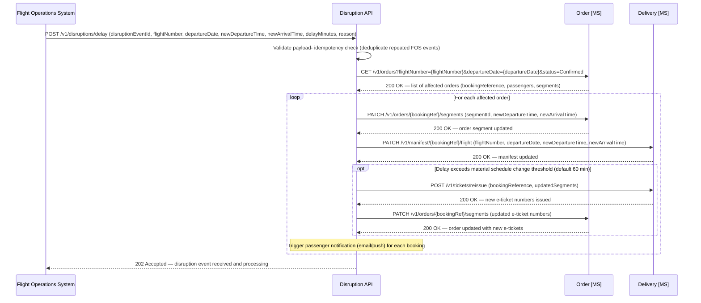

# Disruption domain

## Overview

The Disruption API orchestrates the reservation system's response to disruption events (delays and cancellations) notified by the airline's **Flight Operations System (FOS)**.

- Coordinates updates across the **Offer** (inventory), **Order**, and **Delivery** microservices to keep all affected bookings accurate and, where necessary, rebook passengers.
- Write-only inbound interface from the FOS perspective — the FOS fires the event and the reservation system handles everything downstream with no synchronous per-passenger response expected.
- Operational outcomes are surfaced to staff via the Contact Centre App and Airport App through the existing Retail and Airport APIs.



*Ref: disruption API - FOS integration and downstream microservice orchestration overview*

---

## Flight Delay

A flight delay changes scheduled times without invalidating bookings or e-tickets — the passenger's reservation remains valid and no rebooking is required.

- The system propagates revised departure and arrival times to every affected order and manifest record.
- Passengers are notified proactively of the schedule change.
- Under **EU Regulation 261/2004**, significant delays may entitle passengers to compensation; eligibility assessment and fulfilment are handled outside this system.

> **Future consideration — missed connections due to delay:** If a delayed flight causes a passenger to miss a connecting flight in their itinerary, the system will need to detect this and trigger a rebooking flow for the affected connection. This is not in scope for the current phase but must be addressed in a future design iteration before connecting-itinerary bookings are supported operationally.



*Ref: disruption - flight delay schedule propagation across affected orders and manifests*

**Delay handling rules:**

- The departure and arrival times on every confirmed `order.Order` segment record for the affected flight are updated to reflect the new scheduled times.
- The `delivery.Manifest` records are updated to reflect the new departure time for gate management and check-in purposes.
- E-ticket reissuance is required if the delay constitutes a "material schedule change" under IATA ticketing rules (typically a change of more than 60 minutes). The threshold is configurable. Where reissuance is required, the Disruption API calls the Delivery microservice to reissue and the Order microservice is updated with new e-ticket numbers.
- An `OrderChanged` event is published by the Order microservice to the event bus so downstream services (Accounting, Customer) are aware of the change.
- Passengers whose check-in window has already opened (within 24 hours of the original departure) are notified immediately.

---

## Flight Cancellation and Passenger Rebooking

When the FOS notifies the Disruption API that a flight has been cancelled, the API takes the flight off sale and rebooks every affected passenger onto the next available alternative. The rebooking logic works as follows:

1. The next available **direct** flight on the same origin–destination route with sufficient cabin availability is identified first.
2. If no direct flight can accommodate the passengers within an acceptable timeframe, a **connecting itinerary** via an intermediate point is considered.
3. Each passenger is rebooked into the same cabin class where possible. If the same cabin is unavailable, the passenger is upgraded to the next available cabin (no downgrade without consent).
4. All e-tickets for the cancelled flight are voided and new e-tickets are issued for the replacement flight(s).
5. The `delivery.Manifest` records for the cancelled flight are removed and new manifest entries are created for the replacement flight.
6. Passengers are notified of their new itinerary.
7. **If no suitable replacement flight can be found within the configurable lookahead window (default: 72 hours):** The booking is cancelled entirely, the original e-tickets are voided, held inventory is released, and an `OrderCancelled` event is published to the Accounting system with a `refundableAmount` equal to the full fare paid (IROPS policy: full refund regardless of fare conditions). The passenger is notified that no rebooking is available and directed to contact the airline or rebook independently. The booking is flagged in the Contact Centre App for follow-up.

> **Future consideration — missed connections resulting from cancellation rebooking:** When a passenger is rebooked onto a connecting itinerary (because no viable direct flight is available), there is a risk that a disruption to either leg of that connecting journey could result in a missed connection. Additionally, where minimum connection times at the transit airport are tight, the system must validate that the layover is operationally feasible. Detection and handling of these scenarios requires additional logic — similar in nature to the delay/missed-connection case noted above — and must be addressed in a future design phase before widespread use of connecting rebooking in an IROPS context.

```mermaid
sequenceDiagram
    participant FOS as Flight Operations System
    participant DisruptionAPI as Disruption API
    participant OfferMS as Offer [MS]
    participant OrderMS as Order [MS]
    participant CustomerMS as Customer [MS]
    participant DeliveryMS as Delivery [MS]

    FOS->>DisruptionAPI: POST /v1/disruptions/cancellation (disruptionEventId, flightNumber, departureDate, origin, destination, reason)
    DisruptionAPI->>DisruptionAPI: Validate payload- idempotency check (reject if disruptionEventId already processed)

    Note over DisruptionAPI,OfferMS: Take the flight off sale immediately — before any rebooking begins (synchronous, before 202 is returned)
    DisruptionAPI->>OfferMS: PATCH /v1/inventory/cancel (inventoryId, flightNumber, departureDate)
    OfferMS-->>DisruptionAPI: 200 OK — cancelled flight inventory closed (SeatsAvailable = 0, status = Cancelled)

    Note over DisruptionAPI: Queue rebooking job on Service Bus with full event payload; return 202 immediately
    DisruptionAPI-->>FOS: 202 Accepted — event received, inventory closed, rebooking queued for async processing

    Note over DisruptionAPI: Async worker picks up the queued rebooking job from Service Bus
    DisruptionAPI->>OrderMS: GET /v1/orders?flightNumber={flightNumber}&departureDate={departureDate}&status=Confirmed
    OrderMS-->>DisruptionAPI: 200 OK — list of affected orders (bookingReference, passengers, segments, cabinCode, bookingType, loyaltyNumber, totalPointsAmount)

    DisruptionAPI->>DeliveryMS: GET /v1/manifest?flightNumber={flightNumber}&departureDate={departureDate}
    DeliveryMS-->>DisruptionAPI: 200 OK — full passenger manifest for the cancelled flight

    Note over DisruptionAPI: Search for replacement flight options

    DisruptionAPI->>OfferMS: POST /v1/search (origin, destination, date=earliest available, cabinCode, paxCount)
    OfferMS-->>DisruptionAPI: 200 OK — available direct flight options with inventory (OfferId, flightNumber, departureTime, seatsAvailable per cabin)

    alt Direct replacement flight available
        Note over DisruptionAPI: Allocate passengers to direct replacement flight
    else No direct flight — assemble connecting itinerary via LHR hub
        Note over DisruptionAPI,OfferMS: Offer MS has no concept of connecting itineraries — call POST /v1/search twice (one per leg) and pair results here, exactly as the Retail API does for /v1/search/connecting
        DisruptionAPI->>OfferMS: POST /v1/search (origin=origin, destination=LHR, date=earliest available, cabinCode, paxCount)
        OfferMS-->>DisruptionAPI: Leg 1 options (OfferId, flightNumber, arrivalTimeAtLHR)
        DisruptionAPI->>OfferMS: POST /v1/search (origin=LHR, destination=destination, date=connectDate, cabinCode, paxCount)
        OfferMS-->>DisruptionAPI: Leg 2 options (OfferId, flightNumber, departureTimeFromLHR)
        DisruptionAPI->>DisruptionAPI: Pair legs, apply 60-min MCT filter, select best option
        Note over DisruptionAPI: Allocate passengers to connecting itinerary
    end

    loop For each affected order
        DisruptionAPI->>OfferMS: POST /v1/inventory/hold (inventoryId, cabinCode, seats=passengerCount)
        OfferMS-->>DisruptionAPI: 200 OK — seats held on replacement flight

        opt Reward booking — adjust points if replacement flight has different points cost
            alt Replacement flight costs more points
                Note over DisruptionAPI: IROPS policy: airline absorbs additional points cost — no charge to customer
            else Replacement flight costs fewer points
                DisruptionAPI->>CustomerMS: POST /v1/customers/{loyaltyNumber}/points/reinstate (points=pointsDifference, bookingRef, reason=FlightCancellation)
                CustomerMS-->>DisruptionAPI: 200 OK — surplus points restored to balance
            end
        end

        DisruptionAPI->>OrderMS: PATCH /v1/orders/{bookingRef}/rebook (cancelledSegmentId, replacementOfferIds, reason=FlightCancellation, bookingType)
        OrderMS-->>DisruptionAPI: 200 OK — order updated with replacement segment(s)- OrderChanged event published

        DisruptionAPI->>DeliveryMS: DELETE /v1/manifest/{bookingRef}/flight/{flightNumber}/{departureDate}
        DeliveryMS-->>DisruptionAPI: 200 OK — manifest entries removed for cancelled flight

        DisruptionAPI->>DeliveryMS: POST /v1/tickets/reissue (bookingReference, cancelledETicketNumbers, replacementSegments)
        DeliveryMS-->>DisruptionAPI: 200 OK — new e-ticket numbers issued

        DisruptionAPI->>DeliveryMS: POST /v1/manifest (inventoryId, seatNumber, bookingReference, eTicketNumber, passengerId — per PAX per new segment)
        DeliveryMS-->>DisruptionAPI: 201 Created — manifest entries written for replacement flight

        Note over DisruptionAPI: Trigger passenger notification (email/push) with new itinerary details
    end

    Note over DisruptionAPI: Async processing complete — status updated in DisruptionEvent log
```

*Ref: disruption - flight cancellation handling with async passenger rebooking; inventory closure is synchronous (before 202 is returned to FOS); all per-passenger rebooking work is processed asynchronously via Service Bus*

**Cancellation handling rules:**

- **The cancelled flight is taken off sale immediately and synchronously** — as the very first action after validating the event. This prevents new bookings from being accepted on the flight while rebooking is in progress. The `offer.FlightInventory` record is updated to `SeatsAvailable = 0` with a status of `Cancelled`. The `202 Accepted` response is returned to the FOS immediately after this step; all subsequent per-passenger rebooking work is queued onto Service Bus for async processing.
- The Disruption API processes passengers in priority order: higher cabin class first, then loyalty tier (Platinum → Gold → Silver → Blue), then booking date (earliest first). This ensures the best available seats go to the highest-value passengers.
- Seat assignments on the replacement flight are not pre-assigned by the Disruption API; passengers are assigned to an available seat of the same position type (Window/Aisle/Middle) where possible. Passengers may change their seat via the normal manage-booking flow after rebooking.
- If no replacement flight is found within the 72-hour lookahead window, the booking is cancelled with a full IROPS refund (see step 7 of the rebooking logic above) and the passenger is notified.
- Where the original fare conditions do not permit free rebooking (e.g. non-changeable fares), the airline's IROPS policy overrides these conditions — all passengers on a cancelled flight are entitled to free rebooking regardless of fare type. This waiver is applied by the Order microservice when the `reason=FlightCancellation` flag is present.
- **Reward bookings:** Under IROPS, the airline absorbs any additional points cost if the replacement flight has a higher points price — the customer is never charged more points for an airline-initiated cancellation. If the replacement flight costs fewer points, the difference is reinstated to the customer's loyalty balance via the Customer microservice. Tax differences on IROPS rebookings are also absorbed by the airline.
- A single `OrderChanged` event (with `changeType=IROPSRebook`) is published by the Order microservice per affected booking, consumed by the Accounting microservice for revenue accounting adjustments. For reward bookings, the event includes `bookingType=Reward` and any `pointsAdjustment` so Accounting can track the points impact.

---

## Data Schema — Disruption

The Disruption API has its own persistent store (a dedicated SQL database) used solely for deduplication and event-processing state. No reservation or fare data is stored here.

**disruption.DisruptionEvent**

| Column | Type | Notes |
|--------|------|-------|
| `DisruptionEventId` | `NVARCHAR(100)` | PK — FOS-supplied unique identifier; used for idempotency deduplication |
| `EventType` | `NVARCHAR(20)` | `Delay` or `Cancellation` |
| `FlightNumber` | `NVARCHAR(10)` | Affected marketing flight number (e.g. `AX101`) |
| `DepartureDate` | `DATE` | Scheduled departure date (UTC) |
| `Status` | `NVARCHAR(20)` | `Received` → `Processing` → `Completed` / `Failed` |
| `AffectedPassengerCount` | `INT` | Total number of passengers on the affected flight at time of event receipt |
| `ProcessedPassengerCount` | `INT` | Running count of passengers successfully reboooked or notified; updated by the async worker after each booking is handled |
| `Payload` | `NVARCHAR(MAX)` | Full JSON event payload as received from FOS; retained for replay and audit |
| `ReceivedAt` | `DATETIME2` | UTC timestamp when the event was first received |
| `ProcessingStartedAt` | `DATETIME2 NULL` | UTC timestamp when async processing began |
| `CompletedAt` | `DATETIME2 NULL` | UTC timestamp when all affected passengers were processed |
| `ErrorDetail` | `NVARCHAR(MAX) NULL` | Populated if `Status = Failed`; contains the last error message for operational debugging |

> **Status transitions:** `Received` is written synchronously before the `202 Accepted` is returned to the FOS. The async Service Bus worker updates `Status` to `Processing` when it picks up the job, then to `Completed` (or `Failed`) once all per-passenger work is done. `ProcessedPassengerCount` is incremented after each individual booking is handled, giving operational staff a real-time progress indicator.

> **Idempotency:** On receipt of a disruption event, the Disruption API performs an `INSERT IF NOT EXISTS` on `DisruptionEventId`. If the row already exists (duplicate delivery from FOS), the request is acknowledged with `202 Accepted` immediately — no downstream calls are made.

---

## Disruption API — Idempotency and Reliability

The Disruption API must be idempotent — the FOS may send the same event more than once due to retries or network failures.

- Each event must include a unique `disruptionEventId`; events with an ID already in the `disruption.DisruptionEvent` table are acknowledged (`202 Accepted`) without re-processing.
- Long-running cancellation rebooking operations (large passenger loads) are processed asynchronously; `202 Accepted` is returned to the FOS immediately after the `DisruptionEvent` row is written and inventory is closed.
- Operational progress is visible to Contact Centre agents via the existing order management tools in the Retail API — the FOS does not poll for completion. The `ProcessedPassengerCount` field on `disruption.DisruptionEvent` gives staff a real-time view of async rebooking progress.
