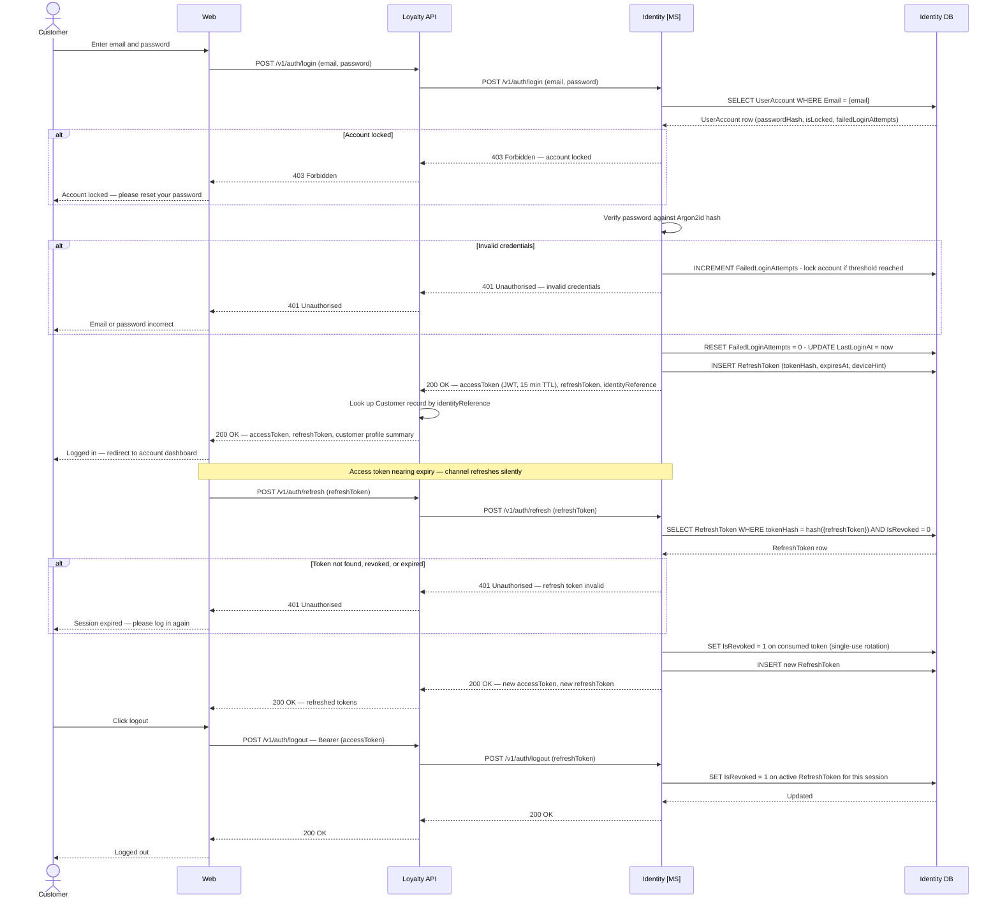
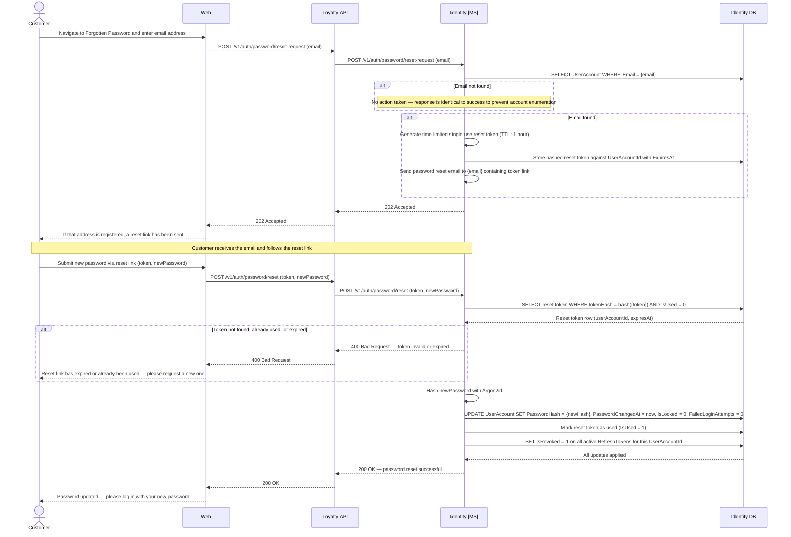

# Identity domain

The Identity microservice is the security boundary for all authentication and credential management — the sole owner of email addresses and hashed passwords.

- The Identity/Customer boundary is deliberate: Identity knows nothing about points or tier status; Customer knows nothing about passwords.
- The two domains are linked only by an opaque `IdentityReference` UUID, allowing Identity to evolve independently.
- Short-lived JWT access tokens validated by downstream APIs using the Identity MS public signing key — no DB round-trip on every request.
- Refresh tokens stored in the Identity DB with single-use semantics; rotated on each use to limit exposure if a token is compromised.

## Login, Logout, and Token Refresh

Login issues a short-lived JWT access token and a longer-lived refresh token; logout revokes the refresh token to invalidate the session.

- Downstream APIs validate the JWT signature using the Identity MS public signing key — no DB round-trip on every request.
- When the access token expires, the channel silently uses the refresh token to obtain a new pair without requiring the customer to re-enter their password.
- Refresh tokens have single-use semantics and are rotated on each use.

*Ref: identity — login with credential validation and account lockout, silent token refresh with single-use rotation, and logout with refresh token revocation*

---

## Password Reset

Password reset uses a zero-knowledge flow to prevent account enumeration, with full session invalidation on completion.

- The response is identical (`202 Accepted`) whether or not the email address is registered — no information is revealed to the requester.
- A time-limited single-use reset token (1-hour TTL) is dispatched to the address if known; the customer follows the link and submits a new password.
- All active refresh tokens are invalidated on success, requiring re-authentication across all sessions.

*Ref: identity — password reset request with account enumeration protection, token validation, hash update, and full session invalidation*

> **Account lockout reset:** Setting `IsLocked = 0` and `FailedLoginAttempts = 0` as part of a successful password reset is intentional — a legitimate account owner who recovers access via password reset should be unblocked in the same flow, rather than requiring a separate administrator action.

> **Enumeration protection:** The identical `202 Accepted` response for both known and unknown email addresses in the reset-request flow is a deliberate security control, consistent with the duplicate-email handling behaviour described in the Register section above.

## Data Schema — Identity

The Identity domain owns the `identity.*` schema — the sole store of authentication credentials, holding one row per login account linked to Customer via `IdentityReference`. Passwords are stored as Argon2id salted hashes only; plain text is never persisted.

The Identity microservice exposes authentication and credential management endpoints consumed by the Loyalty API. It does not expose any loyalty or profile data; it returns only a validated `IdentityReference` on successful authentication, which the Loyalty API uses to look up the corresponding Customer account.

### `identity.UserAccount`

| Column | Type | Nullable | Default | Key | Notes |
|---|---|---|---|---|---|
| UserAccountId | UNIQUEIDENTIFIER | No | NEWID() | PK | |
| IdentityReference | UNIQUEIDENTIFIER | No | NEWID() | UK | Shared key passed to the Customer microservice at registration |
| Email | VARCHAR(254) | No | | UK | RFC 5321 maximum length |
| PasswordHash | VARCHAR(255) | No | | | Argon2id hash; salt embedded in hash string; plain text must never be stored |
| IsEmailVerified | BIT | No | `0` | | Set to `1` after the customer clicks the verification link |
| IsLocked | BIT | No | `0` | | Set to `1` after repeated failed login attempts |
| FailedLoginAttempts | TINYINT | No | `0` | | Reset to `0` on successful authentication |
| LastLoginAt | DATETIME2 | Yes | | | Null until first successful login |
| PasswordChangedAt | DATETIME2 | No | SYSUTCDATETIME() | | |
| CreatedAt | DATETIME2 | No | SYSUTCDATETIME() | | |
| UpdatedAt | DATETIME2 | No | SYSUTCDATETIME() | | |

> **Indexes:** `IX_UserAccount_Email` on `(Email)`.
> **Account lockout:** After a configurable number of consecutive failed login attempts (default: 5), `IsLocked` is set to `1` and further authentication attempts are rejected until an administrator or automated unlock process resets the flag. `FailedLoginAttempts` resets to `0` on successful authentication.
> **Password hashing:** Passwords must be hashed using Argon2id (bcrypt acceptable as fallback). The raw password must not be stored, logged, or transmitted after the initial hash operation. Salt is embedded within the hash string.

### `identity.RefreshToken`

| Column | Type | Nullable | Default | Key | Notes |
|---|---|---|---|---|---|
| RefreshTokenId | UNIQUEIDENTIFIER | No | NEWID() | PK | |
| UserAccountId | UNIQUEIDENTIFIER | No | | FK → `identity.UserAccount(UserAccountId)` | |
| TokenHash | VARCHAR(255) | No | | | Hashed token value; raw token returned to client at issuance only |
| DeviceHint | VARCHAR(100) | Yes | | | Optional user-agent label for session management UI |
| IsRevoked | BIT | No | `0` | | Set to `1` on use (single-use semantics) or explicit logout |
| ExpiresAt | DATETIME2 | No | | | |
| CreatedAt | DATETIME2 | No | SYSUTCDATETIME() | | |
| UpdatedAt | DATETIME2 | No | SYSUTCDATETIME() | | |

> **Indexes:** `IX_RefreshToken_UserAccount` on `(UserAccountId)` WHERE `IsRevoked = 0`.
> **Refresh token rotation:** On each use, the existing token is revoked (`IsRevoked = 1`) and a new one issued, providing single-use semantics. All tokens for a `UserAccountId` can be revoked simultaneously to force logout across all sessions.
> **Access tokens:** Short-lived JWT access tokens (recommended TTL: 15 minutes) are issued at authentication time and are not persisted in the Identity DB. The Loyalty API and Retail API validate access tokens using the Identity microservice's public signing key without a database round-trip on each request.
> **IdentityReference:** The Identity microservice issues the `IdentityReference` UUID at login account creation and passes it to the Customer microservice for storage. The Customer microservice does not call the Identity microservice to validate credentials — authentication is handled upstream by the Loyalty API before any Customer calls are made.
