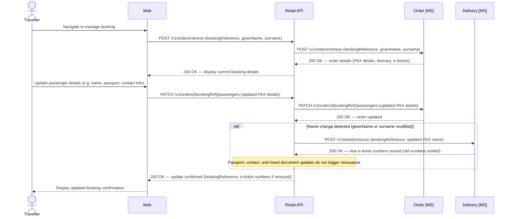
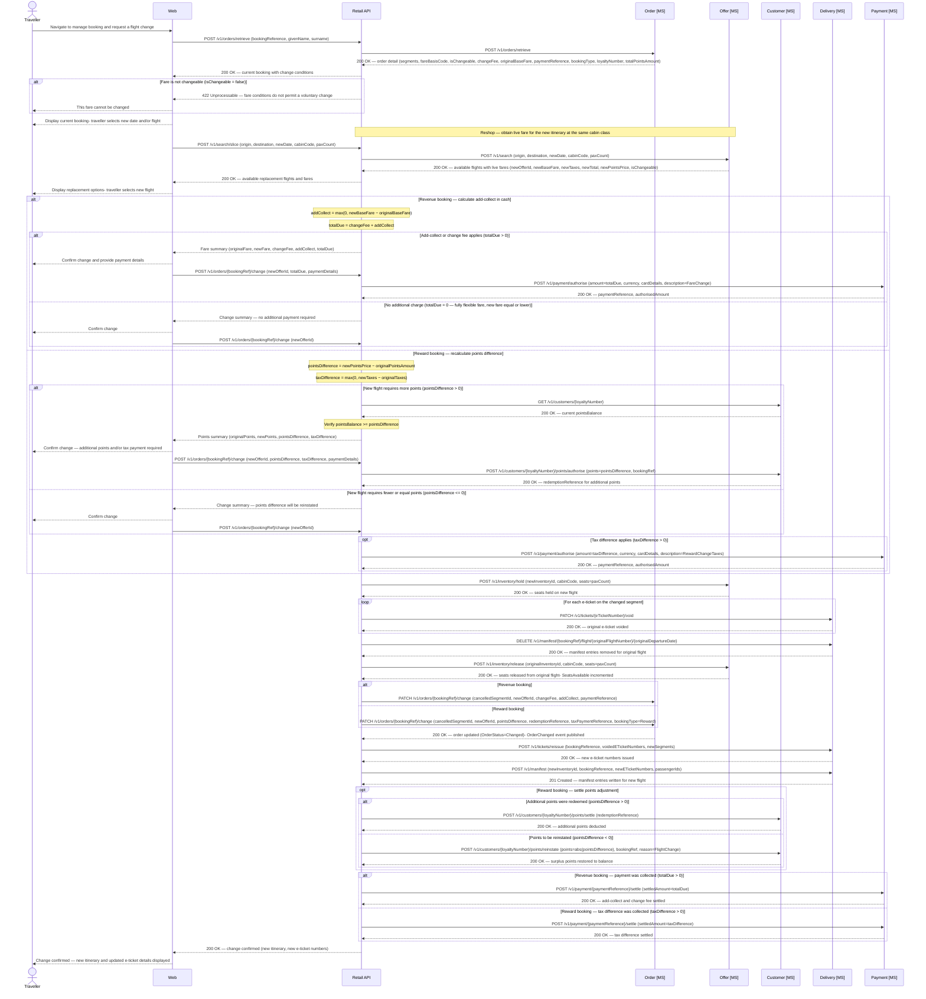
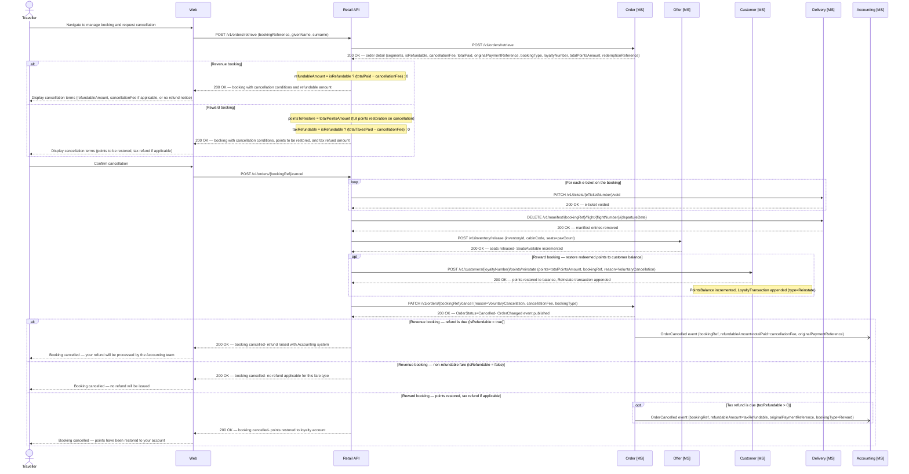

# Manage booking

## Update passenger details

Passenger details may need updating post-booking for passports, name corrections, or contact information. Accurate **Advance Passenger Information (API)** is a regulatory requirement for international travel.

- PAX name or identity changes trigger e-ticket **reissuance** — a new e-ticket number is generated while the booking reference remains unchanged.
- Minor name corrections (a single transposed character) are typically applied as a waiver; anything beyond that is subject to the fare's change conditions.
- Passport number, nationality, date of birth, and document expiry must match the document presented at the border.

*Ref: manage booking - update passenger details; e-ticket reissuance is triggered only when the passenger name changes (name is encoded in the BCBP barcode string)*

## Change flight

A voluntary flight change is a customer-initiated itinerary modification governed entirely by the fare conditions of the originally purchased ticket.

- Changeability is fare-dependent: non-changeable, changeable with a fee, or fully flexible (no charge).
- A **reshop** is performed to obtain a live fare for the new itinerary; if the new base fare exceeds the original, an **add-collect** is due — fare difference plus any applicable change fee.
- Where the new fare is equal to or lower, the customer pays the change fee only; no residual value is returned.
- On confirmation, the original e-ticket is voided and a new e-ticket issued; seat ancillaries are not automatically transferred and must be reselected.

*Ref: manage booking - voluntary flight change with reshop, add-collect (revenue) or points recalculation (reward), and e-ticket reissuance*

## Cancel booking

A voluntary cancellation is a customer-initiated request governed by the fare conditions of the originally issued ticket.

- Fares are non-refundable (full forfeiture), partially refundable (fixed cancellation fee deducted), or fully refundable (total amount returned).
- Regardless of refundability, the e-ticket must be voided and inventory released — a cancelled booking must not hold seat inventory.
- When a refund is due, the Order MS publishes an `OrderCancelled` event (containing `refundableAmount` and `originalPaymentReference`) to the Accounting system via the event bus. The Accounting system is responsible for initiating and settling the refund with the external payments provider — this is handled entirely outside the reservation system's synchronous booking path.
- Government-imposed taxes (e.g. UK Air Passenger Duty) may be refundable even on non-refundable fares; selective tax refund handling is out of scope for this phase.

> **Refund responsibility boundary:** Refund execution is fully external to the reservation system. The reservation system raises the `OrderCancelled` event with the refundable amount and payment reference; the Accounting system consumes this event and issues the refund directly to the payment provider. The reservation system's Payment MS (`POST /v1/payment/{paymentReference}/refund`) is not called as part of the voluntary cancellation flow — it exists only for scenarios where the reservation system itself must initiate a refund programmatically (e.g. automated reversals triggered by payment failures during the bookflow).

*Ref: manage booking - voluntary cancellation with inventory release, points restoration (reward bookings), and accounting refund event*
