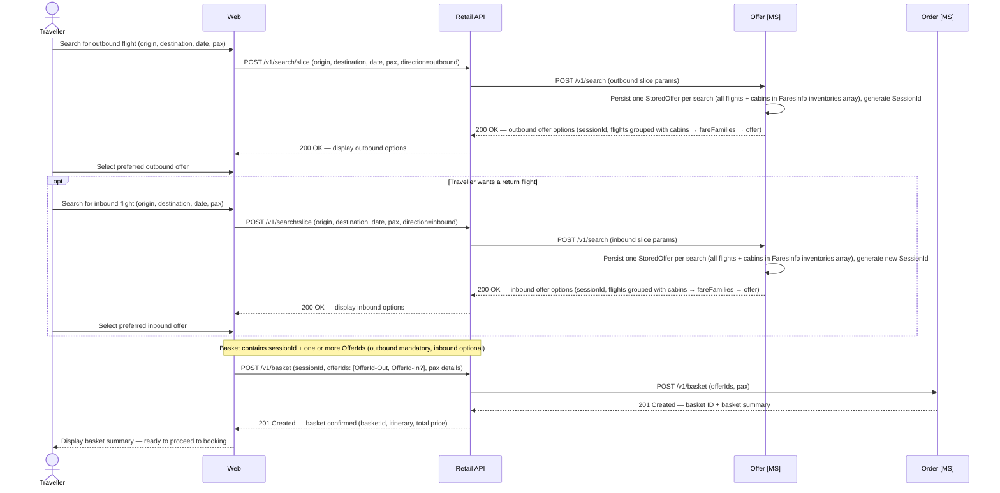
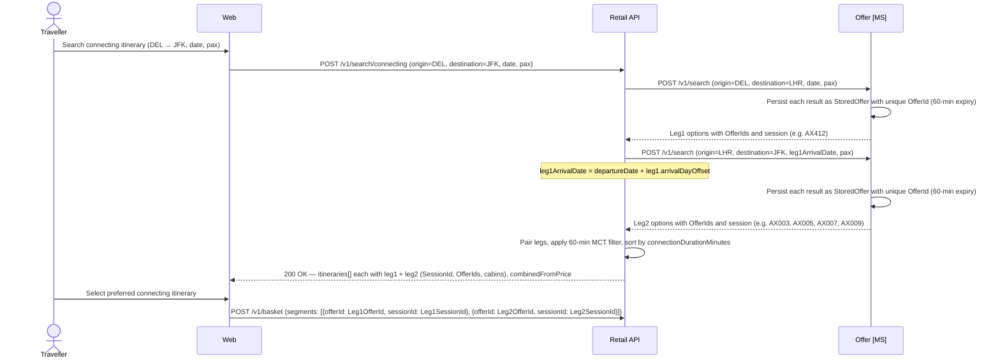

# Offer domain

The Offer microservice operates on individual flight segments only. It has no concept of multi-segment connecting itineraries — connecting assembly is the Retail API's responsibility.

## Search

Search uses the **slice** concept — one directional search per journey direction — with each result persisted immediately to guarantee price integrity.

- Customers search each direction independently; each search returns priced offers per available cabin class.
- Offers are persisted to `StoredOffer` for 60 minutes at creation — pricing locked at search time.
- **1-hour booking cutoff:** flights whose UTC departure is within 60 minutes of the search time are excluded from results. A customer can never be offered — or proceed to book — a flight that is already past the ticketing cutoff.
- The customer selects one offer per slice; the resulting `OfferIds` are passed to the basket.
- The Order API retrieves the stored offer by `OfferId` rather than re-pricing.



---

## Direct and connecting itineraries

### Direct flights

A direct flight is a single-segment journey served by a single Apex Air flight number. All 2026 routes operate direct from or to LHR.

| Journey | Flight | Departure (local) | Arrival (local) | Aircraft |
|---------|--------|-------------------|-----------------|----------|
| LHR → JFK | AX001 | 08:00 | 11:10 | A351 |
| JFK → LHR | AX002 | 13:00 | 01:15+1 | A351 |
| LHR → DEL | AX411 | 20:30 | 09:00+1 | B789 |
| DEL → LHR | AX412 | 03:30 | 08:00 | B789 |
| LHR → SIN | AX301 | 21:30 | 17:45+1 | A351 |

For a direct flight, the Offer MS creates **one `StoredOffer` per search**, with all matching flights and their cabin fares stored in the `FaresInfo` JSON as an `inventories[]` array. A `SessionId` is generated once per search and uniquely identifies that single row.

### Connecting flights (hub-and-spoke)

A connecting itinerary combines two direct flights via LHR — the only valid connection point.

- Each leg is an independent offer — each produces its own `StoredOffer` record with its own `OfferId`; both are placed in the basket together.
- `POST /v1/search/connecting` calls the Offer MS **twice in parallel** (once per leg), applies a **60-minute MCT** at LHR, and returns the composite itinerary options.
- The leg2 search date is derived from the leg1 arrival date (`departureDate + leg1.arrivalDayOffset`); the Retail API handles routes where leg1 arrives on the next calendar day (e.g. overnight transatlantic legs).
- Itinerary results are sorted by `connectionDurationMinutes` ascending so the most efficient connections appear first.
- Holding seats requires two separate `POST /v1/inventory/hold` calls; if either fails, both must be rolled back.
- The Offer MS has no concept of multi-segment itineraries; connecting assembly is entirely a Retail API orchestration responsibility.

### Available connecting routes (2026 schedule)

| Route | Leg 1 | Leg 2 via LHR | Notes |
|-------|-------|---------------|-------|
| DEL → JFK | AX412 (arr LHR 08:00) | AX003(10:30), AX005(13:00), AX007(16:00), AX009(19:30) | Same-day connections; AX001(08:00) excluded (0 min MCT) |
| JFK → DEL | AX002/4/6/8/10 (arr LHR next day) | AX411 (20:30) | All JFK→LHR arrivals connect to the 20:30 AX411 next day |
| BOM → JFK | AX402 (arr LHR same day) | AX001/3/5/7/9 (subject to MCT) | |
| JFK → BOM | AX002/4/6/8/10 (arr LHR next day) | AX401 (20:30) | |

### Request and response

**Request** (`POST /v1/search/connecting`):

```json
{
  "origin": "DEL",
  "destination": "JFK",
  "departureDate": "2026-05-20",
  "paxCount": 1,
  "bookingType": "Revenue"
}
```

**Response** — each `itinerary` carries a `leg1` and `leg2`, each with their own `sessionId` and the same cabin/fare-family offer structure as a slice search response:

```json
{
  "itineraries": [
    {
      "leg1": {
        "sessionId": "<guid>",
        "flightNumber": "AX412",
        "origin": "DEL",
        "destination": "LHR",
        "departureDate": "2026-05-20",
        "departureTime": "03:30",
        "arrivalTime": "08:00",
        "arrivalDayOffset": 0,
        "aircraftType": "B789",
        "cabins": [ { "cabinCode": "Y", "availableSeats": 207, "fromPrice": 186.25, "currency": "GBP", "fareFamilies": [ { "fareFamily": "Flex", "offer": { "offerId": "<guid>", "fareBasisCode": "YFLEXGB", "totalPrice": 346.25, ... } } ] } ]
      },
      "leg2": {
        "sessionId": "<guid>",
        "flightNumber": "AX003",
        "origin": "LHR",
        "destination": "JFK",
        "departureDate": "2026-05-20",
        "departureTime": "10:30",
        "arrivalTime": "13:45",
        "arrivalDayOffset": 0,
        "aircraftType": "A351",
        "cabins": [ ... ]
      },
      "connectionDurationMinutes": 150,
      "combinedFromPrice": 372.50,
      "currency": "GBP"
    }
  ]
}
```

Pass `leg1.sessionId` + selected `leg1.cabins[*].fareFamilies[*].offer.offerId` as segment 0, and `leg2.sessionId` + selected `leg2.cabins[*].fareFamilies[*].offer.offerId` as segment 1 when creating the basket.



### Code share flights (future scope)

Not in scope for initial release. The data model should accommodate future additions:

- `offer.FlightInventory`: add `OperatingCarrier CHAR(2)` and `OperatingFlightNumber VARCHAR(10)` columns.
- `offer.StoredOffer`: add `MarketingCarrier` and `OperatingCarrier` snapshot columns.
- API responses: include optional `operatingCarrier` and `operatingFlightNumber` fields from day one (null for own-metal).
- Ticketing: e-tickets will need operating carrier designator.
- Inventory: future `InventorySource` field (`OwnMetal` / `Interline` / `CodeShare`).

---

## Continuous pricing

Continuous pricing adjusts the offered fare dynamically at search time based on how full the cabin is. As seats sell, the price rises gradually from the minimum to the maximum fare defined in the fare rule, removing the step-changes of traditional booking class buckets.

### Occupancy ratio

At search time the handler calculates an occupancy ratio for each cabin:

```
occupancyRatio = (SeatsSold + SeatsHeld) / TotalSeats
```

- `SeatsSold` — seats confirmed on issued tickets.
- `SeatsHeld` — seats in active baskets (uncommitted but reserved); counted as demand because they represent confirmed buying intent.
- The ratio is clamped to `[0.0, 1.0]` to guard against any transient data inconsistency.

### Price interpolation

The offered base fare is interpolated linearly between the fare rule's `MinAmount` and `MaxAmount`:

```
baseFareAmount = MinAmount + (MaxAmount − MinAmount) × occupancyRatio
```

| Occupancy | Price |
|-----------|-------|
| 0 % (empty cabin) | `MinAmount` |
| 50 % | Midpoint between `MinAmount` and `MaxAmount` |
| 100 % (sold out) | `MaxAmount` |

The result is rounded to 2 decimal places (half-up).

For award fares the same interpolation applies to `MinPoints` and `MaxPoints`, rounded to the nearest integer.

### Fallback behaviour

- If `MaxAmount` is absent or not greater than `MinAmount`, the price is set to `MinAmount` unchanged. Existing fare rules that carry only a single price point continue to work without modification.
- If `TotalSeats` is zero (data guard), the occupancy ratio defaults to `0.0` and the minimum price is used.

### Relationship to stored offer

The interpolated price is calculated once at search time and locked into the `StoredOffer` snapshot. Subsequent steps (basket, order confirmation) retrieve the stored price — they do not re-run the interpolation. This preserves the stored offer guarantee: the price a customer sees at search is the price they pay.

---

## Data schema

### `offer.FlightInventory`

| Column | Type | Nullable | Default | Key | Notes |
|---|---|---|---|---|---|
| InventoryId | UNIQUEIDENTIFIER | No | NEWID() | PK | |
| FlightNumber | VARCHAR(10) | No | | | e.g. `AX001` |
| DepartureDate | DATE | No | | | |
| DepartureTime | TIME | No | | | Local departure time at origin |
| ArrivalTime | TIME | No | | | Local arrival time at destination |
| ArrivalDayOffset | TINYINT | No | 0 | | `0` = same day; `1` = next day |
| Origin | CHAR(3) | No | | | IATA airport code |
| Destination | CHAR(3) | No | | | IATA airport code |
| AircraftType | VARCHAR(4) | No | | | e.g. `A351`, `B789` |
| CabinCode | CHAR(1) | No | | | `F` · `J` · `W` · `Y` |
| TotalSeats | SMALLINT | No | | | Physical seat count for this cabin |
| SeatsAvailable | SMALLINT | No | | | Decremented on hold; incremented on release |
| SeatsSold | SMALLINT | No | 0 | | Incremented on ticket issuance |
| SeatsHeld | SMALLINT | No | 0 | | Seats held in active baskets |
| Status | VARCHAR(20) | No | `'Active'` | | `Active` · `Cancelled` |
| CreatedAt | DATETIME2 | No | SYSUTCDATETIME() | | |
| UpdatedAt | DATETIME2 | No | SYSUTCDATETIME() | | |

> **Indexes:** `IX_FlightInventory_Flight` on `(FlightNumber, DepartureDate, CabinCode)` WHERE `Status = 'Active'`.
> **Inventory integrity:** `SeatsAvailable + SeatsSold + SeatsHeld = TotalSeats` must be maintained by the application layer.
> **Cancellation:** `PATCH /v1/inventory/cancel` sets `Status = Cancelled`, `SeatsAvailable = 0`. Cancelled inventory excluded from search.

### `offer.Fare`

| Column | Type | Nullable | Default | Key | Notes |
|---|---|---|---|---|---|
| FareId | UNIQUEIDENTIFIER | No | NEWID() | PK | |
| InventoryId | UNIQUEIDENTIFIER | No | | FK → `offer.FlightInventory(InventoryId)` | |
| FareBasisCode | VARCHAR(20) | No | | | e.g. `YLOWUK`, `JFLEXGB` |
| FareFamily | VARCHAR(50) | Yes | | | e.g. `Economy Light`, `Business Flex` |
| CabinCode | CHAR(1) | No | | | `F` · `J` · `W` · `Y` |
| BookingClass | CHAR(1) | No | | | Defaulted from CabinCode during schedule generation |
| CurrencyCode | CHAR(3) | No | `'GBP'` | | ISO 4217 |
| BaseFareAmount | DECIMAL(10,2) | No | | | Carrier base fare, excluding taxes |
| TaxAmount | DECIMAL(10,2) | No | | | Total taxes and surcharges |
| TotalAmount | DECIMAL(10,2) | No | | | `BaseFareAmount + TaxAmount` |
| IsRefundable | BIT | No | 0 | | |
| IsChangeable | BIT | No | 0 | | |
| ChangeFeeAmount | DECIMAL(10,2) | No | `0.00` | | Fee on voluntary change; `0.00` for flexible fares |
| CancellationFeeAmount | DECIMAL(10,2) | No | `0.00` | | Fee deducted from refund; `0.00` for fully refundable |
| PointsPrice | INT | Yes | | | Points for redemption; `NULL` = revenue-only |
| PointsTaxes | DECIMAL(10,2) | Yes | | | Cash taxes when redeemed with points; `NULL` if `PointsPrice` is `NULL` |
| ValidFrom | DATETIME2 | No | | | Fare sale window start |
| ValidTo | DATETIME2 | No | | | Fare sale window end |
| CreatedAt | DATETIME2 | No | SYSUTCDATETIME() | | |
| UpdatedAt | DATETIME2 | No | SYSUTCDATETIME() | | |

> **Points pricing:** A fare with non-null `PointsPrice` can be redeemed for points. When searching in points mode, `PointsPrice` and `PointsTaxes` are the primary pricing fields. Revenue-only fares (`PointsPrice = NULL`) do not appear in points searches.
> **Change and cancellation fees:** Stored so the Retail API can calculate `totalDue = changeFee + addCollect` and `refundableAmount = totalPaid − cancellationFee` without a separate lookup.

### `offer.FareRule`

Master fare-pricing rules used to derive `offer.Fare` snapshots at search time. Each rule defines the pricing parameters for a given fare basis code and cabin, optionally scoped to a specific flight number and/or date window (three-tier cascade: global default → flight default → flight + date window).

| Column | Type | Nullable | Default | Key | Notes |
|---|---|---|---|---|---|
| FareRuleId | UNIQUEIDENTIFIER | No | NEWID() | PK | |
| RuleType | VARCHAR(10) | No | `'Money'` | | `Money` or `Points` |
| FlightNumber | VARCHAR(10) | Yes | | Indexed | `NULL` = global default applying to all flights |
| FareBasisCode | VARCHAR(20) | No | | Indexed | e.g. `YLOWUK`, `JFLEXGB` |
| FareFamily | VARCHAR(50) | Yes | | | e.g. `Economy Light`, `Business Flex` |
| CabinCode | CHAR(1) | No | | Indexed | `F` · `J` · `W` · `Y` |
| BookingClass | CHAR(1) | No | | | |
| CurrencyCode | CHAR(3) | Yes | `'GBP'` | | ISO 4217 |
| MinAmount | DECIMAL(10,2) | Yes | | | Floor price for continuous pricing interpolation |
| MaxAmount | DECIMAL(10,2) | Yes | | | Ceiling price for continuous pricing interpolation; `NULL` disables interpolation |
| MinPoints | INT | Yes | | | Floor points price; `NULL` = revenue-only fare |
| MaxPoints | INT | Yes | | | Ceiling points price |
| PointsTaxes | DECIMAL(10,2) | Yes | | | Cash taxes when redeeming points |
| TaxLines | NVARCHAR(MAX) | Yes | | | JSON array of tax line objects with `code` and `amount` |
| IsRefundable | BIT | No | 0 | | |
| IsChangeable | BIT | No | 0 | | |
| ChangeFeeAmount | DECIMAL(10,2) | No | `0.00` | | |
| CancellationFeeAmount | DECIMAL(10,2) | No | `0.00` | | |
| IsPrivate | BIT | No | 0 | | When `1`, the fare is hidden from the public Retail API and web channel; visible only via the admin Retail API (Contact Centre) and Operations API |
| ValidFrom | DATETIME2 | Yes | | | Inclusive start of the booking window; `NULL` = no lower bound |
| ValidTo | DATETIME2 | Yes | | | Exclusive end of the booking window; `NULL` = no upper bound |
| CreatedAt | DATETIME2 | No | SYSUTCDATETIME() | | |
| UpdatedAt | DATETIME2 | No | SYSUTCDATETIME() | | |

> **Private fares:** Fare rules with `IsPrivate = 1` are excluded from the public search path (`POST /v1/search/slice`, `POST /v1/search/connecting`). They are included when the admin search path (`POST /v1/admin/search/slice`) is called by an authenticated staff member, making them available to the Contact Centre for staff travel, partner travel, and other discounted or restricted pricing programmes.
> **Three-tier cascade:** Rules are ordered least-to-most-specific at query time. For each `(FareFamily, RuleType)` key the most-specific rule wins: Tier 0 (global, no `FlightNumber`, no date bounds) → Tier 1 (flight-specific, no date bounds) → Tier 2 (flight-specific with date window).

### `offer.StoredOffer`

One row per **search session**. All matching flights and their cabin fares are stored together in the `FaresInfo` JSON column as an `inventories[]` array. Flight details (origin, destination, times, aircraft type) are not stored here — they are resolved from `offer.FlightInventory` at read time.

| Column | Type | Nullable | Default | Key | Notes |
|---|---|---|---|---|---|
| StoredOfferId | UNIQUEIDENTIFIER | No | NEWID() | PK | |
| SessionId | UNIQUEIDENTIFIER | No | | Indexed | Uniquely identifies this search session; exactly one `StoredOffer` row per session |
| FaresInfo | NVARCHAR(MAX) | No | | | JSON — `inventories[]` array; each entry has `inventoryId` + `offers[]` of fare items for that flight |
| CreatedAt | DATETIME2 | No | SYSUTCDATETIME() | | |
| ExpiresAt | DATETIME2 | No | | | `CreatedAt + 60 minutes` |
| UpdatedAt | DATETIME2 | No | SYSUTCDATETIME() | | |

> **Indexes:** `IX_StoredOffer_SessionId` on `(SessionId)` — efficient session-scoped lookups; `IX_StoredOffer_Expiry` on `(ExpiresAt)`.
> **One row per search session:** A single row stores all matching flights and all their cabin fares, keeping the row count equal to the number of searches.
> **FaresInfo structure:** `{ "inventories": [ { "inventoryId": "<guid>", "validated": false, "offers": [ { "offerId": "<guid>", "cabinCode": "Y", "fareBasisCode": "YFLEX", "fareFamily": "Economy Flex", "currencyCode": "GBP", "baseFareAmount": 420.00, "taxAmount": 85.00, "totalAmount": 505.00, "isRefundable": true, "isChangeable": true, "bookingType": "Revenue", "seatsAvailable": 42, "pointsPrice": null } ] } ] }`
> **Expiry alignment:** `ExpiresAt = CreatedAt + 60 minutes`, matching the basket expiry window.

---

## Timer triggers

### `DeleteExpiredFlightInventory`

- **Function name:** `DeleteExpiredFlightInventory`
- **Schedule:** `0 0 0 * * *` — daily at midnight UTC
- **Microservice:** `ReservationSystem.Microservices.Offer`
- **Handler:** `DeleteExpiredFlightInventoryHandler`

Deletes all `offer.FlightInventory` rows — and their child `offer.Fare` rows — whose departure datetime is more than 48 hours in the past. The 48-hour grace window ensures that late-arriving data or post-flight reporting queries are not disrupted before the cleanup runs.

The function logs a start message and a completion message containing the count of deleted inventory rows. It is invoked by the Azure Functions runtime on its cron schedule and receives a `CancellationToken` for graceful shutdown.

### `DeleteExpiredStoredOffers`

- **Function name:** `DeleteExpiredStoredOffers`
- **Schedule:** `0 0 0 * * *` — daily at midnight UTC
- **Microservice:** `ReservationSystem.Microservices.Offer`
- **Handler:** `DeleteExpiredStoredOffersHandler`

Deletes all `offer.StoredOffer` rows whose `ExpiresAt` is in the past. Stored offers expire 60 minutes after creation, so by the time this cleanup runs any expired row has been unserviceable for hours. This keeps the table lean and prevents unbounded growth from abandoned search sessions.

The function logs a start message and a completion message containing the count of deleted stored offer rows. It is invoked by the Azure Functions runtime on its cron schedule and receives a `CancellationToken` for graceful shutdown.
