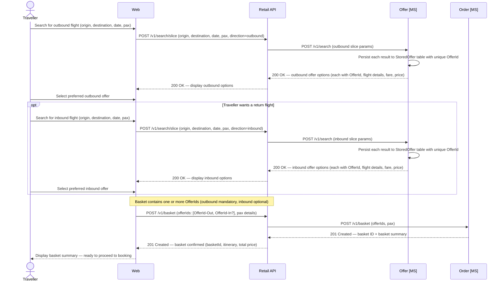
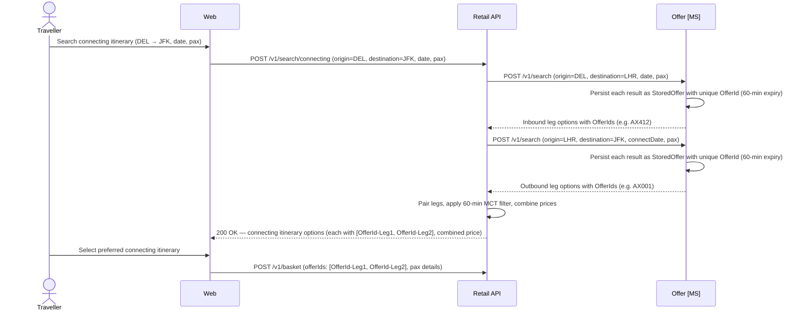

# Offer domain

The Offer microservice operates on individual flight segments only. It has no concept of multi-segment connecting itineraries — connecting assembly is the Retail API's responsibility.

## Search

Search uses the **slice** concept — one directional search per journey direction — with each result persisted immediately to guarantee price integrity.

- Customers search each direction independently; each search returns priced offers per available cabin class.
- Offers are persisted to `StoredOffer` for 60 minutes at creation — pricing locked at search time.
- The customer selects one offer per slice; the resulting `OfferIds` are passed to the basket.
- The Order API retrieves the stored offer by `OfferId` rather than re-pricing.

---

## Direct and connecting itineraries

### Direct flights

A direct flight is a single-segment journey served by a single Apex Air flight number. All 2026 routes operate direct from or to LHR.

| Journey | Flight | Departure (local) | Arrival (local) | Aircraft |
|---------|--------|-------------------|-----------------|----------|
| LHR → JFK | AX001 | 08:00 | 11:10 | A351 |
| JFK → LHR | AX002 | 13:00 | 01:15+1 | A351 |
| LHR → DEL | AX411 | 20:30 | 09:00+1 | B789 |
| DEL → LHR | AX412 | 03:30 | 08:00 | B789 |
| LHR → SIN | AX301 | 21:30 | 17:45+1 | A351 |

For a direct flight, the Offer MS creates one `StoredOffer` per available cabin class linked to a single `FlightInventory` row.

### Connecting flights (hub-and-spoke)

A connecting itinerary combines two direct flights via LHR — the only valid connection point.

- Each leg is an independent offer — two `StoredOffer` records, each with its own `OfferId`; both placed in the basket together.
- `POST /v1/search/connecting` calls the Offer MS twice (once per leg), applies a **60-minute MCT** at LHR, and returns the composite itinerary.
- Holding seats requires two separate `POST /v1/inventory/hold` calls; if either fails, both must be rolled back.
- The Offer MS has no concept of multi-segment itineraries; connecting assembly is entirely a Retail API orchestration responsibility.

### Code share flights (future scope)

Not in scope for initial release. The data model should accommodate future additions:

- `offer.FlightInventory`: add `OperatingCarrier CHAR(2)` and `OperatingFlightNumber VARCHAR(10)` columns.
- `offer.StoredOffer`: add `MarketingCarrier` and `OperatingCarrier` snapshot columns.
- API responses: include optional `operatingCarrier` and `operatingFlightNumber` fields from day one (null for own-metal).
- Ticketing: e-tickets will need operating carrier designator.
- Inventory: future `InventorySource` field (`OwnMetal` / `Interline` / `CodeShare`).

---

## Data schema

### `offer.FlightInventory`

| Column | Type | Nullable | Default | Key | Notes |
|---|---|---|---|---|---|
| InventoryId | UNIQUEIDENTIFIER | No | NEWID() | PK | |
| FlightNumber | VARCHAR(10) | No | | | e.g. `AX001` |
| DepartureDate | DATE | No | | | |
| DepartureTime | TIME | No | | | Local departure time at origin |
| ArrivalTime | TIME | No | | | Local arrival time at destination |
| ArrivalDayOffset | TINYINT | No | 0 | | `0` = same day; `1` = next day |
| Origin | CHAR(3) | No | | | IATA airport code |
| Destination | CHAR(3) | No | | | IATA airport code |
| AircraftType | VARCHAR(4) | No | | | e.g. `A351`, `B789` |
| CabinCode | CHAR(1) | No | | | `F` · `J` · `W` · `Y` |
| TotalSeats | SMALLINT | No | | | Physical seat count for this cabin |
| SeatsAvailable | SMALLINT | No | | | Decremented on hold; incremented on release |
| SeatsSold | SMALLINT | No | 0 | | Incremented on ticket issuance |
| SeatsHeld | SMALLINT | No | 0 | | Seats held in active baskets |
| Status | VARCHAR(20) | No | `'Active'` | | `Active` · `Cancelled` |
| CreatedAt | DATETIME2 | No | SYSUTCDATETIME() | | |
| UpdatedAt | DATETIME2 | No | SYSUTCDATETIME() | | |

> **Indexes:** `IX_FlightInventory_Flight` on `(FlightNumber, DepartureDate, CabinCode)` WHERE `Status = 'Active'`.
> **Inventory integrity:** `SeatsAvailable + SeatsSold + SeatsHeld = TotalSeats` must be maintained by the application layer.
> **Cancellation:** `PATCH /v1/inventory/cancel` sets `Status = Cancelled`, `SeatsAvailable = 0`. Cancelled inventory excluded from search.

### `offer.Fare`

| Column | Type | Nullable | Default | Key | Notes |
|---|---|---|---|---|---|
| FareId | UNIQUEIDENTIFIER | No | NEWID() | PK | |
| InventoryId | UNIQUEIDENTIFIER | No | | FK → `offer.FlightInventory(InventoryId)` | |
| FareBasisCode | VARCHAR(20) | No | | | e.g. `YLOWUK`, `JFLEXGB` |
| FareFamily | VARCHAR(50) | Yes | | | e.g. `Economy Light`, `Business Flex` |
| CabinCode | CHAR(1) | No | | | `F` · `J` · `W` · `Y` |
| BookingClass | CHAR(1) | No | | | Defaulted from CabinCode during schedule generation |
| CurrencyCode | CHAR(3) | No | `'GBP'` | | ISO 4217 |
| BaseFareAmount | DECIMAL(10,2) | No | | | Carrier base fare, excluding taxes |
| TaxAmount | DECIMAL(10,2) | No | | | Total taxes and surcharges |
| TotalAmount | DECIMAL(10,2) | No | | | `BaseFareAmount + TaxAmount` |
| IsRefundable | BIT | No | 0 | | |
| IsChangeable | BIT | No | 0 | | |
| ChangeFeeAmount | DECIMAL(10,2) | No | `0.00` | | Fee on voluntary change; `0.00` for flexible fares |
| CancellationFeeAmount | DECIMAL(10,2) | No | `0.00` | | Fee deducted from refund; `0.00` for fully refundable |
| PointsPrice | INT | Yes | | | Points for redemption; `NULL` = revenue-only |
| PointsTaxes | DECIMAL(10,2) | Yes | | | Cash taxes when redeemed with points; `NULL` if `PointsPrice` is `NULL` |
| ValidFrom | DATETIME2 | No | | | Fare sale window start |
| ValidTo | DATETIME2 | No | | | Fare sale window end |
| CreatedAt | DATETIME2 | No | SYSUTCDATETIME() | | |
| UpdatedAt | DATETIME2 | No | SYSUTCDATETIME() | | |

> **Points pricing:** A fare with non-null `PointsPrice` can be redeemed for points. When searching in points mode, `PointsPrice` and `PointsTaxes` are the primary pricing fields. Revenue-only fares (`PointsPrice = NULL`) do not appear in points searches.
> **Change and cancellation fees:** Stored so the Retail API can calculate `totalDue = changeFee + addCollect` and `refundableAmount = totalPaid − cancellationFee` without a separate lookup.

### `offer.StoredOffer`

| Column | Type | Nullable | Default | Key | Notes |
|---|---|---|---|---|---|
| OfferId | UNIQUEIDENTIFIER | No | NEWID() | PK | Returned to channel at search time |
| InventoryId | UNIQUEIDENTIFIER | No | | FK → `offer.FlightInventory(InventoryId)` | |
| FareId | UNIQUEIDENTIFIER | No | | FK → `offer.Fare(FareId)` | |
| FlightNumber | VARCHAR(10) | No | | | Denormalised snapshot |
| DepartureDate | DATE | No | | | Denormalised snapshot |
| Origin | CHAR(3) | No | | | Denormalised snapshot |
| Destination | CHAR(3) | No | | | Denormalised snapshot |
| FareBasisCode | VARCHAR(20) | No | | | Denormalised snapshot |
| FareFamily | VARCHAR(50) | Yes | | | Denormalised snapshot |
| CurrencyCode | CHAR(3) | No | `'GBP'` | | ISO 4217 |
| BaseFareAmount | DECIMAL(10,2) | No | | | Price at time offer was created |
| TaxAmount | DECIMAL(10,2) | No | | | Taxes at time offer was created |
| TotalAmount | DECIMAL(10,2) | No | | | Total at time offer was created |
| IsRefundable | BIT | No | 0 | | Fare conditions at offer creation |
| IsChangeable | BIT | No | 0 | | Fare conditions at offer creation |
| ChangeFeeAmount | DECIMAL(10,2) | No | `0.00` | | Snapshotted change fee |
| CancellationFeeAmount | DECIMAL(10,2) | No | `0.00` | | Snapshotted cancellation fee |
| PointsPrice | INT | Yes | | | Points required; `NULL` for revenue-only |
| PointsTaxes | DECIMAL(10,2) | Yes | | | Cash taxes for points redemption |
| BookingType | VARCHAR(10) | No | `'Revenue'` | | `Revenue` · `Reward` |
| CreatedAt | DATETIME2 | No | SYSUTCDATETIME() | | |
| ExpiresAt | DATETIME2 | No | | | `CreatedAt + 60 minutes` |
| IsConsumed | BIT | No | 0 | | Set to `1` once locked by Order MS |
| UpdatedAt | DATETIME2 | No | SYSUTCDATETIME() | | |

> **Indexes:** `IX_StoredOffer_Expiry` on `(ExpiresAt)` WHERE `IsConsumed = 0`.
> **Design note:** Fields deliberately denormalised so the offer snapshot is fully self-contained regardless of later fare changes.
> **Points snapshot:** `PointsPrice` and `PointsTaxes` snapshotted from `offer.Fare` at creation, locking the points price for the 60-minute window.
> **Expiry alignment:** `ExpiresAt = CreatedAt + 60 minutes`, matching the basket expiry window.
