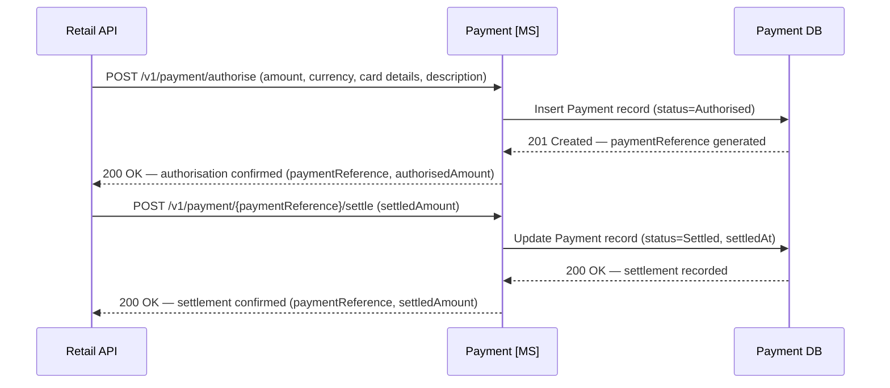

# Payment domain

## Overview

The Payment microservice is the financial orchestration layer for all Apex Air transactions, interfacing with the external card payment processor on behalf of all channels.

- A single booking generates multiple independent payment transactions: fare, seat ancillary, and bag ancillary are each authorised and settled separately with their own `PaymentReference`.
- Granular transactions enable precise revenue attribution, targeted partial refunds, and PCI DSS compliance — card data is handled and discarded entirely within the Payment MS boundary.

## Authorise and settle

Authorisation and settlement are separate steps; each transaction is tracked by a unique `PaymentReference` returned to the Retail API and stored against the relevant order items.

- Fare payment is authorised and settled during the booking confirmation flow; ancillary payments (seat, bag) are authorised upfront and settled after order confirmation.
- The Payment DB is the system of record for all financial transactions — every authorisation and settlement event is logged in `payment.PaymentEvent` as an immutable audit trail.

*Ref: payment - card authorisation and settlement sequence*

## Data schema

The Payment domain uses two tables: `Payment` (one row per transaction, tracking lifecycle from authorisation to settlement) and `PaymentEvent` (immutable append-only audit log of every individual event — authorised, settled, refunded, declined). A single `Payment` may have multiple `PaymentEvent` rows.

### `payment.Payment`

| Column | Type | Nullable | Default | Key | Notes |
|---|---|---|---|---|---|
| PaymentId | UNIQUEIDENTIFIER | No | NEWID() | PK | |
| PaymentReference | VARCHAR(20) | No | | UK | Human-readable reference, e.g. `AXPAY-0001`; generated at authorisation |
| BookingReference | CHAR(6) | Yes | | | Set once the order is confirmed; null during initial authorisation |
| PaymentType | VARCHAR(30) | No | | | `Fare` · `SeatAncillary` · `BagAncillary` · `FareChange` · `Cancellation` · `Refund` |
| Method | VARCHAR(20) | No | | | `CreditCard` · `DebitCard` · `PayPal` · `ApplePay` |
| CardType | VARCHAR(20) | Yes | | | `Visa` · `Mastercard` · `Amex` · etc.; null for non-card methods |
| CardLast4 | CHAR(4) | Yes | | | Last 4 digits only — full PAN must never be stored |
| CurrencyCode | CHAR(3) | No | `'GBP'` | | ISO 4217 currency code |
| AuthorisedAmount | DECIMAL(10,2) | No | | | Amount approved by the payment processor |
| SettledAmount | DECIMAL(10,2) | Yes | | | Null until settlement; may differ from `AuthorisedAmount` on partial settlement |
| Status | VARCHAR(20) | No | | | `Authorised` · `Settled` · `PartiallySettled` · `Refunded` · `Declined` · `Voided` |
| AuthorisedAt | DATETIME2 | No | SYSUTCDATETIME() | | |
| SettledAt | DATETIME2 | Yes | | | Null until settlement |
| Description | VARCHAR(255) | Yes | | | Human-readable description, e.g. `'Fare LHR-JFK-LHR, 2 PAX'` |
| CreatedAt | DATETIME2 | No | SYSUTCDATETIME() | | |
| UpdatedAt | DATETIME2 | No | SYSUTCDATETIME() | | |

> **Indexes:** `IX_Payment_BookingReference` on `(BookingReference)` WHERE `BookingReference IS NOT NULL`. `IX_Payment_PaymentReference` on `(PaymentReference)`.
> **PCI DSS:** Full card numbers, CVV codes, and raw processor tokens must never be stored. Only `CardLast4` and `CardType` are retained. The processor token used during the transaction lifetime is held in memory only and discarded after settlement.

### `payment.PaymentEvent`

| Column | Type | Nullable | Default | Key | Notes |
|---|---|---|---|---|---|
| PaymentEventId | UNIQUEIDENTIFIER | No | NEWID() | PK | |
| PaymentId | UNIQUEIDENTIFIER | No | | FK → `payment.Payment(PaymentId)` | |
| EventType | VARCHAR(20) | No | | | `Authorised` · `Settled` · `PartialSettlement` · `Refunded` · `Declined` · `Voided` |
| Amount | DECIMAL(10,2) | No | | | Amount associated with this event |
| CurrencyCode | CHAR(3) | No | `'GBP'` | | ISO 4217 currency code |
| Notes | VARCHAR(255) | Yes | | | Optional context, e.g. `'Partial seat refund row 1A'` |
| CreatedAt | DATETIME2 | No | SYSUTCDATETIME() | | |
| UpdatedAt | DATETIME2 | No | SYSUTCDATETIME() | | |

> **Indexes:** `IX_PaymentEvent_PaymentId` on `(PaymentId)`.
> **Immutability:** `PaymentEvent` rows are append-only and must never be updated or deleted. They form the authoritative audit trail for every financial event in the system.

> **PaymentReference format:** `PaymentReference` values follow the format `AXPAY-{sequence}` (e.g. `AXPAY-0001`). The sequence is generated by the Payment microservice at authorisation time and is guaranteed unique within the system. This reference is passed back to the Retail API and stored on each `orderItem` in `OrderData`, linking financial records to the order line items they cover.

> **PCI DSS:** Full card numbers, CVV codes, and raw processor tokens must never be stored in the Payment DB. Only `CardLast4` and `CardType` are retained. The payment processor token used during the transaction lifetime is held in memory only and discarded after settlement.
