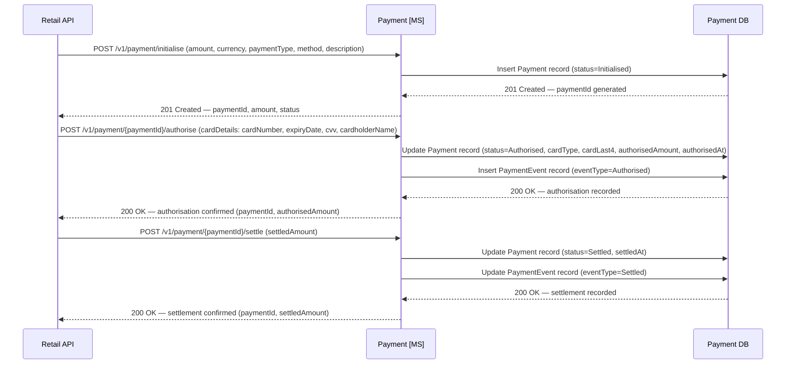
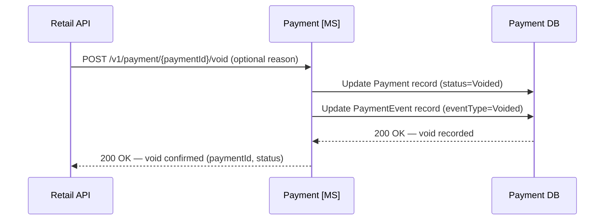

# Payment domain

## Overview

The Payment microservice is the financial orchestration layer for all Apex Air transactions, interfacing with the external card payment processor on behalf of all channels.

- A single booking generates multiple independent payment transactions: fare, seat ancillary, and bag ancillary are each initialised, authorised, and settled separately with their own `PaymentId`.
- Granular transactions enable precise revenue attribution, targeted partial refunds, and PCI DSS compliance — card data is handled and discarded entirely within the Payment MS boundary.

## Initialise, authorise, and settle

Payment processing follows a three-step lifecycle: initialise, authorise, and settle. Each transaction is tracked by a unique `PaymentId` (GUID) generated at initialisation and returned to the Retail API for use in all subsequent operations.

- The Retail API first calls the initialise endpoint with order details (amount, currency, payment type, description) to create the payment record. The Payment MS generates a `PaymentId` and returns it.
- The Retail API then calls the authorise endpoint with the `PaymentId`, a `cardDetails` object (`cardNumber`, `expiryDate`, `cvv`, `cardholderName`), and optionally an explicit `amount`. A `PaymentEvent` row with `EventType = Authorised` is created per call. `AuthorisedAmount` accumulates across calls. Full card data is held in memory only and never persisted (PCI DSS).
- Fare payment is authorised and settled during the booking confirmation flow; ancillary payments (seat, bag) are authorised upfront and settled after order confirmation. Each settle call creates a new `PaymentEvent` row (`PartialSettlement` or `Settled`). `SettledAmount` accumulates across calls.
- If an authorised payment needs to be cancelled before settlement, the void endpoint releases the held funds and creates a `Voided` PaymentEvent.
- The Payment DB is the system of record for all financial transactions.

### Partial authorisation (split payment)

A single initialised payment can be authorised and settled in multiple cycles — for example, a 500 GBP total split into a 400 GBP fare portion and a 100 GBP seat portion:

1. Initialise once for 500 GBP → `Initialised`
2. Authorise 400 GBP (fare) → `Authorised`, `AuthorisedAmount = 400`
3. Settle 400 GBP → `PartiallySettled`, `SettledAmount = 400`
4. Authorise 100 GBP (seat) → `Authorised`, `AuthorisedAmount = 500` (accumulated)
5. Settle 100 GBP → `Settled`, `SettledAmount = 500` (accumulated)

Each authorise call may be made from `Initialised` or `PartiallySettled` status. Each produces its own `PaymentEvent` row.

*Ref: payment - initialise, card authorisation and settlement sequence*

## Void

A void cancels an authorised payment before settlement, releasing the held funds back to the cardholder. The `PaymentEvent` row created at authorisation is updated with `EventType = Voided`.

*Ref: payment - void sequence*

## Data schema

The Payment domain uses two tables: `Payment` (one row per transaction, tracking lifecycle from initialisation through authorisation to settlement or void) and `PaymentEvent` (one row per authorisation, updated on settlement or void to reflect the current state).

### `payment.Payment`

| Column | Type | Nullable | Default | Key | Notes |
|---|---|---|---|---|---|
| PaymentId | UNIQUEIDENTIFIER | No | NEWID() | PK | Returned to Retail API at initialisation |
| BookingReference | CHAR(6) | Yes | | | Set once the order is confirmed; null during initial payment flow |
| PaymentType | VARCHAR(30) | No | | | `Fare` · `SeatAncillary` · `BagAncillary` · `FareChange` · `Cancellation` · `Refund` |
| Method | VARCHAR(20) | No | | | `CreditCard` · `DebitCard` · `PayPal` · `ApplePay` |
| CardType | VARCHAR(20) | Yes | | | `Visa` · `Mastercard` · `Amex` · etc.; null until authorisation |
| CardLast4 | CHAR(4) | Yes | | | Last 4 digits only — full PAN must never be stored; null until authorisation |
| CurrencyCode | CHAR(3) | No | `'GBP'` | | ISO 4217 currency code |
| Amount | DECIMAL(10,2) | No | | | Intended payment amount, set at initialisation |
| AuthorisedAmount | DECIMAL(10,2) | Yes | | | Amount approved by the payment processor; null until authorisation |
| SettledAmount | DECIMAL(10,2) | Yes | | | Null until settlement; may differ from `AuthorisedAmount` on partial settlement |
| Status | VARCHAR(20) | No | | | `Initialised` · `Authorised` · `Settled` · `PartiallySettled` · `Refunded` · `Declined` · `Voided` |
| AuthorisedAt | DATETIME2 | Yes | | | Null until authorisation |
| SettledAt | DATETIME2 | Yes | | | Null until settlement |
| Description | VARCHAR(255) | Yes | | | Human-readable description, e.g. `'Fare LHR-JFK-LHR, 2 PAX'` |
| CreatedAt | DATETIME2 | No | SYSUTCDATETIME() | | |
| UpdatedAt | DATETIME2 | No | SYSUTCDATETIME() | | |

> **Indexes:** `IX_Payment_BookingReference` on `(BookingReference)` WHERE `BookingReference IS NOT NULL`.
> **PCI DSS:** Full card numbers, CVV codes, and raw processor tokens must never be stored. Only `CardLast4` and `CardType` are retained. The processor token used during the transaction lifetime is held in memory only and discarded after settlement.

### `payment.PaymentEvent`

| Column | Type | Nullable | Default | Key | Notes |
|---|---|---|---|---|---|
| PaymentEventId | UNIQUEIDENTIFIER | No | NEWID() | PK | |
| PaymentId | UNIQUEIDENTIFIER | No | | FK → `payment.Payment(PaymentId)` | |
| EventType | VARCHAR(20) | No | | | `Authorised` · `Settled` · `PartialSettlement` · `Refunded` · `Declined` · `Voided` |
| Amount | DECIMAL(10,2) | No | | | Amount associated with this event |
| CurrencyCode | CHAR(3) | No | `'GBP'` | | ISO 4217 currency code |
| Notes | VARCHAR(255) | Yes | | | Optional context, e.g. `'Partial seat refund row 1A'` |
| CreatedAt | DATETIME2 | No | SYSUTCDATETIME() | | |
| UpdatedAt | DATETIME2 | No | SYSUTCDATETIME() | | |

> **Indexes:** `IX_PaymentEvent_PaymentId` on `(PaymentId)`.
> **Lifecycle:** A `PaymentEvent` row is created when a payment is authorised and updated when the payment is subsequently settled or voided. Refund operations create a new `PaymentEvent` row.

> **PCI DSS:** Full card numbers, CVV codes, and raw processor tokens must never be stored in the Payment DB. Only `CardLast4` and `CardType` are retained. The payment processor token used during the transaction lifetime is held in memory only and discarded after settlement.
