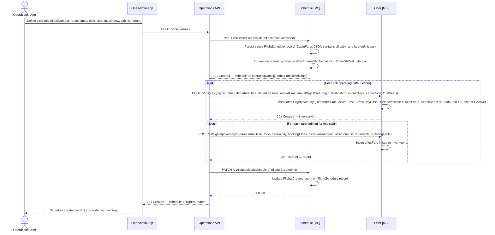

# Schedule domain

The Schedule capability allows operations staff to define repeating flight schedules. A single `POST /v1/schedules` creates the schedule record and triggers bulk `FlightInventory` and `Fare` generation in the Offer domain for every operating date in the `ValidFrom`–`ValidTo` window that matches the days-of-week bitmask. Generated inventory is immediately live for search with no additional activation step. Pricing (base fare, taxes, refundability, changeability) is supplied at schedule creation time and written directly to `offer.Fare` — one row per fare per operating date per cabin.

The schedule record persists in the Schedule domain as the operational source of truth; subsequent modifications or extensions require a new schedule definition.

## Data schema — `schedule.FlightSchedule`

The former `schedule.ScheduleCabin` and `schedule.ScheduleFare` tables have been consolidated into `schedule.FlightSchedule`. Cabin and fare definitions are stored in a single `CabinFares` JSON column — they are always read and written together as a unit, and are never queried individually by the Schedule MS. Removing the two child tables eliminates two FK joins on every schedule read and simplifies the write path to a single `INSERT`.

| Column | Type | Nullable | Default | Key | Notes |
|---|---|---|---|---|---|
| ScheduleId | UNIQUEIDENTIFIER | No | NEWID() | PK | |
| FlightNumber | VARCHAR(10) | No | | | e.g. `AX001` |
| Origin | CHAR(3) | No | | | IATA airport code |
| Destination | CHAR(3) | No | | | IATA airport code |
| DepartureTime | TIME | No | | | Local time at origin airport |
| ArrivalTime | TIME | No | | | Local time at destination airport |
| ArrivalDayOffset | TINYINT | No | 0 | | `0` = same calendar day; `1` = next day at destination |
| DaysOfWeek | TINYINT | No | | | Bitmask: Mon=1, Tue=2, Wed=4, Thu=8, Fri=16, Sat=32, Sun=64; daily = 127 |
| AircraftType | VARCHAR(4) | No | | | IATA 4-char code, e.g. `A351`, `B789`, `A339` |
| ValidFrom | DATE | No | | | First operating date (inclusive) |
| ValidTo | DATE | No | | | Last operating date (inclusive) |
| FlightsCreated | INT | No | 0 | | Count of `FlightInventory` rows generated at creation time |
| CabinFares | NVARCHAR(MAX) | No | | | JSON array of cabin and fare definitions (see example below) |
| CreatedAt | DATETIME2 | No | SYSUTCDATETIME() | | |
| CreatedBy | VARCHAR(100) | No | | | Identity reference of the operations user who submitted the schedule |
| UpdatedAt | DATETIME2 | No | SYSUTCDATETIME() | | |

> **Indexes:** `IX_FlightSchedule_FlightNumber` on `(FlightNumber, ValidFrom, ValidTo)`.
> **DaysOfWeek bitmask:** Operating days are encoded as a bitfield (ISO week order: Mon–Sun). A daily flight uses value `127` (all seven bits set); Mon/Wed/Fri uses `21` (bits 1+4+16). This encoding enables efficient date enumeration without a supporting day-of-week lookup table.
> **Constraints:** `CHK_CabinFares` — `ISJSON(CabinFares) = 1`.

### CabinFares JSON structure

```json
{
  "cabins": [
    {
      "cabinCode": "J",
      "totalSeats": 48,
      "fares": [
        {
          "fareBasisCode": "JFLEXGB",
          "fareFamily": "Business Flex",
          "currencyCode": "GBP",
          "baseFareAmount": 1250.00,
          "taxAmount": 182.50,
          "isRefundable": true,
          "isChangeable": true,
          "changeFeeAmount": 0.00,
          "cancellationFeeAmount": 0.00,
          "pointsPrice": 125000,
          "pointsTaxes": 182.50
        },
        {
          "fareBasisCode": "JSAVERGB",
          "fareFamily": "Business Saver",
          "currencyCode": "GBP",
          "baseFareAmount": 950.00,
          "taxAmount": 182.50,
          "isRefundable": false,
          "isChangeable": true,
          "changeFeeAmount": 150.00,
          "cancellationFeeAmount": 0.00,
          "pointsPrice": 95000,
          "pointsTaxes": 182.50
        }
      ]
    },
    {
      "cabinCode": "Y",
      "totalSeats": 220,
      "fares": [
        {
          "fareBasisCode": "YFLEXGB",
          "fareFamily": "Economy Flex",
          "currencyCode": "GBP",
          "baseFareAmount": 350.00,
          "taxAmount": 97.25,
          "isRefundable": true,
          "isChangeable": true,
          "changeFeeAmount": 0.00,
          "cancellationFeeAmount": 0.00,
          "pointsPrice": 35000,
          "pointsTaxes": 97.25
        },
        {
          "fareBasisCode": "YLOWUK",
          "fareFamily": "Economy Light",
          "currencyCode": "GBP",
          "baseFareAmount": 149.00,
          "taxAmount": 97.25,
          "isRefundable": false,
          "isChangeable": false,
          "changeFeeAmount": 0.00,
          "cancellationFeeAmount": 149.00,
          "pointsPrice": null,
          "pointsTaxes": null
        }
      ]
    }
  ]
}
```

> `cabinCode` values: `F` · `J` · `W` · `Y`. `totalSeats` is sourced from the aircraft configuration for that cabin. `pointsPrice` and `pointsTaxes` are `null` for revenue-only fares. `changeFeeAmount` and `cancellationFeeAmount` default to `0.00`; non-changeable fares use `0.00` for `changeFeeAmount` since the change is simply not permitted. The Schedule MS copies this JSON verbatim into the response; the Operations API then reads each cabin and fare entry to drive the per-date `offer.FlightInventory` and `offer.Fare` creation calls to the Offer MS.

## Create schedule sequence diagram



*Ref: schedule creation — Operations API orchestrates: Schedule MS persists the schedule and returns operating dates, Operations API calls Offer MS directly to create FlightInventory and Fare records, then updates the FlightsCreated count via Schedule MS*
