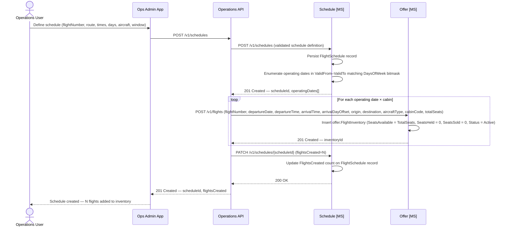

# Schedule domain

The Schedule capability allows operations staff to define repeating flight schedules. A single `POST /v1/schedules` creates the schedule record and triggers bulk `FlightInventory` generation in the Offer domain for every operating date in the `ValidFrom`–`ValidTo` window that matches the days-of-week bitmask. Generated inventory is immediately live for search with no additional activation step.

Fares are **not** defined at schedule creation time. Once inventory is live, pricing is applied through the Offer microservice using `POST /v1/flights/{inventoryId}/fares` — one call per fare per inventory record. This keeps pricing concerns cleanly inside the Offer domain.

The schedule record persists in the Schedule domain as the operational source of truth; subsequent modifications or extensions require a new schedule definition.

## Data schema — `schedule.FlightSchedule`

| Column | Type | Nullable | Default | Key | Notes |
|---|---|---|---|---|---|
| ScheduleId | UNIQUEIDENTIFIER | No | NEWID() | PK | |
| FlightNumber | VARCHAR(10) | No | | | e.g. `AX001` |
| Origin | CHAR(3) | No | | | IATA airport code |
| Destination | CHAR(3) | No | | | IATA airport code |
| DepartureTime | TIME | No | | | Local time at origin airport |
| ArrivalTime | TIME | No | | | Local time at destination airport |
| ArrivalDayOffset | TINYINT | No | 0 | | `0` = same calendar day; `1` = next day at destination |
| DaysOfWeek | TINYINT | No | | | Bitmask: Mon=1, Tue=2, Wed=4, Thu=8, Fri=16, Sat=32, Sun=64; daily = 127 |
| AircraftType | VARCHAR(4) | No | | | IATA 4-char code, e.g. `A351`, `B789`, `A339` |
| ValidFrom | DATE | No | | | First operating date (inclusive) |
| ValidTo | DATE | No | | | Last operating date (inclusive) |
| FlightsCreated | INT | No | 0 | | Count of `FlightInventory` rows generated at creation time |
| CreatedAt | DATETIME2 | No | SYSUTCDATETIME() | | |
| CreatedBy | VARCHAR(100) | No | | | Identity reference of the operations user who submitted the schedule |
| UpdatedAt | DATETIME2 | No | SYSUTCDATETIME() | | |

> **Indexes:** `IX_FlightSchedule_FlightNumber` on `(FlightNumber, ValidFrom, ValidTo)`.
> **DaysOfWeek bitmask:** Operating days are encoded as a bitfield (ISO week order: Mon–Sun). A daily flight uses value `127` (all seven bits set); Mon/Wed/Fri uses `21` (bits 1+4+16). This encoding enables efficient date enumeration without a supporting day-of-week lookup table.

## Create schedule sequence diagram



*Ref: schedule creation — Operations API orchestrates: Schedule MS persists the schedule and returns operating dates, Operations API calls Offer MS to create FlightInventory records, then updates the FlightsCreated count via Schedule MS. Fares are applied separately via `POST /v1/flights/{inventoryId}/fares` in the Offer domain.*

## SSIM export

The Schedule MS exposes `GET /v1/schedules/ssim` which returns all active schedules encoded as an IATA SSIM Chapter 7 file. This file can be ingested directly by any GDS, PSS, or airport system that supports the SSIM standard.

### What is SSIM?

SSIM (Standard Schedules Information Manual) is an IATA standard defining a plain ASCII flat-file format for airline schedule exchange. It is used industry-wide for bulk timetable distribution to GDS systems, airport slot coordinators, codeshare partners, and other downstream consumers.

The file format is fixed-width and positional — every character position in every record has a defined meaning. Records are exactly **200 characters wide**, space-padded, and terminated with CRLF. The conventional file extension is `.ssim`.

### Record types

| Record type | First char | Purpose |
|---|---|---|
| Type 1 | `1` | Transmission header — sender, season window, file creation date |
| Type 2 | `2` | Carrier header — airline designator and IATA season code |
| Type 3 | `3` | Flight leg record — one per `FlightSchedule` row; carries the operating pattern |
| Type 5 | `5` | Trailer — count of Type 3 records for validation |

Type 3 is the substance of the file. Each record encodes a complete operating pattern for one flight leg across its season window.

### Type 3 positional layout

| Positions | Width | Content | Example |
|---|---|---|---|
| 1 | 1 | Record type | `3` |
| 2 | 1 | Operational suffix (space = active) | ` ` |
| 3–4 | 2 | Airline IATA designator | `AX` |
| 5 | 1 | Space | ` ` |
| 6–9 | 4 | Flight number, zero-padded | `0001` |
| 10 | 1 | Space | ` ` |
| 11 | 1 | Service type (`Y` = scheduled passenger) | `Y` |
| 12 | 1 | Space | ` ` |
| 13–20 | 8 | Period start `YYYYMMDD` | `20260101` |
| 21 | 1 | Space | ` ` |
| 22–29 | 8 | Period end `YYYYMMDD` | `20261231` |
| 30–31 | 2 | Itinerary variation (unused for non-stop) | `  ` |
| 32–38 | 7 | Days-of-week mask (see below) | `1234567` |
| 39 | 1 | Space | ` ` |
| 40–42 | 3 | Departure station IATA code | `LHR` |
| 43–46 | 4 | Departure time local `HHMM` | `0800` |
| 47–49 | 3 | Departure UTC offset | `+00` |
| 50–53 | 4 | Arrival time local `HHMM` | `1110` |
| 54 | 1 | Arrival day offset (`0` = same day, `1` = next day) | `0` |
| 55 | 1 | Space | ` ` |
| 56–58 | 3 | Destination station IATA code | `JFK` |
| 59–61 | 3 | Spaces | `   ` |
| 62–64 | 3 | Equipment IATA type code (first 3 chars) | `A35` |
| 65 | 1 | Space | ` ` |
| 66–67 | 2 | Operating carrier code | `AX` |
| 68–200 | 133 | Space-padded to record width | |

### Days-of-week encoding

The 7-character days-of-week field uses **absolute positions**, not sequential digits. Position 1 always represents Monday, position 7 always represents Sunday. An operating day shows its position digit; a non-operating day is a space character.

| DaysOfWeek bitmask bit | SSIM position | Day |
|---|---|---|
| bit 0 (value 1) | position 1 | Monday |
| bit 1 (value 2) | position 2 | Tuesday |
| bit 2 (value 4) | position 3 | Wednesday |
| bit 3 (value 8) | position 4 | Thursday |
| bit 4 (value 16) | position 5 | Friday |
| bit 5 (value 32) | position 6 | Saturday |
| bit 6 (value 64) | position 7 | Sunday |

Examples:

| DaysOfWeek value | SSIM string | Meaning |
|---|---|---|
| `127` | `1234567` | Daily |
| `21` | `1 3 5  ` | Mon, Wed, Fri |
| `96` | `     67` | Sat, Sun |
| `1` | `1      ` | Monday only |

### UTC offset handling

Times in the SSIM file are local at the origin airport, with the UTC offset field set to `+00`. This matches the storage convention in `FlightSchedule.DepartureTime` and `.ArrivalTime`, which hold local schedule times. Downstream consumers (PSS, GDS) must apply the true UTC offset for each airport when converting to UTC for internal storage — this is the consumer's responsibility and a well-known SSIM integration requirement.

### Example output

```
1IATA  AX              20260101 20261231AX  SCHED  20260326
2AX  01W20260101 20261231
3 AX 0001 Y 20260101 20261231  1234567 LHR0800+001110 0 JFK   A35 AX
3 AX 0002 Y 20260101 20261231  1234567 JFK1300+000115 1 LHR   A35 AX
5       2
```

### Amendments and deletions

The SSIM standard supports amendment records (prefixed `D` for deletion, `N` for new pattern) to represent in-season changes. The current implementation generates a full base-pattern file. Amendment records are not yet supported; a schedule change requires creating a new `FlightSchedule` record.

### SSIM export sequence diagram

```mermaid
sequenceDiagram
    actor OpsUser as Operations User
    participant OpsApp as Ops Admin App
    participant ScheduleMS as Schedule [MS]

    OpsUser->>OpsApp: Request SSIM export
    OpsApp->>ScheduleMS: GET /v1/schedules/ssim
    ScheduleMS->>ScheduleMS: Load all FlightSchedule records ordered by FlightNumber
    ScheduleMS->>ScheduleMS: Build Type 1 header (sender, season window, file date)
    ScheduleMS->>ScheduleMS: Build Type 2 carrier header (IATA season designator)
    loop For each FlightSchedule
        ScheduleMS->>ScheduleMS: Build Type 3 leg record (200-char fixed-width, CRLF)
    end
    ScheduleMS->>ScheduleMS: Build Type 5 trailer (leg count)
    ScheduleMS-->>OpsApp: 200 OK — text/plain; charset=us-ascii, Content-Disposition: attachment; filename=schedules_YYYYMMDD.ssim
    OpsApp-->>OpsUser: Download SSIM file
```
