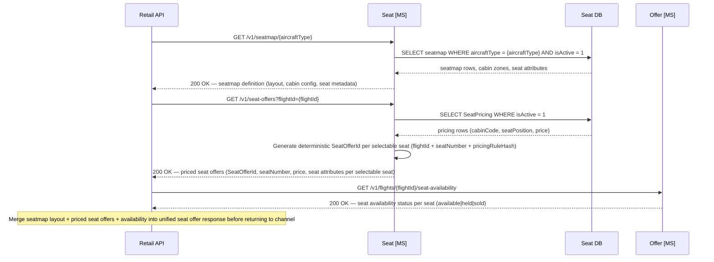
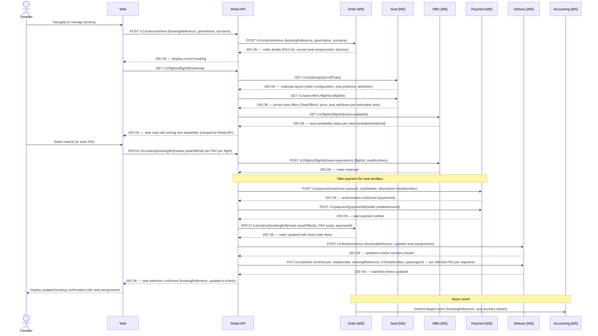

# Seat domain

The Seat microservice is the system of record for aircraft seatmap definitions, fleet-wide seat pricing rules, and **seat offer generation**.

- Provides cabin configuration, seat positions, seat attributes (class, position, extra legroom), position-based pricing rules, and seat offers (priced per seat per flight) via two booking-path endpoints: `GET /v1/seatmap/{aircraftType}` (layout) and `GET /v1/seat-offers?flightId={flightId}` (priced seat offers per selectable seat on a given flight). Admin CRUD endpoints manage `AircraftType`, `Seatmap`, and `SeatPricing` records.
- The Seat MS is the owner of `SeatOfferId` — seat offer IDs are generated by the Seat MS by combining the `flightId` (from `offer.FlightInventory`) and `seatNumber`. Since seat pricing is stable (position-based, fleet-wide), seat offers do not need to be stored: the Seat MS generates them deterministically on request.
- The Retail API retrieves the seatmap layout from the Seat MS, then retrieves priced seat offers (including `SeatOfferId`) from the Seat MS via `GET /v1/seat-offers?flightId={flightId}`, then retrieves per-seat availability status from the Offer MS via `GET /v1/flights/{flightId}/seat-availability` (available, held, or sold), and merges all three datasets before returning the seat offer response to the channel. The `SeatOfferId` values returned in this merged response originate from the Seat MS.
- `SeatOfferId` values are stored in the basket during the bookflow. When the Retail API needs to recall the current price for a basket seat offer (e.g. at order confirmation), it calls `GET /v1/seat-offers/{seatOfferId}` on the Seat MS, which returns the latest pricing for that seat on that flight.

Seat prices are fleet-wide and position-based (not per flight):

| Position | Price |
|---|---|
| Window | £70.00 |
| Aisle | £50.00 |
| Middle | £20.00 |

Business Class and First Class seat selection is included in the fare with no ancillary charge (cabin codes `J` and `F`). The `SeatOfferId` returned to the channel as part of the merged seat offer response is generated by the Seat MS, and is passed to the Order microservice when a seat is purchased, linking the seat order item to the priced offer.

## Retrieve Seatmap Layout

The Seat microservice returns the physical cabin layout (`GET /v1/seatmap/{aircraftType}`) and priced seat offers (`GET /v1/seat-offers?flightId={flightId}`). Seat availability status (available, held, or sold) is a separate concern served by the Offer microservice via `GET /v1/flights/{flightId}/seat-availability` — the Offer MS returns availability status only and does not call the Seat MS for pricing. The Retail API retrieves layout and priced offers from the Seat MS, availability from the Offer MS, and merges all three datasets before returning the seat offer response to the channel.



*Ref: ancillary seat - Retail API retrieves seatmap layout and pricing from Seat MS, seat availability from Offer MS, then merges all three datasets into the seat offer response*

## Post-Sale Seat Selection

Post-sale seat selection presents the live seatmap with real-time availability and updates the manifest and e-tickets on confirmation.

- Full ancillary charge applies for post-sale seat selection.
- Seats assigned during OLCI (check-in) are free of charge — see the Online Check-In flow in the Delivery section.



*Ref: ancillary seat - post-sale seat selection with payment, e-ticket reissuance, and manifest update*

> **Ancillary document:** The Retail API must create a `delivery.Document` record (type `SeatAncillary`) via the Delivery MS for each seat purchase at order confirmation and post-sale, enabling the Accounting system to account for seat ancillary revenue independently of the fare ticket.

## Seat MS Endpoints

**Offer / query endpoints (called by Retail API during the booking path)**

| Method | Endpoint | Description |
|--------|----------|-------------|
| `GET` | `/v1/seatmap/{aircraftType}` | Retrieve seatmap definition and cabin layout for an aircraft type (physical layout, seat attributes, cabin configuration only — no pricing or availability) |
| `GET` | `/v1/seat-offers?flightId={flightId}` | Retrieve priced seat offers for all selectable seats on a given flight; returns one `SeatOffer` per selectable seat with `seatOfferId`, `seatNumber`, `seatPosition`, `cabinCode`, and `price`; `SeatOfferId` is a deterministic identifier generated by the Seat MS from `flightId + seatNumber` |
| `GET` | `/v1/seat-offers/{seatOfferId}` | Retrieve current pricing for a specific seat offer by ID; used by the Retail API at order confirmation to validate the price stored in the basket matches the current Seat MS price |

**Admin endpoints (called from a future Contact Centre admin app — not channel-facing)**

| Method | Endpoint | Description |
|--------|----------|-------------|
| `GET` | `/v1/aircraft-types` | List all aircraft types |
| `POST` | `/v1/aircraft-types` | Create a new aircraft type record |
| `GET` | `/v1/aircraft-types/{aircraftTypeCode}` | Retrieve an aircraft type by code |
| `PUT` | `/v1/aircraft-types/{aircraftTypeCode}` | Update an aircraft type record |
| `DELETE` | `/v1/aircraft-types/{aircraftTypeCode}` | Delete an aircraft type record (only permitted if no active seatmaps reference it) |
| `GET` | `/v1/seatmaps` | List all seatmap definitions |
| `POST` | `/v1/seatmaps` | Create a new seatmap definition for an aircraft type |
| `GET` | `/v1/seatmaps/{seatmapId}` | Retrieve a seatmap definition by ID |
| `PUT` | `/v1/seatmaps/{seatmapId}` | Replace the cabin layout of an existing seatmap (increments `Version`) |
| `DELETE` | `/v1/seatmaps/{seatmapId}` | Delete a seatmap definition |
| `GET` | `/v1/seat-pricing` | List all seat pricing rules |
| `POST` | `/v1/seat-pricing` | Create a new seat pricing rule (`cabinCode`, `seatPosition`, `currencyCode`, `price`, `validFrom`, `validTo`) |
| `GET` | `/v1/seat-pricing/{seatPricingId}` | Retrieve a seat pricing rule by ID |
| `PUT` | `/v1/seat-pricing/{seatPricingId}` | Update a seat pricing rule |
| `DELETE` | `/v1/seat-pricing/{seatPricingId}` | Delete a seat pricing rule |

## Data Schema — Seat

The Seat domain uses three tables: `AircraftType` (root reference record), `Seatmap` (one active row per aircraft configuration with full cabin layout as JSON), and `SeatPricing` (fleet-wide pricing rules by seat position and cabin, served by the Seat MS via `GET /v1/seat-pricing` — not embedded in the seatmap response). Seat offer generation is stateless — `SeatOfferId` values are computed deterministically by the Seat MS from `flightId + seatNumber` and do not require a dedicated storage table.

### `seat.AircraftType`

| Column | Type | Nullable | Default | Key | Notes |
|---|---|---|---|---|---|
| AircraftTypeCode | CHAR(4) | No | | PK | 4-char code: manufacturer prefix + 3-digit variant, e.g. `A351` (A350-1000), `B789` (B787-900) |
| Manufacturer | VARCHAR(50) | No | | | e.g. `Airbus`, `Boeing` |
| FriendlyName | VARCHAR(100) | Yes | | | e.g. `Airbus A350-1000`, `Boeing 787-900` |
| TotalSeats | SMALLINT | No | | | Total seat count across all cabins |
| CabinCounts | NVARCHAR(MAX) | Yes | | | JSON object mapping cabin code to seat count, e.g. `{"J": 32, "W": 56, "Y": 281}` |
| IsActive | BIT | No | `1` | | |
| CreatedAt | DATETIME2 | No | SYSUTCDATETIME() | | |
| UpdatedAt | DATETIME2 | No | SYSUTCDATETIME() | | |

### `seat.Seatmap`

| Column | Type | Nullable | Default | Key | Notes |
|---|---|---|---|---|---|
| SeatmapId | UNIQUEIDENTIFIER | No | NEWID() | PK | |
| AircraftTypeCode | CHAR(4) | No | | FK → `seat.AircraftType(AircraftTypeCode)` | |
| Version | INT | No | `1` | | Incremented when the layout is updated |
| IsActive | BIT | No | `1` | | Only one active seatmap per aircraft type at any time |
| CreatedAt | DATETIME2 | No | SYSUTCDATETIME() | | |
| UpdatedAt | DATETIME2 | No | SYSUTCDATETIME() | | |
| CabinLayout | NVARCHAR(MAX) | No | | | JSON document containing full cabin and seat definitions (see example below) |

> **Indexes:** `IX_Seatmap_AircraftType` on `(AircraftTypeCode)` WHERE `IsActive = 1`.
> **Constraints:** `CHK_CabinLayout` — `ISJSON(CabinLayout) = 1`; `CabinLayout` must be a valid JSON document.

### `seat.SeatPricing`

| Column | Type | Nullable | Default | Key | Notes |
|---|---|---|---|---|---|
| SeatPricingId | UNIQUEIDENTIFIER | No | NEWID() | PK | |
| CabinCode | CHAR(1) | No | | UK (with SeatPosition, CurrencyCode) | `W` (Premium Economy) · `Y` (Economy); Business Class (J/F) seats carry no ancillary charge |
| SeatPosition | VARCHAR(10) | No | | UK (with CabinCode, CurrencyCode) | `Window` · `Aisle` · `Middle` |
| CurrencyCode | CHAR(3) | No | `'GBP'` | UK (with CabinCode, SeatPosition) | ISO 4217 currency code |
| Price | DECIMAL(10,2) | No | | | |
| IsActive | BIT | No | `1` | | |
| ValidFrom | DATETIME2 | No | | | Effective start of this pricing rule |
| ValidTo | DATETIME2 | Yes | | | Null = open-ended / currently active |
| CreatedAt | DATETIME2 | No | SYSUTCDATETIME() | | |
| UpdatedAt | DATETIME2 | No | SYSUTCDATETIME() | | |

> **Constraints:** `UQ_SeatPricing_CabinPosition` (unique) on `(CabinCode, SeatPosition, CurrencyCode)` — enforces one active price per cabin/position/currency combination.
> **Pricing scope:** Pricing is fleet-wide and applied uniformly across all aircraft and routes. Business Class and First Class seats (cabin codes `J` and `F`) are excluded from `SeatPricing` — selection is included in the fare with no ancillary charge.
> **Example seed data:** `('W', 'Window', 'GBP', 70.00)` · `('W', 'Aisle', 'GBP', 50.00)` · `('W', 'Middle', 'GBP', 20.00)` · `('Y', 'Window', 'GBP', 70.00)` · `('Y', 'Aisle', 'GBP', 50.00)` · `('Y', 'Middle', 'GBP', 20.00)`.

> **Seat offer generation (Retail API responsibility):** When a channel requests a seatmap with pricing and availability, the Retail API calls the Seat MS for the seatmap layout (`GET /v1/seatmap/{aircraftType}`), then calls the Seat MS again for priced seat offers (`GET /v1/seat-offers?flightId={flightId}` — returns a `SeatOfferId` and price per selectable seat), then calls the Offer MS for per-seat availability status only (`GET /v1/flights/{flightId}/seat-availability` — returns available, held, or sold status per seat). The Retail API merges all three datasets (layout + pricing + availability) into the unified seatmap response returned to the channel. The `SeatOfferId` is generated deterministically by the Seat MS from `flightId + seatNumber + pricingRuleHash` and is short-lived — valid only for the duration of the current booking session. The Order microservice stores the `SeatOfferId` on the seat order item for traceability.

**Example `CabinLayout` JSON document**

The JSON is structured as an ordered array of cabins, each containing a column configuration and an array of rows. Each seat carries its label, position, and physical attributes. Pricing and availability are **not** embedded here — pricing is returned by the Seat MS via `GET /v1/seat-offers?flightId={flightId}` and availability by the Offer MS via `GET /v1/flights/{flightId}/seat-availability`; all three are merged by the Retail API before the seatmap is returned to the channel. The `isSelectable` flag reflects only whether a seat is physically available for selection (not a crew seat, structural block, or permanently closed position); real-time occupancy is overlaid from the Offer microservice at query time.

```json
{
  "aircraftType": "A351",
  "version": 1,
  "totalSeats": 258,
  "cabins": [
    {
      "cabinCode": "J",
      "cabinName": "Business Class",
      "deckLevel": "Main",
      "startRow": 1,
      "endRow": 8,
      "columns": ["A", "D", "G", "K"],
      "layout": "1-1-1-1",
      "rows": [
        {
          "rowNumber": 1,
          "seats": [
            {
              "seatNumber": "1A",
              "column": "A",
              "type": "Suite",
              "position": "Window",
              "attributes": ["ExtraLegroom", "BlockedForCrew"],
              "isSelectable": false
            },
            {
              "seatNumber": "1D",
              "column": "D",
              "type": "Suite",
              "position": "Middle",
              "attributes": ["ExtraLegroom"],
              "isSelectable": true
            },
            {
              "seatNumber": "1G",
              "column": "G",
              "type": "Suite",
              "position": "Middle",
              "attributes": ["ExtraLegroom"],
              "isSelectable": true
            },
            {
              "seatNumber": "1K",
              "column": "K",
              "type": "Suite",
              "position": "Window",
              "attributes": ["ExtraLegroom"],
              "isSelectable": true
            }
          ]
        }
      ]
    },
    {
      "cabinCode": "W",
      "cabinName": "Premium Economy",
      "deckLevel": "Main",
      "startRow": 11,
      "endRow": 18,
      "columns": ["A", "B", "D", "E", "F", "H", "K"],
      "layout": "2-3-2",
      "rows": [
        {
          "rowNumber": 11,
          "seats": [
            {
              "seatNumber": "11A",
              "column": "A",
              "type": "Standard",
              "position": "Window",
              "attributes": ["ExtraLegroom"],
              "isSelectable": true
            },
            {
              "seatNumber": "11B",
              "column": "B",
              "type": "Standard",
              "position": "Aisle",
              "attributes": ["ExtraLegroom"],
              "isSelectable": true
            },
            {
              "seatNumber": "11D",
              "column": "D",
              "type": "Standard",
              "position": "Aisle",
              "attributes": ["ExtraLegroom"],
              "isSelectable": true
            },
            {
              "seatNumber": "11E",
              "column": "E",
              "type": "Standard",
              "position": "Middle",
              "attributes": ["ExtraLegroom"],
              "isSelectable": true
            },
            {
              "seatNumber": "11F",
              "column": "F",
              "type": "Standard",
              "position": "Aisle",
              "attributes": ["ExtraLegroom"],
              "isSelectable": true
            },
            {
              "seatNumber": "11H",
              "column": "H",
              "type": "Standard",
              "position": "Aisle",
              "attributes": ["ExtraLegroom"],
              "isSelectable": true
            },
            {
              "seatNumber": "11K",
              "column": "K",
              "type": "Standard",
              "position": "Window",
              "attributes": ["ExtraLegroom"],
              "isSelectable": true
            }
          ]
        }
      ]
    },
    {
      "cabinCode": "Y",
      "cabinName": "Economy",
      "deckLevel": "Main",
      "startRow": 22,
      "endRow": 54,
      "columns": ["A", "B", "C", "D", "E", "F", "G", "H", "K"],
      "layout": "3-3-3",
      "rows": [
        {
          "rowNumber": 22,
          "seats": [
            {
              "seatNumber": "22A",
              "column": "A",
              "type": "Standard",
              "position": "Window",
              "attributes": ["ExtraLegroom"],
              "isSelectable": true
            },
            {
              "seatNumber": "22B",
              "column": "B",
              "type": "Standard",
              "position": "Middle",
              "attributes": ["ExtraLegroom"],
              "isSelectable": true
            },
            {
              "seatNumber": "22C",
              "column": "C",
              "type": "Standard",
              "position": "Aisle",
              "attributes": ["ExtraLegroom"],
              "isSelectable": true
            },
            {
              "seatNumber": "22D",
              "column": "D",
              "type": "Standard",
              "position": "Aisle",
              "attributes": ["ExtraLegroom"],
              "isSelectable": true
            },
            {
              "seatNumber": "22E",
              "column": "E",
              "type": "Standard",
              "position": "Middle",
              "attributes": ["ExtraLegroom"],
              "isSelectable": true
            },
            {
              "seatNumber": "22F",
              "column": "F",
              "type": "Standard",
              "position": "Aisle",
              "attributes": ["ExtraLegroom"],
              "isSelectable": true
            },
            {
              "seatNumber": "22G",
              "column": "G",
              "type": "Standard",
              "position": "Aisle",
              "attributes": ["ExtraLegroom"],
              "isSelectable": true
            },
            {
              "seatNumber": "22H",
              "column": "H",
              "type": "Standard",
              "position": "Middle",
              "attributes": ["ExtraLegroom"],
              "isSelectable": true
            },
            {
              "seatNumber": "22K",
              "column": "K",
              "type": "Standard",
              "position": "Window",
              "attributes": ["ExtraLegroom"],
              "isSelectable": true
            }
          ]
        }
      ]
    }
  ]
}
```

> **Note:** `isSelectable` reflects whether a seat is physically available for selection (i.e. not a structural no-fly zone, crew seat, or permanently blocked position). Real-time occupancy — whether a seat has been sold or held on a specific flight — is not stored here and is not returned by the Seat microservice; it is provided by the Offer microservice via `GET /v1/flights/{flightId}/seat-availability` (availability status only) and merged into the seatmap response by the Retail API. Seat pricing and `SeatOfferId` values are sourced from the Seat MS via `GET /v1/seat-offers?flightId={flightId}` and are never embedded in `CabinLayout`. The Retail API merges layout, priced seat offers, and availability before returning to the channel.
