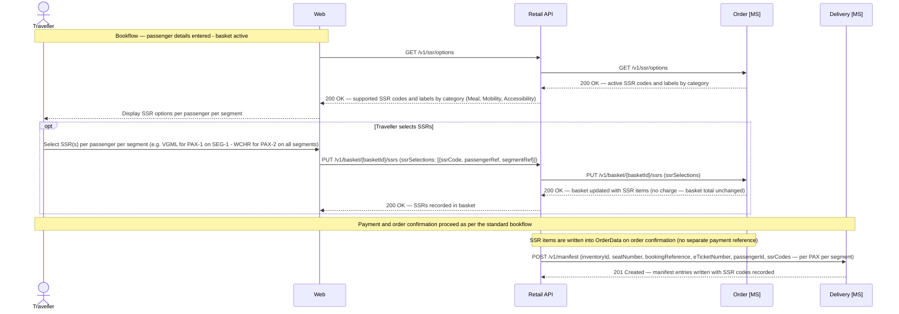
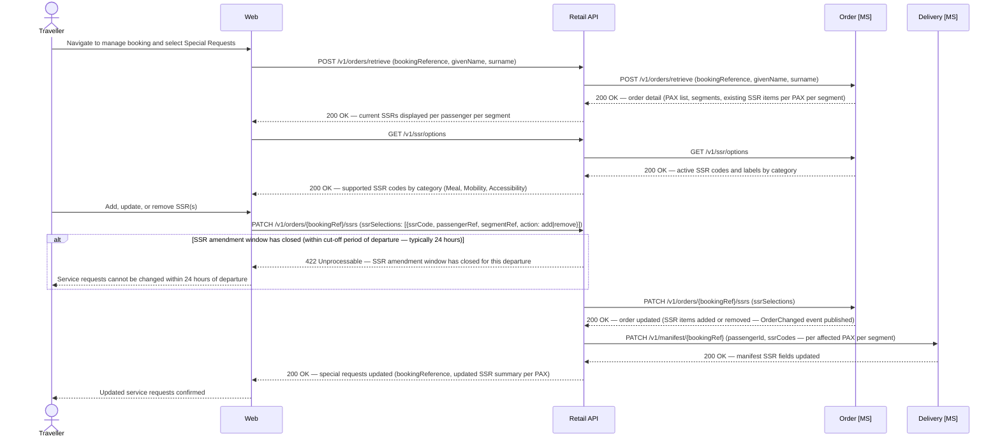

# SSR — Special Service Requests

## Overview

SSRs are IATA-standardised four-character codes communicating individual passenger service needs to operations, ground handlers, and cabin crew.

- Two categories: **meal/dietary requests** (VGML, MOML, DBML, etc.) and **mobility/accessibility assistance** (WCHR, WCHS, WCHC, BLND, DEAF, etc.).
- All SSRs carry no ancillary charge; **EU Regulation 1107/2006** requires carriers to accommodate disabled passengers without surcharge.
- SSRs are segment-specific — a connecting passenger requires independent SSR entries per leg.
- Meal SSRs require at least 24 hours' notice; accessibility SSRs accepted up to check-in close but earlier notice aids ground handling preparation.
- On IROPS rebooking, the Disruption API carries all SSR items from the cancelled segment to the replacement itinerary.
- The SSR catalogue is stored in `order.SsrCatalogue`, owned by the Order MS. The Retail API exposes `GET /v1/ssr/options` to channels by proxying to the Order MS `GET /v1/ssr/options` endpoint — the Retail API holds no direct database connection. CRUD admin endpoints allow authorised staff (via a future Contact Centre admin app) to add, update, and deactivate SSR codes without a code deployment.
- Selections stored as typed items in `OrderData` per passenger per segment and included in the manifest payload so `delivery.Manifest` records carry operational codes for crew briefings and ground handling.

## `order.SsrCatalogue` data schema

| Column | Type | Nullable | Default | Key | Notes |
|---|---|---|---|---|---|
| SsrCatalogueId | UNIQUEIDENTIFIER | No | NEWID() | PK | |
| SsrCode | CHAR(4) | No | | UK | IATA four-character SSR code, e.g. `VGML`, `WCHR` |
| Label | VARCHAR(100) | No | | | Human-readable name displayed on channel, e.g. `Vegetarian meal (lacto-ovo)` |
| Category | VARCHAR(20) | No | | | `Meal` · `Mobility` · `Accessibility` |
| IsActive | BIT | No | `1` | | Inactive codes are excluded from `GET /v1/ssr/options` responses but retained for historical order display |
| CreatedAt | DATETIME2 | No | SYSUTCDATETIME() | | |
| UpdatedAt | DATETIME2 | No | SYSUTCDATETIME() | | |

> **Indexes:** `IX_SsrCatalogue_Code` on `(SsrCode)` WHERE `IsActive = 1`.

## SSR Catalogue CRUD Endpoints (Retail API)

| Method | Endpoint | Description |
|--------|----------|-------------|
| `GET` | `/v1/ssr/options` | Retrieve all active SSR codes and labels by category; accepts optional `cabinCode` and `flightNumbers` query parameters to filter applicable SSRs |
| `POST` | `/v1/ssr/options` | Create a new SSR catalogue entry (`ssrCode`, `label`, `category`); called by admin tools to add new SSR codes without redeployment |
| `PUT` | `/v1/ssr/options/{ssrCode}` | Update an existing SSR catalogue entry (label or category); `ssrCode` itself is immutable |
| `DELETE` | `/v1/ssr/options/{ssrCode}` | Deactivate an SSR code (`IsActive = 0`); existing order items referencing the code are unaffected |

## Supported SSR codes

| Code | Category | Service |
|---|---|---|
| `VGML` | Meal | Vegetarian meal (lacto-ovo) |
| `HNML` | Meal | Hindu meal |
| `MOML` | Meal | Muslim / halal meal |
| `KSML` | Meal | Kosher meal |
| `DBML` | Meal | Diabetic meal |
| `GFML` | Meal | Gluten-free meal |
| `CHML` | Meal | Child meal |
| `BBML` | Meal | Baby / infant meal |
| `WCHR` | Mobility | Wheelchair — can walk but needs assistance over distances; cannot manage aircraft steps |
| `WCHS` | Mobility | Wheelchair — cannot manage steps; mobile on level ground |
| `WCHC` | Mobility | Wheelchair — fully immobile; requires cabin-seat assistance throughout |
| `BLND` | Accessibility | Blind or severely visually impaired passenger |
| `DEAF` | Accessibility | Deaf or severely hearing-impaired passenger |
| `DPNA` | Accessibility | Disabled passenger needing assistance (general; use where a more specific code does not apply) |

## SSR Selection — Bookflow

SSR selection is an optional bookflow step offered after passenger details are captured, alongside seat and bag selection.

- The Retail API retrieves the SSR catalogue by calling `GET /v1/ssr/options` on the Order MS, which owns `order.SsrCatalogue`.
- No payment triggered — selections are appended to the basket as SSR items and committed to `OrderData` at order confirmation.
- SSR codes are included in the manifest payload written to the Delivery MS, ensuring operational visibility from the moment the booking is confirmed.

*Ref: SSR — selection during bookflow with basket update and manifest population at order confirmation*

## SSR Management — Self-Serve

Passengers may add, change, or remove SSRs post-booking through the manage-booking flow up to the amendment cut-off.

- Amendment cut-off is typically 24 hours before departure for meal requests; the same threshold is applied to accessibility requests for consistency.
- The Retail API evaluates the cut-off window before forwarding any change to the Order MS; requests within the cut-off window are rejected with `422`.
- SSR changes do not trigger e-ticket reissuance — codes are not encoded in the BCBP string or e-ticket record; the update applies only to `OrderData` and the flight manifest.
- The `OrderChanged` event carries the updated SSR state for downstream consumers (e.g. a future notifications service).

*Ref: SSR — self-serve add, update, and remove via manage-booking flow with cut-off validation and manifest update*
