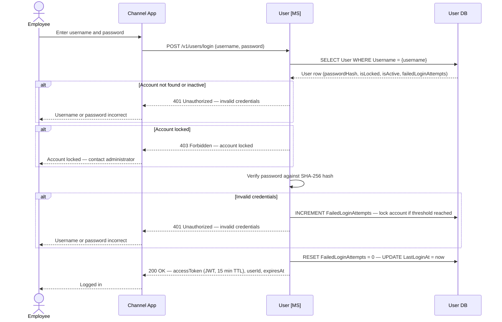

# User domain

The User microservice manages employee user accounts for Apex Air staff who access the reservation system (Contact Centre, Airport, Operations, and Finance apps). It is entirely separate from the Identity microservice, which manages loyalty member credentials.

- Credentials are stored as SHA-256 hashes; plain-text passwords are never persisted.
- Accounts can be locked after repeated failed login attempts (threshold: 5 consecutive failures).
- Login issues a short-lived JWT access token (15-minute TTL); there are no refresh tokens in this domain.

## Login

## Data schema — User

The User domain owns the `user.*` schema.

### `user.User`

| Column | Type | Nullable | Default | Key | Notes |
|---|---|---|---|---|---|
| UserId | UNIQUEIDENTIFIER | No | NEWID() | PK | |
| Username | VARCHAR(100) | No | | UK | Employee login username |
| Email | VARCHAR(254) | No | | UK | RFC 5321 maximum length |
| PasswordHash | VARCHAR(255) | No | | | SHA-256 hash; plain text must never be stored |
| FirstName | NVARCHAR(100) | No | | | |
| LastName | NVARCHAR(100) | No | | | |
| IsActive | BIT | No | `1` | | Set to `0` to deactivate an employee account without deleting it |
| IsLocked | BIT | No | `0` | | Set to `1` after repeated failed login attempts |
| FailedLoginAttempts | TINYINT | No | `0` | | Reset to `0` on successful authentication |
| LastLoginAt | DATETIME2 | Yes | | | Null until first successful login |
| CreatedAt | DATETIME2 | No | SYSUTCDATETIME() | | Database-generated; never written by application code |
| UpdatedAt | DATETIME2 | No | SYSUTCDATETIME() | | Database-generated via trigger |

> **Indexes:** `IX_User_Username` on `(Username)`, `IX_User_Email` on `(Email)`.
> **Account lockout:** After 5 consecutive failed login attempts, `IsLocked` is set to `1` and further login attempts are rejected. An administrator must unlock the account manually.
> **Password hashing:** Passwords are hashed using SHA-256. The raw password must not be stored, logged, or transmitted after the initial hash operation.
> **Trigger:** `TR_User_UpdatedAt` — maintains `UpdatedAt` automatically on every `UPDATE`.

## User management

Staff users with a valid JWT can manage employee accounts through the Admin API's user management endpoints. The Admin API delegates all operations to the User microservice.

### Capabilities

- **List users** — retrieve all employee accounts (passwords excluded).
- **Get user** — retrieve a single user account by `UserId`.
- **Create user** — provision a new employee account with username, email, password, first name, and last name. Username and email must be unique. Password is hashed (SHA-256) before storage.
- **Update user** — modify profile fields (firstName, lastName, email). All fields are optional; only supplied fields change. Email uniqueness is enforced.
- **Set status** — activate or deactivate a user account without deleting it.
- **Unlock account** — clear the `IsLocked` flag and reset `FailedLoginAttempts` to zero.
- **Reset password** — set a new password hash, unlock the account, and clear failed login attempts.

### Access control

All user management endpoints require a valid staff JWT (issued at login) with a `role` claim of `User`. The `TerminalAuthenticationMiddleware` validates the token signature (HMAC-SHA256), issuer, audience, lifetime, and role claim before the request reaches any handler. Functions are identified as admin routes by the `Admin` prefix in the Azure Function name.
