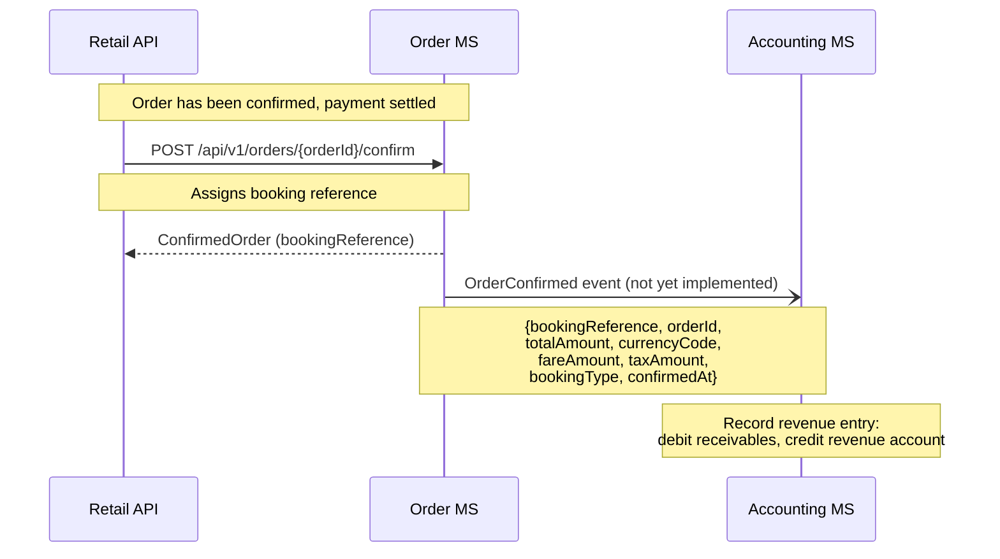
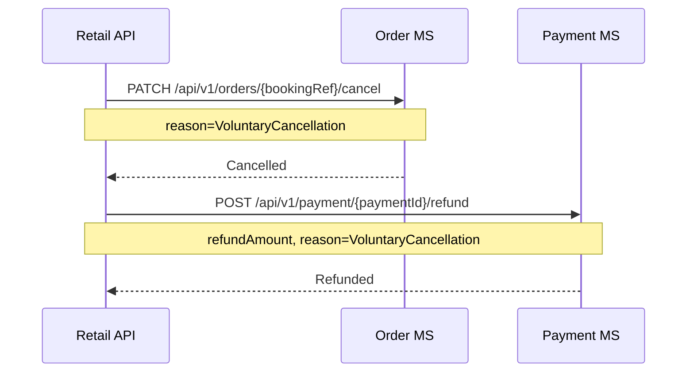

# Accounting — sequence diagrams

The Accounting domain is described in the design as event-driven (consuming `OrderConfirmed` and `OrderCancelled` events from the Order MS). **This domain is not currently implemented** — no Accounting microservice exists in the codebase and no event consumer is wired up.

The current implementation handles financial operations synchronously:

- **Refunds** are issued directly by the Retail API calling `POST /api/v1/payment/{paymentId}/refund` on the Payment MS inside `CancelOrderHandler`.
- **Revenue tracking** is implicit in the Payment MS event log (Authorise / Settle / Refund events per paymentId).

The diagrams below document the **intended design** for future implementation.

---

## Revenue recording (order confirmed) — intended design

When an order is confirmed in the Order MS, an `OrderConfirmed` event is intended to be published. The Accounting domain would consume this event to record the revenue transaction.

---

## Refund recording (order cancelled) — current implementation

Refunds are currently issued synchronously by the Retail API. The intended event-driven flow to an Accounting MS is not yet implemented.

