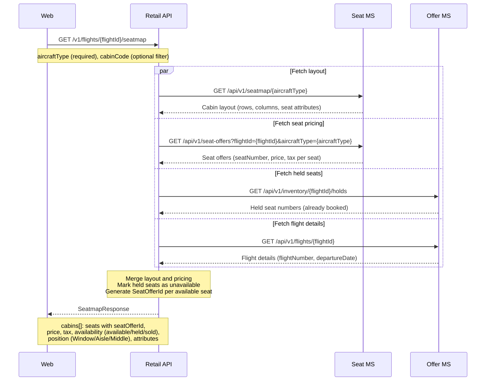
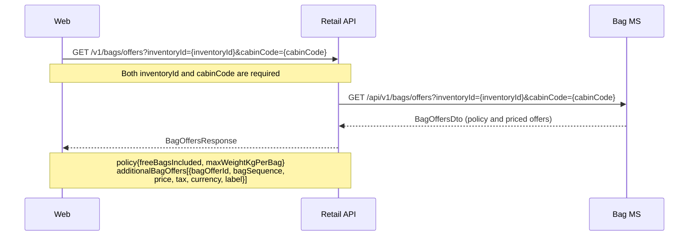
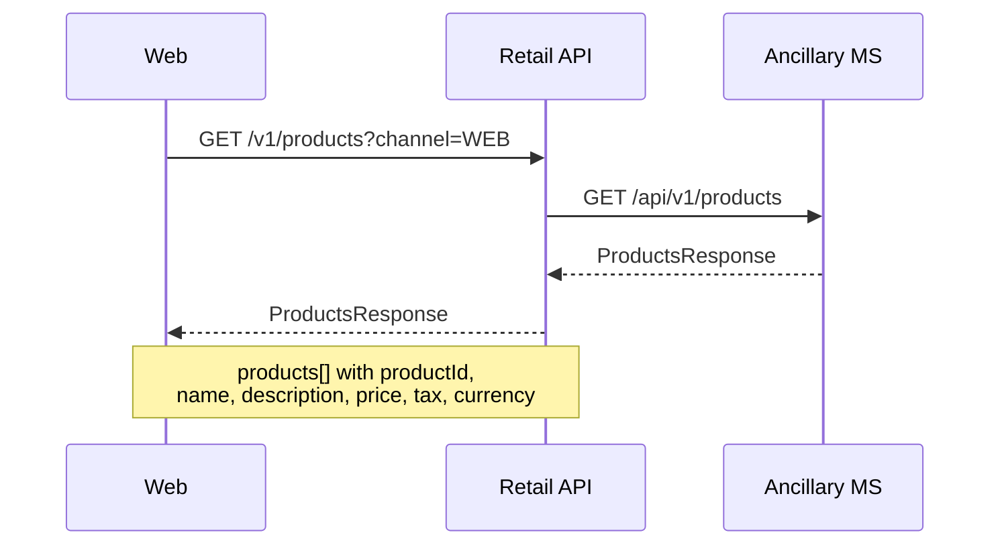

# Ancillary — sequence diagrams

Covers retrieval of ancillary catalogues used during the booking flow: seatmaps, bag offers, and ancillary products. All calls are read-only lookups from the web frontend through the Retail Orchestration API.

---

## Seatmap retrieval

Four calls run in parallel: two to the Seat MS for cabin layout and seat pricing, two to the Offer MS for held-seat availability and flight details. The Retail API merges the results into a single response.

---

## Bag offers retrieval

---

## Ancillary products retrieval

