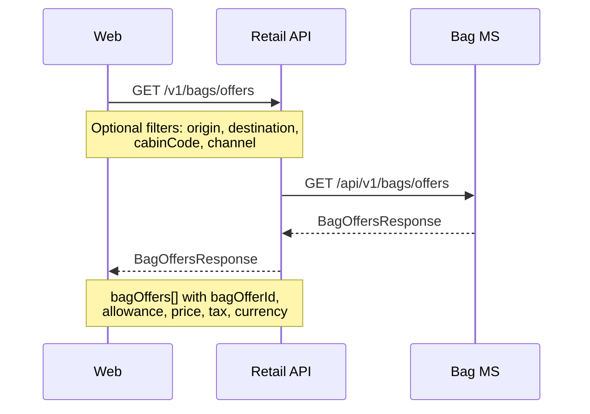
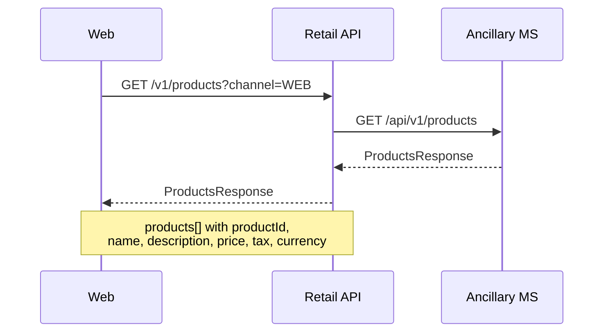

# Ancillary — sequence diagrams

Covers retrieval of ancillary catalogues used during the booking flow: seatmaps, bag offers, and ancillary products. All calls are read-only lookups from the web frontend through the Retail Orchestration API.

---

## Seatmap retrieval

```mermaid
sequenceDiagram
    participant Web
    participant RetailAPI as Retail API
    participant SeatMS as Seat MS

    Web->>RetailAPI: GET /v1/flights/{flightId}/seatmap
    Note over Web,RetailAPI: flightId identifies inventory record;<br/>optional cabinCode filter
    RetailAPI->>SeatMS: GET /api/v1/seatmap/{aircraftType}
    Note over RetailAPI,SeatMS: Aircraft type resolved from<br/>flight inventory record
    SeatMS-->>RetailAPI: SeatmapResponse (deck layout, rows, seats, pricing flags)
    RetailAPI-->>Web: SeatmapResponse
    Note over RetailAPI,Web: Rows with seat numbers, cabin zones,<br/>isChargeable, isSelectable, seatOfferId
```

---

## Bag offers retrieval



---

## Ancillary products retrieval


