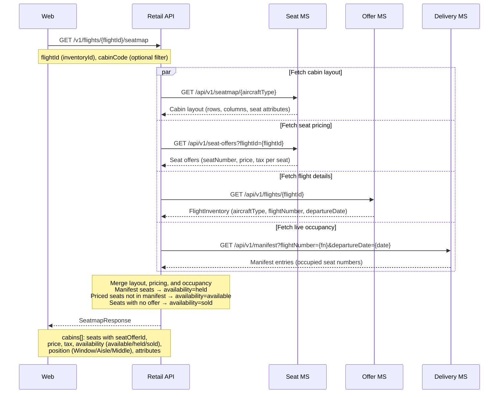
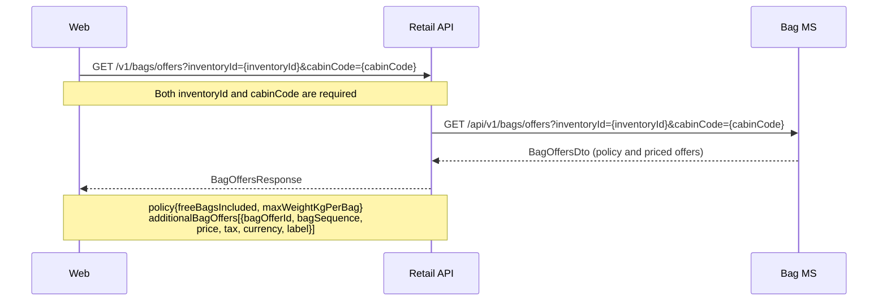
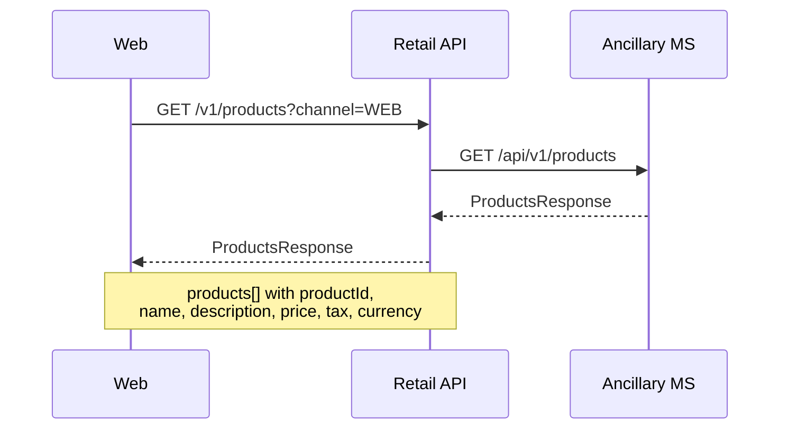
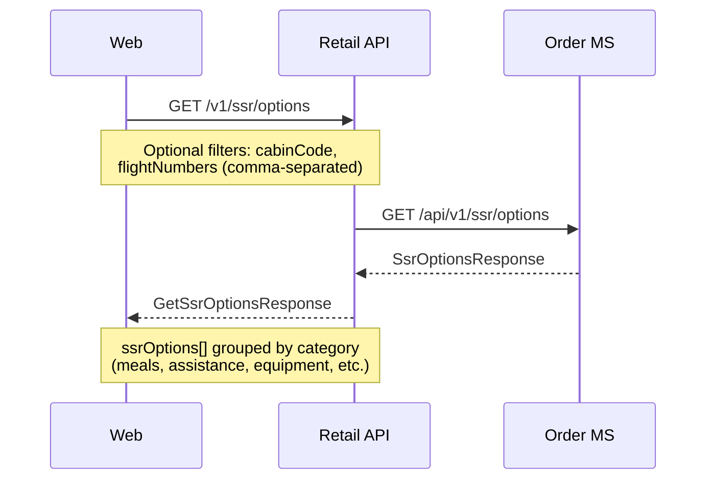

# Ancillary — sequence diagrams

Covers retrieval of ancillary catalogues used during the booking flow: seatmaps, bag offers, and ancillary products. All calls are read-only lookups from the web frontend through the Retail Orchestration API.

---

## Seatmap retrieval

Four calls run in parallel: cabin layout and seat pricing from the Seat MS, flight details from the Offer MS, and live seat occupancy from the Delivery MS manifest (the manifest is the authoritative source of truth for occupied seats).

---

## Bag offers retrieval

---

## Ancillary products retrieval

---

## SSR options retrieval

