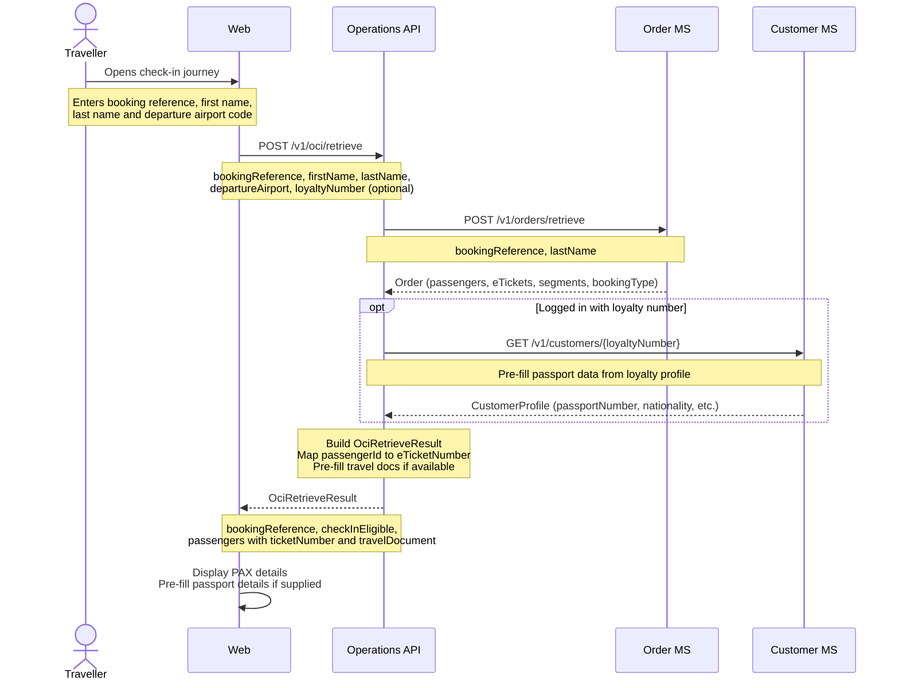
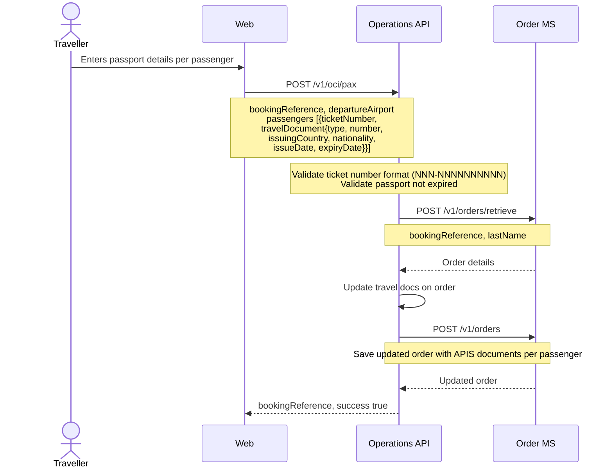
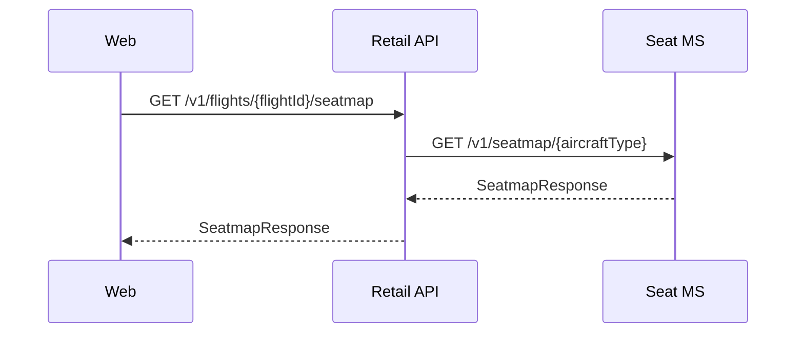
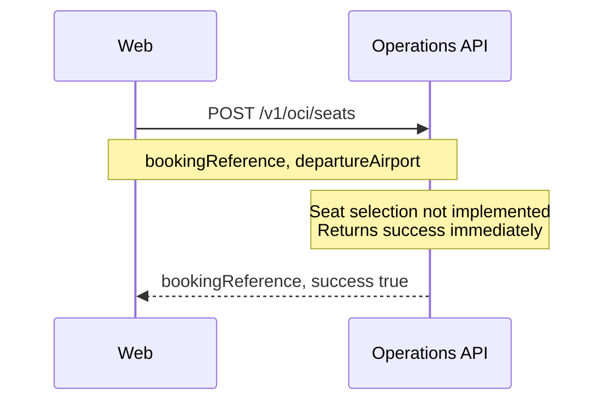
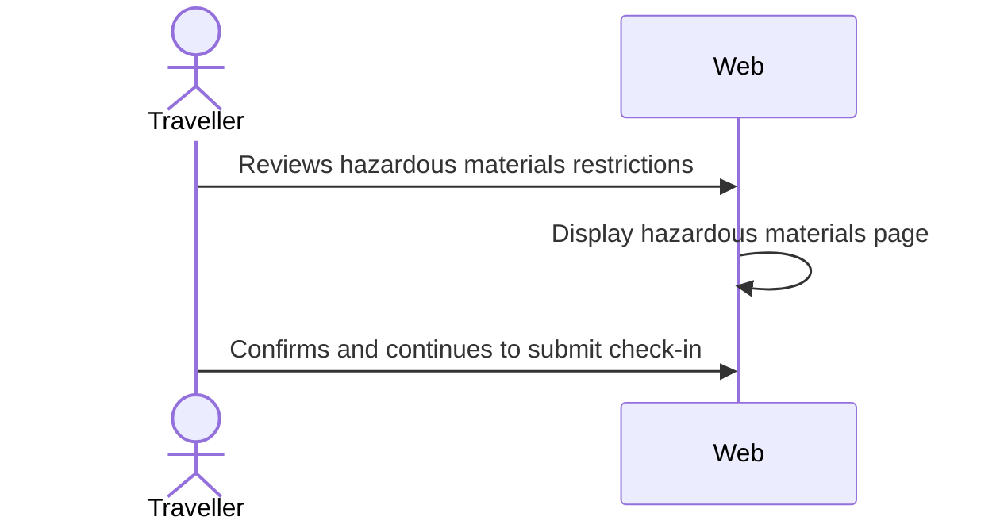
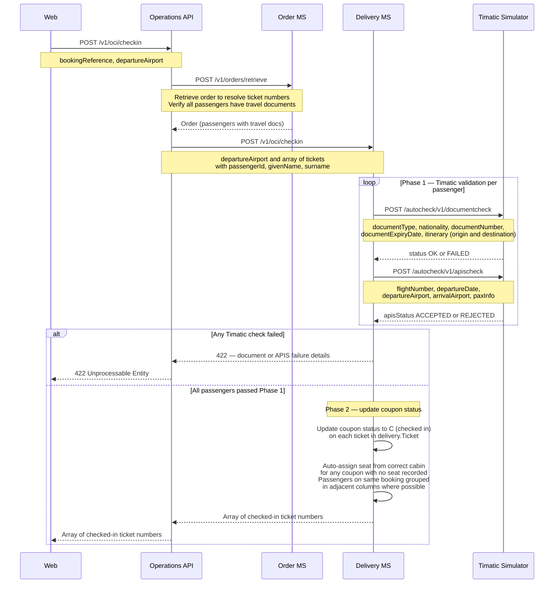
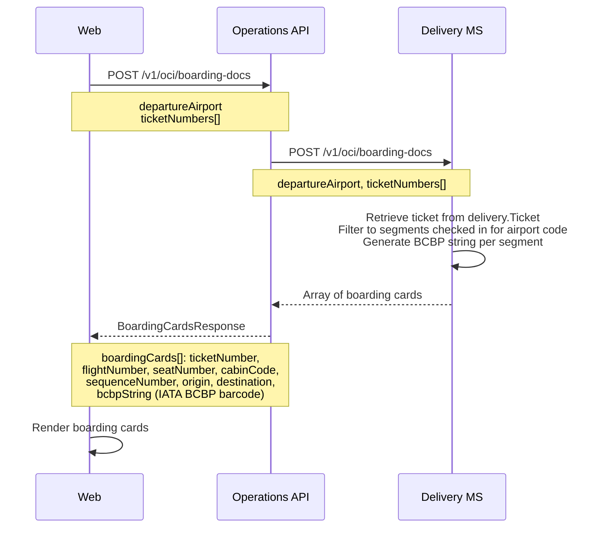

# Check-in — sequence diagrams

Covers the online check-in (OLCI) journey: retrieve booking, submit travel documents, select seats, complete check-in with Timatic validation, and retrieve boarding passes.

---

## Retrieve booking for check-in

---

## Submit passenger travel documents (APIS)

---

## Seatmap retrieval during check-in

Check-in seatmap retrieval uses the same endpoint as the booking flow.

---

## OCI seat selection (stub)

OCI seat selection is not yet implemented — the endpoint accepts the request and returns success without calling any downstream services.

---

## OCI bag selection (stub)

OCI bag selection is not yet implemented — the endpoint accepts the request and returns success without calling any downstream services.

---

## Hazardous materials confirmation

Passengers confirm they are not carrying prohibited hazardous materials. This is a UI-only step with no API call.

---

## Complete check-in

Timatic validation runs inside the Delivery microservice before any coupon status is updated. Both `documentcheck` and `apischeck` run per passenger in Phase 1. A failure from either check rejects the entire check-in — no passenger is checked in.

---

## Retrieve boarding passes

