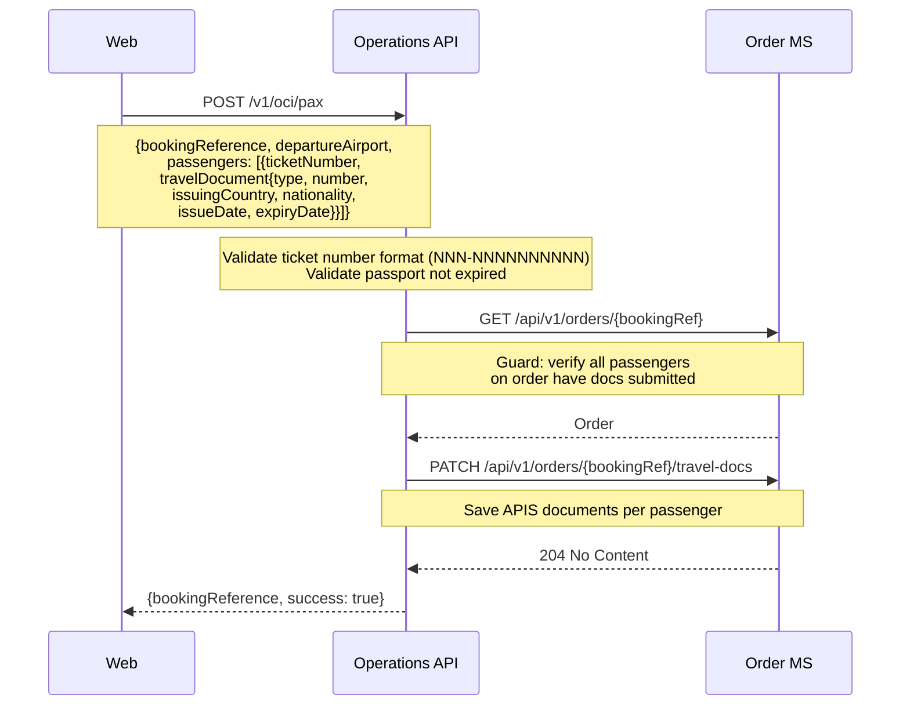
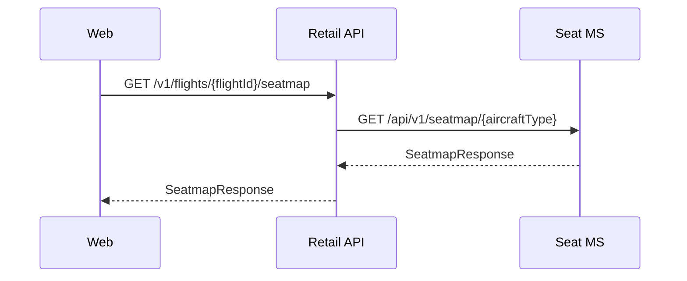
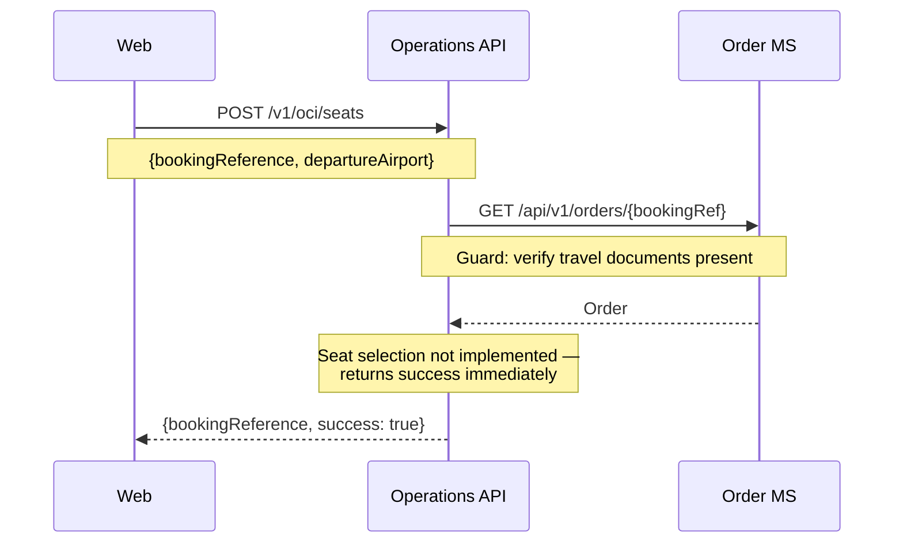
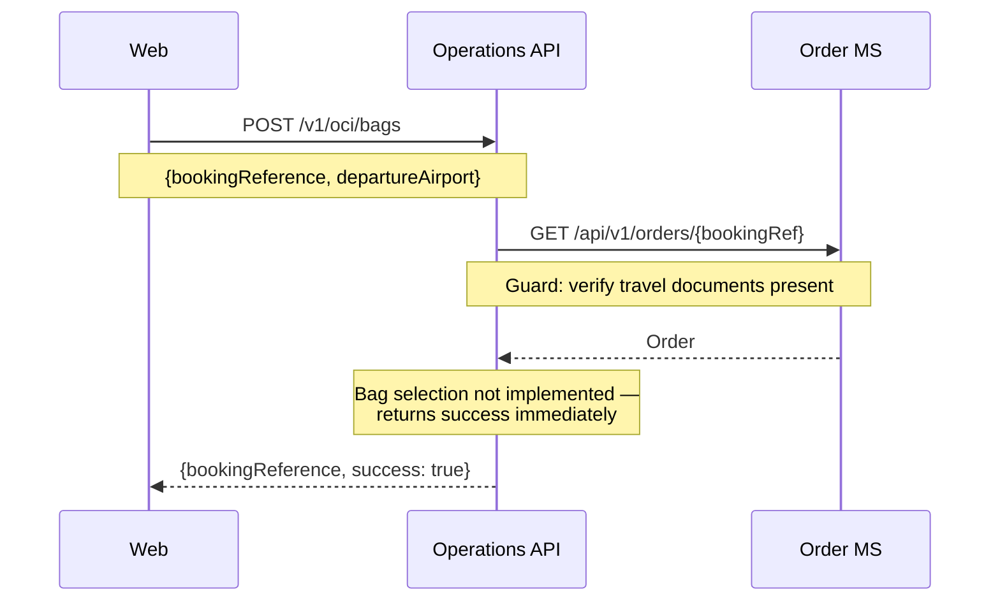
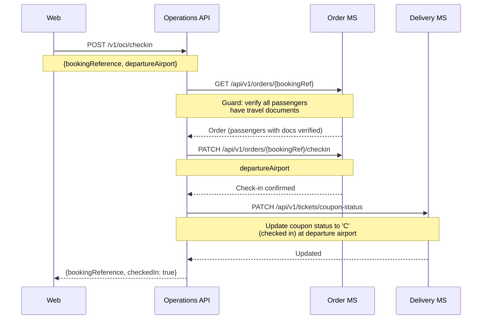
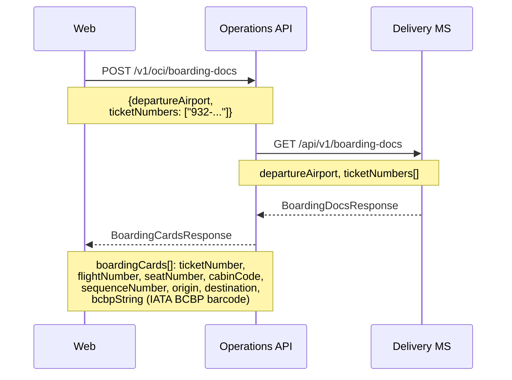

# Check-in — sequence diagrams

Covers the online check-in (OCI) journey: retrieve booking, submit travel documents, select seats, complete check-in, and retrieve boarding passes.

---

## Retrieve booking for check-in

```mermaid
sequenceDiagram
    participant Web
    participant OpsAPI as Operations API
    participant OrderMS as Order MS
    participant CustomerMS as Customer MS

    Web->>OpsAPI: POST /v1/oci/retrieve
    Note over Web,OpsAPI: {bookingReference, firstName,<br/>lastName, departureAirport, loyaltyNumber?}

    OpsAPI->>OrderMS: POST /api/v1/orders/retrieve
    Note over OpsAPI,OrderMS: bookingReference, lastName
    OrderMS-->>OpsAPI: Order (passengers, eTickets, segments, bookingType)

    opt Loyalty number supplied
        OpsAPI->>CustomerMS: GET /api/v1/customers/{loyaltyNumber}
        Note over OpsAPI,CustomerMS: Pre-fill passport data from loyalty profile
        CustomerMS-->>OpsAPI: CustomerProfile (passportNumber, nationality, etc.)
    end

    Note over OpsAPI: Build OciRetrieveResult — map<br/>passengerId → eTicketNumber;<br/>pre-fill travel docs if available

    OpsAPI-->>Web: OciRetrieveResult
    Note over OpsAPI,Web: {bookingReference, checkInEligible,<br/>isStandby, passengers[{passengerId,<br/>ticketNumber, travelDocument?}]}
```

---

## Submit passenger travel documents (APIS)



---

## Seatmap retrieval during check-in

Check-in seatmap retrieval uses the same endpoint as the booking flow.



---

## OCI seat selection (stub)

OCI seat selection is not yet implemented — the endpoint accepts the request and returns success without calling any downstream services.



---

## OCI bag selection (stub)

OCI bag selection is not yet implemented — the endpoint accepts the request and returns success without calling any downstream services.



---

## Complete check-in



---

## Retrieve boarding passes


