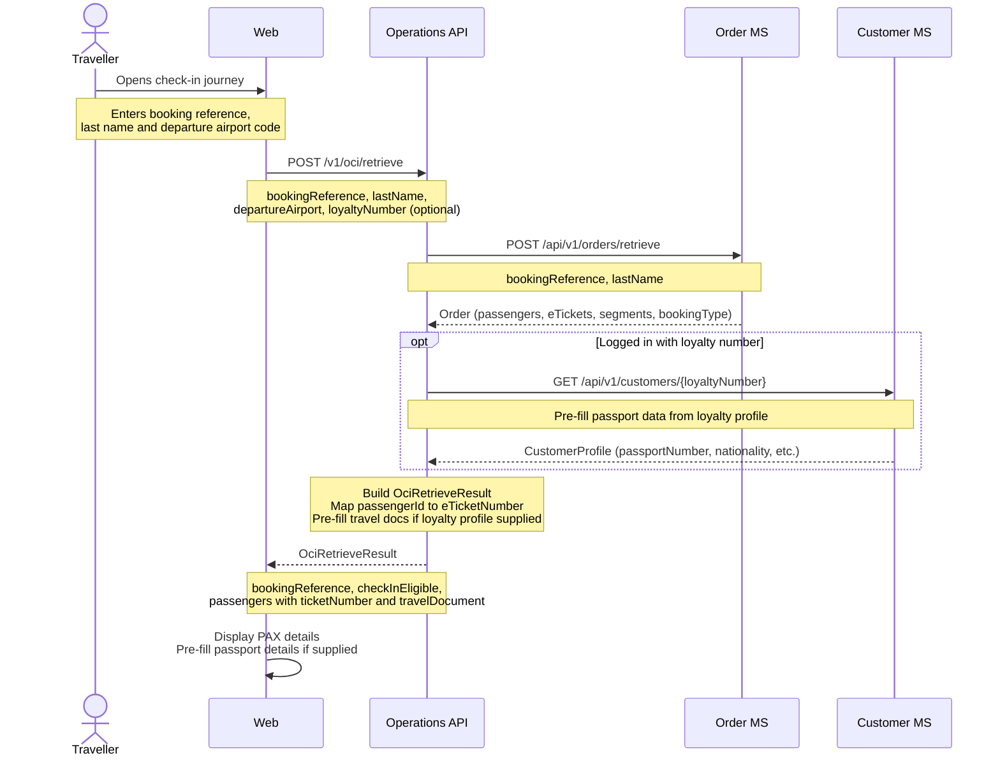
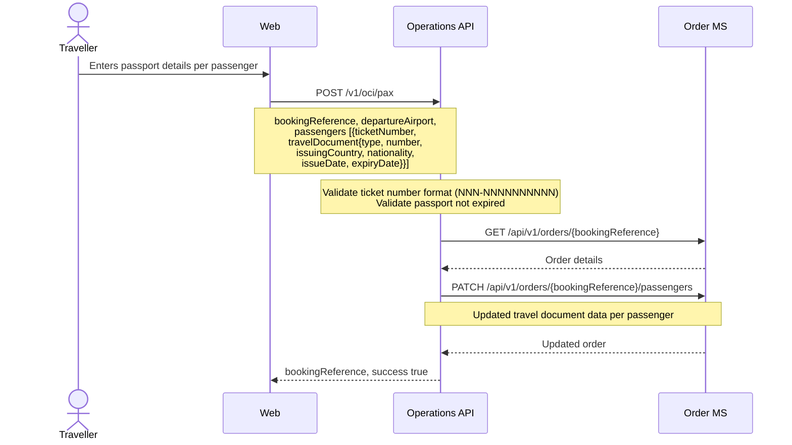
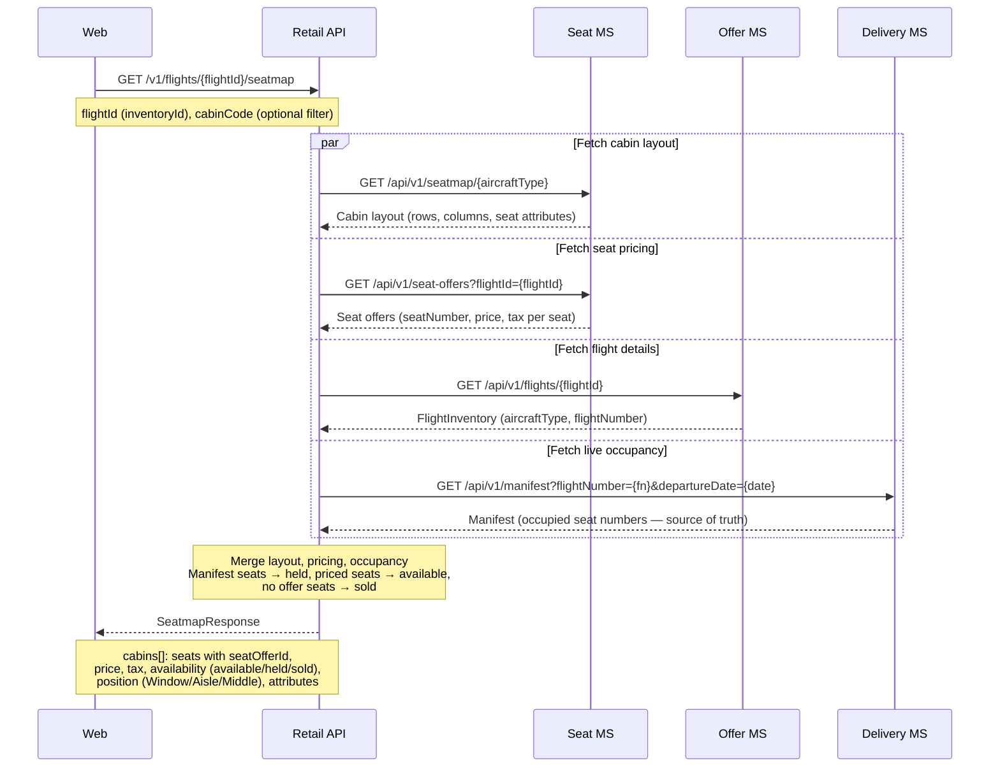
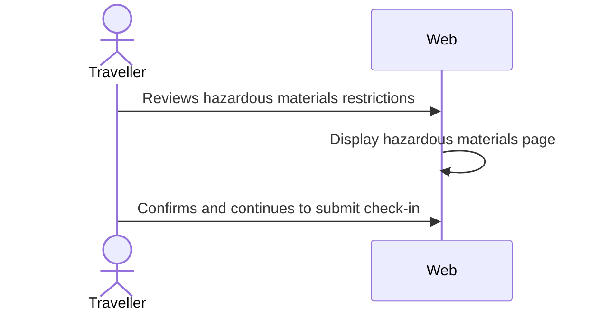
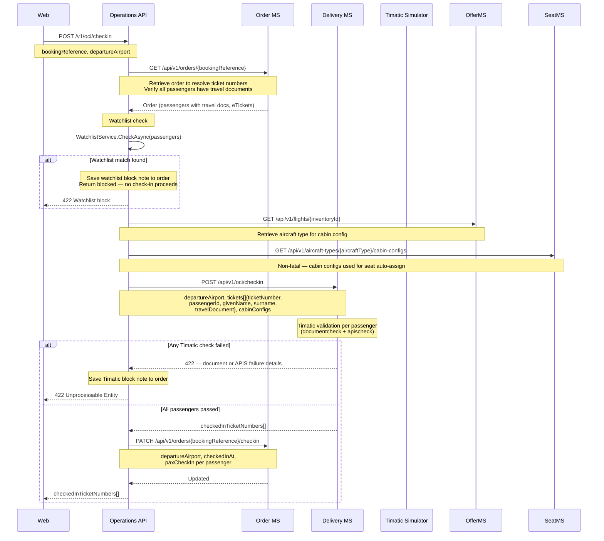
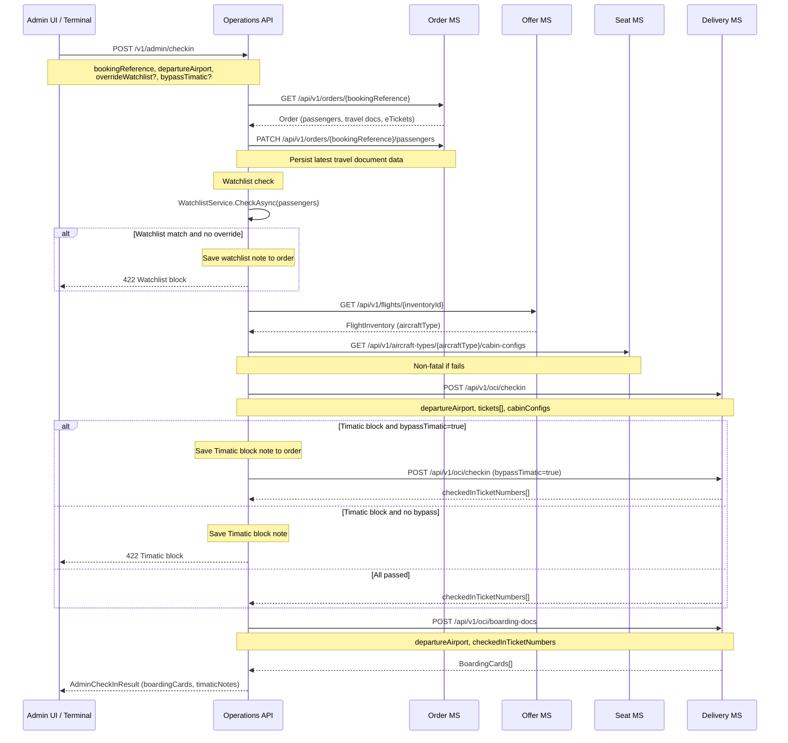
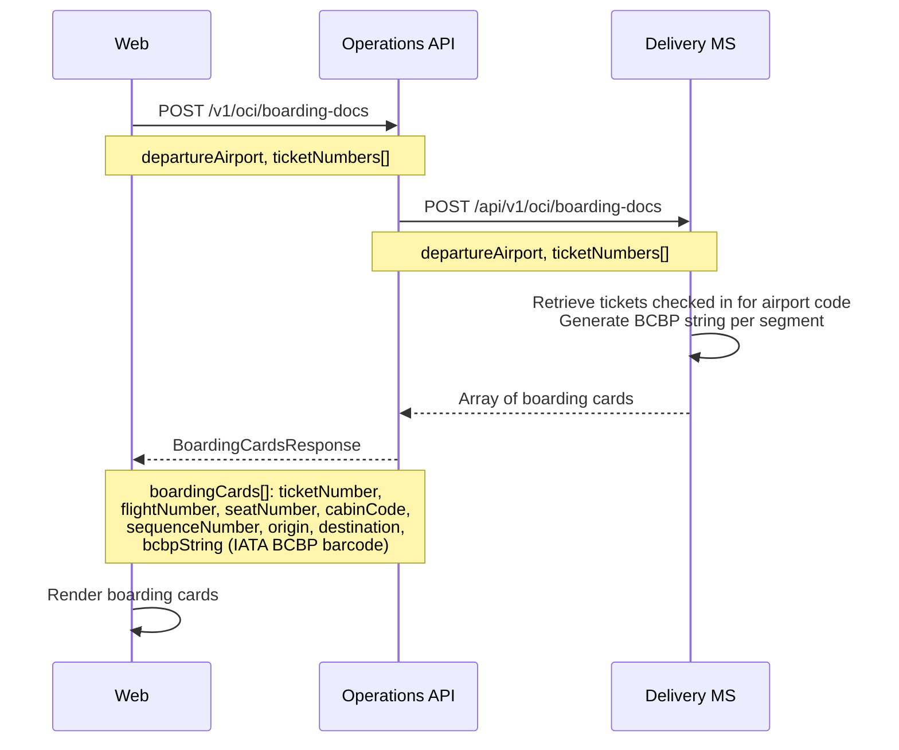

# Check-in — sequence diagrams

Covers the online check-in (OLCI) journey: retrieve booking, submit travel documents, complete check-in with watchlist and Timatic validation, and retrieve boarding passes. Also covers agent-assisted check-in with override capability.

---

## Retrieve booking for check-in

---

## Submit passenger travel documents (APIS)

---

## Seatmap retrieval during check-in

Check-in seatmap uses the same endpoint as the booking flow. Four calls run in parallel: cabin layout and seat pricing from Seat MS, flight details from Offer MS, and live occupancy from Delivery MS manifest.

---

## Hazardous materials confirmation

Passengers confirm they are not carrying prohibited hazardous materials. This is a UI-only step with no API call.

---

## Complete check-in (online — passenger self-service)

Timatic validation runs inside the Delivery MS. Both `documentcheck` and `apischeck` run per passenger. A watchlist check runs in the Operations API before the Timatic check. A failure from either check rejects the entire check-in. On success, the Order MS is updated with check-in status.

---

## Complete check-in (agent-assisted — with override capability)

Agent check-in supports watchlist override and Timatic bypass for exceptional cases (e.g., staff-verified documents). When a Timatic block occurs and `bypassTimatic=true` is set, the Delivery MS check-in is retried with the bypass flag.

---

## Retrieve boarding passes

