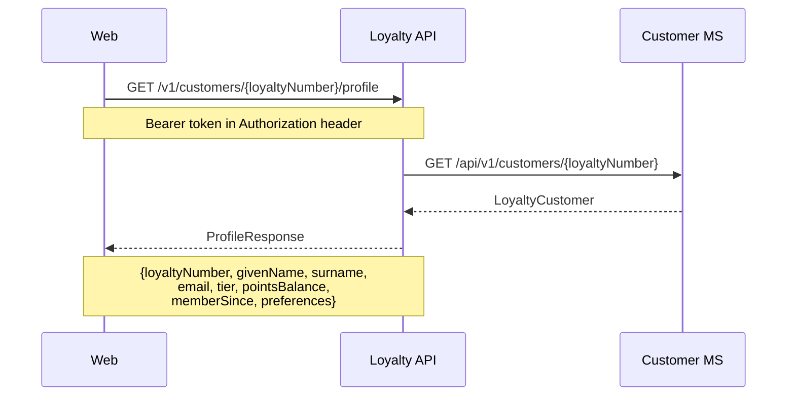
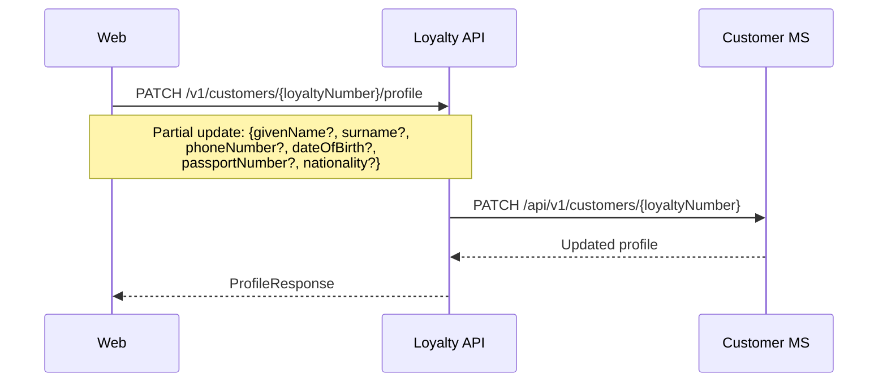
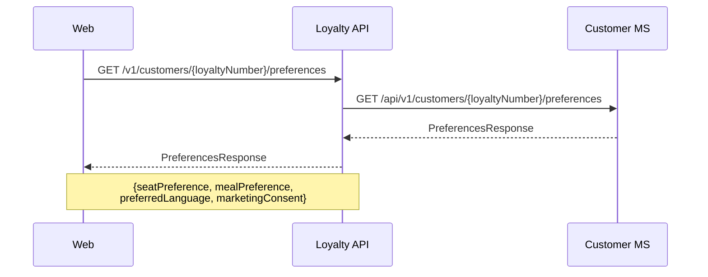
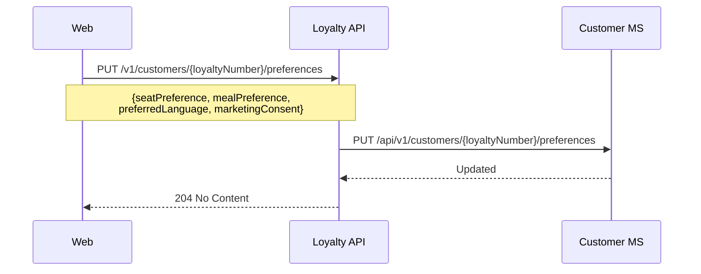
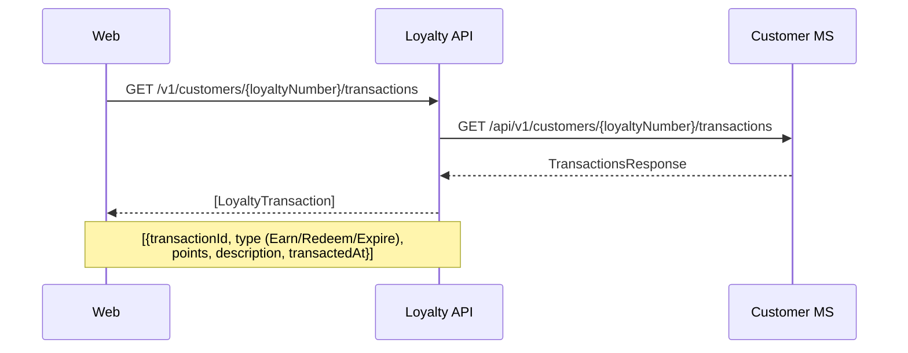
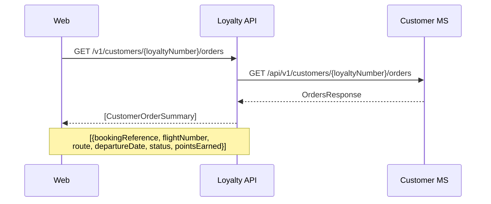
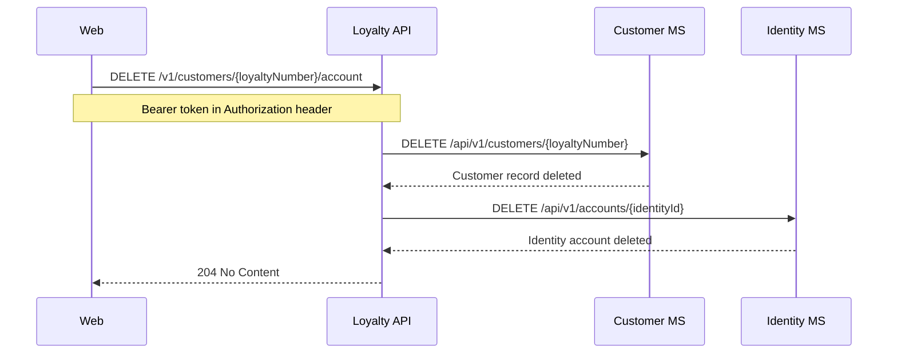
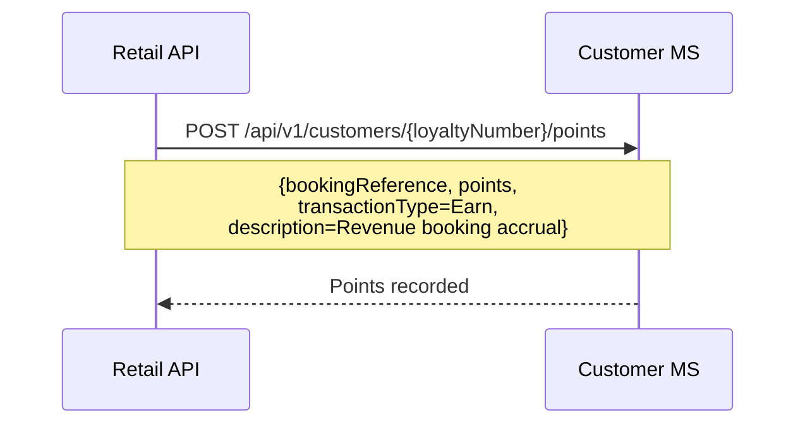
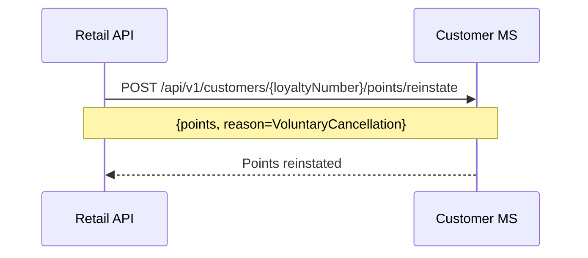
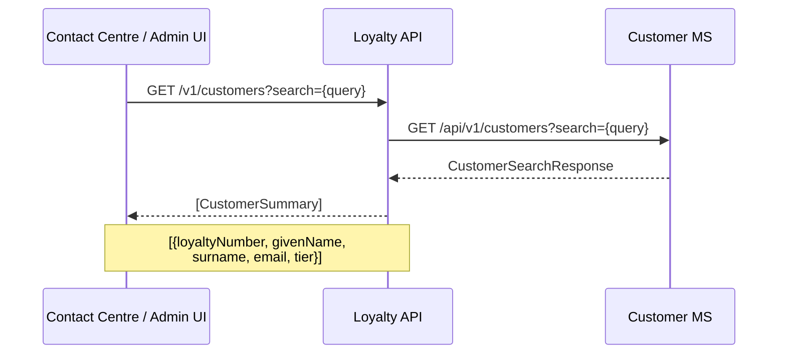

# Customer — sequence diagrams

Covers loyalty customer profile management, points transactions, preferences, and points redemption authorisation. All flows originate from the Angular web frontend through the Loyalty Orchestration API.

---

## Get customer profile



---

## Update customer profile



---

## Get preferences



---

## Update preferences



---

## Get points transaction history



---

## Get customer orders



---

## Transfer points

The recipient loyalty number and email are cross-validated before the transfer executes to prevent misdirected transfers.

```mermaid
sequenceDiagram
    participant Web
    participant LoyaltyAPI as Loyalty API
    participant CustomerMS as Customer MS
    participant IdentityMS as Identity MS

    Web->>LoyaltyAPI: POST /v1/customers/{loyaltyNumber}/points/transfer
    Note over Web,LoyaltyAPI: {recipientLoyaltyNumber,<br/>recipientEmail, points}

    LoyaltyAPI->>CustomerMS: GET /api/v1/customers/{recipientLoyaltyNumber}
    CustomerMS-->>LoyaltyAPI: RecipientCustomer (identityId)

    LoyaltyAPI->>IdentityMS: GET /api/v1/accounts/{identityId}
    Note over LoyaltyAPI,IdentityMS: Verify recipient email matches<br/>registered identity email
    IdentityMS-->>LoyaltyAPI: IdentityAccount (email)

    Note over LoyaltyAPI: Validate email match; throw if mismatch

    LoyaltyAPI->>CustomerMS: POST /api/v1/customers/points/transfer
    Note over LoyaltyAPI,CustomerMS: {senderLoyaltyNumber,<br/>recipientLoyaltyNumber, points}
    CustomerMS-->>LoyaltyAPI: TransferResult

    LoyaltyAPI-->>Web: TransferPointsResponse
    Note over LoyaltyAPI,Web: {senderLoyaltyNumber, recipientLoyaltyNumber,<br/>pointsTransferred, senderNewBalance,<br/>recipientNewBalance, transferredAt}
```

---

## Delete account



---

## Points accrual (post-booking, internal)

Called from within `ConfirmBasketHandler` for revenue bookings where the customer is loyalty-enrolled. Not triggered directly by the web frontend.



---

## Points reinstatement (post-cancellation, internal)

Called from within `CancelOrderHandler` for reward bookings.



---

## Admin — customer search and lookup


