# Customer — sequence diagrams

Covers loyalty customer profile management, points transactions, preferences, and account operations. All flows originate from the Angular web frontend through the Loyalty Orchestration API.

---

## Get customer profile

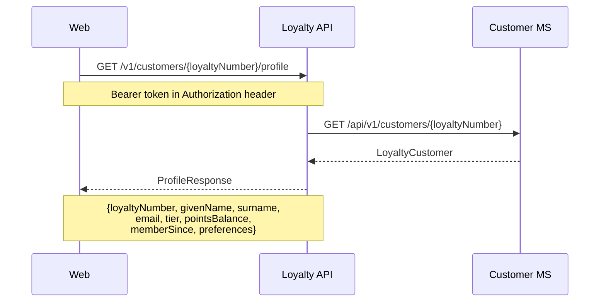

---

## Update customer profile

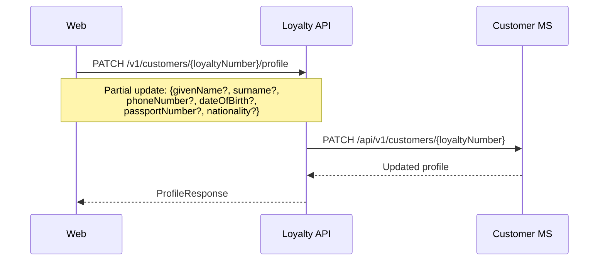

---

## Get preferences

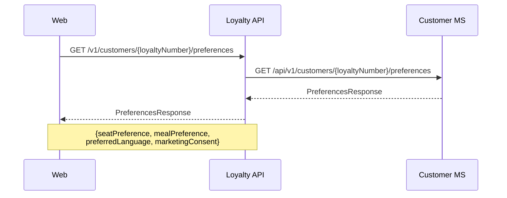

---

## Update preferences

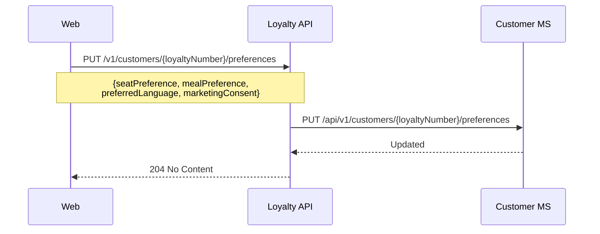

---

## Get points transaction history

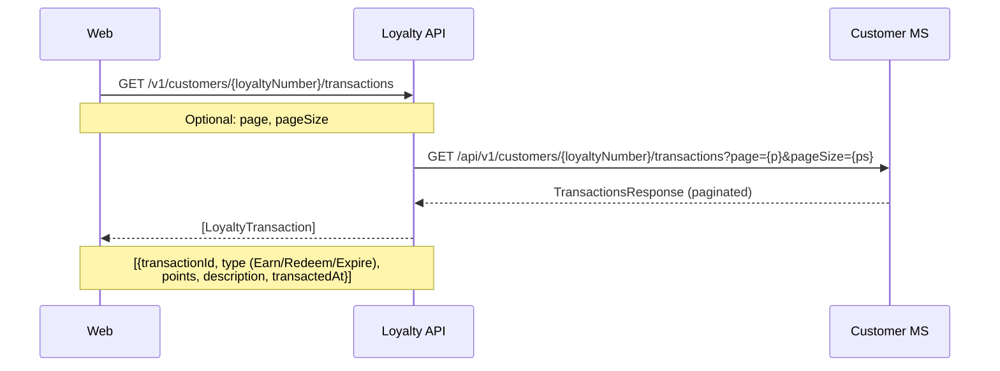

---

## Get customer orders

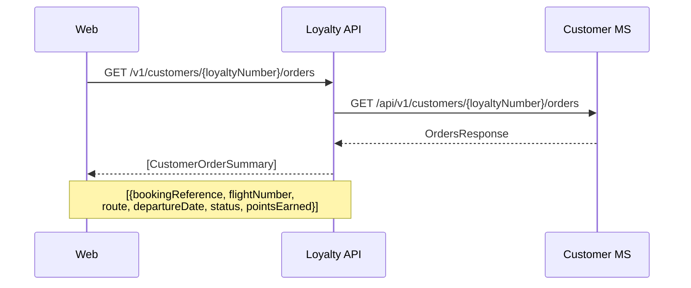

---

## Transfer points

The recipient loyalty number and email are cross-validated against the Identity MS before the transfer executes, preventing misdirected transfers.

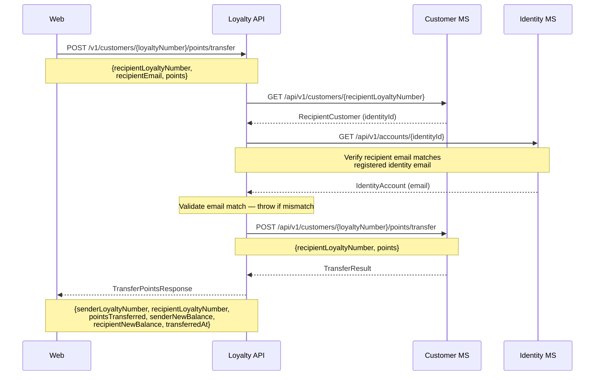

---

## Delete account

Deletes the customer loyalty record only. The associated Identity MS account is not deleted by this flow.

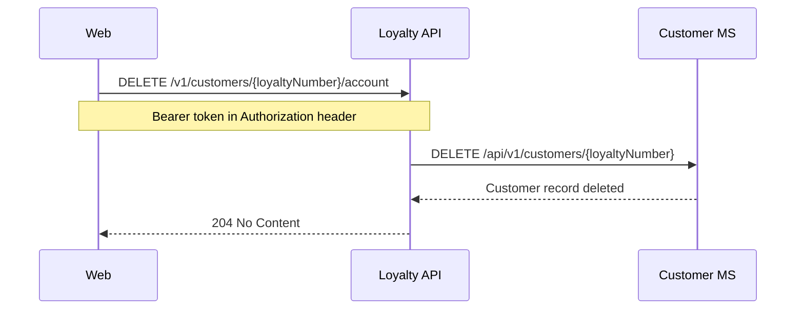

---

## Link order to loyalty account (post-booking, internal)

Called from within `ConfirmBasketHandler` for any booking where a loyalty number is present (both revenue and reward bookings).

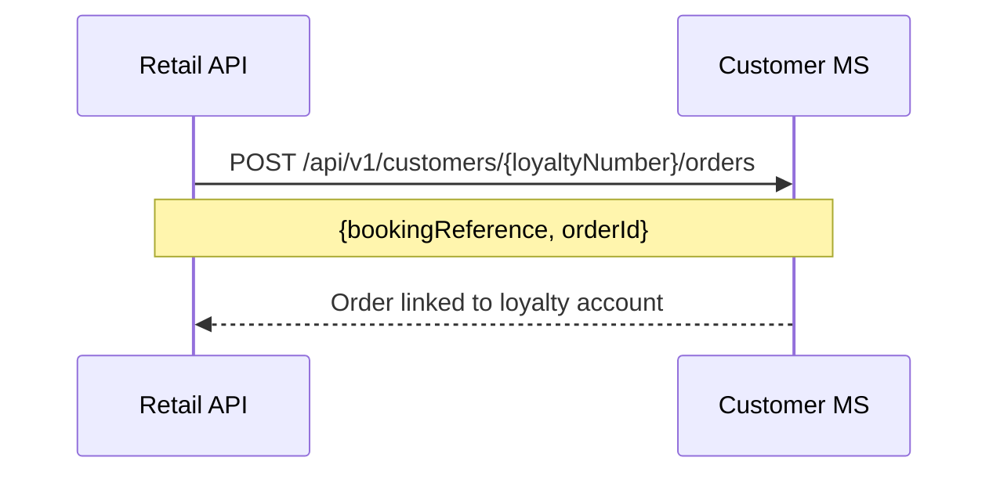

---

## Sign-up bonus points award (registration, internal)

Called from within `RegisterHandler` after account creation.

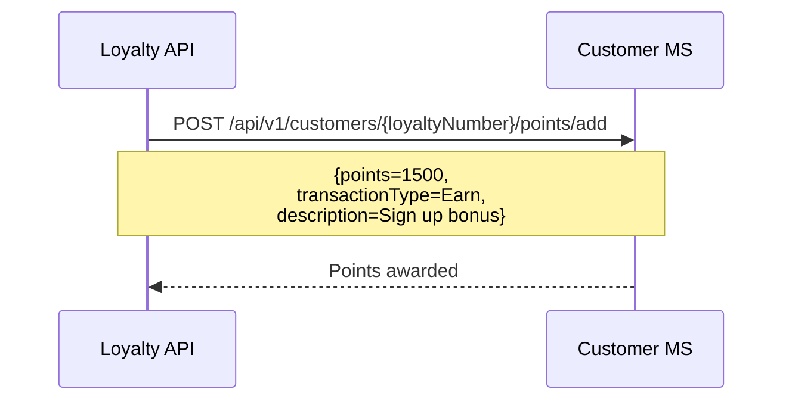

---

## Admin — customer search

Staff search uses both a name/loyalty-number lookup and, if the search term contains `@`, a parallel email lookup via the Identity MS. Email results are merged with name results and prioritised.

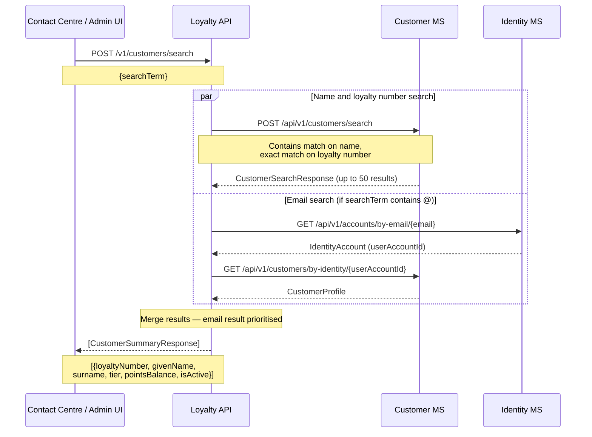
