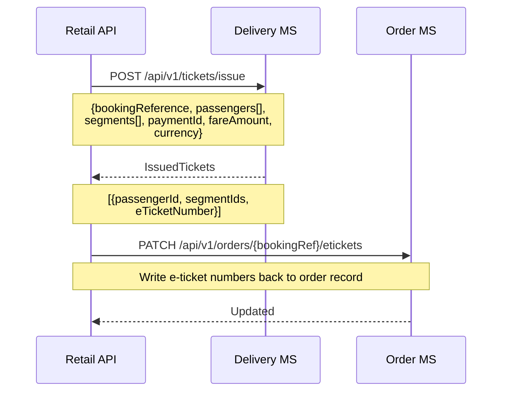
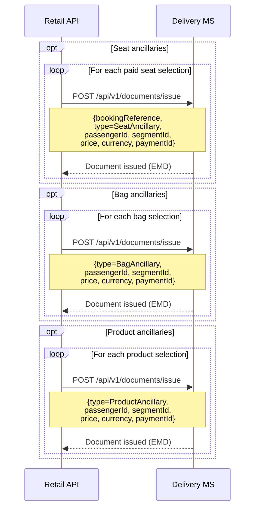
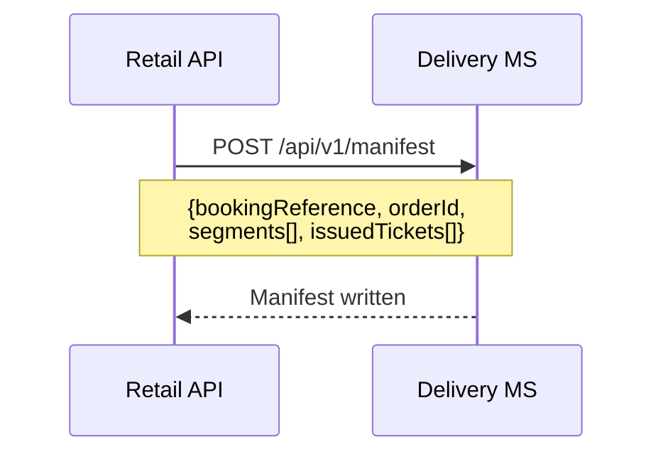
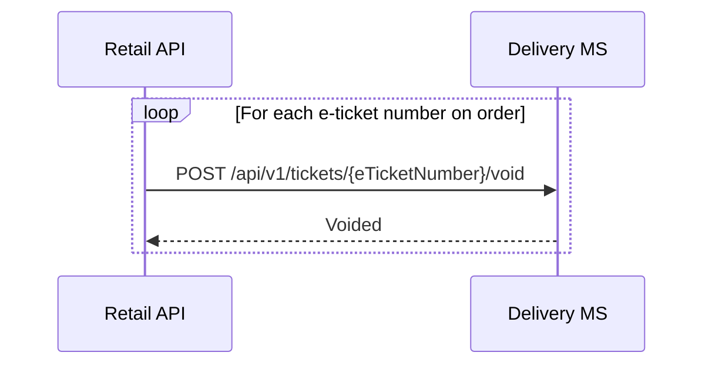
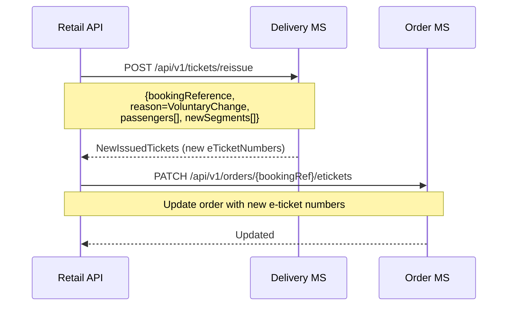
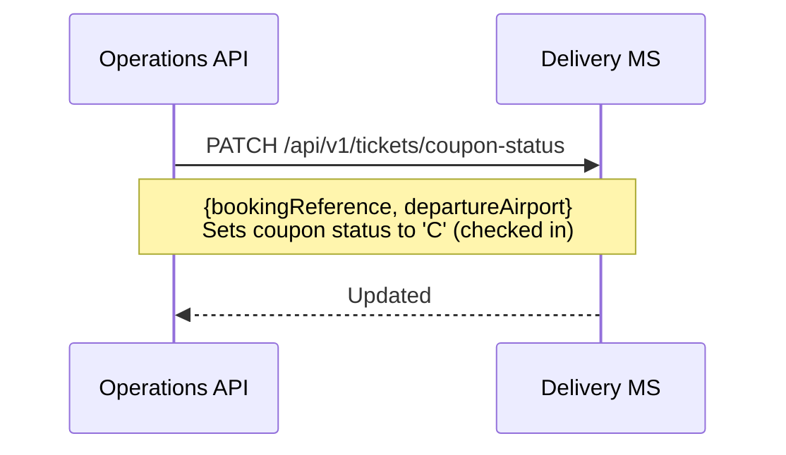
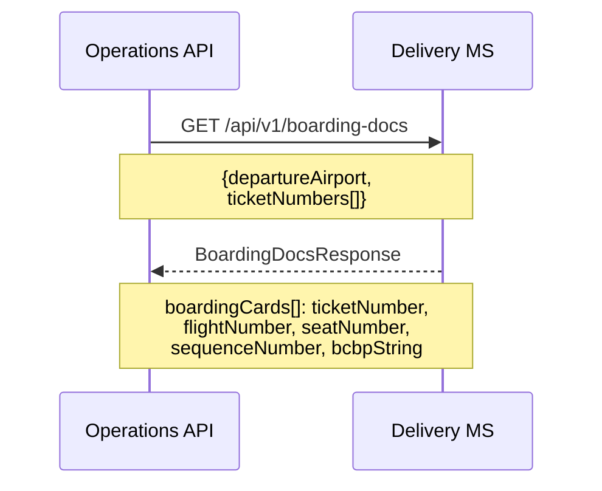
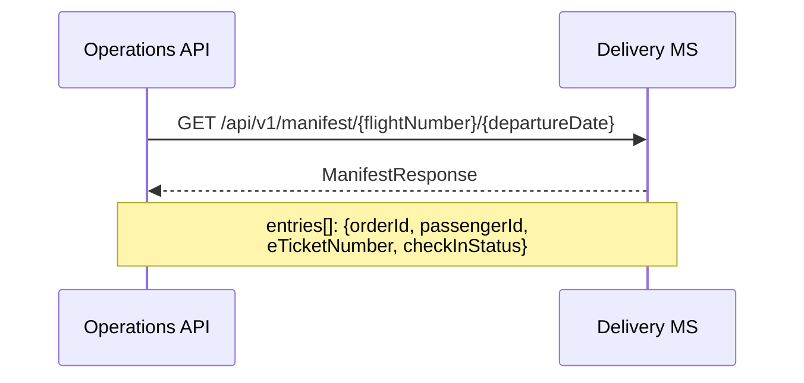

# Delivery — sequence diagrams

The Delivery microservice is called from within orchestration handlers — never directly from the web frontend. This file documents all delivery interactions grouped by the triggering capability.

---

## E-ticket issuance (booking confirmation)

Called from within `ConfirmBasketHandler` after the order is confirmed.

---

## Ancillary EMD issuance (booking confirmation)

EMDs are issued for each paid ancillary type (seats, bags, products) during the post-confirm parallel phase.

---

## Passenger manifest write (booking confirmation)

A manifest entry is written after all tickets and EMDs are issued, linking the order to each flight for IROPS and check-in use.

---

## E-ticket void (change flight or cancellation)

---

## E-ticket reissuance (change flight)

---

## Coupon status update (check-in completion)

---

## Boarding pass retrieval (check-in)

---

## Manifest retrieval (IROPS disruption)

Called from within `AdminDisruptionCancelHandler` to identify all passengers booked on a cancelled flight.

