# Delivery — sequence diagrams

The Delivery microservice is called from within orchestration handlers — never directly from the web frontend. This file documents all delivery interactions grouped by the triggering capability.

---

## E-ticket issuance (booking confirmation)

Called from within `ConfirmBasketHandler` after the order is confirmed. The endpoint is `POST /api/v1/tickets`.

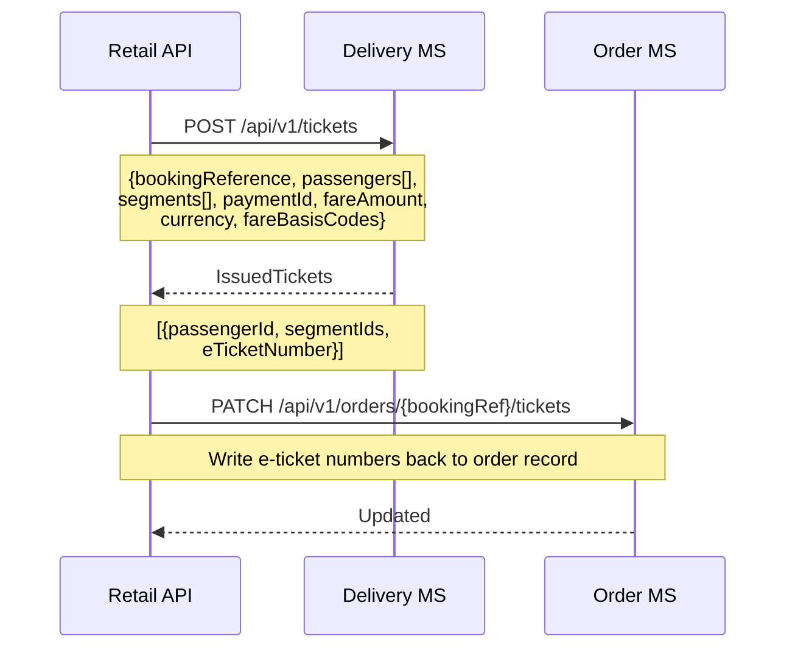

---

## Ancillary EMD issuance (booking confirmation)

EMDs are issued for each paid ancillary type (seats, bags, products) during the post-confirm parallel phase. EMD issuance failures are logged but do not block the confirmed order.

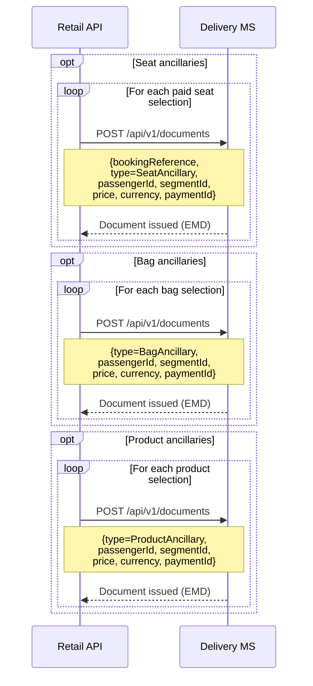

---

## Passenger manifest write (booking confirmation)

A manifest entry is written per segment after tickets are issued (requires eTicketNumbers), linking the order to each flight for IROPS and check-in use.

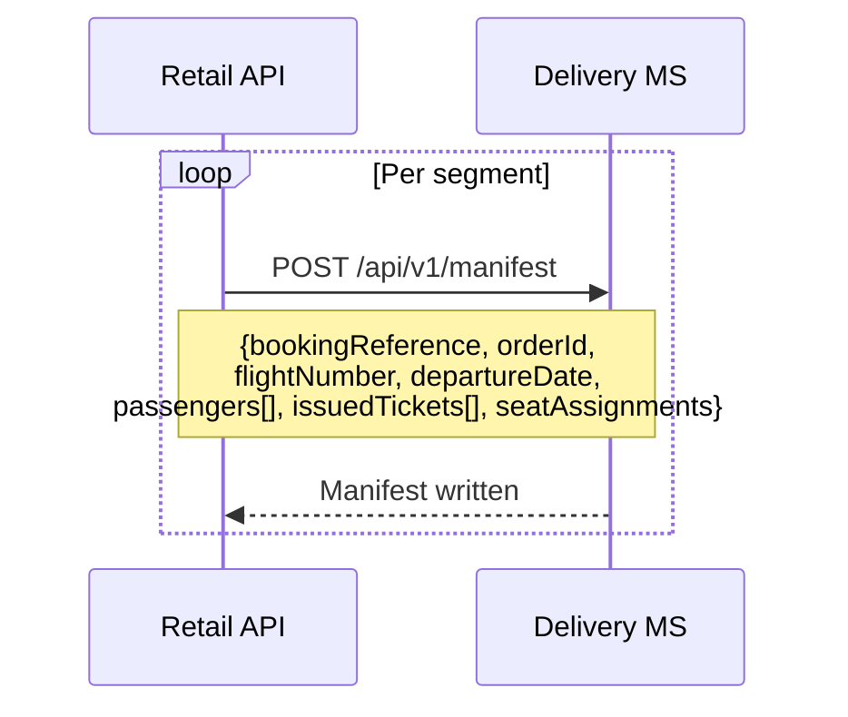

---

## E-ticket reissuance (change flight or IROPS)

The reissue endpoint voids old tickets and issues new ones atomically. Used for both voluntary flight changes and IROPS rebooking.

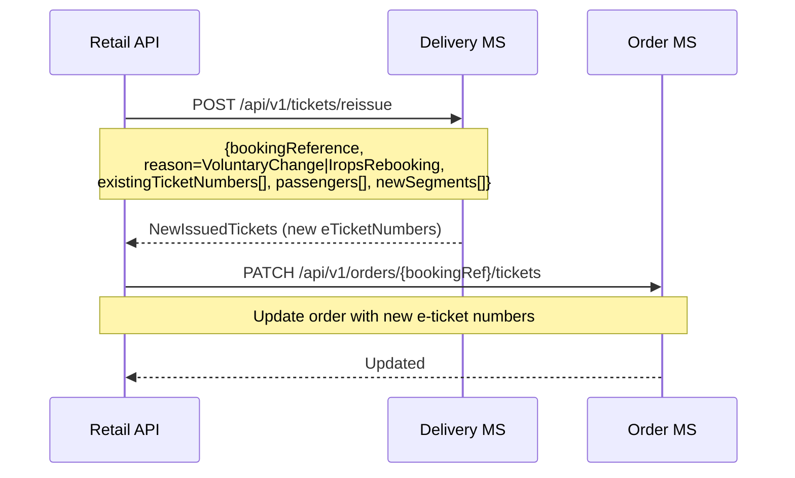

---

## E-ticket void (standalone)

Used when voiding tickets independently (e.g., during cancellation flow).

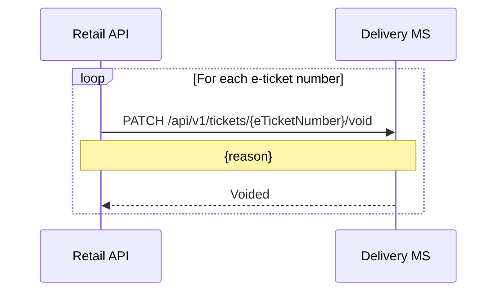

---

## Manifest retrieval

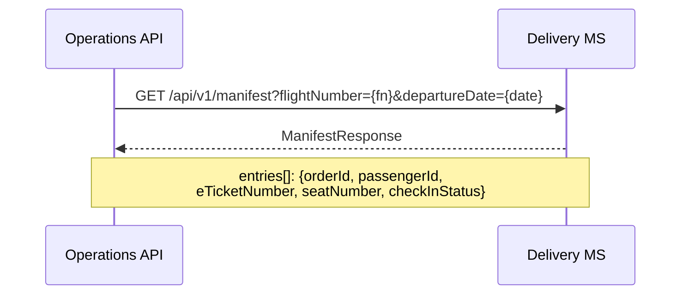

---

## Manifest seat update

Updates the seat number for a single manifest entry (e.g., seat reassignment at departure).

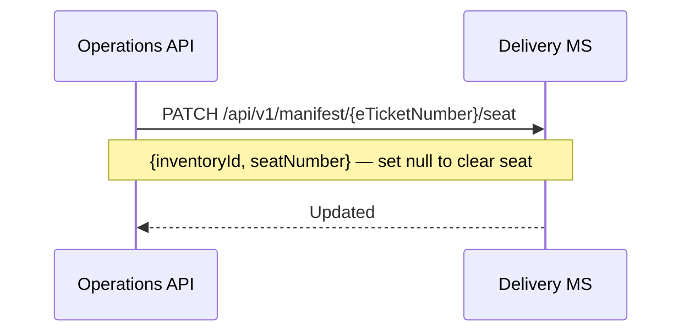

---

## Manifest SSR update (post-booking SSR change)

Replaces SSR codes on all manifest entries for a booking reference.

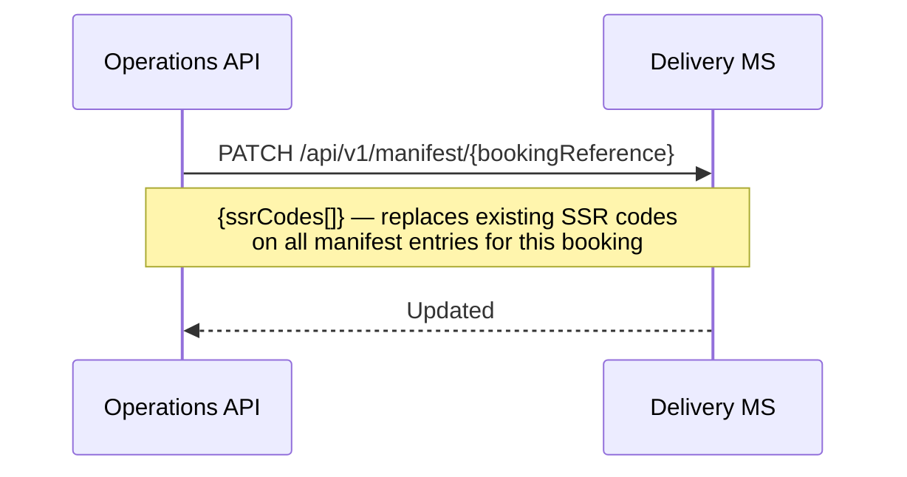

---

## Manifest rebook (IROPS)

Updates manifest entries when a passenger is rebooked onto a replacement flight.

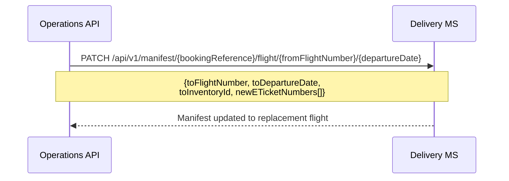

---

## Manifest delete (flight cancellation cleanup)

Removes manifest entries for a cancelled flight.

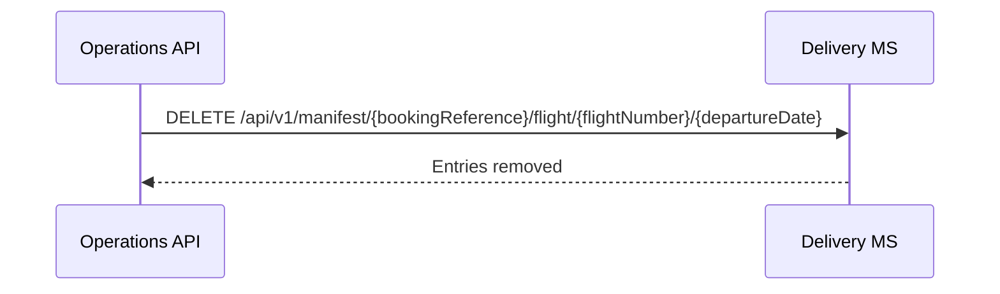

---

## Online check-in (OCI)

Called from within `OciCheckInHandler`. Timatic validation runs inside the Delivery MS; both `documentcheck` and `apischeck` run per passenger. A failure from either check rejects the entire check-in. On success, coupon status is updated to `C` (checked in) and unassigned seats are auto-allocated within the correct cabin.

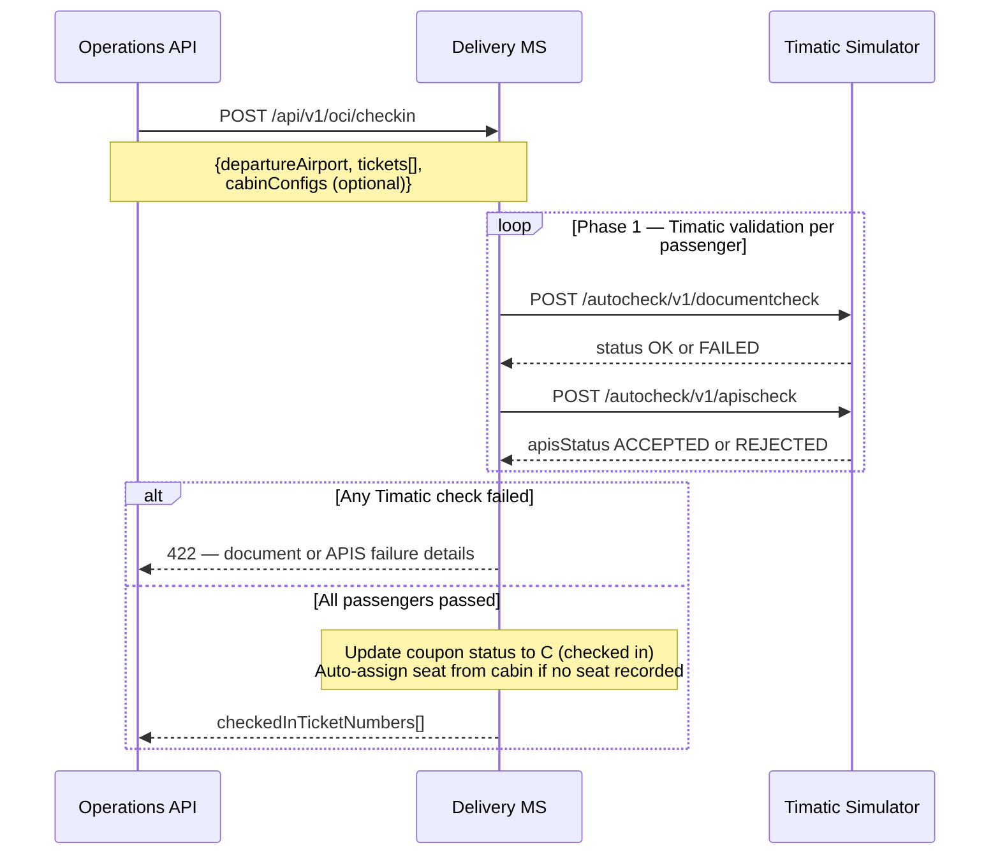

---

## Boarding pass retrieval

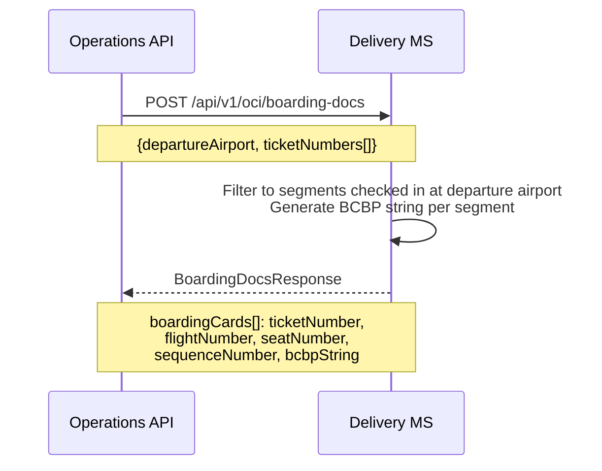

---

## Watchlist management

The watchlist is maintained in the Delivery MS and checked during every check-in.

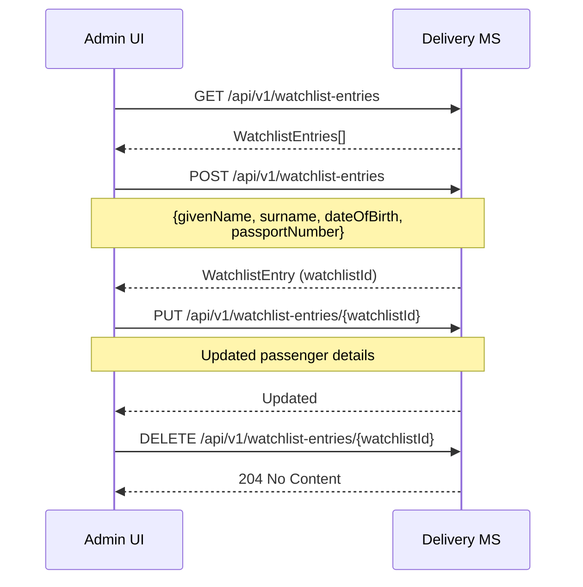
