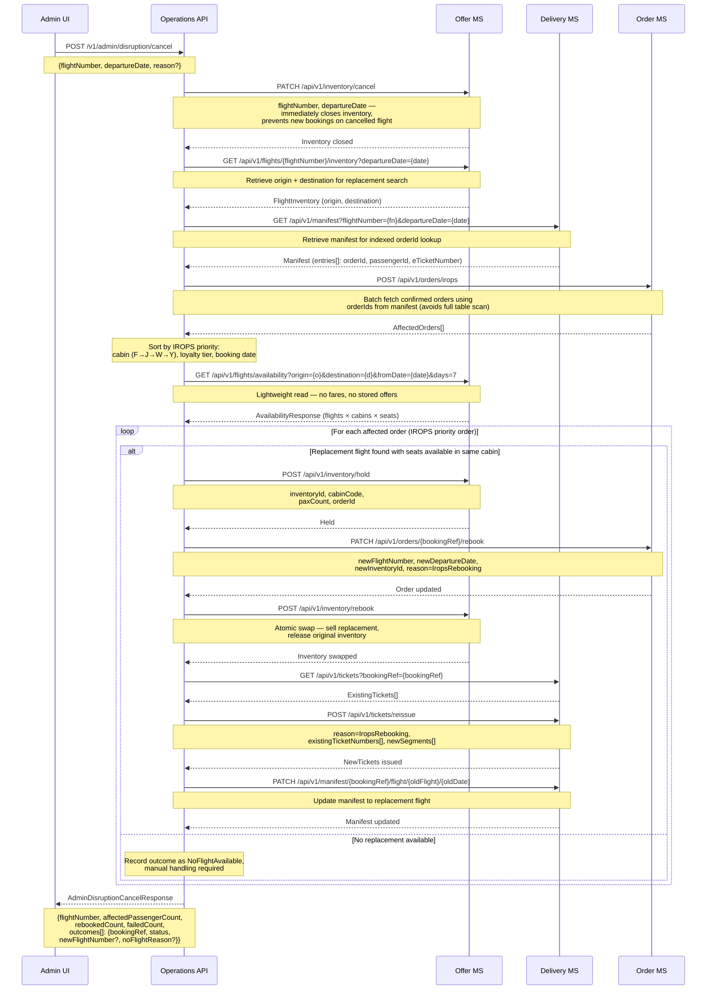
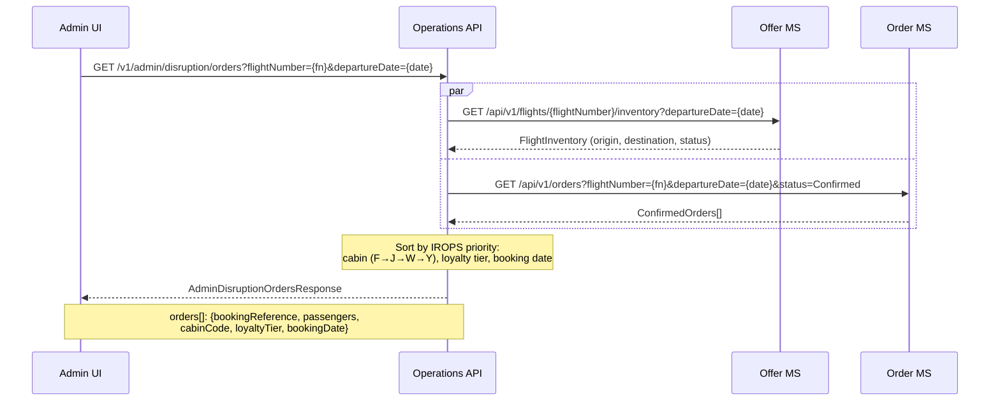
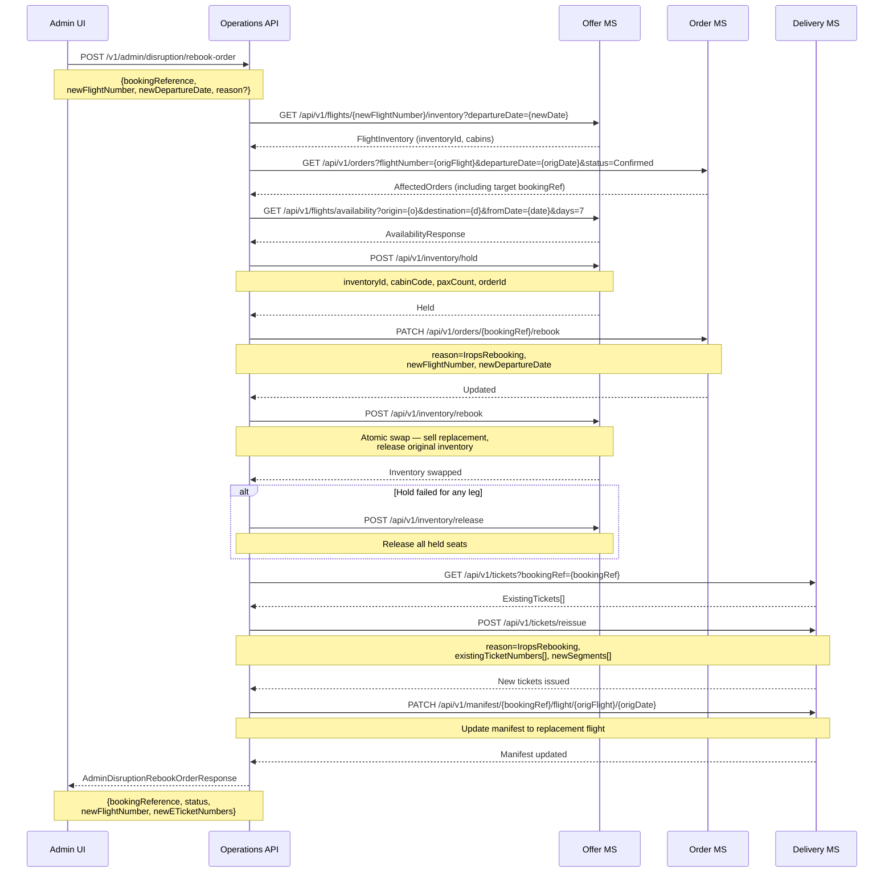
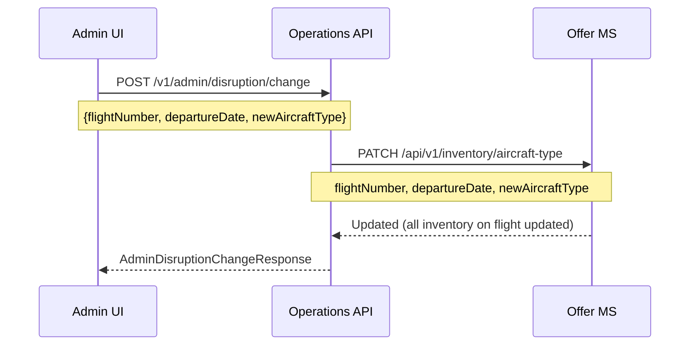
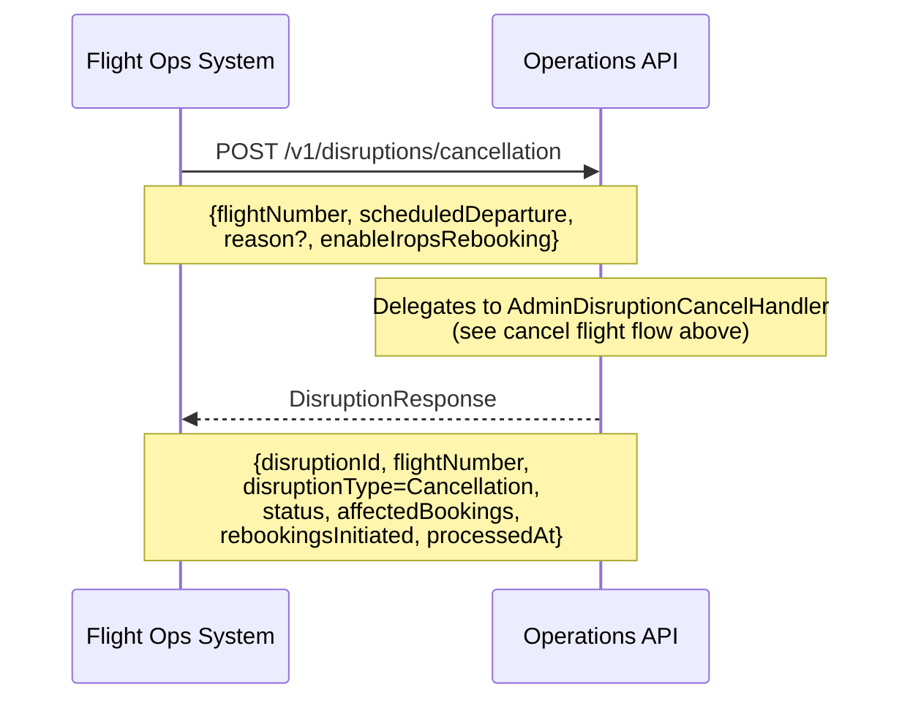
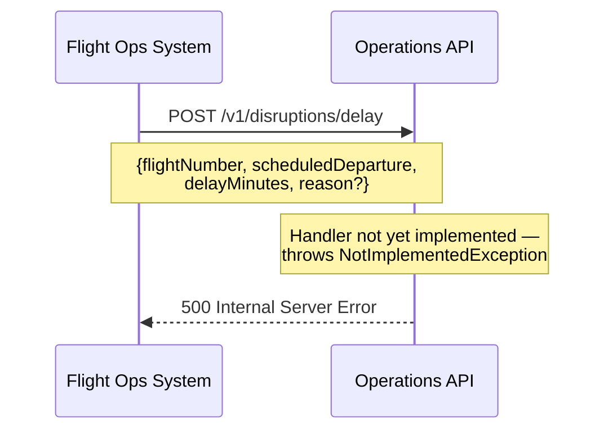
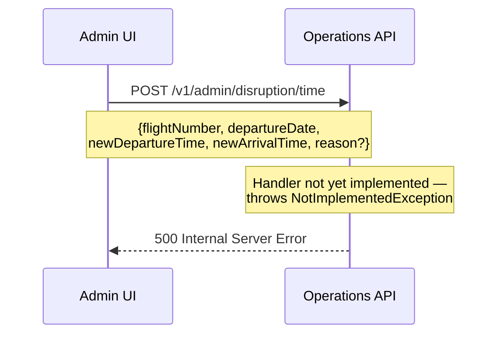

# Disruption — sequence diagrams

Covers IROPS (Irregular Operations) handling: admin-initiated flight cancellation with automatic rebooking, manual rebook of individual affected orders, and FOS (Flight Operations System) event processing. Flight time change is defined but not yet implemented.

---

## Admin — cancel flight and auto-rebook all passengers

The most complex disruption flow. Immediately closes inventory to prevent new bookings, retrieves the manifest to identify affected passengers, fetches replacement availability, then processes each booking in IROPS priority order (cabin class → loyalty tier → booking date).

---

## Admin — get affected orders for disrupted flight

Returns all confirmed orders on a flight in IROPS priority order (cabin class → loyalty tier → booking date). Runs two calls in parallel.

---

## Admin — manual rebook of a single order

Allows a staff member to rebook one specific booking onto a chosen replacement flight. Fetches replacement availability, holds a seat, updates the order, performs an atomic inventory swap, reissues tickets, and updates the manifest.

---

## Admin — aircraft type change

Updates the aircraft type on all inventory for a given flight, used when equipment substitution is required.

---

## FOS — flight cancellation event (external system)

The FOS (Flight Operations System) triggers this endpoint. It delegates to the same `AdminDisruptionCancelHandler` used by staff.

---

## FOS — flight delay event (not yet implemented)

---

## Admin — flight time change (not yet implemented)

