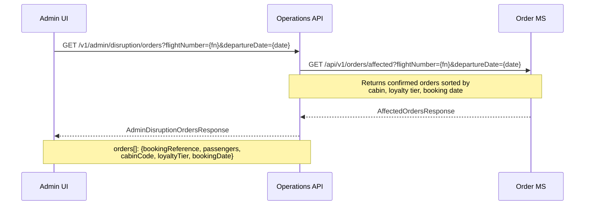
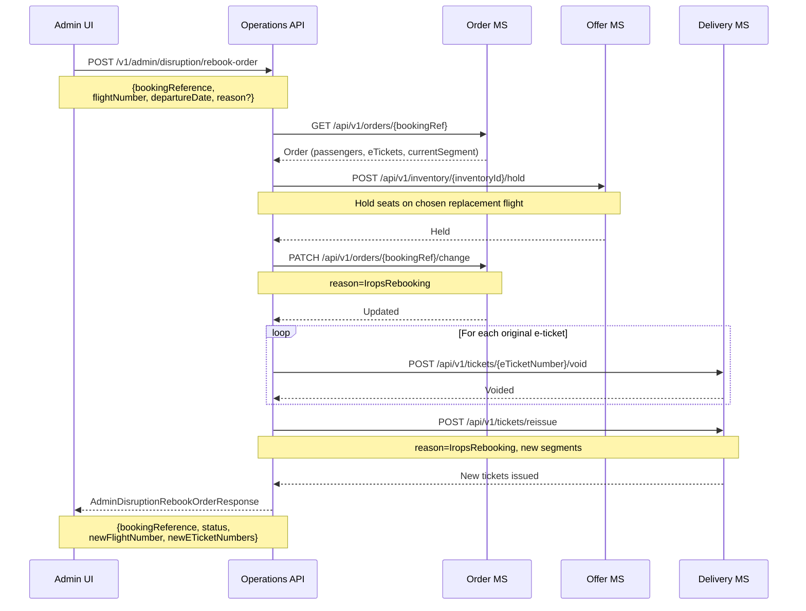
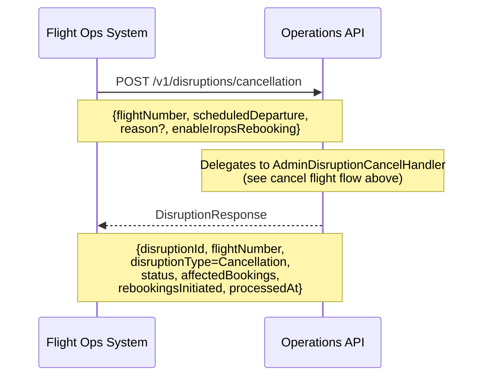
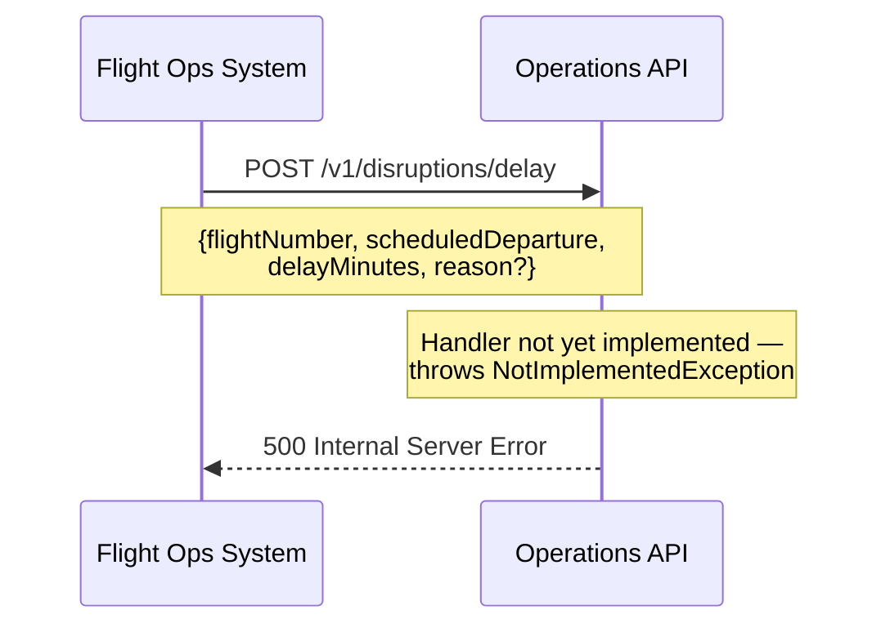
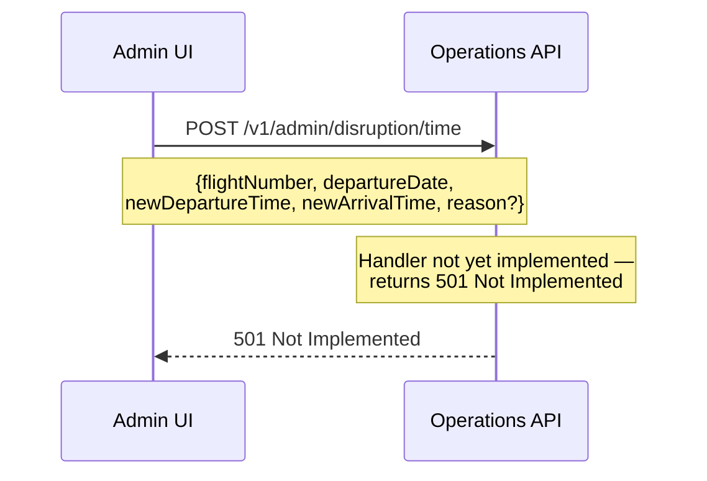
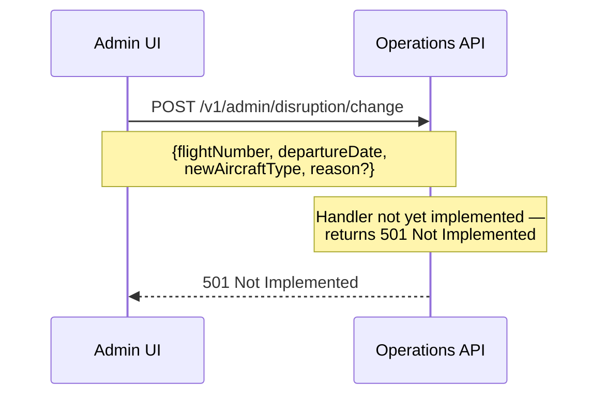

# Disruption — sequence diagrams

Covers IROPS (Irregular Operations) handling: admin-initiated flight cancellation with automatic rebooking, manual rebook of individual affected orders, and FOS (Flight Operations System) event processing. Aircraft type change and time change are defined but not yet implemented.

---

## Admin — cancel flight and auto-rebook all passengers

The most complex disruption flow. Immediately closes inventory to prevent new bookings, retrieves the manifest to identify affected passengers, fetches replacement availability, then processes each booking in IROPS priority order (cabin class, loyalty tier, booking date).

```mermaid
sequenceDiagram
    participant Terminal as Admin UI
    participant OpsAPI as Operations API
    participant OfferMS as Offer MS
    participant DeliveryMS as Delivery MS
    participant OrderMS as Order MS

    Terminal->>OpsAPI: POST /v1/admin/disruption/cancel
    Note over Terminal,OpsAPI: {flightNumber, departureDate, reason?}

    OpsAPI->>OfferMS: POST /api/v1/flights/{flightNumber}/cancel
    Note over OpsAPI,OfferMS: Immediately closes inventory —<br/>prevents new bookings on cancelled flight
    OfferMS-->>OpsAPI: Inventory closed

    OpsAPI->>OfferMS: GET /api/v1/flights/{flightNumber}/{departureDate}
    Note over OpsAPI,OfferMS: Retrieve origin + destination for replacement search
    OfferMS-->>OpsAPI: FlightInventory (origin, destination)

    OpsAPI->>DeliveryMS: GET /api/v1/manifest/{flightNumber}/{departureDate}
    Note over OpsAPI,DeliveryMS: Retrieve manifest for indexed orderId lookup
    DeliveryMS-->>OpsAPI: Manifest (entries[]: orderId, passengerId, eTicketNumber)

    OpsAPI->>OrderMS: POST /api/v1/orders/by-ids
    Note over OpsAPI,OrderMS: Batch fetch confirmed orders using<br/>orderIds from manifest (avoids full table scan)
    OrderMS-->>OpsAPI: AffectedOrders []

    Note over OpsAPI: Sort by IROPS priority:<br/>cabin (F→J→W→Y), loyalty tier, booking date

    OpsAPI->>OfferMS: GET /api/v1/flights/availability
    Note over OpsAPI,OfferMS: origin, destination, departureDate,<br/>lookaheadDays=7;<br/>lightweight read — no fares, no stored offers
    OfferMS-->>OpsAPI: AvailabilityResponse (flights × cabins × seats)

    loop For each affected order (IROPS priority order)
        alt Replacement flight found with available seats in same cabin
            OpsAPI->>OfferMS: POST /api/v1/inventory/{inventoryId}/hold
            Note over OpsAPI,OfferMS: Hold seats on replacement flight
            OfferMS-->>OpsAPI: Held

            OpsAPI->>OrderMS: PATCH /api/v1/orders/{bookingRef}/change
            Note over OpsAPI,OrderMS: newFlightNumber, newDepartureDate,<br/>inventoryId, reason=IropsRebooking
            OrderMS-->>OpsAPI: Order updated

            OpsAPI->>DeliveryMS: POST /api/v1/tickets/{eTicketNumber}/void
            DeliveryMS-->>OpsAPI: Voided

            OpsAPI->>DeliveryMS: POST /api/v1/tickets/reissue
            Note over OpsAPI,DeliveryMS: reason=IropsRebooking, new segments
            DeliveryMS-->>OpsAPI: NewTickets issued

            Note over OpsAPI: Mark replacement seats as sold;<br/>reduce available count in pool
        else No replacement available
            Note over OpsAPI: Record outcome as NoFlightAvailable;<br/>manual handling required
        end
    end

    OpsAPI-->>Terminal: AdminDisruptionCancelResponse
    Note over OpsAPI,Terminal: {flightNumber, affectedPassengerCount,<br/>rebookedCount, failedCount,<br/>outcomes[]: {bookingRef, status,<br/>newFlightNumber?, noFlightReason?}}
```

---

## Admin — get affected orders for cancelled flight

Used to view the disruption passenger list before or after processing, in IROPS priority order.



---

## Admin — manual rebook of a single order

Allows a staff member to rebook one specific booking onto a chosen replacement flight after the automatic process.



---

## FOS — flight cancellation event (external system)

The FOS (Flight Operations System) triggers this endpoint. It delegates to the same `AdminDisruptionCancelHandler` used by staff.



---

## FOS — flight delay event (not yet implemented)



---

## Admin — flight time change (not yet implemented)



---

## Admin — aircraft type change (not yet implemented)


