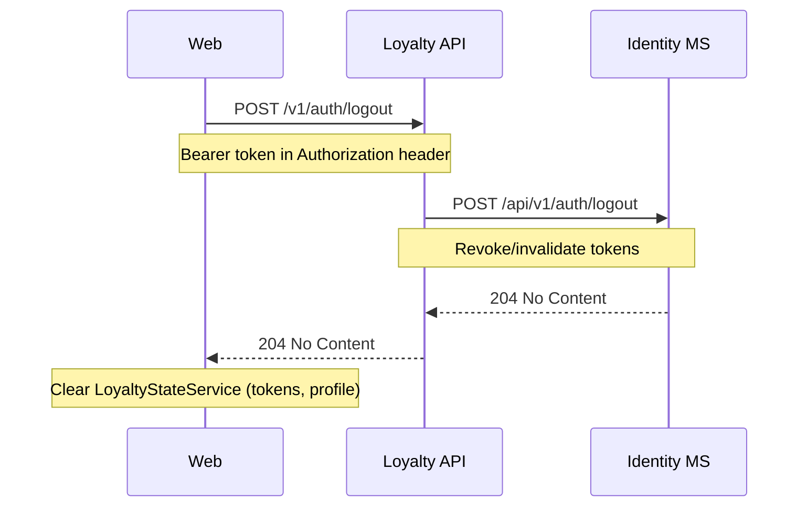
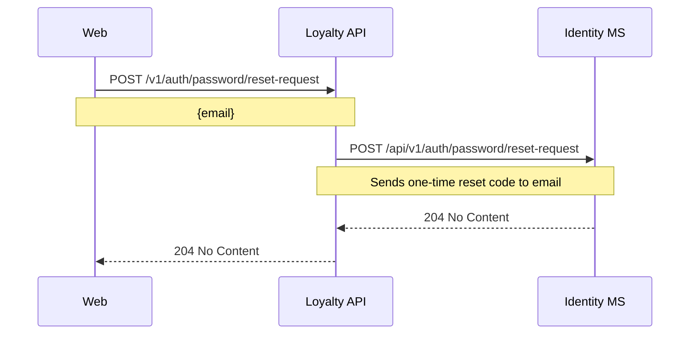
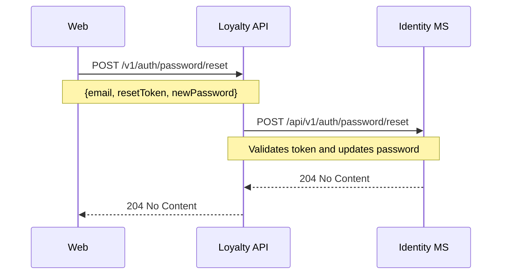
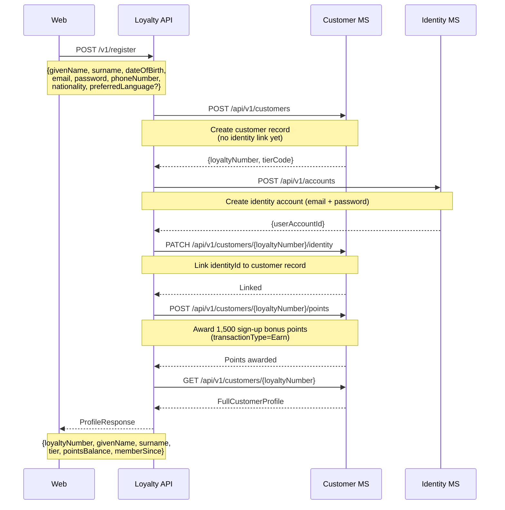
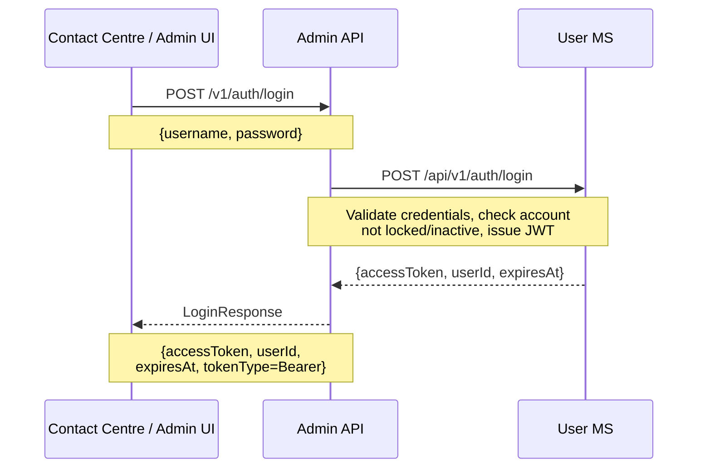

# Identity — sequence diagrams

Covers authentication flows for loyalty members (via the Loyalty API) and staff/agents (via the Admin API). All identity operations are delegated to the Identity microservice.

---

## Loyalty member login

```mermaid
sequenceDiagram
    participant Web
    participant LoyaltyAPI as Loyalty API
    participant IdentityMS as Identity MS
    participant CustomerMS as Customer MS

    Web->>LoyaltyAPI: POST /v1/auth/login
    Note over Web,LoyaltyAPI: {email, password}
    LoyaltyAPI->>IdentityMS: POST /api/v1/auth/login
    Note over LoyaltyAPI,IdentityMS: Validates email + password;<br/>issues JWT + refresh token
    IdentityMS-->>LoyaltyAPI: {accessToken, refreshToken,<br/>expiresAt, userAccountId}

    LoyaltyAPI->>CustomerMS: GET /api/v1/customers/by-identity/{userAccountId}
    CustomerMS-->>LoyaltyAPI: CustomerProfile (loyaltyNumber, tier, pointsBalance)

    LoyaltyAPI-->>Web: LoginResponse
    Note over LoyaltyAPI,Web: {accessToken, refreshToken,<br/>expiresAt, tokenType=Bearer,<br/>loyaltyNumber}

    Note over Web: Store tokens in LoyaltyStateService<br/>(localStorage/sessionStorage)
```

---

## Loyalty member logout



---

## Password reset request



---

## Password reset



---

## Email change

The email change flow involves a request step (sends verification to the new address) and a confirmation step (verifies the token and applies the change in both Identity MS and Customer MS).

```mermaid
sequenceDiagram
    participant Web
    participant LoyaltyAPI as Loyalty API
    participant IdentityMS as Identity MS
    participant CustomerMS as Customer MS

    Web->>LoyaltyAPI: POST /v1/customers/{loyaltyNumber}/email/change-request
    Note over Web,LoyaltyAPI: {newEmail}
    LoyaltyAPI->>IdentityMS: POST /api/v1/auth/email/change-request
    Note over LoyaltyAPI,IdentityMS: Sends verification token to new email
    IdentityMS-->>LoyaltyAPI: 204 No Content
    LoyaltyAPI-->>Web: 204 No Content

    Web->>LoyaltyAPI: POST /v1/auth/email/confirm
    Note over Web,LoyaltyAPI: {token, newEmail}
    LoyaltyAPI->>IdentityMS: POST /api/v1/auth/email/confirm
    Note over LoyaltyAPI,IdentityMS: Validate token; update email in Identity MS
    IdentityMS-->>LoyaltyAPI: {identityId, newEmail}
    LoyaltyAPI->>CustomerMS: PATCH /api/v1/customers/{loyaltyNumber}/email
    Note over LoyaltyAPI,CustomerMS: Sync new email to Customer MS
    CustomerMS-->>LoyaltyAPI: Updated
    LoyaltyAPI-->>Web: 204 No Content
```

---

## Loyalty member registration



---

## Staff login (Admin API)


