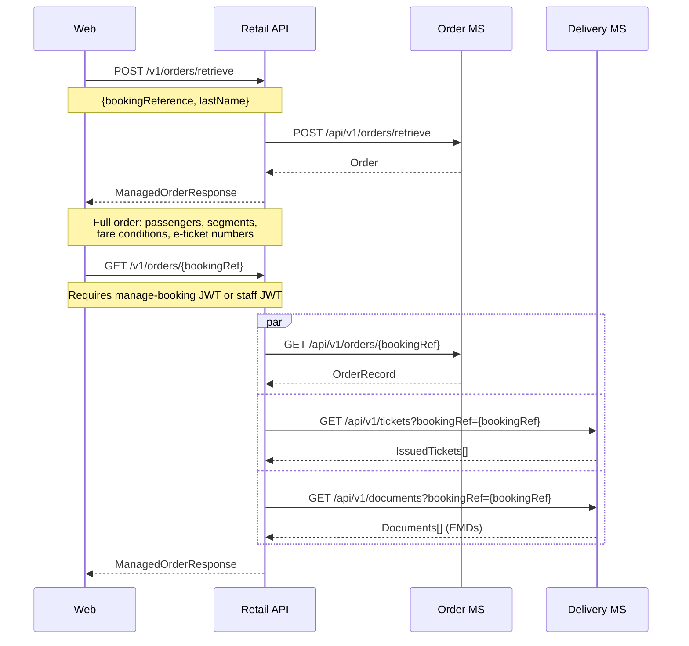
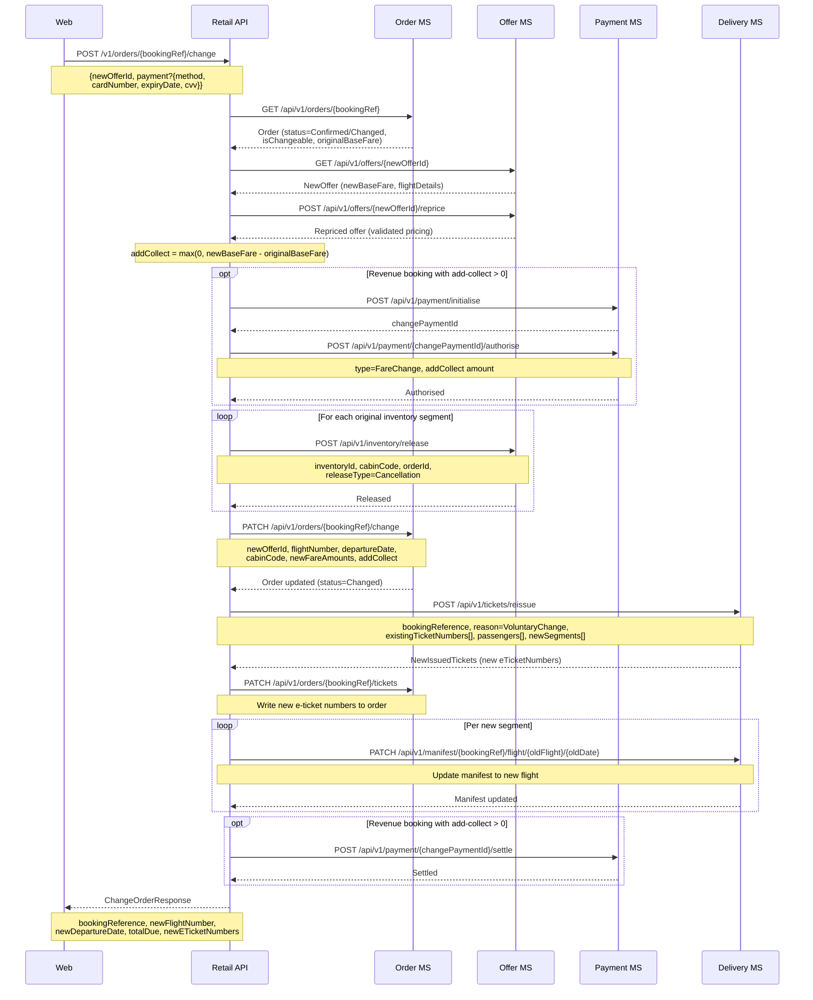
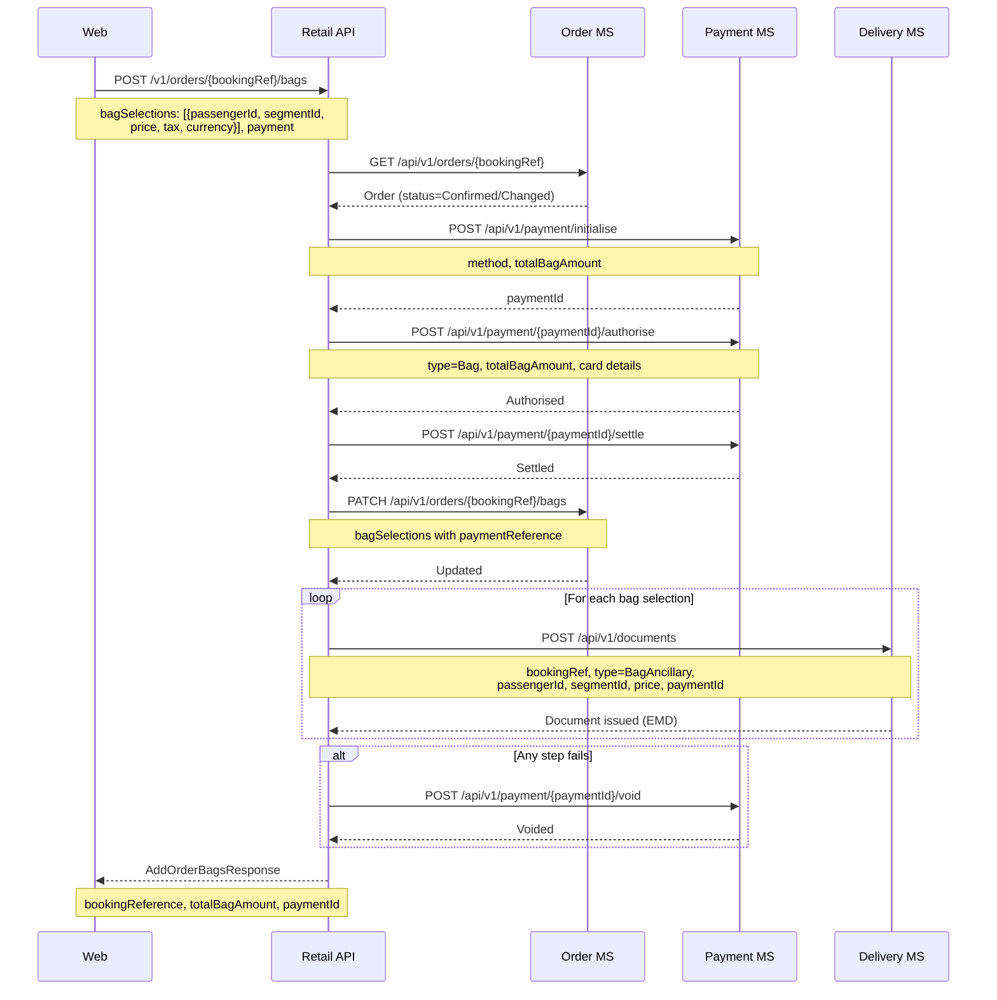
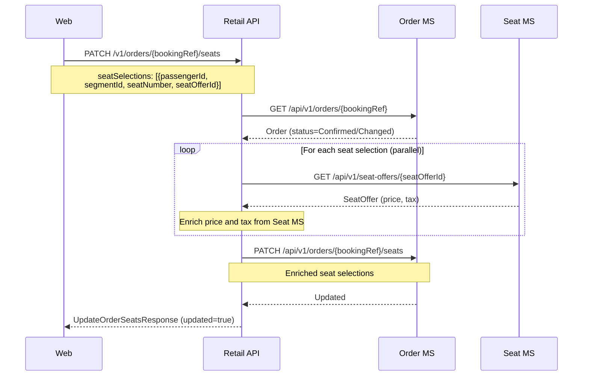
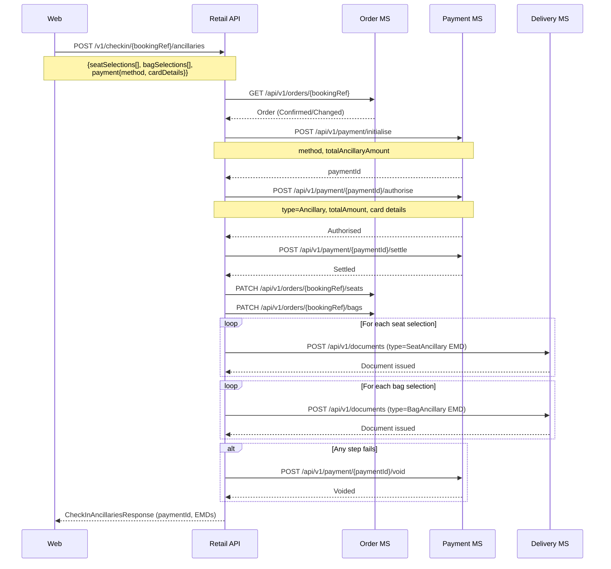
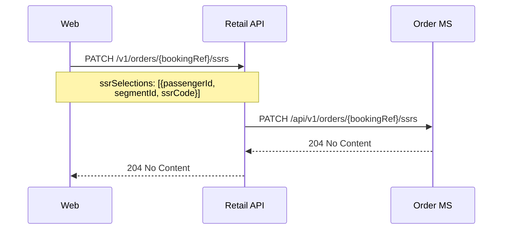
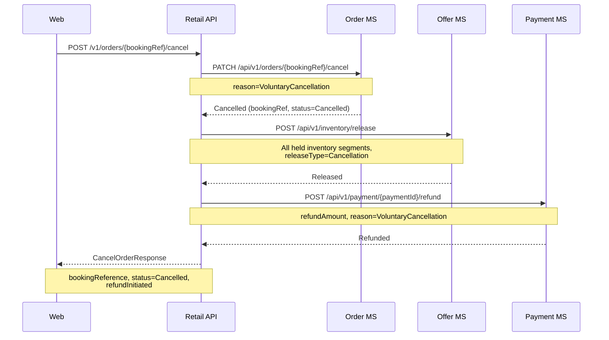
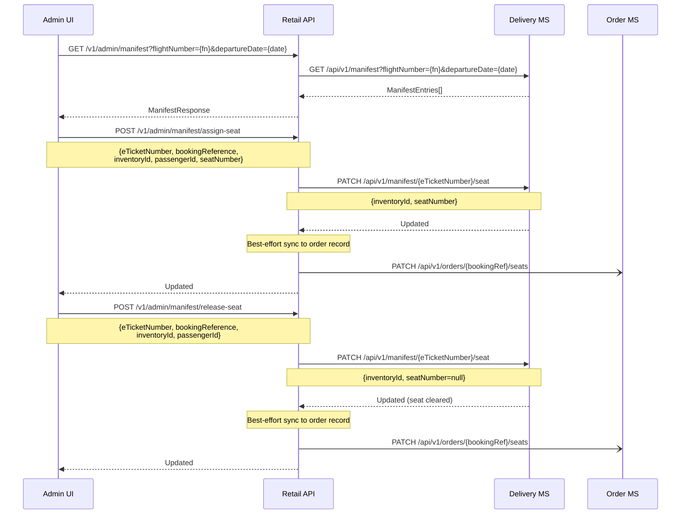
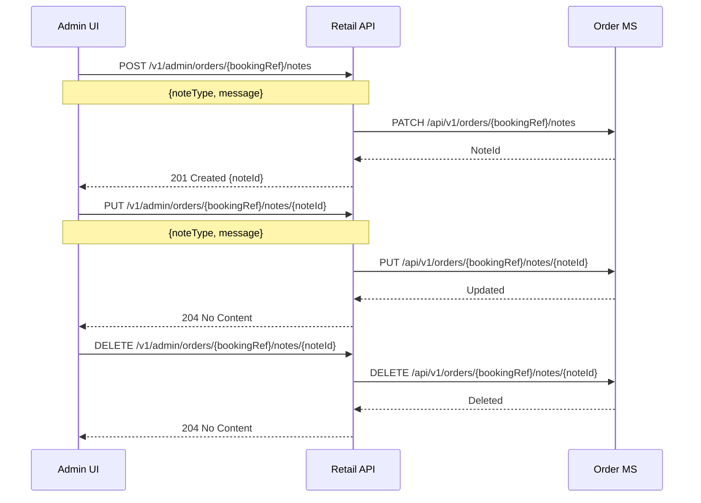

# Manage booking — sequence diagrams

Covers all post-sale order management flows: retrieve, change flight, add bags, update seats, add check-in ancillaries, update SSRs, and cancel.

---

## Retrieve order

`GetOrderHandler` fetches the order record and both ticket and document data in parallel.

---

## Change flight

A voluntary flight change validates the new offer, optionally takes payment for any fare difference (add-collect), releases the original inventory, updates the order, reissues tickets (which internally voids old tickets), then settles payment and updates the manifest.

---

## Add bags post-sale

---

## Update seats post-sale

Seat reassignment is a free order update. The Retail API enriches seat price and tax from the Seat MS then updates the order record — no payment or inventory management occurs in this handler.

---

## Check-in ancillaries (paid seats and bags at check-in)

Passengers purchasing ancillaries during the check-in flow use `CheckInAncillariesHandler`. A single payment record covers all selected ancillaries for the check-in session.

---

## Update SSRs post-sale

---

## Cancel order

Cancellation marks the order as cancelled, releases all inventory, and issues a refund via the Payment MS. Loyalty points reinstatement for reward bookings is not currently handled in the cancel flow.

---

## Admin — manifest view and seat management

Staff can view the full flight manifest and reassign passenger seats. Manifest is the source of truth for seat occupancy at departure.

---

## Admin — order notes

