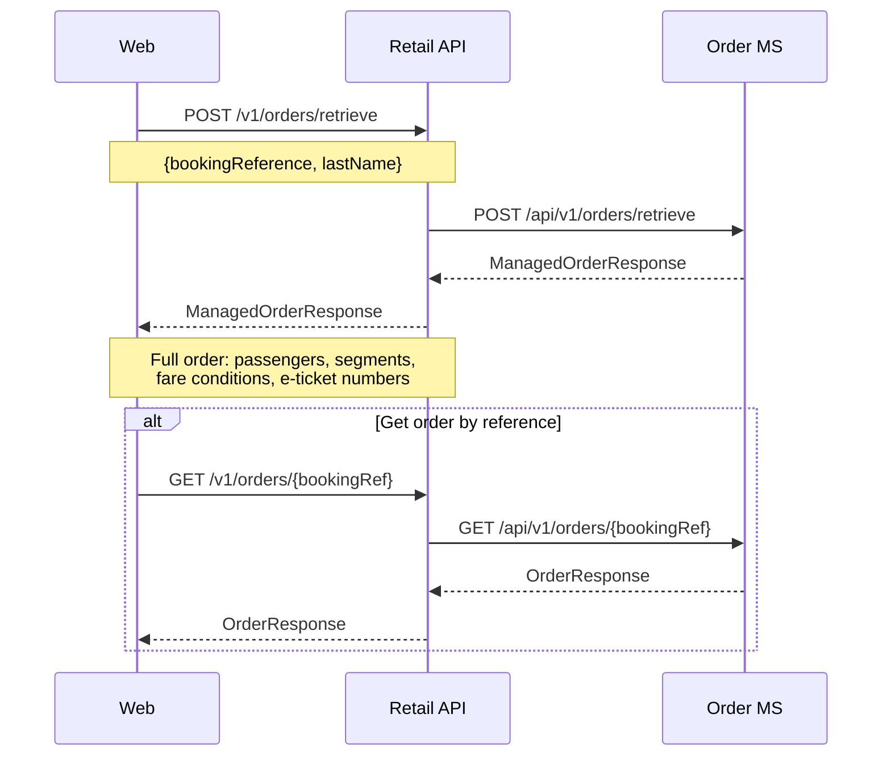
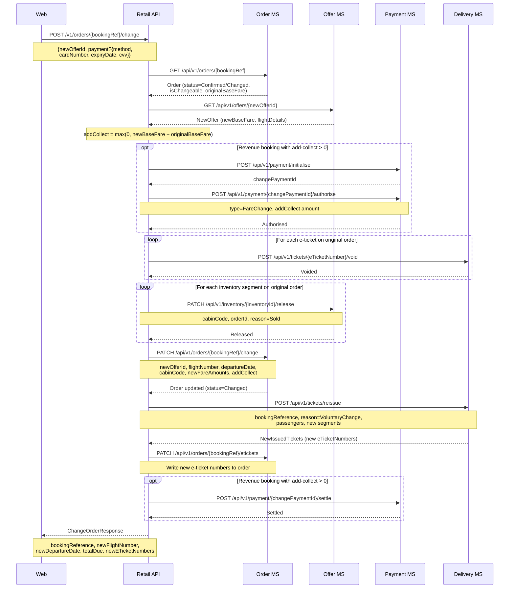
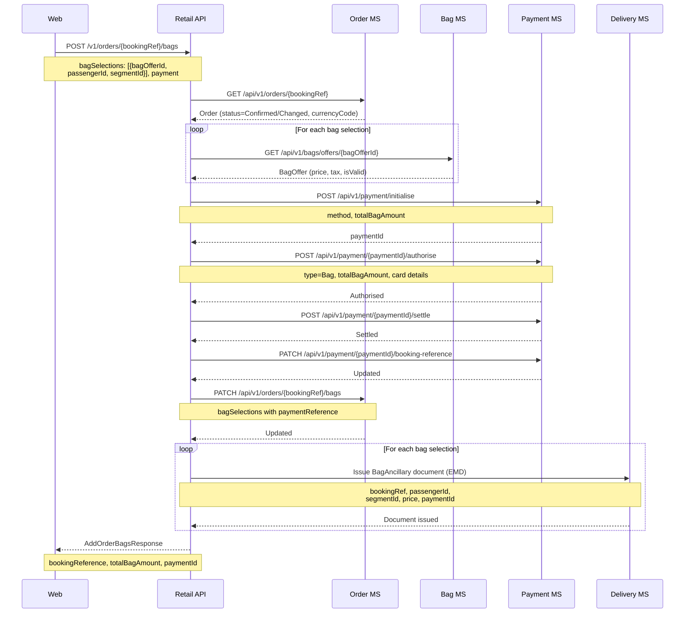
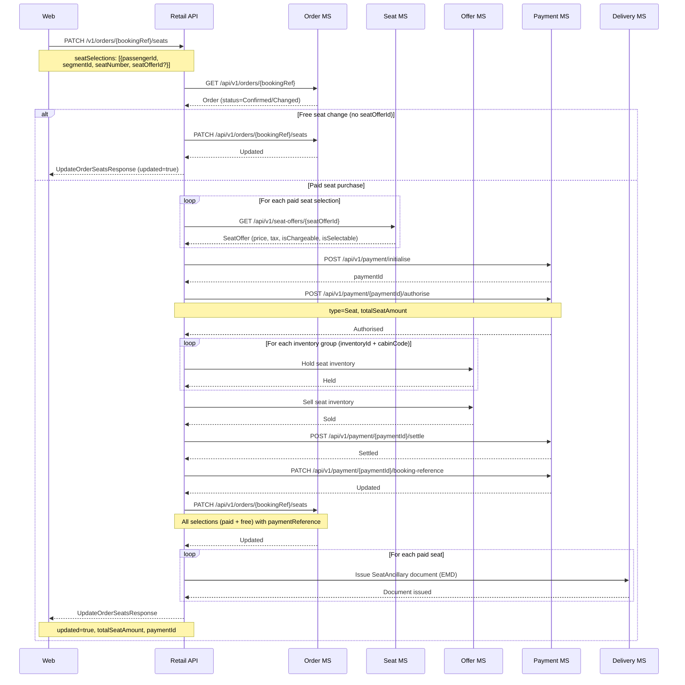
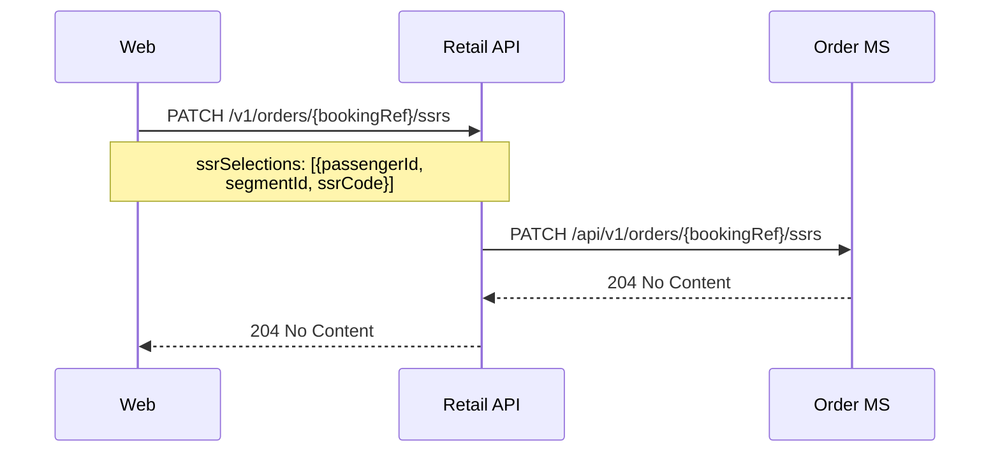
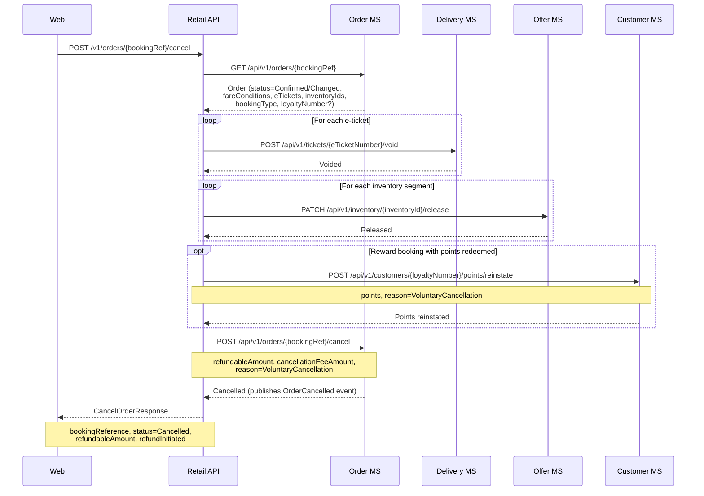

# Manage booking — sequence diagrams

Covers all post-sale order management flows: retrieve, change flight, add bags, update seats, update SSRs, and cancel.

---

## Retrieve order

---

## Change flight

A voluntary flight change validates the new offer, optionally takes payment for the fare difference (add-collect), voids original tickets, releases the original inventory, updates the order, reissues tickets, and settles the payment.

---

## Add bags post-sale

---

## Update seats post-sale

Two variants exist: free seat reassignment (order update only) and paid seat purchase (payment, inventory, EMD issuance).

---

## Update SSRs post-sale

---

## Cancel order

Cancellation voids tickets, releases inventory, reinstates loyalty points for reward bookings, and cancels the order record. Refund processing is handled downstream by the Accounting domain via the OrderCancelled event published by the Order MS.

