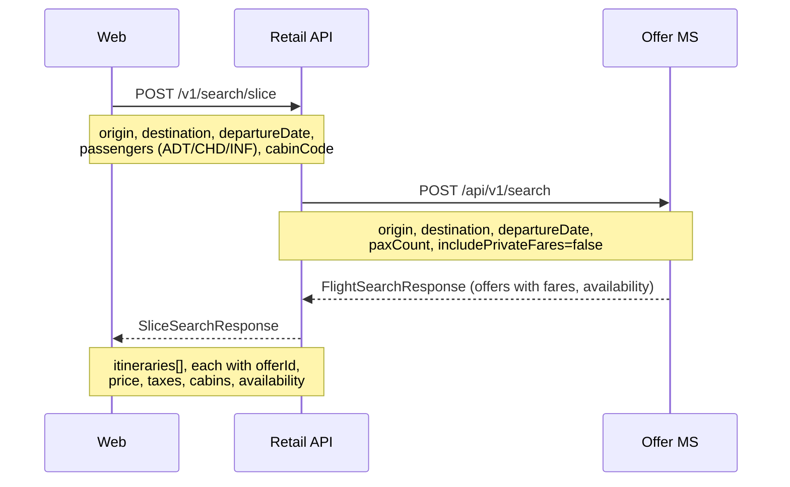
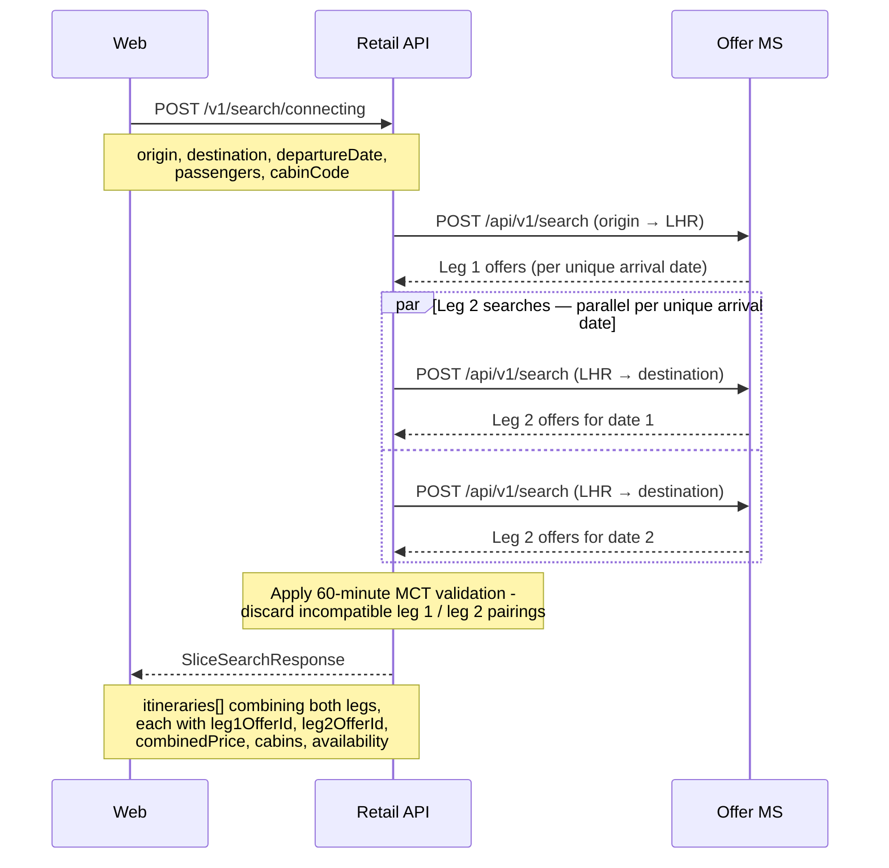
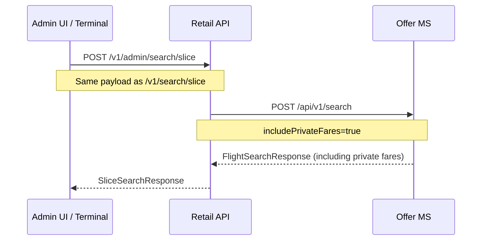

# Offer — sequence diagrams

Covers flight search flows: direct (slice) search, connecting flight search via LHR hub, and admin-facing search with private fares. Both paths originate from the Angular web frontend (or Terminal app for admin), route through the Retail Orchestration API, and delegate to the Offer microservice.

---

## Direct flight search

`SearchFlightsHandler` first attempts a direct search. If no direct results are found and neither endpoint is LHR, it falls back automatically to a connecting search via LHR (see below).

---

## Connecting flight search (via LHR hub)

When called explicitly at `/v1/search/connecting`, or triggered automatically by the slice handler when no direct service is found, a connecting search is performed. Leg 1 runs first; Leg 2 searches then run in parallel for each unique arrival date returned from Leg 1. A 60-minute minimum connection time (MCT) filter is applied before results are returned.

---

## Admin (staff) flight search

Staff search uses the same handler logic but sets `includePrivateFares=true` so that private fare tiers are included in results.

