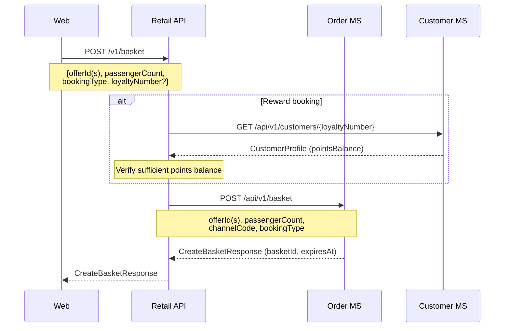
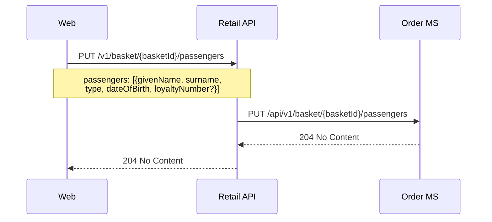
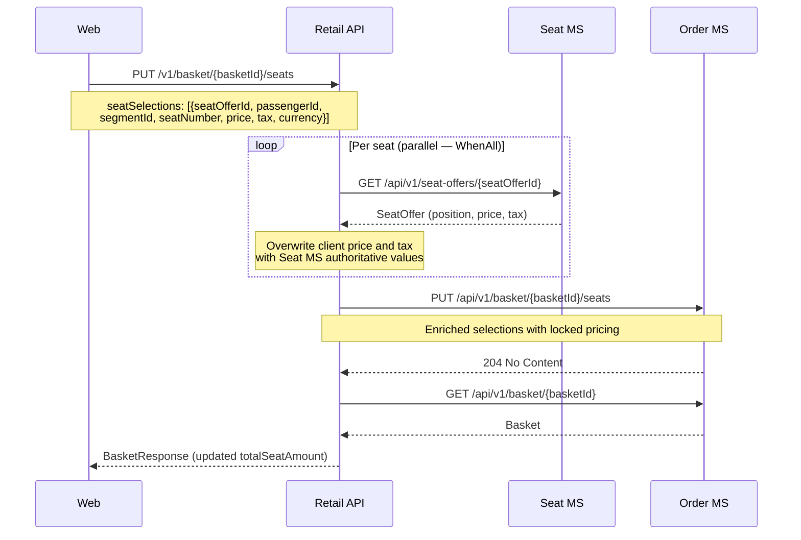
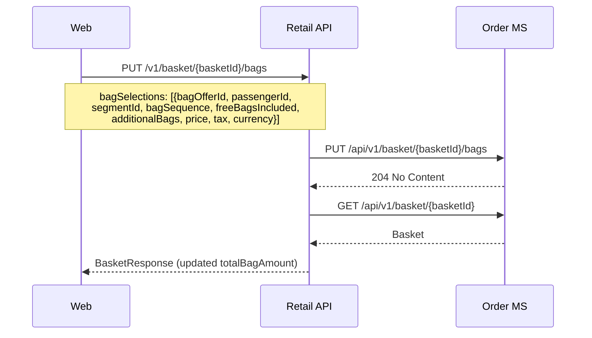
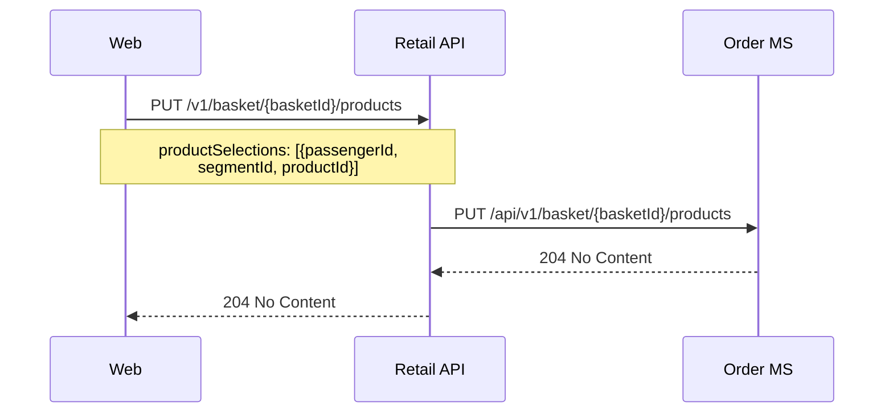
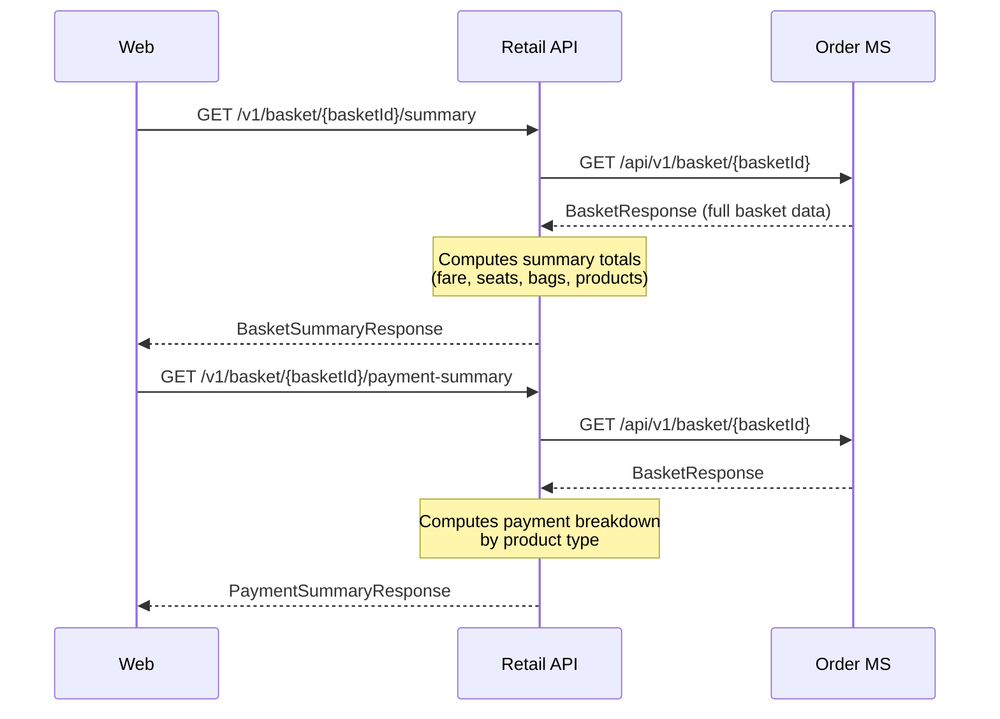

# Order — sequence diagrams

Covers the basket lifecycle and booking confirmation flow. The basket is built incrementally (passengers, seats, bags, SSRs, products) and then confirmed with payment to produce a confirmed order with e-tickets.

---

## Create basket



---

## Update basket — passengers



---

## Update basket — seats

The Retail API enriches each seat selection with authoritative price and tax from the Seat MS before storing. All enrichment calls run in parallel.



---

## Update basket — bags



---

## Update basket — products



---

## Get basket summary



---

## Confirm basket (revenue booking)

The confirm flow is the most complex sequence in the system. It validates the basket, reprices offers, creates a draft order, takes payment, confirms the order, then issues tickets and records ancillary EMDs in parallel.

```mermaid
sequenceDiagram
    participant Web
    participant RetailAPI as Retail API
    participant OrderMS as Order MS
    participant OfferMS as Offer MS
    participant PaymentMS as Payment MS
    participant DeliveryMS as Delivery MS
    participant CustomerMS as Customer MS

    Web->>RetailAPI: POST /v1/basket/{basketId}/confirm
    Note over Web,RetailAPI: {paymentMethod, cardNumber,<br/>expiryDate, cvv, cardholderName}

    RetailAPI->>OrderMS: GET /api/v1/basket/{basketId}
    OrderMS-->>RetailAPI: Basket (status=Active, not expired)

    loop For each offerId in basket
        RetailAPI->>OfferMS: POST /api/v1/offers/{offerId}/reprice
        OfferMS-->>RetailAPI: Repriced offer (validated=true)
    end
    Note over RetailAPI: Prices locked at search time (stored offer);<br/>reprice validates, does not override basket amounts

    RetailAPI->>OrderMS: POST /api/v1/orders
    Note over RetailAPI,OrderMS: basketId, channelCode, bookingType=Revenue
    OrderMS-->>RetailAPI: DraftOrder (orderId, status=Draft)

    RetailAPI->>PaymentMS: POST /api/v1/payment/initialise
    Note over RetailAPI,PaymentMS: method, currencyCode, totalAmount
    PaymentMS-->>RetailAPI: paymentId

    RetailAPI->>PaymentMS: POST /api/v1/payment/{paymentId}/authorise
    Note over RetailAPI,PaymentMS: type=Fare, fareAmount,<br/>card details
    PaymentMS-->>RetailAPI: Authorised

    RetailAPI->>OrderMS: POST /api/v1/orders/{orderId}/confirm
    Note over RetailAPI,OrderMS: basketId, paymentRefs,<br/>enriched offer data (locked fares + tax lines)
    OrderMS-->>RetailAPI: ConfirmedOrder (bookingReference, basket deleted)

    RetailAPI->>PaymentMS: PATCH /api/v1/payment/{paymentId}/booking-reference
    Note over RetailAPI,PaymentMS: Links payment to booking reference

    par Post-confirm parallel operations
        RetailAPI->>OfferMS: Hold inventory per segment
        OfferMS-->>RetailAPI: Held
        RetailAPI->>OfferMS: Sell inventory per segment
        OfferMS-->>RetailAPI: Sold

    and
        RetailAPI->>DeliveryMS: POST /api/v1/tickets/issue
        Note over RetailAPI,DeliveryMS: passengers, segments, bookingReference
        DeliveryMS-->>RetailAPI: IssuedTickets (eTicketNumbers)
        RetailAPI->>OrderMS: PATCH /api/v1/orders/{bookingRef}/etickets
        Note over RetailAPI,OrderMS: Write e-ticket numbers back to order

    and
        RetailAPI->>PaymentMS: POST /api/v1/payment/{paymentId}/settle
        Note over RetailAPI,PaymentMS: Settle fare amount

        opt Seat ancillaries
            RetailAPI->>PaymentMS: POST /api/v1/payment/{paymentId}/authorise (type=Seat)
            RetailAPI->>PaymentMS: POST /api/v1/payment/{paymentId}/settle
            RetailAPI->>DeliveryMS: Issue SeatAncillary document (EMD)
        end

        opt Bag ancillaries
            RetailAPI->>PaymentMS: POST /api/v1/payment/{paymentId}/authorise (type=Bag)
            RetailAPI->>PaymentMS: POST /api/v1/payment/{paymentId}/settle
            RetailAPI->>DeliveryMS: Issue BagAncillary document (EMD)
        end

        opt Product ancillaries
            RetailAPI->>PaymentMS: POST /api/v1/payment/{paymentId}/authorise (type=Product)
            RetailAPI->>PaymentMS: POST /api/v1/payment/{paymentId}/settle
            RetailAPI->>DeliveryMS: Issue ProductAncillary document (EMD)
        end

    and
        RetailAPI->>CustomerMS: Link loyalty account (if loyalty enrolled)
        Note over RetailAPI,CustomerMS: Record points accrual for revenue booking
        CustomerMS-->>RetailAPI: Linked
    end

    RetailAPI->>DeliveryMS: Write passenger manifest entry
    DeliveryMS-->>RetailAPI: Manifest written

    RetailAPI-->>Web: OrderResponse
    Note over RetailAPI,Web: bookingReference, eTicketNumbers,<br/>passengers, segments, totalAmount
```

---

## Confirm basket (reward booking)

Reward bookings follow the same flow as revenue bookings except no card payment is taken. Points are held at basket creation and redeemed at confirmation.

```mermaid
sequenceDiagram
    participant Web
    participant RetailAPI as Retail API
    participant OrderMS as Order MS
    participant OfferMS as Offer MS
    participant DeliveryMS as Delivery MS
    participant CustomerMS as Customer MS

    Web->>RetailAPI: POST /v1/basket/{basketId}/confirm
    Note over Web,RetailAPI: {bookingType=Reward,<br/>loyaltyPointsToRedeem}

    RetailAPI->>OrderMS: GET /api/v1/basket/{basketId}
    OrderMS-->>RetailAPI: Basket (bookingType=Reward)

    loop For each offerId in basket
        RetailAPI->>OfferMS: POST /api/v1/offers/{offerId}/reprice
        OfferMS-->>RetailAPI: Repriced offer (validated=true)
    end

    RetailAPI->>OrderMS: POST /api/v1/orders
    Note over RetailAPI,OrderMS: basketId, bookingType=Reward
    OrderMS-->>RetailAPI: DraftOrder (orderId)

    Note over RetailAPI: No card payment — points redemption;<br/>no PaymentMS calls for fare

    RetailAPI->>OrderMS: POST /api/v1/orders/{orderId}/confirm
    OrderMS-->>RetailAPI: ConfirmedOrder (bookingReference)

    par Post-confirm parallel operations
        RetailAPI->>OfferMS: Hold + sell inventory per segment
    and
        RetailAPI->>DeliveryMS: Issue e-tickets
        DeliveryMS-->>RetailAPI: IssuedTickets
        RetailAPI->>OrderMS: PATCH etickets
    and
        RetailAPI->>CustomerMS: Debit points redemption
        CustomerMS-->>RetailAPI: Points debited
    end

    RetailAPI->>DeliveryMS: Write passenger manifest
    RetailAPI-->>Web: OrderResponse
```
