# Order — sequence diagrams

Covers the basket lifecycle and booking confirmation flow. The basket is built incrementally (passengers, seats, bags, SSRs, products) and then confirmed with payment to produce a confirmed order with e-tickets.

---

## Create basket

`CreateBasketHandler` creates the basket in the Order MS, then fetches each offer from the Offer MS (by offerId with session scope, falling back to session-unscoped) and adds it to the basket.

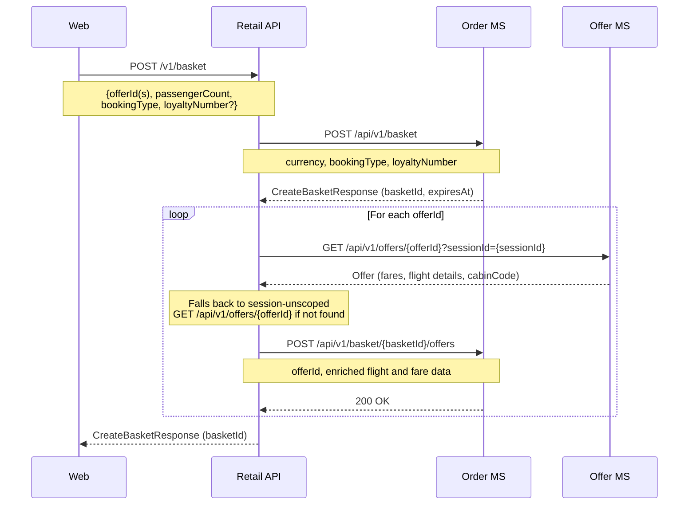

---

## Update basket — passengers

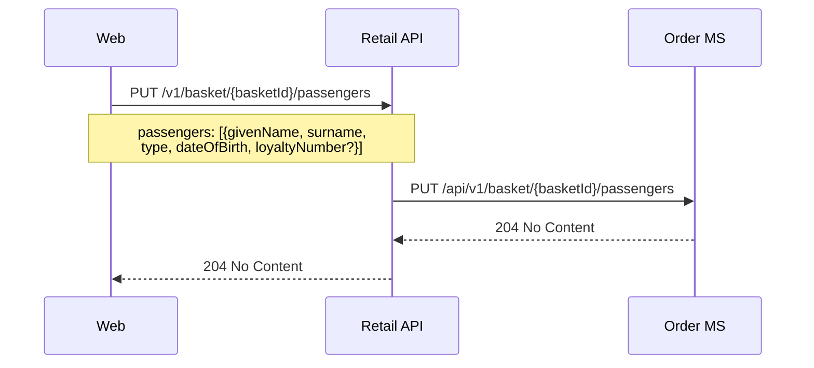

---

## Update basket — seats

The Retail API enriches each seat selection with authoritative price and tax from the Seat MS before storing. All enrichment calls run in parallel.

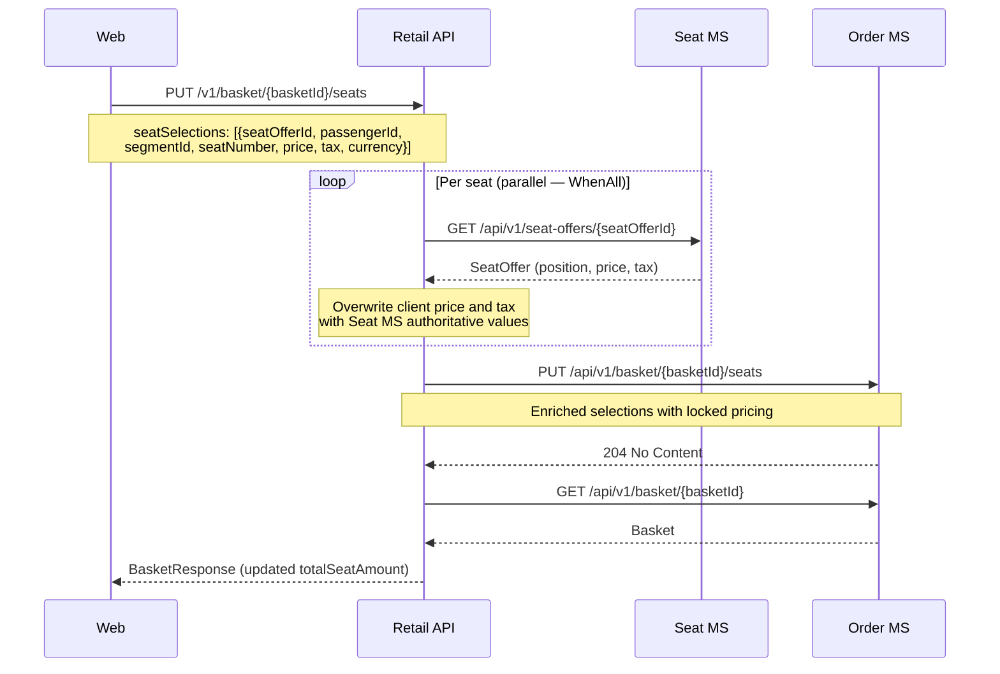

---

## Update basket — bags

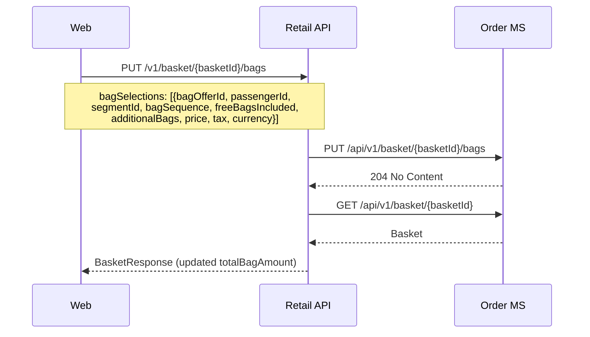

---

## Update basket — SSRs

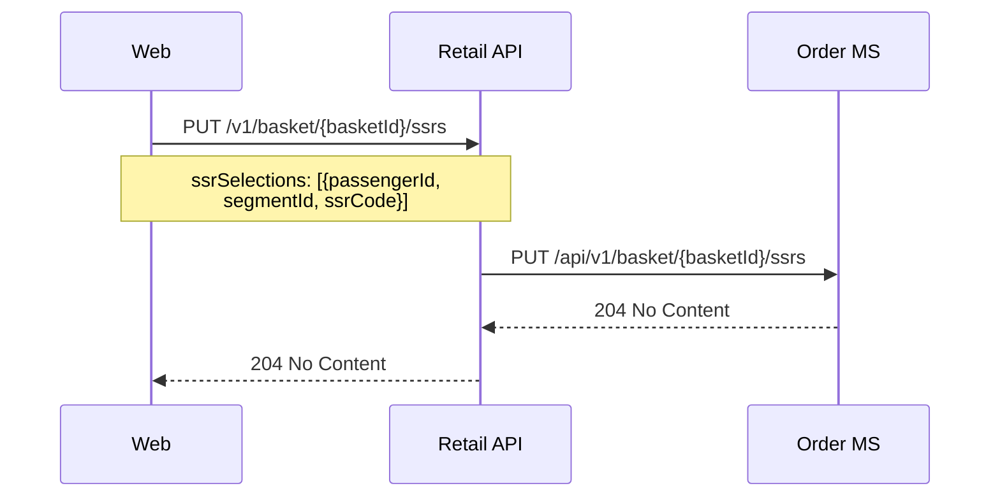

---

## Update basket — products

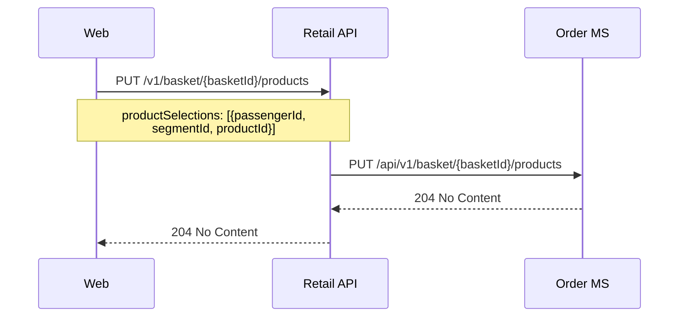

---

## Get basket summary

Both summary endpoints retrieve the basket then reprice each offer to get the latest tax breakdown.

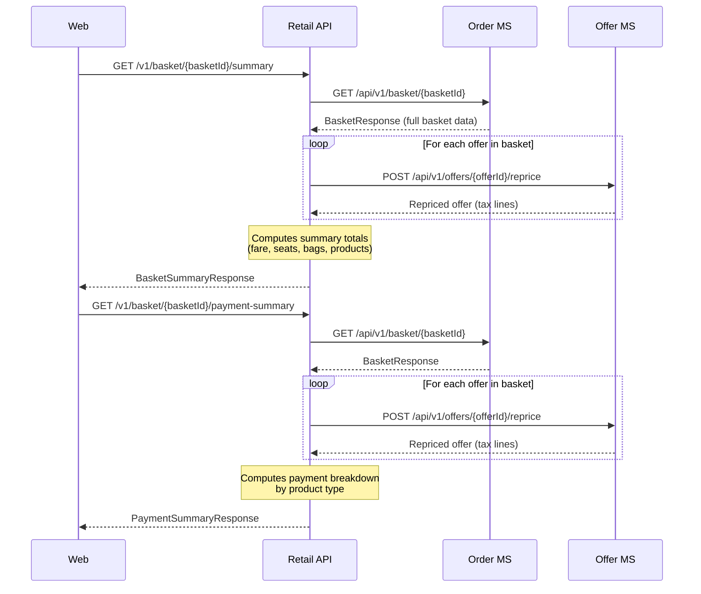

---

## Confirm basket (revenue booking)

The confirm flow is the most complex sequence in the system. It validates the basket, reprices offers, creates a draft order, takes payment, confirms the order, then issues tickets, settles ancillary payments, writes the manifest, and links the loyalty account — all in parallel after confirmation.

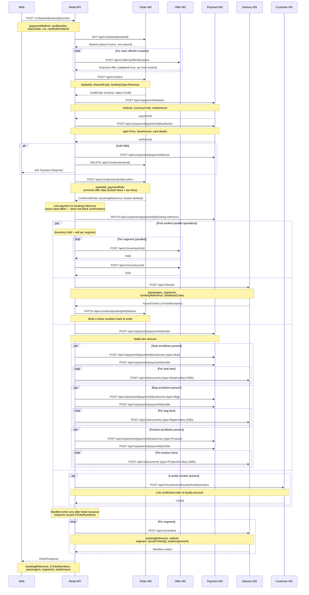

---

## Confirm basket (reward booking)

Reward bookings follow the same structure as revenue bookings except no card payment is taken for the fare. The order is confirmed and linked to the loyalty account as with revenue bookings.

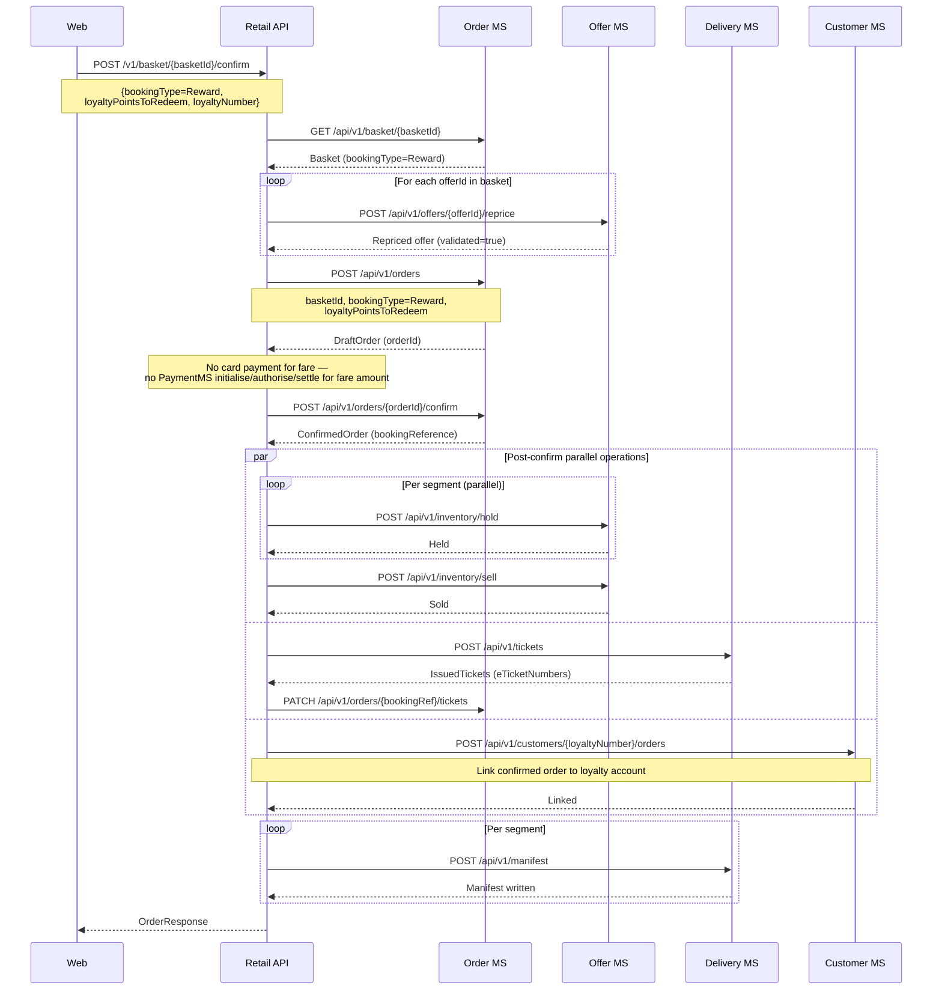

---

## Validate order (manage-booking token)

Issues a short-lived JWT scoped to the booking reference, used to authorise subsequent manage-booking calls.

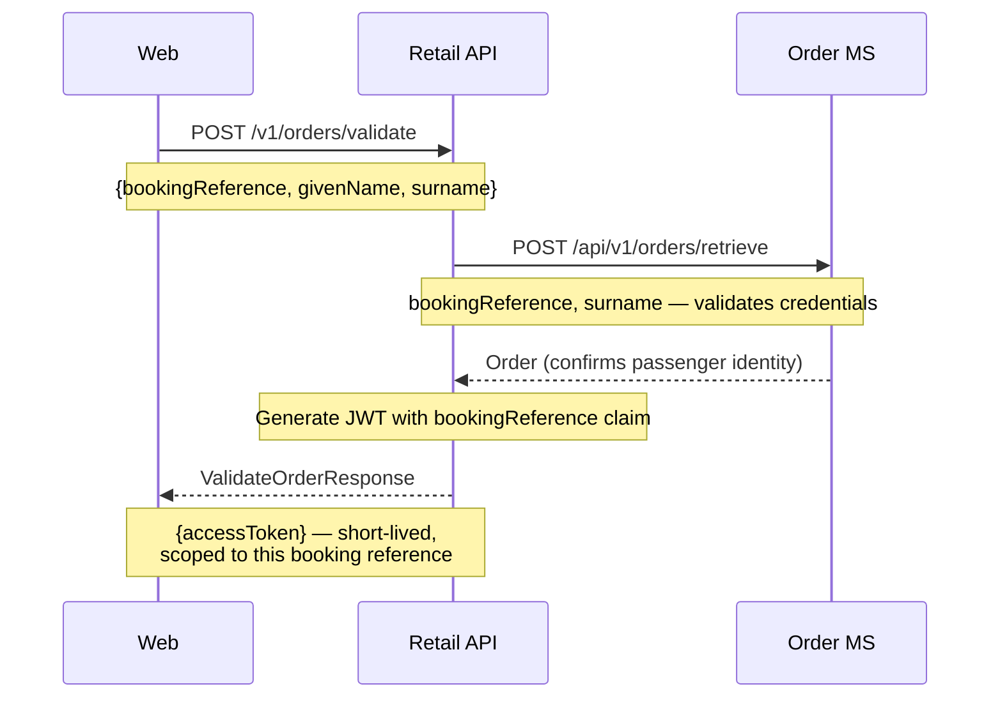

---

## Get order

`GetOrderHandler` retrieves the order record then fetches both e-tickets and EMD documents from the Delivery MS in parallel.

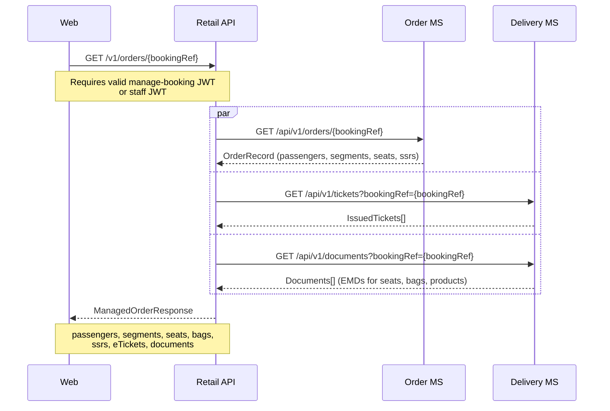
