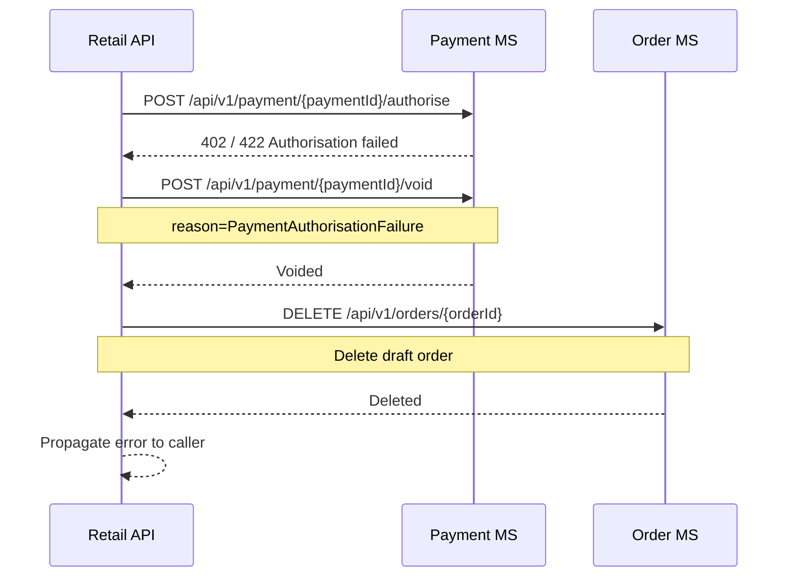
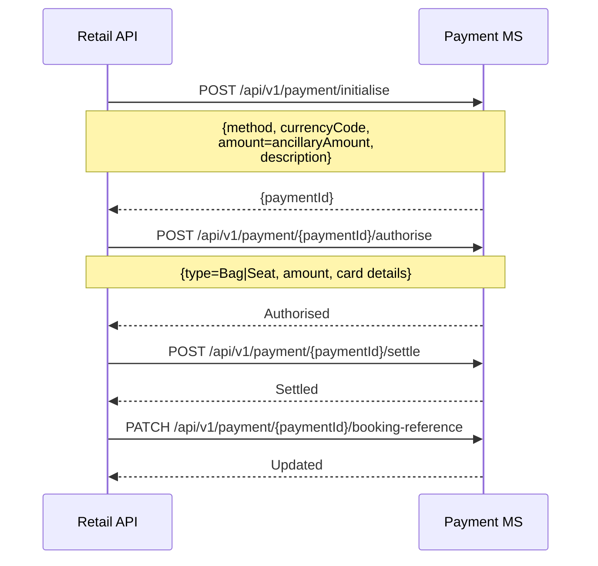
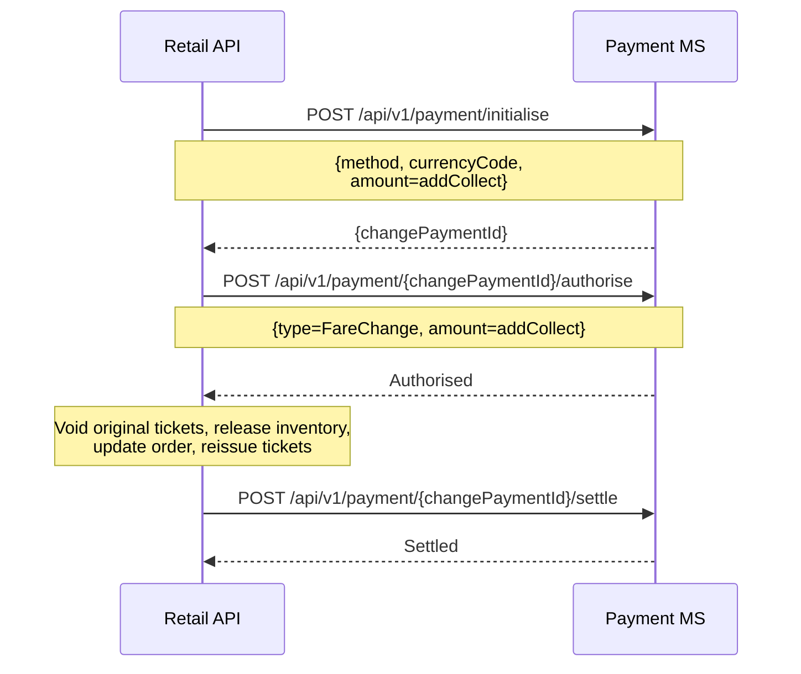
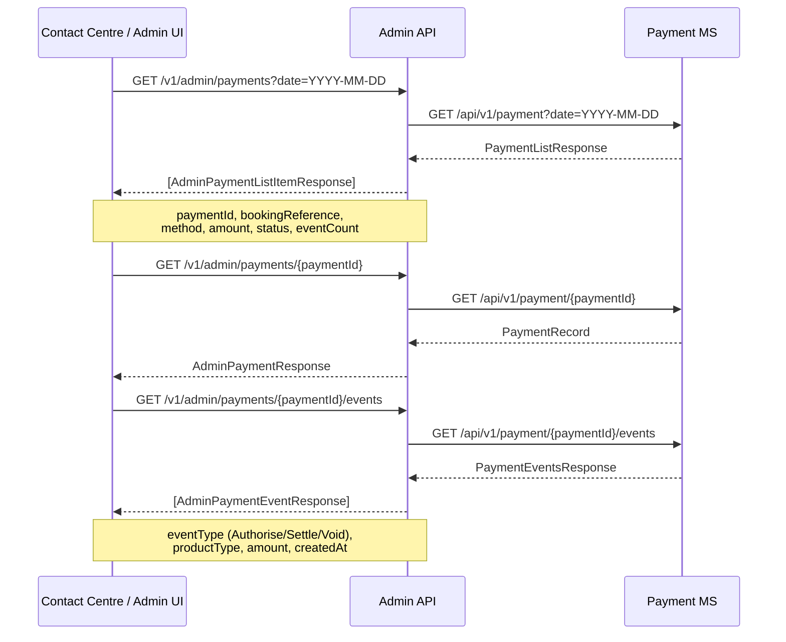

# Payment — sequence diagrams

The Payment microservice is never called directly from the web frontend. All payment interactions are orchestrated from within the Retail Orchestration API handlers. This file documents the payment service call patterns as they appear across different capabilities, plus the admin payment reporting flows.

---

## Payment lifecycle (booking confirmation)

Called from within `ConfirmBasketHandler`. A single payment record covers the full booking including ancillaries; each product type is authorised and settled as a sequential event pair on the same `paymentId`.

```mermaid
sequenceDiagram
    participant RetailAPI as Retail API
    participant PaymentMS as Payment MS

    RetailAPI->>PaymentMS: POST /api/v1/payment/initialise
    Note over RetailAPI,PaymentMS: {method, currencyCode,<br/>amount=totalBookingAmount,<br/>description}
    PaymentMS-->>RetailAPI: {paymentId}

    RetailAPI->>PaymentMS: POST /api/v1/payment/{paymentId}/authorise
    Note over RetailAPI,PaymentMS: {type=Fare, amount=fareAmount,<br/>cardNumber, expiryDate, cvv,<br/>cardholderName}
    PaymentMS-->>RetailAPI: Authorised

    Note over RetailAPI: Order confirmed; booking reference assigned

    RetailAPI->>PaymentMS: PATCH /api/v1/payment/{paymentId}/booking-reference
    Note over RetailAPI,PaymentMS: {bookingReference}
    PaymentMS-->>RetailAPI: Updated

    RetailAPI->>PaymentMS: POST /api/v1/payment/{paymentId}/settle
    Note over RetailAPI,PaymentMS: {amount=fareAmount}
    PaymentMS-->>RetailAPI: Settled

    opt Seat ancillaries present
        RetailAPI->>PaymentMS: POST /api/v1/payment/{paymentId}/authorise
        Note over RetailAPI,PaymentMS: {type=Seat, amount=seatAmount}
        PaymentMS-->>RetailAPI: Authorised
        RetailAPI->>PaymentMS: POST /api/v1/payment/{paymentId}/settle
        PaymentMS-->>RetailAPI: Settled
    end

    opt Bag ancillaries present
        RetailAPI->>PaymentMS: POST /api/v1/payment/{paymentId}/authorise
        Note over RetailAPI,PaymentMS: {type=Bag, amount=bagAmount}
        PaymentMS-->>RetailAPI: Authorised
        RetailAPI->>PaymentMS: POST /api/v1/payment/{paymentId}/settle
        PaymentMS-->>RetailAPI: Settled
    end

    opt Product ancillaries present
        RetailAPI->>PaymentMS: POST /api/v1/payment/{paymentId}/authorise
        Note over RetailAPI,PaymentMS: {type=Product, amount=productAmount}
        PaymentMS-->>RetailAPI: Authorised
        RetailAPI->>PaymentMS: POST /api/v1/payment/{paymentId}/settle
        PaymentMS-->>RetailAPI: Settled
    end
```

---

## Payment authorisation failure handling

If card authorisation fails, the payment record is voided and the draft order is deleted before the error is returned to the caller.



---

## Payment lifecycle (post-sale ancillary — bags or seats)

Called from within `AddOrderBagsHandler` and `UpdateOrderSeatsHandler`. Each post-sale ancillary purchase uses its own payment record.



---

## Payment lifecycle (change flight with add-collect)

Called from within `ChangeOrderHandler` when the new fare exceeds the original. Payment is authorised before the change is applied and settled after tickets are reissued.



---

## Admin payment reporting

The Admin API provides read-only access to payment records for staff. No mutations are exposed.


