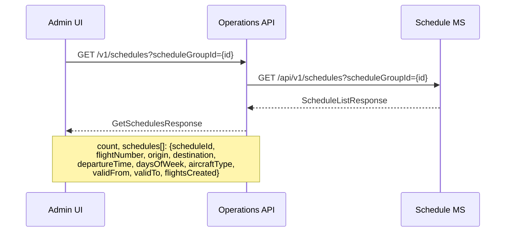
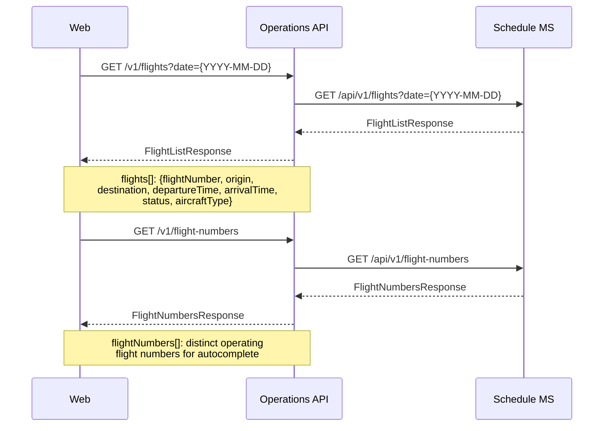
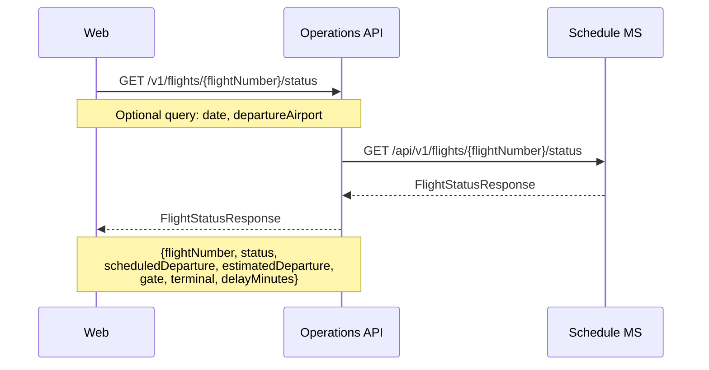

# Schedule — sequence diagrams

Covers flight schedule management: SSIM file import, schedule-to-inventory import, and schedule retrieval. Also covers the operational flight status and availability queries used by the web frontend.

---

## SSIM schedule import (admin)

```mermaid
sequenceDiagram
    participant Terminal as Admin UI
    participant OpsAPI as Operations API
    participant ScheduleMS as Schedule MS

    Terminal->>OpsAPI: POST /v1/schedules/ssim?scheduleGroupId={id}&createdBy={user}
    Note over Terminal,OpsAPI: Body: SSIM Chapter 7 plain-text file
    Note over OpsAPI: Parse SSIM file into structured schedule records<br/>(flightNumber, origin, destination,<br/>departureTime, daysOfWeek, validFrom/To, aircraftType)
    OpsAPI->>ScheduleMS: POST /api/v1/schedules/import
    Note over OpsAPI,ScheduleMS: Structured schedule payload;<br/>scheduleGroupId scopes the import
    ScheduleMS-->>OpsAPI: ImportResult (imported, deleted counts)
    OpsAPI-->>Terminal: ImportSsimResponse
    Note over OpsAPI,Terminal: {imported, deleted,<br/>scheduleGroupId, perScheduleSummary[]}
```

---

## Schedule retrieval (admin)



---

## Import schedules to inventory (admin)

Converts stored schedule records into offer inventory. Fetches aircraft configurations from Seat MS and fare rules from Fare Rule MS, then batch-creates flight inventory and applies fare rules in Offer MS.

```mermaid
sequenceDiagram
    participant Terminal as Admin UI
    participant OpsAPI as Operations API
    participant ScheduleMS as Schedule MS
    participant SeatMS as Seat MS
    participant FareRuleMS as Fare Rule MS
    participant OfferMS as Offer MS

    Terminal->>OpsAPI: POST /v1/schedules/import-inventory
    Note over Terminal,OpsAPI: {scheduleGroupId?, toDate?}

    OpsAPI->>ScheduleMS: GET /api/v1/schedules?scheduleGroupId={id}
    ScheduleMS-->>OpsAPI: Schedules (validFrom, validTo, daysOfWeek, aircraftType)

    OpsAPI->>SeatMS: GET /api/v1/aircraft-types
    Note over OpsAPI,SeatMS: Resolve cabin seat counts per aircraft type
    SeatMS-->>OpsAPI: AircraftTypesResponse [{aircraftTypeCode, cabinCounts}]

    OpsAPI->>FareRuleMS: GET /api/v1/fare-rules
    Note over OpsAPI,FareRuleMS: Fetch all active fare rules grouped by cabin
    FareRuleMS-->>OpsAPI: FareRules []

    Note over OpsAPI: For each schedule: enumerate operating dates<br/>(ValidFrom → min(ValidTo, today+1mo));<br/>skip dates before today;<br/>skip schedules with no aircraft config

    OpsAPI->>OfferMS: POST /api/v1/flights/batch
    Note over OpsAPI,OfferMS: flights[]: {flightNumber, departureDate,<br/>departureTime, arrivalTime, origin,<br/>destination, aircraftType, cabins[]};<br/>existing records skipped automatically
    OfferMS-->>OpsAPI: BatchCreateResult {created, skipped, inventories[]}

    loop For each newly created inventory × cabin × fare rule
        OpsAPI->>OfferMS: POST /api/v1/inventory/{inventoryId}/fares
        Note over OpsAPI,OfferMS: fareBasisCode, fareFamily, bookingClass,<br/>baseFareAmount, taxAmount, isRefundable,<br/>isChangeable, pointsPrice (if Reward rule)
        OfferMS-->>OpsAPI: Fare created
    end

    OpsAPI-->>Terminal: ImportSchedulesToInventoryResponse
    Note over OpsAPI,Terminal: {schedulesProcessed, inventoriesCreated,<br/>inventoriesSkipped, faresCreated}
```

---

## Flight availability query (web — flight status page)



---

## Real-time flight status query


