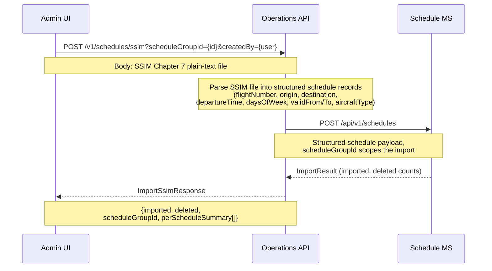
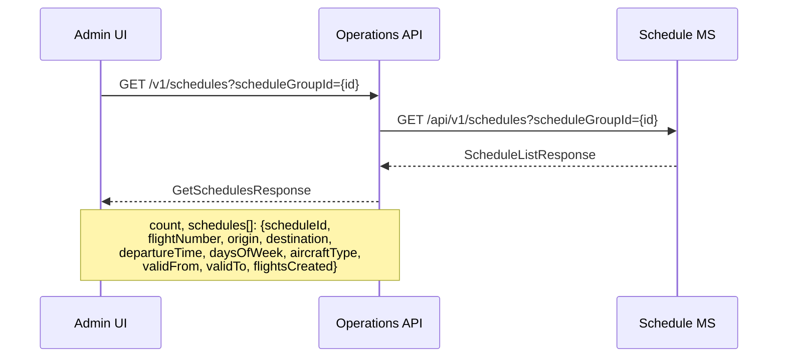
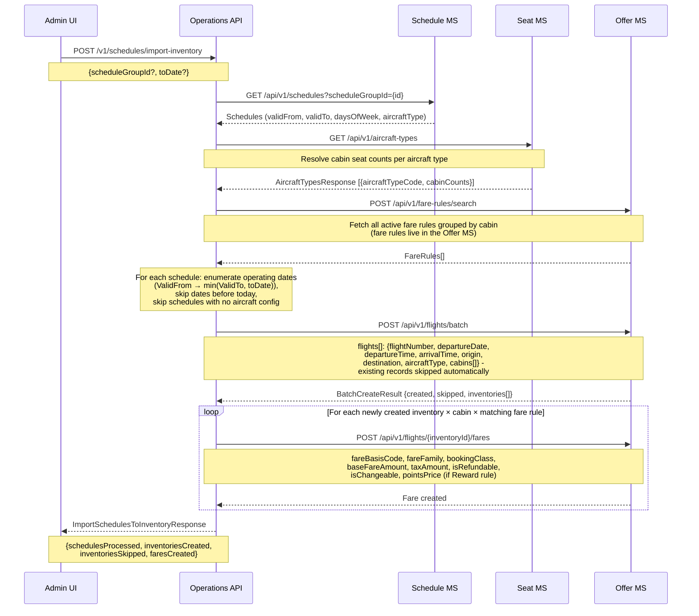
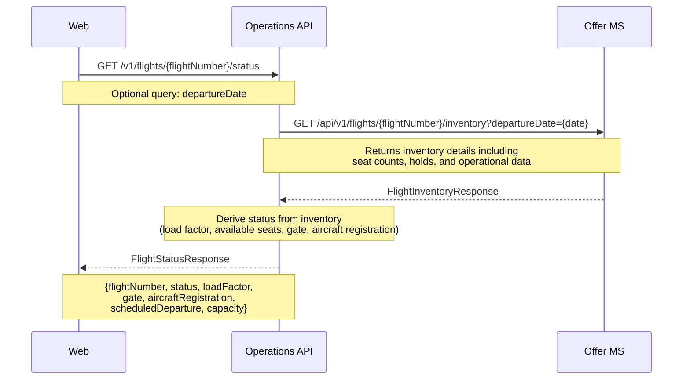
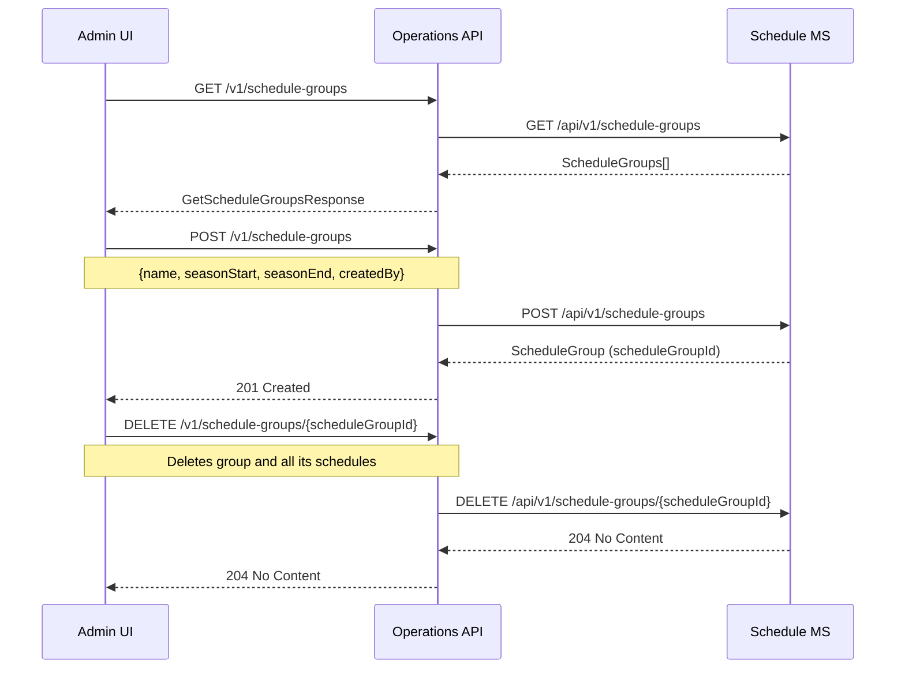

# Schedule — sequence diagrams

Covers flight schedule management: SSIM file import, schedule-to-inventory import, and schedule retrieval. Also covers the operational flight status query used by the admin/operations layer.

---

## SSIM schedule import (admin)

---

## Schedule retrieval (admin)

---

## Import schedules to inventory (admin)

Converts stored schedule records into offer inventory. Fetches aircraft configurations from the Seat MS and fare rules from the Offer MS, then batch-creates flight inventory and applies fare rules — all via the Offer MS.

---

## Real-time flight status query

Flight status is derived from Offer MS inventory data (load factor, capacity, operational flags), not from the Schedule MS.

---

## Schedule group management

