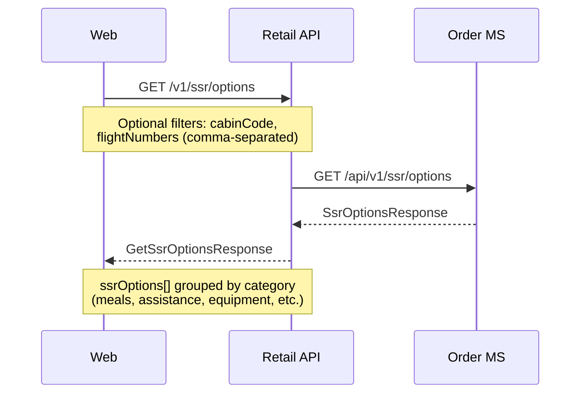
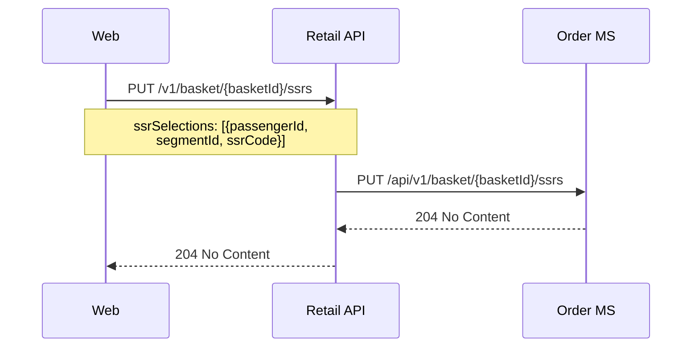
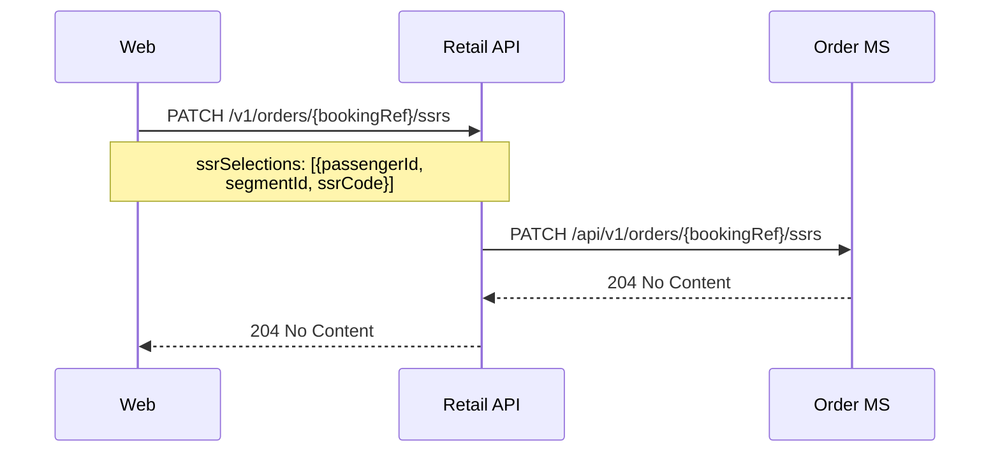
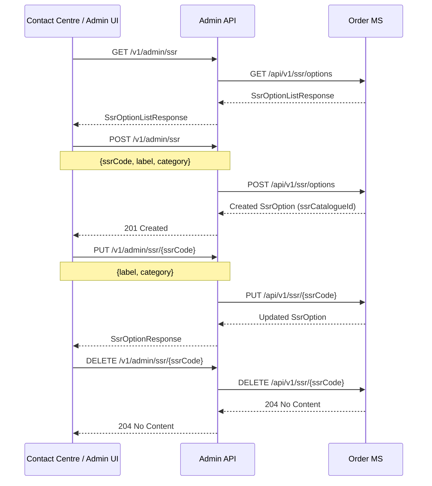

# SSR — sequence diagrams

Covers Special Service Request flows: retrieval of the SSR catalogue for the booking journey, and admin management of SSR catalogue entries.

---

## SSR options retrieval (booking flow)

---

## Update basket SSRs

---

## Update order SSRs post-sale

---

## Admin — SSR catalogue management

The Admin API orchestrates all mutations against the SSR catalogue stored in the Order microservice. These endpoints require a valid staff JWT token.

