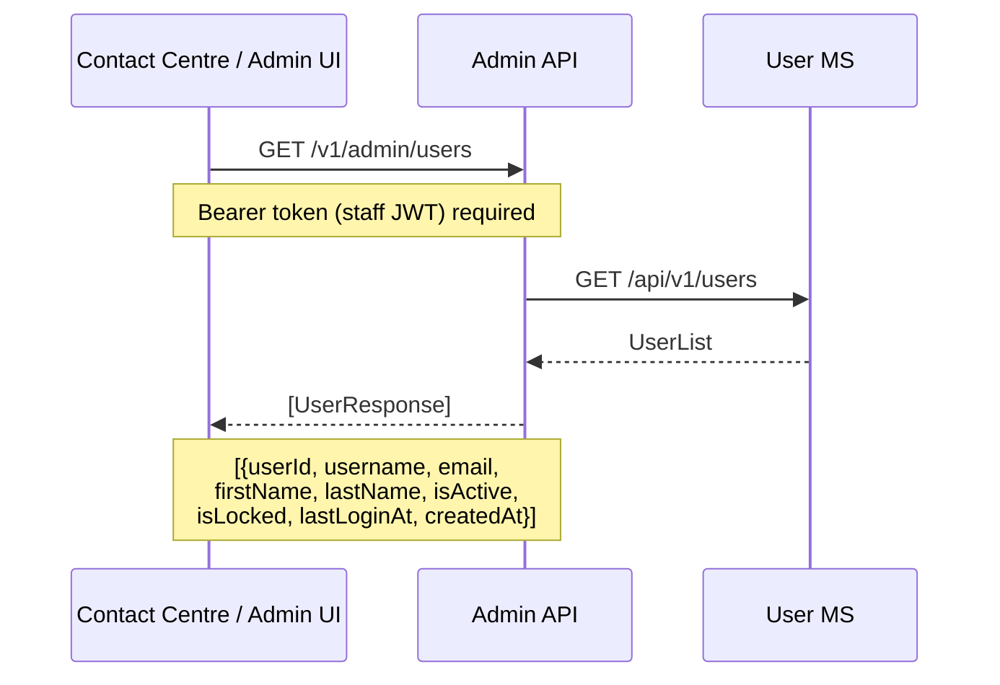
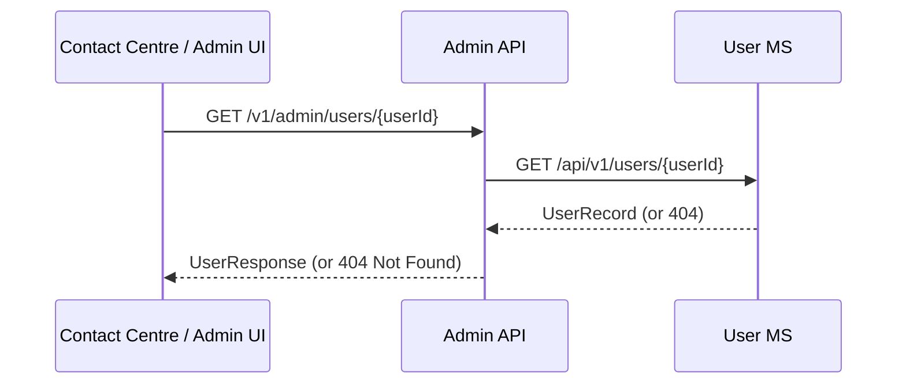
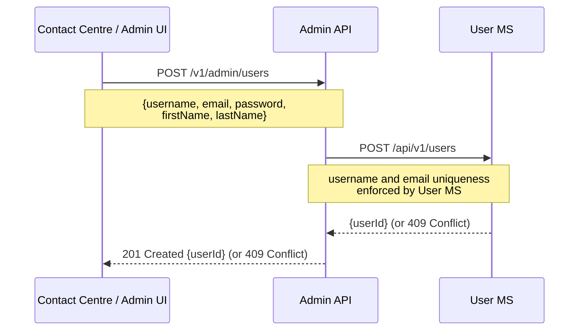
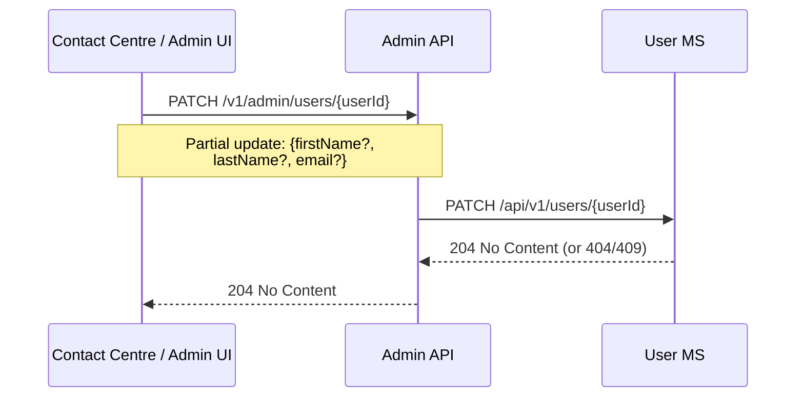
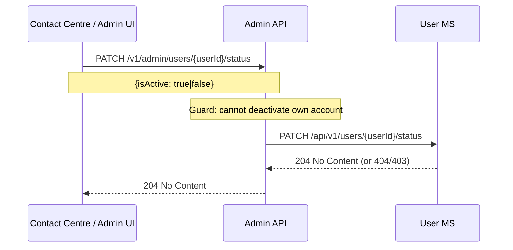
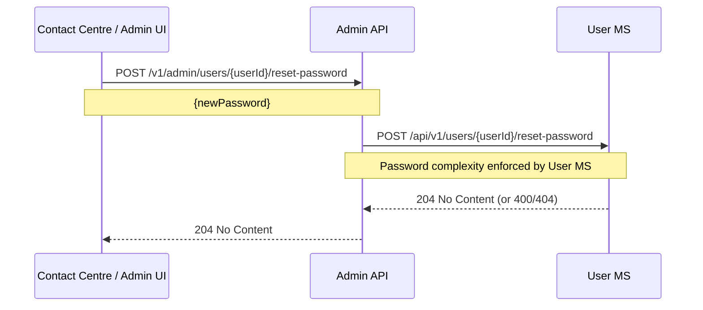
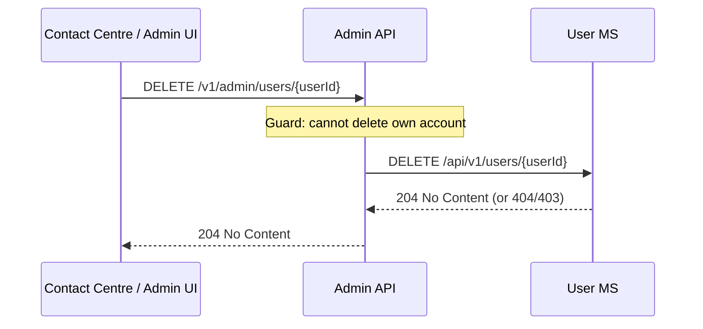

# User — sequence diagrams

Covers employee user account management via the Admin API. All user management endpoints require a valid staff JWT token (validated by `TerminalAuthenticationMiddleware`). All operations delegate to the User microservice.

---

## Staff login

```mermaid
sequenceDiagram
    participant Terminal as Contact Centre / Admin UI
    participant AdminAPI as Admin API
    participant UserMS as User MS

    Terminal->>AdminAPI: POST /v1/auth/login
    Note over Terminal,AdminAPI: {username, password}
    AdminAPI->>UserMS: POST /api/v1/auth/login
    Note over AdminAPI,UserMS: Validate credentials;<br/>check account not locked/inactive;<br/>issue signed JWT
    UserMS-->>AdminAPI: {accessToken, userId, expiresAt}
    AdminAPI-->>Terminal: LoginResponse
    Note over AdminAPI,Terminal: {accessToken, userId,<br/>expiresAt, tokenType=Bearer}
```

---

## List all users



---

## Get single user



---

## Create user



---

## Update user



---

## Set user active/inactive status



---

## Unlock locked account

```mermaid
sequenceDiagram
    participant Terminal as Contact Centre / Admin UI
    participant AdminAPI as Admin API
    participant UserMS as User MS

    Terminal->>AdminAPI: POST /v1/admin/users/{userId}/unlock
    AdminAPI->>UserMS: POST /api/v1/users/{userId}/unlock
    Note over AdminAPI,UserMS: Clears lockout; resets failed<br/>login attempt counter
    UserMS-->>AdminAPI: 204 No Content (or 404)
    AdminAPI-->>Terminal: 204 No Content
```

---

## Reset user password (admin)



---

## Delete user


