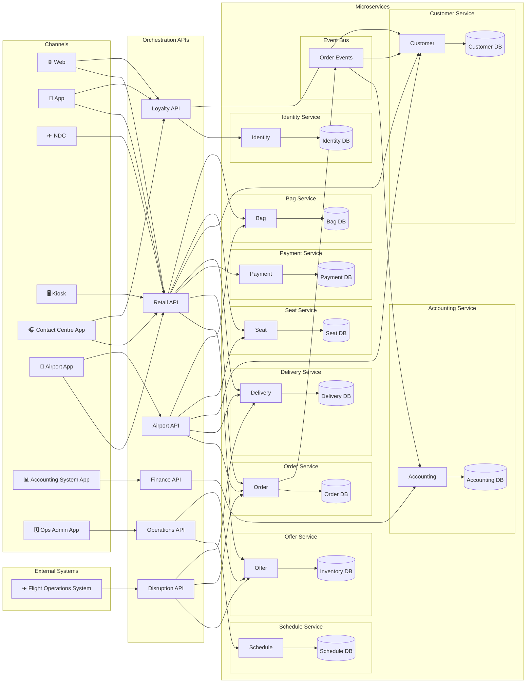

# System Overview

## Overview

A Modern Airline Retailing system built on offer and order capability.

## Domain Capability Model

- **Retailing** — channel-facing sales and booking orchestration
  - Search & Offers (direct flight search, connecting itinerary assembly, stored offer snapshots, offer expiry)
  - Basket Management (creation, lifecycle, passenger details, ticketing time limit, expiry and inventory release)
  - Order Confirmation / Bookflow (payment authorisation/settlement, e-ticket issuance, inventory hold/sell, manifest population)
  - Reward Booking (points-priced offers, loyalty auth, points balance verification, two-stage authorise/settle, lead PAX autofill, tax-only card payment)
  - Ancillary Selection (seat selection bookflow/post-sale, bag selection bookflow/post-sale, SSR selection/management)
  - Manage Booking (PAX detail updates and reissuance, voluntary flight change with reshop/add-collect, voluntary cancellation and refund)
  - Check-In (booking retrieval, APIS capture, seat assignment no charge at OLCI, bag purchase, boarding card/BCBP generation)

- **Offer** — flight inventory, pricing, and stored offer management
  - Flight Inventory (creation per flight/cabin/date, seat hold/sell/release, inventory cancellation IROPS)
  - Fares (definition/retrieval per inventory, validity and conditions)
  - Stored Offers (search and snapshot creation, retrieval and consumption control)
  - Seat Offers (per-seat availability and offer generation, seat reservation and status updates)

- **Order** — booking lifecycle and post-sale state management
  - Basket (creation, accumulation, confirmation, expiry/cleanup)
  - Confirmed Orders (creation, retrieval, PAX updates, seat/bag order items, SSR items and cut-off)
  - Post-Sale Changes (flight change with segment swap/add-collect, cancellation, IROPS rebooking with fare override)
  - Check-In Recording (APIS data capture and check-in status)

- **Payment** — payment authorisation, settlement, and refunds
  - Authorisation & Settlement (card auth per type, settlement after confirmation, partial/full refund)
  - Audit & Compliance (immutable payment event log, PCI DSS scoping)

- **Delivery** — travel document issuance and departure operations
  - E-Ticketing (issuance, reissuance, void, IATA format compliance)
  - Flight Manifest (creation, update, removal, check-in status, SSR propagation)
  - Boarding Cards (generation, BCBP barcode string assembly)

- **Seat** — seatmap definitions and fleet-wide seat pricing rules
  - Seatmap Definitions (aircraft type, cabin layout, seat attributes)
  - Seat Pricing (position-based pricing, Business/First no-charge policy)

- **Bag** — checked baggage policy and ancillary pricing
  - Bag Policy (free allowance by cabin, weight limits)
  - Bag Pricing & Offers (additional bag pricing by sequence, stored bag offer snapshots)

- **Schedule** — flight schedule definition and bulk inventory generation
  - Schedule Management (creation with route/times/days/aircraft/window, operating date enumeration via DaysOfWeek bitmask)
  - Inventory Generation (bulk FlightInventory and Fare record creation, FlightsCreated count tracking)

- **Disruption** — IROPS event orchestration across affected bookings
  - Flight Delay (propagation to segments/manifests, material schedule change reissuance threshold)
  - Flight Cancellation (inventory closure, affected order/manifest retrieval, replacement flight search, passenger rebooking, e-ticket void/reissuance/manifest recreation)
  - Reliability (idempotency via disruptionEventId, async processing for large loads)

- **Loyalty** — loyalty programme membership, authentication, and points
  - Registration & Verification (member enrolment, email verification)
  - Authentication (login, token refresh, logout, password reset)
  - Account Management (profile retrieval/update, two-step email change)
  - Points & Tiers (accrual from OrderConfirmed event, balance/history, tier config/evaluation)

- **Identity** — authentication credentials and session security
  - Credential Management (account creation/deletion, Argon2id password hashing, password reset)
  - Session Management (JWT access token 15-min TTL, refresh token rotation single-use, logout/revocation)
  - Email Verification (token generation/validation, email change with duplicate protection)

- **Customer** — loyalty profile, tier status, and points ledger
  - Profile Management (creation, retrieval, field updates)
  - Points Ledger (append-only transaction log, running balance snapshot, accrual/redemption/adjustment/expiry)
  - Points Redemption (two-stage authorise/settle, hold/deduction with redemption reference, reversal on failure)
  - Tier Management (config/threshold management, tier evaluation against TierProgressPoints)

- **Accounting** — financial records, revenue attribution, refund tracking, points liability
  - Revenue Recording (order/ancillary revenue via OrderConfirmed)
  - Reward Booking Accounting (points liability, reversal, adjustment tracking)
  - Refund Management (identification from OrderCancelled, processing/settlement tracking)
  - Reporting (balance sheet, P&L views, audit trail)

- **Operations** — flight schedule administration
  - Schedule Administration (submission, validation, inventory count tracking)

## High-Level System Architecture

## Key Components

### Channels

- **Web** — primary customer-facing booking website
- **App** — mobile application
- **NDC** — New Distribution Capability channel for OTAs and GDSs
- **Kiosk** — airport self-service kiosks
- **Contact Centre App** — agent terminal for phone/chat bookings
- **Airport App** — check-in desks and gate operations
- **Accounting System App** — finance team reporting and reconciliation
- **Ops Admin App** — schedule and operations administration

### External Systems

- **Flight Operations System (FOS)** — source of disruption events (delays, cancellations). Pushes IROPS notifications into the Disruption API.

### Orchestration APIs

- **Retail API** — primary sales orchestration layer; coordinates search, basket, payment, ticketing, and post-sale flows across Offer, Order, Payment, Delivery, Customer, Seat, and Bag microservices.
- **Loyalty API** — handles member registration, authentication, profile management, and points operations via Identity and Customer microservices.
- **Airport API** *(future)* — check-in, boarding, and gate operations; coordinates Order, Delivery, Customer, Seat, and Bag microservices.
- **Finance API** *(future)* — financial reporting and reconciliation; routes to Accounting microservice.
- **Disruption API** — receives IROPS events from FOS and orchestrates rebooking across Offer, Order, and Delivery microservices.
- **Operations API** — schedule submission and inventory generation via Schedule and Offer microservices.

### Microservices

- **Offer** — flight inventory, fares, stored offers, and seat offers. Owns Inventory DB.
- **Order** — basket lifecycle, confirmed orders, post-sale changes, check-in recording. Owns Order DB.
- **Payment** — card authorisation, settlement, refunds, and audit log. Owns Payment DB.
- **Delivery** — e-tickets, manifests, and boarding cards. Owns Delivery DB.
- **Customer** — loyalty profiles, points ledger, tier management. Owns Customer DB.
- **Accounting** — revenue recording, refund tracking, points liability, reporting. Owns Accounting DB.
- **Seat** — seatmap definitions and fleet-wide seat pricing rules. Owns Seat DB.
- **Bag** — baggage policy, pricing, and bag offer snapshots. Owns Bag DB.
- **Schedule** — flight schedule definitions and bulk inventory generation. Owns Schedule DB.

## Cabin Classes

| Code | Name | Notes |
|------|------|-------|
| `F` | First Class | Available on selected A350-1000 (A351) long-haul routes |
| `J` | Business Class | All long-haul aircraft; seat selection included in fare at no ancillary charge |
| `W` | Premium Economy | A350-1000 (A351) and Boeing 787-9 (B789) aircraft |
| `Y` | Economy | All aircraft |

Where a cabin code appears in a schema column, API field, or JSON document, it must always be one of these four values. `CabinCode` is consistently typed as `CHAR(1)`.

## Flight Network

Apex Air (IATA carrier code **AX**) operates a hub-and-spoke network from London Heathrow (**LHR**).

| Region | Destinations | Flight Block | Aircraft |
|--------|-------------|--------------|----------|
| North America | New York JFK, Los Angeles LAX, Miami MIA, San Francisco SFO, Chicago ORD, Boston BOS | AX001–AX099 | A351, B789 |
| Caribbean | Bridgetown BGI, Kingston KIN, Nassau NAS | AX101–AX199 | A339 |
| East Asia | Hong Kong HKG, Tokyo NRT, Shanghai PVG, Beijing PEK | AX201–AX299 | A351, B789 |
| South-East Asia | Singapore SIN | AX301–AX399 | A351 |
| South Asia | Mumbai BOM, Delhi DEL, Bangalore BLR | AX401–AX499 | B789 |

### Fleet

- **A351** (Airbus A350-1000) — flagship widebody
- **B789** (Boeing 787-9) — long-haul workhorse
- **A339** (Airbus A330-900) — medium-to-long-haul Caribbean

## Technical Considerations

- Microservices built in C# as Azure Functions (isolated)
- Orchestration API → Microservice authentication uses Azure Function Host Keys via `x-functions-key` header, stored in Azure Key Vault
- Single SQL Server with logical schema separation (`offer.*`, `order.*`, `payment.*`, etc.)
- Front-end websites built in latest Angular, hosted as Azure Static Web Apps
- Aircraft type codes: 4-char (manufacturer prefix + 3-digit variant, e.g. A351, B789)
- JSON columns use `NVARCHAR(MAX)` with `ISJSON` check constraints; computed columns for indexable JSON properties
- `createdAt`/`updatedAt` are database-generated only, never written by application, never in request bodies
- StoredOffer expiry: 60-minute `ExpiresAt`, validated before consumption, background purge job
- Offer consumption: `IsConsumed` set to 1 atomically to prevent duplicate use
- Basket lifecycle: transient Order DB record, hard-deleted on sale, 60-minute expiry matching StoredOffer
- Optimistic Concurrency Control: integer `Version` column on booking/ticket records
- Payment DB: `PaymentReference` is shared key between Payment and Order domains
- SeatPricing: fleet-wide position-based pricing, Retail API merges layout + pricing + availability
- Delivery DB: owns Ticket, Manifest, Document tables; never reads from `order.Order` directly
- Manifest seatmap validation: orchestration layer validates `SeatNumber` against active seatmap before calling Delivery MS
- Delivery accounting events: `TicketIssued` and `DocumentIssued` events published to event bus
- Disruption API idempotency: `disruptionEventId` deduplication
- IROPS fare override: `reason=FlightCancellation` waives fare change restrictions
- Disruption rebooking prioritisation: cabin class → loyalty tier → booking date

## Airline Context

Apex Air, IATA carrier code **AX**. Premium transatlantic and long-haul carrier, ~50 aircraft across B789, A339, A351. Hub at London Heathrow (LHR). Participates in IATA ONE Order.

## Glossary

- **APIS** — Advance Passenger Information System
- **BCBP** — Bar Coded Boarding Pass (IATA Resolution 792)
- **CMK** — Customer-Managed Key
- **CORS** — Cross-Origin Resource Sharing
- **FOS** — Flight Operations System
- **GDS** — Global Distribution System
- **IATA** — International Air Transport Association
- **IROPS** — Irregular Operations (delays, cancellations, diversions, aircraft swaps)
- **MCT** — Minimum Connection Time
- **NDC** — New Distribution Capability (IATA standard)
- **OLCI** — Online Check In
- **OTA** — Online Travel Agent
- **PAX** — Passenger
- **PCI DSS** — Payment Card Industry Data Security Standard
- **PII** — Personally Identifiable Information
- **PNR** — Passenger Name Record
- **RBAC** — Role-Based Access Control
- **SSR** — Special Service Request (IATA four-character code, e.g. WCHR, VGML)
- **TLS** — Transport Layer Security
- **UK GDPR** — United Kingdom General Data Protection Regulation
